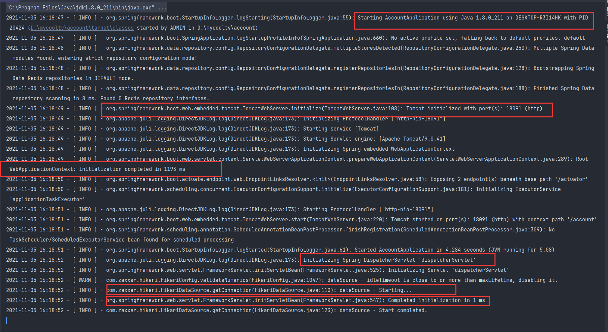
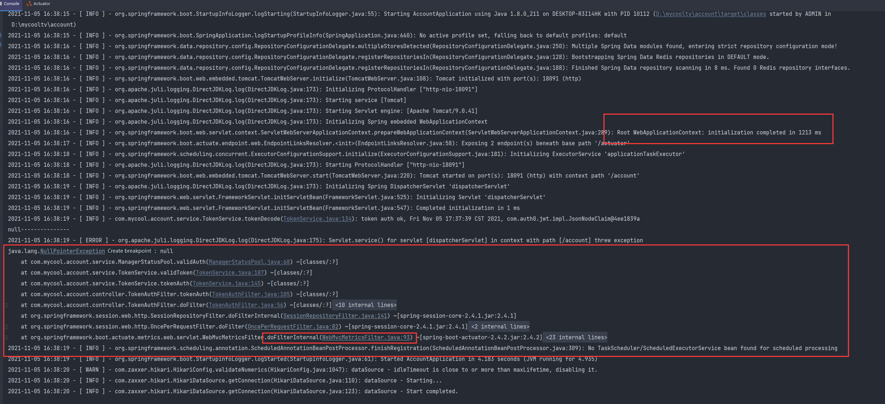

## 1.Spring Bean 空指针异常

在项目启动过程中，有众多阶段。




例如：

如果WebApplicationContext: initialization completed  没有完成，此时接口访问会响应：Error: connect ECONNREFUSED 127.0.0.1:18091


如果WebApplicationContext: initialization completed  ，但spring bean  还未初始化成功，此时接口访问有可能报 注入的Bean 空指针异常

例如：在Filter中，注入spring bean （如在filter中注入RedisTemplate Bean）,在spring bean 未初始化成功之前访问接口，报如下错误。




如果项目成功启动则可以正常访问。


## 2.空指针异常

例如：

```java
	public void test(){
		String[] s=null;
		ArrayList<String> list = new ArrayList<>();
		Collections.addAll(list, s);
	}
```

报空指针异常：

```java
java.lang.NullPointerException
	at java.util.Collections.addAll(Collections.java:5400)
	at com.yly.java.stream.TestStreamAPI1.test23(TestStreamAPI1.java:107)
	at sun.reflect.NativeMethodAccessorImpl.invoke0(Native Method)
	......
    ......
```


### 什么是空指针异常?

空指针异常指的是当前的对象指向了一段`null`的内存区域，而开发者用`null`进行了其他操作，引发的JVM堆栈异常。
 编译时程序无法推断出这个对象是否会为`null`，而在程序运行的时候，它执行了`null`所不具备的能力，这个时候JVM会向你抛出`NullPointException`,告诉你，这个地方的引用是空的，无法继续往下执行了。

### 经典案例

User

```java
package exception;

import lombok.Data;

import java.util.Collections;
import java.util.List;

@Data
public class User {
    private String userName;
    private String password;
    private Integer age;

    /**
     * 返回空集合，用于演示NPE
     * @return
     */
    public static List<User> getNullInstances(){
        return null;
    }
}

```

- **业务对象为空，导致程序报NPE**

```java
User user = getDataById(100);
// 如果根据id:100无法查询到具体的User实例，那么此时的user就是null,那么null.getxxx()就会触发NPE了
String userName = user.getUserName();
```

- **集合操作时没有进行判空，导致程序报NPE**

```java
        List<User> userList = User.getNullInstances();
        System.out.println(userList.size());
```

- **回收资源的时候，没有进行判空处理**

  ```java
          BufferedReader bufferedReader = null;
          try {
              File file = new File("C:\\Users\\95152\\Desktop\\sql.txt");
              FileReader fileReader = new FileReader(file);
              bufferedReader = new BufferedReader(fileReader);
              String readLine = bufferedReader.readLine();
              System.out.println(readLine);
          } catch (IOException e) {
              e.printStackTrace();
          } finally {
              try {
                  // 这里的bufferedReader可能为空，直接调用close可能会报错
                  bufferedReader.close();
              } catch (IOException e) {
                  e.printStackTrace();
              }
          }
  ```


### 高发区域

- 进行数据库查询操作时，未进行判空就直接使用，容易引发NPE
- 远程调用或者Http调用第三方接口时，未进行判空就进行了下一步处理，容易引发NPE
- 从中间件获取数据时，未进行判空就直接处理，容易引发NPE
- 集合操作时，使用了null作为了操作目标，容易引发NPE
- toString()

### 如何保持代码的鲁棒性，避免NPE?

- 对对象或者集合进行操作时，需要检验是否会出现空的情况,对对象或者集合判空校验。
- 如果编写了工具类有定义返回的结果集，那么不要直接返回`null`，抛出异常或者返回空对象或许更加好
- 使用Optional
- 使用断言
- String可以使用StringUtils.isBlank()进行判空，集合可以使用CollectionUtils.isEmpty()进行判空
- JDK7提供了一个Objects类，使用Objects.isNull()可以帮助你写出可读性更友好的代码

## 3.日期与时间异常

接口传输时间时，尽量不要用字符串表示，否侧可能出现时区错误。如，传08:00给欧洲，他用他们的服务器（即它们的时区）转换成时间戳并传输给我们，哪个时间戳用我们的时区转换得到错误的结果。例如他们是gmt+0时区，需要他们把时间从08:00转换成00:00,然后再转换成时间戳，或者我们用gmt+0的时区转换时间戳为日期。


### 

