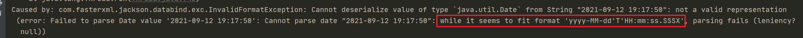
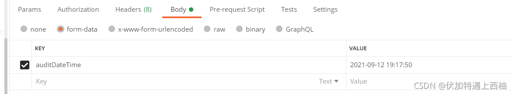
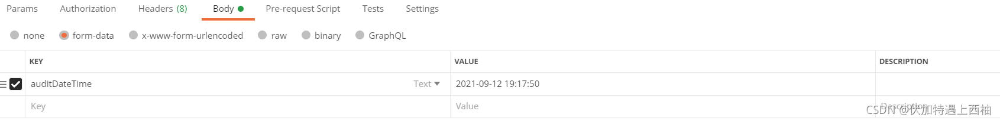

## 1、Spring Bean 空指针异常

在项目启动过程中，有众多阶段。


例如：

如果WebApplicationContext: initialization completed  没有完成，此时接口访问会响应：Error: connect ECONNREFUSED 127.0.0.1:18091


如果WebApplicationContext: initialization completed  ，但spring bean  还未初始化成功，此时接口访问有可能报 注入的Bean 空指针异常

例如：在Filter中，注入spring bean （如在filter中注入RedisTemplate Bean）,在spring bean 未初始化成功之前访问接口，报如下错误。


如果项目成功启动则可以正常访问。


## 2、空指针异常

例如：

```java
	public void test(){
		String[] s=null;
		ArrayList<String> list = new ArrayList<>();
		Collections.addAll(list, s);
	}
```

报空指针异常：

```java
java.lang.NullPointerException
	at java.util.Collections.addAll(Collections.java:5400)
	at com.yly.java.stream.TestStreamAPI1.test23(TestStreamAPI1.java:107)
	at sun.reflect.NativeMethodAccessorImpl.invoke0(Native Method)
	......
    ......
```


### 什么是空指针异常?

空指针异常指的是当前的对象指向了一段`null`的内存区域，而开发者用`null`进行了其他操作，引发的JVM堆栈异常。
 编译时程序无法推断出这个对象是否会为`null`，而在程序运行的时候，它执行了`null`所不具备的能力，这个时候JVM会向你抛出`NullPointException`,告诉你，这个地方的引用是空的，无法继续往下执行了。

### 经典案例

User

```java
package exception;

import lombok.Data;

import java.util.Collections;
import java.util.List;

@Data
public class User {
    private String userName;
    private String password;
    private Integer age;

    /**
     * 返回空集合，用于演示NPE
     * @return
     */
    public static List<User> getNullInstances(){
        return null;
    }
}

```

- **业务对象为空，导致程序报NPE**

```java
User user = getDataById(100);
// 如果根据id:100无法查询到具体的User实例，那么此时的user就是null,那么null.getxxx()就会触发NPE了
String userName = user.getUserName();
```

- **集合操作时没有进行判空，导致程序报NPE**

```java
        List<User> userList = User.getNullInstances();
        System.out.println(userList.size());
```

- **回收资源的时候，没有进行判空处理**

  ```java
          BufferedReader bufferedReader = null;
          try {
              File file = new File("C:\\Users\\95152\\Desktop\\sql.txt");
              FileReader fileReader = new FileReader(file);
              bufferedReader = new BufferedReader(fileReader);
              String readLine = bufferedReader.readLine();
              System.out.println(readLine);
          } catch (IOException e) {
              e.printStackTrace();
          } finally {
              try {
                  // 这里的bufferedReader可能为空，直接调用close可能会报错
                  bufferedReader.close();
              } catch (IOException e) {
                  e.printStackTrace();
              }
          }
  ```


### 高发区域

- 进行数据库查询操作时，未进行判空就直接使用，容易引发NPE
- 远程调用或者Http调用第三方接口时，未进行判空就进行了下一步处理，容易引发NPE
- 从中间件获取数据时，未进行判空就直接处理，容易引发NPE
- 集合操作时，使用了null作为了操作目标，容易引发NPE
- toString()

### 如何保持代码的鲁棒性，避免NPE?

- 对对象或者集合进行操作时，需要检验是否会出现空的情况,对对象或者集合判空校验。
- 如果编写了工具类有定义返回的结果集，那么不要直接返回`null`，抛出异常或者返回空对象或许更加好
- 使用Optional
- 使用断言
- String可以使用StringUtils.isBlank()进行判空，集合可以使用CollectionUtils.isEmpty()进行判空
- JDK7提供了一个Objects类，使用Objects.isNull()可以帮助你写出可读性更友好的代码

### 踩过的坑

// 容器 空指针

```java
  List<GroupGuestWrap> collect1 = groupGuestWraps.stream().filter(item -> item.getGroupGuestId().equals(groupGuestId)).collect(Collectors.toList());

  List<GroupGuestWrap.Room> rooms = collect1.get(0).getRooms();
  collect1 如果为空列表，此时会空指针异常
```


select  空指针

```java
  Integer maxSort(Integer mediaVendorId);
```

```xml
  <select id="maxSort" resultType="java.lang.Integer">
    select MAX(sort)
    from cms_media_type_of_media_vendor
    where media_vendor_id = #{mediaVendorId,jdbcType=INTEGER}
  </select>
```

如果 表里没有media_vendor_id等于某个值的记录，则 select 会返回 null 。如果直接使用返回的值，可能空指针异常（如对获得的值++）。

## 3、日期与时间异常

接口传输时间时，尽量不要用字符串表示，否侧可能出现时区错误。如，传08:00给欧洲，他用他们的服务器（即它们的时区）转换成时间戳并传输给我们，哪个时间戳用我们的时区转换得到错误的结果。例如他们是gmt+0时区，需要他们把时间从08:00转换成00:00,然后再转换成时间戳，或者我们用gmt+0的时区转换时间戳为日期。


## 4、util.date转TimeStamp问题

**问：**从页面接收的日期 先转为java.util.date 后 在转为TimeStamp类型插入数据库
现在的问题是 转为java.util.date 后，数据为Tue Jan 01 08:00:00 CST 2013
用

```
// 获取当前时间:
Date date = new Date();
Timestamp startTime = new Timestamp(date.getTime());
System.out.println(startTime);
```

转后得到的数据为

```
2022-01-05 12:28:22.309
```

后面多了一个.309

但是查询MySQL数据库里面 数据却为2022-01-05 12:28:22 ?

**答：**在jdk的帮助文档中写了关于这个。 一个与 java.util.Date 类有关的瘦包装器 (thin wrapper)，它允许 JDBC API 将该类标识为 SQL TIMESTAMP 值。它通过允许小数秒到纳秒级精度的规范来添加保存 SQL TIMESTAMP 小数秒值的能力。Timestamp 也提供支持时间戳值的 JDBC 转义语法的格式化和解析操作的能力。 计算 Timestamp 对象的精度为二者之一： 19 ，其为 yyyy-mm-dd hh:mm:ss 格式下的字符数 20 + s ，其为 yyyy-mm-dd hh:mm:ss.[fff...] 格式下的字符数，s 表示给定 Timestamp 的标度（其小数秒精度）。 注：此类型由 java.util.Date 和单独的毫微秒值组成。只有整数秒才会存储在 java.util.Date 组件中。小数秒（毫微秒）是独立存在的。传递不是 java.sql.Timestamp 实例的对象时，Timestamp.equals(Object) 方法永远不会返回 true，因为日期的毫微秒组件是未知的。因此，相对于 java.util.Date.equals(Object) 方法而言，Timestamp.equals(Object) 方法是不对称的。此外，hashcode 方法使用底层 java.util.Date 实现并因此在其计算中不包括毫微秒 你查数据的时候，应该是用MySQL的方法规范了它的输出格式。

一般情况下，日期时间类型的字段，resultMap 和 参数中不显示的指定时，mybatis会自动做类型映射成DATETIME（yyyy/MM/dd HH:MM:SS）；如果指定jdbcType="DATE"，则存入数据库和取出的时间格式yyyy/MM/dd 

## 5、时区差8小时问题解决

时区差八小时这个问题在程序员身上很普通

普及:

```
 注:采用+8:00格式,没有指定MySQL驱动版本的情况下它自动依赖的驱动高版本的mysql，这是由于数据库和系统时区差异所造成的，mysql默认的是美国的时区，而我们中国大陆要比他们迟8小时,在jdbc连接的url后面加上serverTimezone=GMT即可解决问题，如果需要使用gmt+8时区，需要写成GMT%2B8，否则会被解析为空。再一个解决办法就是使用低版本的MySQL jdbc驱动不会存在时区的问题。
这个时区要设置好，不然会出现时差， 
如果你设置serverTimezone=UTC，连接不报错， 
但是我们在用java代码插入到数据库时间的时候却出现了问题。 
比如在java代码里面插入的时间为：2018-06-24 17:29:56 
但是在数据库里面显示的时间却为：2018-06-24 09:29:56 
有了8个小时的时差 
UTC代表的是全球标准时间 ，但是我们使用的时间是北京时区也就是东八区，领先UTC八个小时。
```

解决方式如下

方式一:

当用new date()或者TimeZone时有8小时的时差问题：   

保证服务器时区为东八区时间即北京时间 服务启动的时候，将当前时区设置为GMT+8，代码如下：

```
	@SpringBootApplication
	public class Application {
	  @PostConstruct
	  void started() {
	  TimeZone.setDefault(TimeZone.getTimeZone("GMT+8"));
	//TimeZone.setDefault(TimeZone.getTimeZone("UTC"));
	//TimeZone.setDefault(TimeZone.getTimeZone("Asia/Shanghai"));
	}

public static void main(String[] args) { SpringApplication.run(Application.class, args); } }
```

这样就保证了Java程序的时区为北京东八区时间。

方式二 : 在application.yml中配置

```
spring:
   #解决前端取回日期少8个小时问题
    jackson:
	date-format: yyyy/MM/dd HH:mm:ss
	time-zone: GMT+8
    datasource:
      #基本属性
	url: jdbc:mysql://localhost:3306/gwork?useUnicode=true&characterEncoding=UTF-8&allowMultiQueries=true&useSSL=false&serverTimezone=GMT%2b8
```

方式三 : 数据库驱动连接上配置

```
 url: jdbc:mysql://localhost:3306/gwork?useUnicode=true&characterEncoding=UTF-8&allowMultiQueries=true&useSSL=false&serverTimezone=GMT%2b8
```

## 6、stream 错误用例

```java
 Map<Integer, List<MessageInfo>> collect = result.stream().collect(Collectors.groupingBy(MessageInfo::getGroupGuestId));
MessageInfo::getGroupGuestId 值如果为null ，则会抛出异常，所以要确保 MessageInfo::getGroupGuestId 得到的值不能为 null 。
```


## 7、sql  批量删除的错误

```java
 cmsMediaTypeOfMediaVendorMapper.batchDelete(relDel);
 cmsItemHotelMapper.selectByIdList(itemIdList);
```

```xml
<delete id="batchDelete">
    delete from cms_media_type_of_media_vendor
    where 1 = 1
    and id in
    <foreach collection="list" item="item" open="(" close=")" separator=",">
      #{item}
    </foreach>
</delete>

    <select id="selectByIdList" resultMap="BaseResultMap">
        select
        <include refid="Base_Column_List" />
        from cms_item_hotel
        where 1 = 1
        and itemId in
        <foreach collection="idList" item="item" open="(" close=")" separator=",">
            #{item}
        </foreach>
    </select>
```

如果此时 relDel 是null 或者大小为0 会出现sql语法错误

纠正：

```java
   if(CollectionUtils.isNotEmpty(relDel)){
        cmsMediaTypeOfMediaVendorMapper.batchDelete(relDel);
   }
```


## 8、InvalidFormatException

java日期转换报错：

```properties
Caused by: com.fasterxml.jackson.databind.exc.InvalidFormatException: Cannot deserialize value of type java.util.Date from String “2021-09-12 19:17:50”: not a valid representation (error: Failed to parse Date value ‘2021-09-12 19:17:50’: Cannot parse date “2021-09-12 19:17:50”: while it seems to fit format ‘yyyy-MM-dd’T’HH:mm:ss.SSSX’, parsing fails (leniency? null))
```

根据上述描述可以推断出，传入的是String类型的日期，用的是Date类型接收日期，导致反序列化报错



解决方案：

### 一、JsonFormat

添加依赖：

```xml
    <!--@JsonFormat所需依赖 -->
    <dependency>
            <groupId>com.fasterxml.jackson.core</groupId>
            <artifactId>jackson-annotations</artifactId>
            <jackson.version>2.11.3</jackson.version>
    </dependency>
```

```java
import org.springframework.format.annotation.DateTimeFormat;//springBoot自带的
import com.fasterxml.jackson.annotation.JsonFormat;


    @ApiModelProperty(value = "审核时间")
    @DateTimeFormat(pattern = "yyyy-MM-dd HH:mm:ss") 
    @JsonFormat(timezone = "GMT+8", pattern = "yyyy-MM-dd HH:mm:ss")
    private Date auditDateTime;

    @ApiModelProperty(value = "签署时间")[添加链接描述](https://www.cnblogs.com/cangqinglang/p/10083661.html)
    @DateTimeFormat(pattern = "yyyy-MM-dd HH:mm:ss") 
    @JsonFormat(timezone = "GMT+8", pattern = "yyyy-MM-dd HH:mm:ss") 
    private Date signingDateTime;
```

### 二、 @DateTimeFormat



注意

此方式只针对于请求参数的格式非json格式的,如果是json的则不会生效,需要使@JsonFormat
对于标准格式会自动转换(标准格式yyyy-MM-dd HH:mm:ss)

### 三、@JsonFormat(timezone = “GMT+8”, pattern = “yyyy-MM-dd HH:mm:ss”)

（用于请求体为json格式的请求）




说明：`将json中字符串类型的日期转换成Date类型`

```properties
{
        "auditDateTime": "2021-09-12 19:17:50",
        "signingDateTime": "2021-09-12 19:17:50"
}
```

注意:

### 两者区别

@DateTimeFormat
`用于请求体非json格式的请求`
@JsonFormat
`用于请求体为json格式的请求`
`将包含此注解的对象返回给前端时,也会沿用此注解的格式 (返回类型为json格式时)`


## 9、MySQL中的反引号


在MySQL语句中我们有时候经常会看到反引号(``),刚开始的时候不知道什么意思，我们写sql语句的时候，不加反引号也可以执行成功啊，那么，反引号到底起什么作用？

例：

```php
Select * from `member` order by posts desc limit 0,10;
```

它是为了区分MYSQL的保留字与普通字符而引入的符号。

举个例子：

```php
SELECT `select` from `test` WHERE `select`='字段值';
```

在test表中，有个select字段，如果不用反引号，MYSQL将把select视为保留字而导致出错，所以，有MYSQL保留字作为字段的，必须加上反引号来区分。

引号一般用在字段的值,如果字段值是字符或字符串，则要加引号，如：select='字段值'

不加反引号建的表不能包含MYSQL保留字，否则出错

反引号`，数字1左边的符号。

保留字不能用于表名，比如desc，此时需要加入反引号来区别，但使用表名时可忽略反引号。

```php
create table desc;//报错
create table `desc`;//成功
create table `test`;//成功
drop table `test`;//成功
```

保留字不能用于字段名，比如desc，此时也需要加入反引号，并且insert等使用时也要加上反引号。

```php
create table `test`（`desc` varchar(255)）;//成功 
insert into test(desc) values('fxf');//失败
insert into test(`desc`) values('fxf');//成功
```

mysql常见的保留字 使用mysql时一定要注意，不要使用它的保留字作为表名或者列名，否则会出现莫名其妙的错误。 昨天建了一个表，其中一列名为interval(时间间隔)，结果数据死都插不进去，最后才发现原来interval是mysql的保留字。 以后出现类似的错误要先想想是不是因为表名或列名冲突造成的啊。 从网上找了一个mysql的保留字列表，仅供参考。

| 第一列             | 第二列              | 第三列             |
| ------------------ | ------------------- | ------------------ |
| ADD                | ALL                 | ALTER              |
| ANALYZE            | AND                 | AS                 |
| ASC                | ASENSITIVE          | BEFORE             |
| BETWEEN            | BIGINT              | BINARY             |
| BLOB               | BOTH                | BY                 |
| CALL               | CASCADE             | CASE               |
| CHANGE             | CHAR                | CHARACTER          |
| CHECK              | COLLATE             | COLUMN             |
| CONDITION          | CONNECTION          | CONSTRAINT         |
| CONTINUE           | CONVERT             | CREATE             |
| CROSS              | CURRENT_DATE        | CURRENT_TIME       |
| CURRENT_TIMESTAMP  | CURRENT_USER        | CURSOR             |
| DATABASE           | DATABASES           | DAY_HOUR           |
| DAY_MICROSECOND    | DAY_MINUTE          | DAY_SECOND         |
| DEC                | DECIMAL             | DECLARE            |
| DEFAULT            | DELAYED             | DELETE             |
| DESC               | DESCRIBE            | DETERMINISTIC      |
| DISTINCT           | DISTINCTROW         | DIV                |
| DOUBLE             | DROP                | DUAL               |
| EACH               | ELSE                | ELSEIF             |
| ENCLOSED           | ESCAPED             | EXISTS             |
| EXIT               | EXPLAIN             | FALSE              |
| FETCH              | FLOAT               | FLOAT4             |
| FLOAT8             | FOR                 | FORCE              |
| FOREIGN            | FROM                | FULLTEXT           |
| GOTO               | GRANT               | GROUP              |
| HAVING             | HIGH_PRIORITY       | HOUR_MICROSECOND   |
| HOUR_MINUTE        | HOUR_SECOND         | IF                 |
| IGNORE             | IN                  | INDEX              |
| INFILE             | INNER               | INOUT              |
| INSENSITIVE        | INSERT              | INT                |
| INT1               | INT2                | INT3               |
| INT4               | INT8                | INTEGER            |
| INTERVAL           | INTO                | IS                 |
| ITERATE            | JOIN                | KEY                |
| KEYS               | KILL                | LABEL              |
| LEADING            | LEAVE               | LEFT               |
| LIKE               | LIMIT               | LINEAR             |
| LINES              | LOAD                | LOCALTIME          |
| LOCALTIMESTAMP     | LOCK                | LONG               |
| LONGBLOB           | LONGTEXT            | LOOP               |
| LOW_PRIORITY       | MATCH               | MEDIUMBLOB         |
| MEDIUMINT          | MEDIUMTEXT          | MIDDLEINT          |
| MINUTE_MICROSECOND | MINUTE_SECOND       | MOD                |
| MODIFIES           | NATURAL             | NOT                |
| NO_WRITE_TO_BINLOG | NULL                | NUMERIC            |
| ON                 | OPTIMIZE            | OPTION             |
| OPTIONALLY         | OR                  | ORDER              |
| OUT                | OUTER               | OUTFILE            |
| PRECISION          | PRIMARY             | PROCEDURE          |
| PURGE              | RAID0               | RANGE              |
| READ               | READS               | REAL               |
| REFERENCES         | REGEXP              | RELEASE            |
| RENAME             | REPEAT              | REPLACE            |
| REQUIRE            | RESTRICT            | RETURN             |
| REVOKE             | RIGHT               | RLIKE              |
| SCHEMA             | SCHEMAS             | SECOND_MICROSECOND |
| SELECT             | SENSITIVE           | SEPARATOR          |
| SET                | SHOW                | SMALLINT           |
| SPATIAL            | SPECIFIC            | SQL                |
| SQLEXCEPTION       | SQLSTATE            | SQLWARNING         |
| SQL_BIG_RESULT     | SQL_CALC_FOUND_ROWS | SQL_SMALL_RESULT   |
| SSL                | STARTING            | STRAIGHT_JOIN      |
| TABLE              | TERMINATED          | THEN               |
| TINYBLOB           | TINYINT             | TINYTEXT           |
| TO                 | TRAILING            | TRIGGER            |
| TRUE               | UNDO                | UNION              |
| UNIQUE             | UNLOCK              | UNSIGNED           |
| UPDATE             | USAGE               | USE                |
| USING              | UTC_DATE            | UTC_TIME           |
| UTC_TIMESTAMP      | VALUES              | VARBINARY          |
| VARCHAR            | VARCHARACTER        | VARYING            |
| WHEN               | WHERE               | WHILE              |
| WITH               | WRITE               | X509               |
| XOR                | YEAR_MONTH          | ZEROFILL           |

注：MySQL允许部分关键字用做未引起来的识别符，因为许多人以前曾使用过它们。如：ACTION、BIT、DATE、ENUM、NO、TEXT、TIME、TIMESTAMP 所以为了安全起见可以在表名和字段名上都加上``。


## 10、把Array转变成ArrayList

为了把Array转变成ArrayList，程序员经常这样做：

```java
List<String> list = Arrays.asList(arr);
```

Arrays.asList返回的是Arrays内部的一个静态私有的ArrayList类，他不是Java.util.ArrayList类。Java.util.Arrays.ArrayList类有set(), get(), contains()这些方法，但是他没有任何加入元素的方法，所以他的大小是固定的。要创建一个真的ArrayList，你需要这样做：

```java
ArrayList<String> arrayList = new ArrayList<String>(Arrays.asList(arr));
```

ArrayList的构造函数可以接收一个Collection的类型，这个类型是java.util.Arrays.ArrayList的父类。


## 11、检查一个Array是否包含一个值

程序员经常这样写：

```java
Set<String> set = new HashSet<String>(Arrays.asList(arr));
return set.contains(targetValue);
```

这个代码是可以工作的，但是我们没有必要把一个list转变成set。转变成set其实是需要消耗时间的，我们可以简化成这样：

```java
Arrays.asList(arr).contains(targetValue);
```

或者

```java
for(String s: arr){
    if(s.equals(targetValue))
        return true;
}
return false;
```

第一个的代码可读性比第二个稍微好一点。


## 12、在一个循环中移除list中的一个元素

看下面这个在循环中移除元素的代码：

```java
ArrayList<String> list = new ArrayList<String>(Arrays.asList("a", "b", "c", "d"));
for (int i = 0; i < list.size(); i++) {
    list.remove(i);
}
System.out.println(list);
```

他的输出是：

 ```java
[b, d]
 ```

你也许会说，使用迭代是一个很好的在循环中删除元素的方式，你也许会觉得foreach在Java中其实就和迭代类似，其实事实上并不是这样，我们来看下面这个代码：

```java
ArrayList<String> list = new ArrayList<String>(Arrays.asList("a", "b", "c", "d"));
 
for (String s : list) {
    if (s.equals("a"))
        list.remove(s);
}
```

他会抛出ConcurrentModificationException。

改成下面这样就好了：

```java
ArrayList<String> list = new ArrayList<String>(Arrays.asList("a", "b", "c", "d"));
Iterator<String> iter = list.iterator();
while (iter.hasNext()) {
    String s = iter.next();
 
    if (s.equals("a")) {
        iter.remove();
    }
}
```

.next()必须在.remove()之前调用。在foreach循环中，编译器会在移除元素之后调用.next()，这样就会导致ConcurrentModificationException。具体你可以看看ArrayList.iterator()的源码。


## 13、Hanshtable 对比 HashMap

从算法定义的角度来说，hashtable是数据结构的名字。但是在Java中，数据结构的名字是HashMap。Hashtable和HashMap的最大的不同在于Hashtable是同步的。所以，很多时候，你并不需要使用Hashtable，HashMap就足够了。

具体可以参加这两篇文章：

[HashMap vs. TreeMap vs. Hashtable vs. LinkedHashMap](https://www.programcreek.com/2013/03/hashmap-vs-treemap-vs-hashtable-vs-linkedhashmap/)

[Top 10 questions about Map](https://www.programcreek.com/2013/09/top-9-questions-for-java-map/)


## 14、父类和子类的构造


这里会有一个编译错误，因为默认的父类构造函数没有定义。在java中，假如一个类没有定义构造函数，那么Java会插入一个默认的无参数的构造函数。假如一个构造函数已经在父类中定义了，比如这个例子中的Super(String s)，那么编译器就不会再插入默认的无参构造函数。

子类的构造函数，不管有参或者无参，会调用父类的无参构造函数。因为编译器会在子类的构造函数中默认插入父类的无参构造函数，而我们又没有定义父类的构造函数，所以会出现编译错误。

解决这个问题的方法也很简单，

1）加入一个无参构造函数到父类中就可以了。

```java
public Super(){
    System.out.println("Super");
}
```

2）或者把父类中的定义的构造函数去除

3）或者在子类中显示调用super(value)。

具体可以参见：

[Constructor of Super and Sub](https://www.programcreek.com/2013/04/what-are-the-frequently-asked-questions-about-constructors-in-java/)


