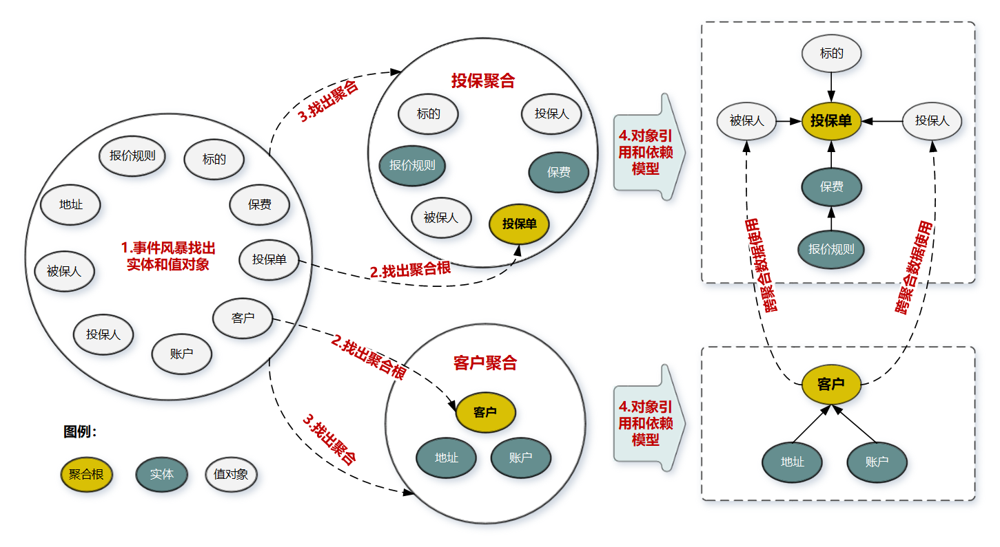
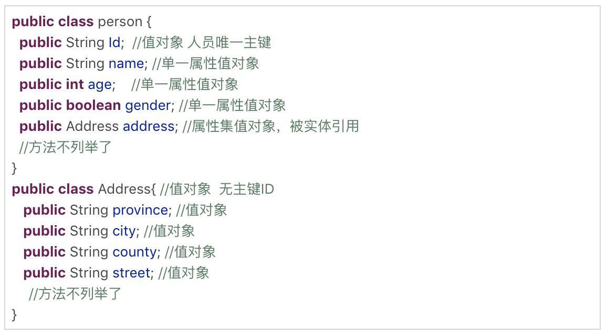
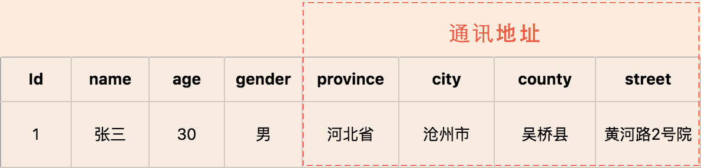
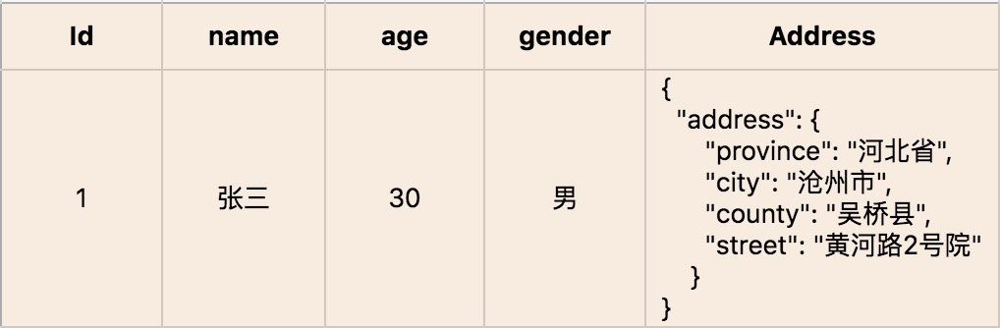
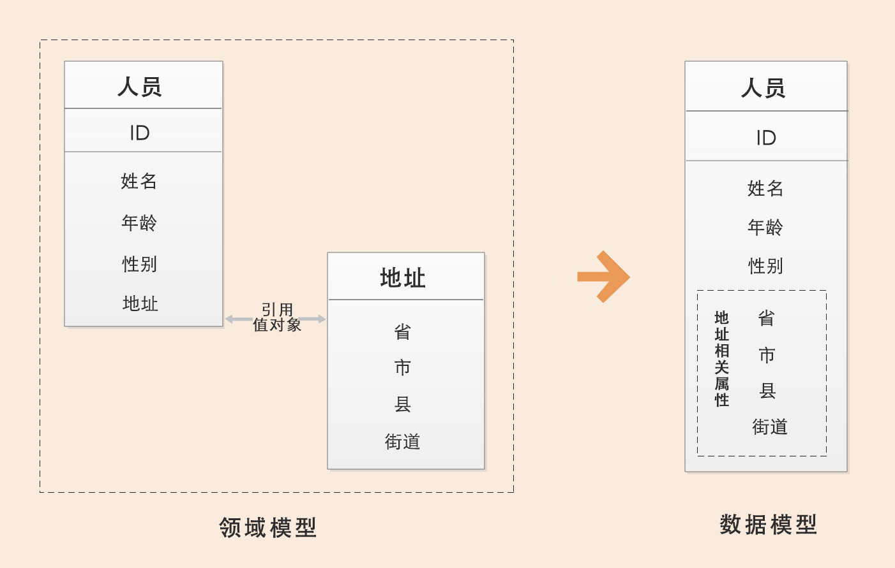
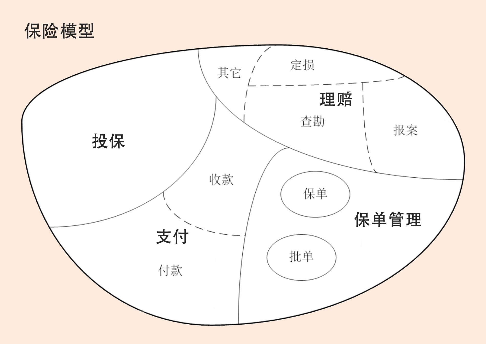
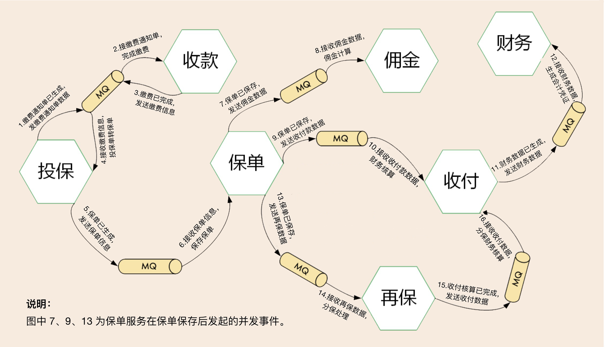
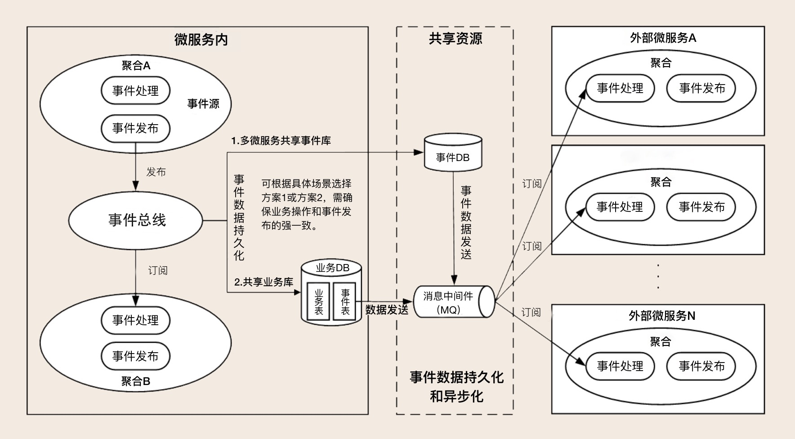
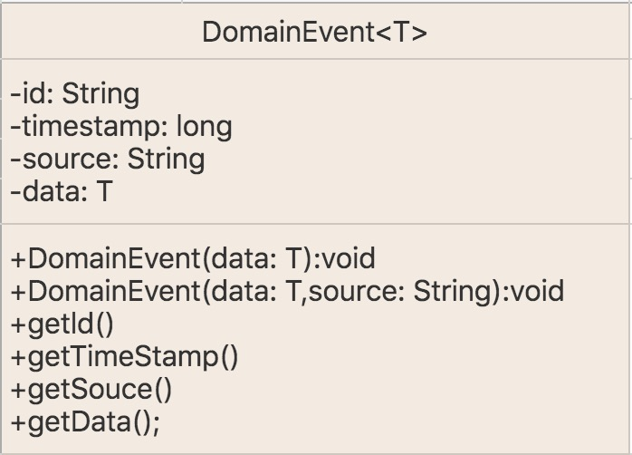
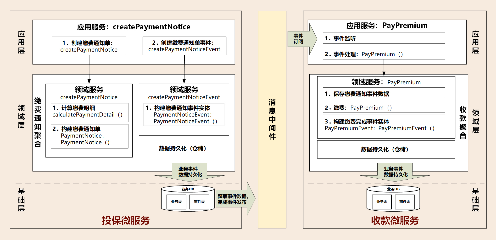

### DDD手记

#### 聚合

聚合就是由业务和逻辑紧密关联的实体和值对象组合而成的，**聚合**是**数据修改和持久化的基本单元**，每一个聚合对应一个仓储，实现数据的持久化。

**聚合**有一个聚合根和上下文边界，这个边界根据业务单一职责和高内聚原则，定义了聚合内部应该包含哪些实体和值对象，而聚合之间的边界是松耦合的。按照这种方式设计出来的微服务很自然就是“**高内聚**”、“**低耦合**”的。

**聚合**在DDD分层架构里属于领域层，领域层包含了多个聚合，共同实现核心业务逻辑。聚合内实体以充血模型实现**个体业务能力**，以及业务逻辑的高内聚。 跨多个实体的业务逻辑通过**领域服务**来实现，跨多个聚合的业务逻辑通过**应用服务**来实现。 

#### 聚合根

聚合根的主要目的是为了避免由于复杂数据模型缺少统一的业务规则控制，而导致聚合、实体之间数据不一致性的问题。 

传统数据模型中的每一个实体都是对等的，如果任由实体进行无控制地调用和数据修改，很可能会导致实体之间数据逻辑的不一致。而如果采用锁的方式则会增加软件的复杂度，也会降低系统的性能 。

如果把聚合比作组织，那**聚合根**就是这个组织的负责人。**聚合根**也称为**根实体**，**它不仅是实体**，**还是聚合的管理者** 。

首先它作为实体本身，拥有实体的属性和业务行为，实现自身的业务逻辑。 

其次它作为聚合的管理者，在聚合内部负责协调实体和值对象按照固定的业务规则协同完成共同的业务逻辑 。

最后在聚合之间，它还是聚合对外的接口人，以聚合根 ID 关联的方式接受外部任务和请求，在上下文内实现聚合之间的业务协同。也就是说，聚合之间通过聚合根 ID 关联引用，如果需要访问其它聚合的实体，就要先访问聚合根，再导航到聚合内部实体，外部对象不能直接访问聚合内实体 。

#### 怎样设计聚合？ 

DDD   领域建模通常采用事件风暴，它通常采用用例分析、场景分析和用户旅程分析等方法，通过头脑风暴列出所有可能的业务行为和事件，然后找出产生这些行为的领域对象，并梳理领域对象之间的关系，找出聚合根，找出与聚合根业务紧密关联的实体和值对象，再将聚合根、实体和值对象组合，构建聚合。

下面我们以保险的投保业务场景为例，看一下聚合的构建过程主要都包括哪些步骤。 

第 1 步：采用事件风暴，根据业务行为，梳理出在投保过程中发生这些行为的所有的实体和值对象，比如投保单、标的、客户、被保人等等。 

第 2 步：从众多实体中选出适合作为对象管理者的根实体，也就是聚合根。判断一个实体是否是聚合根，你可以结合以下场景分析：是否有独立的生命周期？是否有全局唯一 ID？是否可以创建或修改其它对象？是否有专门的模块来管这个实体。图中的聚合根分别是投保单和客户实体。 

第 3 步：根据业务单一职责和高内聚原则，找出与聚合根关联的所有紧密依赖的实体和值对象。**构建出 1 个包含聚合根（唯一）**、多个实体和值对象的对象集合，这个集合就是聚合。在图中我们构建了客户和投保这两个聚合 

第 4 步：在聚合内根据聚合根、实体和值对象的依赖关系，画出对象的引用和依赖模型。这里我需要说明一下：投保人和被保人的数据，是通过关联客户 ID 从客户聚合中获取的，在投保聚合里它们是投保单的值对象，这些值对象的数据是客户的冗余数据，即使未来客户聚合的数据发生了变更，也不会影响投保单的值对象数据。从图中我们还可以看出实体之间的引用关系，比如在投保聚合里投保单聚合根引用了报价单实体，报价单实体则引用了报价规则子实体 。

第 5 步：多个聚合根据业务语义和上下文一起划分到同一个限界上下文内。这就是一个聚合诞生的完整过程了 。

#### 聚合的一些设计原则 

1. 在一致性边界内建模真正的不变条件。聚合用来封装真正的不变性，而不是简单地将对象组合在一起。聚合内有一套不变的业务规则，各实体和值对象按照统一的业务规则运行，实现对象数据的一致性，边界之外的任何东西都与该聚合无关，这就是聚合能实现业务高内聚的原因。 
2. 设计小聚合。如果聚合设计得过大，聚合会因为包含过多的实体，导致实体之间的管理过于复杂，高频操作时会出现并发冲突或者数据库锁，最终导致系统可用性变差。而小聚合设计则可以降低由于业务过大导致聚合重构的可能性，让领域模型更能适应业务的变化。 
3. 通过唯一标识引用其它聚合。聚合之间是通过关联外部聚合根 ID 的方式引用，而不是直接对象引用的方式。外部聚合的对象放在聚合边界内管理，容易导致聚合的边界不清晰，也会增加聚合之间的耦合度 。
4. 通过唯一标识引用其它聚合。聚合之间是通过关联外部聚合根 ID 的方式引用，而不是直接对象引用的方式。外部聚合的对象放在聚合边界内管理，容易导致聚合的边界不清晰，也会增加聚合之间的耦合度 
5. 通过应用层实现跨聚合的服务调用。为实现微服务内聚合之间的解耦，以及未来以聚合为单位的微服务组合和拆分，应避免跨聚合的领域服务调用和跨聚合的数据库表关联

#### 聚合总结

聚合根的特点：聚合根是实体，有实体的特点，具有全局唯一标识，有独立的生命周期。一个聚合只有一个聚合根，聚合根在聚合内对实体和值对象采用直接对象引用的方式进行组织和协调，聚合根与聚合根之间通过 ID 关联的方式实现聚合之间的协同。 

实体的特点：有 ID 标识，通过 ID 判断相等性，ID 在聚合内唯一即可。状态可变，它依附于聚合根，其生命周期由聚合根管理。实体一般会持久化，但与数据库持久化对象不一定是一对一的关系。实体可以引用聚合内的聚合根、实体和值对象。值对象的特点：无 ID，不可变，无生命周期，用完即扔。值对象之间通过属性值判断相等
性。它的核心本质是值，是一组概念完整的属性组成的集合，用于描述实体的状态和特征。值对象尽量只引用值对象。 

聚合根的特点：聚合根是实体，有实体的特点，具有全局唯一标识，有独立的生命周期。一个聚合只有一个聚合根，聚合根在聚合内对实体和值对象采用直接对象引用的方式进行组织和协调，聚合根与聚合根之间通过 ID 关联的方式实现聚合之间的协同。 

#### 实体

在 DDD 中有这样一类对象，它们拥有唯一标识符，且标识符在历经各种状态变更后仍能保持一致。对这些对象而言，重要的不是其属性，而是其延续性和标识，对象的延续性和标识会跨越甚至超出软件的生命周期。我们把这样的对象称为实体。

1.实体的业务形态

在 DDD 不同的设计过程中，实体的形态是不同的。在战略设计时，实体是领域模型的一个重要对象。领域模型中的实体是多个属性、操作或行为的载体。在事件风暴中，我们可以根据命令、操作或者事件，找出产生这些行为的业务实体对象，进而按照一定的业务规则将依存度高和业务关联紧密的多个实体对象和值对象进行聚类，形成聚合。你可以这么理解，实体和值对象是组成领域模型的基础单元。 

2.实体的代码形态 

在代码模型中，**实体的表现形式是实体类**，这个类包含了实体的属性和方法，**通过这些方法实现实体自身的业务逻辑**。在 DDD 里，这些**实体类通常采用充血模型**，与这个**实体相关的所有业务逻辑都在实体类的方法中实现**，**跨多个实体的领域逻辑则**在领域服务中实现。 

3.实体的运行形态 

实体以 DO（领域对象）的形式存在，每个实体对象都有唯一的 ID。我们可以对一个实体对象进行多次修改，修改后的数据和原来的数据可能会大不相同。但是，由于它们拥有相同的 ID，它们依然是同一个实体。比如商品是商品上下文的一个实体，通过唯一的商品 ID 来标识，不管这个商品的数据如何变化，商品的 ID 一直保持不变，它始终是同一个商品。 

4.实体的数据库形态 

与传统数据模型设计优先不同，DDD 是先构建领域模型，针对实际业务场景构建实体对象和行为，再将实体对象映射到数据持久化对象 

在领域模型映射到数据模型时，一个实体可能对应 0 个、1 个或者多个数据库持久化对象。大多数情况下实体与持久化对象是一对一。在某些场景中，有些实体只是暂驻静态内存的一个运行态实体，它不需要持久化。比如，基于多个价格配置数据计算后生成的折扣实体。 

而在有些复杂场景下，实体与持久化对象则可能是一对多或者多对一的关系。比如，用户user 与角色 role 两个持久化对象可生成权限实体，一个实体对应两个持久化对象，这是一对多的场景。再比如，有些场景为了避免数据库的联表查询，提升系统性能，会将客户信息customer 和账户信息 account 两类数据保存到同一张数据库表中，客户和账户两个实体可根据需要从一个持久化对象中生成，这就是多对一的场景。 

#### 值对象

我们先看一下《实现领域驱动设计》一书中对值对象的定义：通过对象属性值来识别的对象，它将多个相关属性组合为一个概念整体。在 DDD 中用来描述领域的特定方面，并且是一个没有标识符的对象，叫作值对象。 

也就说，值对象**描述了领域中的一件东西，这个东西是不可变的**，它将不同的相关属性组合成了一个概念整体。当度量和描述改变时，可以用另外一个值对象予以替换。它可以和其它值对象进行相等性比较，且不会对协作对象造成副作用。这部分在后面讲“值对象的运行形态”时还会有例子 。

简单来说，值对象本质上就是一个集。那这个集合里面有什么呢？若干个用于描述目的、具有整体概念和不可修改的属性。那这个集合存在的意义又是什么？在领域建模的过程中，值对象可以保证属性归类的清晰和概念的完整性，避免属性零碎。这里我举个简单的例子，请看下面这张图 

人员实体原本包括：姓名、年龄、性别以及人员所在的省、市、县和街道等属性。这样显示地址相关的属性就很零碎了对不对？现在，我们可以将“省、市、县和街道等属性”拿出来构成一个“地址属性集合”，这个集合就是值对象了。 

##### 1.值对象的业务形态 

值对象是DDD领域模型中的一个基础对象，它跟实体一样都来源于事件风暴所构建的领域模型，都包含了若干个属性，它与实体一起构成聚合。 

我们不妨对照实体，来看值对象的业务形态，这样更好理解。本质上，实体是看得到、摸得着的实实在在的业务对象，实体具有业务属性、业务行为和业务逻辑。而值对象只是若干个属性的集合，只有数据初始化操作和有限的不涉及修改数据的行为，基本不包含业务逻辑。值对象的属性集虽然在物理上独立出来了，但在逻辑上它仍然是实体属性的一部分，用于描述实体的特征。 

在值对象中也有部分共享的标准类型的值对象，它们有自己的限界上下文，有自己的持久化对象，可以建立共享的数据类微服务，比如数据字典。 

##### 2.值对象的代码形态 

##### 3.值对象的运行形态 

实体实例化后的 DO 对象的业务属性和业务行为非常丰富，但值对象实例化的对象则相对简单和乏味。除了值对象数据初始化和整体替换的行为外，其它业务行为就很少了。值对象嵌入到实体的话，有这样两种不同的数据格式，也可以说是两种方式，分别是属性嵌入的方式和序列化大对象的方式。引用单一属性的值对象或只有一条记录的多属性值对象的实体，可以采用属性嵌入的方式嵌入。引用一条或多条记录的多属性值对象的实体，可以采用序列化大对象的方式嵌入。比如，人员实体可以有多个通讯地址，多个地址序列化后可以嵌入人员的地址属性。值对象创建后就不允许修改了，只能用另外一个值对象来整体替换 

如果你对这两种方式不够了解，可以看看下面的例子。 

案例 1：以属性嵌入的方式形成的人员实体对象，地址值对象直接以属性值嵌入人员实体中 

案例 2：以序列化大对象的方式形成的人员实体对象，地址值对象被序列化成大对象 Json串后，嵌入人员实体中。 

##### 4.值对象的数据库形态 

DDD 引入值对象是希望实现从“数据建模为中心”向“领域建模为中心”转变，减少数据库表的数量和表与表之间复杂的依赖关系，尽可能地简化数据库设计，提升数据库性能。 

传统的数据建模大多是根据数据库范式设计的，每一个数据库表对应一个实体，每一个实体的属性值用单独的一列来存储，一个实体主表会对应 N 个实体从表。而值对象在数据库持久化方面简化了设计，它的数据库设计大多采用非数据库范式，值对象的属性值和实体对象的属性值保存在同一个数据库实体表中。 

举个例子，还是基于上述人员和地址那个场景，实体和数据模型设计通常有两种解决方案：第一是把地址值对象的所有属性都放到人员实体表中，创建人员实体，创建人员数据表；第 二是创建人员和地址两个实体，同时创建人员和地址两张表。 

第一个方案会破坏地址的业务涵义和概念完整性，第二个方案增加了不必要的实体和表，需要处理多个实体和表的关系，从而增加了数据库设计的复杂性。 

那到底应该怎样设计，才能让业务含义清楚，同时又不让数据库变得复杂呢？ 

我们可以综合这两个方案的优势，扬长避短。在领域建模时，我们可以把地址作为值对象，人员作为实体，这样就可以保留地址的业务涵义和概念完整性。而在数据建模时，我们可以将地址的属性值嵌入人员实体数据库表中，只创建人员数据库表。这样既可以兼顾业务含义和表达，又不增加数据库的复杂度。 

值对象就是通过这种方式，简化了数据库设计，总结一下就是：在领域建模时，我们可以将部分对象设计为值对象，保留对象的业务涵义，同时又减少了实体的数量；在数据建模时，我们可以将值对象嵌入实体，减少实体表的数量，简化数据库设计。 

##### 5.值对象的优势和局限 

值对象是一把双刃剑，它的优势是可以简化数据库设计，提升数据库性能。但如果值对象使用不当，它的优势就会很快变成劣势。“知彼知己，方能百战不殆”，你需要理解值对象真正适合的场景。 

对象采用序列化大对象的方法简化了数据库设计，减少了实体表的数量，可以简单、清晰地表达业务概念。这种设计方式虽然降低了数据库设计的复杂度，但却无法满足基于值对象的快速查询，会导致搜索值对象属性值变得异常困难。 

值对象采用属性嵌入的方法提升了数据库的性能，但如果实体引用的值对象过多，则会导致实体堆积一堆缺乏概念完整性的属性，这样值对象就会失去业务涵义，操作起来也不方便。 

##### 6.实体和值对象的关系 

实体和值对象是微服务底层的最基础的对象，一起实现实体最基本的核心领域逻辑。 

值对象和实体在某些场景下可以互换，很多 DDD 专家在这些场景下，其实也很难判断到底将领域对象设计成实体还是值对象？可以说，值对象在某些场景下有很好的价值，但是并不是所有的场景都适合值对象。你需要根据团队的设计和开发习惯，以及上面的优势和局限分析，选择最适合的方法 。

关于值对象，我还要多说几句。其实，DDD 引入值对象还有一个重要的原因，就是到底领域建模优先还是数据建模优先？ 

DDD 提倡从领域模型设计出发，而不是先设计数据模型。前面讲过了，传统的数据模型设计通常是一个表对应一个实体，一个主表关联多个从表，当实体表太多的时候就很容易陷入无穷无尽的复杂的数据库设计，领域模型就很容易被数据模型绑架。可以说，值对象的诞生，在一定程度上，和实体是互补的 。

我们还是以前面的图示为例： 

在领域模型中人员是实体，地址是值对象，地址值对象被人员实体引用。在数据模型设计时，地址值对象可以作为一个属性集整体嵌入人员实体中，组合形成上图这样的数据模型；也可以以序列化大对象的形式加入到人员的地址属性中，前面表格有展示。 

从这个例子中，我们可以看出，同样的对象在不同的场景下，可能会设计出不同的结果。有些场景中，地址会被某一实体引用，它只承担描述实体的作用，并且它的值只能整体替换，这时候你就可以将地址设计为值对象，比如收货地址。而在某些业务场景中，地址会被经常修改，地址是作为一个独立对象存在的，这时候它应该设计为实体，比如行政区划中的地址信息维护。 

#### 限界上下文 

##### 什么是限界上下文？ 

我们知道语言都有它的语义环境，同样，通用语言也有它的上下文环境。为了避免同样的概念或语义在不同的上下文环境中产生歧义，DDD 在战略设计上提出了“限界上下文”这个概念，用来确定语义所在的领域边界。 

我们可以将限界上下文拆解为两个词：限界和上下文。限界就是领域的边界，而上下文则是语义环境。通过领域的限界上下文，我们就可以在统一的领域边界内用统一的语言进行交流。 

综合一下，我认为限界上下文的定义就是：用来封装通用语言和领域对象，提供上下文环境，保证在领域之内的一些术语、业务相关对象等（通用语言）有一个确切的含义，没有二义性。这个边界定义了模型的适用范围，使团队所有成员能够明确地知道什么应该在模型中实现，什么不应该在模型中实现。 

现在我们用一个保险领域的例子来说明下术语的边界。保险业务领域有投保单、保单、批单、赔案等保险术语，它们分别应用于保险的不同业务流程。 

1.客户投保时，业务人员记录投保信息，系统对应有投保单实体对象。 

2.缴费完成后，业务人员将投保单转为保单，系统对应有保单实体对象，保单实体与投保单实体关联。 

3.如客户需要修改保单信息，保单变为批单，系统对应有批单实体对象，批单实体与保单实体关联。 

4.如果客户发生理赔，生成赔案，系统对应有报案实体对象，报案实体对象与保单或者批
单实体关联。 

投保单、保单、批单、赔案等，这些术语虽然都跟保单有关，但不能将保单这个术语作用在保险全业务领域。因为术语有它的边界，超出了边界理解上就会出现问题。 

正如电商领域的商品一样，商品在不同的阶段有不同的术语，在销售阶段是商品，而在运输阶段则变成了货物。同样的一个东西，由于业务领域的不同，赋予了这些术语不同的涵义和职责边界，这个边界就可能会成为未来微服务设计的边界。看到这，我想你应该非常清楚了，领域边界就是通过限界上下文来定义的。 

##### 限界上下文和微服务的关系 

我想你买过车险吧，或者听过吧。车险承保的流程包含了投保、缴费、出单等几个主要流程。如果出险了还会有报案、查勘、定损、理算等理赔流程 

保险领域还是很复杂的，在这里我用一个简化的保险模型来说明下限界上下文和微服务的关系。这里还会用到我们在 [第 02 讲] 学到一些基础知识，比如领域和子域。 

首先，领域可以拆分为多个子领域。一个领域相当于一个问题域，领域拆分为子域的过程就是大问题拆分为小问题的过程。在这个图里面保险领域被拆分为：投保、支付、保单管理和理赔四个子域。

子域还可根据需要进一步拆分为子子域，比如，支付子域可继续拆分为收款和付款子子域。拆到一定程度后，有些子子域的领域边界就可能变成限界上下文的边界了。 

子域可能会包含多个限界上下文，如理赔子域就包括报案、查勘和定损等多个限界上下文（限界上下文与理赔的子子域领域边界重合）。也有可能子域本身的边界就是限界上下文边界，如投保子域。 

每个领域模型都有它对应的限界上下文，团队在限界上下文内用通用语言交流。领域内所有限界上下文的领域模型构成整个领域的领域模型。 

理论上限界上下文就是微服务的边界。我们将限界上下文内的领域模型映射到微服务，就完成了从问题域到软件的解决方案。 

可以说，限界上下文是微服务设计和拆分的主要依据。在领域模型中，如果不考虑技术异构、团队沟通等其它外部因素，一个限界上下文理论上就可以设计为一个微服务。 

#### 领域事件 

在事件风暴（Event Storming）时，我们发现除了命令和操作等业务行为以外，还有一种非常重要的事件，这种事件发生后通常会导致进一步的业务操作，在 DDD 中这种事件被称为领域事件。 

##### 领域事件 

领域事件是领域模型中非常重要的一部分，用来表示领域中发生的事件。一个领域事件将导致进一步的业务操作，在实现业务解耦的同时，还有助于形成完整的业务闭环。 

举例来说的话，领域事件可以是业务流程的一个步骤，比如投保业务缴费完成后，触发投保单转保单的动作；也可能是定时批处理过程中发生的事件，比如批处理生成季缴保费通知单，触发发送缴费邮件通知操作；或者一个事件发生后触发的后续动作，比如密码连续输错三次，触发锁定账户的动作。 

那领域事件为什么要用最终一致性，而不是传统 SOA 的直接调用的方式呢？ 

我们一起回顾一下 [第 05 讲] 讲到的聚合的一个设计原则：在边界之外使用最终一致性。一次事务最多只能更改一个聚合的状态。如果一次业务操作涉及多个聚合状态的更改，应采用领域事件的最终一致性 。

领域事件驱动设计可以切断领域模型之间的强依赖关系，事件发布完成后，发布方不必关心后续订阅方事件处理是否成功，这样可以实现领域模型的解耦，维护领域模型的独立性和数据的一致性。在领域模型映射到微服务系统架构时，领域事件可以解耦微服务，微服务之间的数据不必要求强一致性，而是基于事件的最终一致性。 

回到具体的业务场景，我们发现**有的领域事件发生在微服务内的聚合之间**，**有的则发生在微服务之间**，还有两者皆有的场景，一般来说跨微服务的领域事件处理居多。在微服务设计时不同领域事件的处理方式会不一样 

##### 微服务内的领域事件 

当领域事件发生在微服务内的聚合之间，领域事件发生后完成事件实体构建和事件数据持久化，发布方聚合将事件发布到事件总线，订阅方接收事件数据完成后续业务操作。 

微服务内大部分事件的集成，都发生在同一个进程内，进程自身可以很好地控制事务，因此不一定需要引入消息中间件。但一个事件如果同时更新多个聚合，按照 DDD“一次事务只更新一个聚合”的原则，你就要考虑是否引入事件总线。但微服务内的事件总线，可能会增加开发的复杂度，因此你需要结合应用复杂度和收益进行综合考虑。 

微服务内应用服务，可以通过跨聚合的服务编排和组合，以服务调用的方式完成跨聚合的访问，这种方式通常应用于实时性和数据一致性要求高的场景。这个过程会用到分布式事务，以保证发布方和订阅方的数据同时更新成功。 

##### 微服务之间的领域事件 

跨微服务的领域事件会在不同的限界上下文或领域模型之间实现业务协作，其主要目的是实现微服务解耦，减轻微服务之间实时服务访问的压力。 

跨微服务的事件机制要总体考虑事件构建、发布和订阅、事件数据持久化、消息中间件，甚至事件数据持久化时还可能需要考虑引入分布式事务机制等。 

微服务之间的访问也可以采用应用服务直接调用的方式，实现数据和服务的实时访问，弊端就是跨微服务的数据同时变更需要引入分布式事务，以确保数据的一致性。分布式事务机制会影响系统性能，增加微服务之间的耦合，所以我们还是要尽量避免使用分布式事务。

 

##### 域事件总体架构 

领域事件的执行需要一系列的组件和技术来支撑。我们来看一下这个领域事件总体技术架构图，领域事件处理包括：事件构建和发布、事件数据持久化、事件总线、消息中间件、事件接收和处理等。下面我们逐一讲一下。 

##### 事件构建和发布 

事件基本属性至少包括：事件唯一标识、发生时间、事件类型和事件源，其中事件唯一标识应该是全局唯一的，以便事件能够无歧义地在多个限界上下文中传递。事件基本属性主要记录事件自身以及事件发生背景的数据。另外事件中还有一项更重要，那就是业务属性，用于记录事件发生那一刻的业务数据，这些数据会随事件传输到订阅方，以开展下一步的业务操作。
事件基本属性和业务属性一起构成事件实体，事件实体依赖聚合根。领域事件发生后，事件中的业务数据不再修改，因此业务数据可以以序列化值对象的形式保存，这种存储格式在消息中间件中也比较容易解析和获取 

为了保证事件结构的统一，我们还会创建事件基类 DomainEvent（参考下图），子类可以扩充属性和方法。由于事件没有太多的业务行为，实现方法一般比较简单。 

事件发布之前需要先构建事件实体并持久化。事件发布的方式有很多种，你可以通过应用服务或者领域服务发布到事件总线或者消息中间件，也可以从事件表中利用定时程序或数据库日志捕获技术获取增量事件数据，发布到消息中间件 

##### 事件数据持久化 

事件数据持久化可用于系统之间的数据对账，或者实现发布方和订阅方事件数据的审计。当遇到消息中间件、订阅方系统宕机或者网络中断，在问题解决后仍可继续后续业务流转，保证数据的一致性。
事件数据持久化有两种方案，在实施过程中你可以根据自己的业务场景进行选择。持久化到本地业务数据库的事件表中，利用本地事务保证业务和事件数据的一致性 

持久化到共享的事件数据库中。这里需要注意的是：业务数据库和事件数据库不在一个数据库中，它们的数据持久化操作会跨数据库，因此需要分布式事务机制来保证业务和事件数据的强一致性，结果就是会对系统性能造成一定的影响。 

##### 领域事件运行机制相关案例 

这里我用承保业务流程的缴费通知单事件，来给你解释一下领域事件的运行机制。这个领域事件发生在投保和收款微服务之间。发生的领域事件是：缴费通知单已生成。下一步的业务操作是：缴费。 

