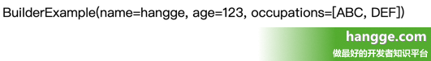

###  Lombok使用详解1（基本介绍、安装配置、var和val）

我们创建 **POJO** 类时，经常需要先写属性，然后手写或者自动生成 **get** 和 **set** 方法，然后还要重写 **toString** 方法....一系列操作下来，这个 **POJO** 类便会产生太多的样板式代码。

这种传统的方式不仅使得代码十分臃肿，有时也不方便维护，比如：当变量名或者是修饰符改变了，我们就要删除 **set**、**get** 方法重新生成。

而 **Lombok** 出现就是为了解决代码书写的冗余问题，下面对其进行详细进行介绍。

#### 基本介绍

##### 1、Lombok 介绍

（1）**Lombok** 提供了简单的注解的形式来帮助我们简化消除一些必须有但显得很臃肿的 **java** 代码。

> **比如**：在一个 **POJO** 中，一个属性的 **getter** 和 **setter** 可通过 **@Getter** 和 **@Setter** 注解来取代，代码编写就更加简洁和快速。

（2）而对应的注解最终会在编译源码的时候生成对应的方法，所以不会影响任何运行效率。

##### 2、插件安装

.......

##### 3、添加依赖

```xml
<dependency>
    <groupId>org.projectlombok</groupId>
    <artifactId>lombok</artifactId>
    <version>1.18.6</version>
</dependency>
```

#### var 与 val

（1）**val**、**val** 关键字可以让我们在定义一个变量时候不需要提前指定它的类型，它的实际的类型将由初始化的表达式推断：

- **var** 所声明的变量是非 **final** 的。
- **val** 所声明的变量是 **final** 的。

```java
var example = new ArrayList<String>();
example.add("welcome to hangge.com");
val foo = example.get(0);
```

（2）上面代码将会翻译成如下 **Java** 程序

```java
ArrayList example = new ArrayList<String>();
example.add("welcome to hangge.com");
final String  foo = example.get(0);
```

#### Lombok 注解概览

**Lombok** 插件主要为我们提供了如下注解，这里对其做一个简单的汇总。各个注解详细的介绍以及用法，可以参考我后续的文章。

- **@Getter** 注解在属性（类）上，为属性（所有非静态成员变量）提供 **get()** 方法
- **@Setter** 注解在属性（类）上，为属性（所有非静态成员变量）提供 **set()** 方法
- **@ToString** 该注解的作用是为类自动生成 **toString()** 方法
- **@EqualsAndHashCode** 为对象字段自动生成 **hashCode()** 和 **equals()** 实现
- **@AllArgsConstructor**、**@RequiredArgsConstructor**、**@NoArgsConstructor** 顾名思义，为类自动生成对应参数的构造器
- **@Data** 注解在类上，自动为所有字段添加 **@ToString**、**@EqualsAndHashCode**、**@Getter**。为非 **final** 字段添加 **@Setter** 和 **@RequiredArgsConstructor**。本质上相当于几个注解的综合效果
- **@Value** 注解和 **@Data** 类似，区别在于它会把所有成员变量默认定义为 **private final** 修饰，并且不会生成 **set()** 方法
- **@Log**、**@Log4j**、**@Log4j2**、**@Slf4j**、**@XSlf4j**、**@CommonsLog**、**@JBossLog** 注解在类上，自动为类添加对应的日志支持
- **@NonNull** 注解在方法参数上，用于自动生成空值参数检查，自动帮助我们避免空指针
- **@Cleanup** 自动帮我们调用 **close()** 方法，作用在局部变量上，在作用域结束时会自动调用 **close()** 方法释放资源，可以关闭流
- **@Builder** 注解在类上，被注解的类加个构造者模式
- **@Synchronized** 注解在类上，加个同步锁
- **@SneakyThrows** 等同于 **try**/**catch** 捕获异常


### Lombok使用详解2（@Setter、@Getter、@ToString、@EqualsAndHashCode）


####  Lombok 注解详解（1）

##### 1、@Setter 和 @Getter

（1）这两个注解用于生成 **setter** 和 **getter** 方法，可以用在类或者属性上：

- **如果用在属性上**：则只为该属性提供 **setter** 和 **getter** 方法
- **如果是用在类上**：则为这个类所有属性供 **setter** 和 **getter**方法

 （2）下面我们在一个类上添加 **@Setter** 和 **@Getter** 注解：

```java
package com.example.demo;
 
import lombok.Getter;
import lombok.Setter;
 
@Getter
@Setter
public class User {
    private String name;
    private Integer age;
}
```

（3）然后我们就可以直接使用它的 **setter** 和 **getter** 方法了：

```java
User user = new User();
user.setName("hangge");
user.setAge(123);
user.getName();
user.getAge();
```

##### 2、@Getter(lazy=true)

（1）该标注用于生成一个 **lazy** 版的 **getter**，它会在第一次调用这个 **getter** 时计算一次值，然后从那里开始缓存它。如果计算该值需要大量 **CPU**，或者该值占用大量内存，这可能很有用。

> **注意**：**Lombok** 会自动去管理线程安全的问题，所以不会存在重复赋值的问题。

（2）要使用此功能，需要创建一个 **private final** 变量，并且使用运行成本高的表达式对其进行初始化，同时使用 **@Getter(lazy=true)** 注解进行标注。

```java
// 使用注解
public class GetterLazyExample {
    @Getter(lazy=true) private final double[] cached = expensive();
 
    private double[] expensive() {
        double[] result = new double[1000000];
        for (int i = 0; i < result.length; i++) {
            result[i] = Math.asin(i);
        }
        return result;
    }
}
 
// 不使用注解
public class GetterLazyExample {
    private final java.util.concurrent.AtomicReference<java.lang.Object> cached =
            new java.util.concurrent.AtomicReference<java.lang.Object>();
 
    public double[] getCached() {
        java.lang.Object value = this.cached.get();
        if (value == null) {
            synchronized(this.cached) {
                value = this.cached.get();
                if (value == null) {
                    final double[] actualValue = expensive();
                    value = actualValue == null ? this.cached : actualValue;
                    this.cached.set(value);
                }
            }
        }
        return (double[])(value == this.cached ? null : value);
    }
 
    private double[] expensive() {
        double[] result = new double[1000000];
        for (int i = 0; i < result.length; i++) {
            result[i] = Math.asin(i);
        }
        return result;
    }
}
```

##### 3、@ToString

（1）**@ToString** 注解在类上, 为类提供 **toString()** 方法： 

- 默认情况下，它会按顺序（以逗号分隔）打印这个类名称以及每个字段。 
- 可以这样设置不包含哪些字段：**@ToString(exclude = "id")** 或者 **@ToString(exclude = {"id","name"})**

```java
package com.example.demo;
 
import lombok.Getter;
import lombok.Setter;
import lombok.ToString;
 
@Getter
@Setter
@ToString
public class User {
    private String name;
    private Integer age;
}
```

（2）下面是一个简单的测试样例：

```java
User user = new User();
user.setName("hangge");
user.setAge(123);
System.out.println(user.toString());
```

##### 4、@EqualsAndHashCode

（1）当其注解在类上，为该类提供 **hashCode()** 和 **equals()** 方法：

- 默认情况下，它将使用所有非静态，非 **transient** 字段。
- 可以通过在可选的 **exclude** 参数中来排除更多字段。
- 也可以通过在 **parameter** 参数中命名它们来准确指定希望使用哪些字段。

```java
package com.amos.lombok;
 
import lombok.EqualsAndHashCode;
 
@EqualsAndHashCode
public class EqualsAndHashCodeExample {
 
    private transient int transientVar = 10;
    private String name;
    private double score;
 
    /**
     * 不包含该字段
     */
    @EqualsAndHashCode.Exclude
    private Shape shape = new Square(5, 10);
    private String[] tags;
 
    /**
     * 不包含该字段
     */
    @EqualsAndHashCode.Exclude
    private int id;
 
    public String getName() {
        return this.name;
    }
 
    @EqualsAndHashCode(callSuper = true)
    public static class Square extends Shape {
        private final int width, height;
 
        public Square(int width, int height) {
            this.width = width;
            this.height = height;
        }
    }
 
    public static class Shape {
    }
}

```

（2）上面编译后会变成如下代码：

```java
package com.amos.lombok;
 
import java.util.Arrays;
 
public class EqualsAndHashCodeExample {
    private transient int transientVar = 10;
    private String name;
    private double score;
    private EqualsAndHashCodeExample.Shape shape = new EqualsAndHashCodeExample.Square(5, 10);
    private String[] tags;
    private int id;
 
    public EqualsAndHashCodeExample() {
    }
 
    public String getName() {
        return this.name;
    }
 
    public boolean equals(final Object o) {
        if (o == this) {
            return true;
        } else if (!(o instanceof EqualsAndHashCodeExample)) {
            return false;
        } else {
            EqualsAndHashCodeExample other = (EqualsAndHashCodeExample)o;
            if (!other.canEqual(this)) {
                return false;
            } else {
                label31: {
                    Object this$name = this.getName();
                    Object other$name = other.getName();
                    if (this$name == null) {
                        if (other$name == null) {
                            break label31;
                        }
                    } else if (this$name.equals(other$name)) {
                        break label31;
                    }
 
                    return false;
                }
 
                if (Double.compare(this.score, other.score) != 0) {
                    return false;
                } else {
                    return Arrays.deepEquals(this.tags, other.tags);
                }
            }
        }
    }
 
    protected boolean canEqual(final Object other) {
        return other instanceof EqualsAndHashCodeExample;
    }
 
    public int hashCode() {
        int PRIME = true;
        int result = 1;
        Object $name = this.getName();
        int result = result * 59 + ($name == null ? 43 : $name.hashCode());
        long $score = Double.doubleToLongBits(this.score);
        result = result * 59 + (int)($score >>> 32 ^ $score);
        result = result * 59 + Arrays.deepHashCode(this.tags);
        return result;
    }
 
    public static class Shape {
        public Shape() {
        }
    }
 
    public static class Square extends EqualsAndHashCodeExample.Shape {
        private final int width;
        private final int height;
 
        public Square(int width, int height) {
            this.width = width;
            this.height = height;
        }
 
        public boolean equals(final Object o) {
            if (o == this) {
                return true;
            } else if (!(o instanceof EqualsAndHashCodeExample.Square)) {
                return false;
            } else {
                EqualsAndHashCodeExample.Square other = (EqualsAndHashCodeExample.Square)o;
                if (!other.canEqual(this)) {
                    return false;
                } else if (!super.equals(o)) {
                    return false;
                } else if (this.width != other.width) {
                    return false;
                } else {
                    return this.height == other.height;
                }
            }
        }
 
        protected boolean canEqual(final Object other) {
            return other instanceof EqualsAndHashCodeExample.Square;
        }
 
        public int hashCode() {
            int PRIME = true;
            int result = super.hashCode();
            result = result * 59 + this.width;
            result = result * 59 + this.height;
            return result;
        }
    }
}
```


### Lombok使用详解3（@NoArgsConstructor、@AllArgsConstructor、@RequiredArgsConstructor）


#### Lombok 注解详解（2）

##### 5、@NoArgsConstructor

注解在类上，为类提供一个无参的构造方法。


>注意：
>
>- 当类中有 **final** 字段没有被初始化时，编译器会报错，此时可用 **@NoArgsConstructor(force = true)**，然后就会为没有初始化的 **final** 字段设置默认值 **0** / **false** / **null**。
>- 对于具有约束的字段（例如 **@NonNull** 字段），不会生成检查或分配，因此请注意，正确初始化这些字段之前，这些约束无效。

```java
// 使用注解
@NoArgsConstructor
public class Shape {
    private int x;
    @NonNull
    private double y;
    @NonNull
    private String name;
}
 
// 不使用注解
public class Shape {
    private int x;
    private double y;
    private String name;
 
    public Shape(){
    }
}
```

##### 6、@AllArgsConstructor

（1）注解在类上，为类提供一个全参的构造方法。

（2）默认生成的方法是 **public** 的，如果要修改方法修饰符可以设置 **AccessLevel** 的值。

- 例如：**@Getter(access = AccessLevel.PROTECTED)**

```java
// 使用注解
@AllArgsConstructor(access = AccessLevel.PROTECTED)
public class Shape {
    private int x;
    @NonNull
    private double y;
    @NonNull
    private String name;
}
 
// 不使用注解
public class Shape {
    private int x;
    private double y;
    private String name;
 
    protected Shape(int x, double y, String name){
        this.x = x;
        this.y = y;
        this.name = name;
    }
}
```

##### 7、@RequiredArgsConstructor

（1）注解在类上，会生成构造方法（可能带参数也可能不带参数）。

>注意**：如果带参数，这参数只能是以 **final** 修饰的未经初始化的字段或者是以 **@NonNull** 注解的未经初始化的字段。

（2）该注解还可以用 **@RequiredArgsConstructor(staticName="methodName")** 的形式生成一个指定名称的静态方法，返回一个调用相应的构造方法产生的对象

```java
// 使用注解
@RequiredArgsConstructor(staticName = "hangge")
public class Shape {
    private int x;
    @NonNull
    private double y;
    @NonNull
    private String name;
}
 
// 不使用注解
public class Shape {
    private int x;
    private double y;
    private String name;
 
    public Shape(double y, String name){
        this.y = y;
        this.name = name;
    }
 
    public static Shape hangge(double y, String name){
        return new Shape(y, name);
    }
}

```


### Lombok使用详解4（@Data、@Value、@NonNull、@Cleanup）

#### Lombok 注解详解（3）

##### 8、@Data

（1）**@Data** 是一个复合注解，用在类上，使用后会生成：默认的无参构造函数、所有属性的 **getter**、所有非 **final** 属性的 **setter** 方法，并重写 **toString**、**equals**、**hashcode** 方法。

```java
package com.example.demo;
 
import lombok.Data;
 
@Data
public class User {
    private String name;
    private Integer age;
}
```

（2）上面的 **@Data** 等效于如下几个注解结合使用：

```java
package com.example.demo;
 
import lombok.*;
 
@Setter
@Getter
@ToString
@EqualsAndHashCode
@NoArgsConstructor
public class User {
    private String name;
    private Integer age;
}
```

##### 9、@Value

**@Value** 注解和 **@Data** 类似，区别在于它会把所有成员变量默认定义为 **private final** 修饰，并且不会生成 **set()** 方法。

```java
// 使用注解
@Value
public class ValueExample {
    String name;
    @Wither(AccessLevel.PACKAGE) @NonFinal int age;
    double score;
    protected String[] tags;
}
 
// 不使用注解
public final class ValueExample {
    private final String name;
    private int age;
    private final double score;
    protected final String[] tags;
 
    public ValueExample(String name, int age, double score, String[] tags) {
        this.name = name;
        this.age = age;
        this.score = score;
        this.tags = tags;
    }
 
    //下面省略了其它方法
    //.....
}

```

##### 10、@NonNull

（1）注解在属性上，标识属性是不能为空，为空则抛出异常。换句话说就是进行空值检查。

```java
package com.example.demo;
 
import lombok.NonNull;
 
public class NonNullExample {
    private String name;
 
    public NonNullExample(@NonNull User user) {
        this.name = user.getName();
    }
}

```

（2）上面相当与如下 Java 代码：

```java
package com.example.demo;
 
public class NonNullExample {
    private String name;
 
    public NonNullExample(User user) {
        if (user == null) {
            throw new NullPointerException("user");
        }
        this.name = user.getName();
    }
}
```

（3）下面是一个简单的测试样例：

```java
User user = null;
try {
    NonNullExample example = new NonNullExample(user);
}catch (NullPointerException ex) {
    return ex.toString();
}
```


##### 11、@Cleanup

（1）用于关闭并释放资源，可以用在 **IO** 流上；

```java
public class CleanupExample {
    public static void main(String[] args) throws IOException {
        @Cleanup InputStream in = new FileInputStream(args[0]);
        @Cleanup OutputStream out = new FileOutputStream(args[1]);
        byte[] b = new byte[10000];
        while (true) {
            int r = in.read(b);
            if (r == -1) break;
            out.write(b, 0, r);
        }
    }
}
```

（2）上面相当与如下传统的 **Java** 代码：

```java
public class CleanupExample {
  public static void main(String[] args) throws IOException {
    InputStream in = new FileInputStream(args[0]);
    try {
      OutputStream out = new FileOutputStream(args[1]);
      try {
        byte[] b = new byte[10000];
        while (true) {
          int r = in.read(b);
          if (r == -1) break;
          out.write(b, 0, r);
        }
      } finally {
        if (out != null) {
          out.close();
        }
      }
    } finally {
      if (in != null) {
        in.close();
      }
    }
  }
}
```


### Lombok使用详解5（@log、@Buinder、@SneakyThrows、@Synchronized）

#### Lombok注解详解（4）

##### 12、@log

（1）该注解用在类上，可以省去从日志工厂生成日志对象这一步，直接进行日志记录，具体注解根据日志工具的不同而不同。不同的日志注解总结如下（上面是注解，下面是实际作用）：
>我们也可以在注解中使用 **topic** 来指定生成 **log** 对象时的类名。

```java
@CommonsLog
private static final org.apache.commons.logging.Log log =
        org.apache.commons.logging.LogFactory.getLog(LogExample.class);
 
@JBossLog
private static final org.jboss.logging.Logger log =
        org.jboss.logging.Logger.getLogger(LogExample.class);
 
@Log
private static final java.util.logging.Logger log =
        java.util.logging.Logger.getLogger(LogExample.class.getName());
 
@Log4j
private static final org.apache.log4j.Logger log =
        org.apache.log4j.Logger.getLogger(LogExample.class);
 
@Log4j2
private static final org.apache.logging.log4j.Logger log =
        org.apache.logging.log4j.LogManager.getLogger(LogExample.class);
 
@Slf4j
private static final org.slf4j.Logger log =
        org.slf4j.LoggerFactory.getLogger(LogExample.class);
 
@XSlf4j
private static final org.slf4j.ext.XLogger log =
```

（2）下面是一个简单的使用样例：

```java
// 使用注解
@Log
public class LogExample {
    public static void main(String... args) {
        log.error("Something's wrong here");
    }
}
 
// 不使用注解
public class LogExample {
    private static final java.util.logging.Logger log =
            java.util.logging.Logger.getLogger(LogExample.class.getName());
 
    public static void main(String... args) {
        log.error("Something's wrong here");
    }
}
```

##### 13、@Buinder

（1）**builder** 是现在比较推崇的一种构建值对象的方式。该描述符用于将类改造成 **builder**（建造者）模式，用在类、方法或者构造函数上。

```java
package com.example.demo;
 
import lombok.Builder;
import lombok.Singular;
 
import java.util.Set;
 
@Builder
public class BuilderExample {
    private String name;
    private int age;
    @Singular
    private Set<String> occupations;
}
```

（2）上面相当于如下传统的 **Java** 代码：

```java
package com.example.demo;
 
import java.util.Collection;
import java.util.Set;
 
public class BuilderExample {
    private String name;
    private int age;
    private Set<String> occupations;
 
    BuilderExample(String name, int age, Set<String> occupations) {
        this.name = name;
        this.age = age;
        this.occupations = occupations;
    }
 
    public static BuilderExampleBuilder builder() {
        return new BuilderExampleBuilder();
    }
 
    public static class BuilderExampleBuilder {
        private String name;
        private int age;
        private java.util.ArrayList<String> occupations;
 
        BuilderExampleBuilder() {
        }
 
        public BuilderExampleBuilder name(String name) {
            this.name = name;
            return this;
        }
 
        public BuilderExampleBuilder age(int age) {
            this.age = age;
            return this;
        }
 
        public BuilderExampleBuilder occupation(String occupation) {
            if (this.occupations == null) {
                this.occupations = new java.util.ArrayList<String>();
            }
 
            this.occupations.add(occupation);
            return this;
        }
 
        public BuilderExampleBuilder occupations(Collection<? extends String> occupations) {
            if (this.occupations == null) {
                this.occupations = new java.util.ArrayList<String>();
            }
 
            this.occupations.addAll(occupations);
            return this;
        }
 
        public BuilderExampleBuilder clearOccupations() {
            if (this.occupations != null) {
                this.occupations.clear();
            }
 
            return this;
        }
 
        public BuilderExample build() {
            //complicated switch statement to produce a compact properly sized immutable set omitted
            // go to https://projectlombok.org/features/Singular-snippet.html to see it.
            Set<String> occupations = ...;
            return new BuilderExample(name, age, occupations);
        }
 
        @java.lang.Override
        public String toString() {
            return "BuilderExample.BuilderExampleBuilder(name = " + this.name + ", age = "
                    + this.age + ", occupations = " + this.occupations + ")";
        }
    }
}
```

（3）下面是一个简单的测试样例：

```java
BuilderExample be = BuilderExample.builder()
        .name("hangge")
        .age(123)
        .occupation("ABC")
        .occupation("DEF")
        .build();
 
return be.toString();
```



##### 14、@SneakyThrows

（1）该注解用在方法上，可以将方法中的代码用 **try-catch** 语句包裹起来，捕获异常并在 **catch** 中用 **Lombok.sneakyThrow(e)** 把异常抛出。

（2）也可以使用 **@SneakyThrows(Exception.class)** 的形式指定抛出哪种异常。

```java
// 使用注解
public class SneakyThrows implements Runnable {
    @SneakyThrows(UnsupportedEncodingException.class)
    public String utf8ToString(byte[] bytes) {
        return new String(bytes, "UTF-8");
    }
 
    @SneakyThrows
    public void run() {
        throw new Throwable();
    }
}
 
// 不使用注解
public class SneakyThrows implements Runnable {
    public String utf8ToString(byte[] bytes) {
        try{
            return new String(bytes, "UTF-8");
        }catch(UnsupportedEncodingException uee){
            throw Lombok.sneakyThrow(uee);
        }
    }
 
    public void run() {
        try{
            throw new Throwable();
        }catch(Throwable t){
            throw Lombok.sneakyThrow(t);
        }
    }
}
```

##### 15、@Synchronized

该注解用在类方法或者实例方法上，效果和 

synchronized 

关键字相同，区别在于锁对象不同。对于类方法和实例方法，它俩区别在于：

- **synchronized** 关键字的锁对象分别是“**类的 class 对象**”和“**this 对象**”
- **@Synchronized** 的锁对象分别是“**私有静态 final 对象 lock**”和“**私有 final 对象 lock**”。当然，也可以自己指定锁对象。

```java
// 使用注解
public class Synchronized {
    private final Object readLock = new Object();
 
    @Synchronized
    public static void hello() {
        System.out.println("world");
    }
 
    @Synchronized
    public int answerToLife() {
        return 42;
    }
 
    @Synchronized("readLock")
    public void foo() {
        System.out.println("bar");
    }
}
 
// 不使用注解
public class Synchronized {
    private static final Object $LOCK = new Object[0];
    private final Object $lock = new Object[0];
    private final Object readLock = new Object();
 
    public static void hello() {
        synchronized($LOCK) {
            System.out.println("world");
        }
    }
 
    public int answerToLife() {
        synchronized($lock) {
            return 42;
        }
    }
 
    public void foo() {
        synchronized(readLock) {
            System.out.println("bar");
        }
    }
}
```

