# OAuth2.0究竟是个啥？

OAuth 2.0 是目前最流行的授权机制，用来授权第三方应用，获取用户数据。 这个标准比较抽象，使用了很多术语，初学者不容易理解。

本文从最小数据单元开始一步一步揭开OAuth 2.0的神秘面纱，希望大家看完本文都能知道OAuth 2.0到底是个什么。(参考川崎高彦在medium上的文章。)

首先，得有一些**用户的数据**。

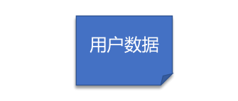

然后，我们需要一个服务器来管理这些用户的数据，我们称之为**“资源服务器“**

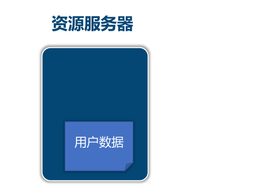

这时候有个第三方应用想要访问用户的数据，我们把这第三方应用称之为**“客户应用”**

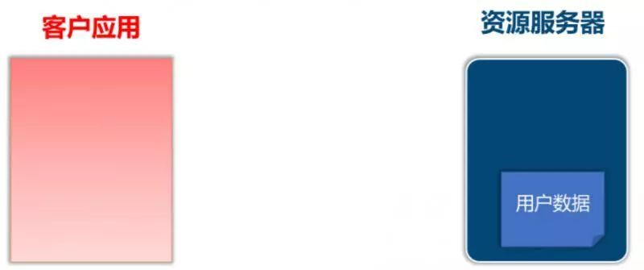

这时候我们给资源服务器按个门暴露用户数据，这个门我们称之为 **“API”**

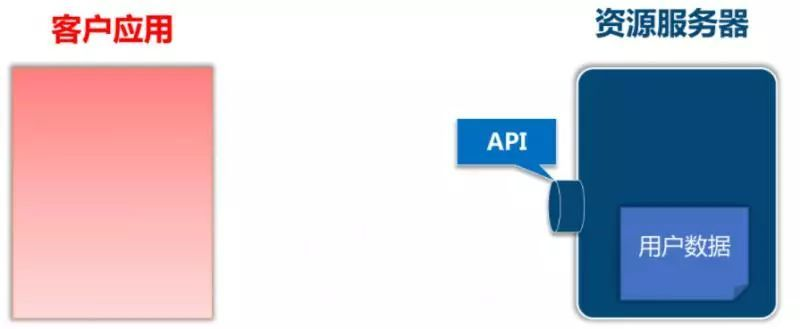

客户应用可以通过API访问用户的数据，资源服务器负责返回用户数据。

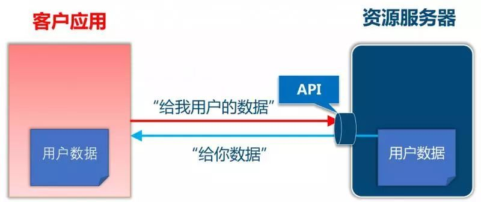

这时候来了个**恶意的客户应用**，它也想要获取用户数据拿去获利。由于我们没给API加上权限校验，所以**恶意的客户应用也可以获取用户数据。**

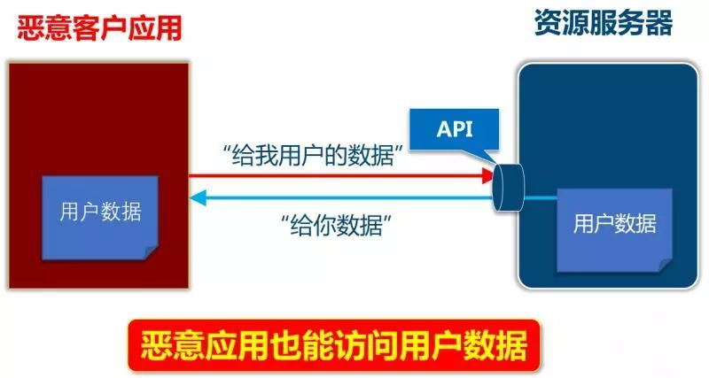

我们迫切需要一种机制**来保护用户数据**，业界实践是提前给客户应用颁发一个Access Token，它表示客户应用**被授权可以访问用户数据。**

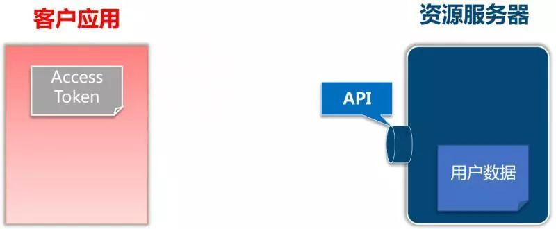

客户应用请求资源服务器获取用户数据时，**在请求里带上Access Token参数**，资源服务器取出请求中的Access Token并**校验Access Token确认客户应用有访问用户数据的权限 。**

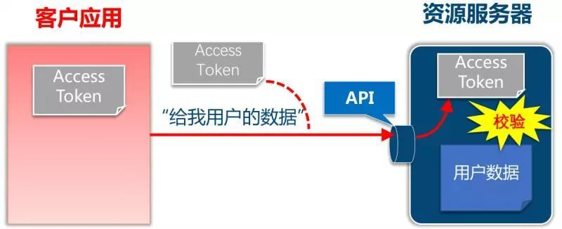

校验通过后资源服务器返回用户数据

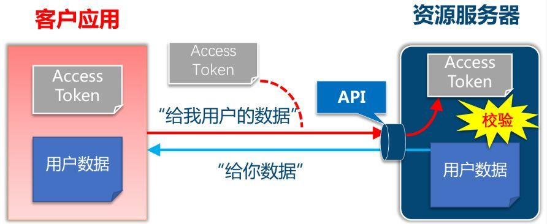

由于该机制工作的前提是：必须提前给客户应用颁发Access Token，所以这时候我们又需要一个颁发Access Token的角色, 我们把这个负责颁发Access Token的角色称之为**授权服务器。**

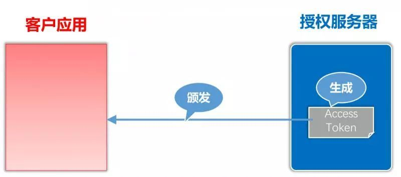

**暂停一下，我们来看看黑板**

> \1. 授权服务器负责生成Access Token, 并将Access Token 颁发给客户应用
>
> \2. 客户应用带上Access Token 去访问用户数据
>
> \3. 资源服务器负责从请求里取出AccessToken，校验Access Token是否具有访问用户的权限，如果有则返回客户数据。

客户应用、授权服务器、资源服务器之间的关系如下

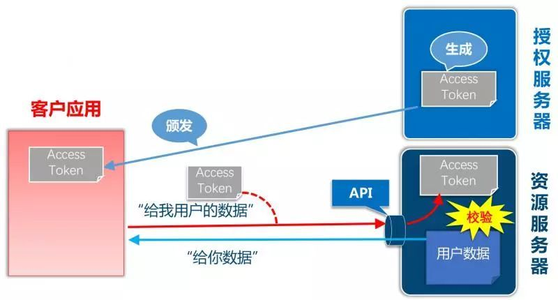

上面流程中第一步是授权服务器生成Access Token ,在真实流程中，在颁发Token给客户应用之前需要先征询用户的同意，必须要用户同意授权才会给客户应用颁发Access Token。客户应用、授权服务、用户三者之间的交互流程如下：

1. 客户应用请求授权服务器获取Access Token
2. 授权服务器咨询用户意见
3. 用户同意授权
4. 授权服务器颁发Access Token 给 客户应用

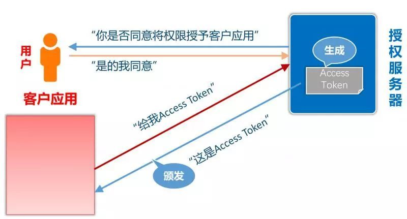

OAuth 2.0标准化了Access Token的请求和响应部分，OAuth2.0的细节在RFC 6749（OAuth 2.0授权框架）中描述。*参考网站：http://www.rfcreader.com/#rfc6749*

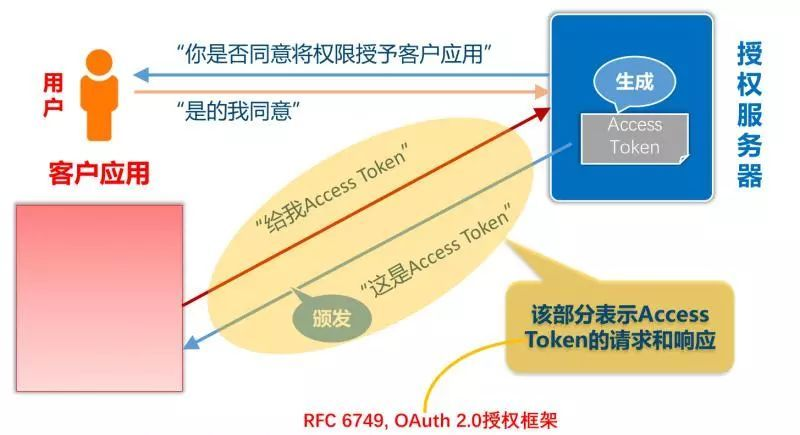

