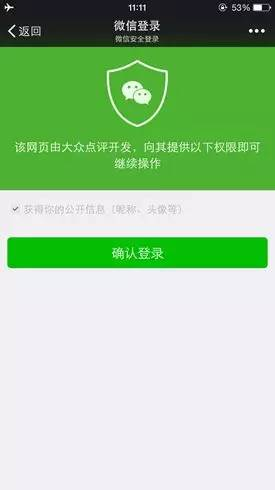

### OAuth2.0究竟是个啥？


OAuth 2.0 是目前最流行的授权机制，用来授权第三方应用，获取用户数据。 这个标准比较抽象，使用了很多术语，初学者不容易理解。

本文从最小数据单元开始一步一步揭开OAuth 2.0的神秘面纱，希望大家看完本文都能知道OAuth 2.0到底是个什么。(参考川崎高彦在medium上的文章。)

首先，得有一些**用户的数据**。


然后，我们需要一个服务器来管理这些用户的数据，我们称之为**“资源服务器“**


这时候有个第三方应用想要访问用户的数据，我们把这第三方应用称之为**“客户应用”**


这时候我们给资源服务器按个门暴露用户数据，这个门我们称之为 **“API”**


客户应用可以通过API访问用户的数据，资源服务器负责返回用户数据。


这时候来了个**恶意的客户应用**，它也想要获取用户数据拿去获利。由于我们没给API加上权限校验，所以**恶意的客户应用也可以获取用户数据。**


我们迫切需要一种机制**来保护用户数据**，业界实践是提前给客户应用颁发一个Access Token，它表示客户应用**被授权可以访问用户数据。**


客户应用请求资源服务器获取用户数据时，**在请求里带上Access Token参数**，资源服务器取出请求中的Access Token并**校验Access Token确认客户应用有访问用户数据的权限 。**


校验通过后资源服务器返回用户数据


由于该机制工作的前提是：必须提前给客户应用颁发Access Token，所以这时候我们又需要一个颁发Access Token的角色, 我们把这个负责颁发Access Token的角色称之为**授权服务器。**


**暂停一下，我们来看看黑板**

> \1. 授权服务器负责生成Access Token, 并将Access Token 颁发给客户应用
>
> \2. 客户应用带上Access Token 去访问用户数据
>
> \3. 资源服务器负责从请求里取出AccessToken，校验Access Token是否具有访问用户的权限，如果有则返回客户数据。


客户应用、授权服务器、资源服务器之间的关系如下


上面流程中第一步是授权服务器生成Access Token ,在真实流程中，在颁发Token给客户应用之前需要先征询用户的同意，必须要用户同意授权才会给客户应用颁发Access Token。客户应用、授权服务、用户三者之间的交互流程如下：

1. 客户应用请求授权服务器获取Access Token
2. 授权服务器咨询用户意见
3. 用户同意授权
4. 授权服务器颁发Access Token 给 客户应用


OAuth 2.0标准化了Access Token的请求和响应部分，OAuth2.0的细节在RFC 6749（OAuth 2.0授权框架）中描述。*参考网站：http://www.rfcreader.com/#rfc6749*


### 微信网页开发/网页授权

如果用户在微信客户端中访问第三方网页，公众号可以通过微信网页授权机制，来获取用户基本信息，进而实现业务逻辑。

**关于网页授权回调域名的说明**

1、在微信公众号请求用户网页授权之前，开发者需要先到公众平台官网中的“开发 - 接口权限 - 网页服务 - 网页帐号 - 网页授权获取用户基本信息”的配置选项中，修改授权回调域名。请注意，这里填写的是域名（是一个字符串），而不是URL，因此请勿加 http:// 等协议头；

2、授权回调域名配置规范为全域名，比如需要网页授权的域名为：www.qq.com，配置以后此域名下面的页面http://www.qq.com/music.html 、 http://www.qq.com/login.html 都可以进行OAuth2.0鉴权。但http://pay.qq.com 、 http://music.qq.com 、 http://qq.com 无法进行OAuth2.0鉴权

3、如果公众号登录授权给了第三方开发者来进行管理，则不必做任何设置，由第三方代替公众号实现网页授权即可

**关于网页授权的两种scope的区别说明**

1、以snsapi_base为scope发起的网页授权，是用来获取进入页面的用户的openid的，并且是静默授权并自动跳转到回调页的。用户感知的就是直接进入了回调页（往往是业务页面）

2、以snsapi_userinfo为scope发起的网页授权，是用来获取用户的基本信息的。但这种授权需要用户手动同意，并且由于用户同意过，所以无须关注，就可在授权后获取该用户的基本信息。

3、用户管理类接口中的“获取用户基本信息接口”，是在用户和公众号产生消息交互或关注后事件推送后，才能根据用户OpenID来获取用户基本信息。这个接口，包括其他微信接口，都是需要该用户（即openid）关注了公众号后，才能调用成功的。

**关于网页授权access_token和普通access_token的区别**

1、微信网页授权是通过OAuth2.0机制实现的，在用户授权给公众号后，公众号可以获取到一个网页授权特有的接口调用凭证（网页授权access_token），通过网页授权access_token可以进行授权后接口调用，如获取用户基本信息；

2、其他微信接口，需要通过基础支持中的“获取access_token”接口来获取到的普通access_token调用。

**关于UnionID机制**

1、请注意，网页授权获取用户基本信息也遵循UnionID机制。即如果开发者有在多个公众号，或在公众号、移动应用之间统一用户帐号的需求，需要前往微信开放平台（open.weixin.qq.com）绑定公众号后，才可利用UnionID机制来满足上述需求。

2、UnionID机制的作用说明：如果开发者拥有多个移动应用、网站应用和公众帐号，可通过获取用户基本信息中的unionid来区分用户的唯一性，因为同一用户，对同一个微信开放平台下的不同应用（移动应用、网站应用和公众帐号），unionid是相同的。

**关于特殊场景下的静默授权**

1、上面已经提到，对于以snsapi_base为scope的网页授权，就静默授权的，用户无感知；

2、对于已关注公众号的用户，如果用户从公众号的会话或者自定义菜单进入本公众号的网页授权页，即使是scope为snsapi_userinfo，也是静默授权，用户无感知。

具体而言，网页授权流程分为四步：

1、引导用户进入授权页面同意授权，获取code

2、通过code换取网页授权access_token（与基础支持中的access_token不同）

3、如果需要，开发者可以刷新网页授权access_token，避免过期

4、通过网页授权access_token和openid获取用户基本信息（支持UnionID机制）

目录

**第一步：用户同意授权，获取code**

在确保微信公众账号拥有授权作用域（scope参数）的权限的前提下（服务号获得高级接口后，默认拥有scope参数中的snsapi_base和snsapi_userinfo），**引导关注者打开如下页面：*****(这点是非常重要的)****

https://open.weixin.qq.com/connect/oauth2/authorize?appid=APPID&redirect_uri=REDIRECT_URI&response_type=code&scope=SCOPE&state=STATE#wechat_redirect 若提示“该链接无法访问”，请检查参数是否填写错误，是否拥有scope参数对应的授权作用域权限。

尤其注意：由于授权操作安全等级较高，所以在发起授权请求时，微信会对授权链接做正则强匹配校验，如果链接的参数顺序不对，授权页面将无法正常访问

参考链接(请在微信客户端中打开此链接体验):

`scope为snsapi_base`

```
https://open.weixin.qq.com/connect/oauth2/authorize?appid=wx520c15f417810387&redirect_uri=https%3A%2F%2Fchong.qq.com%2Fphp%2Findex.php%3Fd%3D%26c%3DwxAdapter%26m%3DmobileDeal%26showwxpaytitle%3D1%26vb2ctag%3D4_2030_5_1194_60&response_type=code&scope=snsapi_base&state=123#wechat_redirect
```

`scope为snsapi_userinfo`

```
https://open.weixin.qq.com/connect/oauth2/authorize?appid=wxf0e81c3bee622d60&redirect_uri=http%3A%2F%2Fnba.bluewebgame.com%2Foauth_response.php&response_type=code&scope=snsapi_userinfo&state=STATE#wechat_redirect
```

尤其注意：跳转回调redirect_uri，应当使用https链接来确保授权code的安全性。

参数说明

| 参数             | 是否必须 | 说明                                                         |
| :--------------- | :------- | :----------------------------------------------------------- |
| appid            | 是       | 公众号的唯一标识                                             |
| redirect_uri     | 是       | 授权后重定向的回调链接地址， 请使用 urlEncode 对链接进行处理 |
| response_type    | 是       | 返回类型，请填写code                                         |
| scope            | 是       | 应用授权作用域，snsapi_base （不弹出授权页面，直接跳转，只能获取用户openid），snsapi_userinfo （弹出授权页面，可通过openid拿到昵称、性别、所在地。并且， 即使在未关注的情况下，只要用户授权，也能获取其信息 ） |
| state            | 否       | 重定向后会带上state参数，开发者可以填写a-zA-Z0-9的参数值，最多128字节 |
| #wechat_redirect | 是       | 无论直接打开还是做页面302重定向时候，必须带此参数            |

下图为scope等于snsapi_userinfo时的授权页面：



**用户同意授权后**

如果用户同意授权，页面将跳转至 redirect_uri/?code=CODE&state=STATE。

code说明 ： code作为换取access_token的票据，每次用户授权带上的code将不一样，code只能使用一次，5分钟未被使用自动过期。

**错误返回码说明如下：**

| 返回码 | 说明                                         |
| :----- | :------------------------------------------- |
| 10003  | redirect_uri域名与后台配置不一致             |
| 10004  | 此公众号被封禁                               |
| 10005  | 此公众号并没有这些scope的权限                |
| 10006  | 必须关注此测试号                             |
| 10009  | 操作太频繁了，请稍后重试                     |
| 10010  | scope不能为空                                |
| 10011  | redirect_uri不能为空                         |
| 10012  | appid不能为空                                |
| 10013  | state不能为空                                |
| 10015  | 公众号未授权第三方平台，请检查授权状态       |
| 10016  | 不支持微信开放平台的Appid，请使用公众号Appid |

**第二步：通过code换取网页授权access_token**

首先请注意，这里通过code换取的是一个特殊的网页授权access_token,与基础支持中的access_token（该access_token用于调用其他接口）不同。公众号可通过下述接口来获取网页授权access_token。如果网页授权的作用域为snsapi_base，则本步骤中获取到网页授权access_token的同时，也获取到了openid，snsapi_base式的网页授权流程即到此为止。

尤其注意：由于公众号的secret和获取到的access_token安全级别都非常高，必须只保存在服务器，不允许传给客户端。后续刷新access_token、通过access_token获取用户信息等步骤，也必须从服务器发起。

请求方法

> 获取code后，请求以下链接获取access_token： https://api.weixin.qq.com/sns/oauth2/access_token?appid=APPID&secret=SECRET&code=CODE&grant_type=authorization_code

参数说明

| 参数       | 是否必须 | 说明                     |
| :--------- | :------- | :----------------------- |
| appid      | 是       | 公众号的唯一标识         |
| secret     | 是       | 公众号的appsecret        |
| code       | 是       | 填写第一步获取的code参数 |
| grant_type | 是       | 填写为authorization_code |

返回说明

正确时返回的JSON数据包如下：

```
{
  "access_token":"ACCESS_TOKEN",
  "expires_in":7200,
  "refresh_token":"REFRESH_TOKEN",
  "openid":"OPENID",
  "scope":"SCOPE" 
}
```

| 参数          | 描述                                                         |
| :------------ | :----------------------------------------------------------- |
| access_token  | 网页授权接口调用凭证,注意：此access_token与基础支持的access_token不同 |
| expires_in    | access_token接口调用凭证超时时间，单位（秒）                 |
| refresh_token | 用户刷新access_token                                         |
| openid        | 用户唯一标识，请注意，在未关注公众号时，用户访问公众号的网页，也会产生一个用户和公众号唯一的OpenID |
| scope         | 用户授权的作用域，使用逗号（,）分隔                          |

错误时微信会返回JSON数据包如下（示例为Code无效错误）:获取第二步的refresh_token后，请求以下链接获取access_token： https://api.weixin.qq.com/sns/oauth2/refresh_token?appid=APPID&grant_type=refresh_token&refresh_token=REFRESH_TOKEN

```json
{"errcode":40029,"errmsg":"invalid code"}
```


**第三步：刷新access_token（如果需要）**

由于access_token拥有较短的有效期，当access_token超时后，可以使用refresh_token进行刷新，refresh_token有效期为30天，当refresh_token失效之后，需要用户重新授权。

**请求方法**

```
获取第二步的refresh_token后，请求以下链接获取access_token： https://api.weixin.qq.com/sns/oauth2/refresh_token?appid=APPID&grant_type=refresh_token&refresh_token=REFRESH_TOKEN
```

| 参数          | 是否必须 | 说明                                          |
| :------------ | :------- | :-------------------------------------------- |
| appid         | 是       | 公众号的唯一标识                              |
| grant_type    | 是       | 填写为refresh_token                           |
| refresh_token | 是       | 填写通过access_token获取到的refresh_token参数 |

返回说明

正确时返回的JSON数据包如下：

```json
{ 
  "access_token":"ACCESS_TOKEN",
  "expires_in":7200,
  "refresh_token":"REFRESH_TOKEN",
  "openid":"OPENID",
  "scope":"SCOPE" 
}
```

| 参数          | 描述                                                         |
| :------------ | :----------------------------------------------------------- |
| access_token  | 网页授权接口调用凭证,注意：此access_token与基础支持的access_token不同 |
| expires_in    | access_token接口调用凭证超时时间，单位（秒）                 |
| refresh_token | 用户刷新access_token                                         |
| openid        | 用户唯一标识                                                 |
| scope         | 用户授权的作用域，使用逗号（,）分隔                          |

错误时微信会返回JSON数据包如下（示例为code无效错误）:

```json
{"errcode":40029,"errmsg":"invalid code"}
```

**第四步：拉取用户信息(需scope为 snsapi_userinfo)**

如果网页授权作用域为snsapi_userinfo，则此时开发者可以通过access_token和openid拉取用户信息了。

请求方法

http：GET（请使用https协议） https://api.weixin.qq.com/sns/userinfo?access_token=ACCESS_TOKEN&openid=OPENID&lang=zh_CN

参数说明

| 参数         | 描述                                                         |
| :----------- | :----------------------------------------------------------- |
| access_token | 网页授权接口调用凭证,注意：此access_token与基础支持的access_token不同 |
| openid       | 用户的唯一标识                                               |
| lang         | 返回国家地区语言版本，zh_CN 简体，zh_TW 繁体，en 英语        |

返回说明

正确时返回的JSON数据包如下：

```json
{   
  "openid": "OPENID",
  "nickname": NICKNAME,
  "sex": 1,
  "province":"PROVINCE",
  "city":"CITY",
  "country":"COUNTRY",
  "headimgurl":"https://thirdwx.qlogo.cn/mmopen/g3MonUZtNHkdmzicIlibx6iaFqAc56vxLSUfpb6n5WKSYVY0ChQKkiaJSgQ1dZuTOgvLLrhJbERQQ4eMsv84eavHiaiceqxibJxCfHe/46",
  "privilege":[ "PRIVILEGE1" "PRIVILEGE2"     ],
  "unionid": "o6_bmasdasdsad6_2sgVt7hMZOPfL"
}
```

| 参数       | 描述                                                         |
| :--------- | :----------------------------------------------------------- |
| openid     | 用户的唯一标识                                               |
| nickname   | 用户昵称                                                     |
| sex        | 用户的性别，值为1时是男性，值为2时是女性，值为0时是未知      |
| province   | 用户个人资料填写的省份                                       |
| city       | 普通用户个人资料填写的城市                                   |
| country    | 国家，如中国为CN                                             |
| headimgurl | 用户头像，最后一个数值代表正方形头像大小（有0、46、64、96、132数值可选，0代表640*640正方形头像），用户没有头像时该项为空。若用户更换头像，原有头像URL将失效。 |
| privilege  | 用户特权信息，json 数组，如微信沃卡用户为（chinaunicom）     |
| unionid    | 只有在用户将公众号绑定到微信开放平台帐号后，才会出现该字段。 |

错误时微信会返回JSON数据包如下（示例为openid无效）:

```json
{"errcode":40003,"errmsg":" invalid openid "}
```

**附：检验授权凭证（access_token）是否有效**

请求方法

> http：GET（请使用https协议） https://api.weixin.qq.com/sns/auth?access_token=ACCESS_TOKEN&openid=OPENID

参数说明

| 参数         | 描述                                                         |
| :----------- | :----------------------------------------------------------- |
| access_token | 网页授权接口调用凭证,注意：此access_token与基础支持的access_token不同 |
| openid       | 用户的唯一标识                                               |

返回说明 正确的JSON返回结果：

```json
{ "errcode":0,"errmsg":"ok"}
```

错误时的JSON返回示例：

```json
{ "errcode":40003,"errmsg":"invalid openid"}
```

