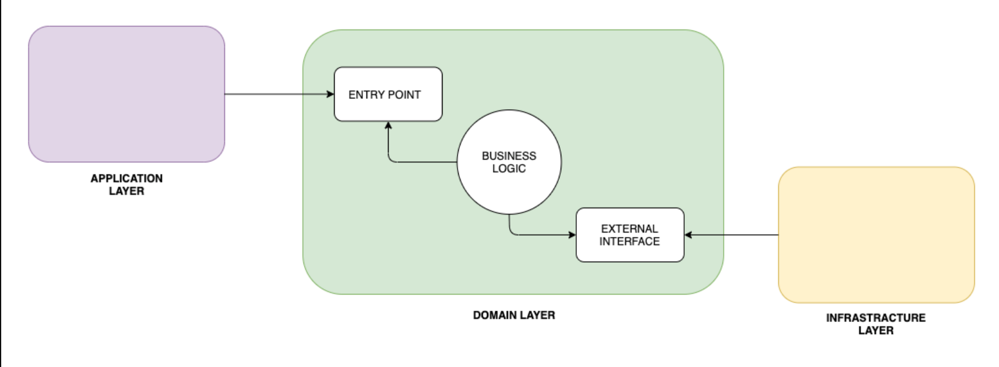
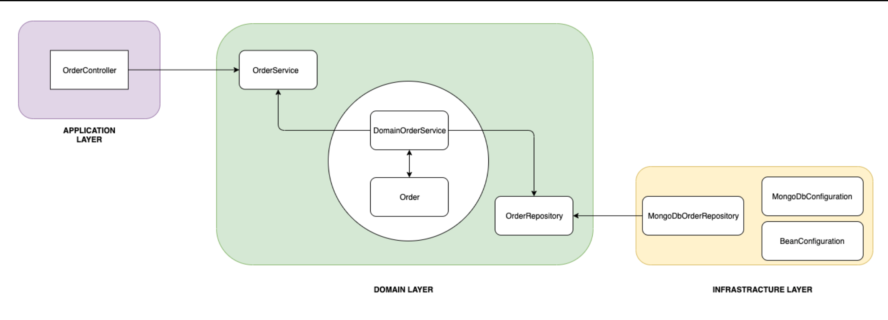

## Organizing Layers Using Hexagonal Architecture, DDD, and Spring


### 1. Overview


In this tutorial, we'll implement a Spring application using DDD. Additionally, we'll organize layers with the help of Hexagonal Architecture.

With this approach, we can easily exchange the different layers of the application.


### 2. Hexagonal Architecture

Hexagonal architecture is a model of **designing software applications around domain logic** to isolate it from external factors.

The domain logic is specified in a business core, which we'll call the inside part, the rest being outside parts. Access to domain logic from the outside is available through ports and adapters. 


### 3. Principles

Firstly, we should define principles to divide our code. As explained briefly already, hexagonal architecture defines **the inside and the outside part**.

What we'll do instead is divide our application into three layers; **application (outside), domain (inside), and infrastructure (outside):**




Through **the application layer, the user or any other program interacts** with the application. This area should contain things like user interfaces, RESTful controllers, and JSON serialization libraries. It includes anything **that exposes entry to our application and orchestrates the execution of domain logic.**

**In the domain layer, we keep the code that touches and implements business logic**. This is the core of our application. Additionally, this layer should be isolated from both the application part and the infrastructure part. On top of that, it should also contain interfaces that define the API to communicate with external parts, like the database, which the domain interacts with.

Lastly, the **infrastructure layer is the part that contains anything that the application needs to work** such as database configuration or Spring configuration. Besides, it also implements infrastructure-dependent interfaces from the domain layer.


### 4. Domain Layer

Let's begin by implementing our core layer, which is the domain layer.

Firstly, we should create the *Order* class:

```java
public class Order {
    private UUID id;
    private OrderStatus status;
    private List<OrderItem> orderItems;
    private BigDecimal price;

    public Order(UUID id, Product product) {
        this.id = id;
        this.orderItems = new ArrayList<>(Arrays.astList(new OrderItem(product)));
        this.status = OrderStatus.CREATED;
        this.price = product.getPrice();
    }

    public void complete() {
        validateState();
        this.status = OrderStatus.COMPLETED;
    }

    public void addOrder(Product product) {
        validateState();
        validateProduct(product);
        orderItems.add(new OrderItem(product));
        price = price.add(product.getPrice());
    }

    public void removeOrder(UUID id) {
        validateState();
        final OrderItem orderItem = getOrderItem(id);
        orderItems.remove(orderItem);

        price = price.subtract(orderItem.getPrice());
    }

    // getters
}
```

**This is our aggregate root**. Anything related to our business logic will go through this class. Additionally, *Order* is responsible for keeping itself in the correct state:

- The order can only be created with the given ID and based on one *Product –* the constructor itself also inits the order with *CREATED* status
- Once the order is completed, changing *OrderItem*s is impossible
- It's impossible to change the *Order* from outside the domain object, like with a setter

Furthermore, the *Order* class is also responsible for creating its *OrderItem*.

Let's create the *OrderItem* class then:

```java
public class OrderItem {
    private UUID productId;
    private BigDecimal price;

    public OrderItem(Product product) {
        this.productId = product.getId();
        this.price = product.getPrice();
    }

    // getters
}
```

As we can see, *OrderItem* is created based on a *Product*. It keeps the reference to it and stores the current price of the *Product*.

Next, we'll create a repository interface (a *port* in Hexagonal Architecture). The implementation of the interface will be in the infrastructure layer:

```java
public interface OrderRepository {
    Optional<Order> findById(UUID id);

    void save(Order order);
}
```

Lastly, we should make sure that the *Order* will be always saved after each action. To do that, **we'll define a Domain Service, which usually contains logic that can't be a part of our root**:

```java
public class DomainOrderService implements OrderService {

    private final OrderRepository orderRepository;

    public DomainOrderService(OrderRepository orderRepository) {
        this.orderRepository = orderRepository;
    }

    @Override
    public UUID createOrder(Product product) {
        Order order = new Order(UUID.randomUUID(), product);
        orderRepository.save(order);

        return order.getId();
    }

    @Override
    public void addProduct(UUID id, Product product) {
        Order order = getOrder(id);
        order.addOrder(product);

        orderRepository.save(order);
    }

    @Override
    public void completeOrder(UUID id) {
        Order order = getOrder(id);
        order.complete();

        orderRepository.save(order);
    }

    @Override
    public void deleteProduct(UUID id, UUID productId) {
        Order order = getOrder(id);
        order.removeOrder(productId);

        orderRepository.save(order);
    }

    private Order getOrder(UUID id) {
        return orderRepository
          .findById(id)
          .orElseThrow(RuntimeException::new);
    }
}
```

In a hexagonal architecture, this service is an adapter that implements the port. Additionally, **we'll not register it as a Spring bean** **because, from a domain perspective, this is in the inside part, and Spring configuration is on the outside.** We'll manually wire it with Spring in the infrastructure layer a bit later.

**Because the domain layer is completely decoupled** from application and infrastructure layers, **we** **can** also **test it independently**:

```java
class DomainOrderServiceUnitTest {

    private OrderRepository orderRepository;
    private DomainOrderService tested;
    @BeforeEach
    void setUp() {
        orderRepository = mock(OrderRepository.class);
        tested = new DomainOrderService(orderRepository);
    }

    @Test
    void shouldCreateOrder_thenSaveIt() {
        final Product product = new Product(UUID.randomUUID(), BigDecimal.TEN, "productName");

        final UUID id = tested.createOrder(product);

        verify(orderRepository).save(any(Order.class));
        assertNotNull(id);
    }
}
```


### 5. Application Layer

In this section, we'll implement the application layer. We'll allow the user to communicate with our application via a RESTful API.

Therefore, let's create the *OrderController:*

```java
@RestController
@RequestMapping("/orders")
public class OrderController {

    private OrderService orderService;

    @Autowired
    public OrderController(OrderService orderService) {
        this.orderService = orderService;
    }

    @PostMapping
    CreateOrderResponse createOrder(@RequestBody CreateOrderRequest request) {
        UUID id = orderService.createOrder(request.getProduct());

        return new CreateOrderResponse(id);
    }

    @PostMapping(value = "/{id}/products")
    void addProduct(@PathVariable UUID id, @RequestBody AddProductRequest request) {
        orderService.addProduct(id, request.getProduct());
    }

    @DeleteMapping(value = "/{id}/products")
    void deleteProduct(@PathVariable UUID id, @RequestParam UUID productId) {
        orderService.deleteProduct(id, productId);
    }

    @PostMapping("/{id}/complete")
    void completeOrder(@PathVariable UUID id) {
        orderService.completeOrder(id);
    }
}
```

This simple [Spring Rest controller](https://www.baeldung.com/building-a-restful-web-service-with-spring-and-java-based-configuration) **is responsible for orchestrating the execution of domain logic**.

This controller adapts the outside RESTful interface to our domain. It does it by calling the appropriate methods from *OrderService* (port).


### 6. Infrastructure Layer

The infrastructure layer contains the logic needed to run the application.

Therefore, we'll start by creating the configuration classes. Firstly, let's implement a class that will register our *OrderService* as a Spring bean:

```java
@Configuration
public class BeanConfiguration {

    @Bean
    OrderService orderService(OrderRepository orderRepository) {
        return new DomainOrderService(orderRepository);
    }
}
```

Next, let's create the configuration responsible for enabling the [Spring Data](https://www.baeldung.com/spring-data-mongodb-tutorial) repositories we'll use:

```java
@EnableMongoRepositories(basePackageClasses = SpringDataMongoOrderRepository.class)
public class MongoDBConfiguration {
}
```

We have used the *basePackageClasses* property because those repositories can only be in the infrastructure layer. Hence, there's no reason for Spring to scan the whole application. Furthermore, this class can contain everything related to establishing a connection between MongoDB and our application.

Lastly, we'll implement the *OrderRepository* from the domain layer. We'll use our *SpringDataMongoOrderRepository* in our implementation:

```java
@Component
public class MongoDbOrderRepository implements OrderRepository {

    private SpringDataMongoOrderRepository orderRepository;

    @Autowired
    public MongoDbOrderRepository(SpringDataMongoOrderRepository orderRepository) {
        this.orderRepository = orderRepository;
    }

    @Override
    public Optional<Order> findById(UUID id) {
        return orderRepository.findById(id);
    }

    @Override
    public void save(Order order) {
        orderRepository.save(order);
    }
}
```

This implementation stores our *Order* in MongoDB. In a hexagonal architecture, this implementation is also an adapter.

### 7. Benefits

The first advantage of this approach is that we **separate work for each layer**. We can focus on one layer without affecting others.

Furthermore, they're naturally easier to understand because each of them focuses on its logic.

Another big advantage is that we've isolated the domain logic from everything else. **The domain part only contains business logic and can be easily moved to a different environment**.

In fact, let's change the infrastructure layer to use [Cassandra](https://www.baeldung.com/spring-data-cassandra-tutorial) as a database:

```java
@Component
public class CassandraDbOrderRepository implements OrderRepository {

    private final SpringDataCassandraOrderRepository orderRepository;

    @Autowired
    public CassandraDbOrderRepository(SpringDataCassandraOrderRepository orderRepository) {
        this.orderRepository = orderRepository;
    }

    @Override
    public Optional<Order> findById(UUID id) {
        Optional<OrderEntity> orderEntity = orderRepository.findById(id);
        if (orderEntity.isPresent()) {
            return Optional.of(orderEntity.get()
                .toOrder());
        } else {
            return Optional.empty();
        }
    }

    @Override
    public void save(Order order) {
        orderRepository.save(new OrderEntity(order));
    }

}
```

Unlike MongoDB, we now use an *OrderEntity* to persist the domain in the database.

**If we add technology-specific annotations to our Order domain object**, then **we violate the decoupling between infrastructure and domain layers**.

The repository adapts the domain to our persistence needs.

Let's go a step further and transform our RESTful application into a command-line application:

```java
@Component
public class CliOrderController {

    private static final Logger LOG = LoggerFactory.getLogger(CliOrderController.class);

    private final OrderService orderService;

    @Autowired
    public CliOrderController(OrderService orderService) {
        this.orderService = orderService;
    }

    public void createCompleteOrder() {
        LOG.info("<<Create complete order>>");
        UUID orderId = createOrder();
        orderService.completeOrder(orderId);
    }

    public void createIncompleteOrder() {
        LOG.info("<<Create incomplete order>>");
        UUID orderId = createOrder();
    }

    private UUID createOrder() {
        LOG.info("Placing a new order with two products");
        Product mobilePhone = new Product(UUID.randomUUID(), BigDecimal.valueOf(200), "mobile");
        Product razor = new Product(UUID.randomUUID(), BigDecimal.valueOf(50), "razor");
        LOG.info("Creating order with mobile phone");
        UUID orderId = orderService.createOrder(mobilePhone);
        LOG.info("Adding a razor to the order");
        orderService.addProduct(orderId, razor);
        return orderId;
    }
}
```

Unlike before, we now have hardwired a set of predefined actions that interact with our domain. We could use this to populate our application with mocked data for example.

Even though we completely changed the purpose of the application, we haven't touched the domain layer.


### 8. Conclusion

In this article, we've learned how to separate the logic related to our application into specific layers.

First, we defined three main layers: application, domain, and infrastructure. After that, we described how to fill them and explained the advantages.

Then, we came up with the implementation for each layer



Finally, we swapped the application and infrastructure layers without impacting the domain.

As always, the code for these examples is available [over on GitHub](https://github.com/eugenp/tutorials/tree/master/ddd).

