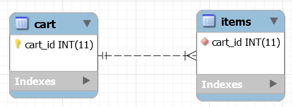
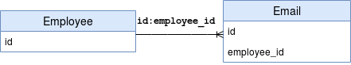

# hibernate-annotations


## JPA @Embedded And @Embeddable


>**JPA is huge!** It covers nearly every aspect of communication between relational databases and the Java application and is deeply integrated into all major frameworks.
>
>If you're **using IntelliJ, JPA Buddy is super helpful**. The plugin gently guides you through the subtleties of the most popular JPA implementations, visually reminds you of JPA features, generates code that follows best practices, and integrates intelligent inspections to **improve your existing persistence code**.
>
>More concretely, it provides powerful tooling to generate Spring Data JPA repositories and methods, Flyway Versioned Migrations, Liquibase Differential Changelogs, DDL and SQL statements, DTO objects, and MapStruct interfaces.
>
>Oh, and it actually generates JPA entities from an existing database and gradually update the data model as the database evolves! **Yeah**.

### 1. Overview

In this tutorial, we'll see how we can map one entity that contains embedded properties to a single database table.

For this purpose, we'll use the *@Embeddable* and *@Embedded* annotations provided by the [Java Persistence API (JPA)](https://www.baeldung.com/jpa-hibernate-difference).


### 2. Data Model Context

First, let's define a table called *company*.

The *company* table will store basic information such as company name, address and phone as well as the information of a contact person:

```java
public class Company {

    private Integer id;

    private String name;

    private String address;

    private String phone;

    private String contactFirstName;

    private String contactLastName;

    private String contactPhone;

    // standard getters, setters
}
```

**However, it seems like the contact person should be abstracted out to a separate class.**

The problem is that **we don't want to create a separate table for those details.**

So, let's see what we can do.


### 3. *@Embeddable*

**JPA provides the @Embeddable annotation to declare that a class will be embedded by other entities.**

Let's define a class to abstract out the contact person details:

```java
@Embeddable
public class ContactPerson {

    private String firstName;

    private String lastName;

    private String phone;

    // standard getters, setters
}
```


### 4. *@Embedded*

**The JPA annotation @Embedded is used to embed a type into another entity.**

Let's next modify our *Company* class.

We'll add the JPA annotations, and we'll also change to use *ContactPerson* instead of separate fields:

```java
@Entity
public class Company {

    @Id
    @GeneratedValue
    private Integer id;

    private String name;

    private String address;

    private String phone;

    @Embedded
    private ContactPerson contactPerson;

    // standard getters, setters
}
```

As a result, we have our entity *Company*, embedding contact person details and mapping to a single database table.

We still have one more problem, though, and that is **how JPA will map these fields to database columns.**


### 5. Attributes Override

Our fields were called things like *contactFirstName* in our original *Company* class and now *firstName* in our *ContactPerson* class. So, JPA will want to map these to *contact_first_name* and *first_name*, respectively.

Aside from being less than ideal, it will actually break us with our now-duplicated *phone* column.

**So, we can use @AttributeOverrides and @AttributeOverride to override the column properties of our embedded type.**

Let's add this to the *ContactPerson* field in our *Company* entity:

```java
@Embedded
@AttributeOverrides({
  @AttributeOverride( name = "firstName", column = @Column(name = "contact_first_name")),
  @AttributeOverride( name = "lastName", column = @Column(name = "contact_last_name")),
  @AttributeOverride( name = "phone", column = @Column(name = "contact_phone"))
})
private ContactPerson contactPerson;
```

Note that since these the annotations go on the field, we can have different overrides for each enclosing entity.

### 6. Conclusion

In this article, we configured an entity with some embedded attributes and mapped them to the same database table as the enclosing entity.

To do this, we used the *@Embedded*, *@Embeddable*, *@AttributeOverrides* and *@AttributeOverride* annotations provided by the Java Persistence API.

As always, the source code of the example is available [over on GitHub](https://github.com/eugenp/tutorials/tree/master/persistence-modules/spring-data-jpa-annotations).


## Hibernate One to Many Annotation Tutorial

### **1. Introduction**

This quick Hibernate tutorial will take us through an example of a *one-to-many* mapping using JPA annotations, an alternative to XML.

We'll also learn what bidirectional relationships are, how they can create inconsistencies, and how the idea of ownership can help.

### **2. Description**

Simply put, **one-to-many mapping means that one row in a table is mapped to multiple rows in another table.**

Let’s look at the following entity-relationship diagram to see a *one-to-many* association:



For this example, we'll implement a cart system where we have a table for each cart and another table for each item. **One cart can have many items, so here we have a one-to-many mapping.**

The way this works at the database level is we have a *cart_id* as a primary key in the *cart* table and also a *cart_id* as a foreign key in *items*.

The way we do it in code is with *@OneToMany*.

Let's map the *Cart* class to the collection of *Item* objects in a way that reflects the relationship in the database:

```java
public class Cart {

    //...     
 
    @OneToMany(mappedBy="cart")
    private Set<Item> items;
	
    //...
}
```

We can also add a reference to *Cart* in each *Item* using *@ManyToOne*, making this a [bidirectional](https://docs.jboss.org/hibernate/orm/4.1/manual/en-US/html/ch07.html#collections-bidirectional) relationship. Bidirectional means that **we are able to access items from carts, and also carts from items**.

The *mappedBy* property is what we use to tell Hibernate which variable we are using to represent the parent class in our child class.

The following technologies and libraries are used in order to develop a sample Hibernate application that implements *one-to-many* association:

- *JDK* 1.8 or later
- *Hibernate* 5
- *Maven* 3 or later
- H2 database


### **3. Setup**

#### **3.1. Database Setup**


We'll use Hibernate to manage our schema from the domain model. In other words, we don't need to provide the SQL statements to create the various tables and relationships between the entities. So let's move on to creating the Hibernate example project.

#### **3.2. Maven Dependencies**

Let's start by adding the Hibernate and H2 driver dependencies to our *pom.xml* file. The Hibernate dependency uses JBoss logging, and it automatically gets added as transitive dependencies:

- Hibernate version *5.6.7.Final*
- H2 driver version *2.1.212*

Please visit the Maven central repository for the latest versions of [Hibernate](https://search.maven.org/classic/#search|ga|1|a%3A"hibernate-core") and the [H2](https://search.maven.org/classic/#search|ga|1|g%3A"com.h2database") dependencies.


#### **3.3. Hibernate SessionFactory**

Next, let's create the Hibernate *SessionFactory* for our database interactions:

```java
public static SessionFactory getSessionFactory() {

    ServiceRegistry serviceRegistry = new StandardServiceRegistryBuilder()
      .applySettings(dbSettings())
      .build();

    Metadata metadata = new MetadataSources(serviceRegistry)
      .addAnnotatedClass(Cart.class)
      // other domain classes
      .buildMetadata();

    return metadata.buildSessionFactory();
}

private static Map<String, String> dbSettings() {
    // return Hibernate settings
}
```


### **4. The Models**

The mapping-related configurations will be done using JPA annotations in the model classes:

```java
@Entity
@Table(name="CART")
public class Cart {

    //...

    @OneToMany(mappedBy="cart")
    private Set<Item> items;
	
    // getters and setters
}
```

Please note that the *@OneToMany* annotation is used to define the property in *Item* class that will be used to map the *mappedBy* variable. That is why we have a property named “*cart*” in the *Item* class:

```java
@Entity
@Table(name="ITEMS")
public class Item {
    
    //...
    @ManyToOne
    @JoinColumn(name="cart_id", nullable=false)
    private Cart cart;

    public Item() {}
    
    // getters and setters
}

```

It's also important to note that the *@ManyToOne* annotation is associated with the *Cart* class variable. *@JoinColumn* annotation references the mapped column.


### **5. In Action**

In the test program, we are creating a class with a *main*() method for getting the Hibernate Session, and saving the model objects into the database implementing the *one-to-many* association:

```java
sessionFactory = HibernateAnnotationUtil.getSessionFactory();
session = sessionFactory.getCurrentSession();
System.out.println("Session created");
	    
tx = session.beginTransaction();

session.save(cart);
session.save(item1);
session.save(item2);
	    
tx.commit();
System.out.println("Cart ID=" + cart.getId());
System.out.println("item1 ID=" + item1.getId()
  + ", Foreign Key Cart ID=" + item.getCart().getId());
System.out.println("item2 ID=" + item2.getId()
+ ", Foreign Key Cart ID=" + item.getCart().getId());
```

This is the output of our test program:

```
Session created
Hibernate: insert into CART values ()
Hibernate: insert into ITEMS (cart_id)
  values (?)
Hibernate: insert into ITEMS (cart_id)
  values (?)
Cart ID=7
item1 ID=11, Foreign Key Cart ID=7
item2 ID=12, Foreign Key Cart ID=7
Closing SessionFactory
```


### **6. The @ManyToOne Annotation**

As we have seen in section 2, we can specify a *many-to-one* relationship by using the *@ManyToOne* annotation. A *many-to-one* mapping means that many instances of this entity are mapped to one instance of another entity – **many items in one cart**.

**The @ManyToOne annotation lets us create bidirectional relationships too.** We'll cover this in detail in the next few subsections.


#### **6.1. Inconsistencies and Ownership**

Now, if *Cart* referenced *Item*, but *Item* didn't in turn reference *Cart*, **our relationship would be unidirectional**. **The objects would also have a natural consistency.**

In our case though, the relationship is bidirectional, **bringing in the possibility of inconsistency.**

Let's imagine a situation where a developer wants to add an *item1* to the *cart1* instance and an *item2* to the *cart2 instance*, but makes a mistake so that the references between *cart2* and *item2* become inconsistent:

```java
Cart cart1 = new Cart();
Cart cart2 = new Cart();

Item item1 = new Item(cart1);
Item item2 = new Item(cart2); 
Set<Item> itemsSet = new HashSet<Item>();
itemsSet.add(item1);
itemsSet.add(item2); 
cart1.setItems(itemsSet); // wrong!
```

As shown above, *item2* references *cart2,* whereas *cart2* doesn't reference *item2,* and that's bad*.*

**How should Hibernate save item2 to the database?** Will *item2* foreign key reference *cart1* or *cart2*?

We resolve this ambiguity using the idea of an owning side of the relationship; references belonging to the owning side take precedence and are saved to the database.


#### **6.2. Item as the Owning Side**

As stated in the [JPA specification](https://download.oracle.com/otndocs/jcp/persistence-2.0-fr-eval-oth-JSpec/) under section 2.9, **it's a good practice to mark the many-to-one side as the owning side.**

In other words, *I**tem* would be the owning side and *Cart* the inverse side, which is exactly what we did earlier.

So how did we achieve this?

**By including the mappedBy attribute in the Cart class, we mark it as the inverse side.**

**At the same time, we also annotate the Item.cart field with @ManyToOne, making Item the owning side.**

Going back to our “inconsistency” example, now Hibernate knows that **item2‘s reference is more important and will save item2‘s reference to the database.**

Let's check the result:

```
item1 ID=1, Foreign Key Cart ID=1
item2 ID=2, Foreign Key Cart ID=2
```

Although *cart* references *item2* in our snippet, *item2*‘s reference to *cart2* is saved in the database.


#### **6.3. Cart as the Owning Side**

It's also possible to mark the *one-to-many* side as the owning side, and the *many-to-one* side as the inverse side.

Although this is not a recommended practice, let's go ahead and give it a try.

The code snippet below shows the implementation of the *one-to-many* side as the owning side:

```java
public class ItemOIO {
    
    //  ...
    @ManyToOne
    @JoinColumn(name = "cart_id", insertable = false, updatable = false)
    private CartOIO cart;
    //..
}

public class CartOIO {
    
    //..  
    @OneToMany
    @JoinColumn(name = "cart_id") // we need to duplicate the physical information
    private Set<ItemOIO> items;
    //..
}

```

Notice how we removed the *mappedBy* element and set the *many-to-one @JoinColumn* as *insertable* and *updatable* to *false*.

If we run the same code, the result will be the opposite:

```java
item1 ID=1, Foreign Key Cart ID=1
item2 ID=2, Foreign Key Cart ID=1
```

As shown above, now *item2* belongs to the *cart.*


### **7. Conclusion**

We have seen how easy it is to implement the *one-to-many* relationship with the Hibernate ORM and H2 database using JPA annotations.

Additionally, we learned about bidirectional relationships and how to implement the notion of an owning side.

The source code in this article can be found [over on GitHub](https://github.com/eugenp/tutorials/tree/master/persistence-modules/hibernate-annotations).


## Difference Between @JoinColumn and mappedBy


### 1. Overview

JPA Relationships can be either unidirectional or bidirectional. This simply means we can model them as an attribute on exactly one of the associated entities or both.

Defining the direction of the relationship between entities has no impact on the database mapping. It only defines the directions in which we use that relationship in our domain model.

For a bidirectional relationship, we usually define

- the owning side
- inverse or the referencing side

The [*@JoinColumn*](https://www.baeldung.com/jpa-join-column) annotation helps us specify the column we'll use for joining an entity association or element collection. On the other hand, the *mappedBy* attribute is used to define the referencing side (non-owning side) of the relationship.

In this quick tutorial, we'll look at **the difference between @JoinColumn and mappedBy** **in JPA. We'll also present how to use them in a one-to-many association.**


### 2. Initial Setup

To follow along with this tutorial, let's say we have two entities: *Employee* and *Email*.

Clearly, an employee can have multiple email addresses. However, a given email address can belong exactly to a single employee.

This means they share a one-to-many association:



Also in our RDBMS model, we'll have a foreign key *employee_id* in our *Email* entity referring to the *id* attribute of an *Employee*.


### 3. *@JoinColumn* Annotation

In a One-to-Many/Many-to-One relationship, **the owning side is usually defined on the many side of the relationship.** It's usually the side that owns the foreign key.

The *@JoinColumn* annotation defines that actual physical mapping on the owning side:

```java
@Entity
public class Email {

    @Id
    @GeneratedValue(strategy = GenerationType.AUTO)
    private Long id;

    @ManyToOne(fetch = FetchType.LAZY)
    @JoinColumn(name = "employee_id")
    private Employee employee;

    // ...

}
```

It simply means that our *Email* entity will have a foreign key column named *employee_id* referring to the primary attribute *id* of our *Employee* entity.


### 4. *mappedBy* Attribute

Once we have defined the owning side of the relationship, Hibernate already has all the information it needs to map that relationship in our database.

To make this association bidirectional, all we'll have to do is to define the referencing side. The inverse or the referencing side simply maps to the owning side.

We can easily use the *mappedBy* attribute of *@OneToMany* annotation to do so.

So, let's define our *Employee* entity:

```java
@Entity
public class Employee {

    @Id
    @GeneratedValue(strategy = GenerationType.AUTO)
    private Long id;

    @OneToMany(fetch = FetchType.LAZY, mappedBy = "employee")
    private List<Email> emails;
    
    // ...
}
```

Here, **the value of mappedBy is the name of the association-mapping attribute on the owning side.** With this, we have now established a bidirectional association between our *Employee* and *Email* entities.


### 5. Conclusion

In this article, we looked at the difference between *@JoinColumn* and *mappedBy* and how to use them in a one-to-many bidirectional relationship.

The *@JoinColumn* annotation defines the actual physical mapping on the owning side. On the other hand, the referencing side is defined using the *mappedBy* attribute of the *@OneToMany* annotation.

As usual, the source code is available [over on GitHub](https://github.com/eugenp/tutorials/tree/master/persistence-modules/hibernate-annotations).


## @JoinColumn 

### 一、@JoinColumn

@JoinColumn 的作用就是声明关联关系的，什么是关联关系？

就是我们在数据库设计时常说的一对多、多对一、多对多关系。因此，@JoinColumn 必须和这些关系注解一起使用，否则是没有意义的。

### 二、name 和 referencedColumnName

刚开始接触这两个属性会觉得很难理解，特别是看书的时候总是分不清，看下面的例子：

```java
// Address表对应的Entity
Class Address{
	@Id
    @GeneratedValue(strategy = GenerationType.IDENTITY)
    private Long addressID;
    ...
}

// User表对应的Entity
Class User{
	...
	// 显然下面这个属性表示每个User对应一个Address，思考一下：
	// 平时我们在设计数据库的时候会怎么处理这种关系？我一般对这
	// 一对一的关系，都会直接在User表中添加一个字段指向Address
	// 的主键，而下面注解确实是这样做的。
 	@OneToOne
    @JoinColumn(name = "addressID", referencedColumnName = "id")
    private Address address;
    ...
}

```

其实这两个属性指向的都是数据库字段，也就是数据库里面真真实实存在的表的字段，而不是我们在Java程序中的成员变量名（重要）。

如上面的代码，它表示在User表中添加一个addressID字段，这个字段的取值就是 Address 表的 id，也就是主键，也就说明了它通过这个字段关联着两张表（重要，重要，重要），这其实就是我们在学习数据库时处理一对一关系的一种方法，是不是很熟悉？

所以，一定记住，两个属性都是指数据库里的字段！！！！

name：当前表的字段
referencedColumnName：引用表对应的字段，如果不注明，默认就是引用表的主键
实际上数据库中的表结构如下， User 的 addressID 字段关联着 Address 的 id 字段：

| User 表属性 | 语义                |
| ----------- | ------------------- |
| id          | 主键                |
| addressID   | 关联 Address 表主键 |
| name        | 姓名                |
| phone       | 手机                |
| …           | 其他属性            |


| Address 表属性 | 语义     |
| -------------- | -------- |
| id             | 主键     |
| receiver       | 收件人   |
| detail         | 详细地址 |
| …              | 其他属性 |


