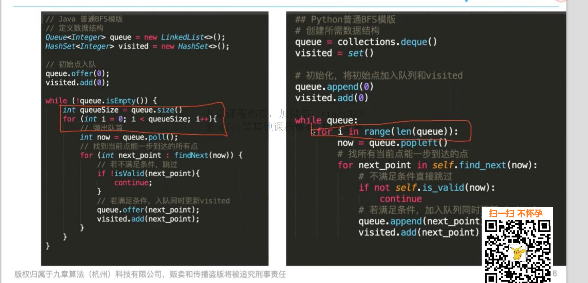
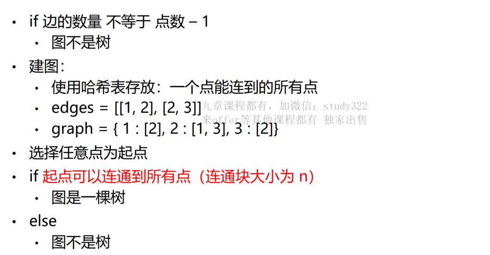
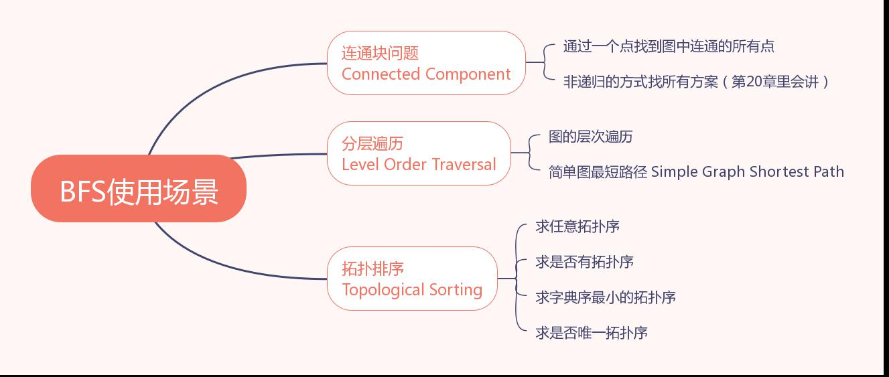
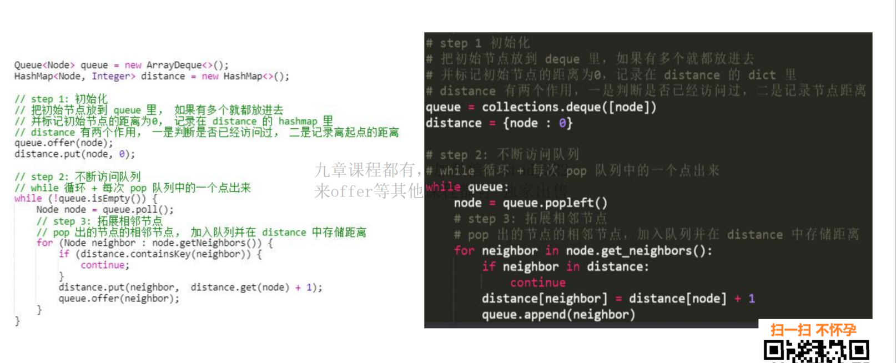

# BFS基础知识回顾


**大纲**


## BFS 基础模板


### BFS 基础模板


### BFS 进阶模板（分层BFS）




### BFS 进阶模板（字典优化版）


## 如何在二维图上BFS?


Python：直接上 tuple

Java : 自闭


## 岛屿的个数


### 代码

```java
public class 岛屿的个数 {
    /**
     * 题目描述，见笔记
     * 解：竟然和模板一模一样
     */

    public int numIslands(boolean[][] grid) {
        if (grid == null || grid.length == 0 || grid[0].length == 0) {
            return 0;
        }
        int ans = 0;
        int n = grid.length;
        int m = grid[0].length;
        HashSet<Integer> visited = new HashSet<>();

        for (int i = 0; i < n; i++) {
            for (int j = 0; j < m; j++) {
                if (!visited.contains(i * m + j) && grid[i][j]) {
                    bfs(grid, i, j, visited);
                    ans = ans + 1;
                }
            }
        }
        return ans;
    }


    public void bfs(boolean[][] grid, int x, int y, HashSet<Integer> visited) {
        if (!grid[x][y]) {
            return;
        }

        int[] dx = {-1, 1, 0, 0};
        int[] dy = {0, 0, -1, 1};
//        int n = grid.length;
        int m = grid[0].length;

        LinkedList<Integer> queue = new LinkedList<>();
        queue.offer(x * m + y);   // (x,y) ===> (x * m +y)
        visited.add(x * m + y);

        // mark it as visited
        while (!queue.isEmpty()) {
            Integer now = queue.poll();
            int now_x = now / m;
            int now_y = now % m;
            for (int i = 0; i < 4; i++) {
                int next_x = now_x + dx[i];
                int next_y = now_y + dy[i];
                if (isValid(next_x, next_y, grid, visited)) {
                    visited.add(next_x * m + next_y);
                    queue.offer(next_x * m + next_y);
                }
            }
        }
    }

    public boolean isValid(int x, int y, boolean[][] grid, HashSet<Integer> visited) {
        if (x < 0 || y < 0 || x >= grid.length || y >= grid[0].length) {
            return false;
        }
        if (!grid[x][y]) {
            return false;
        }
        if (visited.contains(x * grid[0].length + y)) {
            return false;
        }
        return true;
    }
}
```


## 图是否是树

```
给出点的数量n 和一个无向边列表edges，判断该列表连接成的图是不是一棵树。
n = 5，edges = [[0, 1], [0, 2], [0, 3], [1, 4]] --> true
n = 5，edges = [[0, 1], [1, 2], [2, 3], [1, 3], [1, 4]] --> false

图(可能有环)VS 树(一定无环)
一个图是树的充要条件：
1、图上有n个点、并且仅有n-1条边
2、n个点是连通的（属于同一个连通块）
```


### 分析

**图(可能有环)VS 树(一定无环)**

**一个图是树的充要条件：**

**1、图上有n个点、并且仅有n-1条边**

**2、n个点是连通的（属于同一个连通块）**


### 解题思路




### 判断图中所有点是否连通

BFS(宽度优先搜索) or DFS(深度优先搜索)？

**选择BFS最坏情况：图是一条链-> stack overflow 警告能用BFS 尽量少用DFS**


### 代码

```java
public class 图是否是树 {

    public boolean validTree(int n, int[][] edges) {
        if (edges.length != n - 1) {
            return false;
        }
        // 建立图
        HashMap<Integer, Set<Integer>> graph = new HashMap<>();
        for (int i = 0; i < n; i++) {
            graph.put(i, new HashSet<Integer>());
        }
        for (int i = 0; i < edges.length; i++) {
            int u = edges[i][0];
            int v = edges[i][1];
            graph.get(u).add(v);
            graph.get(v).add(u);
        }

        // BFS
        LinkedList<Integer> queue = new LinkedList<>();
        HashSet<Integer> visited = new HashSet<>();

        // 起点从0开始
        queue.offer(0);
        visited.add(0);
        while (!queue.isEmpty()) {
            int poll = queue.poll();
            for (Integer neighbor : graph.get(poll)) {
                if (visited.contains(neighbor)) {
                    continue;
                }
                visited.add(neighbor);
                queue.offer(neighbor);
            }
        }
        return visited.size() == n;
    }
}
```


# BFS进阶与最短路径算法


BFS使用场景



原则：能 BFS 的别 DFS

> Recursion 版本的 DFS 有 StackOverflow 的风险
>
> Non-Recursion 版本的 DFS 容易错+面试官未必看得懂Non-Recursion 版本的 DFS 容易错+面试官未必看得懂


## BFS 通用代码模板




>层级信息 = 最短距离


## 飞行棋 I (A厂)

从数组的最左侧跳到最右侧，只能向右跳
一步跳 1-6 格，有一些格子之间直接飞过去不耗费步数
问**最少**跳**几步**


### 问最少步数，可能是哪些算法？

A. BFS (高概率)

B. DP (次高概率)
C. DFS (几乎没有)
D. Shortest Path Algorithm (标准最短路面试一般不考)


**BFS+BFS**

```java
    public int modernLudo(int length, int[][] connections) {
        // 构建图
        Map<Integer, Set<Integer>> graph = buildGraph(length, connections);
        Queue<Integer> queue = new LinkedList<>();
        queue.offer(1);
        Map<Integer, Integer> distance = new HashMap<>();
        distance.put(1, 0);
        while (!queue.isEmpty()) {
            int node = queue.poll();
            int limit = Math.min(node + 7, length + 1);
            for (int neighbor = node + 1; neighbor < limit; neighbor++) {
                List<Integer> connectedNodes = getUnvisitedNodes(graph, distance, neighbor);
                for (int connectedNode : connectedNodes) {
                    distance.put(connectedNode, distance.get(node) + 1);
                    queue.offer(connectedNode);
                }
            }
        }

        return distance.get(length);
    }

    private Map<Integer, Set<Integer>> buildGraph(int length, int[][] connections) {
        HashMap<Integer, Set<Integer>> graph = new HashMap<>();
        for (int i = 1; i <= length; i++) {
            graph.put(i, new HashSet<Integer>());
        }
        for (int i = 0; i < connections.length; i++) {
            int from = connections[i][0];
            int to = connections[i][1];
            graph.get(from).add(to);
        }
        return graph;
    }

    private List<Integer> getUnvisitedNodes(Map<Integer, Set<Integer>> graph, Map<Integer, Integer> distance, int node) {
        List<Integer> unVisitedNodes = new ArrayList();
        Queue<Integer> queue = new LinkedList<>();
        queue.offer(node);

        while (!queue.isEmpty()) {
            int currentNode = queue.poll();
            if (distance.containsKey(currentNode)) {
                continue;
            }
            unVisitedNodes.add(currentNode);
            for (int neighbor : graph.get(currentNode)) {
                if (!distance.containsKey(neighbor)) {
                    queue.offer(neighbor);
                    unVisitedNodes.add(neighbor);
                }
            }
        }
        return unVisitedNodes;
    }
```


**1:38:00**