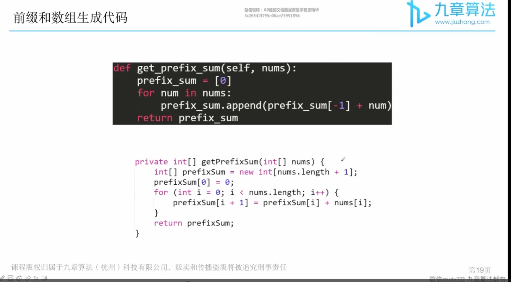

# algorithm

   

## 面试算法知识点及考察频率 


## 数据结构知识点及考察频率


## 时间复杂度与算法对应关系


## 高频技巧


### 高频技巧一


### 高频技巧二


 



  


### 利用技巧牛刀小试

#### 利用“时间复杂的倒推法”和“前缀和”技巧

##### 1 求和= k的最短的子数组

暴力算法  O(n^3)

把所有子数组都撸一遍

```java
for  子数组左端点  start    // O(n)
    for  子数组右端点  end    // O(n)
        for  start 到 end 求和    // O(n)
				判断是不是 k
```


暴力算法优化 O(n^2)

用前缀和数组在 O（1）时间内直接算的子数组和

```java
for   子数组左端点 start     //O(n)
    for  子数组右端点  end  // O（n）
        判断 prefixSum[end+1]-prefixSum[start]是不是k
```


O(n)  优化


solution :见自己 idea 笔记


##### 拓展：求和= k的最短的子数组

```java
math.min--->max
if(!sum2index.get(prefixSum[end + 1])){     //不存在才可以进行赋值，存在不能进行覆盖
	 sum2index.put(prefixSum[end + 1], end + 1);
}
sum2index.get()
```


##### 2 求和 > = k 的最短的子数组

暴力算法 时间复杂度 O(n^2)

```properties
for   子数组左端点 start     //O(n)
    for  子数组右端点  end  // O（n）
        判断 prefixSum[end+1]-prefixSum[start]是不是>=k
```


#### 先修知识点

##### 先修知识点： subarray vs subsequence 

一个长度为n 的数组，分别有多少个不同的子数组subarray  和 子序列  subsequence？

答案：  


**subarray** 必须是连续的：

```properties
例如 ：[1,2,3,4]

包含1的情况有 4 种
包含2的情况有3种
包含3的情况有2种
包含1的情况有1种

答案： 10 种
对应到 k个元素------>n(n+1)/2

```


##### 先修知识点： 最大子数组


