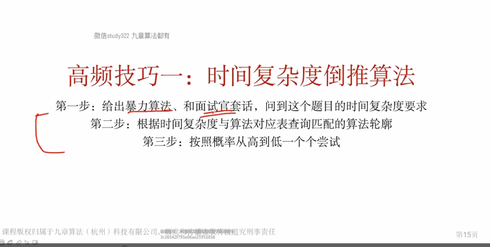
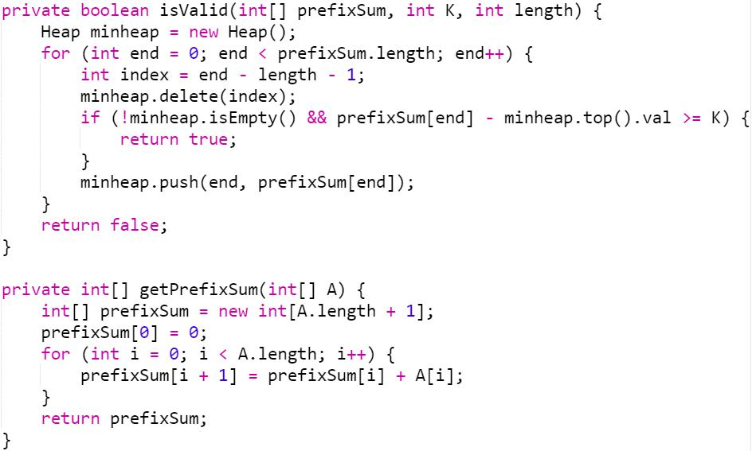

# algorithm

   

## 面试算法知识点及考察频率 


## 数据结构知识点及考察频率


## 时间复杂度与算法对应关系


## 高频技巧


### 高频技巧一





### 高频技巧二


 


  


### 利用技巧牛刀小试

#### 利用“时间复杂的倒推法”和“前缀和”技巧

##### 1 求和= k的最短的子数组

暴力算法  O(n^3)

把所有子数组都撸一遍

```java
for  子数组左端点  start    // O(n)
    for  子数组右端点  end    // O(n)
        for  start 到 end 求和    // O(n)
				判断是不是 k
```


暴力算法优化 O(n^2)

用前缀和数组在 O（1）时间内直接算的子数组和

```java
for   子数组左端点 start     //O(n)
    for  子数组右端点  end  // O（n）
        判断 prefixSum[end+1]-prefixSum[start]是不是k
```


O(n)  优化


solution :

```java
 // 时间复杂度O(n)
    public int subarraySumEqualsKII(int[] nums, int k) {
        int[] prefixSum = getPrefixSum(nums);

        int answer = Integer.MAX_VALUE;

        // 变量命名小技巧
        // hashmap / dict 用 key2value  的方式命名，代表了 key 是 sum, value 是 index
        HashMap<Integer, Integer> sum2index = new HashMap<> ();
        sum2index.put(0, 0);
        for (int end = 0; end < nums.length; end++) {
            if (sum2index.containsKey(prefixSum[end + 1] - k)) {
                int len = end + 1 - sum2index.get(prefixSum[end + 1] - k);
                answer = Math.min(answer, len);
            }
            sum2index.put(prefixSum[end + 1], end + 1);
        }
        return answer;
    }

    private int[] getPrefixSum(int[] nums) {
        int[] prefixSum = new int[nums.length + 1];
        prefixSum[0] = 0;
        for (int i = 0; i < nums.length; i++) {
            prefixSum[i + 1] = prefixSum[i] + nums[i];
        }
        return prefixSum;
    }
```


##### 拓展：求和= k的最长的子数组

```java
math.min--->max
if(!sum2index.get(prefixSum[end + 1])){     //不存在才可以进行赋值，存在不能进行覆盖
	 sum2index.put(prefixSum[end + 1], end + 1);
}
sum2index.get()
```


##### 2 求和 > = k 的最短的子数组

暴力算法 时间复杂度 O(n^2)

```properties
for   子数组左端点 start     //O(n)
    for  子数组右端点  end  // O（n）
        判断 prefixSum[end+1]-prefixSum[start]是不是>=k
```


最优的O(n)的算法

本问题中的O(n) 的方法需要使用单调队列来解决，这个内容 我们将在后续课程中讲解，今天我们主要通过这个题来看看 O(n log n)的解法

**使用单调队列的方法**


**O(n log n)的算法**

时间复杂度为logn 的数据结构：线段树、红黑树、堆


**n 次 O(log n)的操作**

```properties
类别上一题的做法
prefixSum[end + 1] - prefixSum[start] >= k
=>
prefixSum[start] <= prefixSum[end + 1] - k
在 logn 的时间内如何找到
使得 prefixSum[start] <= prefixSum[end + 1] - k 的最大的 start？
```


```properties
**线段树 Segment Tree **（我不会 ）

有一堆 pairs (a,b), 令 a=index, b=prefixSum[index]，找到 b<=k 的所有 pairs 里的最大 a
=>在线段树中以 b 为 index, a 为 value，在 index 范围 [最小index, b] 之间找最大值 。
```


**logn 次 O(n) 的操作** 

```properties
二分答案 + O(n) 判断答案偏大偏小
二分数组最小长度 x，判断条件是哪个？
A: 检测是否存在subarray和 >=k 且长度 = x
B: 检测是否存在subarray和 >=k 且长度 <= x

```





ps:属实不想看。


#### 先修知识点

##### 先修知识点： subarray vs subsequence 

一个长度为n 的数组，分别有多少个不同的子数组subarray  和 子序列  subsequence？

答案：  


**subarray** 必须是连续的：

```properties
例如 ：[1,2,3,4]

包含1的情况有 4 种
包含2的情况有3种
包含3的情况有2种
包含1的情况有1种

答案： 10 种
对应到 k个元素------>n(n+1)/2

```


##### 先修知识点： 最大子数组


