# 同向双指针


## 双指针的分类

同向：全零子串数量
相向：两数之和、三数之和
背向：最长回文子串
同向双指针特点：指针不“回头 “


## leetcode209. 长度最小的子数组

```properties
给定一个含有 n 个正整数的数组和一个正整数 target 。

找出该数组中满足其和 ≥ target 的长度最小的 连续子数组 [numsl, numsl+1, ..., numsr-1, numsr] ，并返回其长度。如果不存在符合条件的子数组，返回 0 。

输入：target = 7, nums = [2,3,1,2,4,3]
输 出：2
解释：子数组 [4,3] 是该条件下的长度最小的子数组。
```

### 方案一：暴力解法（时间复杂度O(n^3),空间复杂度 O(1)）

```java
  // 暴力解法(注意边界)
    public int minimumSize2(int[] nums, int s) {
        int n = nums.length;
        int minLength = Integer.MAX_VALUE;
        for (int start = 0; start < n; start++) {
            for (int end = start; end < n; end++) {
                int sum = 0;
                for (int i = start; i <= end; i++) {
                    sum += nums[i];
                }
                if (sum >= s) {
                    minLength = Math.min(minLength, end - start + 1);
                }
            }
        }
        if (minLength == Integer.MAX_VALUE) {
            return 0;
        }
        return minLength;
    }
```

### 方案二：使用前缀和优化（时间复杂度O(n^2)）

```java
   /*
        怎样快速得到子数组的和(这样复杂度能从O(n^3)--->O(n^2))
        优化一：使用前缀和数组在O(1)的时间复杂度内计算子数组和
        如：nums   = [2,3,1,2,4,3]
        prefixSum = [0,2,5,6,8,12,15]
        index     = [0,1,2,3,4,5 ,6 ]
     */
    // 使用前缀和优化
    public int minimumSize3(int[] nums, int s) {
        int n = nums.length;
        int minLength = Integer.MAX_VALUE;
        int[] prefixSum = getPrefixSum(nums);

        for (int start = 0; start < n; start++) {
            for (int end = start; end < n; end++) {
                if (prefixSum[end + 1] - prefixSum[start] >= s) {
                    minLength = Math.min(minLength, end - start + 1);
                }
            }
        }
        if (minLength == Integer.MAX_VALUE) {
            return 0;
        }
        return minLength;
    }

    private int[] getPrefixSum(int[] nums) {
        int[] prefixSum = new int[nums.length + 1];
        prefixSum[0] = 0;
        for (int i = 0; i < nums.length; i++) {
            prefixSum[i + 1] = prefixSum[i] + nums[i];
        }
        return prefixSum;
    }
```


### 方案三：二分（时间复杂度：O（n*log n））

```java
/*
        注意此题必须是正整数才是xxoo的模式，才能用二分
        优化二：二分
        对于每个下标 i ，都让他作为子数组左边界
        使用二分法找出子数组最靠左的右边界
        使用前缀和求出子数组之和，与s比较并更新答案
        二分法的 XXOO 模型
        nums =      [2,3,1,2,4,3]
        prefixSum = [0,2,5,6,8,12,15]
        index  =    [0,1,2,3,4,5,6]
     */
    // 时空复杂度，枚举起点位置：O(n),二分终点位置：O(log n),总时间复杂度：O（n*log n）,总空间复杂度： O（n）

    public int minimumSize4(int[] nums, int s) {
        int n = nums.length;
        int minLength = Integer.MAX_VALUE;
        int[] prefixSum = getPrefixSum2(nums);
        // start：子数组左端点
        for (int start = 0; start < n; start++) {
            int end = getEndOfSubarray(prefixSum, start, s);
            if (prefixSum[end + 1] - prefixSum[start] >= s) {
                minLength = Math.min(minLength, end - start + 1);
            }
        }
        if (minLength == Integer.MAX_VALUE) {
            return 0;
        }
        return minLength;

    }

    private int getEndOfSubarray(int[] prefixSum, int start, int s) {
        int left = start;
        int right = prefixSum.length - 2; // 边界问题，由于prefix是从1开始的（prefixSum[i+1]）,所以，为了防止越界，必须是-2
        while (left + 1 < right) {        // 边界问题，left+1 <2,可以确保left 一定在right 左面
            int mid = left + (right - left)/2;
            if (prefixSum[mid + 1] - prefixSum[start] >= s) {
                right = mid;
            } else {
                left = mid;
            }
        }
        if (prefixSum[left + 1] - prefixSum[start] >= s) {
            return left;
        }
        return right;

        /*

            假如nums=[1,1,1,1],start =0;prefixSum 值为  0,1,2,3,4
            则 s=3,此函数返回 2(nums 索引)
            则 s=0,此函数返回0---------->后续校验
            则 s=4,次函数返回3
            则 s=5,次函数返回3------后需校验
         */
    }

    private int[] getPrefixSum2(int[] nums) {
        int[] prefixSum = new int[nums.length + 1];
        for (int i = 1; i <= nums.length; i++) {
            prefixSum[i ] = prefixSum[i-1] + nums[i-1];
        }
        return prefixSum;
    }
```


### 方案四：同向双指针 （时间复杂度为 O(2 * n) = O(n)，空间复杂度 O(1) ）

同向双指针的模板 

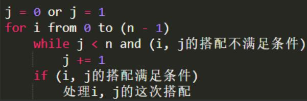


```java
/*
        方案四： 同向双指针
        同向双指针 （时间复杂度为 O(2 * n) = O(n)，空间复杂度 O(1) ）
        遍历每一个左指针 i,找到满足 sum(a[i],…,a[j]) >= s 的右指针 j,更新最短的子数组长度

        复杂度分析
        对于一个数字nums[i]，每个指针只会遍历一次,所以时间复杂度为 O(2 * n) = O(n),空间复杂度 O(1)
     */

    public int minimumSize5(int[] nums, int s) {
        if (nums == null || nums.length == 0) {
            return 0;
        }
        int n = nums.length;
        int minLength = Integer.MAX_VALUE;
        int sum = 0;
        int j= 0;
        for(int i =0; i < n;i++){
            while(j < n && sum < s){
                sum += nums[j];
                j++;
            }
            if(sum >= s){
                minLength = Math.min(minLength, j-i);
            }
            sum -= nums[i];
        }
        if(minLength == Integer.MAX_VALUE){
            return  0;
        }
        return  minLength;
    }
```


## **至少K个不同字符的子串 · Substring With At Least K Distinct Characters**


给定一个仅包含小写字母的字符串 `S`.返回 `S` 中至少包含 `k` 个不同字符的子串的数量.

```java
输入：
• S = "abcabcabca"， k = 4
• 输出： 0
• 输入：
• S = "abcaac"， k = 2
• 输出： 14
```


### 思路整理 

本题使用同向双指针实现 

使用 HashMap / dict 记录子串中每个字符的出现次数两个指针所对应的子串符合要求：累加计算以 i 开头的子串数量 

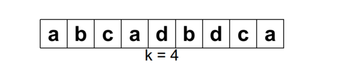

solution:

```java
 public long KDistinctCharacters(String s, int k) {
        if (s.length() == 0) {
            return 0;
        }
        int n = s.length();
        long numOfSubStrings = 0;
        int differentChars = 0;
        HashMap<Character, Integer> counter = new HashMap<>();
        int j = 0;
        for (int i = 0; i < n; i++) {
            while (j < n && differentChars < k) {
                Integer numOfThisChar = counter.getOrDefault(s.charAt(j), 0);
                counter.put(s.charAt(j), numOfThisChar + 1);
                if (counter.get(s.charAt(j)) == 1) {
                    differentChars++;
                }
                j++;
            }
            if (differentChars == k) {
                numOfSubStrings += n - j + 1;
            }
            counter.put(s.charAt(i), counter.get(s.charAt(i)) - 1);
            if (counter.get(s.charAt(i)) == 0) {
                differentChars--;
            }
        }
        return numOfSubStrings;

    }
```


## leetcode 76.最小覆盖子串

给定两个字符串 source 和 target ,求 source 中最短的包含 target 中每一个字符的子串 

```properties
• 输入: source = "abc"， target = "ac"
• 输出: "abc"
• 输入: source = "abcdadcda"， target = "accb"
• 输出: "bcdadc"
```

下面的思路是否可行？ 

**判断当前子串是否满足条件：遍历 targetCount 中的每个字符与 subCounter 中对应字符的数量** 

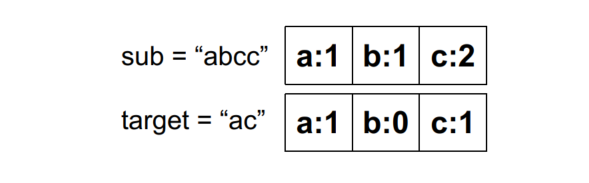


可行但是慢 

当 |target| 与字符串长度相等 ,每次遍历的复杂度为 O(|target|) ,算法退化至 O(n * |target|) ,|target| 为字符集大小，n 为字符串长度 。


使用计数器 matchedChars 

```properties
一个字符的数量从不符合条件到符合时，计数器加一 

一个字符的数量从符合条件到不符合时，计数器减一 

每次 O(1) 比较计数器和 targetCount 的大小 

相等则说明每个字符串都符合，需要更新答案 
```


```java
  /*
        时空复杂度
        时间复杂度：O(n + m)
        空间复杂度：O(|target| + |source|)
        n, m 为两串长度
        |target|，|source| 为两串字符集大小
    */
    public String minWindow(String source, String target) {
        if (target.length() == 0 || source.length() == 0) {
            return "";
        }
        int m = target.length();
        int n = source.length();
        // targetCounter 存放target 中的每种字符数量
        // subCounter 存放双指针对应子串中的每种字符数量
        HashMap<Character, Integer> targetCounter = new HashMap<>();
        HashMap<Character, Integer> subCounter = new HashMap<>();

        for (int i = 0; i < m; i++) {
            Integer numOfThisChar = targetCounter.getOrDefault(target.charAt(i), 0);
            targetCounter.put(target.charAt(i), numOfThisChar+1);
        }

        int j = 0;
        // matchedChars 存放匹配上的字符数量
        int matchedChars = 0;
        int start = 0;
        int subStringLength = Integer.MAX_VALUE;

        for (int i = 0; i < n; i++) {
            // j 指针前移条件； j< n 并且匹配数量不足
            while (j < n && matchedChars < targetCounter.size()) {
                // +1 后恰好相等，匹配数量加1
                Integer numOfThisChar = subCounter.getOrDefault(source.charAt(j), 0);
                subCounter.put(source.charAt(j), numOfThisChar + 1);

                // java 的 HashMap 中存放的是 Integer 对象，应使用 equals 比较值
                if (subCounter.get(source.charAt(j)).equals(targetCounter.get(source.charAt(j)))) {
                    matchedChars++;
                }
                j++;
            }

            // 达到目标匹配数量后，更新最短子串
            if (matchedChars == targetCounter.size()) {
                if (subStringLength > j - i) {
                    subStringLength = j - i;
                    start = i;
                }
            }
            // -1 后恰好差一个，匹配数量-1
            Integer numOfThisChar = subCounter.getOrDefault(source.charAt(i), 0);
            subCounter.put(source.charAt(i), numOfThisChar - 1);
            // java 的HashMap 中存放的是 Integer 对象，应使用 equals 比较值
            if (subCounter.get(source.charAt(i)).equals(targetCounter.getOrDefault(source.charAt(i), 0) - 1)) {
                matchedChars--;
            }

        }
        if (subStringLength == Integer.MAX_VALUE) {
            return "";
        }
        return source.substring(start, start + subStringLength);

    }

```


## 合并有序数组 

代表题： 合并有序数组 

[1,3,5,7]
[2,4,6,8]
=>
[1,2,3,4,5,6,7,8] 


solution: 原地排序的变体，nums1长度 = mums1元素+nums2元素 的长度

```java
public void merge(int[] nums1, int m, int[] nums2, int n) {
		    int i = m - 1; //从末尾开始
		    int j = n - 1; //从末尾开始
		    int k = m + n - 1; //从末尾开始
		    while (j >= 0) {
		        if (i < 0) {
		            while (j >= 0) {
		                nums1[k--] = nums2[j--];
		            }
		            return;
		        }
		        //哪个数大就对应的添加哪个数。
		        if (nums1[i] > nums2[j]) {
		            nums1[k--] = nums1[i--];
		        } else {
		            nums1[k--] = nums2[j--];
		        }
		    }
	 }
```


同理：如果是返回新的，直接new 一个新的数组就可以了。


##  加热器

```properties
• 给出两个数组： houses 和 heaters
• 分别代表一个一维坐标系上的 房屋坐标 和 加热器坐标
• 你的任务是找到一个最小的加热半径 k
• 保证所有房屋都能被加热器加热
• 所有加热器的加热半径相同， 均为 k
• 房屋和加热器坐标为正数， 且不会超过 10 ^ 9。
• 输入：
• houses = [1, 2, 3, 4], heaters = [1, 4]
• 输出： 1
```

样例：

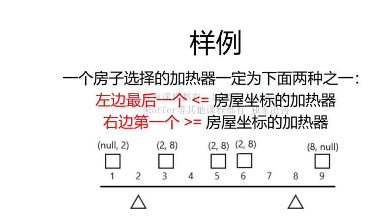


**问题转化**

```properties
第60页
对于某个数字 x，在一个数组中找到两个数字
一个是最接近 x 的最大值
一个是最接近 x 的最小值
相当于在数组中找到 x 的插入位置
《九章算法班》：二分法的第一重境界
```

### 解法一：二分法

```
遍历每一个房屋 houses[i]
二分查找 houses[i] 在 heaters 中的插入位置（j,j+1）
比较两个加热器和房子的距离，选取更近的距离作为加热半径
所有选取的加热半径的最大值即为答案。
（单个房子先贪心一下取最小值，就只能但所有房子我们就只能取最大值）
复杂度分析
排序 heaters ,O(m * log m)
遍历每一个房屋 house ,O(n)
二分 house 在  heaters 中的插入位置,O(log m)
总时间复杂度： O((n + m) * log m)
```

代码：

```java
public int findRadius(int[] houses ,int[] heaters){
    // 二分插入位置需要数组有序
    Arrays.sort(heaters);
    // 最近距离的最大值为最小的加热半径
    int heatRadius =0;
    // 遍历房屋找到最近的加热器距离
    for(int house : houses){
        int radius = getMinimumRadius(house ,heatRadius);
        heatRadius = Math.max(heatRadius,radius);
    }
    return heatRadius;
}
private int getMinimumRadius(int house, int[] heaters){
    int left =0;
    int right =heaters.length-1;

    while(left <right){
        int mid = left +(right -left)/2;
        if(heaters[mid]<= house){
            left =mid;
        }else{
            right = mid;
        }
    }
    // 在left 和 right 中找到答案
    int leftDistance = Math.abs(heaters[left] - house);
    int rightDistance = Math.abs(heaters[right] - house);
    return Math.min(leftDistance,rightDistance);
}
```


### 解法二：双数组型同向双指针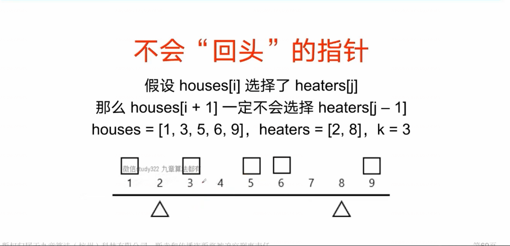

```
与解法一的思路异曲同工，利用最近的两个加热器
当亲的房子和最近两个加热器的距离中取到最小距离，最小距离的最大值就是答案
```

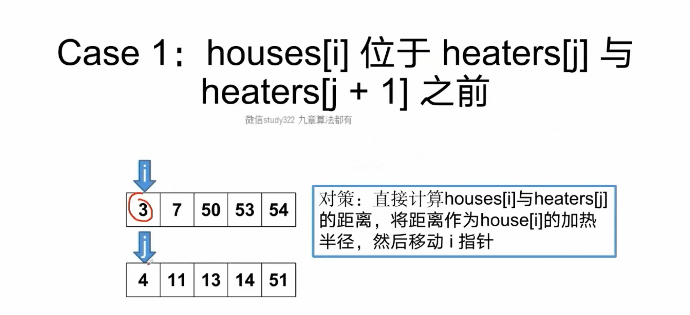

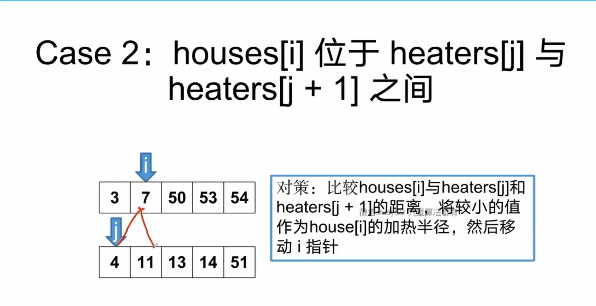

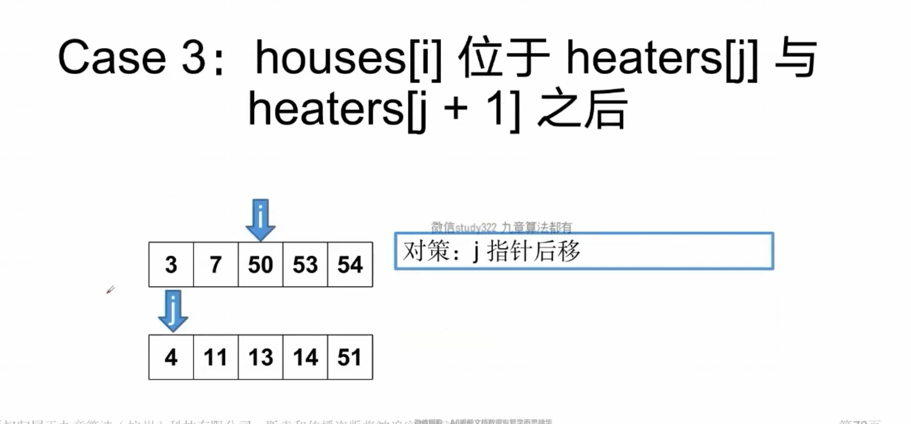

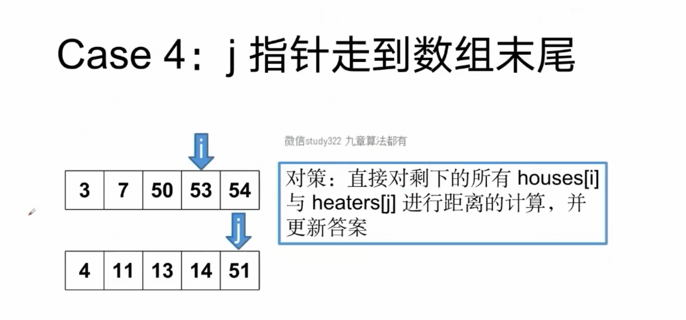

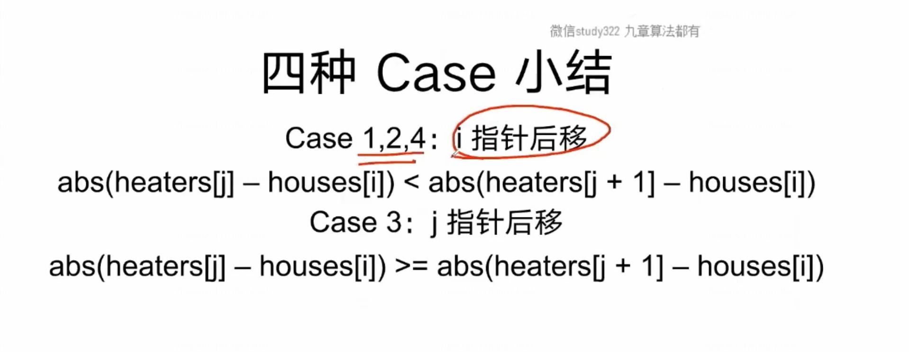

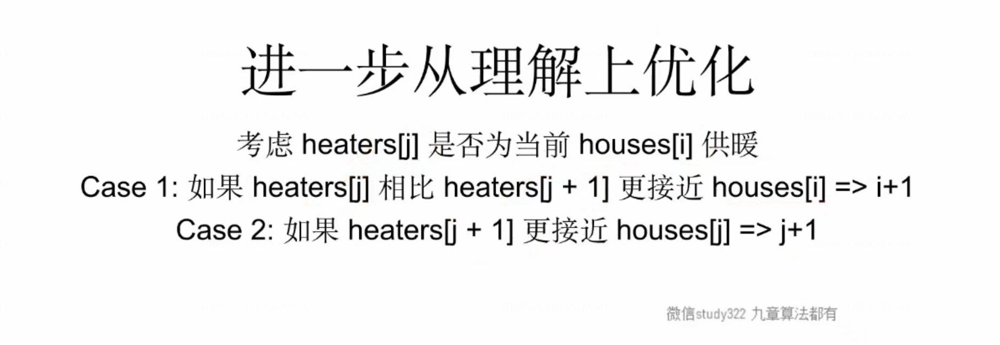


代码：

```java
private int getMinimumRadius(int house, int[] heaters) {
    int left = 0;
    int right = heaters.length - 1;

    while (left < right) {
        int mid = left + (right - left) / 2;
        if (heaters[mid] <= house) {
            left = mid;
        } else {
            right = mid;
        }
    }
    // 在left 和 right 中找到答案
    int leftDistance = Math.abs(heaters[left] - house);
    int rightDistance = Math.abs(heaters[right] - house);
    return Math.min(leftDistance, rightDistance);
}

/*
    不会回头的指针
    假设 houses[i] 选择了heaters[j]
    那么houses[i+1] 一定不会选择 heaters[j-1]
    houses = [1,3,5,6,9],heaters = [2,8], k =3

    解法二：双数组型同向双指针
    与解法一的思路异曲同工，利用最近的两个加热器
    当亲的房子和最近两个加热器的距离中取到最小距离，最小距离的最大值就是答案
 */

public int findRadius2(int[] houses, int[] heaters) {
    Arrays.sort(houses);
    Arrays.sort(heaters);

    int n = houses.length;
    int m = heaters.length;
    int i = 0;
    int j = 0;
    int heatRadius = 0;
    while (i < n && j < m) {
        int  nowRadius = Math.abs(heaters[j]-houses[i]);
        int nextRadius = Integer.MAX_VALUE;
        if(j < m-1){
            nextRadius = Math.abs(heaters[j+1]- houses[i]);
        }
        if(nowRadius < nextRadius){
            heatRadius = Math.max(heatRadius, nowRadius);
            i++;
        }else{
            j++;
        }
    }
    return heatRadius;
}
```

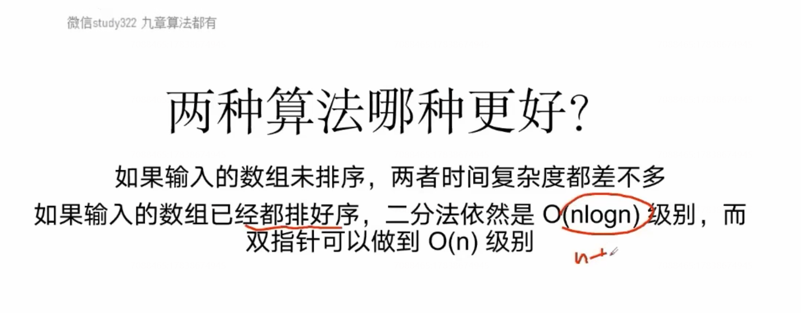


## 本章小结

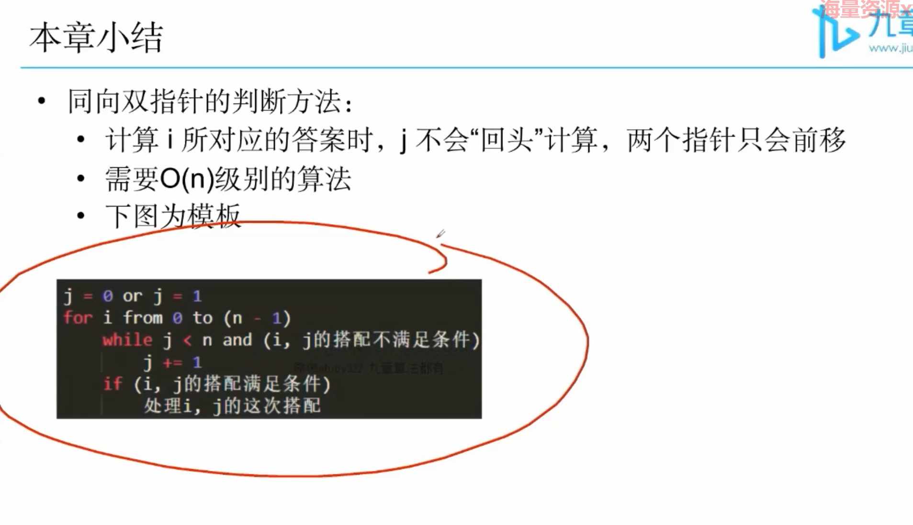


## 其他同向双指针题目

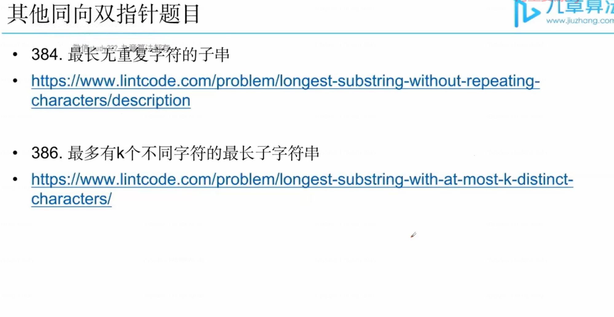

