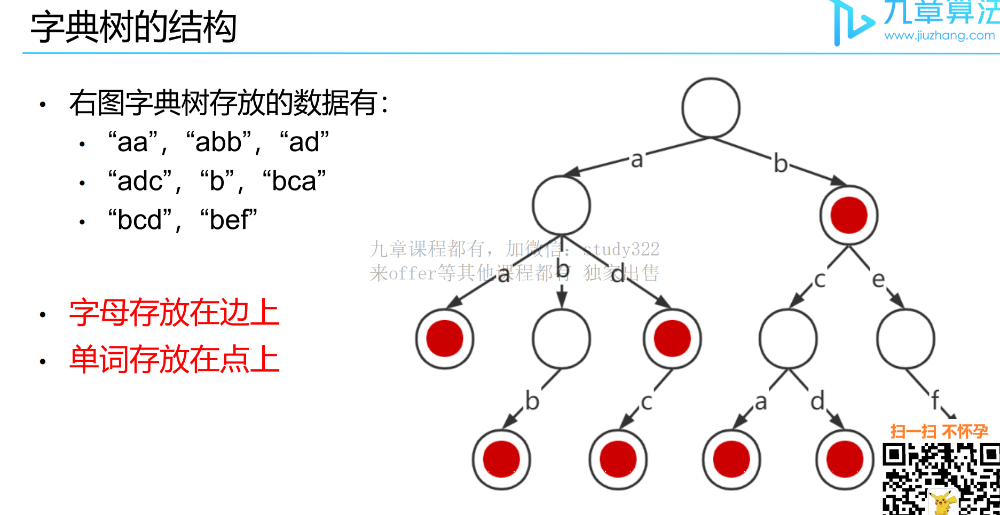

# 字典树

## 字典树的考察方式

1、判断前缀、单词是否存在于字典中(基本操作)

2、在字典树上DFS (题目较多，难度偏高)

3、利用其高效查询前缀、单词的优势，优化其他算法




## 单词的添加与查找

```
单词的添加与查找
addWord(word) 会在数据结构中添加一个单词。而search(word) 则支持普通的单
词查询或是只包含‘.’和a-z 的简易正则表达式的查询。一个‘.’可以代表一个任何的字母。
输入：            输出：
•addWord("abc")  true
•search("abc")   true
•search(".bc")   true
•search("a..")   false
```

### 解法一（不推荐）

```java
public class 单词的添加与查找 {

    /**
     * 解法一： 哈希表
     * 将所有的可能单词加入哈希表，如“a.” 对应“aa” –“az”每次search(word) 在哈希表中O(L) 查找串是否存在哈希表的解法存在什么缺点？
     * 每一个‘.’ 都对应26个字母
     * 个串长为L 的只含有‘.’ 的串，对应26^L 个不同的字符串
     * 枚举字符串的时间复杂度将达到O(26 ^ L)
     */
    Set<String> wordSet = new HashSet<>();
    public void addWord(String word) {
        wordSet.add(word);
    }

    public boolean search(String word) {
        return searchWord(word, 0, new StringBuffer(""));
    }

    private boolean searchWord(String word, int index, StringBuffer prefix) {
        if (index >= word.length()) {
            return wordSet.contains(prefix.toString());
        }

        boolean canMatch = false;
        if (word.charAt(index) != '.') {
            prefix.append(word.charAt(index));
            canMatch = searchWord(word, index + 1, prefix);
            prefix.deleteCharAt(prefix.length() - 1);
            return canMatch;
        }

        for (char ch = 'a'; ch <= 'z'; ch++) {
            prefix.append(ch);
            if (searchWord(word, index + 1, prefix)) {
                canMatch = true;
            }
            prefix.deleteCharAt(prefix.length() - 1);
        }
        return canMatch;
    }

```


### 解法二

```java
/**
 * 字典树
 */

class TrieNode {
    public Map<Character, TrieNode> children;
    public boolean isWord;
    public String word;

    public TrieNode() {
        children = new HashMap<Character, TrieNode>();
        isWord = false;
        word = null;
    }
}

class Trie {
    private TrieNode root;

    public Trie() {
        root = new TrieNode();
    }

    public TrieNode getRoot() {
        return root;
    }

    // 插入单词
    public void insert(String word) {
        // 指针 node 从根节点开始
        TrieNode node = root;
        // 遍历word 中的字符
        for (int i = 0; i < word.length(); i++) {
            char letter = word.charAt(i);
            if (!node.children.containsKey(letter)) {
                // 儿子节点中不存在该字符，需要新建一个儿子节点
                node.children.put(letter, new TrieNode());
            }
            // 指针移动至分对应字符的儿子节点
            node = node.children.get(letter);
        }
        node.isWord = true;
        node.word = word;
    }
}

class WordDictionary {
    Trie trie;

    public WordDictionary() {
        trie = new Trie();
    }

    public void addWord(String word) {
        trie.insert(word);
    }

    public boolean search(String word) {
        return dfs(trie.getRoot(), word, 0);
    }

    boolean dfs(TrieNode root, String word, int index) {
        if (index == word.length()) {
            return root.isWord;
        }
        char letter = word.charAt(index);
        if (letter == '.') {
            for (Character child : root.children.keySet()) {
                if (dfs(root.children.get(child), word, index + 1)) {
                    return true;
                }
            }
            return false;
        }
        if (root.children.containsKey(letter)) {
            return dfs(root.children.get(letter), word, index + 1);
        }
        return false;
    }

}
```

### 思路整理

对于“.”递归查找所有的儿子

对于a-z，如果对应儿子存在，则进入下一层递归

递归出口：最后一个字符判断完毕，返回是否合法


### 复杂度分析

字典树中的相同前缀越多，字典树的优化效果越明显

每次添加字符串，查询字符串复杂度最优均为O(L)

最坏情况仍然需要遍历整棵树来得到结果


