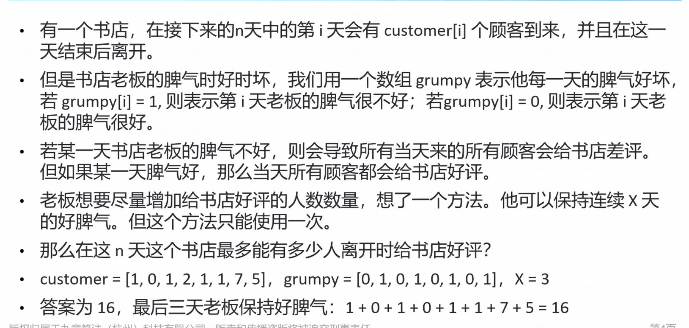
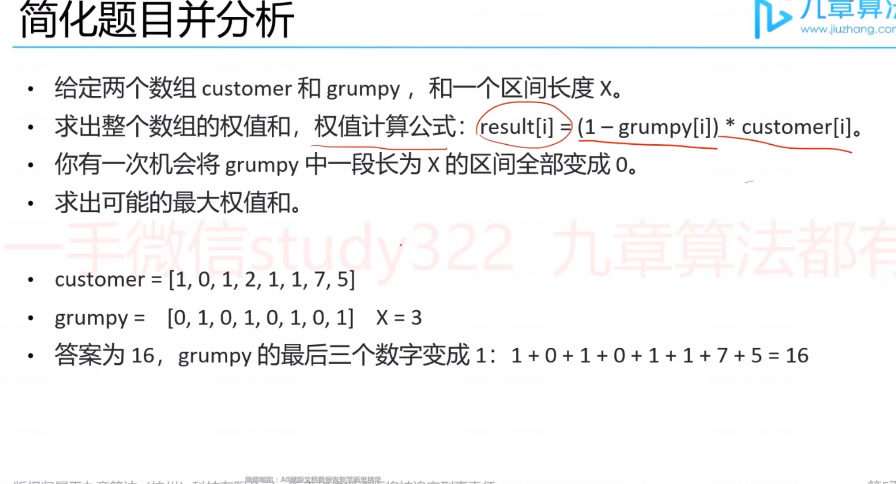

# 滑窗型双指针与隔板法


## 滑窗型双指针

滑窗（滑动窗口的简称） 

永远保证窗口长度永远都是k。

### 爱生气的书店老板



 解： x=3 说明窗口的长度是3。

简化题目并分析




**双指针保持等距，模拟滑窗。**

如何避免频繁计算窗口总和？

答：每次滑动仅影响首尾两个值，尾端弹出，首端加入。

代码：

```java
public int maxSatisfied(int[] customers, int[] grumpy, int x) {
    int n = customers.length;
    int sum = 0;
    for (int i = 0; i < n; i++) {
        if (i < x) {
            sum += customers[i];
        } else {
            sum += (1 - grumpy[i]) * customers[i];
        }
    }
    int result = sum;
    int left = 0;
    int right = x;
    while (right < n) {
        if (grumpy[right] == 1) {
            sum += customers[right];
        }
        if (grumpy[left] == 1) {
            sum -= customers[left];
        }
        result = Math.max(result, sum);
        left++;
        right++;
    }
    return result;
```


