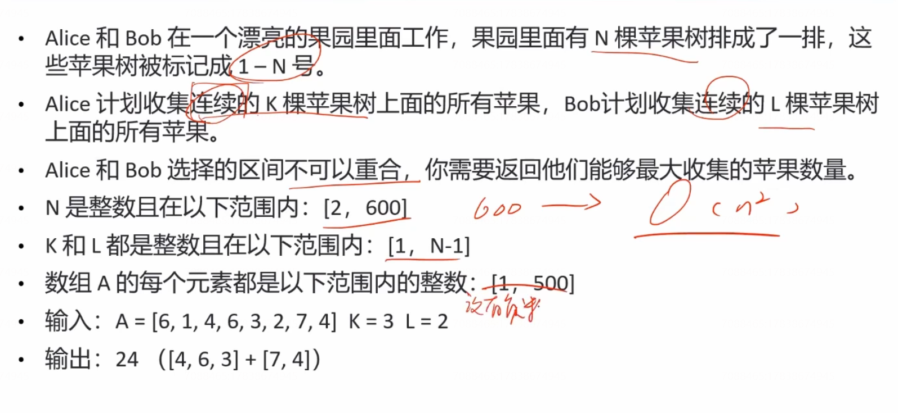

# 滑窗型双指针与隔板法


## 滑窗型双指针

滑窗（滑动窗口的简称） 

永远保证窗口长度永远都是k。

### 爱生气的书店老板


 解： x=3 说明窗口的长度是3。


#### 简化题目并分析


**双指针保持等距，模拟滑窗。**

如何避免频繁计算窗口总和？

答：每次滑动仅影响首尾两个值，尾端弹出，首端加入。

#### 代码

```java
public int maxSatisfied(int[] customers, int[] grumpy, int x) {
    int n = customers.length;
    int sum = 0;
    for (int i = 0; i < n; i++) {
        if (i < x) {
            sum += customers[i];
        } else {
            sum += (1 - grumpy[i]) * customers[i];
        }
    }
    int result = sum;
    int left = 0;
    int right = x;
    while (right < n) {
        if (grumpy[right] == 1) {
            sum += customers[right];
        }
        if (grumpy[left] == 1) {
            sum -= customers[left];
        }
        result = Math.max(result, sum);
        left++;
        right++;
    }
    return result;
```


## 双指针 +隔板法


### 捡苹果



#### 简化题目并分析


#### 代码

```java
public class 捡苹果 {

    /**
     * 通过隔板法转换成滑动窗口。
     * 复杂 ---> 简单
     */
    public int pickApples(int[] A, int K, int L) {
        int n = A.length;
        int maxApples = Integer.MIN_VALUE;

        for (int i = 0; i < n; i++) {
            int leftMaxL = findMax(A, L, 0, i);
            int rightMaxK = findMax(A, K, i, n);

            int leftMaxK = findMax(A, K, 0, i);
            int rightMaxL = findMax(A, L, i, n);

            if (leftMaxL != -1 && rightMaxK != -1) {
                maxApples = Math.max(leftMaxL + rightMaxK, maxApples);
            }
            if (leftMaxK != -1 && rightMaxL != -1) {
                maxApples = Math.max(leftMaxK + rightMaxL, maxApples);
            }
        }
        if (maxApples == Integer.MIN_VALUE) {
            return -1;
        }
        return maxApples;
    }


    // 滑动窗口
    int findMax(int[] A, int k, int start, int end) {
        if (k > end - start) {
            return -1;
        }
        int apples = 0, maxApples = 0;
        for (int i = start; i < start + k; i++) {
            apples += A[i];
        }
        maxApples = apples;

        int left = start, right = start + k;
        while (right < end) {
            apples -= A[left];
            apples += A[right];
            maxApples = Math.max(maxApples, apples);
            left++;
            right++;
        }
        return maxApples;
    }
}
```


## 隔板法


### **买卖股票的最佳时机 III**


#### 简化题目并分析


#### 代码

```java

```


