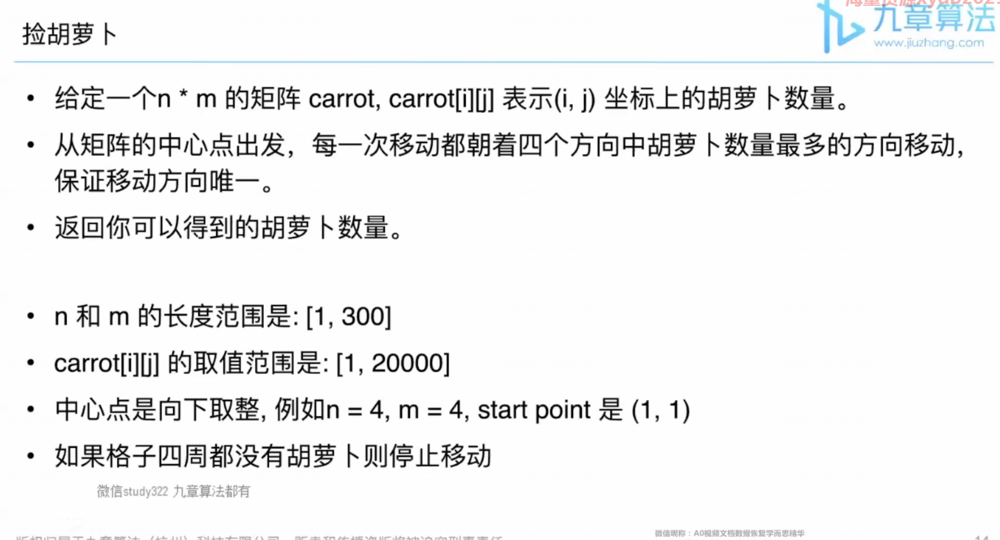
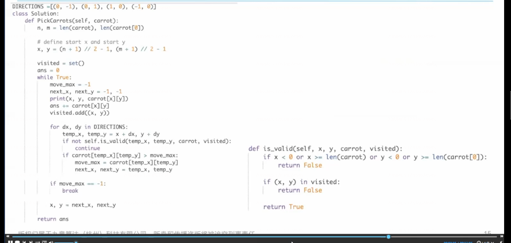
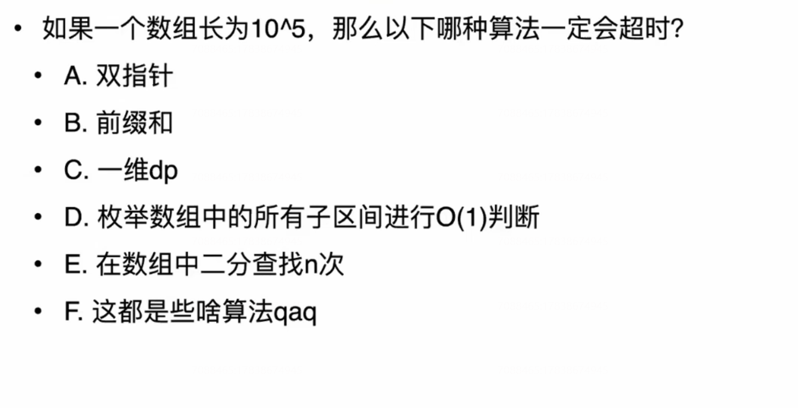
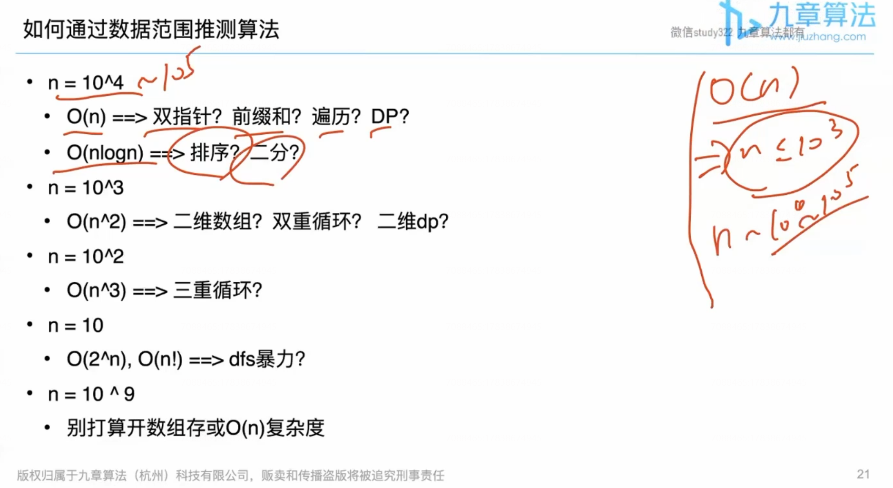
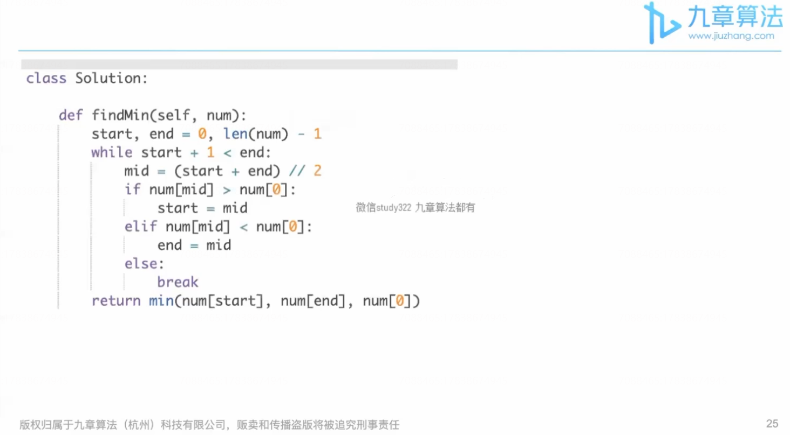
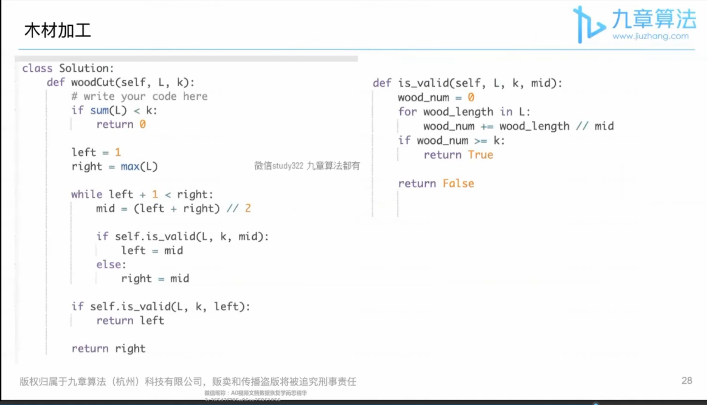

# 算法学习拓展知识


## 暴力、贪心、模拟是什么算法？


### 暴力（Brute Force）

你能想到的最简单算法

如： 两数之和（找到数组中两个数之和为target）

这道题属于双指针题。一整，出来了。

小白：暴力

```java
for i in range(n)
    for j in range(n)
        if nums[i] +nums[j]  ==target
        	return (i,j);
```


### 贪心（Greedy）

人的本性

什么时候会用到贪心？

直接考（10%）

与其他算法结合（90%）


### 模拟（implementation）

让你干啥就干啥

例：捡胡萝卜




恶心的题。




## 如何通过数据范围判断算法


一般评测机 1 s 能运算多少次？

10^7-10^9 次。



A、B、C 的时间复杂度是 O（n）的，而E 的时间复杂度是O(n long n),D 是 O（n^2）。





## 不一样的二分法

**非排序数组中的搜索 + 对答案进行二分**

#### 寻找旋转排序数组中的最小值

```java
假如一个排好序的数组在其某一未知点发生了旋转
如 0 1 2 4 5 6 7 可能变成 4 5 6 7 0 1 2 。你需要找到其中最小的元素值。
输入： [4,5,6,7,0,1,2]
输出： 0
解释：
数组中的最小值为0  见笔记.
```



####  木材加工

```java
有一些原木，现在像把这些木头切割成一些长度相同的小段木头，需要的得到小段的数目 至少为k
当然，我们希望得到的 小段越长越好，你需要计算能够得到的小段 木头的最大长度。
木头长度的单位是厘米。原木的长度都是正整数，我们要求切割得到的小段木头的长度也要求是整数。无法切出要求至少k段的，则返回0 即可。
L = [232,124,456]
K = 7
输出： 114
Explanation： 我们可以把它分成 114 cm 的7段，而115 cm 不可以
```




