# Spring Cloud 网关 Spring Cloud Gateway 入门


## 1. 概述

[Spring Cloud Gateway](https://github.com/spring-cloud/spring-cloud-gateway) 是由 [WebFlux](http://www.iocoder.cn/Spring-Boot/WebFlux/?self) + [Netty](https://github.com/YunaiV/netty) + [Reactor](https://github.com/reactor/reactor) 实现的**响应式**的 API 网关。

Spring Cloud Gateway 旨在为微服务架构提供一种简单且有效的 API 路由的管理方式，并基于 Filter 的方式提供网关的基本功能，例如说安全认证、监控、限流等等。

Spring Cloud Gateway 定位于取代 Netflix [Zuul](https://github.com/Netflix/zuul)，成为 Spring Cloud 生态系统的新一代网关。目前看下来非常成功，老的项目的网关逐步从 Zuul 迁移到 Spring Cloud Gateway，新项目的网关直接采用 Spring Cloud Gateway。相比 Zuul 来说，Spring Cloud Gateway 提供**更优秀的性能，更强大的有功能**。

> 友情提示：感兴趣的胖友可以看看[《性能测试 —— Spring Cloud Gateway、Zuul 基准测试》](http://www.iocoder.cn/Performance-Testing/SpringCloudGateway-Zuul-benchmark/?self)

Spring Cloud Gateway 的特征如下：

> FROM [spring-cloud-gateway#features](https://github.com/spring-cloud/spring-cloud-gateway#features) 翻译
>
> - 基于 Java 8 编码
> - 基于 Spring Framework 5 + Project Reactor + Spring Boot 2.0 构建
> - 支持动态路由，能够匹配任何请求属性上的路由
> - 支持内置到 Spring Handler 映射中的路由匹配
> - 支持基于 HTTP 请求的路由匹配（Path、Method、Header、Host 等等）
> - 集成了 Hystrix 断路器
> - 过滤器作用于匹配的路由
> - 过滤器可以修改 HTTP 请求和 HTTP 响应（增加/修改 Header、增加/修改请求参数、改写请求 Path 等等）
> - 支持 Spring Cloud DiscoveryClient 配置路由，与服务发现与注册配合使用
> - 支持限流

特性有点多，一边入门一边了解。实际上 Spring Cloud Gateway 还提供了很多其它特性，例如说还能够作为 WebSocket 的网关。

## 2. 为什么使用网关？

胖友可以后续阅读如下文章：

- [《一文带你 API 网关从入门到放弃》](http://www.iocoder.cn/Fight/This-article-takes-you-through-the-API-gateway-from-entry-to-abandonment/?self)
- [《微服务中的网关到底是个什么鬼？》](http://www.iocoder.cn/Fight/What-the-hell-is-a-gateway-in-microservices/?self)
- [《为什么微服务一定要有网关？》](http://www.iocoder.cn/Fight/Why-must-microservices-have-gateways/?self)

🙂 先继续 Spring Cloud Gateway 的入门。

## 3. 快速入门

> 示例代码对应仓库：[`labx-08-sc-gateway-demo01`](https://github.com/YunaiV/SpringBoot-Labs/tree/master/labx-08-spring-cloud-gateway/labx-08-sc-gateway-demo01)

本小节我们来对 Spring Cloud Gateway 进行快速入门。创建一个 [`labx-08-sc-gateway-demo01`](https://github.com/YunaiV/SpringBoot-Labs/tree/master/labx-08-spring-cloud-gateway/labx-08-sc-gateway-demo01) 项目，最终项目结构如下图：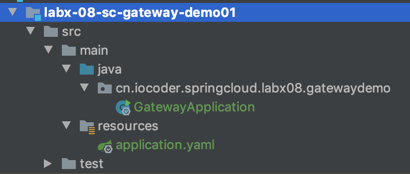

### 3.1 引入依赖

创建 [`pom.xml`](https://github.com/YunaiV/SpringBoot-Labs/blob/master/labx-08-spring-cloud-gateway/labx-08-sc-gateway-demo01/pom.xml) 文件中，主要引入 Spring Cloud Gateway 相关依赖。代码如下：


```xml
<?xml version="1.0" encoding="UTF-8"?>
<project xmlns="http://maven.apache.org/POM/4.0.0"
         xmlns:xsi="http://www.w3.org/2001/XMLSchema-instance"
         xsi:schemaLocation="http://maven.apache.org/POM/4.0.0 http://maven.apache.org/xsd/maven-4.0.0.xsd">
    <parent>
        <artifactId>labx-08</artifactId>
        <groupId>cn.iocoder.springboot.labs</groupId>
        <version>1.0-SNAPSHOT</version>
    </parent>
    <modelVersion>4.0.0</modelVersion>

    <artifactId>labx-08-sc-gateway-demo01</artifactId>

    <properties>
        <spring.boot.version>2.2.4.RELEASE</spring.boot.version>
        <spring.cloud.version>Hoxton.SR1</spring.cloud.version>
        <spring.cloud.alibaba.version>2.2.0.RELEASE</spring.cloud.alibaba.version>
    </properties>

    <!--
        引入 Spring Boot、Spring Cloud、Spring Cloud Alibaba 三者 BOM 文件，进行依赖版本的管理，防止不兼容。
        在 https://dwz.cn/mcLIfNKt 文章中，Spring Cloud Alibaba 开发团队推荐了三者的依赖关系
     -->
    <dependencyManagement>
        <dependencies>
            <dependency>
                <groupId>org.springframework.boot</groupId>
                <artifactId>spring-boot-starter-parent</artifactId>
                <version>${spring.boot.version}</version>
                <type>pom</type>
                <scope>import</scope>
            </dependency>
            <dependency>
                <groupId>org.springframework.cloud</groupId>
                <artifactId>spring-cloud-dependencies</artifactId>
                <version>${spring.cloud.version}</version>
                <type>pom</type>
                <scope>import</scope>
            </dependency>
            <dependency>
                <groupId>com.alibaba.cloud</groupId>
                <artifactId>spring-cloud-alibaba-dependencies</artifactId>
                <version>${spring.cloud.alibaba.version}</version>
                <type>pom</type>
                <scope>import</scope>
            </dependency>
        </dependencies>
    </dependencyManagement>

    <dependencies>
        <!-- 引入 Spring Cloud Gateway 相关依赖，使用它作为网关，并实现对其的自动配置 -->
        <dependency>
            <groupId>org.springframework.cloud</groupId>
            <artifactId>spring-cloud-starter-gateway</artifactId>
        </dependency>
    </dependencies>

</project>
```


在 `spring-cloud-starter-gateway` 依赖中，会引入 WebFlux、Reactor、Netty 等等依赖，如下图所示：

### 3.2 配置文件

创建 [`application.yaml`](https://github.com/YunaiV/SpringBoot-Labs/blob/master/labx-08-spring-cloud-gateway/labx-08-sc-gateway-demo01/src/main/resources/application.yaml) 配置文件，添加 Spring Cloud Gateway 相关配置。配置如下：


```xml
server:
  port: 8888

spring:
  cloud:
    # Spring Cloud Gateway 配置项，对应 GatewayProperties 类
    gateway:
      # 路由配置项，对应 RouteDefinition 数组
      routes:
        - id: yudaoyuanma # 路由的编号
          uri: http://www.iocoder.cn # 路由到的目标地址
          predicates: # 断言，作为路由的匹配条件，对应 RouteDefinition 数组
            - Path=/blog
          filters:
            - StripPrefix=1
        - id: oschina # 路由的编号
          uri: https://www.oschina.net # 路由的目标地址
          predicates: # 断言，作为路由的匹配条件，对应 RouteDefinition 数组
            - Path=/oschina
          filters: # 过滤器，对请求进行拦截，实现自定义的功能，对应 FilterDefinition 数组
            - StripPrefix=1
```


① `server.port` 配置项，设置网关的服务器端口。

② `spring.cloud.gateway` 配置项，Spring Cloud Gateway 配置项，对应 [GatewayProperties](https://github.com/spring-cloud/spring-cloud-gateway/blob/master/spring-cloud-gateway-core/src/main/java/org/springframework/cloud/gateway/config/GatewayProperties.java) 类。

这里我们主要使用了 `routes` 路由配置项，对应 [RouteDefinition](https://github.com/spring-cloud/spring-cloud-gateway/blob/master/spring-cloud-gateway-core/src/main/java/org/springframework/cloud/gateway/route/Route.java) 数组。路由（[Route](https://github.com/spring-cloud/spring-cloud-gateway/blob/master/spring-cloud-gateway-core/src/main/java/org/springframework/cloud/gateway/route/Route.java)）是 Gateway 中最基本的组件之一，由一个 ID、URI、一组谓语（Predicate）、过滤器（Filter）组成。一个请求如果满足某个路由的所有谓语，则匹配上该路由，最终过程如下图：

- ID：编号，路由的唯一标识。

- URI：路由指向的目标 URI，即请求最终被转发的目的地。

  > 例如说，这里配置的 `http://www.iocoder.cn` 或 `https://www.oschina.net`，就是被转发的地址。

- [Predicate](https://github.com/spring-cloud/spring-cloud-gateway/blob/master/spring-cloud-gateway-core/src/main/java/org/springframework/cloud/gateway/handler/AsyncPredicate.java)：谓语，作为路由的匹配条件。Gateway 内置了多种 Predicate 的[实现](https://github.com/spring-cloud/spring-cloud-gateway/blob/master/spring-cloud-gateway-core/src/main/java/org/springframework/cloud/gateway/handler/predicate/)，提供了多种请求的匹配条件，比如说基于请求的 Path、Method 等等。

  > 例如说，这里配置的 [`Path`](https://github.com/spring-cloud/spring-cloud-gateway/blob/master/spring-cloud-gateway-core/src/main/java/org/springframework/cloud/gateway/handler/predicate/PathRoutePredicateFactory.java) 匹配请求的 Path 地址。

- [Filter](https://github.com/spring-cloud/spring-cloud-gateway/blob/master/spring-cloud-gateway-core/src/main/java/org/springframework/cloud/gateway/filter/GatewayFilter.java)：过滤器，对请求进行拦截，实现自定义的功能。Gateway 内置了多种 Filter 的[实现](https://github.com/spring-cloud/spring-cloud-gateway/blob/master/spring-cloud-gateway-core/src/main/java/org/springframework/cloud/gateway/filter/factory/)，提供了多种请求的处理逻辑，比如说限流、熔断等等。

  > 例如说，这里配置的 [`StripPrefix`](https://github.com/spring-cloud/spring-cloud-gateway/blob/master/spring-cloud-gateway-core/src/main/java/org/springframework/cloud/gateway/filter/factory/StripPrefixGatewayFilterFactory.java) 会将请求的 Path 去除掉前缀。可能有点不好理解，我们以第一个 Route 举例子，假设我们请求 <http://127.0.0.1:8888/blog> 时：
  >
  > - 如果**有**配置 `StripPrefix` 过滤器，则转发到的最终 URI 为 [http://www.iocoder.cn](http://www.iocoder.cn/)，正确返回首页
  > - 如果**未**配置 `StripPrefix` 过滤器，转发到的最终 URI 为 <http://www.iocoder.cn/blog>，错误返回 404

### 3.3 GatewayApplication

创建 [GatewayApplication](https://github.com/YunaiV/SpringBoot-Labs/blob/master/labx-08-spring-cloud-gateway/labx-08-sc-gateway-demo01/src/main/java/cn/iocoder/springcloud/labx08/gatewaydemo/GatewayApplication.java) 类，网关的启动类。代码如下：


```java
@SpringBootApplication
public class GatewayApplication {

    public static void main(String[] args) {
        SpringApplication.run(GatewayApplication.class, args);
    }

}
```


### 3.4 简单测试

① 使用 GatewayApplication 启动网关。可以看到控制台打印 Spring Cloud Gateway 相关日志如下：


```
// 加载 Predicate 工厂
2020-02-25 01:07:58.205  INFO 58159 --- [           main] o.s.c.g.r.RouteDefinitionRouteLocator    : Loaded RoutePredicateFactory [After]
2020-02-25 01:07:58.205  INFO 58159 --- [           main] o.s.c.g.r.RouteDefinitionRouteLocator    : Loaded RoutePredicateFactory [Before]
2020-02-25 01:07:58.205  INFO 58159 --- [           main] o.s.c.g.r.RouteDefinitionRouteLocator    : Loaded RoutePredicateFactory [Between]
2020-02-25 01:07:58.205  INFO 58159 --- [           main] o.s.c.g.r.RouteDefinitionRouteLocator    : Loaded RoutePredicateFactory [Cookie]
2020-02-25 01:07:58.205  INFO 58159 --- [           main] o.s.c.g.r.RouteDefinitionRouteLocator    : Loaded RoutePredicateFactory [Header]
2020-02-25 01:07:58.205  INFO 58159 --- [           main] o.s.c.g.r.RouteDefinitionRouteLocator    : Loaded RoutePredicateFactory [Host]
2020-02-25 01:07:58.205  INFO 58159 --- [           main] o.s.c.g.r.RouteDefinitionRouteLocator    : Loaded RoutePredicateFactory [Method]
2020-02-25 01:07:58.205  INFO 58159 --- [           main] o.s.c.g.r.RouteDefinitionRouteLocator    : Loaded RoutePredicateFactory [Path]
2020-02-25 01:07:58.205  INFO 58159 --- [           main] o.s.c.g.r.RouteDefinitionRouteLocator    : Loaded RoutePredicateFactory [Query]
2020-02-25 01:07:58.205  INFO 58159 --- [           main] o.s.c.g.r.RouteDefinitionRouteLocator    : Loaded RoutePredicateFactory [ReadBodyPredicateFactory]
2020-02-25 01:07:58.205  INFO 58159 --- [           main] o.s.c.g.r.RouteDefinitionRouteLocator    : Loaded RoutePredicateFactory [RemoteAddr]
2020-02-25 01:07:58.205  INFO 58159 --- [           main] o.s.c.g.r.RouteDefinitionRouteLocator    : Loaded RoutePredicateFactory [Weight]
2020-02-25 01:07:58.206  INFO 58159 --- [           main] o.s.c.g.r.RouteDefinitionRouteLocator    : Loaded RoutePredicateFactory [CloudFoundryRouteService]

// 使用 Netty 作为服务器，占用 8888 端口
2020-02-25 01:07:58.620  INFO 58159 --- [           main] o.s.b.web.embedded.netty.NettyWebServer  : Netty started on port(s): 8888
```


② 使用浏览器，访问 `http://127.0.0.1:8888/blog`，成功转发到目标 URI `http://www.iocoder.cn`，如下图所示：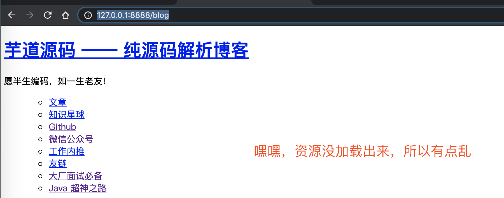

③ 使用浏览器，访问 `http://127.0.0.1:8888/oschina`，成功转发到目标 URI `http://www.oschina.net`，如下图所示：

### 3.5 整体架构

**注意**，一定要好好理解 Route、Predicate、Filter 这三个基础组件，Gateway 绝大多数代码都是围绕它们来运转的，如下图所示：

我们再来看看它们在 Gateway 的整体工作流程中的作用，如下图所示：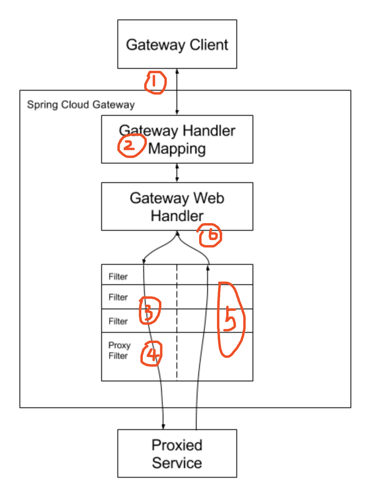

- ① Gateway 接收客户端请求。

- ② 请求与 Predicate 进行匹配，获得到对应的 Route。匹配成功后，才能继续往下执行。

- ③ 请求经过 Filter 过滤器链，执行前置（prev）处理逻辑。

  > 例如说，修改请求头信息等。

- ④ 请求被 Proxy Filter 转发至目标 URI，并最终获得响应。

  > 一般来说，目标 URI 是被代理的微服务，如果是在 Spring Cloud 架构中。

- ⑤ 响应经过 Filter 过滤器链，执行后置（post）处理逻辑。

- ⑥ Gateway 返回响应给客户端。

其实吧，整体流程和 SpringMVC 的 DispatcherServlet 差不多，只是说 SpringMVC 最终转发到 JVM 进程内的指定方法，而 Gateway 最终转发到远程的目标 URI。

> 友情提示：撸过 [SpringMVC 源码](http://www.iocoder.cn/Spring-MVC/good-collection/?self) 的胖友，欢迎来撸艿艿写的 [《芋道 Spring Cloud Gateway 源码解析系列》](http://www.iocoder.cn/categories/Spring-Cloud-Gateway/?self)。

无意中在网上翻到一张 Gateway 更清晰的整体工作流程的图，胖友可以在看看：

> FROM <https://www.javainuse.com/spring/cloud-filter>
>
> 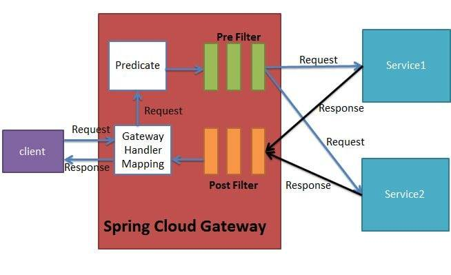

## 4. 基于注册中心实现动态路由

> 示例代码对应仓库：
>
> - 网关：[`labx-08-sc-gateway-demo02-registry`](https://github.com/YunaiV/SpringBoot-Labs/tree/master/labx-08-spring-cloud-gateway/labx-08-sc-gateway-demo02-registry)
> - 用户服务：[`labx-08-sc-user-service`](https://github.com/YunaiV/SpringBoot-Labs/blob/master/labx-08-spring-cloud-gateway/labx-08-sc-user-service/)

在[「3. 快速入门」](https://www.iocoder.cn/Spring-Cloud/Spring-Cloud-Gateway/#)小节，我们通过**配置文件**的方式，**手动**配置了 Gateway 路由信息。本小节，我们使用 Gateway 提供的与 Spring Cloud 注册中心的集成，从注册中心获取服务列表，并以服务名作为目标 URI 来**自动**创建**动态路由**。

我们直接从[「3. 快速入门」](https://www.iocoder.cn/Spring-Cloud/Spring-Cloud-Gateway/#)小节的 [`labx-08-sc-gateway-demo01`](https://github.com/YunaiV/SpringBoot-Labs/tree/master/labx-08-spring-cloud-gateway/labx-08-sc-gateway-demo01) 项目，复制出本小节的 [`labx-08-sc-gateway-demo02-registry`](https://github.com/YunaiV/SpringBoot-Labs/tree/master/labx-08-spring-cloud-gateway/labx-08-sc-gateway-demo02-registry) 项目来复制，**搭建 Gateway 基于注册中心实现动态路由的示例**。最终项目结构如下图：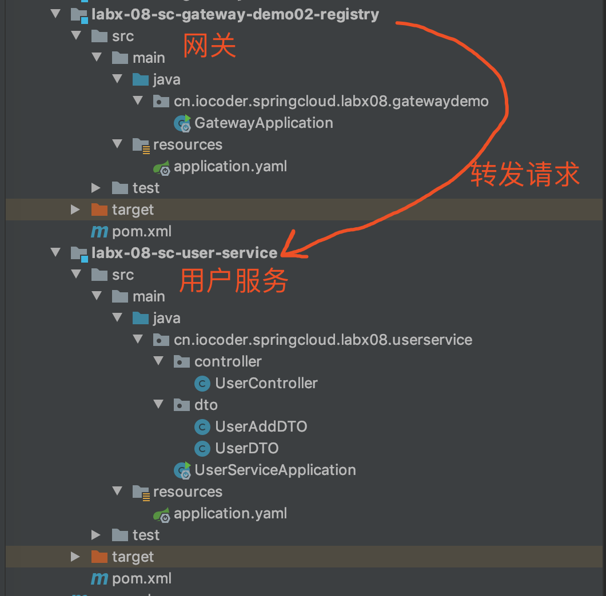

> 分割线：先进行网关项目的改造。

### 4.1 引入依赖

修改 [`pom.xml`](https://github.com/YunaiV/SpringBoot-Labs/blob/master/labx-08-spring-cloud-gateway/labx-08-sc-gateway-demo02-registry/pom.xml) 文件，引入注册中心 Nacos 相关的依赖如下：


```xml
<!-- 引入 Spring Cloud Alibaba Nacos Discovery 相关依赖，将 Nacos 作为注册中心，并实现对其的自动配置 -->
<dependency>
    <groupId>com.alibaba.cloud</groupId>
    <artifactId>spring-cloud-starter-alibaba-nacos-discovery</artifactId>
</dependency>
```


考虑到 Nacos 作为 Spring Cloud 架构中的注册中心，已经越来越流行了，所以本小节我们使用它。感兴趣的胖友，可以后面看看艿艿写的[《芋道 Spring Cloud Alibaba 注册中心 Nacos 入门》](http://www.iocoder.cn/Spring-Cloud-Alibaba/Nacos-Discovery/?self)文章。

### 4.2 配置文件

修改 [`application.yaml`](https://github.com/YunaiV/SpringBoot-Labs/blob/master/labx-08-spring-cloud-gateway/labx-08-sc-gateway-demo02-registry/src/main/resources/application.yaml) 配置文件，增加注册中心相关的配置项。完整配置如下：


```xml
server:
  port: 8888

spring:
  cloud:
    # Spring Cloud Gateway 配置项，对应 GatewayProperties 类
    gateway:
      # 路由配置项，对应 RouteDefinition 数组
      routes:
        - id: yudaoyuanma # 路由的编号
          uri: http://www.iocoder.cn # 路由到的目标地址
          predicates: # 断言，作为路由的匹配条件，对应 RouteDefinition 数组
            - Path=/blog
          filters:
            - StripPrefix=1
        - id: oschina # 路由的编号
          uri: https://www.oschina.net # 路由的目标地址
          predicates: # 断言，作为路由的匹配条件，对应 RouteDefinition 数组
            - Path=/oschina
          filters: # 过滤器，对请求进行拦截，实现自定义的功能，对应 FilterDefinition 数组
            - StripPrefix=1
      # 与 Spring Cloud 注册中心的集成，对应 DiscoveryLocatorProperties 类
      discovery:
        locator:
          enabled: true # 是否开启，默认为 false 关闭
          url-expression: "'lb://' + serviceId" # 路由的目标地址的表达式，默认为 "'lb://' + serviceId"

    # Nacos 作为注册中心的配置项
    nacos:
      discovery:
        server-addr: 127.0.0.1:8848 # Nacos 服务器地址
```


① `spring.cloud.nacos.discovery` 配置项，使用 Nacos 作为 Spring Cloud 注册中心的配置项。这里就不详细解释，毕竟 Nacos 不是主角。

② `spring.cloud.gateway.discovery` 配置项，Gateway 与 Spring Cloud 注册中心的集成，对应 [DiscoveryLocatorProperties](https://github.com/spring-cloud/spring-cloud-gateway/blob/master/spring-cloud-gateway-core/src/main/java/org/springframework/cloud/gateway/discovery/DiscoveryLocatorProperties.java) 类。

- `enable`：是否开启，默认为 `false` 关闭。这里我们设置为 `true`，开启与 Spring Cloud 注册中心的集成的功能。
- `url-expression`：路由的目标地址的 [Spring EL](https://docs.spring.io/spring/docs/4.3.10.RELEASE/spring-framework-reference/html/expressions.html) 表达式，默认为 `"'lb://' + serviceId"`。这里，我们设置的就是默认值。

可能 `url-expression` 配置项有点费解，我们来重点解释下。

- `lb://` 前缀，表示将请求**负载均衡**转发到对应的服务的实例。
- `"'lb://' + serviceId"` Spring EL 表达式，将从注册中心获得到的服务列表，每一个服务的名字对应 `serviceId`，最终使用 Spring EL 表达式进行格式化。

我们来举个例子，假设我们从注册中心假造到了 `user-service` 和 `order-service` 两个服务，最终效果和如下配置等价：


```xml
spring:
  cloud:
    gateway:
        routes:
            - id: ReactiveCompositeDiscoveryClient_user-service
              uri: lb://user-service
              predicates:
                - Path=/user-service/**
              filters:
                - RewritePath=/user-service/(?<remaining>.*), /${remaining} # 将 /user-service 前缀剔除
            - id: ReactiveCompositeDiscoveryClient_order-service
              uri: lb://order-service
              predicates:
                - Path=/order-service/**
              filters:
                - RewritePath=/order-service/(?<remaining>.*), /${remaining} # 将 /order-service 前缀剔除
```


友情提示：感兴趣的胖友，可以后续看看 [DiscoveryClientRouteDefinitionLocator](https://github.com/spring-cloud/spring-cloud-gateway/blob/master/spring-cloud-gateway-core/src/main/java/org/springframework/cloud/gateway/discovery/DiscoveryClientRouteDefinitionLocator.java) 类的源码，对应[《Spring-Cloud-Gateway 源码解析 —— 路由（1.4）之 DiscoveryClientRouteDefinitionLocator 注册中心》](http://www.iocoder.cn/Spring-Cloud-Gateway/route-definition-locator-discover-client/?self)文章。

> 分割线：再搭建用户服务来被 API 网关代理

### 4.3 搭建用户服务

创建 [`labx-08-sc-user-service`](https://github.com/YunaiV/SpringBoot-Labs/blob/master/labx-08-spring-cloud-gateway/labx-08-sc-user-service/) 项目，作为 `user-service` 用户服务。代码比较简单，艿艿就不瞎哔哔了。最终项目如下图所示：

### 4.4 简单测试

① 执行 UserServiceApplication 两次，启动两个 `user-service` 服务。启动完成后，在 Nacos 注册中心可以看到该服务的两个实例，如下图所示：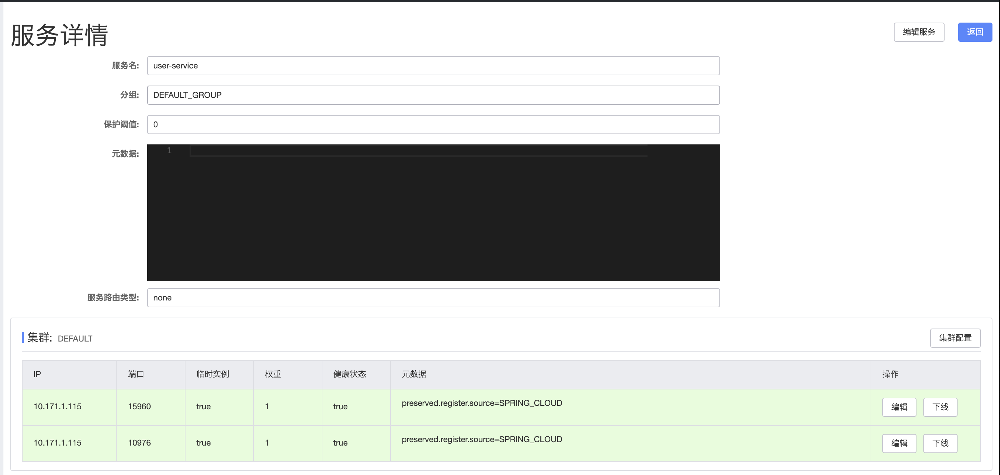

② 执行 GatewayApplication 启动网关。

③ 访问 <http://127.0.0.1:8888/user-service/user/get?id=1> 地址，返回 JSON 结果如下：


```
{
    "id": 1,
    "name": "没有昵称：1",
    "gender": 2
}
```


请求经过网关后，转发到 `user-service` 服务成功。

## 5. 基于配置中心 Apollo 实现动态路由

> 示例代码对应仓库：
>
> - 网关：[`labx-08-sc-gateway-demo03-config-apollo`](https://github.com/YunaiV/SpringBoot-Labs/tree/master/labx-08-spring-cloud-gateway/labx-08-sc-gateway-demo03-config-apollo)
> - 用户服务：[`labx-08-sc-user-service`](https://github.com/YunaiV/SpringBoot-Labs/blob/master/labx-08-spring-cloud-gateway/labx-08-sc-user-service/)

在[「4. 基于注册中心实现动态路由」](https://www.iocoder.cn/Spring-Cloud/Spring-Cloud-Gateway/#)小节中，我们使用 Gateway 提供的基于注册中心来**自动**创建**动态路由**的功能。但是很多时候，这个功能并不能满足我们的需求，例如说：

- 注册中心的服务这么多，我们并不想通过网关暴露所有的服务出去
- 每个服务的路由信息可能不同，会存在配置不同过滤器的情况

因此，我们可以引入配置中心 Apollo 来实现动态路由的功能，将 `spring.cloud.gateway` 配置项统一存储在 Apollo 中。同时，通过通过 Apollo 的实时监听器，在 `spring.cloud.gateway` 发生变化时，刷新内存中的路由信息。

当然，Gateway 中我们还是会使用注册中心，目的是为了获取服务的实例列表，只是不再使用 Gateway 基于注册中心来的动态路由功能而已。

我们直接从[「4. 基于注册中心实现动态路由」](https://www.iocoder.cn/Spring-Cloud/Spring-Cloud-Gateway/#)小节的 [`labx-08-sc-gateway-demo02-registry`](https://github.com/YunaiV/SpringBoot-Labs/tree/master/labx-08-spring-cloud-gateway/labx-08-sc-gateway-demo02-registry) 项目，复制出本小节的 [`labx-08-sc-gateway-demo03-config-apollo`](https://github.com/YunaiV/SpringBoot-Labs/tree/master/labx-08-spring-cloud-gateway/labx-08-sc-gateway-demo03-config-apollo) 项目，**搭建 Gateway 基于配置中心 Apollo 实现动态路由的示例**。最终项目结构如下图：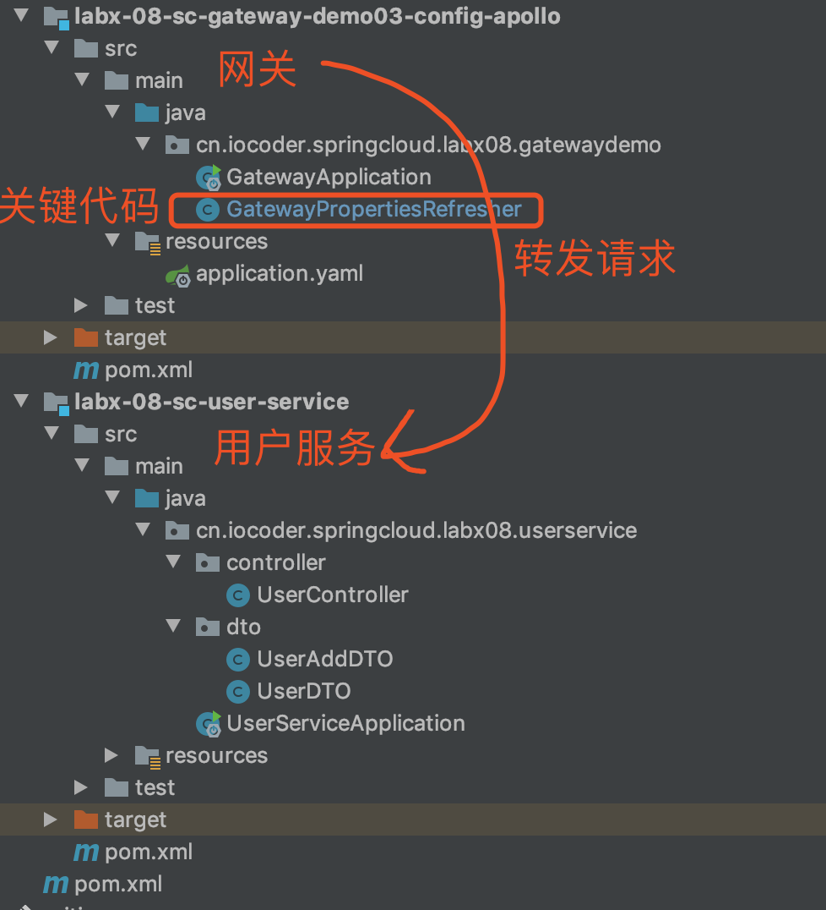

> 分割线：先进行网关项目的改造。

### 5.1 引入依赖

修改 [`pom.xml`](https://github.com/YunaiV/SpringBoot-Labs/blob/master/labx-08-spring-cloud-gateway/labx-08-sc-gateway-demo03-config-apollo/pom.xml) 文件，引入配置中心 Apollo 相关的依赖如下：


```xml
<!--  引入 Apollo 客户端，内置对 Apollo 的自动化配置 -->
<dependency>
    <groupId>com.ctrip.framework.apollo</groupId>
    <artifactId>apollo-client</artifactId>
    <version>1.5.1</version>
</dependency>
```


### 5.2 配置文件

修改 [`application.yaml`](https://github.com/YunaiV/SpringBoot-Labs/blob/master/labx-08-spring-cloud-gateway/labx-08-sc-gateway-demo03-config-apollo/src/main/resources/application.yaml) 配置文件，增加 Apollo 相关的配置项。完整配置如下：


```xml
server:
  port: 8888

spring:
  application:
    name: gateway-application

  cloud:
    # Spring Cloud Gateway 配置项，全部配置在 Apollo 中
#    gateway:

    # Nacos 作为注册中心的配置项
    nacos:
      discovery:
        server-addr: 127.0.0.1:8848 # Nacos 服务器地址

# Apollo 相关配置项
app:
  id: ${spring.application.name} # 使用的 Apollo 的项目（应用）编号
apollo:
  meta: http://127.0.0.1:8080 # Apollo Meta Server 地址
  bootstrap:
    enabled: true # 是否开启 Apollo 配置预加载功能。默认为 false。
    eagerLoad:
      enable: true # 是否开启 Apollo 支持日志级别的加载时机。默认为 false。
    namespaces: application # 使用的 Apollo 的命名空间，默认为 application。
```


① `spring.cloud.gateway` 配置项，我们都删除了，统一在 Apollo 中进行配置。

为了演示 Gateway 启动时，从 Apollo 加载 `spring.cloud.gateway` 配置项，作为初始的路由信息，我们在 Apollo 配置如下：

- 默认将请求转发到艿艿的博客 [http://www.iocoder.cn](http://www.iocoder.cn/)，嘿嘿~

配置对应文本内容如下：


```xml
spring.cloud.gateway.routes[0].id = github_route
spring.cloud.gateway.routes[0].uri = http://www.iocoder.cn/
spring.cloud.gateway.routes[0].predicates[0] = Path=/**
```


② `app.id` 和 `apollo` 配置项，为 Apollo 相关配置项。这里就不详细解释，毕竟 Apollo 不是主角。感兴趣的胖友，可以阅读[《芋道 Spring Boot 配置中心 Apollo 入门》](http://www.iocoder.cn/Spring-Boot/config-apollo/?self)文章。

### 5.3 GatewayPropertiesRefresher

创建 [GatewayPropertiesRefresher](https://github.com/YunaiV/SpringBoot-Labs/blob/master/labx-08-spring-cloud-gateway/labx-08-sc-gateway-demo03-config-apollo/src/main/java/cn/iocoder/springcloud/labx08/gatewaydemo/GatewayPropertiesRefresher.java) 类，监听 Apollo 中的`spring.cloud.gateway` 发生变化时，刷新内存中的路由信息。代码如下：

> 友情提示：如下的代码，我们省略了部分，避免 100 多行吓到胖友哦。


```java
@Component
public class GatewayPropertiesRefresher implements ApplicationContextAware, ApplicationEventPublisherAware {

    private static final Logger logger = LoggerFactory.getLogger(GatewayPropertiesRefresher.class);

    private ApplicationContext applicationContext;
    private ApplicationEventPublisher publisher;
    @Autowired
    private RouteDefinitionWriter routeDefinitionWriter;
    @Override
    public void setApplicationContext(ApplicationContext applicationContext) throws BeansException {
        this.applicationContext = applicationContext;
    }
    @Override
    public void setApplicationEventPublisher(ApplicationEventPublisher applicationEventPublisher) {
        this.publisher = applicationEventPublisher;
    }

    @ApolloConfigChangeListener(interestedKeyPrefixes = "spring.cloud.gateway.") // <1>
    public void onChange(ConfigChangeEvent changeEvent) {
        refreshGatewayProperties(changeEvent);
    }

    private void refreshGatewayProperties(ConfigChangeEvent changeEvent) {
        logger.info("Refreshing GatewayProperties!");
        // <2>
        preDestroyGatewayProperties(changeEvent);
        // <3>
        this.applicationContext.publishEvent(new EnvironmentChangeEvent(changeEvent.changedKeys()));
        // <4>
        refreshGatewayRouteDefinition();
        logger.info("GatewayProperties refreshed!");
    }

    // ... 省略被调用的方法，一会说。

}
```


① `<1>` 处，通过 Apollo 提供的 [`@ApolloConfigChangeListener`](https://github.com/ctripcorp/apollo/blob/master/apollo-client/src/main/java/com/ctrip/framework/apollo/spring/annotation/ApolloConfigChangeListener.java) 注解，声明监听 `spring.cloud.gateway.` 配置项的刷新。

② `<2>` 处，调用 `#preDestroyGatewayProperties(ConfigChangeEvent changeEvent)` 方法，处理 `spring.cloud.gateway.routes` 或 `spring.cloud.gateway.default-filters` 配置项可能被**删除光**的特殊骚操作。代码如下：


```java
private static final String ID_PATTERN = "spring\\.cloud\\.gateway\\.routes\\[\\d+\\]\\.id";
private static final String DEFAULT_FILTER_PATTERN = "spring\\.cloud\\.gateway\\.default-filters\\[\\d+\\]\\.name";

@Autowired
private GatewayProperties gatewayProperties;

private synchronized void preDestroyGatewayProperties(ConfigChangeEvent changeEvent) {
    logger.info("Pre Destroy GatewayProperties!");
    // 判断 `spring.cloud.gateway.routes` 配置项，是否被全部删除。如果是，则置空 GatewayProperties 的 `routes` 属性
    final boolean needClearRoutes = this.checkNeedClear(changeEvent, ID_PATTERN, this.gatewayProperties.getRoutes().size());
    if (needClearRoutes) {
        this.gatewayProperties.setRoutes(new ArrayList<>());
    }
    // 判断 `spring.cloud.gateway.default-filters` 配置项，是否被全部删除。如果是，则置空 GatewayProperties 的 `defaultFilters` 属性
    final boolean needClearDefaultFilters = this.checkNeedClear(changeEvent, DEFAULT_FILTER_PATTERN, this.gatewayProperties.getDefaultFilters().size());
    if (needClearDefaultFilters) {
        this.gatewayProperties.setRoutes(new ArrayList<>());
    }
    logger.info("Pre Destroy GatewayProperties finished!");
}

// 判断是否清除的标准，是通过指定配置项被删除的数量，是否和内存中的该配置项的数量一样。如果一样，说明被清空了
private boolean checkNeedClear(ConfigChangeEvent changeEvent, String pattern, int existSize) {
    return changeEvent.changedKeys().stream().filter(key -> key.matches(pattern))
            .filter(key -> {
                ConfigChange change = changeEvent.getChange(key);
                return PropertyChangeType.DELETED.equals(change.getChangeType());
            }).count() == existSize;
}
```


因为 GatewayProperties 没有 `@PreDestroy` 注解的 destroy 方法，所以 Spring Cloud Context 的 [`ConfigurationPropertiesRebinder#rebind(String name)`](https://github.com/spring-cloud/spring-cloud-commons/blob/master/spring-cloud-context/src/main/java/org/springframework/cloud/context/properties/ConfigurationPropertiesRebinder.java#L87-L116) 中 [destroyBean](https://github.com/spring-cloud/spring-cloud-commons/blob/master/spring-cloud-context/src/main/java/org/springframework/cloud/context/properties/ConfigurationPropertiesRebinder.java#L99-L100) 无法销毁**当前的** GatewayProperties Bean 对象。

- 如果把 `spring.cloud.gateway.` 前缀的配置项全部删除（例如需要动态删除最后一个路由的场景），[initializeBean](https://github.com/spring-cloud/spring-cloud-commons/blob/master/spring-cloud-context/src/main/java/org/springframework/cloud/context/properties/ConfigurationPropertiesRebinder.java#L101-L102) 时也无法创建**新的** GatewayProperties Bean 对象，则 `return` **当前的** GatewayProperties Bean 对象。
- 若仍保留有 `spring.cloud.gateway.routes[n]` 或 `spring.cloud.gateway.default-filters[n]` 等配置项，[initializeBean](https://github.com/spring-cloud/spring-cloud-commons/blob/master/spring-cloud-context/src/main/java/org/springframework/cloud/context/properties/ConfigurationPropertiesRebinder.java#L101-L102) 会时会注入**新的** GatewayProperties Bean 对象。

`#preDestroyGatewayProperties(ConfigChangeEvent changeEvent)` 提供类似 `@PreDestroy` 的操作，根据 `spring.cloud.gateway.` 配置项的实际情况把 `GatewayProperties.routes` 和 `GatewayProperties.defaultFilters` 两个集合情况。

> 友情提示：这块逻辑艿艿也理解了蛮久，现在还是理解的还不是很透彻，胖友可以选择性理解。

③ `<3>` 处，发布 Spring Cloud Context [EnvironmentChangeEvent](https://github.com/spring-cloud/spring-cloud-commons/blob/master/spring-cloud-context/src/main/java/org/springframework/cloud/context/environment/EnvironmentChangeEvent.java) 事件，通知 `spring.cloud.gateway` 配置项发生变化，从而实现使用到注入**新的**GatewayProperties Bean。例如说，我们这里 `@Autowired` 注入的 GatewayProperties。

④ `<4>` 处，调用 `#refreshGatewayRouteDefinition()` 方法，发布 Gateway [RefreshRoutesEvent](https://github.com/spring-cloud/spring-cloud-gateway/blob/master/spring-cloud-gateway-core/src/main/java/org/springframework/cloud/gateway/event/RefreshRoutesEvent.java) 事件，从而刷新内存中的路由信息。代码如下：


```java
private void refreshGatewayRouteDefinition() {
    logger.info("Refreshing Gateway RouteDefinition!");
    this.publisher.publishEvent(new RefreshRoutesEvent(this));
    logger.info("Gateway RouteDefinition refreshed!");
}
```


目前具体监听该事件的有两个：

- [CachingRouteDefinitionLocator](https://github.com/spring-cloud/spring-cloud-gateway/blob/master/spring-cloud-gateway-core/src/main/java/org/springframework/cloud/gateway/route/CachingRouteDefinitionLocator.java) 刷新路由**定义**
- [CachingRouteLocator](https://github.com/spring-cloud/spring-cloud-gateway/blob/master/spring-cloud-gateway-core/src/main/java/org/springframework/cloud/gateway/route/CachingRouteLocator.java) 刷新路由**信息**

> 分割线：再搭建用户服务来被 API 网关代理

### 5.4 搭建用户服务

创建 [`labx-08-sc-user-service`](https://github.com/YunaiV/SpringBoot-Labs/blob/master/labx-08-spring-cloud-gateway/labx-08-sc-user-service/) 项目，作为 `user-service` 用户服务。代码比较简单，艿艿就不瞎哔哔了。最终项目如下图所示：

### 5.5 简单测试

① 执行 UserServiceApplication 两次，启动两个 `user-service` 服务。

② 执行 GatewayApplication 启动网关。

使用浏览器，访问 <http://127.0.0.1:8888/> 地址，返回艿艿的博客首页，如下图所示：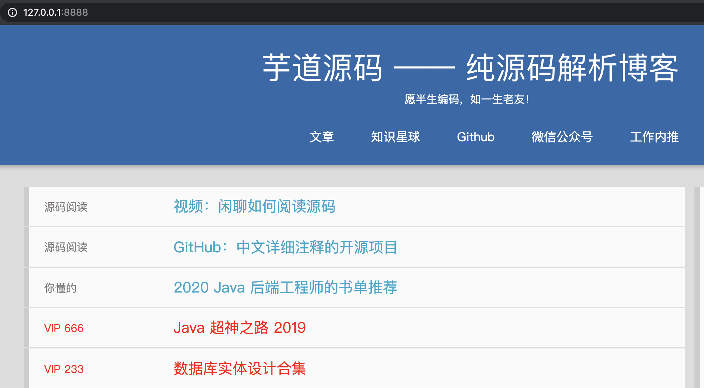

③ 修改在 Apollo 的 `spring.cloud.gateway` 配置项，转发请求到用户服务。如下图所示：

配置对应文本内容如下：


```xml
spring.cloud.gateway.routes[0].id = ReactiveCompositeDiscoveryClient_user-service
spring.cloud.gateway.routes[0].uri = lb://user-service
spring.cloud.gateway.routes[0].predicates[0] = Path=/user/**
spring.cloud.gateway.routes[0].filters[0] = StripPrefix=1
```


此时 IDEA 控制台看到 GatewayPropertiesRefresher 监听到 `spring.cloud.gateway` 配置项刷新，并打印日志如下：


```xml
2020-02-26 01:11:48.974  INFO 77076 --- [Apollo-Config-1] c.i.s.l.g.GatewayPropertiesRefresher     : Refreshing GatewayProperties!
2020-02-26 01:11:48.974  INFO 77076 --- [Apollo-Config-1] c.i.s.l.g.GatewayPropertiesRefresher     : Pre Destroy GatewayProperties!
2020-02-26 01:11:48.975  INFO 77076 --- [Apollo-Config-1] c.i.s.l.g.GatewayPropertiesRefresher     : Pre Destroy GatewayProperties finished!
2020-02-26 01:11:49.000  INFO 77076 --- [Apollo-Config-1] c.i.s.l.g.GatewayPropertiesRefresher     : Refreshing Gateway RouteDefinition!
2020-02-26 01:11:49.001  INFO 77076 --- [Apollo-Config-1] c.i.s.l.g.GatewayPropertiesRefresher     : Gateway RouteDefinition refreshed!
2020-02-26 01:11:49.001  INFO 77076 --- [Apollo-Config-1] c.i.s.l.g.GatewayPropertiesRefresher     : GatewayProperties refreshed!
```


④ 访问 <http://127.0.0.1:8888/user/user/get?id=1> 地址，返回 JSON 结果如下：


```
{
    "id": 1,
    "name": "没有昵称：1",
    "gender": 2
}
```


请求经过网关后，转发到 `user-service` 服务成功。

## 6. 基于配置中心 Nacos 实现动态路由

> 示例代码对应仓库：
>
> - 网关：[`labx-08-sc-gateway-demo03-config-nacos`](https://github.com/YunaiV/SpringBoot-Labs/tree/master/labx-08-spring-cloud-gateway/labx-08-sc-gateway-demo03-config-nacos)
> - 用户服务：[`labx-08-sc-user-service`](https://github.com/YunaiV/SpringBoot-Labs/blob/master/labx-08-spring-cloud-gateway/labx-08-sc-user-service/)

在[「4. 基于注册中心实现动态路由」](https://www.iocoder.cn/Spring-Cloud/Spring-Cloud-Gateway/#)小节中，我们使用 Gateway 提供的基于注册中心来**自动**创建**动态路由**的功能。但是很多时候，这个功能并不能满足我们的需求，例如说：

- 注册中心的服务这么多，我们并不想通过网关暴露所有的服务出去
- 每个服务的路由信息可能不同，会存在配置不同过滤器的情况

因此，我们可以引入配置中心 Nacos 来实现动态路由的功能，将 `spring.cloud.gateway` 配置项统一存储在 Nacos 中。同时，通过通过 Nacos 的实时监听器，在 `spring.cloud.gateway` 发生变化时，刷新内存中的路由信息。

当然，Gateway 中我们还是会使用注册中心，目的是为了获取服务的实例列表，只是不再使用 Gateway 基于注册中心来的动态路由功能而已。

我们直接从[「4. 基于注册中心实现动态路由」](https://www.iocoder.cn/Spring-Cloud/Spring-Cloud-Gateway/#)小节的 [`labx-08-sc-gateway-demo02-registry`](https://github.com/YunaiV/SpringBoot-Labs/tree/master/labx-08-spring-cloud-gateway/labx-08-sc-gateway-demo02-registry) 项目，复制出本小节的 [`labx-08-sc-gateway-demo03-config-nacos`](https://github.com/YunaiV/SpringBoot-Labs/tree/master/labx-08-spring-cloud-gateway/labx-08-sc-gateway-demo03-config-nacos) 项目，**搭建 Gateway 基于配置中心 Nacos 实现动态路由的示例**。最终项目结构如下图：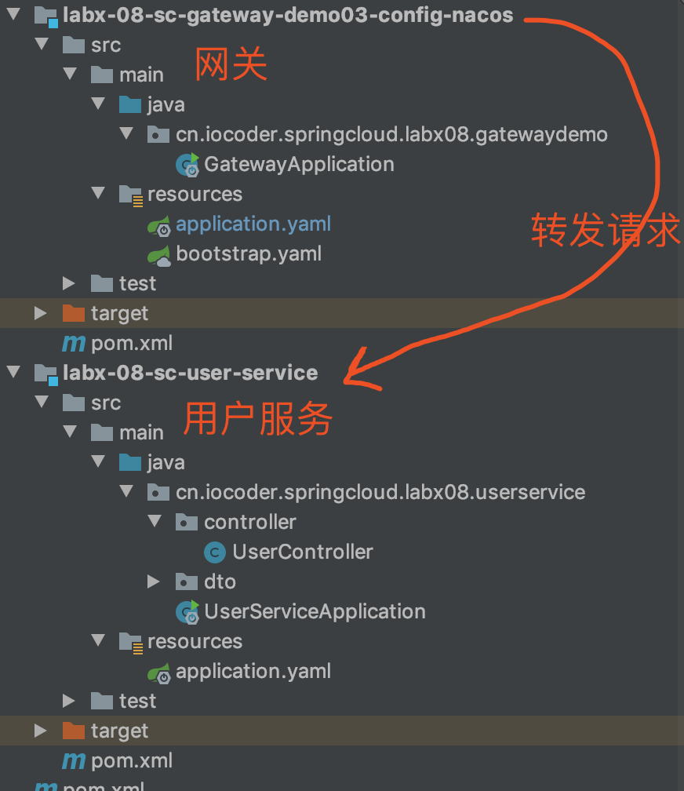

> 分割线：先进行网关项目的改造。

### 6.1 引入依赖

修改 [`pom.xml`](https://github.com/YunaiV/SpringBoot-Labs/blob/master/labx-08-spring-cloud-gateway/labx-08-sc-gateway-demo03-config-nacos/pom.xml) 文件，引入配置中心 Nacos 相关的依赖如下：


```xml
<!-- 引入 Spring Cloud Alibaba Nacos Config 相关依赖，将 Nacos 作为配置中心，并实现对其的自动配置 -->
<dependency>
    <groupId>com.alibaba.cloud</groupId>
    <artifactId>spring-cloud-starter-alibaba-nacos-config</artifactId>
</dependency>
```


### 6.2 配置文件

① 创建 [`bootstrap.yaml`](https://github.com/YunaiV/SpringBoot-Labs/blob/master/labx-08-spring-cloud-gateway/labx-08-sc-gateway-demo03-config-nacos/src/main/resources/bootstrap.yaml) 配置文件，添加配置中心 Nacos 相关的配置。配置如下：


```
spring:
  application:
    name: gateway-application

  cloud:
    nacos:
      # Nacos Config 配置项，对应 NacosConfigProperties 配置属性类
      config:
        server-addr: 127.0.0.1:8848 # Nacos 服务器地址
        namespace: # 使用的 Nacos 的命名空间，默认为 null
        group: DEFAULT_GROUP # 使用的 Nacos 配置分组，默认为 DEFAULT_GROUP
        name: # 使用的 Nacos 配置集的 dataId，默认为 spring.application.name
        file-extension: yaml # 使用的 Nacos 配置集的 dataId 的文件拓展名，同时也是 Nacos 配置集的配置格式，默认为 properties
```


`spring.cloud.nacos.config` 配置项，为配置中心 Nacos 相关配置项。这里就不详细解释，毕竟 Nacos 不是主角。感兴趣的胖友，可以阅读[《芋道 Spring Cloud Alibaba 配置中心 Nacos 入门》](http://www.iocoder.cn/Spring-Cloud-Alibaba/Nacos-Config/?self)文章。

② 修改 [`application.yaml`](https://github.com/YunaiV/SpringBoot-Labs/blob/master/labx-08-spring-cloud-gateway/labx-08-sc-gateway-demo03-config-nacos/src/main/resources/application.yaml) 配置文件，删除 Gateway 相关的配置。完整配置如下：


```
server:
  port: 8888

spring:

  cloud:
    # Spring Cloud Gateway 配置项，全部配置在 Nacos 中
#    gateway:

    # Nacos 作为注册中心的配置项
    nacos:
      discovery:
        server-addr: 127.0.0.1:8848 # Nacos 服务器地址
```


`spring.cloud.gateway` 配置项，我们都删除了，统一在配置中心 Nacos 中进行配置。

为了演示 Gateway 启动时，从 Nacos 加载 `spring.cloud.gateway` 配置项，作为初始的路由信息，我们在 Nacos 配置如下：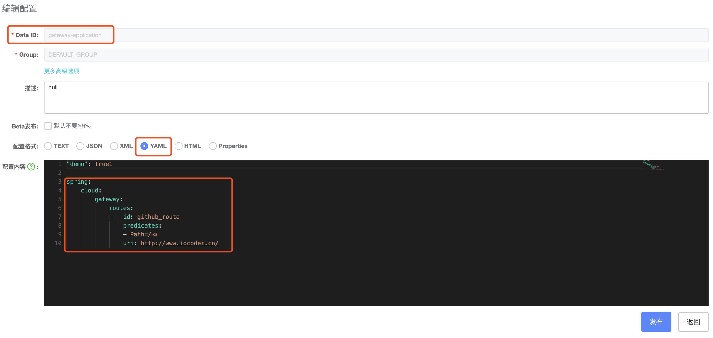

- 默认将请求转发到艿艿的博客 [http://www.iocoder.cn](http://www.iocoder.cn/)，嘿嘿~

配置对应文本内容如下：


```
spring:
    cloud:
        gateway:
            routes:
            -   id: github_route
                predicates:
                - Path=/**
                uri: http://www.iocoder.cn/
```


### 6.3 Nacos 配置监听器

在 Nacos 配置发生变化时，Spring Cloud Alibaba Nacos Config [内置的监听器](https://github.com/alibaba/spring-cloud-alibaba/blob/master/spring-cloud-alibaba-nacos-config/src/main/java/com/alibaba/cloud/nacos/refresh/NacosContextRefresher.java#L123-L150) 会监听到配置刷新，最终触发 Gateway 的路由信息刷新。完整流程如下图所示：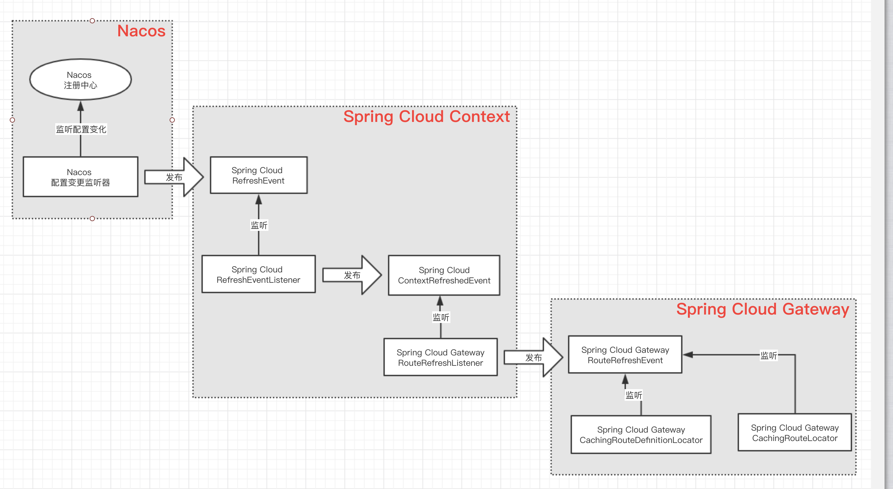

- [CachingRouteDefinitionLocator](https://github.com/spring-cloud/spring-cloud-gateway/blob/master/spring-cloud-gateway-core/src/main/java/org/springframework/cloud/gateway/route/CachingRouteDefinitionLocator.java) 刷新路由**定义**
- [CachingRouteLocator](https://github.com/spring-cloud/spring-cloud-gateway/blob/master/spring-cloud-gateway-core/src/main/java/org/springframework/cloud/gateway/route/CachingRouteLocator.java) 刷新路由**信息**

> 友情提示：极端情况下，假设胖友把 `spring.cloud.gateway` 配置项**完全**删除，无法实现 Gateway 的路由信息的**全部**删除。不过一般情况下，我们貌似也不会这么干，嘿嘿~
>
> 感兴趣的胖友，可以看看[「5.3 GatewayPropertiesRefresher」](https://www.iocoder.cn/Spring-Cloud/Spring-Cloud-Gateway/#)小节的内容，略微进行改造，进行支持。

> 分割线：再搭建用户服务来被 API 网关代理

### 6.4 搭建用户服务

创建 [`labx-08-sc-user-service`](https://github.com/YunaiV/SpringBoot-Labs/blob/master/labx-08-spring-cloud-gateway/labx-08-sc-user-service/) 项目，作为 `user-service` 用户服务。代码比较简单，艿艿就不瞎哔哔了。最终项目如下图所示：

### 6.5 简单测试

① 执行 UserServiceApplication 两次，启动两个 `user-service` 服务。

② 执行 GatewayApplication 启动网关。

使用浏览器，访问 <http://127.0.0.1:8888/> 地址，返回艿艿的博客首页，如下图所示：

③ 修改在 Nacos 的 `spring.cloud.gateway` 配置项，转发请求到用户服务。如下图所示：[Nacos 配置项](https://static.iocoder.cn/images/Spring-Cloud/2020-08-01/33.png)

配置对应文本内容如下：


```
spring:
    cloud:
        gateway:
            routes:
            -   filters:
                - StripPrefix=1
                id: ReactiveCompositeDiscoveryClient_user-service
                predicates:
                - Path=/user/**
                uri: lb://user-service
```


此时 IDEA 控制台看到 GatewayPropertiesRefresher 监听到 `spring.cloud.gateway` 配置项刷新，并打印日志如下图：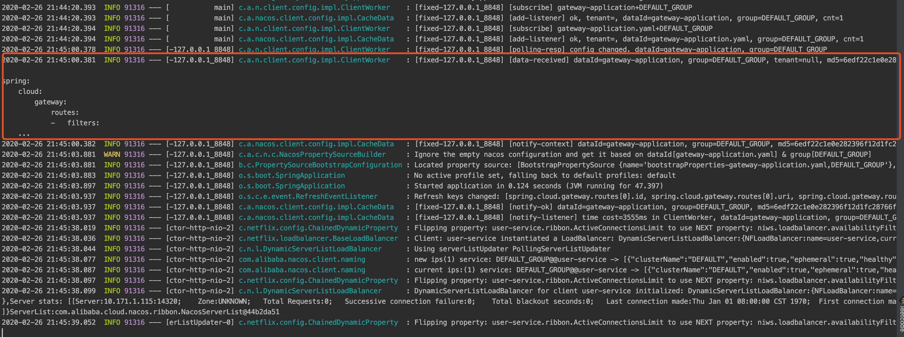

④ 访问 <http://127.0.0.1:8888/user/user/get?id=1> 地址，返回 JSON 结果如下：


```
{
    "id": 1,
    "name": "没有昵称：1",
    "gender": 2
}
```


请求经过网关后，转发到 `user-service` 服务成功。

## 7. Route Predicate

Gateway **内置**了多种 Route Predicate 实现，将请求匹配到对应的 Route 上。并且，多个 Route Predicate 是可以**组合**实现，满足我们绝大多数的路由匹配规则。

而 Predicate 的创建，实际是通过其对应的 [Predicate Factory](https://github.com/spring-cloud/spring-cloud-gateway/blob/master/spring-cloud-gateway-core/src/main/java/org/springframework/cloud/gateway/handler/predicate/RoutePredicateFactory.java) **工厂**来完成。艿艿将它们使用脑图进行梳理，最终如下图所示：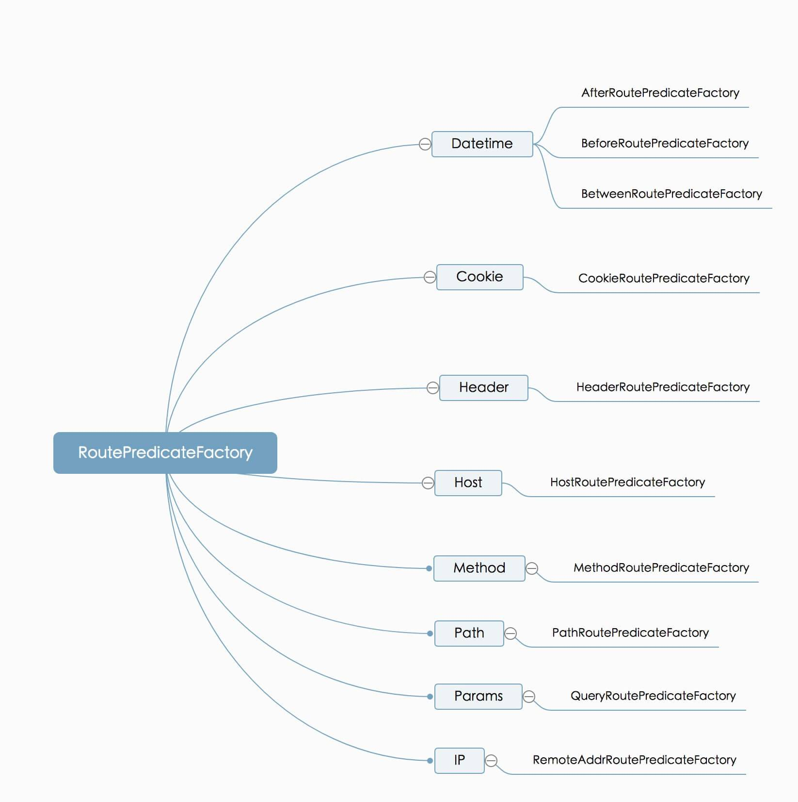

一般情况下，我们主要使用 `Path` 和 `Host` 两个 Predicate，甚至只使用 `Path`。所以具体每个 Predicate 的使用，胖友可以在有需要的时候，再看看如下两篇文章：

- [《Spring Cloud Gateway 源码解析 —— 处理器 (3.1) 之 RoutePredicateFactory 路由谓语工厂》](http://www.iocoder.cn/Spring-Cloud-Gateway/handler-route-predicate-factory/?self)
- [《Spring Cloud Gateway 官方文档 —— Route Predicate Factories》](https://cloud.spring.io/spring-cloud-gateway/reference/html/#gateway-request-predicates-factories)

如果内置的 Predicate 无法满足胖友的需求，我们参考[《Spring Cloud Gateway —— Predicate 断言使用与自定义》](http://www.iocoder.cn/Fight/Spring-Cloud-Gateway-Predicate-Predicate-usage-and-customization/?self)文章，实现自定义的 Predicate 实现。不过貌似真的想不太到，需要自定义的场景。

## 8. 灰度发布

> 示例代码对应仓库：[`labx-08-sc-gateway-demo04`](https://github.com/YunaiV/SpringBoot-Labs/tree/master/labx-08-spring-cloud-gateway/labx-08-sc-gateway-demo04)

Gateway 内置的 [**Weight** Route Predicate](https://github.com/spring-cloud/spring-cloud-gateway/blob/master/spring-cloud-gateway-core/src/main/java/org/springframework/cloud/gateway/handler/predicate/WeightRoutePredicateFactory.java) 实现非常有趣，提供了基于**权重**的匹配条件，为网关实现[**灰度发布**](http://www.iocoder.cn/Fight/Micro-service-deployment-blue-green-deployment-rolling-deployment-grayscale-release-canary-release/?self)提供了基础。

> 灰度发布（又名金丝雀发布）是指在黑与白之间，能够平滑过渡的一种发布方式。
>
> 在其上可以进行 A/B testing，即让一部分用户继续用产品特性 A，一部分用户开始用产品特性 B，如果用户对 B 没有什么反对意见，那么逐步扩大范围，把所有用户都迁移到 B 上面来。灰度发布可以保证整体系统的稳定，在初始灰度的时候就可以发现、调整问题，以保证其影响度。

例如说，目前线上正在运行用户服务的版本为 `1.0.0`。现在我们新开发的 `1.1.0` 版本已经完成所有测试流程，准备发布上线。考虑到平滑发布，先只将 5% 的流量转发到**新**版本，而 95% 的流量继续转发到**老**版本。如下图所示：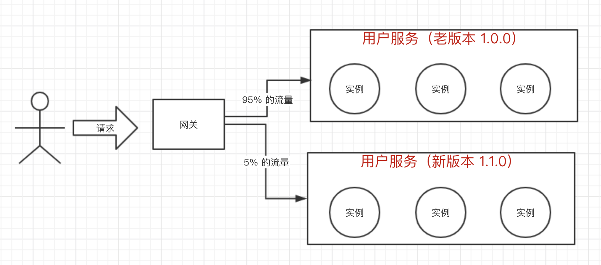

新版本在线上运行稳定后，逐步将所有流量都转发到其上。还是老样子，

下面，我们来**搭建 Gateway 权重路由的示例**。从[「3. 快速入门」](https://www.iocoder.cn/Spring-Cloud/Spring-Cloud-Gateway/#)小节的 [`labx-08-sc-gateway-demo01`](https://github.com/YunaiV/SpringBoot-Labs/tree/master/labx-08-spring-cloud-gateway/labx-08-sc-gateway-demo01) 项目，复制出本小节的 [`labx-08-sc-gateway-demo04`](https://github.com/YunaiV/SpringBoot-Labs/tree/master/labx-08-spring-cloud-gateway/labx-08-sc-gateway-demo04) 项目，最终项目结构如下图：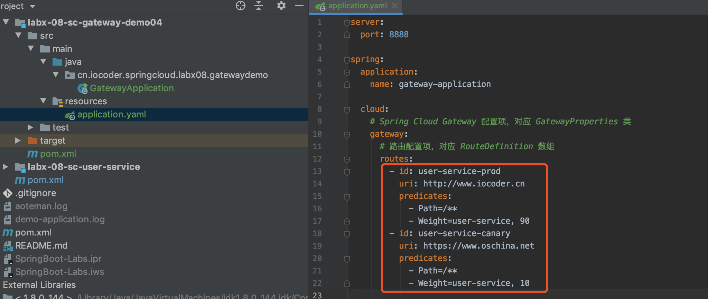

### 8.1 配置文件

修改 [`application.yaml`](https://github.com/YunaiV/SpringBoot-Labs/blob/master/labx-08-spring-cloud-gateway/labx-08-sc-gateway-demo04/src/main/resources/application.yaml) 配置文件，增加权重匹配的路由。完整配置如下：


```xml
server:
  port: 8888

spring:
  application:
    name: gateway-application

  cloud:
    # Spring Cloud Gateway 配置项，对应 GatewayProperties 类
    gateway:
      # 路由配置项，对应 RouteDefinition 数组
      routes:
        - id: user-service-prod
          uri: http://www.iocoder.cn
          predicates:
            - Path=/**
            - Weight=user-service, 90
        - id: user-service-canary
          uri: https://www.oschina.net
          predicates:
            - Path=/**
            - Weight=user-service, 10
```


一共创建 `user-service` 的两个路由配置项，分别是 `user-service-prod` 和 `user-service-canary`：

- 使用 `Path` 匹配条件为 `/**`，设置**相同**的路径条件。
- 使用 `Weight` 匹配条件，设置**不同**的权重条件。其中，第一个参数为权重**分组**，需要配置成**相同**，一般和服务名相同即可；第二个参数为权重**比例**。

这里我们配置的 `uri` 暂时不是胖友可能希望的 `lb://user-service`，这是为什么呢？Gateway 的权重路由仅仅提供了灰度发布的基础，实际还是需要做一定的改造，例如说：

- 第一，Spring Cloud 微服务在注册到注册中心时，需要在元数据中带上**版本号**。例如说，`version = 1.0.0`、`version = 1.1.0`。

- 第二，Gateway 在 `lb://serviceId` 负载均衡选择请求的服务实例时，需要增加基于**版本号**的选择规则。

  > 友情提示：目前常用的负载均衡组件 Ribbon 暂未提供基于版本的负载均衡规则，需要胖友自己去略微拓展下，并不复杂噢。

因此，考虑到是示例演示，艿艿就暂时只配置了两个可爱的普通地址，嘿嘿~

### 8.2 简单测试

① 执行 GatewayApplication 启动网关。

② 使用浏览器，访问 [http://127.0.0.1:8888](http://127.0.0.1:8888/) 地址，90% 的情况下返回 [http://www.iocoder.cn](http://www.iocoder.cn/)，10% 的情况下返回 [https://www.oschina.net](https://www.oschina.net/)，符合预期~

ps：如果胖友对灰度发布比较感兴趣，可以看看 <https://github.com/Nepxion/Discovery> 项目。


## todo