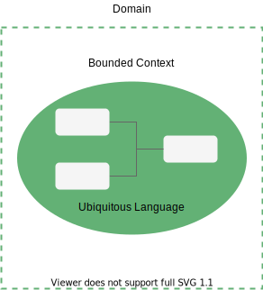
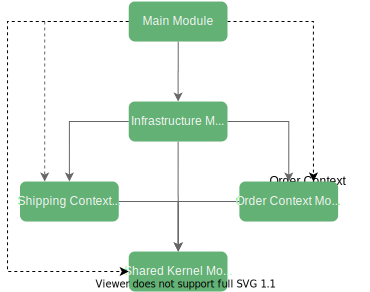

# DDD 有界上下文和 Java 模块


## 1 概述

**领域驱动设计 (DDD) 是一组原则和工具，可帮助我们设计有效的软件架构以提供更高的业务价值**。限界上下文是通过将整个应用程序域分离为多个语义一致的部分来从大泥球中拯救架构的核心和基本模式之一。

同时，借助[Java 9 模块系统](https://www.baeldung.com/java-9-modularity)，我们可以创建强封装的模块。

在本教程中，我们将创建一个简单的商店应用程序，并了解如何在为有界上下文定义显式边界的同时利用 Java 9 模块。


## 2 DDD 有界上下文

如今，软件系统不是简单的[CRUD 应用程序](https://www.baeldung.com/spring-boot-crud-thymeleaf)。实际上，典型的单体企业系统由一些遗留代码库和新添加的特性组成。但是，随着每次更改，维护此类系统变得越来越难。最终，它可能变得完全无法维护。


### 2.1 限界上下文和无处不在的语言

为了解决已解决的问题，DDD 提供了有界上下文的概念。**有界上下文是特定术语和规则一致适用的域的逻辑边界**。在这个边界内，**所有的术语、定义和概念都构成了无处不在的语言。**

特别是，通用语言的主要好处是将来自特定业务领域不同领域的项目成员组合在一起。

此外，多个上下文可能适用于同一事物。但是，在这些上下文中，它可能具有不同的含义。




### 2.2 订单上下文

让我们通过定义 Order Context 开始实现我们的应用程序。此上下文包含两个实体：*OrderItem*和*CustomerOrder*。


*CustomerOrder*实体是一个[聚合](https://www.baeldung.com/spring-persisting-ddd-aggregates) 根：

```java
public class CustomerOrder {
    private int orderId;
    private String paymentMethod;
    private String address;
    private List<OrderItem> orderItems;

    public float calculateTotalPrice() {
        return orderItems.stream().map(OrderItem::getTotalPrice)
          .reduce(0F, Float::sum);
    }
}
```

如我们所见，该类包含*calculateTotalPrice*业务方法。但是，在现实世界的项目中，它可能会复杂得多——例如，在最终价格中包括折扣和税收。

接下来，让我们创建*OrderItem*类：

```java
public class OrderItem {
    private int productId;
    private int quantity;
    private float unitPrice;
    private float unitWeight;
}
```

我们已经定义了实体，但我们还需要向应用程序的其他部分公开一些 API。让我们创建*CustomerOrderService*类：

```java
public class CustomerOrderService implements OrderService {
    public static final String EVENT_ORDER_READY_FOR_SHIPMENT = "OrderReadyForShipmentEvent";

    private CustomerOrderRepository orderRepository;
    private EventBus eventBus;

    @Override
    public void placeOrder(CustomerOrder order) {
        this.orderRepository.saveCustomerOrder(order);
        Map<String, String> payload = new HashMap<>();
        payload.put("order_id", String.valueOf(order.getOrderId()));
        ApplicationEvent event = new ApplicationEvent(payload) {
            @Override
            public String getType() {
                return EVENT_ORDER_READY_FOR_SHIPMENT;
            }
        };
        this.eventBus.publish(event);
    }
}
```

在这里，我们有一些要点要强调。placeOrder*方法*负责处理客户订单。**处理完订单后，将事件发布到EventBus**。我们将在接下来的章节中讨论事件驱动的通信。该服务提供*OrderService*接口的默认实现：

```java
public interface OrderService extends ApplicationService {
    void placeOrder(CustomerOrder order);

    void setOrderRepository(CustomerOrderRepository orderRepository);
}
```

此外，此服务需要*CustomerOrderRepository*来保存订单：

```java
public interface CustomerOrderRepository {
    void saveCustomerOrder(CustomerOrder order);
}
```

重要的是**这个接口不是在这个上下文中实现的，而是由基础设施模块提供的，**我们稍后会看到。


### 2.3 Shipping Context

现在，让我们定义 Shipping Context。它也很简单，包含三个实体：*Parcel*、*PackageItem*和*ShippableOrder*。


让我们从*ShippableOrder*实体开始：

```java
public class ShippableOrder {
    private int orderId;
    private String address;
    private List<PackageItem> packageItems;
}
```

在这种情况下，实体不包含*paymentMethod*字段。这是因为，在我们的运输上下文中，我们不关心使用哪种付款方式。Shipping Context 只负责处理订单的发货。

此外，*Parcel*实体特定于 Shipping Context：

```java
public class Parcel {
    private int orderId;
    private String address;
    private String trackingId;
    private List<PackageItem> packageItems;

    public float calculateTotalWeight() {
        return packageItems.stream().map(PackageItem::getWeight)
          .reduce(0F, Float::sum);
    }

    public boolean isTaxable() {
        return calculateEstimatedValue() > 100;
    }

    public float calculateEstimatedValue() {
        return packageItems.stream().map(PackageItem::getWeight)
          .reduce(0F, Float::sum);
    }
}
```

如我们所见，它还包含特定的业务方法并充当聚合根。

最后，让我们定义*ParcelShippingService*：

```java
public class ParcelShippingService implements ShippingService {
    public static final String EVENT_ORDER_READY_FOR_SHIPMENT = "OrderReadyForShipmentEvent";
    private ShippingOrderRepository orderRepository;
    private EventBus eventBus;
    private Map<Integer, Parcel> shippedParcels = new HashMap<>();

    @Override
    public void shipOrder(int orderId) {
        Optional<ShippableOrder> order = this.orderRepository.findShippableOrder(orderId);
        order.ifPresent(completedOrder -> {
            Parcel parcel = new Parcel(completedOrder.getOrderId(), completedOrder.getAddress(), 
              completedOrder.getPackageItems());
            if (parcel.isTaxable()) {
                // Calculate additional taxes
            }
            // Ship parcel
            this.shippedParcels.put(completedOrder.getOrderId(), parcel);
        });
    }

    @Override
    public void listenToOrderEvents() {
        this.eventBus.subscribe(EVENT_ORDER_READY_FOR_SHIPMENT, new EventSubscriber() {
            @Override
            public <E extends ApplicationEvent> void onEvent(E event) {
                shipOrder(Integer.parseInt(event.getPayloadValue("order_id")));
            }
        });
    }

    @Override
    public Optional<Parcel> getParcelByOrderId(int orderId) {
        return Optional.ofNullable(this.shippedParcels.get(orderId));
    }
}
```

该服务类似地使用*ShippingOrderRepository*按 id 获取订单。**更重要的是，它订阅了由另一个上下文发布的OrderReadyForShipmentEvent事件。**发生此事件时，服务会应用一些规则并发送订单。为了简单起见，我们将发货的订单存储在[*HashMap*](https://www.baeldung.com/java-hashmap)中。


## 3 上下文映射

到目前为止，我们定义了两个上下文。但是，我们没有在它们之间设置任何明确的关系。为此，DDD 有 Context Mapping 的概念。**上下文映射是系统不同上下文之间关系的可视化描述**。该地图显示了不同部分如何共存以形成域。

限界上下文之间的关系主要有五种类型：

- *伙伴关系*——两种环境之间的关系，通过合作使两个团队与相关目标保持一致
- *Shared Kernel* – 将多个上下文的公共部分提取到另一个上下文/模块以减少代码重复的一种关系
- *客户-供应商*——两个上下文之间的连接，一个上下文（上游）产生数据，另一个（下游）使用它。在这种关系中，双方都有兴趣建立尽可能好的沟通
- *Conformist* – 这种关系也有上游和下游，但是下游总是遵循上游的 API
- *反腐败层*——这种类型的关系被广泛用于遗留系统，以使它们适应新的架构并逐渐从遗留代码库迁移。反腐败层充当[适配器](https://www.baeldung.com/hexagonal-architecture-ddd-spring)来转换来自上游的数据并防止意外更改


在我们的特定示例中，我们将使用共享内核关系。我们不会以纯粹的形式定义它，但它主要充当系统中事件的中介。

因此，SharedKernel 模块不包含任何具体的实现，只包含接口。

让我们从*EventBus*接口开始：

```java
public interface EventBus {
    <E extends ApplicationEvent> void publish(E event);

    <E extends ApplicationEvent> void subscribe(String eventType, EventSubscriber subscriber);

    <E extends ApplicationEvent> void unsubscribe(String eventType, EventSubscriber subscriber);
}
```

这个接口稍后将在我们的基础设施模块中实现。

接下来，我们使用默认方法创建一个基础服务接口来支持事件驱动的通信：


```java
public interface ApplicationService {

    default <E extends ApplicationEvent> void publishEvent(E event) {
        EventBus eventBus = getEventBus();
        if (eventBus != null) {
            eventBus.publish(event);
        }
    }

    default <E extends ApplicationEvent> void subscribe(String eventType, EventSubscriber subscriber) {
        EventBus eventBus = getEventBus();
        if (eventBus != null) {
            eventBus.subscribe(eventType, subscriber);
        }
    }

    default <E extends ApplicationEvent> void unsubscribe(String eventType, EventSubscriber subscriber) {
        EventBus eventBus = getEventBus();
        if (eventBus != null) {
            eventBus.unsubscribe(eventType, subscriber);
        }
    }

    EventBus getEventBus();

    void setEventBus(EventBus eventBus);
}
```

因此，有界上下文中的服务接口扩展此接口以具有通用的事件相关功能。


## 4 Java 9 模块化

现在，是时候探索 Java 9 模块系统如何支持已定义的应用程序结构了。

**Java 平台模块系统 (JPMS) 鼓励构建更可靠且封装更强大的模块。**因此，这些功能可以帮助隔离我们的上下文并建立清晰的边界。

让我们看看我们最终的模块图：




### 4.1 共享内核模块

让我们从 SharedKernel 模块开始，它对其他模块没有任何依赖关系。因此，*module-info.java*看起来像：

```java
module com.baeldung.dddmodules.sharedkernel {
    exports com.baeldung.dddmodules.sharedkernel.events;
    exports com.baeldung.dddmodules.sharedkernel.service;
}
```

我们导出模块接口，因此它们可用于其他模块。


### 4.2 *OrderContext*模块

接下来，让我们将注意力转移到 OrderContext 模块上。它只需要在 SharedKernel 模块中定义的接口：

```java
module com.baeldung.dddmodules.ordercontext {
    requires com.baeldung.dddmodules.sharedkernel;
    exports com.baeldung.dddmodules.ordercontext.service;
    exports com.baeldung.dddmodules.ordercontext.model;
    exports com.baeldung.dddmodules.ordercontext.repository;
    provides com.baeldung.dddmodules.ordercontext.service.OrderService
      with com.baeldung.dddmodules.ordercontext.service.CustomerOrderService;
}
```

此外，我们可以看到该模块导出了*OrderService*接口的默认实现。


### 4.3 *ShippingContext*模块

与上一个模块类似，让我们创建 ShippingContext 模块定义文件：

```java
module com.baeldung.dddmodules.shippingcontext {
    requires com.baeldung.dddmodules.sharedkernel;
    exports com.baeldung.dddmodules.shippingcontext.service;
    exports com.baeldung.dddmodules.shippingcontext.model;
    exports com.baeldung.dddmodules.shippingcontext.repository;
    provides com.baeldung.dddmodules.shippingcontext.service.ShippingService
      with com.baeldung.dddmodules.shippingcontext.service.ParcelShippingService;
}
```

*同样，我们导出ShippingService* 接口的默认实现。

### 4.4 基础设施模块

现在是描述基础设施模块的时候了。该模块包含已定义接口的实现细节。我们将从为*EventBus*接口创建一个简单的实现开始：

```java
public class SimpleEventBus implements EventBus {
    private final Map<String, Set<EventSubscriber>> subscribers = new ConcurrentHashMap<>();

    @Override
    public <E extends ApplicationEvent> void publish(E event) {
        if (subscribers.containsKey(event.getType())) {
            subscribers.get(event.getType())
              .forEach(subscriber -> subscriber.onEvent(event));
        }
    }

    @Override
    public <E extends ApplicationEvent> void subscribe(String eventType, EventSubscriber subscriber) {
        Set<EventSubscriber> eventSubscribers = subscribers.get(eventType);
        if (eventSubscribers == null) {
            eventSubscribers = new CopyOnWriteArraySet<>();
            subscribers.put(eventType, eventSubscribers);
        }
        eventSubscribers.add(subscriber);
    }

    @Override
    public <E extends ApplicationEvent> void unsubscribe(String eventType, EventSubscriber subscriber) {
        if (subscribers.containsKey(eventType)) {
            subscribers.get(eventType).remove(subscriber);
        }
    }
}
```

接下来，我们需要实现*CustomerOrderRepository*和*ShippingOrderRepository*接口。**在大多数情况下，Order实体将存储在同一个表中，但在有界上下文中用作不同的实体模型。**

看到包含来自业务领域不同区域或低级数据库映射的混合代码的单个实体是很常见的。对于我们的实现，我们根据有界上下文拆分了实体：*CustomerOrder*和*ShippableOrder*。

首先，让我们创建一个代表整个持久模型的类：

```java
public static class PersistenceOrder {
    public int orderId;
    public String paymentMethod;
    public String address;
    public List<OrderItem> orderItems;

    public static class OrderItem {
        public int productId;
        public float unitPrice;
        public float itemWeight;
        public int quantity;
    }
}
```

我们可以看到这个类包含来自*CustomerOrder*和*ShippableOrder*实体的所有字段。

为简单起见，让我们模拟一个内存数据库：

```java
public class InMemoryOrderStore implements CustomerOrderRepository, ShippingOrderRepository {
    private Map<Integer, PersistenceOrder> ordersDb = new HashMap<>();

    @Override
    public void saveCustomerOrder(CustomerOrder order) {
        this.ordersDb.put(order.getOrderId(), new PersistenceOrder(order.getOrderId(),
          order.getPaymentMethod(),
          order.getAddress(),
          order
            .getOrderItems()
            .stream()
            .map(orderItem ->
              new PersistenceOrder.OrderItem(orderItem.getProductId(),
                orderItem.getQuantity(),
                orderItem.getUnitWeight(),
                orderItem.getUnitPrice()))
            .collect(Collectors.toList())
        ));
    }

    @Override
    public Optional<ShippableOrder> findShippableOrder(int orderId) {
        if (!this.ordersDb.containsKey(orderId)) return Optional.empty();
        PersistenceOrder orderRecord = this.ordersDb.get(orderId);
        return Optional.of(
          new ShippableOrder(orderRecord.orderId, orderRecord.orderItems
            .stream().map(orderItem -> new PackageItem(orderItem.productId,
              orderItem.itemWeight,
              orderItem.quantity * orderItem.unitPrice)
            ).collect(Collectors.toList())));
    }
}
```

在这里，我们通过将持久模型转换为适当的类型或从适当的类型转换来持久和检索不同类型的实体。

最后，让我们创建模块定义：

```
module com.baeldung.dddmodules.infrastructure {
    requires transitive com.baeldung.dddmodules.sharedkernel;
    requires transitive com.baeldung.dddmodules.ordercontext;
    requires transitive com.baeldung.dddmodules.shippingcontext;
    provides com.baeldung.dddmodules.sharedkernel.events.EventBus
      with com.baeldung.dddmodules.infrastructure.events.SimpleEventBus;
    provides com.baeldung.dddmodules.ordercontext.repository.CustomerOrderRepository
      with com.baeldung.dddmodules.infrastructure.db.InMemoryOrderStore;
    provides com.baeldung.dddmodules.shippingcontext.repository.ShippingOrderRepository
      with com.baeldung.dddmodules.infrastructure.db.InMemoryOrderStore;
}
```

### 4.5. Main 模块

最后，让我们定义一个模块作为我们应用程序的入口点：

```
module com.baeldung.dddmodules.mainapp {
    uses com.baeldung.dddmodules.sharedkernel.events.EventBus;
    uses com.baeldung.dddmodules.ordercontext.service.OrderService;
    uses com.baeldung.dddmodules.ordercontext.repository.CustomerOrderRepository;
    uses com.baeldung.dddmodules.shippingcontext.repository.ShippingOrderRepository;
    uses com.baeldung.dddmodules.shippingcontext.service.ShippingService;
    requires transitive com.baeldung.dddmodules.infrastructure;
}
```

由于我们刚刚在 Infrastructure 模块上设置了传递依赖项，因此我们不需要在这里显式地要求它们。

另一方面，我们*使用 uses*关键字列出这些依赖项。*uses*子句指示*ServiceLoader* ，我们将在下一章中发现，该模块想要使用这些接口。但是，**它不需要实现在编译时可用。**


## 5  运行应用程序

最后，我们几乎准备好构建我们的应用程序了。我们将利用[Maven](https://www.baeldung.com/maven)来构建我们的项目。这使得使用模块变得更加容易。

### 5.1 项目结构

我们的项目包含[五个模块和父模块](https://www.baeldung.com/maven-multi-module-project-java-jpms)。让我们看一下我们的项目结构：


### 5.2  Main 应用

到目前为止，除了主应用程序之外，我们已经拥有了一切，所以让我们定义我们的*main*方法：

```java
public static void main(String args[]) {
    Map<Class<?>, Object> container = createContainer();
    OrderService orderService = (OrderService) container.get(OrderService.class);
    ShippingService shippingService = (ShippingService) container.get(ShippingService.class);
    shippingService.listenToOrderEvents();

    CustomerOrder customerOrder = new CustomerOrder();
    int orderId = 1;
    customerOrder.setOrderId(orderId);
    List<OrderItem> orderItems = new ArrayList<OrderItem>();
    orderItems.add(new OrderItem(1, 2, 3, 1));
    orderItems.add(new OrderItem(2, 1, 1, 1));
    orderItems.add(new OrderItem(3, 4, 11, 21));
    customerOrder.setOrderItems(orderItems);
    customerOrder.setPaymentMethod("PayPal");
    customerOrder.setAddress("Full address here");
    orderService.placeOrder(customerOrder);

    if (orderId == shippingService.getParcelByOrderId(orderId).get().getOrderId()) {
        System.out.println("Order has been processed and shipped successfully");
    }
}
```

让我们简要讨论一下我们的主要方法。在这种方法中，我们通过使用先前定义的服务来模拟一个简单的客户订单流。起初，我们创建了包含三个项目的订单，并提供了必要的运输和付款信息。接下来，我们提交订单，最后检查是否发货并处理成功。

但是我们是如何获得所有依赖项的，为什么*createContainer*方法返回*Map<Class<?>,* Object>？让我们仔细看看这个方法。


### 5.3  使用 ServiceLoader 进行依赖注入

在这个项目中，我们没有任何[Spring IoC](https://www.baeldung.com/inversion-control-and-dependency-injection-in-spring)依赖项，因此，我们将使用[*ServiceLoader* API](https://www.baeldung.com/java-spi#4-serviceloader)来发现服务的实现。这不是一个新特性*——ServiceLoader* API 本身自 Java 6 以来就已经存在。

我们可以通过调用*ServiceLoader*类的静态*加载*方法之一来获取加载器实例。**load****方法返回****Iterable****类型，****以便我们可以迭代发现的实现。**

现在，让我们应用加载器来解决我们的依赖关系：

```java
public static Map<Class<?>, Object> createContainer() {
    EventBus eventBus = ServiceLoader.load(EventBus.class).findFirst().get();

    CustomerOrderRepository customerOrderRepository = ServiceLoader.load(CustomerOrderRepository.class)
      .findFirst().get();
    ShippingOrderRepository shippingOrderRepository = ServiceLoader.load(ShippingOrderRepository.class)
      .findFirst().get();

    ShippingService shippingService = ServiceLoader.load(ShippingService.class).findFirst().get();
    shippingService.setEventBus(eventBus);
    shippingService.setOrderRepository(shippingOrderRepository);
    OrderService orderService = ServiceLoader.load(OrderService.class).findFirst().get();
    orderService.setEventBus(eventBus);
    orderService.setOrderRepository(customerOrderRepository);

    HashMap<Class<?>, Object> container = new HashMap<>();
    container.put(OrderService.class, orderService);
    container.put(ShippingService.class, shippingService);

    return container;
}
```

在这里，**我们为我们需要的每个接口调用静态加载方法，每次都会创建一个新的加载器实例。**因此，它不会缓存已解决的依赖项——相反，它每次都会创建新实例。

通常，可以通过以下两种方式之一创建服务实例。服务实现类必须具有公共无参数构造函数，或者必须使用静态*提供程序*方法。

因此，我们的大多数服务都有无参数的构造函数和依赖项的设置方法。但是，正如我们已经看到的，*InMemoryOrderStore*类实现了两个接口：*CustomerOrderRepository*和*ShippingOrderRepository*。

*但是，如果我们使用load*方法请求这些接口中的每一个，我们将获得*InMemoryOrderStore*的不同实例。这是不可取的行为，所以让我们使用*提供者*方法技术来缓存实例：

```java
public class InMemoryOrderStore implements CustomerOrderRepository, ShippingOrderRepository {
    private volatile static InMemoryOrderStore instance = new InMemoryOrderStore();

    public static InMemoryOrderStore provider() {
        return instance;
    }
}
```

我们应用了[单例模式来缓存](https://www.baeldung.com/java-singleton)*InMemoryOrderStore*类的单个实例，并从*提供者*方法中返回它。

如果服务提供者声明了一个*提供者*方法，那么*ServiceLoader*调用这个方法来获取一个服务的实例。否则，它将尝试通过[Reflection](https://www.baeldung.com/java-reflection)使用无参数构造函数创建一个实例。因此，我们可以在不影响我们的*createContainer*方法的情况下更改服务提供者机制。

最后，我们通过 setter 向服务提供已解析的依赖项并返回配置的服务。

最后，我们可以运行应用程序了。

##  6 结论

在本文中，我们讨论了一些关键的 DDD 概念：限界上下文、无处不在的语言和上下文映射。虽然将系统划分为限界上下文有很多好处，但同时也没有必要在任何地方都应用这种方法。

接下来，我们看到了如何使用 Java 9 模块系统和限界上下文来创建强封装的模块。

此外，我们还介绍了用于发现依赖项的默认*ServiceLoader机制。*