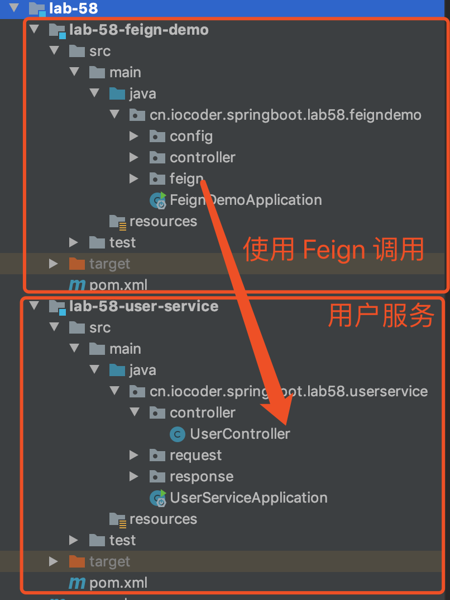
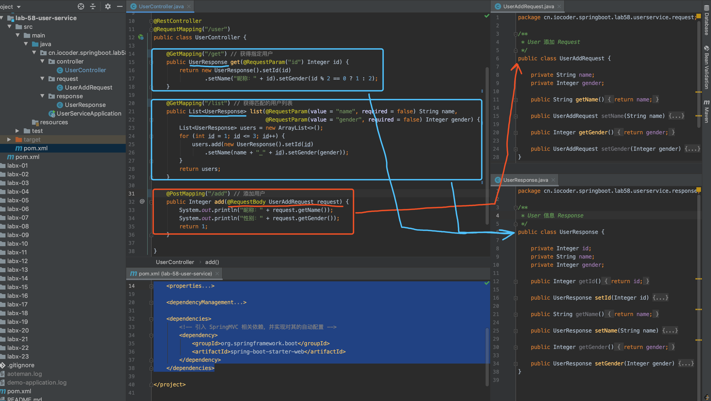
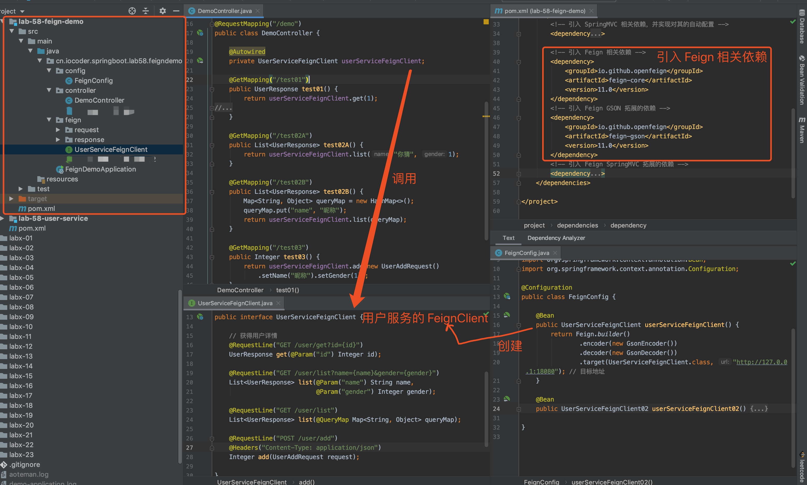
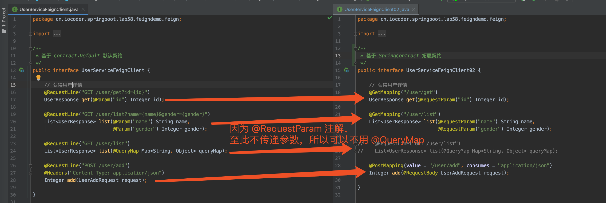
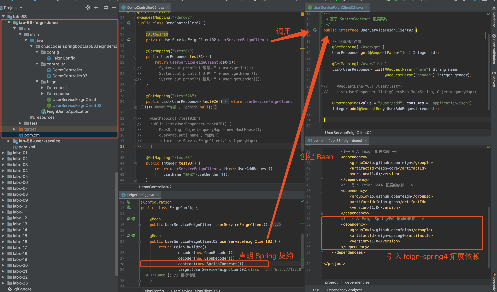

# 芋道 Spring Boot 声明式调用 Feign 入门

- [1. 概述](http://www.iocoder.cn/Spring-Boot/Feign/)
- [2. 快速入门](http://www.iocoder.cn/Spring-Boot/Feign/)
- [3. SpringMVC 契约](http://www.iocoder.cn/Spring-Boot/Feign/)
- [4. Feign 集成](http://www.iocoder.cn/Spring-Boot/Feign/)
- [666. 彩蛋](http://www.iocoder.cn/Spring-Boot/Feign/)

------

------

> 本文在提供完整代码示例，可见 <https://github.com/YunaiV/SpringBoot-Labs> 的 [lab-58](https://github.com/YunaiV/SpringBoot-Labs/tree/master/lab-58) 目录。
>
> 原创不易，给点个 [Star](https://github.com/YunaiV/SpringBoot-Labs/stargazers) 嘿，一起冲鸭！

## 1. 概述

> 友情提示：本文是[《芋道 Spring Boot 声明式调用 Feign 入门》](http://www.iocoder.cn/Spring-Cloud/Feign/?self)的弟弟篇。所以内容上，会有蛮多重叠的地方。
>
> 写本文的主要目的是，分享在**纯 Spring Boot** 环境下，如何使用 Feign 框架。基本所有的网上文章，都是通过 **Spring Cloud Netflix Feign** 进行 Feign 的使用，这样就引入了大量 Spring Cloud 的依赖。而我们的希望，可能仅仅只想使用 <https://github.com/OpenFeign/feign> 核心库。
>
> 原因是，我们采用 Spring Boot + Dubbo 实现微服务架构，同时希望使用 Feign 作为 HTTP 客户端调用外部的三方服务，而不再直接使用 HttpClient、RestTemplate 等等。

[Feign](https://github.com/OpenFeign/feign) 是由 Netflix 开源的**声明式的 HTTP 客户端**，目前已经捐献给 [OpenFeign](https://github.com/OpenFeign) 社区。

> Feign makes writing java http clients easier

通过使用定义简单的接口，并声明 Feign 提供的**注解**，来实现 HTTP 的调用。示例代码如下：


```
import feign.Feign;
import feign.Param;
import feign.RequestLine;

// 商品 API
interface ProductAPI {

    // 获得商品详情
    @RequestLine("POST /products/{id}")
    String get(@Param("id") Integer id);

}

public class FeignDemo {

    public static void main(String[] args) {
        // 创建 ProductAPI 对象
        ProductAPI productAPI = Feign.builder().target(ProductAPI.class,
                "http://www.iocoder.cn"); // 目标地址

        // 调用获得商品
        String product = productAPI.get(1);
        System.out.println(product);
    }

}
```


是不是非常方便，我们仅仅创建了 ProductAPI 接口，并使用了 Feign 定义的 `@RequestLine` 和 `@Param` 注解，就实现了一个获取商品详情的 HTTP API 的调用。

## 2. 快速入门

> 示例代码对应仓库：
>
> - 用户服务：[`lab-58-user-service`](https://github.com/YunaiV/SpringBoot-Labs/blob/master/lab-58/lab-58-user-service/)
> - Feign 示例项目：[`lab-58-feign-demo`](https://github.com/YunaiV/SpringBoot-Labs/blob/master/lab-58/lab-58-feign-demo/)

本小节，我们来搭建一个 Feign 的快速入门示例。步骤如下：

- 首先，使用 [SpringMVC](http://www.iocoder.cn/Spring-Boot/SpringMVC/?self) 搭建一个用户服务，提供 **JSON** 数据格式的 HTTP API。
- 然后，搭建一个使用 Feign **声明式调用**用户服务 HTTP API 的示例项目。

整体项目结构如下图：



### 2.1 搭建用户服务

创建 [`lab-58-user-service`](https://github.com/YunaiV/SpringBoot-Labs/blob/master/lab-58/lab-58-user-service/) 项目，搭建用户服务。代码如下图所示：



比较简单，具体的代码，肯定不用艿艿啰嗦讲解哈，点击 [`lab-58-user-service`](https://github.com/YunaiV/SpringBoot-Labs/blob/master/lab-58/lab-58-user-service/) 查看。

### 2.2 搭建 Feign 示例项目

创建 [`lab-58-feign-demo`](https://github.com/YunaiV/SpringBoot-Labs/blob/master/lab-58/lab-58-feign-demo/) 项目，搭建一个使用 Feign **声明式调用**用户服务 HTTP API 的示例项目。代码如下图：



#### 2.2.1 引入依赖

创建 [`pom.xml`](https://github.com/YunaiV/SpringBoot-Labs/blob/master/lab-58/lab-58-feign-demo/pom.xml) 文件，引入 Feign 相关依赖。


```
<?xml version="1.0" encoding="UTF-8"?>
<project xmlns="http://maven.apache.org/POM/4.0.0"
         xmlns:xsi="http://www.w3.org/2001/XMLSchema-instance"
         xsi:schemaLocation="http://maven.apache.org/POM/4.0.0 http://maven.apache.org/xsd/maven-4.0.0.xsd">
    <parent>
        <artifactId>lab-58</artifactId>
        <groupId>cn.iocoder.springboot.labs</groupId>
        <version>1.0-SNAPSHOT</version>
    </parent>
    <modelVersion>4.0.0</modelVersion>

    <artifactId>lab-58-feign-demo</artifactId>

    <properties>
        <maven.compiler.target>1.8</maven.compiler.target>
        <maven.compiler.source>1.8</maven.compiler.source>
        <spring.boot.version>2.2.4.RELEASE</spring.boot.version>
    </properties>

    <dependencyManagement>
        <dependencies>
            <dependency>
                <groupId>org.springframework.boot</groupId>
                <artifactId>spring-boot-starter-parent</artifactId>
                <version>${spring.boot.version}</version>
                <type>pom</type>
                <scope>import</scope>
            </dependency>
        </dependencies>
    </dependencyManagement>

    <dependencies>
        <!-- 引入 SpringMVC 相关依赖，并实现对其的自动配置 -->
        <dependency>
            <groupId>org.springframework.boot</groupId>
            <artifactId>spring-boot-starter-web</artifactId>
        </dependency>

        <!-- 引入 Feign 相关依赖 -->
        <dependency>
            <groupId>io.github.openfeign</groupId>
            <artifactId>feign-core</artifactId>
            <version>11.0</version>
        </dependency>
        <!-- 引入 Feign GSON 拓展的依赖 -->
        <dependency>
            <groupId>io.github.openfeign</groupId>
            <artifactId>feign-gson</artifactId>
            <version>11.0</version>
        </dependency>
    </dependencies>

</project>
```


① 引入 [`feign-core`](https://mvnrepository.com/artifact/io.github.openfeign/feign-core)，Feign 核心库。

② 引入 [`feign-gson`](https://mvnrepository.com/artifact/io.github.openfeign/feign-gson)，Feign [GSON](https://www.oschina.net/p/google-json) 拓展库，因为稍后我们需要解析 HTTP API 返回的结果为 JSON 数据格式。

#### 2.2.2 UserServiceFeignClient

创建 [UserServiceFeignClient](https://github.com/YunaiV/SpringBoot-Labs/blob/master/lab-58/lab-58-feign-demo/src/main/java/cn/iocoder/springboot/lab58/feigndemo/feign/UserServiceFeignClient.java) 接口，实现对[「2.1 用户服务」](https://www.iocoder.cn/Spring-Boot/Feign/?self#)的声明式调用。代码如下：


```
package cn.iocoder.springboot.lab58.feigndemo.feign;

import cn.iocoder.springboot.lab58.feigndemo.feign.request.UserAddRequest;
import cn.iocoder.springboot.lab58.feigndemo.feign.response.UserResponse;
import feign.*;

import java.util.List;
import java.util.Map;

/**
 * 基于 Contract.Default 默认契约
 */
public interface UserServiceFeignClient {

    // 获得用户详情
    @RequestLine("GET /user/get?id={id}")
    UserResponse get(@Param("id") Integer id);

    @RequestLine("GET /user/list?name={name}&gender={gender}")
    List<UserResponse> list(@Param("name") String name,
                            @Param("gender") Integer gender);

    @RequestLine("GET /user/list")
    List<UserResponse> list(@QueryMap Map<String, Object> queryMap);

    @RequestLine("POST /user/add")
    @Headers("Content-Type: application/json")
    Integer add(UserAddRequest request);

}
```


- [UserAddRequest](https://github.com/YunaiV/SpringBoot-Labs/blob/master/lab-58/lab-58-feign-demo/src/main/java/cn/iocoder/springboot/lab58/feigndemo/feign/request/UserAddRequest.java)，用户添加请求 Bean。
- [UserResponse](https://github.com/YunaiV/SpringBoot-Labs/blob/master/lab-58/lab-58-feign-demo/src/main/java/cn/iocoder/springboot/lab58/feigndemo/feign/response/UserResponse.java)，用户信息响应 Bean。

① [`@RequestLine`](https://github.com/OpenFeign/feign/blob/master/core/src/main/java/feign/RequestLine.java) 注解，添加在方法上，设置**请求方法**和**请求地址**，按照 `请求方法 请求地址` 格式，例如说 `GET /user/get`。同时，可以通过 `{param}` 表达式声明占位参数，搭配 `@Param` 注解一起使用。

② [`@Param`](https://github.com/OpenFeign/feign/blob/master/core/src/main/java/feign/Param.java) 注解，添加在方法参数上，设置占位参数。不过要注意，`@Param` 是**必传**参数，因此传入 `null` 会报错。

③ [`@QueryMap`](https://github.com/OpenFeign/feign/blob/master/core/src/main/java/feign/QueryMap.java) 注解，请求 Query 参数集，无需像 `@Param` 在 `@RequestLine` 定义 `{param}` 表达式进行占位。

这里，我们使用在 `#list(@QueryMap Map<String, Object> queryMap)` 方法上，解决 `#list(@Param("name") String name, @Param("gender") Integer gender)` 方法在使用 `@Param` 注解时传递 `null` 会报错的问题。

④ [`@Headers`](https://github.com/OpenFeign/feign/blob/master/core/src/main/java/feign/Headers.java) 注解，添加在方法上，设置**请求头**。

这里，我们使用在 `#add(UserAddRequest request)` 方法上，因为 HTTP 接口 `/user/add` 使用 `@RequestBody` + JSON 格式接收参数。

#### 2.2.3 FeignConfig

创建 [FeignConfig](https://github.com/YunaiV/SpringBoot-Labs/blob/master/lab-58/lab-58-feign-demo/src/main/java/cn/iocoder/springboot/lab58/feigndemo/config/FeignConfig.java) 配置类，创建[「2.2.3 UserServiceFeignClient」](https://www.iocoder.cn/Spring-Boot/Feign/?self#)Bean。代码如下：


```
@Configuration
public class FeignConfig {

    @Bean
    public UserServiceFeignClient userServiceFeignClient() {
        return Feign.builder()
                .encoder(new GsonEncoder()) // 设置编码器
                .decoder(new GsonDecoder()) // 设置解码器
                .target(UserServiceFeignClient.class, "http://127.0.0.1:18080"); // 目标地址
    }
}
```


#### 2.2.4 DemoController

创建 [DemoController](https://github.com/YunaiV/SpringBoot-Labs/blob/master/lab-58/lab-58-feign-demo/src/main/java/cn/iocoder/springboot/lab58/feigndemo/controller/DemoController.java) 类，使用[「2.2.3 UserServiceFeignClient」](https://www.iocoder.cn/Spring-Boot/Feign/?self#)调用用户服务。代码如下：


```
@RestController
@RequestMapping("/demo")
public class DemoController {

    @Autowired
    private UserServiceFeignClient userServiceFeignClient;

    @GetMapping("/test01")
    public UserResponse test01() {
        return userServiceFeignClient.get(1);
//        System.out.println("编号：" + user.getId());
//        System.out.println("昵称：" + user.getName());
//        System.out.println("性别：" + user.getGender());
    }

    @GetMapping("/test02A")
    public List<UserResponse> test02A() {
        return userServiceFeignClient.list("你猜", 1);
    }

    @GetMapping("/test02B")
    public List<UserResponse> test02B() {
        Map<String, Object> queryMap = new HashMap<>();
        queryMap.put("name", "昵称");
        return userServiceFeignClient.list(queryMap);
    }

    @GetMapping("/test03")
    public Integer test03() {
        return userServiceFeignClient.add(new UserAddRequest()
            .setName("昵称").setGender(1));
    }

}
```


创建的四个 HTTP API 接口，和 UserServiceFeignClient 的四个方法一一映射。

#### 2.2.5 FeignDemoApplication

创建 [FeignDemoApplication](https://github.com/YunaiV/SpringBoot-Labs/blob/master/lab-58/lab-58-feign-demo/src/main/java/cn/iocoder/springboot/lab58/feigndemo/FeignDemoApplication.java) 类，启动类。代码如下：


```
@SpringBootApplication
public class FeignDemoApplication {

    public static void main(String[] args) {
        SpringApplication.run(FeignDemoApplication.class, args);
    }

}
```


### 2.3 简单测试

执行 UserServiceApplication 启动用户服务，执行 FeignDemoApplication 启动 Feign 示例项目。

① 使用浏览器，访问 <http://127.0.0.1:8080/demo/test01> 接口，调用成功返回如下：


```
{
    "id": 1,
    "name": "昵称：1",
    "gender": 2
}
```


② 使用浏览器，访问 <http://127.0.0.1:8080/demo/test02A> 接口，调用成功返回如下：


```
[
    {
        "id": 1,
        "name": "你猜_1",
        "gender": 1
    },
    {
        "id": 2,
        "name": "你猜_2",
        "gender": 1
    },
    {
        "id": 3,
        "name": "你猜_3",
        "gender": 1
    }
]
```


③ 使用浏览器，访问 <http://127.0.0.1:8080/demo/test02B> 接口，调用成功返回如下：


```
[
    {
        "id": 1,
        "name": "你猜_1",
        "gender": null
    },
    {
        "id": 2,
        "name": "你猜_2",
        "gender": null
    },
    {
        "id": 3,
        "name": "你猜_3",
        "gender": null
    }
]
```


④ 使用浏览器，访问 <http://127.0.0.1:8080/demo/test03> 接口，调用成功返回如下：


```
1
```


## 3. SpringMVC 契约

> 示例代码对应仓库：
>
> - 用户服务：[`lab-58-user-service`](https://github.com/YunaiV/SpringBoot-Labs/blob/master/lab-58/lab-58-user-service/)
> - Feign 示例项目：[`lab-58-feign-demo`](https://github.com/YunaiV/SpringBoot-Labs/blob/master/lab-58/lab-58-feign-demo/)

在 Feign 中，定义了 [Contract](https://github.com/OpenFeign/feign/blob/master/core/src/main/java/feign/Contract.java) 接口，**契约**，负责解析 API 接口的方法元数据，例如说注解、方法参数、方法返回类型等等。

例如说，默认 Contract 实现类 [Contract.Default](https://github.com/OpenFeign/feign/blob/master/core/src/main/java/feign/Contract.java)，支持解析我们在[「2.2.2 UserServiceFeignClient」](https://www.iocoder.cn/Spring-Boot/Feign/?self#)小节所使用都的 `@RequestLine`、`@Param` 等注解，从而“告诉” Feign 如何调用 HTTP API 接口。

考虑到我们更加熟悉 SpringMVC 提供的 `@RequestMapping`、`@RequestParam` 等注解，所以 Feign 提供了 [SpringContract](https://github.com/OpenFeign/feign/blob/master/spring4/src/main/java/feign/spring/SpringContract.java) 契约实现类。如此，我们就可以通过 SpringMVC 的注解，使用 Feign 实现声明式调用。



下面，我们直接在[「2. 快速入门」](https://www.iocoder.cn/Spring-Boot/Feign/?self#)小节的基础上，直接增加 Feign 使用 **SpringMVC 契约**的示例代码。改动点如下图所示：



### 3.1 引入依赖

修改 [`pom.xml`](https://github.com/YunaiV/SpringBoot-Labs/blob/master/lab-58/lab-58-feign-demo/pom.xml) 文件，额外引入 [`feign-spring4`](https://mvnrepository.com/artifact/io.github.openfeign/feign-spring4) 依赖，因为 SpringContract 由它提供。


```
<dependency>
    <groupId>io.github.openfeign</groupId>
    <artifactId>feign-spring4</artifactId>
    <version>11.0</version>
</dependency>
```


### 3.2 UserServiceFeignClient02

创建 [UserServiceFeignClient02](https://github.com/YunaiV/SpringBoot-Labs/blob/master/lab-58/lab-58-feign-demo/src/main/java/cn/iocoder/springboot/lab58/feigndemo/feign/UserServiceFeignClient02.java) 接口，使用 SpringMVC 注解，实现对[「2.1 用户服务」](https://www.iocoder.cn/Spring-Boot/Feign/?self#)的声明式调用。代码如下：


```
public interface UserServiceFeignClient02 {

    // 获得用户详情
    @GetMapping("/user/get")
    UserResponse get(@RequestParam("id") Integer id);

    @GetMapping("/user/list")
    List<UserResponse> list(@RequestParam("name") String name,
                            @RequestParam("gender") Integer gender);

//    @RequestLine("GET /user/list")
//    List<UserResponse> list(@QueryMap Map<String, Object> queryMap);

    @PostMapping(value = "/user/add", consumes = "application/json")
    Integer add(@RequestBody UserAddRequest request);

}
```


比较简单，SpringMVC 注解简直能够倒背如流哈~

另外，`@RequestParam` 注解**可选**参数，允许传入 `null` 值，所以我们无需使用 `@QueryMap` 注解落。

### 3.3 FeignConfig

修改 [FeignConfig](https://github.com/YunaiV/SpringBoot-Labs/blob/master/lab-58/lab-58-feign-demo/src/main/java/cn/iocoder/springboot/lab58/feigndemo/config/FeignConfig.java) 配置类，额外增加创建创建[「3.2 UserServiceFeignClient02」](https://www.iocoder.cn/Spring-Boot/Feign/?self#)Bean。代码如下：


```
// FeignConfig.java

@Bean
public UserServiceFeignClient02 userServiceFeignClient02() {
    return Feign.builder()
            .encoder(new GsonEncoder())
            .decoder(new GsonDecoder())
            .contract(new SpringContract()) // 设置使用 SpringContract 契约
            .target(UserServiceFeignClient02.class, "http://127.0.0.1:18080"); // 目标地址
}
```


通过调用 `#contract(Contract contract)` 方法，设置使用 **SpringContract 契约**。

### 3.4 DemoController02

创建 [DemoController02](https://github.com/YunaiV/SpringBoot-Labs/blob/master/lab-58/lab-58-feign-demo/src/main/java/cn/iocoder/springboot/lab58/feigndemo/controller/DemoController02.java) 类，使用[「3.2 UserServiceFeignClient02」](https://www.iocoder.cn/Spring-Boot/Feign/?self#)调用用户服务。代码如下：


```
@RestController
@RequestMapping("/demo02")
public class DemoController02 {

    @Autowired
    private UserServiceFeignClient02 userServiceFeignClient;

    @GetMapping("/test01")
    public UserResponse test01() {
        return userServiceFeignClient.get(1);
//        System.out.println("编号：" + user.getId());
//        System.out.println("昵称：" + user.getName());
//        System.out.println("性别：" + user.getGender());
    }

    @GetMapping("/test02A")
    public List<UserResponse> test02A() {
        return userServiceFeignClient.list("你猜", null);
    }

//    @GetMapping("/test02B")
//    public List<UserResponse> test02B() {
//        Map<String, Object> queryMap = new HashMap<>();
//        queryMap.put("name", "昵称");
//        return userServiceFeignClient.list(queryMap);
//    }

    @GetMapping("/test03")
    public Integer test03() {
        return userServiceFeignClient.add(new UserAddRequest()
            .setName("昵称").setGender(1));
    }

}
```


### 3.5 简单测试

执行 UserServiceApplication 启动用户服务，执行 FeignDemoApplication 启动 Feign 示例项目。

① 使用浏览器，访问 <http://127.0.0.1:8080/demo02/test01> 接口，调用成功返回如下：


```
{
    "id": 1,
    "name": "昵称：1",
    "gender": 2
}
```


② 使用浏览器，访问 <http://127.0.0.1:8080/demo02/test02A> 接口，调用成功返回如下：


```
[
    {
        "id": 1,
        "name": "你猜_1",
        "gender": null
    },
    {
        "id": 2,
        "name": "你猜_2",
        "gender": null
    },
    {
        "id": 3,
        "name": "你猜_3",
        "gender": null
    }
]
```


③ 使用浏览器，访问 <http://127.0.0.1:8080/demo02/test03> 接口，调用成功返回如下：


```
1
```


## 4. Feign 集成

Feign 的设计原则，就是能够与开源的其它工具库能够很好的进行集成，因此它定义了 [Client](https://github.com/OpenFeign/feign/blob/master/core/src/main/java/feign/Client.java)、[AsyncClient](https://github.com/OpenFeign/feign/blob/master/core/src/main/java/feign/AsyncClient.java)、[Contract](https://github.com/OpenFeign/feign/blob/master/core/src/main/java/feign/Contract.java)、[Encoder](https://github.com/OpenFeign/feign/blob/master/core/src/main/java/feign/codec/Encoder.java)、[Decoder](https://github.com/OpenFeign/feign/blob/master/core/src/main/java/feign/codec/Decoder.java) 等接口，可以进行很好的拓展。如下图所示：

[Feign 组件](http://www.iocodeer.cn/images/Spring-Boot/2019-12-16/21.png)

> 友情提示：更多深入，可以阅读[《芋道 Spring Cloud 声明式调用 Feign 入门》](http://www.iocoder.cn/Spring-Cloud/Feign/?self)的[「10. Feign 主要组件」](https://www.iocoder.cn/Spring-Boot/Feign/?self#)小节。

下面的内容，基于 <https://github.com/OpenFeign/feign> 首页的文档整理。因此，可能会有点啰嗦，胖友可以快速浏览即可。

> 对应中文的翻译文档：[《Feign 官方文档翻译》](http://www.iocoder.cn/Fight/Feign-official-document-translation/?self)

### 4.1 HTTP 客户端相关

#### 4.1.1 OkHttp

使用 [Feign OkHttp](https://github.com/OpenFeign/feign/blob/master/okhttp/) 直接将 Feign 请求交由 OkHttp 处理。相比 Feign 使用的默认的 HTTP 客户端，OkHttp 可以提供更好的性能和特性。

Feign 使用 OkHttp 只需要将 OkHttp 裤加入到 `classpath` 中，然后配置 Feign 使用 OkHttpClient。代码如下：


```
public class Example {
    
    public static void main(String[] args) {
        GitHub github = Feign.builder()
                .client(new OkHttpClient())
                .target(GitHub.class, "https://api.github.com");
    }
    
}
```


#### 4.1.2 Ribbon

[Feign Ribbon](https://github.com/OpenFeign/feign/blob/master/ribbon/) 为 Feign Client重写 URL 解析，同时提供了智能路由和弹性能力。

集成 Ribbon 时，需要将 `url` 改为 Ribbon 的客户端名称，例如说 `"myAppProd"`


```
public class Example {
    
    public static void main(String[] args) {
        MyService api = Feign.builder()
                  .client(RibbonClient.create())
                  .target(MyService.class, "https://myAppProd");
    }
    
}
```


> 友情提示：更多深入，可以阅读[《芋道 Spring Cloud 声明式调用 Feign 入门》](http://www.iocoder.cn/Spring-Cloud/Feign/?self)的[「2. 快速入门」](https://www.iocoder.cn/Spring-Boot/Feign/?self#)小节。

#### 4.1.3 Java 11 Http2

[Feign Java 11](https://github.com/OpenFeign/feign/blob/master/java11/) 直接将 Feign HTTP 请求交由 Java11 New HTTP/2 Client 处理以实现 HTTP/2。

若为 Feign 使用 New HTTP/2 客户端需要 JDK11，然后配置 Feign 使用 Http2Client。


```
GitHub github = Feign.builder()
                     .client(new Http2Client())
                     .target(GitHub.class, "https://api.github.com");
```


### 4.2 编解码相关

#### 4.2.1 Gson

[Feign Gson](https://github.com/OpenFeign/feign/blob/master/gson/) 包含了可以与 JSON API 共同使用的编码器和解码器。

使用 Feign.Builder 添加 GsonEncoder 或 GsonDecoder。代码如下：


```
public class Example {
  
	public static void main(String[] args) {
		GsonCodec codec = new GsonCodec();
		GitHub github = Feign.builder()
	                         .encoder(new GsonEncoder())
	                         .decoder(new GsonDecoder())
	                         .target(GitHub.class, "https://api.github.com");
	}
  
}
```


#### 4.2.2 Jackson

[Feign Jackson](https://github.com/OpenFeign/feign/tree/master/jackson) 包含了可以与 JSON API 共同使用的编码器和解码器。

使用 Feign.Builder 添加 JacksonEncoder 或 JacksonDecoder。代码如下：


```
public class Example {
  
	public static void main(String[] args) {
		GsonCodec codec = new GsonCodec();
		GitHub github = Feign.builder()
                             .encoder(new JacksonEncoder())
                             .decoder(new JacksonDecoder())
                             .target(GitHub.class, "https://api.github.com");
	}
  
}
```


#### 4.2.3 Sax

[Feign SAX](https://github.com/OpenFeign/feign/blob/master/sax/) 可以在标准的 JVM 或 Android 环境下解码 XML。

使用 Sax 对响应数据进行解析，代码如下：


```
public class Example {
  
  public static void main(String[] args) {
      Api api = Feign.builder()
         .decoder(SAXDecoder.builder()
                            .registerContentHandler(UserIdHandler.class)
                            .build())
         .target(Api.class, "https://apihost");
    }
    
}
```


#### 4.2.4 JAXB

[Feign JAXB](https://github.com/OpenFeign/feign/blob/master/gson/) 包含了可以与 XML API 共同使用的编码器和解码器。

使用 Feign.Builder 添加 GsonEncoder 或 GsonDecoder。代码如下：


```
public class Example {
  
	public static void main(String[] args) {
		GsonCodec codec = new GsonCodec();
		GitHub github = Feign.builder()
                         .encoder(new JAXBEncoder())
                         .decoder(new JAXBDecoder())
                         .target(Api.class, "https://apihost");
	}
  
}
```


#### 4.2.5 SOAP

[Feign SOAP](https://github.com/OpenFeign/feign/blob/master/soap/) 包含了可以与 XML API 共同使用的编码器和解码器。

该模块通过 JAXB 和 SOAPMessage 对 SOAP Body 提供编码和解码。

同时将 SOAPFault 解码能力包装到了原生的`javax.xml.ws.soap.SOAPFaultException`，所以使用时只需要捕获SOAPFaultException 来处理 SOAPFault。

使用 Feign.Builder 来添加 SOAPEncoder 或 SOAPDecoder。代码如下：


```
public class Example {
  
  public static void main(String[] args) {
    Api api = Feign.builder()
         .encoder(new SOAPEncoder(jaxbFactory))
         .decoder(new SOAPDecoder(jaxbFactory))
         .errorDecoder(new SOAPErrorDecoder())
         .target(MyApi.class, "http://api");
  }
  
}
```


注意：如果 SOAP 的错误响应包含 HTTP CODE(4xx、5xx、...)时，则需要添加 SOAPErrorDecoder 对错误进行处理。

### 4.3 契约相关

#### 4.3.1 JAX-RS

[Feign JAX-RS](https://github.com/OpenFeign/feign/blob/master/jaxrs/) 对标准的 JAX-RS 进行了重新处理，目前基于 1.1 规范。


```
interface GitHub {

    @GET
    @Path("/repos/{owner}/{repo}/contributors")
    List<Contributor> contributors(@PathParam("owner") String owner, @PathParam("repo") String repo);
    
}

public class Example {
    
    public static void main(String[] args) {
        GitHub github = Feign.builder()
                .contract(new JAXRSContract())
                .target(GitHub.class, "https://api.github.com");
    }
    
}
```


### 4.4 其它相关

#### 4.4.1 Hystrix

[Feign Hystrix](https://github.com/OpenFeign/feign/blob/master/hystrix/) 使用 Hystrix 提供了断路器的支持。

若要使用 Hystrix 时，需要将 Hystrix 模块加入 `classpath` 中。然后，使用 `HystrixFeign.builder`。


```java
public class Example {

    public static void main(String[] args) {
        MyService api = HystrixFeign.builder().target(MyService.class, "https://myAppProd");
    }
    
}
```


> 友情提示：更多深入，可以阅读[《芋道 Spring Cloud 服务保障 Hystrix 入门》](http://www.iocoder.cn/Spring-Cloud/Netflix-Hystrix/?self)的[「9. 集成到 Feign」](https://www.iocoder.cn/Spring-Boot/Feign/?self#)小节。

#### 4.4.2 SLF4J

[Feign](https://github.com/OpenFeign/feign/tree/master/slf4j) 直接将 Feign 的日志交由 SLF4J 处理，你可以方便的选择 Logger 的后端实现。

若要使用 SLF4J 时，需要添加 SLF4J 和对应的 Logger 后端模块到 `classpath`内，然后使用 `Feign.builder` 配置为 Slf4jLogger。


```java
public class Example {

    public static void main(String[] args) {
        GitHub github = Feign.builder()
                     .logger(new Slf4jLogger())
                     .target(GitHub.class, "https://api.github.com");
    }
    
}
```


> 友情提示：更多深入，可以阅读[《芋道 Spring Cloud 声明式调用 Feign 入门》](http://www.iocoder.cn/Spring-Cloud/Feign/?self)的[「3. 自定义 Feign 配置」](https://www.iocoder.cn/Spring-Boot/Feign/?self#)小节。

## 666. 彩蛋

至此，我们已经完成了 Feign 的简单入门，后续艿艿会补充一些 Feign 的实战示例，嘿嘿~