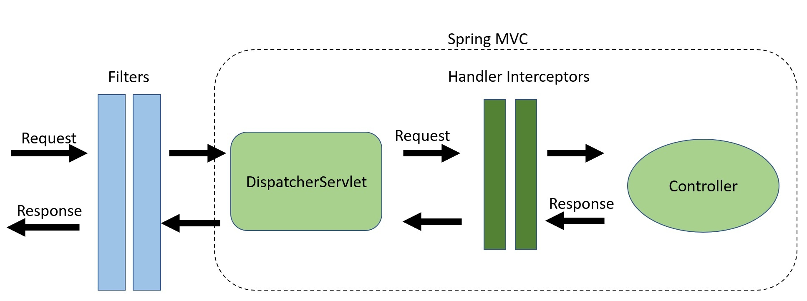

# HandlerInterceptors vs. Filters in Spring MVC


##  1. Overview

In this article, we'll compare the Java servlet *Filter* and the Spring MVC *HandlerInterceptor,* and when one might be preferable over the other.

## 2.*Filter*s

**Filters are part of the webserver and not the Spring framework.**For incoming requests, **we can use filters to manipulate and even block requests from reaching any servlet**.  Vice versa, we can also block responses from reaching the client.

[Spring Security](https://www.baeldung.com/security-spring) is a great example of using filters for authentication and authorization. To configure Spring Security, we simply need to add a single filter, the [*DelegatingFilterProxy*](https://www.baeldung.com/spring-delegating-filter-proxy). Spring Security can then intercept all incoming and outgoing traffic. This is why Spring Security can be used outside of [Spring MVC](https://www.baeldung.com/spring-mvc).


### 2.1. Creating a *Filter*

To create a filter, first, we create a class that implements the *javax.servlet.Filter interface*:

```java
@Component
public class LogFilter implements Filter {

    private Logger logger = LoggerFactory.getLogger(LogFilter.class);

    @Override
    public void doFilter(ServletRequest request, ServletResponse response, FilterChain chain) 
      throws IOException, ServletException {
        logger.info("Hello from: " + request.getLocalAddr());
        chain.doFilter(request, response);
    }

}
```

Next, we override the *doFilter* method, where we can access or manipulate the *ServletRequest*, *ServletResponse*, or *FilterChain* objects. We can allow or block requests with the *FilterChain* object.

Finally, we add the *Filter* to the Spring context by annotating it with *@Component.* Spring will do the rest.


## 3. *HandlerInterceptor*s

**HandlerInterceptors are part of the Spring MVC framework and sit between the DispatcherServlet and our Controllers.** We can intercept requests before they reach our controllers, and before and after the view is rendered.

### 3.1. Creating a *HandlerInterceptor*

To create a *HandlerInterceptor*, we create a class that implements the *org.springframework.web.servlet.HandlerInterceptor* interface. This gives us the option to override three methods:

- *preHandle()* – Executed before the target handler is called
- *postHandle()* – Executed after the target handler but before the *DispatcherServlet* renders the view
- *afterCompletion() –* Callback after completion of request processing and view rendering

Let's add logging to the three methods in our test interceptor:

```java
public class LogInterceptor implements HandlerInterceptor {

    private Logger logger = LoggerFactory.getLogger(LogInterceptor.class);

    @Override
    public boolean preHandle(HttpServletRequest request, HttpServletResponse response, Object handler) 
      throws Exception {
        logger.info("preHandle");
        return true;
    }

    @Override
    public void postHandle(HttpServletRequest request, HttpServletResponse response, Object handler, ModelAndView modelAndView) 
      throws Exception {
        logger.info("postHandle");
    }

    @Override
    public void afterCompletion(HttpServletRequest request, HttpServletResponse response, Object handler, Exception ex) 
      throws Exception {
        logger.info("afterCompletion");
    }

}
```

## 4. Key Differences and Use Cases

Let's look at a diagram showing where *Filter*s and *HandlerInterceptor*s fit in the request/response flow:




- Authentication
- Logging and auditing
- Image and data compression
- Any functionality we want to be decoupled from Spring MVC


**HandlerIntercepors, on the other hand, intercepts requests between the DispatcherServlet and our Controllers.** This is done within the Spring MVC framework, providing access to the *Handler* and *ModelAndView* objects. This reduces duplication and allows for more fine-grained functionality such as:

- Handling cross-cutting concerns such as application logging
- Detailed authorization checks
- Manipulating the Spring context or model


## 5. Conclusion

In this article, we covered the differences between a *Filter* and *HandlerInterceptor*.

**The key takeaway is that with Filters, we can manipulate requests before they reach our controllers and outside of Spring MVC.** Otherwise, *HandlerInterceptor*s are a great place for application-specific cross-cutting concerns. By providing access to the target *Handler* and *ModelAndView* objects, we have more fine-grained control.

The implementation of all these examples and code snippets can be found [over on GitHub](https://github.com/eugenp/tutorials/tree/master/spring-boot-modules/spring-boot-mvc-3).

