# 类加载子系统


1. 类加载器子系统负责从文件系统或者网络中加载class文件，class文件在文件开头有特定的文件标识。
2. ClassLoader只负责class文件的加载，至于它是否可以运行，则由Execution Engine决定。
3. 加载的类信息(类模版)存放于一块称为方法区的内存空间，除了类的信息外，方法区中还会存放运行时常量池信息，可能还包括字符串和数字常量(这部分觉得信息是Class文件中常量池部会的内存映射)。

通过javap -v xx.class可以看到常量常量池，将常量池加载到内存，叫运行时常量池。

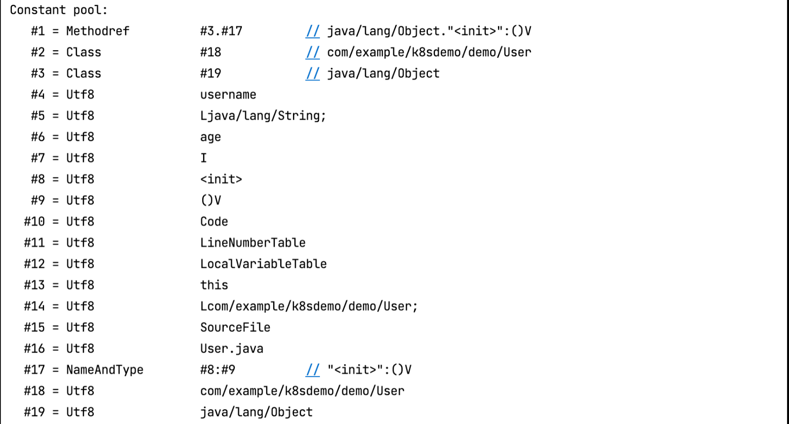


## **类加载过程**


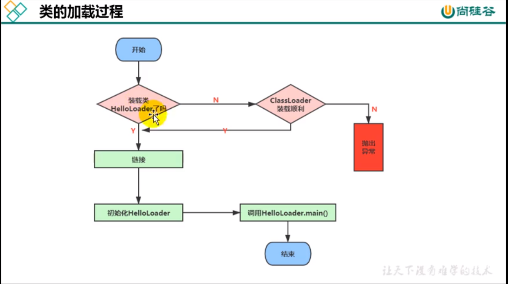


#### 1.加载

1. 通过一个类的全限定名获取定义此类的二进制字节流
2. 将这个字节流所代表的静态存储结构转化为方法区的运行时数据结构
3. 在内存中生成一个代表这个类的对象，作为方法区这个类的各种数据访问入口。 


加载.class文件的方式

1. 从本地系统中直接加载
2. 通过网络获取，典型场景：Web Applet
3. 从zip压缩包中读取，成为日后jar\war格式的基础
4. 运行时高动态生成，使用最多的场景：动态代理技术
5. 从专有的数据库中提取.class文件，比较少见
6. 由其他文件生成，典型场景：JSP应用
7. 从加密文件中获取，典型的防Class文件被反编译的代码扩充措施。（Andoid）


#### 2.链接【验证、准备、解析】

验证(Verify):

1. 目的在于确保Class文件的字节流中包含信息符合当前虚拟机要求，保证被加载类的正确性，不会危害虚拟机自身安全。 
2. 主要包括四种验证，文件格式验证、元数据验证、字节码验证、符号引用验证。

准备(Prepare):

1. 为类变量分配内存并且设置该类变量的默认初始值，即零值。

    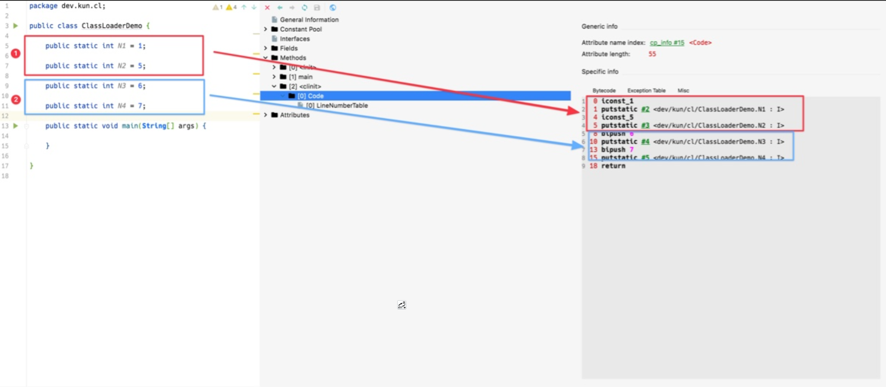

2. 这不包含用final修饰的static常量，因为final在编译的时候就会分配了，准备取命令行会显式初始化。


  3.这时不会为实例变量分配初始化，类变量会分配在方法区中，而实例变量是会随着对象一起分配到Java堆中。

解析(Resolve):

1. 将常量池内的符号引用转换为直接引用的过程。
2. 事实上，解析操作会伴随着JVM在执行完初始化之后再执行。
3. 符号引用就是一组符号来描述所引用的目标，符号引用的字面量形式明确定义在《Java虚拟机规范》的Class文件格式中，直接引用就是直接指向目标的指针、相对领衔量或一个间接定位到目标的句柄。
4. 解析动作主要针对类或接口、字段、类方法、接口方法、方法类型等，对应常量池中的CONSTANT_Class_info、CONSTANT_Fieldref_info、CONSTANT_Metodref_info等。

>在准备阶段，会把类变量分配到内存中并设置初始值。下一阶段(初始化阶段需要将准备阶段的0变成20 ，再变成10)


> 注意观察上图中的变量在clinit方法中的赋值过程 

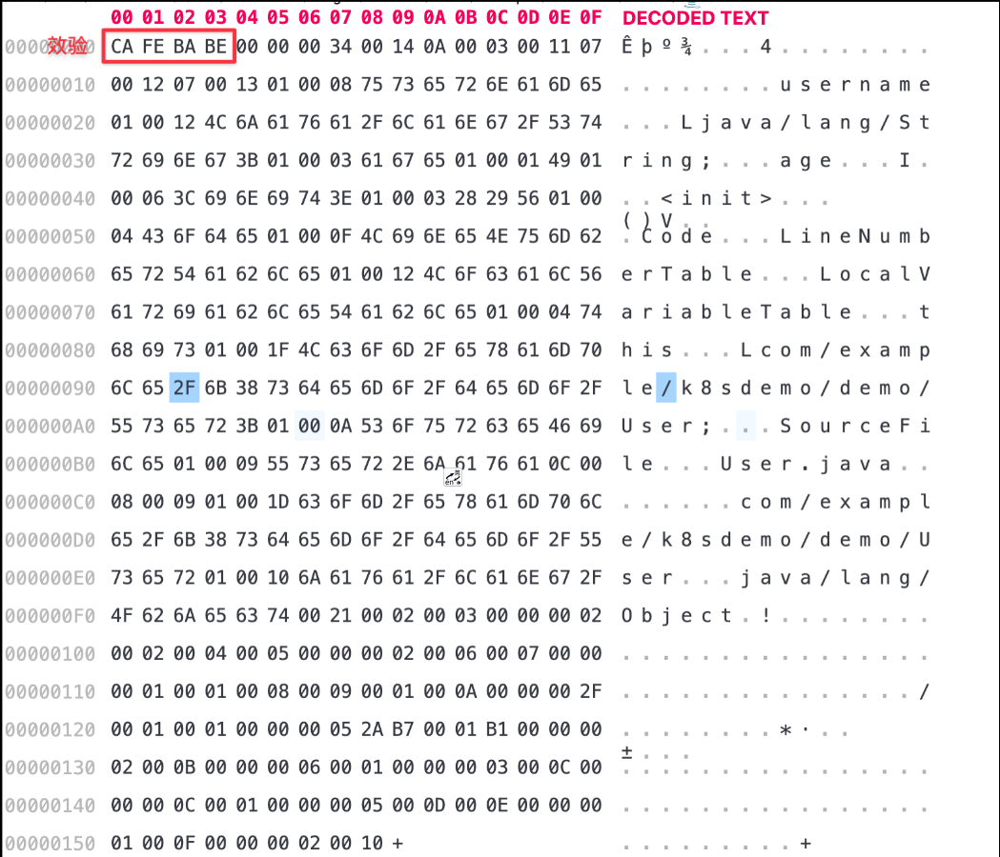

>使用十六进制编程器打开.class文件，可看到.class文件魔数CAFEBABE


#### 3.初始化

1. 初始化阶段就是执行类构造器该当<clinit>()的过程。
2. 这些方法不需要定义，是javac编译器自动收集类中的所有类变量的赋值动作和静态代码块中的语句合并而来。

```
public class ClassClinitDemo {
    public static int NUN = 1;
    static{
        NUN = 2;
    }

    public static void main(String[] args) {
        System.out.println(ClassClinitDemo.NUN);
    }
}
```


>如果没有静态变量或静态代码块，不是会生成clinit 类构造器方法。

如果有多个构造方法，会有多个init函数。


3.构造器方法中指令按语句在源文件中出现的顺序执行。

4.<clinit>()不同于类的构造器。（关联：构造器的虚拟机神视角下的<init>()）.

5.若该类拥有父类，JVM会保证子类 <clinit>()执行前，父类的<clinit>()已经初始化完毕。

6.虚拟机必须保证一个类的<clinit>()方法在多线下被同步加锁。如果不加同步代码块，两个线程会出现半初始化问题。

```java
package com.example.k8sdemo.demo;

/**
 * 虚拟机必须保证一个类的<clinit>()方法在多线各下被同步加锁。
 * 如果不加同步代码块，两个线程会出现半初始化问题。
 */
public class Demo1 {
    public static void main(String[] args) {
        Runnable runnable =  () -> {
            System.out.println(Thread.currentThread().getName() + " 开始");
            DeadThread deadThread = new DeadThread();
            System.out.println(Thread.currentThread().getName() + " 开始");
        };

        new Thread(runnable,"Thread 1").start();
        new Thread(runnable,"Thread 2").start();
    }
}
class DeadThread {
    static {
        if (true) {
            System.out.println(Thread.currentThread().getName() + "正在进行初始化");
            while (true) {

            }
        }
    }
}
```


NUMBER=20为什么不报错?
  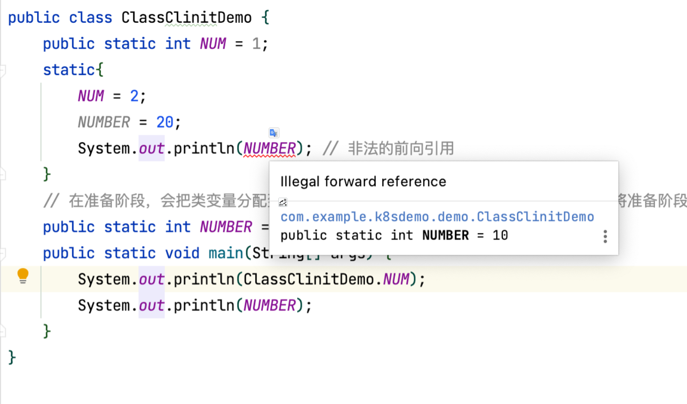


## **类加载器**

1. JVM支持两种类型的加载器，分别为引导类加载器(Bootstrap ClassLoader)和自定义类加载器(User-Defined ClassLoader)
2. 从广义上来讲，自定义类加载器- 般指的是程序中由开发人员自定义的一类加载器，但是Java虚拟机规范却没有这么定义，而是将所有派生于抽象类Classloader的类加载器都划分为自定义类加载器。
3. 无论类加载器的类型如何划分，在程序中我们最常见的类加载器始终只有3个，如下图所示。

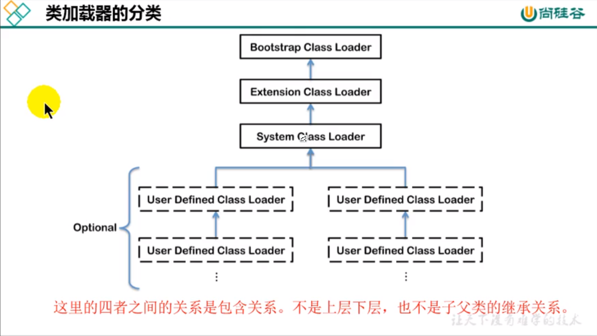


### 类加载器详细说明


虚拟机自带的加载器 

- 启动类加载器（引导类加载器，Bootstrap ClassLoader）

  - 这个类加载使用C/C++语言实现，嵌套在JVM内部
  - 它用来加载Java的核心库(JAVA_HOME/jre/lib/rt.jar、charset.jar)[获取类加载加载类库](https://www.justtutorial.dev/index/b/7687E707-95AD-4334-8D5D-1D8A253F7FC9/类加载子系统#4EE4968C-4F31-484F-8B8D-F76B8DA3E2D9/获取类加载加载类库)，用于提供JVM自身需要的类。
  - 并不继承自java.lang.ClassLoader,没有父加载器。
  - 加载类和应用程序类加载器，并指定为他们的父类加载器。
  - 出于安全考虑，Bootstrap启动类加载器只加载包名为java、javax、sun等开头的类。可以简单的理解为沙盒机制(这种理解是不准确的)

- 虚拟机自带的加载器

  - 扩展类加载器(Extension ClassLoader)

    - Java 语言编写，由sun.misc.Launcher$ExtClassLoader实现。
    - 派生于ClassLoader类。
    - 父类加载器为启动类加载器。
    - 从java.ext.dirs系统属性所指定的目录加载类库，或从JDK的安装目录/jre/lib/ext子目录(扩展目录)下加载类库，如果用户创建的JAR放在此目录下，也会自动由扩展加载器加载。

  - 应用程序类加载器(系统类加载器，AppClassLoader)

    - java语言编写，由sum.misc.Luancher$AppClassLoader实现。
    - 派生于ClassLoader类。
    - 父类加载器为扩展类加载器。
    - 它负责辊载环境变量classpath或系统属性 java.class.path 指定路径下的类库。
    - 该类加载器是程序中的默认加载器，一般来说，java 应用的类都是由它来完成加载的。
    - 通过ClassLoader#getSystemClassLoader() 方法可以获取到该类加载器。

    

    代码清单:

    ```
    package com.example.k8sdemo.demo;
    
    public class ClassloaderDemo {
        public static void main(String[] args) {
            // 获取系统类加载器
            ClassLoader systemClassLoader = ClassLoader.getSystemClassLoader();
            System.out.println(systemClassLoader); // jdk.internal.loader.ClassLoaders$AppClassLoader@2c13da15
    
            // 获取上层类加载器
            ClassLoader parentClassLoader = systemClassLoader.getParent();
            System.out.println(parentClassLoader); // jdk.internal.loader.ClassLoaders$PlatformClassLoader@3498ed
    
            // 获取上上层类加载器
            ClassLoader parentParentClassLoader = parentClassLoader.getParent();
            System.out.println(parentParentClassLoader); // null
    
            // 获取当前类的类加载器
            ClassLoader classLoader = ClassClinitDemo.class.getClassLoader();
            System.out.println(classLoader); // jdk.internal.loader.ClassLoaders$AppClassLoader@2c13da15
    
            // 获取String类的类加载器=> null ，使用的是引导类加载器进行加载
            // Java的核心类库都是使用引导类加载器进行加载
            ClassLoader stringClassLoader = String.class.getClassLoader();
            System.out.println(stringClassLoader); // null
    
            // 获取Integer类的类加载器,同上
            ClassLoader integerClassLoader = Integer.class.getClassLoader();
            System.out.println(integerClassLoader); // null
        }
    }
    ```

    结果：

    ```
    sun.misc.Launcher$AppClassLoader@18b4aac2
    sun.misc.Launcher$ExtClassLoader@6b884d57
    null
    sun.misc.Launcher$AppClassLoader@18b4aac2
    null
    null
    ```


### 获取类加载加载类库

代码清单

  

```java
package com.example.k8sdemo.demo;

import java.net.URL;
import java.security.Provider;
import java.util.Arrays;

/**
 * 获取BootstrapClass下以能加载的class
 */
public class BootStrapClassLoaderDemo {

    public static void main(String[] args) {
        System.out.println("启动类加载器");
        URL[] url = sun.misc.Launcher.getBootstrapClassPath().getURLs(); //sun.misc.
        Arrays.stream(url).forEach(System.out::println);

        ClassLoader classLoader = Provider.class.getClassLoader();
        System.out.println(classLoader);

        System.out.println("扩展类加载器");
        String property = System.getProperty("java.ext.dirs");
        Arrays.stream(property.split(";")).forEach(System.out::println);

    }
}
```

结果

```
启动类加载器
file:/Library/Java/JavaVirtualMachines/jdk1.8.0_271.jdk/Contents/Home/jre/lib/resources.jar
file:/Library/Java/JavaVirtualMachines/jdk1.8.0_271.jdk/Contents/Home/jre/lib/rt.jar
file:/Library/Java/JavaVirtualMachines/jdk1.8.0_271.jdk/Contents/Home/jre/lib/sunrsasign.jar
file:/Library/Java/JavaVirtualMachines/jdk1.8.0_271.jdk/Contents/Home/jre/lib/jsse.jar
file:/Library/Java/JavaVirtualMachines/jdk1.8.0_271.jdk/Contents/Home/jre/lib/jce.jar
file:/Library/Java/JavaVirtualMachines/jdk1.8.0_271.jdk/Contents/Home/jre/lib/charsets.jar
file:/Library/Java/JavaVirtualMachines/jdk1.8.0_271.jdk/Contents/Home/jre/lib/jfr.jar
file:/Library/Java/JavaVirtualMachines/jdk1.8.0_271.jdk/Contents/Home/jre/classes
null
扩展类加载器
/Users/kun/Library/Java/Extensions:/Library/Java/JavaVirtualMachines/jdk1.8.0_271.jdk/Contents/Home/jre/lib/ext:/Library/Java/Extensions:/Network/Library/Java/Extensions:/System/Library/Java/Extensions:/usr/lib/java

Process finished with exit code 0
```

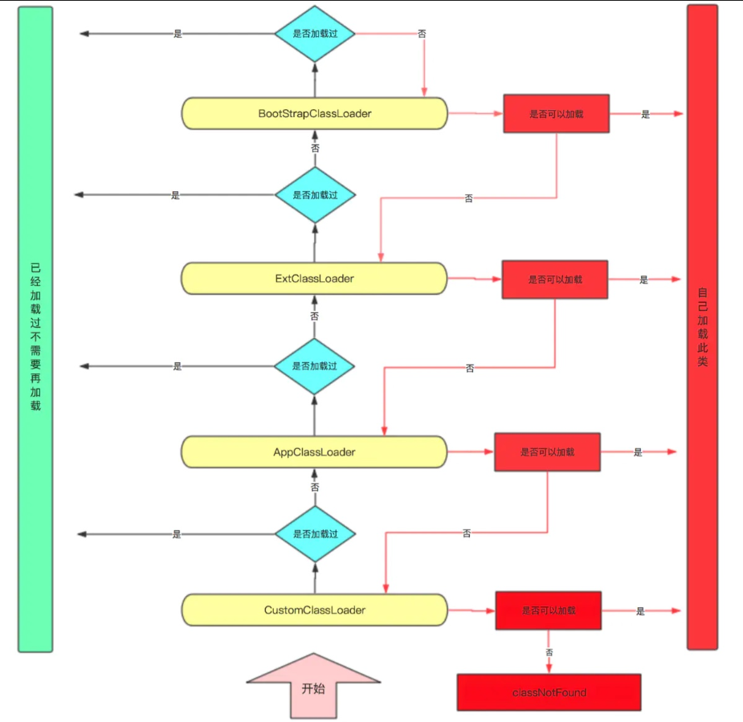


### **用户自定义类加载器**


在Java的日常应用程序开发中，类的加载几乎是由上述3种类加载器相互配合执行的，在必要时，我们可以自定义类加载器，业寶类的加载方式。 

为什么要自定义类加载器?

- **隔离加载类**
- **修改类加载的方式**
- **扩展加载源**
- **防止源码泄漏**


#### 自定义类加载器

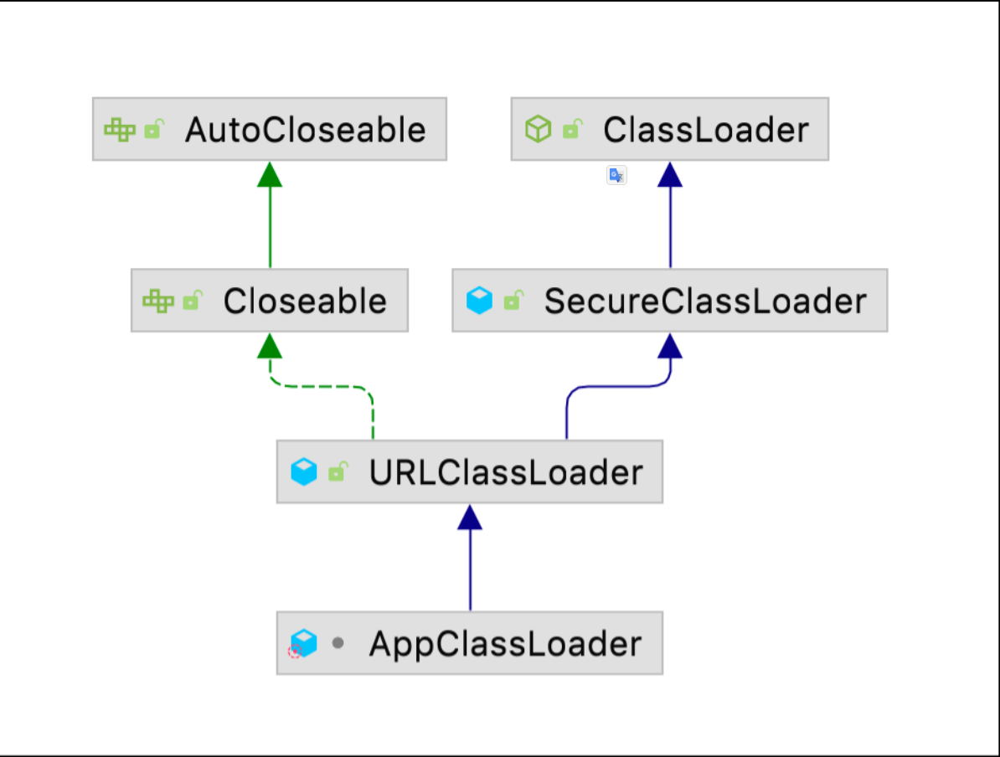

```java
public class CustomClassLoader extends ClassLoader {
    @Override
    protected Class<?> findClass(String name) throws ClassNotFoundException {

        try {
            byte[] result = getClassFromCustomPath(name);
            if (result == null) {
                throw new FileNotFoundException();
            } else {
                return defineClass(name, result, 0, result.length);
            }
        } catch (FileNotFoundException e) {
            e.printStackTrace();
        }

        throw new ClassNotFoundException(name);
    }

    private byte[] getClassFromCustomPath(String name) {
        //从自定义路径中加载指定类:细节略
        //如果指定路径的字节码文件进行了加密，则需要在此方法中进行解密操作。
        return null;
    }

    public static void main(String[] args) {
        CustomClassLoader customClassLoader = new CustomClassLoader();
        try {
            Class<?> clazz = Class.forName("One", true, customClassLoader);
            Object obj = clazz.newInstance();
            System.out.println(obj.getClass().getClassLoader());
        } catch (Exception e) {
            e.printStackTrace();
        }
    }
}
```


#### ClassLoader 常用方法 


ClassLoader 类，它是一个抽象类，其后所有的类加载都是继承自ClassLoader(不包括启动类加载器)

主要的方法有：

- getParent(): 返回该加载器的超类加载器。
- loadClass(String name): 加载名称为name的类，返回结果为java.lang.Class类的实例。
- findClass(String name): 查换名称为name的类，返回结果为java.lang.class类的实例。
- findLoadedClass(String name): 查找名称为name的已经被加载的类，返回结果为java.land.Class类的实例。
- defineClass(String name,byte[] b,int off,int len)： 把字节数据b中的内容转换为一个Java类，返回结果为java.lang.Class类的实例。
- resoveClass(Class<?> c)：连接指定的一个Java类。

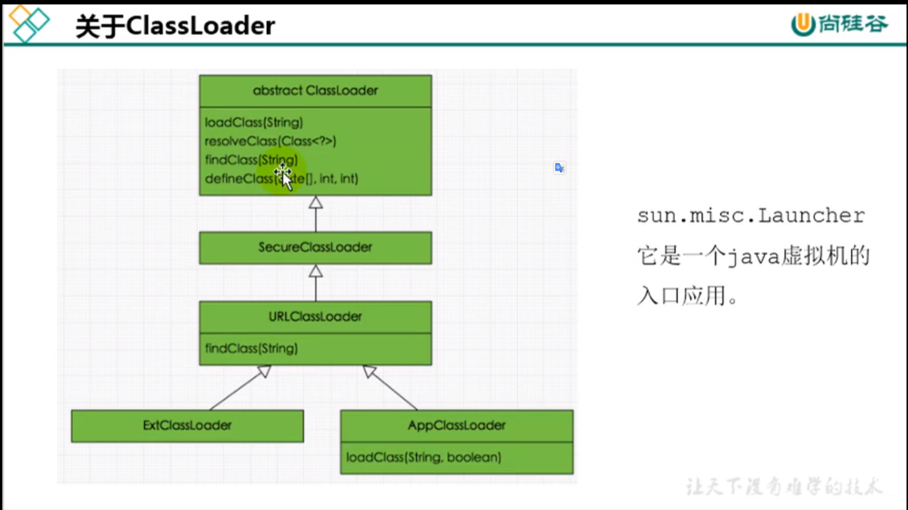


获取ClassLoader的几种方式：

1.   当前类的ClassLoader 

   ```
   clazz.getClassLoader()
   ```

2. 获取当前线程上下文的Classloader

   ```
   Thread.currentThread().getContextClassLoader()
   ```

3. 获取系统的ClassLoader 

   ```
   ClassLoader.getSystemClassLoader()
   ```

4. 获取调用的ClassLoader

   ```
   DriveManager.getCallerClassLoader()
   ```

   

   
   


## 双亲委派机制

Java 虚拟机对class文件加载的是 按需加载 的方式，也就是说当前需要使用该类时才会将它的class文件加载的内存生成class对应，而且加载某个类的class文件时，Java虚拟机采用的是双亲委派模式，即把请求关键帧父类处理，它是一种任务委派模式。

工作原理：

- .如果一个类加载器收到了类加载请求，它并不会自己先去加载，而是把这个请求委托给父类的加载器去执行。

- 如果父类加载器一这存在其父类加载器，则进一步向上委托，依次递归，请求最终将到达顶层的启动类加载器。

- 如果父类加载器可以完成类加载任务，就成功返回，倘若父类加载器无法完成此加载任务，子加载器才会尝试自己去加载，这就是双新委派模式。

  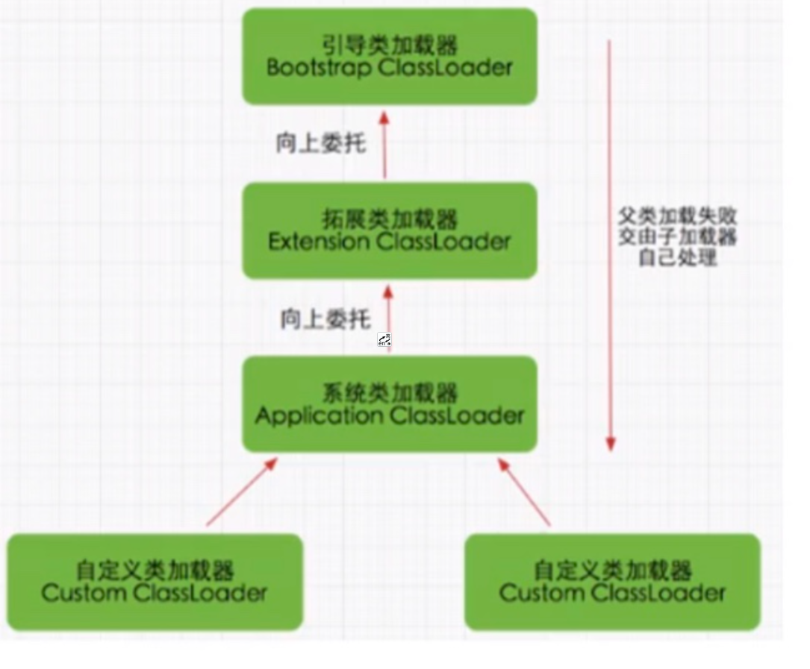

  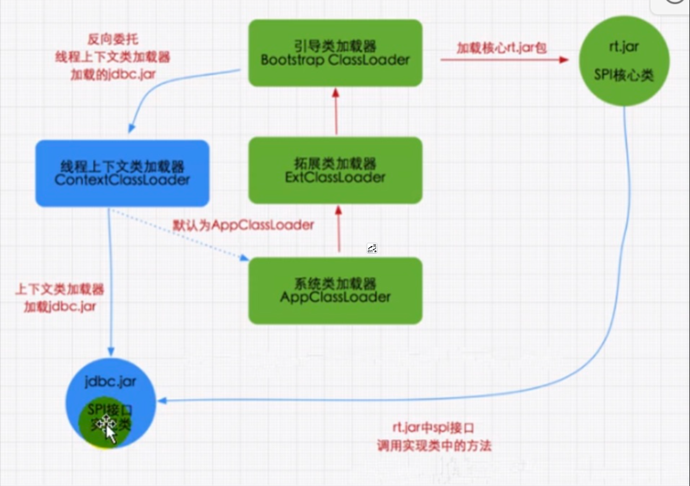

双亲委派机制

优势

- 避免类的重复加载

- 保护程序安全，防止核心API祉以随意篡改

  - 代码结构：定义java.lang.String类，与系统String类全限定名一样，发现自定义的String类无法正常加载。

    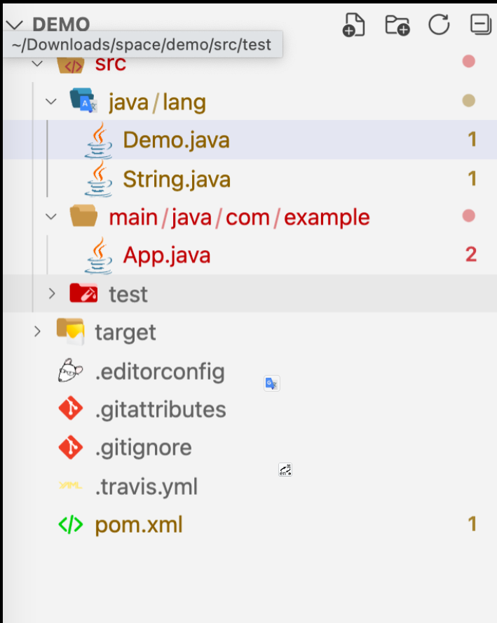

  

  

沙箱安全机制

```java
/*
 * @Author: Kun Peh
 * @Date: 2021-07-18 11:43:01
 * @LastEditTime: 2021-07-18 15:14:58
 * @Description: String  class
 */
package java.lang;

public class String {
	
	static {
		System.out.println("自定义String");
	}
	public static void main(String[] args) { // 报错
		System.out.println("Hello");
	}
}
```

自定义String类，但是在加载自定义String类的时候会率先使用引导类加载器加载，而引导类加载器在加载的过程中会先加载jdk自带的文件(rt.jar包中java/lang/String.class)，报错的信息说没有main方法，就是因为加载的是rt.jar包中的String类，这样可以保证对java核心源代码的保护，这就是沙箱安全机制。


## **其他**

在JVM表示两个class对象是否为同一个类必备的两个必要条件：

- 类的完整类名必须一致，包括包名(全限定名)。
- 加载这个类的ClassLoader(指的Classloader实例对象)必须相同

>换句话说，在JVM中，即使这个类对象（class对象）来源同一个Class文件，被同一个虚拟机所加载，但只是加载它们的ClassLoader实例对象不同，那么这两个类对象也不相等的。


## **对类加载器的引用**


JVM必须知道一个类型是由启动加载器加载的还是由用户类加载器加载的 

如果一个类型是由用户类加载器加载的，那么JVM会将这个类加载器的一个引用作为类型信息的一部分保存在方法区中，当解析一个类型到另一个类型的引用的时候，JVM需要保证这两个类型的类加载器是相同的


## **类的主动使用和被动使用**

Java程序对类的使用方式分为：主动使用 和 被动使用。
主动使用，又分为七种情况： 

- 创建类的实例

- 访问某个类或接口的静态变量，或者对该静态变量赋值 

- 调用类的静态方法

- 反射（ 比如：Class.forName(“cn.sxt.Test”) )

- 初始化一个类的子类

- Java虚拟机启动时被标明为启动类的类

- JDK7开始提供的动态语言支持：java.lang.invoke.MethodHandle实例的解析结果REF_getStatic、REF putStatic、REF_invokeStatic句柄对应的类没有初始化，则初始化

  

  除了以上七种情况，其他使用Java类的方式都被看作是对类的被动使用，都不会导致类的初始化，即不会执行初始化阶段（不会调用 clinit( ) 方法和 init( ) 方法）

  

  

  
  

