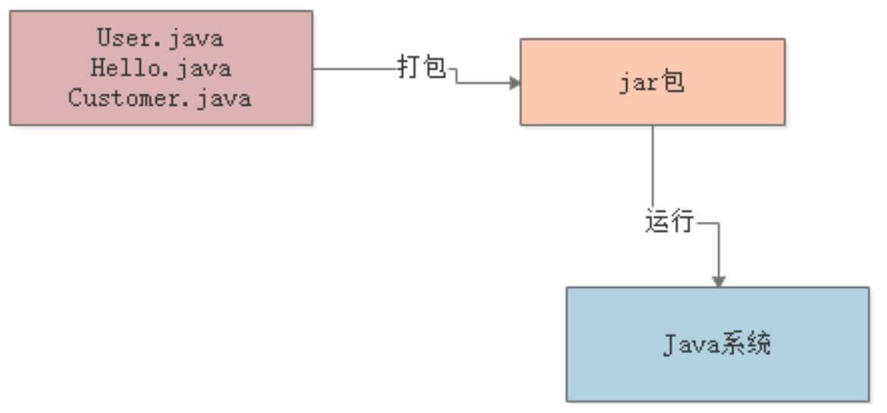
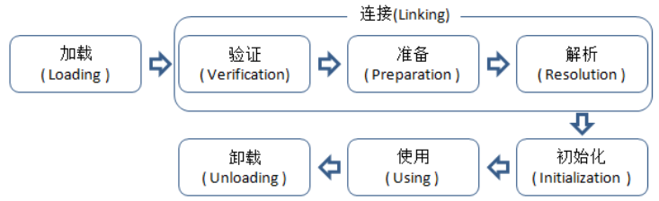
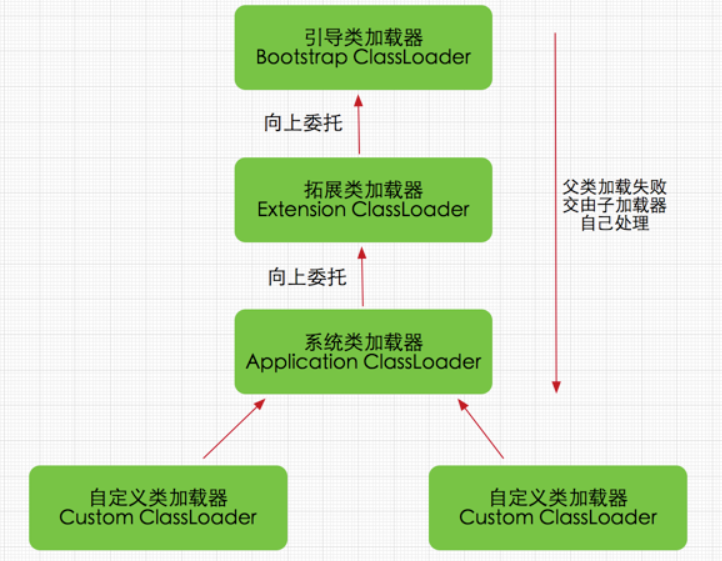
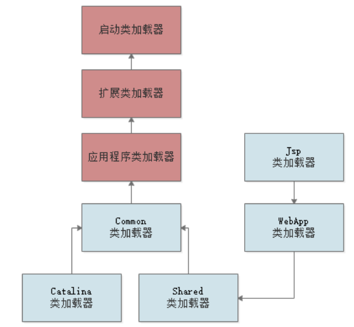
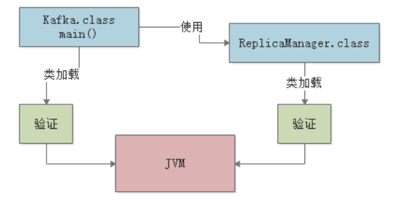
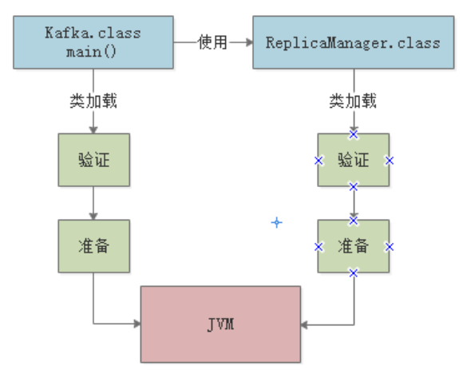
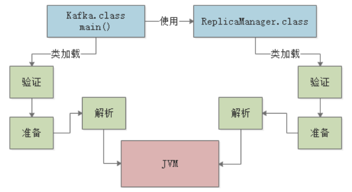
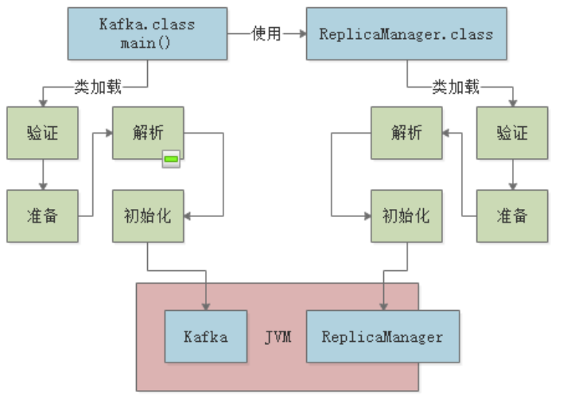

# JVM类加载机制

## 一、简介

首先，我们来简单看下Java程序的执行流程：




上图中，典型的Java程序执行流程如下：

1. 我们在本地编写完Java源程序；
2. IDE自动帮我们编译成.class文件（也可以手动通过javac命令编译），然后打包成jar包或者war包；
3. 接着，执行java -jar命令或直接部署到web容器中来运行程序；
4. 运行时，OS会启动一个JVM进程，JVM会采用**类加载器**将各种.class文件中包含的Java类加载到内存中；
5. 最后，JVM基于自己的**字节码执行引擎**，来执行加载到内存中的那些类。


## 二、类加载机制

类从.class二进制数据被加载到 JVM 内存中开始，到卸载出内存为止，它的整个生命周期包括：

*加载（Loading）*、*验证（Verification）*、*准备(Preparation)*、*解析(Resolution)*、*初始化(Initialization)*、*使用(Using)*、*卸载(Unloading)*，共7个阶段。




**加载（Loading）**阶段很简单，当程序执行到需要的类时，JVM就会通过**类加载器** 将其加载到内存中。接下来，我们先看下什么是类加载器，然后详细讲解整个类加载流程。


### 类加载器

类加载器可以大致划分为以下三类：

**Bootstrap ClassLoader**

主要负责加载 JDK 安装目录下的核心类库（比如/lib目录下的类），这些核心类库是JVM运行时自身需要用到的。

> Bootstrap ClassLoader 采用C++语言实现，也是JVM自身的一部分，开发者不能直接在Java程序中使用。

**Extension ClassLoader**

主要负责加载 JDK 安装目录下的扩展类库（比如/lib/ext目录下的类），这些扩展类库是JDK按照功能进行模块划分的，一般也是Java程序运行所必需的。

> 开发者可以在Java程序中直接使用Extension ClassLoader。

**Application ClassLoader**

负责加载用户类路径（classpath）所指定的类，可以简单的理解成负责加载用户自己开发的Java类。

> 开发者可以在Java程序中直接使用Extension ClassLoader，这也是默认的类加载器。

除了上述提供到三种类加载器外，开发者也可以自定义类加载器，根据自己的需求去加载类。


### 双亲委派机制

JVM的类加载器是有亲子层级结构的，层级结构如下图：



当我们的类加载器需要加载一个类时，首先会委派给自己的父类加载器去加载，最终传到到顶层 的类加载器去加载；如果某个父类加载器发现在**自己负责的范围内**并没有找到这个类，就会下推加载权力给自己的子类加载器。

以上图为例：

1. 当Application ClassLoader加载一个class时，它首先不会自己去尝试加载这个类，而是把类加载请求委派给父类加载器Extension ClassLoader去完成；
2. 当Extension ClassLoader加载一个class时，它首先也不会自己去尝试加载这个类，而是把类加载请求委派给Bootstrap ClassLoader去完成；
3. 如果Bootstrap ClassLoader加载失败（例如在$JAVA_HOME/jre/lib里未查找到该class），会使用Extension ClassLoader来尝试加载；
4. Extension ClassLoader也加载失败，则会使用Application ClassLoader来加载，如果Application ClassLoader也加载失败，则会报出ClassNotFoundException异常。

**优点**

双亲委派机制的优点很明显，可以**避免类的重复加载**，当父亲已经加载了该类时，子ClassLoader就没有必要再加载一次。

另外，考虑到**安全因素**，Java核心api中的类不会被随意替换：假设通过网络传递一个名为java.lang.Integer的类，通过双亲委托模式传递到Bootstrap ClassLoader，发现在核心Java API中已经有这个类了，就并不会重新加载网络传递过来的java.lang.Integer，而直接返回已加载过的Integer.class，这样便可以防止核心API库被随意篡改。


### 设计类加载器

下面我们通过一个示例，更好地理解下双亲委派机制。Tomcat是常用的web容器，本身是用Java实现的，当我们的程序以war包部署到tomcat后，tomcat启动后的内部JVM需要加载我们程序中的.class文件。那么Tomcat的类加载机制应该如何设计，才能动态加载我们war包中的类到tomcat自身的JVM中去呢？

首先，Tomcat的类加载体系如下图，蓝色部分是Tomcat继承Application ClassLoader实现的自定义类加载器：



Common、Catalina、Shared类加载器用来加载Tomcat自身的一些核心基础类库。同时，Tomcat为每一个部署在其内的web应用都分配了一个对应的WebApp类加载器，就是这个类加载器负责加载我们部署的这个web应用的类，每一个WebApp只负责加载自己对应的那个web应用的class文件，不会传导给上层类加载器去加载。所以，**Tomcat的类加载器设计其实是打破了双亲委派机制的**。

至于Jsp类加载器，则是给每一个JSP都准备了一个Jsp类加载器。


## 三、类加载过程

“家宴准备了西式菜”，即家(加载)宴(验证)准备(准备)了西(解析)式(初始化)菜。


### 加载

1. 通过一个类的全限定名获取定义此类的二进制字节流
2. 将这个字节流所代表的静态存储结构转化为方法区的运行时数据结构
3. 在Java堆中生成一个代表这个类的java.lang.Class对象，作为对方法区中这些数据的访问入口。


相对于类加载的其他阶段而言，*加载阶段(准确地说，是加载阶段获取类的二进制字节流的动作)是可控性最强的阶段*，因为开发人员既可以使用系统提供的类加载器来完成加载，也可以自定义自己的类加载器来完成加载。

加载阶段完成后，虚拟机外部的 二进制字节流就按照虚拟机所需的格式存储在方法区之中，而且在Java堆中也创建一个`java.lang.Class`类的对象，这样便可以通过该对象访问方法区中的这些数据。

类加载器并不需要等到某个类被“首次主动使用”时再加载它，JVM规范允许类加载器在预料某个类将要被使用时就预先加载它，如果在预先加载的过程中遇到了.class文件缺失或存在错误，类加载器必须在程序首次主动使用该类时才报告错误(LinkageError错误)如果这个类一直没有被程序主动使用，那么类加载器就不会报告错误。


**加载.class文件的方式**

- 从本地系统中直接加载
- 通过网络下载.class文件
- 从zip，jar等归档文件中加载.class文件
- 从专有数据库中提取.class文件
- 将Java源文件动态编译为.class文件


### 链接【验证、准备、解析】

#### 验证阶段

目的在于确保Class文件的字节流中包含信息符合当前虚拟机要求，保证被加载类的正确性，不会危害虚拟机自身安全。

主要包括四种验证，文件格式验证、元数据验证、字节码验证、符号引用验证。

- `文件格式验证`: 验证字节流是否符合Class文件格式的规范；例如: 是否以`0xCAFEBABE`开头、主次版本号是否在当前虚拟机的处理范围之内、常量池中的常量是否有不被支持的类型。
- `元数据验证`: 对字节码描述的信息进行语义分析(注意: 对比`javac`编译阶段的语义分析)，以保证其描述的信息符合Java语言规范的要求；例如: 这个类是否有父类，除了`java.lang.Object`之外。
- `字节码验证`: 通过数据流和控制流分析，确定程序语义是合法的、符合逻辑的。
- `符号引用验证`: 确保解析动作能正确执行。


验证阶段就是用来做这个事情的，来看下下面的代码：

```java
public class Kafka {
    public static void main(String[] args) {
        ReplicaManager manager = new ReplicaManager();
    }
}
```

代码示例中，Kafka类用到了ReplicaManager类，所以它们都会在被加载进JVM后进行验证：




####  准备阶段

准备阶段是正式为类变量分配内存并设置类变量初始值的阶段，**这些内存都将在方法区中分配**。对于该阶段有以下几点需要注意:

- 这时候进行内存分配的仅包括类变量(`static`)，而不包括实例变量，实例变量会在对象实例化时随着对象一块分配在Java堆中。
- 这里所设置的初始值通常情况下是数据类型默认的零值(如`0`、`0L`、`null`、`false`等)，而不是被在Java代码中被显式地赋予的值。

假设一个类变量的定义为: `public static int value = 3`；那么变量value在准备阶段过后的初始值为`0`，而不是`3`，因为这时候尚未开始执行任何Java方法，而把value赋值为3的`put static`指令是在程序编译后，存放于类构造器`<clinit>()`方法之中的，所以把value赋值为3的动作将在初始化阶段才会执行。

**比如，下面的ReplicaManager类**：

```java
public class ReplicaManager {
    public static int flushInterval;
}

```

当加载阶段、验证阶段都执行完成后，JVM会给类的静态字段分配内存空间，上述代码就是给flushInternal字段赋默认值0，整个过程如下图：




#### 解析阶段

解析阶段是虚拟机将常量池内的符号引用替换为直接引用的过程，解析动作主要针对`类`或`接口`、`字段`、`类方法`、`接口方法`、`方法类型`、`方法句柄`和`调用点`限定符7类符号引用进行。符号引用就是一组符号来描述目标，可以是任何字面量。

`直接引用`就是直接指向目标的指针、相对偏移量或一个间接定位到目标的句柄。

这一过程底层非常复杂，我们后续章节将进行专门讲解。




###  初始化阶段

初始化，为类的静态变量赋予正确的初始值，JVM负责对类进行初始化，主要对类变量进行初始化。在Java中对类变量进行初始值设定有两种方式:

- 声明类变量是指定初始值
- 使用静态代码块为类变量指定初始值

我们来看下下面这段代码理解下：

```java
public class ReplicaManager {
    public static int flushInterval = Configuration.getInt("replica.flush.interval");
    public static Map<String,Replica> replicas;

    static {
        loadReplicaFromDish():
    }

    public static void loadReplicaFromDish(){
        this.replicas = new HashMap<String,Replica>();
    }
}
```

对于flushInternal变量，我们通过一个getInt方法从配置中获取值并进行赋值，这个赋值动作在**准备阶段**是不会执行的，而是在**初始化阶段**执行。另外，对于static静态代码块，也是在这个阶段执行的。




> 在初始化阶段，如果JVM初始化某个类时，发现其父类还没有初始化完成的话，会首先去加载其父类，加载策略就是上一节提到的双亲委派机制。

**JVM初始化步骤**

- 假如这个类还没有被加载和连接，则程序先加载并连接该类
- 假如该类的直接父类还没有被初始化，则先初始化其直接父类
- 假如类中有初始化语句，则系统依次执行这些初始化语句


**类初始化时机**: 只有当对类的主动使用的时候才会导致类的初始化，类的主动使用包括以下六种:

- 创建类的实例，也就是new的方式
- 访问某个类或接口的静态变量，或者对该静态变量赋值
- 调用类的静态方法
- 反射(如Class.forName("com.pdai.jvm.Test"))
- 初始化某个类的子类，则其父类也会被初始化
- Java虚拟机启动时被标明为启动类的类(Java Test)，直接使用java.exe命令来运行某个主类


### 卸载阶段

**Java虚拟机将结束生命周期的几种情况**

- 执行了System.exit()方法
- 程序正常执行结束
- 程序在执行过程中遇到了异常或错误而异常终止
- 由于操作系统出现错误而导致Java虚拟机进程终止

## 四、总结

本章，我们介绍了Java的类加载机制及其整个流程，JVM底层的类加载过程的细节非常多，十分复杂，读者如果想要深入，可以参阅[The Java® Virtual Machine Specification](https://docs.oracle.com/javase/specs/jvms/se8/jvms8.pdf)。下一章，我们将看看JVM是如何进行内存区域划分的。


**参考**

https://pdai.tech/md/java/jvm/java-jvm-classload.html

