# jvm 实战

## **JVM基础（2）——JVM内存模型**


### 一、简介

JVM会加载类到内存中，所以 JVM 中必然会有一块内存区域来存放我们写的那些类。Java中有类对象、普通对象、本地变量、方法信息等等各种对象信息，所以JVM会对内存区域进行划分：


>JDK1.8及以后，上图中的方法区变成了Metaspace——元数据区。

我们本章的目的，就是介绍JVM中各块内存区域的功能，其中都是存放的哪些java对象信息。


### 二、方法区

方法区只存在于JDK1.8以前的版本，主要是存储从”.class“文件里加载进来的类，包括**类的名称**、**方法信息**、**字段信息**、**静态变量**、**常量**以及**编译器编译后的代码**等。从JDK1.8开始，这块区域的名字改成了元数据区（Metaspace），元数据区直接使用本地内存。

默认情况下，元数据区会根据使用情况动态调整，避免了在JDK1.8以前由于加载类过多从而出现 java.lang.OutOfMemoryError: PermGen。但也不能无限扩展，因此可以使用 -XX:MaxMetaspaceSize来控制最大内存。

以上一章的示例来看，Kafka.class和ReplicaManager.class加载到JVM后，会放到方法区中：

```java
public class Kafka {
    public static void main(String[] args) {
        ReplicaManager manager = new ReplicaManager();
    }
}
```

方法区/元数据区是所有线程共享的：


### 三、程序计数器

程序计数器，用来记录当前线程正在执行的字节码指令。我们还是继续以上一章的代码作为示例来讲解：

```java
public class Kafka {
    public static void main(String[] args) {
        ReplicaManager manager = new ReplicaManager();
        manager.loadReplicaFromDisk();
    }
}
```

首先，上面这段.java源程序会被编译成.class文件，.class中存放的是JVM可以读懂的字节码，比如下面这样

```shell
public java.lang.String getName();
    descriptor: ()Ljava/lang/String;
    flags: ACC_PUBLIC
    Code:
        stack=1, locals=1, args_size=1
            0: aload_0
            1: get_field    #2
            4: areturn

```

当JVM加载类信息到内存之后，实际就会使用自己的**字节码执行引擎**，去执行这些字节码指令，如下图：


程序计数器的作用就在这里，它会**记录当前执行的字节码指令的位置**，如下图：


程序计数器是**线程私有**的，也就是说每个线程都有个自己的程序计数器，记录当前线程执行到了哪一条字节码指令：


### 四、Java虚拟机栈

Java虚拟机栈，其实是一种表示Java方法执行的数据结构。每个方法被执行的时候，都会创建一个栈帧（Stack Frame）用于存储**局部变量表**、**操作栈**、**动作链接**、**方法出口**等信息。每个方法从被调用到执行完成的过程，其实就是一个栈帧在虚拟机栈中从入栈到出栈的过程。

下面的这段程序，肯定有一个main线程来执行main()方法里面的代码，方法内部我们通常会定义一些局部变量，比如manager，JVM中必须有一块区域来保存方法中的这些数据，这个就是Java虚拟机栈，Java虚拟机栈是**线程私有**的。

```java
public class Kafka {
    public static void main(String[] args) {
        ReplicaManager manager = new ReplicaManager();
        manager.loadReplicaFromDisk();
    }
}

```

```java
public class ReplicaManager {
    public static void loadReplicaFromDisk() {
        Boolean hashFinishedLoad = false;
    }
}

```

比如main线程执行了main()方法，那么就会创建一个栈帧（里面存放manager局部变量），并将其压入main线程自己的Java虚拟机栈中，如下图：


然后main线程继续执行loadReplicaFromDisk方法，遇到方法内部的hashFinishedLoad局部变量，就会再创建一个栈帧，压入自己的虚拟机栈中：


上述就是JVM中的”Java虚拟机栈“这个组件的作用：**调用任何方法时，为方法创建栈帧然后入栈，栈帧里存放了这个方法对应的局部变量之类的数据（也包括方法执行的其它相关信息），方法执行完毕后就出栈。**


### 五、Java堆内存

Java堆内存，这是JVM内存区域中最重要的一块区域，存放着各种Java对象，是线程共享区域。

下面代码中，new ReplicaManager()创建了一个对象实例，这个对象实例的相关信息就存放在Java堆内存中：

```java
public class Kafka {
    public static void main(String[] args) {
        ReplicaManager manager = new ReplicaManager();
        manager.loadReplicaFromDisk();
    }
}

```

main线程在执行main()方法时，会为其创建一个栈帧并入栈，栈帧中的局部变量manager存放着ReplicaManager对象实例在Java堆内存中的地址：


### 六、本地方法栈

本地方法栈，其作用和Java虚拟机栈类似，区别在于本地方法栈是为虚拟机所使用到的**Native方法**服务，而Java虚拟机栈为虚拟机执行Java方法(也就是字节码)服务。本地方法栈也是线程私有的。

JDK中的很多底层API，比如IO、NIO、网络等，如果大家去看它的源码，会发现很多地方是调用的native修饰的方法，比如下面这样：

```java
public native int hashCode();

```

在调用native方法时，也会有线程对应的栈来保存native方法底层用到的局部变量表之类的信息，这就是本地方法栈的作用。


### 七、总结

本章，我们通过代码的执行流程讲解了JVM的内存模型，读者需要重点关注方法区、程序计数器、Java虚拟机栈、Java堆内存与程序执行逻辑的关系，其中Java堆内存是我们后面章节要关注的重点区域。


## **JVM基础（3）——JVM垃圾回收机制**


### 一、简介

我们在 [JVM内存模型](https://www.tpvlog.com/article/86)一章中，介绍了JVM中的Java堆内存区域。该区域是JVM为Java对象分配内存的主要区域，本章我们主要针对该块区域讲解JVM的垃圾回收机制。

我们先通过一个示例，回顾下对象的分配与引用：

```java
public class Kafka {
    public static void main(String[] args) {
        loadReplicaFromDisk();
    }

    private static void loadReplicaFromDisk() {
        ReplicaManager replicaManager = new ReplicaManager();
        replicaManager.load();
    }
}

```

首先，main线程会执行main()方法里面的代码，它会把main()方法的栈帧压入自己的Java虚拟机栈中：


接着，main()方法内部调用了loadReplicaFromDisk()方法，就会创建一个loadReplicaFromDisk()方法对应的栈帧，同时在栈帧中存入一个局部变量replicaManager：


接着，loadReplicaFromDisk()方法内部创建了一个ReplicaManager对象，此时就会在Java堆内存中为该实例对象分配内存空间，并让局部变量replicaManager指向该实例对象：


最后，执行实例对象的load()方法，完成我们的业务逻辑。那么，这里思考一个问题，load方法执行完毕后会发生什么？我们上一章中提到过，方法执行完毕后对应的栈帧就会出栈，而一旦栈帧出栈，“replicaManager”局部变量也就没有了，此时就没有任何一个变量指向Java堆内存里的ReplicaManager实例对象了：


>Java堆内存里面的资源是有限的，所以对于上述ReplicaManager这类孤立的对象，必须要有一种机制去清理它们，JVM会有一个在后台运行的垃圾回收线程，去分析和处理这些垃圾对象，这就是本章要讲的**JVM垃圾回收机制**。


### 二、分代回收

在正式讲解JVM垃圾回收机制前，我们先来了解下JVM内存分代模型、：**新生代**、**老年代**、**永久代**。


#### 2.1 新生代

还是通过一个代码示例来讲解：

```java
public class Kafka {
    public static void main(String[] args) throws InterruptedException {
        while (true){
            loadReplicaFromDisk();
            Thread.sleep(1000);
        }
    }

    private static void loadReplicaFromDisk() {
        ReplicaManager replicaManager = new ReplicaManager();
        replicaManager.load();
    }
}

```

上述代码中，当main线程执行main()方法后，会进入一个永久循环，执行完第一遍后，JVM中的数据结构大致如下图：


当进入下一次循环再执行loadReplicaFromDisk()时，会再构造一个ReplicaManager对象实例放入Java堆内存中，原来的那个就会被JVM垃圾回收线程给回收掉，如此循环往复，ReplicaManager对象的生命周期非常短，频繁地被创建和回收：


>像ReplicaManager这种“朝生暮死”的小对象，通常都会在Java堆内存区域的"新生代"进行分配。但是，并不是每次JVM都会进行回收，默认情况下当新生代的内存空间快被占满时，会触发一次**“Minor GC”**，此时才会进行回收。


#### 2.2 老年代

我们对2.1中的代码进行改造，此时fetcher是一个静态变量，其实例对象ReplicaFetcher会一直被该静态变量引用，而ReplicaManager对象则一直“朝生暮死”：

```java
public class Kafka {
    private static ReplicaFetcher fetcher = new ReplicaFetcher();

    public static void main(String[] args) throws InterruptedException {
        loadReplicaFromDisk();
        while (true) {
            fetcheReplicaFromRemote();
            Thread.sleep(1000);
        }
    }

    private static void loadReplicaFromDisk() {
        ReplicaManager replicaManager = new ReplicaManager();
        replicaManager.load();
    }

    private static void fetcheReplicaFromRemote() {
        fetcher.fetch();
    }
}

```

最初时，ReplicaFetcher对象和ReplicaManager对象都被分配在新生代：


根据Java虚拟机规范，**如果一个实例对象在新生代中，成功的在15次垃圾回收之后，还是没有被回收到，那么就会被转移到老年代**，所以ReplicaFetcher这个对象会首先在“年轻代”驻留一会儿，但是最终会进入老年代：


而ReplicaManager对象，当loadReplicaFromDisk()方法执行完成后，栈帧就会出栈，所以年轻代里的ReplicaManager会被垃圾回收线程清理掉：


>老年代也有类似"Minor GC"的机制，另外，对于一些大对象，会直接在“老年代“分配；在一次”Minor GC“之后，如果新生代中的存活对象过多，即使这些对象年龄没有达到15，也会直接进入老年代。这些细节，后面我们会专门讲解。


#### 2.3 永久代

永久代就是我们在[JVM内存模型](https://www.tpvlog.com/article/86)中提到到“方法区”，方法区中存储着类的信息，当满足以下三个条件时，方法区里的类会被回收：

- 该类的所有实例对象已经从Java堆内存中被回收；
- 加载这个类的ClassLoader已经被回收；
- 对该类的Class对象没有任何引用。


### 三、JVM参数

#### 3.1 核心参数

先来看一些核心的参数，通过这些参数可以设置上述提到的新生代、老年代、永久代的内存区域大小：

**-Xms**：Java堆内存区域的大小；

**-Xmx**：Java堆内存区域的最大大小；

**-Xmn**：Java堆内存区域的新生代大小，扣除新生代剩下的就是老年代的大小；

**-XX:PermSize**：永久代大小；

**-XX:MaxPermSize**：永久代的最大大小；

**-Xss**：每个线程的栈内存大小。


-Xms和-Xmx，分别用于设置Java堆内存的初始大小和最大大小，一般设置为相同值就可以，这样就限定了Java堆内存的总大小。

同理，-XX:PermSize和-XX:MaxPermSize配合使用可以限定永久代的大小。

最后，每个线程都有自己的虚拟机栈，-Xss就是限定了每个线程的虚拟机栈内存的大小。

>JDK1.8以后，方法区变成了“元数据区”，-XX:PermSize和-XX:MaxPermSize这两个参数，也相应的变成了-XX:MetaspaceSize和-XX:MaxMetaspaceSize。


#### 3.2 新生代配置

我们来看一个线上示例，更好的理解下如何合理的设置JVM参数。下图是一个电商系统的大致流程，我们重点分析用户提交支付订单-支付系统这一块：


对于支付系统，其系统压力来自很多方面，包括高并发访问、大量日订单数据存储、高可用保障等等，抛开这些系统架构层面的东西，我们只看JVM层面，系统最大的压力来自于**频繁的创建和销毁支付订单**，所以就需要根据以下情况来估计每台机器的JVM参数设置：

- 支付联机系统的部署机器数量
- 每台机器的内存
- 每台机器的JVM堆内存大小


**并发量估算**

首先，我们先从系统日交易量入手，估算下每秒平均交易量。以笔者曾经做过的某银行核心支付平台为例，除去双11之类促活日外，系统日平均交易量为6000万笔，根据“二八定律”，80%的交易发生在20%的时间内，再乘以经验因子3，峰值每秒交易量大约为9000笔：
$$
TPS = 60000000 *80\% / (24*60*60*0.2) * 3≈ 9000
$$
假设我们部署20台机器，每台机器每秒大概处理450笔订单：


**耗时估算**

我们再来估算下一次支付请求处理的耗时，包括订单创建、缓存查询、填充数据、入库等等操作，这里咱们估算的大一点，假设需要1s时间。此时，我们脑子里应该有个流动的模型：

每台机器1秒钟接收到450笔支付订单，然后再JVM新生代创建了450个订单对象，接着1秒钟后，这450笔订单处理完毕，其引用就被回收了，那这些对象在JVM的新生代里就是没人引用的垃圾对象了。


**内存估算**

我们再来估算下每笔订单所需的内存空间，一般直接根据订单实体Bean中的字段和类型来估算就可以了，比如Integer类型占4字节、Long占8字节等等。根据经验，一个订单对象20个字段差不多了，所以算1个订单对象总共500字节，那450笔订单总共算250kb好了。


**完整分析**

现在我们已经把整个系统运行的关键环节的数据都分析清楚了，当系统运行时，新生代中积累的无引用对象会越来越多，直到某一刻可能达到了几百兆，把新生代空间都快占满了，然后就会触发“Minor GC”，把新生代里的垃圾对象都回收掉。

真实的线上支付系统，肯定每秒钟还会创建其它各种各样的对象，比如商户数据、信贷数据等等，我们一般把订单模型扩充10倍，来作为整体对象所占的内存大小，250kb*10大概也就3MB，也就是说：

**每秒钟创建出来的被Java虚拟机栈的局部变量引用的对象，大致占据的内存空间为3MB左右**

结合上述分析，其实我们就可以知道JVM的参数该如何设置了。

一般来说，像支付这种核心业务系统，给的机器配置都是比较好的，笔者之前所在公司的支付系统机器配置最低为**8核16G**，除去机器本身的内存消耗外，给JVM进程12G的内存：

**-Xms和-Xmx设置为10G，即整个Java堆内存一共10G；-Xmn设置为8G，即给新生代分配8G**。以每秒创建3MB新生代对象算，新生代占满大约需要45分钟，也就是45分钟左右触发一次“Monir GC”，是可以接受的。

>假设业务量更大，从纵向考虑，可以用更高配的机器；从横向考虑，可以横向扩展部署更多应用；从系统架构考虑，可以引入MQ削峰、分库分表或限流，总之只要每台机器处理的请求更少，对JVM的压力就越低。


### 四、总结

本章我们介绍了JVM的分代垃圾回收机制，并通过一个线上示例讲解了如何对JVM的各个核心参数进行预估配置。关于新生代、老年代、永久代还有许多细节我们没有在本章讲解，后续章节，我们会逐步深入。


## **JVM基础（4）——JVM存活判定算法**


### 一、简介

我们在 [JVM垃圾回收机制](https://www.tpvlog.com/article/87)一章中，简单介绍了JVM的垃圾回收机制，先来回顾下，系统运行时创建的对象优先在Java堆内存区域分配：


然后新生代里的对象越来越多，当快满了的时候就会触发“Minor GC”，把新生代中的一些对象回收掉：


那么这里就涉及一个问题：**JVM如何知道要去回收哪些对象？**这其实就是JVM的对象存活判定机制，主要涉及两种算：**可行性分析算法**和**引用计数算法**。

>引用计数算法，是给对象添加一个引用计数器，每当有一个地方引用它时，计数器就加1，当引用失效时，计数器值就减1，任何时刻计数器为0的对象就是可以被回收的。
>
>由于Java语言没有选用引用计数法来管理JVM内存，所以本文不赘述，而且引用计数法不能很好的解决循环引用的问题（Python采用的是引用计数法）。


### 二、可达性分析算法

可达性分析算法（GC Root Tracing ），其基本思路就是通过一系列的名为"**GC Roots**"的对象作为起始点，从这些起始点开始搜索，搜索所走过的路径称为引用链（Reference Chain），当一个对象到GC Roots没有任何引用链相连时（即从**GC Roots**到这个对象不可达），则证明此对象是不可用的，就可以被回收。

GC Roots包括：

- Java虚拟机栈中的局部变量（指向着GC堆里的对象）；
- VM的一些静态数据结构里指向GC堆里的对象的引用，例如HotSpot VM里的Universe里有很多这样的引用；
- 所有当前被加载的Java类（看情况）；
- Java类的运行时常量池里的引用类型常量；
- String常量池（StringTable）里的引用。

可达性分析算法最难理解的就是该选取哪些对象作为GC Roots，我们通过两个示例来看下。


#### 2.1 示例一

下面是最常见的一种情况：

```java
public class Kafka {
    public static void main(String[] args) {
        loadReplicasFromDisk();
    }
    public static void loadReplicasFromDisk(){
        ReplicaManager replicaManager = new ReplicaManager();
    }
}
```

当执行到loadReplicasFromDisk()时，对应的JVM内存数据结构如下图：


假如此时新生代的内存已经快满了，发生了“Minor GC”，那么JVM会分析ReplicaManager对象的可达性，发现它被“replicaManager”这个局部变量引用着，在JVM规范中，**局部变量是可以作为GC Roots的**，所以就不会被回收。


#### 2.2 示例二

另一种比较常见的情况，是下面这种样子：

```java
public class Kafka {
    public static ReplicaManager replicaManager = new ReplicaManager();
}

```

对应的JVM内存数据结构如下图：


假如此时新生代的内存已经快满了，发生了“Minor GC”，那么JVM会分析ReplicaManager对象的可达性，发现它被“replicaManager”这个方法区中的静态变量引用着，在JVM规范中，**静态变量是可以作为GC Roots的**，所以就不会被回收。


### 三、Java引用类型

可达性分析与Java的引用类型有关联，为了更好的管理对象的内存，更好的进行垃圾回收，JVM团队扩展了引用类型，从最早的强引用类型增加到**强引用**、**软引用**、**弱引用**、**虚引用**四个引用类型：


#### 3.1 强引用（StrongReference）

默认的对象都是强引用类型，如果JVM在对象存活判定时，通过GC Roots可达性分析结果为可达，表示引用类型仍然被引用着，这类对象始终不会被垃圾回收器回收。比如下面这段代码：

```java
public class Kafka {
    public static ReplicaManager replicaManager = new ReplicaManager();
}

```


#### 3.2 软引用（SoftReference）

在JVM内存充足的情况下，软引用是不会被GC回收的，**只有在JVM内存不足的情况下，才会被GC回收**。比如下面这段代码：

```java
public class Kafka {
    public static SoftReference<ReplicaManager> replicaManager = new SoftReference<ReplicaManager>(new ReplicaManager());
}

```

**适**用场景：网页缓存、图片缓存


#### 3.3 弱引用（WeakReference）

不论当前JVM内存是否充足，都**只能存活到下一次垃圾收集之前**，说的直白点，只要发生GC弱引用对象就会被回收，比如下面这段代码：

```java
public class Kafka {
    public static WeakReference<ReplicaManager> replicaManager = new WeakReference<ReplicaManager>(new ReplicaManager());
}
```

>ThreadlLocal中定义的ThreadLocalMap就使用到的弱引用。ThreadLocalMap的Entry，其Key就是一个弱引用对象，读者可以参考我的[《Java多线程系列》](https://www.tpvlog.com/article/17)。


#### 3.4 虚引用（PhantomReference）

虚引用，不会影响对象的生命周期，所持有的引用就跟没持有一样，随时都能被GC回收。在使用虚引用时，必须和**引用队列**关联使用。其使用场景是用来跟踪对象被垃圾回收器回收的活动。

在对象的垃圾回收过程中，如果GC发现一个对象还存在虚引用，则会把这个**虚引用加入到与之关联的引用队列**中。

程序可以通过判断引用队列中是否已经加入了虚引用，来了解被引用的对象是否将要被垃圾回收。如果程序发现某个虚引用已经被加入到引用队列，那么就可以在所引用的对象内存被回收之前采取必要的行动防止被回收。


### 四、finalize方法

大家理解完了GC Roots和引用类型的概念，基本就都知道了哪些对象可以被回收，哪些对象不可以被回收：

**有GC Roots引用的对象不能回收，没有GC Roots引用的对象，如果是软引用或弱引用，可能会被回收。**

真正的回收环节，待被回收的对象其实还有一次机会拯救自己，那就是对象的finalize()方法。我们通过一段代码示例来看下：

```java
public class ReplicaManager {
    public static ReplicaManager instance;

    @Override
    protected void finalize() throws Throwable {
        ReplicaManager.instance = this;
    }
}

```

假如有一个ReplicaManager对象马上就要被回收了（此时已经没有GC Roots到达它的链路），此时GC会首先调用下该对象的finalize()方法，看看它是否找了一个新的GC Roots来引用自己，比如上述代码中，GC发现有个静态变量instance引用了该实例，那GC就不会去回收它。

>finalize方法没事不要去重写，这都是GC内部的机制，平时也几乎不用。


## **JVM基础（5）——JVM垃圾回收算法**


### 一、简介

我们在前两章中，已经讲解了JVM垃圾回收的基本流程和对象存活判定的算法，但是，并没有深入垃圾回收内部的细节。本章，我们就深入垃圾回收的内部，看看JVM到底是如何进行对象内存的回收的。


### 二、复制算法

复制算法，主要用于**新生代**中对象的回收。其基本思路就是：将新生代内存按划分为大小相等的两块，每次只使用其中的一块，当一块内存用完了，**将存活的对象移动到另外一块上面**，然后在把已使用过的内存空间一次清理掉。


#### 2.1 算法流程

我们以示例代码来看复制算法的执行流程：

```java
public class Kafka {

    public static void main(String[] args) throws InterruptedException {
        loadReplicaFromDisk();
    }

    private static void loadReplicaFromDisk() {
        ReplicaManager replicaManager = new ReplicaManager();
        replicaManager.load();
    }
}
```

假设程序执行到replicaManager.load()，JVM的内存数据结构如下，其中“大量垃圾对象无人引用”表示其它程序产生的垃圾对象，此时新生代中用于分配对象内存的区域也快满了，再次为对象分配内存时就会触发“Minor GC”：


此时，一种最基本的思路就是，首先标记出所有需要回收的对象，在标记完成后统一回收所有被标记的对象。但是这种方法问题也很明显：**产生大量内存碎片，导致后续需要为大对象分配空间时内不足**。所以，JVM很少用这种方法，而是先将存活对象转移到另一块区域：


然后一次性把原来那块内存清空：


上述整个流程，就是所谓的复制算法：**把新生代划分为两块内存区域，只使用其中一块，当这块快满的时候，把存活对象一次性转移到另一块，保证没有内存碎片，然后清空原来那块，依次循环往复**。


#### 2.2 算法优化

上述复制算法的缺点很明显：即**对内存的使用效率太低**。比如我们给新生代分配了1G内存，那其实只有512MB是实际使用的，很浪费内存空间。那么如何来优化呢？

我们回顾下**新生代中对象的特点：朝生暮死，也就是说新生代的绝大多数对象在经历1次GC后就会被回收掉，存活率非常低。**

根据这个特点， *HotSpot VM* 采用了一种做法，把新生代区域划分成了三块：**1个Eden区（80%），2个Survivor区（各占10%）**，最开始，对象只在Eden进行分配：


如果Eden区快满了，此时触发GC会将Eden区中的存活对象转移到其中一块Survivor中，同时清空Eden：


下一次再分配空间时，依然在Eden区分配，然后触发GC，将Eden的存活对象和上一次使用的Survivor中的存活对象转移到另一块空白Survivor中，然后清空Eden和使用过的Survivor，循环往复。

>这种内存划分方式的最大好处就是只有10%的空间是闲置的，无论是垃圾回收的性能、内存碎片的控制、内存使用率，都非常好。


### 三、标记整理算法


通过前一节，大家应该已经了解了新生代的垃圾回收算法，本节我们就来看下老年代的垃圾回收算法——标记整理算法。


#### 3.1 何时进入老年代

这里有一个问题，新生代的对象什么时候会进入老年代？先给出一个结论，一共有五种情况：

- 新生代对象的年龄超过一定阈值（默认15）；
- 动态年龄判断
- 大对象直接分配
- Survivor区空间不足


##### **年龄阈值**

之前我们提到过，新生代中的对象每逃过一轮GC，年龄都会加1，到年龄达到15时（也可以通过JVM参数`-XX:MaxTenuring Threshold`设置），就会被转移到老年代：


##### **动态年龄判断**

动态对象年龄判断的规则是： Survivor区的存活对象年龄从小到大进行累加，当累加到 X 年龄时的总和大于 Survivor区空间的50%时，那么比X大的对象都会晋升到老年代。

举个例子，比如当前Survivor区的分布如下，累加结果45%小于50%：


此时新生代GC后，有6%的对象进入Survivor区，则Survivor区分布如下图：


这时从1岁加到4岁的对象总和51% 大于50%，但此时没有大于四岁的对象，即没有对象晋升 。此时再经过一次新生代GC后，又有40%的对象进入Survivor区，Survivor区分布如下图：


Survivor区的对象年龄从小到大进行累加，当累加到 3 年龄时的总和大于50%，那么比3大的都会晋升到老年代，即4岁的20%、5岁的20%晋升到老年代。

>可以使用-XX:TargetSurvivorRatio来设置Survivor区空间的百分比，默认值是50


##### **大对象**

对于一些大对象，JVM会直接将其分配到老年代。通过参数-XX:PretenureSizeThrehold，可以设置阈值，单位为字节。

JVM之所以要这么做，是为了避免新生代中出现屡次逃过GC的大对象，大对象在新生代的Eden和Survivor区的来回复制开销比较大。


##### **Survivor区空间不足**

最后一种情况就是，Minor GC之后发现存活对象太多，没法放入另一块Survivor区域中，比如下面这种情况：


这时候就必须把这些对象全部迁移到老年代去：


#### 3.2 空间分配担保

前面讨论了新生代的存活对象何时会转移到老年代，那么问题又来了，如果老年代区域的内存空间不足了怎么办？这里就涉及了**空间分配担保机制**。

所谓空间分配担保，指在执行任何一次Minor GC之前，JVM会检查**老年代的最大连续可用空间**是否大于**新生代所有对象的总大小**：

如果大于，说明这次Minor GC肯定是安全的，因为老年代可以容纳新生代中的所有对象；

如果小于，则 JVM 会查看`-XX:HandlePromotionFailure`参数值，这个参数值表示是否允许担保失败：

- 如果允许（`HandlePromotionFailure==true`），则看下**老年代的最大连续可用空间**是否大于**历次Minor GC后进入老年代的对象平均大小**。如果大于，就进行minior GC，如果这次Minior GC失败了，就会进行FULL GC（所谓FULL GC，就是既对老年代进行垃圾回收，也对新生代进行垃圾回收）；如果小于，先进行FULL GC，再Minor GC。
- 如果不允许（`HandlePromotionFailure==false`），则直接触发FULL GC，然后再进行一次Minor GC。

如果经过上面的操作，老年代可用空间最后发现还是不够，就会导致所谓的OOM内存溢出了。

>总之，空间分配担保机制的核心目的就是**避免频繁FULL GC，能先预判就先预判**，实在不行才FULL GC，因为FULL GC的开销非常大，既要对老年代进行回收，也要对新生代进行回收。


#### 3.3 算法流程

了解了新生代对象何时进入老年代，以及FULL GC的触发时机，我们就可以来看下老年代的**标记整理算法**的流程了。标记整理算法，其实就是先标记存活对象，然后将存活对象都向内存端边界移动，然后清理掉端边界以外的内存，这样就可以避免出现大量内存碎片。

我们通过示例来看下，假设JVM当前的内存状态如下，老年代中散落着各种存活对象：


接着，会将存活对象都往内存的一边移动，让它们尽量紧凑，然后一次性把垃圾对象清理掉：


### 四、线上示例

通过前两节的讲解，相信读者已经对新生代的复制算法、老年代的标记整理算法有所了解，本节我们将通过一个生产系统的GC案例，让大家更加透彻的理解JVM中如果进行对象分配和老年代转移，以及Minor GC和Full GC的全过程。


#### 4.1 背景

假设现在生产环境有一套“数据计算系统”，不停地从MySQL等各类数据源提取数据到内存中进行计算，系统是分布式的。每个节点（机器）每分钟执行100次操作（提取数据并计算，每次操作耗时10s），每次操作1万条数据，每条数据大小为1KB左右，那么每次数据的总大小就是10MB：


>每台机器的配置是4核8G，JVM分配4G内存，其中新生代1.5G，老年代1.5G。

整个系统的初始背景大致就是上面这样，下面来分析可能存在的各种问题。


#### 4.2 频繁Full GC

我们先来看下新生代的空间什么时候会被占满，按照8：1：1来分配Eden和Survivor区，如下图：


每执行一次操作，Eden区就会填充10MB数据，一分钟执行100次操作就是1000MB，所以**Eden区基本上1分钟左右就会被占满**。再执行操作时，就会进行Minor以回收一部分的垃圾对象：

首先，检查老年代的连续可用内存空间是否足够（即大于新生代中的所有存活对象大小），如下图，老年代目前是空的，1.5G的可用内存空间可以容纳Eden区中的1.2G对象，所以会直接进行Minor GC：


那么，**此时Eden区中有多少对象还是存活的呢？**之前说了每次操作耗时10s，那么在1分钟内的最后10s时，前面0-50s的任务已经执行完了，1分钟操作100个任务，所以大约有1/6的任务还没有执行完毕，即大约还有20个任务在计算中（大约200MB对象存活）：

> 其实线上一般是通过GC日志去分析存活对象的大小的，GC日志中清楚的记录了每次Minor GC进入到老年代的对象大小（后面我们会详细讲解如何看懂GC日志），根据我们的线上日志分析，大约也还有200MB对象是存活的。

注意，每一块Survivor区的大小只有100MB，所以是无法容纳200MB的存活对象的，所以会通过空间担保机制，转移到老年代中，并清空Eden区，此时JVM内存空间结构如下：


由于每分钟老年代都被填充200MB存活对象，所以到第3分钟结束时，老年代已经有400MB空间被占满，且Eden区也被占满，此时如果要进行Minor GC，会怎么样呢？


首先，依然检查老年代的连续可用内存空间是否足够（即大于新生代中的所有存活对象大小），此时发现空间是不够的，老年代只有1.1GB可用，而新生代的所有对象大小有1.2GB。

此时，就会判断是否开启了空间担保机制——即判断`HandlePromotionFailure`是否为true，如果开启了（一般生产环境都会开启），就会看下历代晋升到老年代的对象大小是否小于老年代可用空间，根据之前的计算，历代晋升到老年代的对象大小约为200MB，小于1.1GB，所以JVM就会放心的进行一次Minor GC，此时又有200MB对象进入到老年代。

重复上述过程，大约经过8分钟，经历7次Minor GC后，JVM内存空间结构如下，此时老年代剩余可用空间大约100MB，Eden区已被占满：


此时又会进行Minor GC前的检查，但是老年代的可用空间已经比历代晋升到老年代的对象空间小了，所以会**直接触发一次Full GC**，将老年代中的垃圾对象回收（假设此时老年代中的对象全部都可回收）：


然后紧接着再进行一次Minor GC，将Eden区中的200MB存活对象转移到老年代：


>按照上述这个模型，**基本上8分钟左右就会触发一次Full GC**，这个频率对于生产环境是不可接受的，因为Full GC会严重影响系统性能，这个后面章节我们会详细讲解。


#### 4.3 优化

那么该如何进行优化呢？最基本的思路就是**增加Survivor的内存大小**，因为正是Survivor区不能容纳存活对象（200MB）导致必须晋升到老年代。所以重新分配新生代大小为2G，老年代为1G，同时改变Eden和Survivor的空间比例，这样Survivor区就能容纳每次Minor GC后的存活对象，如下图：


比如经过一段时间，JVM内存结果如下，Eden区被占满，Survivor1区有200MB上一轮Minor GC后的存活对象：


然后此时进行Minor GC，会先清理到S1区中的所有对象，然后将Eden区中的存活对象（200MB）转移到S2区：


这样，基本上就很少会有对象进入到老年代，Full GC的频率能降低到几小时一次。


### 五、总结

最后来总结下本章的内容，本章主要介绍了新生代的复制算法和老年代的标记整理算法的流程，重点需要掌握的是以下几点：

1. 新生代对象何时会进入老年代？
2. 何时会触发新生代的Minor GC？
3. 何时会触发FULL GC？
4. 空间分配担保机制的作用是什么？

同时，本章也给出了一个线上示例，帮助读者更好的理解JVM分代垃圾回收的整个流程。下一章开始，我们将详细介绍各种垃圾回收器，看看它们内部是如何运用GC算法进行垃圾回收的。


## **JVM基础（6）——JVM垃圾回收器简介**


### 一、简介

在新生代和老年代进行垃圾回收的时候，都需要使用回收器进行回收，不同的JVM 垃圾回收器会有所不同，不同区域一般也采用不同的垃圾回收器。JVM常见的垃圾回收器有以下几种，我们先来简要看下，后续会针对每一种GC专门详细讲解：


#### Serial/Serial Old

Serial/Serial Old收集器是最基本也是最古老的垃圾收集器，它是一个单线程收集器，并且在它进行垃圾收集时，必须暂停所有用户线程，也就是发生“Stop the World”。一般JVM都不再使用该收集器。


#### ParNew

ParNew收集器是Serial收集器的多线程版本。新生代并行回收，采用复制算法，老年代串行回收，采用标记整理算法。所以，该收集器一般只用于新生代。


#### CMS

CMS（Current Mark Sweep）收集器，目标是使回收停顿时间最短，也是多线程机制，采用标记整理算法，该回收器一般用于老年代，生产环境上也经常会使用该垃圾回收器与其它GC搭配使用。


#### G1

G1最大的特点是没有物理上的新生代和老年代，它们是逻辑的，G1将整个Java堆划分为多个大小相等的独立区域（Region），对新生代和老年代进行统一收集，并且采用了更加优秀的算法和设计机制。


### 二、Stop the World


#### 2.1 何谓Stop the World

上一节，我们提到过JVM在进行垃圾回收时，会挂起除GC线程以外的所有其它线程，这就会导致系统出现卡顿，这就是JVM所谓的**Stop the World**机制。

假设当前JVM新生代的状态如下，Eden区已被填满，Survivor1区存放着上一次Minor GC后的存活对象，这时候即将触发Minor GC，由垃圾回收线程使用垃圾回收器（新生代一般使用ParNew，采用复制算法），使用特定的垃圾回收算法进行回收，如下图：


回收时，Eden区和Survivor1区的存活对象会被转移到Survivor2区，接着Eden和Survivor1中的垃圾对象都会被回收掉：


JVM在进行垃圾回收时，会让我们的系统暂停，不再创建新的对象，同时让GC线程尽快完成垃圾回收的工作——即标记和转移存活对象：


一旦本轮GC结束，就可以恢复我们的系统程序，继续在Eden区创建新的对象了，如下图：


### 三、总结

上面就是**Stop the World**的整体流程，Stop the World会导致客户端的请求出现卡顿，短则几百毫秒，长则几秒甚至几分钟。所以，无论是Minor GC还是Full GC，都要避免频率过高，这也是使用JVM过程中最需要关注和优化的地方。

从下一章开始，我们将详细讲解常见的三种垃圾回收器的工作原理，不同回收器**Stop the World**的流程也有所区别，GC的核心目标其实就是降低**Stop the World**的总体时间，这也是JVM不断演化的终极思路。


## **JVM基础（7）——ParNew垃圾回收器**


### 一、简介

ParNew是目前最常用的JVM垃圾回收器之一，主要应用在**新生代**的GC中。ParNew采用了多线程垃圾回收机制，ParNew垃圾回收器在执行Minor GC时，会将JVM中的工作线程全部停止掉，禁止程序在运行时创建新的Java对象，然后自己用多个垃圾回收线程去进行垃圾回收，回收的机制和算法跟前面章节介绍的一样。


### 二、使用方式

通过JVM的参数设置，可以显式指定使用ParNew作为新生代的垃圾回收器。`-XX:+UseParNewGC`，只要加入这个选项，JVM启动之后就会使用ParNew进行新生代的垃圾对象回收。

默认情况下，ParNew设置的回收线程数与机器的CPU核心数相同。也就是说，假如我们线上的机器是8核，那么此时ParNew的垃圾回收线程数就是8个。比如下图，每个GC线程都通过一个CPU在运行：


线程数一般不需要手动设置，保持跟CPU核心数一致就可以充分进行并行处理。假如一定要手动设置，则使用`-XX:ParallelGCThreads`参数设置。


### 三、适用场景

我们上一章还提到过一种垃圾回收器——Serial，Serial是一种单线程的垃圾收集器，生产环境的服务端应用基本不会使用该收集器，但是有一类Java应用还是可能会用到Serial，即客户端Java应用，比如百度云盘的Windows客户端、印象笔记的Windows客户端等等。

由于客户端Java应用一般运行在PC上，且很多PC还是单核的，所以如果采用ParNew进行垃圾回收，就会导致一个CPU运行多个线程，此时会出现频繁的上下文切换，反而加重了性能开销，可能效率还不如单线程好。

所以，在使用ParNew作为生产环境的垃圾回收器时，记得使用`-server`指定为服务端模式。


## **JVM基础（8）——CMS垃圾回收器**


### 一、简介

理想情况下，我们都希望自己的系统能在每次Minor GC后，存活对象都能转移到Survivor区，避免进入老年代。但真实情况是，线上系统很可能因为各种各样的情况，导致很多对象进入老年代，甚至频繁触发老年代的Full GC。所以，我们必须对老年代的垃圾回收器的执行原理有一个清晰的认识，才能在出现问题时及时应对。


### 二、CMS基本原理

老年代的垃圾回收，我们一般会选择CMS垃圾回收器，它采用的是**标记清除（mark-sweep）**算法。关于标记清除算法，我们已经在[JVM垃圾回收算法](https://www.tpvlog.com/article/89)一文中详细介绍过了标记清除算法，标记清除与标记整理的区别就是它标记完垃圾对象后直接清理掉，这个会造成内存碎片过多的问题，后面会讲到。

针对老年代进行垃圾回收时，CMS也会出现”Stop the World“现象，之前的文章也说过，如果挂起一切工作线程，然后慢慢地去执行”mark-sweep“算法，会导致系统”卡顿“时间过长，很多响应无法处理。CMS采取的策略是：**垃圾回收线程和系统工作线程尽量并行执行**。

CMS在执行一次垃圾回收的过程一共为4个阶段：

- 初始标记
- 并发标记
- 重新标记
- 并发清理

下面我们来对每一阶段进行分析。


#### 2.1 初始标记

CMS进行垃圾回收时，首先会执行初始标记，这个阶段会让系统的工作线程全部挂起，进入“Stop the World”状态，初始标记，就是标记“GC Roots”能够引用到的对象。如下图：


我们还是以示例代码来看下整个过程：

```java
public class Kafka {
    public static ReplicaManager replicaManager = new ReplicaManager();
}
public class ReplicaManager {
    public ReplicaFetcher replicaFetcher = new ReplicaFetcher();
}

```

假设上面代码对应的JVM内存结构如下图：


那么初始标记时，静态变量replicaManager所引用的ReplicaManager对象就会被标记出来，但ReplicaFetcher对象不会被标记，因为类的静态字段和方法的局部变量可以作为“GC Roots”，而类的普通实例字段不能。

> 初始标记阶段，虽然会出现“Stop the World”，但其实影响不大，因为从“GC Roots”去标记存活对象的效率很高。另外， 可以通过设置参数`-XX:+CMSParallelInitialMarkEnabled`开始多线程的初始标记，减少STW时间，以提升性能。


#### 2.2 并发标记

接着，进入并发标记阶段，该阶段系统的工作线程可以随时创建各种对象。与此同时，垃圾回收线程会尽可能的对已有的对象进行GC Roots追踪。

所谓GC Roots追踪，就是对老年代里的ReplicaFetcher这类对象，看看被谁引用了？比如ReplicaFetcher对象被ReplicaManager对象的replicaFetcher字段引用，而ReplicaManager对象又被Kafka类的静态字段replicaManager引用。

那么此时，CMS就会认为ReplicaFetcher这个对象其实是被GC Roots间接引用的，所以不需要回收它，可以把它标记存活，如下图：


但是在并发标记的过程中，由于系统在不停的工作，可能会创建出来新的对象，也可能一些旧的对象失去引用，如下图：


并发标记的时候，需要对GC Roots进行深度追踪，看所有对象里到底有多少是存活的，而老年代中的对象存活率又比较高，所以这个过程会追踪大量的对象，比较耗时。

> 并发标记阶段，其本质就是追踪老年代中的所有对象能否直接或间接被GC Roots引用，这个过程是跟垃圾回收线程并行进行的，所以虽然很耗时，但不会对系统运行造成较大影响。


#### 2.3 重新标记

在第二阶段，一边是GC线程标记着存活对象和垃圾对象，另一边是工作线程不停的创建新对象和让老对象失去引用，所以当第二阶段结束后，会有很多存活对象和垃圾对象是没有被标记出来的：


所以，重新标记阶段的工作，就是让系统停下来，进入“Stop the World”，然后再重新标记一下第二阶段里新创建和新失去引用的那些对象：


>> 重新标记阶段，虽然会发生“Stop the World”，但速度是很快的，因为只是对第二阶段中因为并行而变动过的少数对象进行标记。另外，可以通过设置参数`-XX:+CMSScavengeBeforeMark`，让重新标记之前尽量先先执行一次Young GC，那么重新标记的时候就可以少扫描一些对象，以提升该阶段的性能。


#### 2.4 并发清理

重新标记完成后，就会恢复工作线程，进入最后的并发清理阶段。该阶段垃圾回收线程和工作线程是并行运行的，垃圾回收线程会清理之前标记为垃圾的对象：


并发清理需要将垃圾对象从各种随机的内存位置清理掉，所以也比较耗时。

>并发清理阶段和并发标记阶段一样，是比较耗时的，但是不会挂起工作线程，所以基本不影响系统的运行。


### 三、性能问题

CMS为了避免长时间的”Stop the World“，采用了4个阶段进行垃圾回收，其中初始标记和重新标记阶段虽然会”Stop the World“，但是耗时很短，所以影响不大；并发标记和并发清理阶段虽然耗时较长，但是可以跟工作线程并行执行，所以影响也不大。

那么，CMS就很完美了吗？显示不是，我们来看下CMS的这种垃圾回收方式可能会出现什么样的问题。


#### 3.1 CPU消耗

CMS垃圾回收器有一个最大的问题，就是并发标记和并发清理阶段，工作线程和垃圾回收线程同时运行，而这两个阶段又比较耗时，所以会导致有限的CPU资源长时间被垃圾回收线程占用。

CMS启动时默认的垃圾回收线程数量是：`(CPU核数+3)/4`。假设我们用最普通的机器（2核4G）来测算，（2+3）/4=1，也就是说GC线程会占去一个CPU。


#### 3.2 Concurrent Mode Failure

CMS垃圾回收器的另一个问题就是*Concurrent Mode Failure*。所谓 *Concurrent Mode Failure*，就是指在并发清理阶段，有一些原来是新生代的对象将晋升到老年代，而此时老年代的可用空间又不够了，就会发生*Concurrent Mode Failure*。我们来看下整个过程：

首先，在并发清理阶段，由于工作线程也在并行运行，一些新生代对象晋升到了老年代，随后失去了引用，那这些对象就变成了老年代的”**浮动垃圾**“，因为它们已经错过了并发标记，只能等到下一次GC时被回收：


上图中的红圈部分就是一个浮动垃圾。为了应对出现”浮动垃圾“这种情况，CMS会在老年代预留一定的空间，如果CMS在垃圾清理期间，出现了浮动垃圾，且垃圾大小大于老年代中的预留空间，就会出现*Concurrent Mode Failure*。

当出现*Concurrent Mode Failure*时，CMS会自动让Serial Old垃圾收集器来替代自己，强行进行“Stop the World”，并重新进行GC Roots追踪，标记垃圾对象并清除，完事后才恢复工作线程运行。

综上，生产环境下，这个自动触发CMS垃圾回收的比例需要合理优化下，避免出现*Concurrent Mode Failure*问题。

> CMS触发垃圾回收的时机，其中一个就是当老年代内存占用达到一定的比例，通过 `-XX:CMSInitiatingOccupancyFaction`参数可以设置这个比例，JDK1.6中默认是92%。


#### 3.3 内存碎片

由于CMS采用标记整理算法对老年代的垃圾对象进行回收，所以会产生大量的内存碎片。如果内存碎片太多，会导致后续对象进入老年代找不到可用的连续空间，触发Full GC。

CMS有一个参数`-XX:+UseCMSCompactAtFullCollection`（默认打开），表示是否要在Full GC之后进行Stop the World，停止工作线程，然后进行老年代的内存碎片整理。

还有另外一个参数`-XX:CMSFullGCsBeforeCompaction`，意思是执行多少次Full GC之后再执行一次内存碎片整理工作，默认是0，即每次Full GC之后都会进行一次内存碎片整理。


### 四、总结

通过上述对CMS垃圾回收器的执行流程分析，我们其实已经知道CMS专门针对“Stop the World”进行了优化：

- 最耗时的两个阶段——并发标记和并发清理，其实都不需要挂起工作线程，所以对系统整体性能影响不大；
- 两个需要”Stop the World“的阶段——初始标记和重新标记，仅仅是简单的标记而已，速度非常快，所以基本上对系统的整体性能影响也不大。

但是，用CMS进行老年代的垃圾回收还是要比新生代的Minor GC慢十倍以上，原因很简单：

- 新生代执行速度快，是因为新生代的存活对象很少，从GC Roots出发马上能追踪到哪些对象是活的，压根不需要追踪多少对象；
- 老年代中对象的存活率很高，所以并发标记阶段很慢，此外并发清理阶段是去找各种零零散散的垃圾对象，速度也很慢，最后Full GC完还得内存整理，所以非常耗时。

我们这里对**Full GC的所有情况**做一个总结：

1. 老年代的可用连续内存空间 < 新生代全部对象的大小，且未开启空间担保；
2. 老年代的可用连续内存空间 < 新生代全部对象的大小，且开启了空间担保，但是老年代的可用连续内存空间<历代晋升到老年代的平均对象大小；
3. 新生代Minor GC后，存活对象大小 > Survivor大小，而老年代的可用连续内存空间不足；
4. 老年代已经使用的内存空间超过了`-XX:CMSInitiatingOccupancyFaction`参数指定的比例。

最后，CMS也存在一些问题，比如CPU消耗、Concurrent Mode Failure、内存碎片等，需要通过一些参数进行合理配置，我们后面章节会通过案例进行讲解如何优化。


## **JVM基础（9）——新生代调优**

### 一、简介

本章和下一章，我们将通过一个实际案例讲解如何进行JVM参数调优：合理优化新生代、老年代、Eden和Survivor各个区域的内存大小，接着再尽量优化参数避免新生代的对象进入老年代，尽量让对象留在新生代里被回收掉。

本章先针对新生代调优进行讲解，后续章节，我们会针对老年代调优再专门讲解，新生代调优的整个过程都围绕以下几点来思考：

- 每秒占用多少内存？
- 多长时间触发一次Minor GC？
- 每次Minor GC后，存活对象的平均大小是多少？
- Survivor能否容纳存活对象？
- 会不会因为Survivor无法容纳频繁进入老年代？
- 会不会因为动态年龄判断规则进入老年代？

我们先来看下案例的背景。


#### 1.1 案例背景

假设生产环境有一个每日上亿访问量的电商系统，日平均订单量50万。在双11等大促场景下，峰值为每秒1000笔订单。现在部署3台4核8G的机器，每台每秒抗300笔订单请求。

我们的目标就是对JVM有限的内存资源进行合理的分配和优化，让JVM的Minor GC次数尽量少，同时尽量避免Full GC。


#### 1.2 内存使用模型估算

交代完了背景，我们再来估算下高峰时期的JVM内存使用模型：

一笔订单一般20个左右的字段，按1kb算，那1秒钟300笔订单就是300kb，然后还需要算上其它业务对象（比如库存、积分、商户等等），所以放大20倍。此外，订单系统还有其它操作，特别是查询操作，同样耗费内存，所以再放大10倍，那么每秒钟的内存总开销就是：
$$
300kb*20*10=60MB
$$

>我们假设1s过后，这60MB的对象都会失去引用变成垃圾。


### 二、JVM内存分配

#### 2.1 初始情况

4核8G的机器，一般分配4G给JVM。假设最初状态下，Java堆内存分配3G（新生代1.5G，老年代1.5G），每个线程的栈空间1MB，一个JVM大概几百个线程，所以总共给虚拟机栈几百兆，然后再给永久代256MB：

```
-Xms3072M -Xmx3072M -Xmn1536M -Xss1M -XX:PermSize=256M -XX:MaxPermSize=256M -XX:SurvivorRatio=8
```

参数`-XX:SurvivorRatio`采用默认值8，即Eden和Survivor按照默认的8:1:1分配内存。

>空间担保机制的JVM参数`-XX:HandlePromotionFailure`在JDK1.6以后就被废弃了，JDK1.6以后只需要判断“老年代可用空间 > 新生代对象总和”或“老年代可用空间 > 历次Minor GC晋升到老年代的对象平均大小”，这两个条件满足任意一个，就可以直接进行Minor GC，不会提前触发Full GC。


#### 2.2 优化Survivor空间

系统运行期间，每秒都会在新生代产生60MB对象，然后1秒后就失去引用，大约25左右，新生代中Eden区的1.2G空间就会被占满：


此时，就会触发是否进行Minor GC的判断，由于老年代可用空间（1.5G） > 历次Minor GC晋升到老年代的对象平均大小（0G），所以Minor GC直接运行，一下子回收99%的新生代中的垃圾，除了最近1秒的还在处理，剩下的都处理完了，总共余留大约100MB存活对象，存放对象放入S1区，然后清空Eden：


然后，再运行20秒后，Eden区再次被占满，再次触发并执行Minor GC，存放对象放入S2，同时清空Eden和S1：


按照上面的测算，每次存活对象的平均大小为100MB，Survivor区的大小为150MB，非常接近，很可能出现某次Minor GC后存活对象超过了150MB，导致Survivor区无法容纳，使得存活对象晋升到老年代。

此外，每次存活对象的年龄是相同的，根据动态年龄规则，100MB超过了Survivor的50%，所以很可能这100MB存放对象会直接晋升到老年代。

所以，Survivor区只分配150MB空间是不够的。所以可以考虑**把新生代调整为2G，老年代调整为1G，这样每个Survivor就有200MB空间**：


此时，JVM参数如下：

```
-Xms3072M -Xmx3072M -Xmn2048M -Xss1M -XX:PermSize=256M -XX:MaxPermSize=256M -XX:SurvivorRatio=8
```

对于任何系统，应尽量让每次Minor GC后的对象都留在Survivor中，不要进入老年代，所以Survivor区是首要优化点。


#### 2.3 是否优化晋升年龄

默认情况，新生代存活对象的年龄到达15后，就会进入老年代，那么我们是否要通过参数`-XX:MaxTenuringThreshold`来调整年龄的上限值，以避免对象进行老年代呢？

答案是否定的，一般来说，经历了15次Minor GC还存在于新生代的，都是那些需要长期存活的核心业务对象，比如@Service、@Controller等注解的对象。对于这些对象，它们就应该进入老年代，况且这类对象的数量不会很多，一般一个系统也就是几十MB而已。

所以，反而可以降级晋升年龄，我们这里设置成5，即-XX:MaxTenuringThreshold=5。


#### 2.4 是否优化大对象

大对象是可以直接进入老年代的，一般来说`-XX:PretenureSizeThreshold`这个阈值设置成1MB足以，因为很少有超过1MB的大对象。如果有，可能是你提前分配了一个大数组或集合之类的对象，用以存放缓存。


#### 2.5 指定垃圾回收器

最后，还要指定垃圾回收器，新生代用ParNew，老年代用CMS，最终，JVM的参数设置如下：

```
-Xms3072M -Xmx3072M -Xmn2048M -Xss1M -XX:PermSize=256M -XX:MaxPermSize=256M -XX:SurvivorRatio=8 -XX:MaxTenuringThreshold=5 -XX:PretenureSizeThreshold=1M -XX:+UseParNewGC -XX:+UseConcMarkSweepGC
```

ParNew垃圾收集器的核心参数，其实就是配套的新生代内存大小，Eden和Survivor的比例，只要你设置合理，避免存活对象放不下Survivor而进入老年代，或者是动态年龄判断后进入老年代，那么Minor GC一般不会有什么问题。


### 三、总结

本章通过一个电商示例，分析了JVM新生代的参数优化，核心优化目的就是尽量让每次存活的对象都进入Survivor，避免进入老年代。

本章主要针对新生代进行优化，下一章我们将结合案例分析老年代的垃圾回收和JVM参数优化。


## **JVM基础（10）——老年代调优**

### 一、简介

上一章中，我们通过一个实际案例讲解了如何进行新生代的JVM参数调优，本章我们来继续分析这个问题，在上一章优化好的背景下，讲解如何进行老年代的调优。

我们先来回顾下，每隔20s，新生代经历Minor GC后，会产生100MB存活对象：


JVM的参数配置如下：

```
-Xms3072M -Xmx3072M -Xmn2048M -Xss1M -XX:PermSize=256M -XX:MaxPermSize=256M -XX:SurvivorRatio=8 -XX:MaxTenuringThreshold=5 -XX:PretenureSizeThreshold=1M -XX:+UseParNewGC -XX:+UseConcMarkSweepGC
```


### 二、老年代调优

#### 2.1 何时进入老年代


**晋升年龄**

首先，由于我们设置的晋升年龄为5，所以躲过5次Minor GC的存活对象会进入老年代，这些对象一般是系统的业务逻辑组件，不会很大，基本也就几十MB，它们会长期存活在老年代中：


**大对象**

按照我们的JVM参数，超过1MB的大对象会直接进入老年代。但是我们的系统中假设是不存在这种大对象的，所以可以忽略这块内容。


Survivor**空间不足**

Minor GC过后，存活对象大小可能超过Suvivor空间大小（200MB），虽然我们之前已经对此进行了优化，调整过S区的大小，但是在一些突发场景下，比如大促期间，仍然可能出现超过200MB的存活对象。

我们现在就假设每隔5min，就会有一批超过200MB的存活对象进入老年代：


那么多久会触发Full GC呢？之前分析过，触发Full GC一共有以下几种情况（排除JDK1.6及以前的情况）：

1. 老年代可用内存 < 历代晋升老年代的平均对象大小；
2. 老年代可用内存 < 本次晋升老年代的存活对象大小；
3. 设置了`-XX:CMSInitiatingOccupancyFaction`参数，当老年代内存占用达到该比例时，也会触发Full GC；

其实在生产环境下，只要对新生代进行过上一章节的优化，那对象进入老年代的速度是非常慢的。很可能在系统运行了大约半小时~1小时之后，才会有接近1G的对象进入老年代，而且上述Full GC的情况一般需要在老年代近乎快占满的情况下才可能触发。


**Concurrent Mode Failure**

经过前面的推算，我们基本可以知道，系统运行1小时后，老年代的存活对象大概有900MB，此时就会触发一次Full GC：


但是由于老年代只剩下约100MB的可用空间，所以在CMS进行并发清理的时候，如果有新的对象（假设大约200MB）进入老年代，就会出现“Concurrent Mode Failure”：


当出现“Concurrent Mode Failure”时，JVM会立即进入“Stop the World”，然后切换成Serial Old垃圾回收器，采用单线程方式进行老年代的垃圾回收，回收掉900MB对象后，再恢复系统运行：


>Concurrent Mode Failure出现的概率其实是非常小的，首先必须是在CMS触发Full GC期间，其次还需要在此期间有对象晋升到老年代，且这些对象的大小要大于老年代可用空间。

经过上述调优后，JVM的参数配置如下：

>-Xms3072M -Xmx3072M -Xmn2048M -Xss1M -XX:PermSize=256M -XX:MaxPermSize=256M -XX:SurvivorRatio=8 -XX:MaxTenuringThreshold=5 -XX:PretenureSizeThreshold=1M -XX:+UseParNewGC -XX:+UseConcMarkSweepGC -XX:CMSInitiatingOccupancyFaction=92


#### 2.2 内存碎片整理

在CMS完成Full GC后，会对老年代进行内存碎片整理。我们可以通过配置来设置经过多少次Full GC后进行一次内存碎片整理。

但是，通过上述分析，我们知道，Full GC的频率本身并不高，在高峰时期也就一个多小时一次，高峰过去后，很可能几小时才会触发一次Full GC。所以，对于内存碎片整理，保持默认值就可以，即每次Full GC完成后进行一次整理。

经过上述调优后，JVM的参数配置如下：

```
-Xms3072M -Xmx3072M -Xmn2048M -Xss1M -XX:PermSize=256M -XX:MaxPermSize=256M -XX:SurvivorRatio=8 -XX:MaxTenuringThreshold=5 -XX:PretenureSizeThreshold=1M -XX:+UseParNewGC -XX:+UseConcMarkSweepGC -XX:CMSInitiatingOccupancyFaction=92 -XX:+UseCMSCompactAtFullCollection -XX:CMSFullGCsBeforeCompaction=0
```


### 三、总结

本章，我们讲解了针对老年代的调优，其实可以看到，老年代调优的根本目的就是降低Full GC频次，而前提就是对Minor GC进行优化，以减少对象进入老年代。

对于很多Java系统而言，只要对系统运行期间的内存模型做好预估，然后合理分配JVM的各内存区域，尽量让Minor GC后的存活对象留在Survivor不要去老年代，那么即使其余的JVM参数不做优化，系统性能基本上也能满足要求。


## **JVM基础（11）——G1垃圾回收器**


### 一、简介

经过前面章节的讲解，大家应该对ParNew+CMS这个GC组合的执行原理非常清楚了。但是，“Stop the World”这个最根本的问题并没有解决。无论是新生代的回收，还是老年代的回收，都会或多或少发生“Stop the World”现象，对系统的运行产生影响。

所以，后续各种垃圾回收器的优化，都是奔着减少“Stop the World”这个目标去的。在此基础上，G1垃圾回收器就诞生了，它可以提供比“ParNew+CMS”组合更好的垃圾回收性能。


#### 1.1 什么是G1

G1垃圾回收器是Jdk1.7的新特性之一，在Jdk1.7+版本都可以自主配置G1作为JVM GC选项。G1垃圾回收器可以同时回收新生代和老年代的对象，它一个人就可以搞定所有的垃圾回收。

**G1将整个Java堆划分为多个大小相等的独立区域（Region）**：


并且，虽然G1还保留着新生代和老年代的概念，但它们只是逻辑上的，新生代和老年代不再是物理上隔阂的，而只是一部分Region的集合，每一个Region既可能属于新生代，也可能属于老年代：


刚开始时Region谁都不属于，然后会先分配给新生代，当对象越来越多后，可能触发G1对这个Region进行垃圾回收：


然后下一次，这个Region可能又被分配给了老年代，用来存放长期存活对象：


#### 1.2 预期停顿时间

G1最大的特点就是，可以让我们**设置一个垃圾回收的预期停顿时间**。比如我们可以指定：G1进行垃圾回收时，保证“Stop the World”的时间不超过1分钟。

之前，我们采用ParNew+CMS时，为了尽量减少GC次数，需要对JVM内存空间合理划分，还要配置各种JVM参数。但是现在，我们可以直接给G1指定一个预期停顿时间，告诉它一段时间内因垃圾回收导致的系统停顿时间不能超过多久，剩下的全部交给G1全权负责，这样就相当于**我们可以直接控制GC对系统性能的影响**。

> 通过`-XX:MaxGCPauseMills`参数可以设定预期停顿时间，表示G1执行GC时最多让系统停顿多长时间，默认200ms。


#### 1.3 回收价值

G1之所以能够做到控制停顿时间，是因为它会追踪每个Region里的**回收价值**。所谓回收价值，是指每个Region里有多少垃圾对象，如果进行回收，耗时多长，能够回收掉多少。

大家看下下图，G1通过追踪发现，1个Region中的垃圾有10MB，回收需要1s，另一个Region中的垃圾有20MB，回收需要200ms：


然后在垃圾回收的时候，G1就会判断哪个Region更有回收价值，显然20MB/200ms那个更有回收价值，因为所需的时间更短，能回收的垃圾也更多。

**根据回收价值进行GC，这个就是G1的核心设计思路**。


### 二、Region


#### 2.1 Region大小设置

首先，G1的堆内存中，各个Region的大小是相同的，那么要分配多少个Region呢？每个Region的大小为多少？

其实是自动设置的，我们通过`-Xms`和`-Xmx`来设置堆内存的大小，然后JVM启动时发现如果采用了G1作为垃圾回收器（通过参数`-XX:UseG1GC`指定），会用堆内存大小除以2048，得到每个Region的大小。比如堆大小为4096MB，默认2048个Region，那每个Region就是2MB：


>Region的大小必须为2的整数倍，如2MB、4MB、6MB等，可以通过`-XX:G1HeapRegionSize`参数手动指定。


#### 2.2 动态Region

初始情况下，堆内存的5%空间为新生代的大小，以4G堆内存来算，就是200MB的新生代，约100个Region。但是在系统运行期间，Region的数量是动态变化的，不过新生代最多占比也不会超过60%。

另外，一旦Region进行了垃圾回收，此时新生代的Region数量还会减少，这些其实都是动态的。

> 可以通过参数`-XX:G1NewSizePercent`来设置新生代的初始占比，默认5%；通过参数`-XX:G1MaxNewSizePercent`来设置新生代的最大占比，默认60%。


#### 2.3 Eden和Survivor

G1垃圾回收器的新生代也有Eden和Survivor的划分，同样通过`-XX:SurvivorRatio=8`设置比例。比如说，新生代最初有100个Region，那Eden就占80个，两个Survivor各占10个。

随着对象不停的在新生代分配，属于新生代的Region会不断增加，Eden和Survivor对应的Region也会不断增加。


### 三、垃圾回收原理

接着，我们来看下G1进行垃圾回收的整个流程。

#### 3.1 新生代回收

G1对新生代的垃圾回收思路和ParNew其实是类似的，随着不停的在新生代的Eden区中分配对象，JVM会不停的给新生代增加更多的Region，直到新生代的占比达到堆内存的60%。

假设此时新生代的Region数目为1200个，其中Eden占了1000个Region（两个Survivor各100个），并且已经分配满了对象：


这个时候，就会触发新生代的GC，进入“Stop the World”状态，G1垃圾回收器会使用**复制算法**，将存活的对象放入其中一块空的Survivor区中（上图中的S1），然后回收掉Eden中的垃圾对象：


>这个过程和ParNew还是有区别的，因为G1可以设置预期停顿时间（`-XX:MaxGCPauseMills`参数，默认200ms），它会对每个Region进行追踪，估算回收该Region的价值，然后选择一部分Region，保证系统停顿时间在指定的控制范围内。


#### 3.2 晋升到老年代

默认新生代最多只能占用60%Region，老年代最多可以占用40%Region，以4G堆内存算就是800个Region。那么新生代中的对象何时会晋升到老年代呢？这个机制和之前章节讲解的ParNew+CMS几乎一样：

1. 对象躲过了多次GC，达到一定的年龄（`-XX:MaxTenuringThrehold`参数设置）；
2. 符合动态年龄判断规则，即某次新生代GC后，各年龄存活对象的累加大小超过了Survivor的50%；

除了上述两种情况外，还有一种大对象直接晋升的规则，不过和之前有所区别：

**G1提供了专门的Region存放大对象，而不是让大对象进入老年代的Region。在G1中，大对象的判断规则就是超过了一个Region的50%，而且如果对象太大，会跨多个Region存储。**


>新生代和老年代在进行垃圾回收的时候，会顺带将大对象Region一起回收。


#### 3.3 混合回收

随着系统的运行，会有越来越多的存活对象进入老年代，因次会动态给老年代分配更多的Region。当老年代的Region数量达到堆内存的45%时（通过参数`-XX:InitiatingHeapOccupancyPercent`可以配置），会触发一次**混合回收（Mixed GC）**，即对新生代和老年代一起回收。

比如，假设堆内存总共2048个Region，如果老年代占到45%，即约1000个Region时，就会触发混合回收，如下图：


**初始标记**

混合回收的第一步，就是进行**初始标记**。初始标记需要“Stop the World”，然后标记GC Roots能够**直接引用**到的对象，这个过程是非常快的。

如下图，初始标记时先挂起工作线程，然后对各个线程内的局部变量代表的GC Roots，以及方法区中的类静态变量代表的GC Roots进行扫描，标记出来它们直接引用的那些对象：


>初始标记阶段，需要“Stop the World”，但是并不耗时。


**并发标记**

接着，进入**并发标记**阶段。该阶段工作线程和GC线程并行运行，GC线程会从GC Roots开始追踪所有存活的对象。这里举个例子来更好的理解下**GC Roots追踪**。

先来看下示例代码：

```java
public class Kafka{
    public static ReplicaManager replicaManager = new ReplicaManager();
}
public class ReplicaManager{
    public static ReplicaFetcher replicaFetcher = new ReplicaFetcher();
}
```

上述代码中，类静态变量replicaManager是一个GC Root。初始标记阶段，仅仅标记它指向的ReplicaManager对象。在并发标记阶段，进行GC Roots追踪时，会从GC Root的直接关联对象（ReplicaManager）开始往下追踪，然后追踪到replicaFetcher实例变量，该变量关联到了对象ReplicaFetcher，所以最终就把ReplicaFetcher对象并发标记为存活对象。


>并发标记阶段，不需要“Stop the World”，需要追踪全部存活对象，所以非常耗时。但是，由于GC线程与工作线程并行运行，所以对系统程序的影响不大。


**最终标记**

在并发标记期间，JVM会记录系统程序对一些对象的修改，比如新创建一些对象，又有一些对象失去引用等等。在最终标记阶段，会进入“Stop the World”状态，然后根据并发标记阶段记录的修改，再次标记下哪些是存活对象，哪些是垃圾对象：


>并发标记阶段，需要“Stop the World”，但是并不耗时。


**执行回收**

执行回收阶段，会计算老年代中的每个Region中的存活对象数量、存活对象占比，以及执行GC的预期性能和效率，然后会“Stop the World”，开始进行垃圾回收，回收时采用**复制算法**，把要回收的Region里的存活对象放入其他Region，然后清掉这个Region。

执行回收阶段，只会选择部分Region进行回收，因为系统停顿时间必须控制在我们指定的范围内。

比如说，此时老年代的1000个Region已经占满了对象，根据设置的**预期停顿时间（200ms）**，那么通过之前的计算得知，可能回收其中800个Region差不多刚好200ms，那么就只会回收800个Region，把系统停顿之间控制在指定范围内：


**注意：**
执行回收时，并不是一次性就全部回收掉了，“执行回收“这个动作会反复执行好多次，也就是说先停止系统一会儿，然后回收掉一些Region，再让系统运行一会儿，然后再停止再回收Region，如此反复。参数`-XX:G1MixedGCCountTarget`可以控制次数，默认为8次。

之所以这样做，本质还是要控制每次GC的时间再预期停顿时间内。

> 执行回收时，会“Stop the World”，而且不仅仅只回收老年代，新生代和大对象的Region也都会进行回收。
>
> 另外，只有Region中的存活对象大小 < Region空间的85%时，才会对这个Region进行回收，可以通过参数`-XX:G1MixedGCLiveThredholdPercent`来设置这个比例。


**停止回收**

由于在执行回收阶段，基于**复制算法**，那就会不断的空出一些Region，一旦空闲的Region数据量达到了堆内存的5%，就会立即停止回收，那么本轮混合回收（Mixed GC）就结束了。

> 可以通过参数`-XX:G1HeapWastePercent`配置这个空闲Region的占比，默认为5%。


**回收失败**

由于在执行回收时，需要将存活对象拷贝到其他Region中，如果万一在次过程中没有空闲的Region可以承载存活对象，就会触发Full GC。

此时，JVM会立即停止程序，然后采用Serial Old收集器进行单线程标记、清除、压缩整理，空出一批Region，这个过程是非常缓慢的。


### 四、总结

本章，我们对G1垃圾回收的基本原理和垃圾回收的整个流程做了讲解。其实可以发现，G1的最大特点其实就是**把每次执行回收的时间控制在我们设置的预期停顿时间范围内。**

G1非常适合大内存的机器，比如16G、32G这种，另外对于响应时效性要求高的系统，G1也非常合适，因为G1可以控制每次GC的时间。

此外，G1的整个GC过程其实和CMS非常类似，下一章我们将通过一个实际案例来讲解如何对G1进行优化，及其背后的原理。


## **JVM基础（12）——G1调优**


### 一、简介

本章和下一章，我们将通过一个实际案例来讲解如何针对G1进行JVM参数调优。G1的优化思想和“ParNew+CMS”是类似的，我们将通过案例，按照G1的垃圾回收过程，逐步优化。

还是先来看下案例的背景，把整个系统的核心业务流程、峰值流量、内存使用模型梳理清楚。


#### 1.1 案例背景

假设现在有一个在线教育平台，日活用户几十万，其核心业务流程就是：用户浏览 -> 选择课程 -> 下单付费 -> 选课排课。这样一个流程，几乎没什么并发度，这种在线教育系统，高峰期一般在晚上的2~3个小时内，占据全天流量的99%，此时几十万用户会在这集中的2-3个小时内进行在线学习。


#### 1.2 内存使用模型估算

交代完了背景，我们再来估算下高峰时期的系统内存使用模型：

我们假设有60万用户会在晚间3个小时内集中访问系统，那么就是每小时20万用户。这20万用户每人每分钟会在平台上进行1次互动操作，那么20万用户1小时内总共进行1200万次互动操作，平均每秒大概3000次互动操作。

也就是说，我们的在线教育系统需要**能够承载每秒3000次并发请求**。根据经验，4核8G的机器抗个每秒600并发请求没有问题，所以我们一**共部署5台4核8G的机器**。

我们假设一次请求产生的对象大小为5KB，那一秒钟600次请求总共产生3MB对象，一分钟就是18MB对象。


### 二、G1调优


#### 2.1 初始状态

我们先来看下G1的初始内存布局，采用4核8G的机器，给Java堆空间分配4G内存，其中新生代初始占比5%（200MB），最大60%，每个Java线程的栈内存占1MB，元数据区（永久代）的内存为256MB，如下图：


预期停顿时间，我们采用默认值200ms，即希望每次触发GC时，系统停顿时间不超过200ms，可以通过参数`-XX:MaxGCPauseMills`设置。

此时，JVM的参数配置如下：

```
-Xms:4096M -Xmx:4096M -Xss1M -XX:PermSize=256M -XX:MaxPermSize=256M -XX:UseG1GC -XX:G1NewSizePercent=5 -XX:G1MaxNewSizePercent=60 -XXMaxGCPauseMills=200
```

> -XX:G1NewSizePercent用来设置新生代的初始占比， -XX:G1MaxNewSizePercent用来设置新生代的最大占比。初始状态下，每个Resion为2MB，新生代一共100个Region。


#### 2.2 新生代对象分配

系统运行后，会不断的在新生代的Eden区分配对象，按照之前的计算，每秒分配3MB对象，那么1分钟左右就会将塞满100个Region，大约200MB：


新生代的大小是在5%~60%之间动态变化的，那是否直到新生代占据了60%的Region后，才会触发新生代的GC？

显然不是的，G1的新生代GC触发机制如下：随着新生代Region的不断分配，**G1会动态监测每个Region的回收价值，当它发现新生代的某些Region的总回收时间差不多接近预期停顿时间时，就会触发一次新生代GC**。

举个例子，假设上述的在线教育系统，G1回收掉300个Region需要200ms，接近“预期停顿时间”。那么当最初的100个Region占满后，G1会判断，如果此时进行回收仅需要几十ms，远小于200ms，新生代频繁GC是不好的，还不如再等会儿，于是会给新生代再增加些Region，然后继续在里面分配对象：


然后系统继续运行，直到300Region都快占满了，此时GC评估下总体回收时间，接近200ms，那么这个时候就可能触发一次新生代的GC，从而保证了GC时间在“预期停顿时间”范围内。

>事实上，G1到底会分配多少Region给新生代，多久触发一次新生代GC，每次GC耗费多长时间，这些都是不确定的，必须通过一些工具去查看系统实际运行情况才能知道，这块我们后续实战篇中会进行讲解。


#### 2.3 新生代GC优化

G1是非常适合大内存的机器的，所以应该给JVM分配足够的Java堆内存，然后设置合理的预期停顿时间。

`-XX:MaxGCPauseMills`这个参数设置太小，就会导致G1对新生代进行频繁GC，虽然每次GC的停顿时间很短。如果这个参数设置太大，那么G1会等到积累了很多对象后一次性回收，此时一次新生代GC的停顿时间可能达到几百毫秒，但是GC的频率很低。

所以，`-XX:MaxGCPauseMills`参数的设置，需要结合系统压测工具、GC日志、内存分析工具综合考虑，既然保证系统的GC频率不会太高，也要保证每次GC的停顿时间不会太长。后续实战篇，我们会详解具体分析的方法。


#### 2.4 Mixed GC优化

当老年代的Region数量达到堆内存的45%时（通过参数`-XX:InitiatingHeapOccupancyPercent`可以配置），会触发一次**混合回收（Mixed GC）**，即对新生代和老年代一起回收。

我们之前已经讲解过了G1中对象进入老年代的几个条件：

- 对象躲过了多次GC，达到一定的年龄（`-XX:MaxTenuringThrehold`参数设置）；
- 符合动态年龄判断规则，即某次新生代GC后，各年龄存活对象的累加大小超过了Survivor的50%；

所以，对于Mixed GC的优化，核心思路还是尽量减少对象进入老年代。优化方式主要还是调整`-XX:MaxGCPauseMills`这个参数，在保证新生代GC别太频繁的同时，还要考虑每次GC过后存活对象的大小，避免存活对象太多太快进入老年代，频繁触发Mixed GC。

>到底如何优化`-XX:MaxGCPauseMills`这个参数，涉及大量工具，我们在后续的实战篇系列中再详细分析。


### 三、总结

截止本章为止，我们已经深入讲解了JVM的内存模型、垃圾回收机制，以及“ParNew+CMS”和G1垃圾回收器的原理，并结合案例讲解了JVM的基本调优思路和步骤。

下一章开始，我们将进入[实战系列](https://www.tpvlog.com/article/84)，通过各种实际案例，讲解如何真正进行线上环境的JVM调优，包括各类工具的使用以及如何通过JVM日志分析问题。


## **JVM实战（13）——JVM优化概述**


### 一、简介

本章，我们先来对系统运行过程中可能会遇到的各种JVM性能问题作个概述，以此为引子，作为后续实战篇的铺垫。

JVM性能优化其实就是针对JVM内存分配、参数设置进行优化，目的是减少GC次数，避免对象频繁进入老年代。所以，我们来先来回顾下新生代和老年代的垃圾回收过程，并看下可能会引发的各种JVM性能问题。

在正式开始之前，我先给出一份JVM调优模板，这份模板基本上涵盖了JVM调优所需的所有核心参数，后续我们所有的调优也会围绕它展开：

```shell
-Xms4096M -Xmx4096M -Xmn3072M -Xss1M -XX:MetaspaceSize=256M -XX:MaxMetaspaceSize=256M -XX:+UseParNewGC -XX:+UseConcMarkSweepGC -XX:CMSInitiatingOccupancyFaction=92 -XX:UseCMSCompactAtFullCollection -XX:CMSFullGCsBeforeCompaction=0 -XX:CMSParallellInitialMarkEnabled -XX:CMSScavengeBeforeRemark -XX:DisableExplicitGC -XX:PrintGCDetail -Xloggc:gc.log -XX:+HeapDumpOnOutOfMemoryError -XX:HeapDumpPath:/usr/local/app/oom.hprof
```

上述有些参数看不懂没关系，我们在后续的各个实战章节中都会陆续提到，这里先简要说下：
首先，JVM中各块内存区域大小的分配是根据系统运行模型来配置的，然后是ParNew和CMS这两种垃圾回收器的配置，特别注意CMS的一些参数，主要是提升CMS的效率和性能，还有就是打印GC日志，日志可以借助后续章节会讲到的jstat工具进行分析，最后两个参数是在发生内存溢出异常时，自动dump出内存快照，然后就可以通过MAT等工具进行分析了。


### 二、JVM性能问题

JVM运行时，最核心的区域就是Java堆内存，这里会存放我们系统创建出来的各种对象。而且堆内存通常划分为新生代和老年代，新生代存放新创建出来的各种对象。所以，我们先来看下新生代GC会有哪些问题。


#### 2.1 新生代GC

随着系统的不断运行，新生代中的对象会越来越多，直到快被塞满。此时会根据GC Roots去寻找存活的对象。GC Roots一般是类静态变量或方法的局部变量。由于我们创建对象最多的地方是在方法内，方法运行完毕，局部变量就没有了，所以新生代中这种对象其实占了99%，这也是新生代对象存活率低的原因。


新生代进行Minor GC时，会采用**复制算法**，将Eden区和一块Survivor区的存活对象复制到另一块Survivor区，然后清空Eden和之前的Survivor。同时，新生代GC期间会”Stop the World“，即只允许GC线程进行回收工作，其它工作线程都会被挂起。


假设一次新生代的GC需要20ms，那么此时对于用户发送的请求，这20ms内是无法处理的，系统会卡顿20ms。但是新生代的GC速度非常快，所以只要不频繁GC，其实对系统是没什么影响的。所以，新生代GC其实没什么好调优的，只要多分配点堆内存，保证Survivor区空间充足，那么低峰时期一般几小时才有一次新生代GC，高峰期也最多几分钟一次新生代GC。


**那么，什么时候新生代GC会对系统产生很大的影响呢？**

当系统部署在大内存机器上时，比如32核64G的机器，新生代的Eden区可能有32G以上的内存。

此时，如果系统的负载特别高（比如部署了Kafka、Elasticsearch每秒处理上万的请求），那么可能导致Eden区的几十G空间在短短几分钟内被塞满。而此时进行新生代GC会停止系统的运行，由于新生代空间非常大，GC时间会很长，可能长达数秒钟。

对于一个高负载高并发的系统，每隔几分钟就停顿几秒去进行新生代GC，是不可接受的。

解决方案一般就是使用G1垃圾回收器，因为G1可以设置一个预期停顿时间（比如20ms），那么G1基于它的Region内存划分原理，就可以在运行一段时间之后，回收一部分Region，控制时间在20ms内，然后再运行再回收。

所以，**G1天生就适合在这种大内存的机器上运行，可以完美解决大内存垃圾回收时间过长的问题。**


#### 2.2 老年代GC

之前给大家讲过新生代中对象晋升到老年代的几个可能条件：

- 年龄太大
- 符合动态年龄判断规则
- 大对象
- 新生代GC后存活的对象放不下Survivor区

上述条件中，关键是动态年龄判断和对象放不下Survivor区，从而导致大量对象频繁进入老年代：

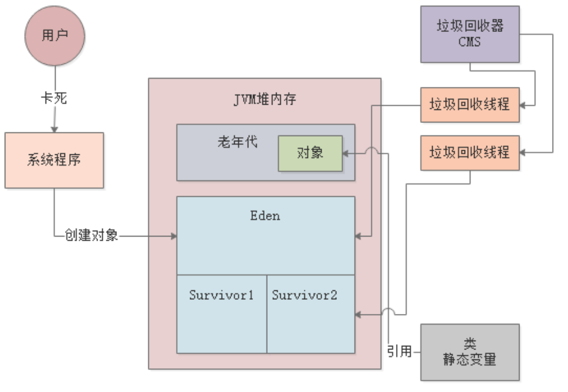


老年代GC非常耗时，无论是CMS还是G1。通常老年代GC要比新生代GC慢十倍以上，所以针对老年代GC的优化还是要先从新生代GC入手，合理分配内存和设置JVM参数，尽量让对象不要频繁进入老年代。


### 三、各种GC分类

在基础篇，我们介绍过各种GC类型，Minor GC、Full GC、Mixed GC、Young GC等等。本节我们就来统一梳理下。


#### 3.1 Minor GC/Young GC

当新生代的Eden区域被占满后，实际就需要触发新生代的GC，这就是所谓的”Minor GC“，也可以称之为”Young GC“。后续章节，我们统一用Young GC指代新生代的GC。

**触发时机：**新生代的Eden区域被占满后。


#### 3.2 Full GC/Old GC

Old GC是仅仅针对老年代区域进行垃圾回收。而Full GC则是针对新生代、老年代、永久代的全体内存空间进行垃圾回收。后续章节，我们统一用Old GC指代老生代的GC。

**触发时机：**老年代空间不够。具体时机可细分为以下几种：

1. 进行Young GC之前：如果老年代的连续可用内存空间 < 新生代历次晋升的平均大小，此时先触发一次Old GC清理老年代，然后再执行Young GC。
2. 进行Young GC之后：如果存活对象要进入老年代，但是老年代的连续可用内存空间 < 存放对象的大小，此时必须触发一次Old GC。
3. 老年代的内存使用率超过了92%，此时也会触发Old GC。


>在很多JVM的实现机制里，当上述几种条件达到时，实际触发的其实是Full GC，这个Full GC会包含Young GC、Old GC和永久代GC。


#### 3.3 Mixed GC

Mixed GC是G1垃圾回收器中特有的概念，在G1中，一旦老年代占据了Java堆内存的45%，就会触发Mixed GC，此时对新生代和老年代都进行垃圾回收。

**触发时机：**G1特有，老年代空间占据到Java堆内存的45%。


#### 3.4 永久代GC

永久代一般存放着类信息、常量池等等。在进行Full GC的时候，会顺带对永久代进行GC，一般来说永久代里的东西是不需要回收的，如果永久代真的满了，回收之后也没腾出足够的空间来，就会抛出OOM异常。


## **JVM实战（14）——Young GC调优**


### 一、简介

本章，我们还是以案例驱动的方式讲解Young GC调优，之前在基础篇中，我们曾通过一个[亿级访问量的的电商系统](https://www.tpvlog.com/article/93)讲解过新生代调优。新生代调优最简单的思路就是扩Survivor区，本章示例的调优思路也是一脉相承。


#### 1.1 案例背景

假设生产环境有一个商户BI系统，用于商户日常经营数据的分析和报表输出，其大致运行逻辑如下：

1. 商户会在业务平台上进行运营，产生各种各样的业务数据；
2. Hadoop、Spark等会对这些业务数据进行计算，然后放入MySQL、HBase之类的存储中；
3. 最后，我们的BI系统会把各种存储好的数据暴露给前端，允许前端基于各种搜索条件筛选和展示。


系统刚上线时，商户数量只有几万家，生产机器配置是4核8G，新生代分配1.5G，Eden区有1G：


#### 1.2 内存使用模型估算


### 二、Young GC调优

根据上述内存使用模型的估算，每秒需加载50MB数据到Eden区，那3分钟左右就会将Eden区占满，触发Young GC。在1G的内存空间中进行Young GC的效率是很高的，基本上10ms左右就可以搞定，所以BI系统每运行几分钟就会出现10ms左右的卡顿，但是对终端用户和系统运行基本没有影响：


#### 2.1 采用大内存

针对这样的业务场景，几万商户数量级基本没有什么影响，但是当商户数量达到百万级以上就会出现问题。所以，最简单的优化思路就是提升机器配置，比如采用16核32G的机器，这样每台机器可以抗几千个请求，部署20~30台就差不多了。

32G内存的机器，新生代分配20G，其中Eden区占16G。此时每秒几千请求的话，大概每秒会加载几百MB数据到Eden区，最多1分钟就会填满Eden区。

此时，Young GC从原来只需回收1G的内存变成了回收16G，速度会慢很多，从商户的体验上看就是每隔1分钟，系统就要卡1s左右：


>卡顿时间过长，会导致大量请求排队，严重时导致系统时不时就出现请求超时的现象。


#### 2.2 采用G1

既然是大内存的机器，其实采用G1才是正确的思路。对G1设置一个合理的预期停顿时间，比如100ms，让G1保证每次Young GC的时候最多停顿100ms，避免影响终端用户的使用。


### 三、总结

本文通过一个示例讲解了Young GC的基本优化思路，在系统内存不是很大的情况下，可以通过提升Eden和Survivor的空间，来容纳更多的新生代对象。但是，当新生代的内存空间太大时，需要考虑每次Young GC的时间成本，传统的ParNew回收器不太适合这种大内存场景，所以**针对大内存机器建议使用G1进行垃圾回收**。

另外，通过本文示例也可以看到，即使Young GC频繁些，但是只要保证每次GC时间很短（控制在几十毫秒内），对系统基本不会有什么影响。


## **JVM实战（15）——Full GC调优**


### 一、简介

本章将会讲解一个频繁Full GC的案例，示例来自于JVM基础篇中的[亿量级计算系统](https://www.tpvlog.com/article/89)。我们先来回顾下案例。


#### 1.1 案例背景

假设现在生产环境有一套“数据计算系统”，不停地从MySQL等各类数据源提取数据到内存中进行计算，系统是分布式的。

每个节点（机器）每分钟执行100次操作（提取数据并计算，每次操作耗时10s），每次操作1万条数据，每条数据大小为1KB左右，每次操作的数据大小就是10MB：


>每台机器的配置是4核8G，JVM分配4G内存，其中新生代1.5G，老年代1.5G。


#### 1.2 内存使用模型估算

每次操作会在Eden区分配10MB对象，以1分钟100次操作来算，那么Eden区1分钟内就会被占满：


### 二、Full GC调优

每个计算任务处理1万条数据耗时10s，假设此时80个计算任务都结束了，还有20个计算任务共计200MB正在计算中，那么此时200MB对象是存活的，不会被Young GC回收掉：


#### 2.1 扩Survivor

由于任何一块Survivor区只有100MB，所以新生代中这存活的200MB对象会晋升到老年代，然后清空Eden：


如此反复，大约经过7分钟后，也就是经历了7次Young GC，此时大概有1.4G对象在老年代中：


再经过1分钟，也就是第8分钟结束时，新生代又满了，此时发现老年代可用空间已经不足（剩余100MB），比历代平均的晋升对象大小（200MB）要小，所以会直接触发一次Full GC。

Full GC会先把老年代的垃圾回收了（假设能全部回收），然后执行一次Young GC，此时Eden区存活的对象会进入老年代：


按照这种情况，每隔8分钟左右就会发生一次Full GC。Full GC的性能是很差的，所以必须进行优化，最基本的优化思路就是扩大Survivor区的内存，比如扩到200MB。这样基本就能避免对象频繁进入老年代，将Full GC频率降低到几个小时一次。


#### 2.2 采用大内存

上述的示例，是假设系统每天的负载是1亿请求，**如果请求量再扩大十倍呢？**

参照首节的内存使用模型来估算，**每秒中会有100MB左右的数据进入Eden，那么Eden会在10s内就被塞满，触发Young GC**。

计算任务本身就耗时10s左右，所以直接后果就是，即使进行了Young GC，可能也只能回收掉几百MB数据。那每隔10s，就有1G左右的数据进入老年代，那下一个10s又来1G数据，就会触发Full GC。最终的结果就是每分钟触发好几次Full GC，对于系统来说就是灾难。

所以，针对这个问题，首先要做的显然就是扩内存，比如换成16核32G的机器，Eden分配16G，Survivor各分配2G。那么按每秒加载100MB数据进内存来算，需要2分钟左右才会触发一次YoungGC，而每次Young GC的存活对象也就是几百MB，Survivor区足够容纳。这就避免了对象频繁进入老年代，触发Full GC。


*那么，针对这种大内存的机器，我们是否需要用G1作为垃圾回收器呢？*

对于本示例中的系统是不需要的，因为这种数据计算系统一般都是离线的，也就是说不和用户直接交互，所以哪怕每隔2分钟进行一次Young GC，每次Young GC耗时1s也没什么影响。


## **JVM实战（16）——模拟Young GC**


### 一、简介

本章，我们将通过示例代码演示Young GC是如何发生的。同时，我们会讲解如何通过JVM参数去配置打印GC日日，然后通过GC日志分析JVM中的GC到底是如何运行的。


#### 1.1 JVM内存参数

我们的示例程序基于JDK1.8，JVM参数如下：
`-XX:NewSize=5242880 -XX:MaxNewSize=5242880 -XX:InitialHeapSize=10485760 -XX:MaxHeapSize=10485760 -XX:SurvivorRatio=8 -XX:PretenureSizeThreshold=10485760 -XX:+UseParNewGC -XX:+UseConcMarkSweepGC`

上述参数中：

- -XX:NewSize=5242880 -XX:MaxNewSize=5242880：新生代大小5MB
- -XX:InitialHeapSize=10485760 -XX:MaxHeapSize=10485760：Java堆内存10MB
- -XX:SurvivorRatio=8：Eden区占4MB，Survivor各占0.5MB
- -XX:PretenureSizeThreshold=10485760：大对象阈值10MB
- -XX:+UseParNewGC -XX:+UseConcMarkSweepGC：新生代使用ParNew，老年代使用CMS


#### 1.2 GC日志参数

我们需要在系统的JVM参数中加入GC日志的打印选型：

- -XX:+PrintGCDetails：打印详细的GC日志
- -XX:+PrintGCTimeStamps：打印每次GC发生的时间
- -Xloggc:gc.log：设置将GC日志写入一个磁盘文件

加入日志参数后，JVM的参数如下：

```shell
-XX:NewSize=5242880 -XX:MaxNewSize=5242880 -XX:InitialHeapSize=10485760 -XX:MaxHeapSize=10485760 -XX:SurvivorRatio=8 -XX:PretenureSizeThreshold=10485760 -XX:+UseParNewGC -XX:+UseConcMarkSweepGC -XX:+PrintGCDetails -XX:+PrintGCTimeStamps -Xloggc:gc.log
```


### 二、示例程序


#### 2.1 程序源码

示例程序代码如下：

```java
public class Demo1 {
    public static void main(String[] args) {
        byte[] array1 = new byte[1024 * 1024];
        array1 = new byte[1024 * 1024];
        array1 = new byte[1024 * 1024];
        array1 = null;

        byte[] array2 = new byte[2 * 1024 * 1024];
    }
}
```


#### 2.2 JVM内存模型

我们根据上述代码来分析下对象是如何在Eden区分配的。

首先，main方法里的第一行代码会为Eden区创建一个1MB的byte数组，第2-3行代码array1局部变量重新赋值引用：


第4行代码`array1=null`，这时之前的3个数组对象都失去了引用：


第5行代码`byte[] array2 = new byte[2 * 1024 * 1024]`，尝试创建一个2MB的对象放入Eden区，但是Eden区已经空间不足了，所以这时就会触发新生代的Young GC。


#### 2.3 程序执行

当使用IDE执行程序时，我们先要进行JVM参数配置，以IDEA为例，配置如下：


运行完成后，工程目录下会出现GC日志文件：gc.log，内容如下：

```shell
Java HotSpot(TM) 64-Bit Server VM (25.111-b14) for windows-amd64 JRE (1.8.0_111-b14), built on Sep 22 2016 19:24:05 by "java_re" with MS VC++ 10.0 (VS2010)
Memory: 4k page, physical 12470176k(6211924k free), swap 14370720k(6127712k free)
CommandLine flags: -XX:InitialHeapSize=10485760 -XX:MaxHeapSize=10485760 -XX:MaxNewSize=5242880 -XX:NewSize=5242880 -XX:OldPLABSize=16 -XX:PretenureSizeThreshold=10485760 -XX:+PrintGC -XX:+PrintGCDetails -XX:+PrintGCTimeStamps -XX:SurvivorRatio=8 -XX:+UseCompressedClassPointers -XX:+UseCompressedOops -XX:+UseConcMarkSweepGC -XX:-UseLargePagesIndividualAllocation -XX:+UseParNewGC 
0.242: [GC (Allocation Failure) 0.242: [ParNew: 4094K->512K(4608K), 0.0018168 secs] 4094K->1696K(9728K), 0.0020491 secs] [Times: user=0.05 sys=0.02, real=0.00 secs] 
Heap
 par new generation   total 4608K, used 3702K [0x00000000ff600000, 0x00000000ffb00000, 0x00000000ffb00000)
  eden space 4096K,  77% used [0x00000000ff600000, 0x00000000ff91d978, 0x00000000ffa00000)
  from space 512K, 100% used [0x00000000ffa80000, 0x00000000ffb00000, 0x00000000ffb00000)
  to   space 512K,   0% used [0x00000000ffa00000, 0x00000000ffa00000, 0x00000000ffa80000)
 concurrent mark-sweep generation total 5120K, used 1184K [0x00000000ffb00000, 0x0000000100000000, 0x0000000100000000)
 Metaspace       used 3484K, capacity 4498K, committed 4864K, reserved 1056768K
  class space    used 387K, capacity 390K, committed 512K, reserved 1048576K

```


### 三、日志分析

本节，我们来分析下上述的gc.log日志。


#### 3.1 GC情况概览

我们先来看下日志中的如下行，这是本次GC情况的概要说明：

```shell
0.242: [GC (Allocation Failure) 0.242: [ParNew: 4094K->512K(4608K), 0.0018168 secs] 4094K->1696K(9728K), 0.0020491 secs] [Times: user=0.05 sys=0.02, real=0.00 secs]
```

**GC (Allocation Failure) ：**说明了为啥发生GC，因为对象分配失败，也就是上述的Eden区空间不足了；

**0.242：**系统运行了0.242秒以后，发生了本次GC；

**ParNew: 4094K->512K(4608K), 0.0018168 secs：**使用ParNew进行新生代的GC，GC前新生代使用了4094K，GC完成后新生代使用了512K，4608K表示年轻代的总空间（Eden+1个Survivor），本次GC耗时0.0018168秒；

**4094K->1696K(9728K), 0.0020491 secs：**Java堆内存的总空间为8728K，GC前使用了4094K，GC后使用了1696K；

**Times: user=0.05 sys=0.02, real=0.00 secs：**本次GC消耗的时间，与元数据区有关，后续讲解。

根据GC日志可以看出，本轮Young GC有512K对象存活下来了，从Eden区转移到了Survivor区：


#### 3.2 JVM退出时堆内存

我们接着看下面的GC日志，这是**JVM退出时当前Java堆内存的使用情况**：

```shell
Heap
 par new generation   total 4608K, used 3702K [0x00000000ff600000, 0x00000000ffb00000, 0x00000000ffb00000)
  eden space 4096K,  77% used [0x00000000ff600000, 0x00000000ff91d978, 0x00000000ffa00000)
  from space 512K, 100% used [0x00000000ffa80000, 0x00000000ffb00000, 0x00000000ffb00000)
  to   space 512K,   0% used [0x00000000ffa00000, 0x00000000ffa00000, 0x00000000ffa80000)
```

**par new generation total 4608K, used 3702K：**ParNew负责的新生代总共有4608K内存，目前使用了3702K；

**eden space 4096K, 77% used：**Eden总共4096K

**from space 512K, 100% used：** From Survivor区使用了100%（存放转移过来的未知存活对象）

**to space 512K, 0% used：**To Survivor区未使用

我们接着看：

```shell
concurrent mark-sweep generation total 5120K, used 1184K [0x00000000ffb00000, 0x0000000100000000, 0x0000000100000000)
Metaspace       used 3484K, capacity 4498K, committed 4864K, reserved 1056768K
class space    used 387K, capacity 390K, committed 512K, reserved 1048576K
```

**concurrent mark-sweep generation total 5120K, used 1184K：**使用CMS管理的老年代总空间为5210K，已使用1184K

**Metaspace used 3484K, capacity 4498K, committed 4864K, reserved 1056768K：**元数据区的空间信息

**class space used 387K, capacity 390K, committed 512K, reserved 1048576K：**Class空间信息

>JDK1.8开始，取消了方法区，取而代之的是Metaspace。Metaspace直接使用本地内存。默认情况下，其大小会根据使用情况动态调整，也可以使用`-XX:MaxMetaspaceSize`来控制最大内存。


## **JVM实战（17）——模拟对象晋升**


### 一、简介

上一章，我们已经进行了一次Young GC日志的分析，本章我们继续结合代码示例做实验，来看看对象是如何从新生代进入老年代的。我们之前讲过新生代对象晋升到老年代的几种场景：

- 躲过15次GC
- 符合动态年龄判断规则
- Young GC后存活对象放不进Survivor
- 大对象直接进入老年代

本章，我们通过示例代码模拟最常见的一种场景——Young GC后存活对象放不进Survivor。


#### 1.1 JVM内存参数

我们的示例程序基于JDK1.8，JVM参数如下：

```shell
-XX:NewSize=10485760 -XX:MaxNewSize=10485760 -XX:InitialHeapSize=20971520 -XX:MaxHeapSize=20971520 -XX:SurvivorRatio=8 -XX:MaxTenuringThreshold=15 -XX:PretenureSizeThreshold=10485760 -XX:+UseParNewGC -XX:+UseConcMarkSweepGC -XX:+PrintGCDetails -XX:+PrintGCTimeStamps -Xloggc:gc.log
```

上述给新生代分配了10MB空间，老年代也是10MB，参数注意两点：

- -XX:PretenureSizeThreshold=10485760：超过10MB的大对象直接进入老年代
- -XX:MaxTenuringThreshold=15：对象年龄到达15时进入老年代


### 二、示例程序


#### 2.1 程序源码

示例程序代码如下：

```java
public class Demo1 {
    public static void main(String[] args) {
        byte[] array1 = new byte[2 * 1024 * 1024];
        array1 = new byte[2 * 1024 * 1024];
        array1 = new byte[2 * 1024 * 1024];

        byte[] array2 = new byte[128 * 1024];
        array2 = null;

        byte[] array3 = new byte[2 * 1024 * 1024];
    }
}

```


#### 2.2 JVM内存模型

我们根据上述代码来分析下内存中的对象分配。首先连续创建了三个2MB的数组对象，将array1指向最后一个数组对象，然后创建了一个128KB的数组，将array2赋null：


注意，Eden区里会有一些“未知对象”，根据[模拟Young GC](https://www.tpvlog.com/article/100)一文中的分析，对象大小在500KB左右，我们后续会通过工具分析这些“未知对象”到底是什么。

然后，执行代码`byte[] array3 = new byte[2 * 1024 * 1024]`，希望在Eden区继续创建一个2MB的数组。显然，Eden区的空间不足了，此时就会触发Young GC。


#### 2.3 程序执行

我们执行程序，得到以下GC日志：

```shell
0.352: [GC (Allocation Failure) 0.353: [ParNew: 8106K->623K(9216K), 0.0021991 secs] 8106K->2673K(19456K), 0.0033689 secs] [Times: user=0.00 sys=0.00, real=0.00 secs] 
Heap
 par new generation   total 9216K, used 2837K [0x00000000fec00000, 0x00000000ff600000, 0x00000000ff600000)
  eden space 8192K,  27% used [0x00000000fec00000, 0x00000000fee297c0, 0x00000000ff400000)
  from space 1024K,  60% used [0x00000000ff500000, 0x00000000ff59be50, 0x00000000ff600000)
  to   space 1024K,   0% used [0x00000000ff400000, 0x00000000ff400000, 0x00000000ff500000)
 concurrent mark-sweep generation total 10240K, used 2050K [0x00000000ff600000, 0x0000000100000000, 0x0000000100000000)
 Metaspace       used 3147K, capacity 4496K, committed 4864K, reserved 1056768K
  class space    used 343K, capacity 388K, committed 512K, reserved 1048576K
```


### 三、日志分析

我们先来看下日志中的下面这行，这是本次GC情况的概要说明：

```shell
0.352: [GC (Allocation Failure) 0.353: [ParNew: 8106K->623K(9216K), 0.0021991 secs] 8106K->2673K(19456K), 0.0033689 secs] [Times: user=0.00 sys=0.00, real=0.00 secs]
```

**ParNew: 8106K->623K(9216K)：**可以看到，本次Young GC后，新生代只剩下了623KB（未知对象）。但是明明array1还引用着一个2MB的数组：


我们注意下Survivor的大小，只有1MB，是容纳不下2MB数组和未知对象的。根据“Young GC后存活对象放不进Survivor会进入老年代”规则，ParNew会将2MB数组转移到老年代，未知对象转移到Survivor：


通过观察GC日志，也印证了这一点：
**from space 1024K, 60% used：**Survivor中有600多KB的数据，就是未知对象；
**concurrent mark-sweep generation total 10240K, used 2050K：**老年代中的2MB对象就是array3引用的数组对象。


### 四、总结

本章通过GC日志分析了一种新生代对象进入老年代的示例，即Young GC后存活对象放不进Survivor，则会进行老年代。
需要注意的是，并不是所有存活对象都会进入老年代，可能会有部分对象留在Survivor区，部分对象进入老年代。


## **JVM实战（18）——模拟Full GC**


### 一、简介

上一章，我们已经进行了一次对象晋升的模拟，本章我们将继续结合代码示例做实验，来看看老年代的GC是如何触发的。


#### 1.1 JVM内存参数

我们的示例程序基于JDK1.8，JVM参数如下：

```shell
-XX:NewSize=10485760 -XX:MaxNewSize=10485760 -XX:InitialHeapSize=20971520 -XX:MaxHeapSize=20971520 -XX:SurvivorRatio=8 -XX:MaxTenuringThreshold=15 -XX:PretenureSizeThreshold=3145728 -XX:+UseParNewGC -XX:+UseConcMarkSweepGC -XX:+PrintGCDetails -XX:+PrintGCTimeStamps -Xloggc:gc.log
```

上述给新生代分配了10MB空间，老年代也是10MB，参数注意一点：

- -XX:PretenureSizeThreshold=3145728：超过3MB的大对象直接进入老年代


### 二、示例程序


#### 2.1 程序源码

示例程序代码如下：

```java
public class Demo1 {
    public static void main(String[] args) {
        byte[] array1 = new byte[4 * 1024 * 1024];
        array1 = null;

        byte[] array2 = new byte[2 * 1024 * 1024];
        byte[] array3 = new byte[2 * 1024 * 1024];
        byte[] array4 = new byte[2 * 1024 * 1024];
        byte[] array5 = new byte[128 * 1024];

        byte[] array6 = new byte[2 * 1024 * 1024];
    }
}

```


#### 2.2 JVM内存模型

我们根据上述代码来分析下内存中的对象分配。首先创建4MB的数组对象，由于超过大对象阈值3MB，所以直接进入老年代：


接着array1失去引用，然后在Eden区分配3个2MB数组和1个128KB数组：

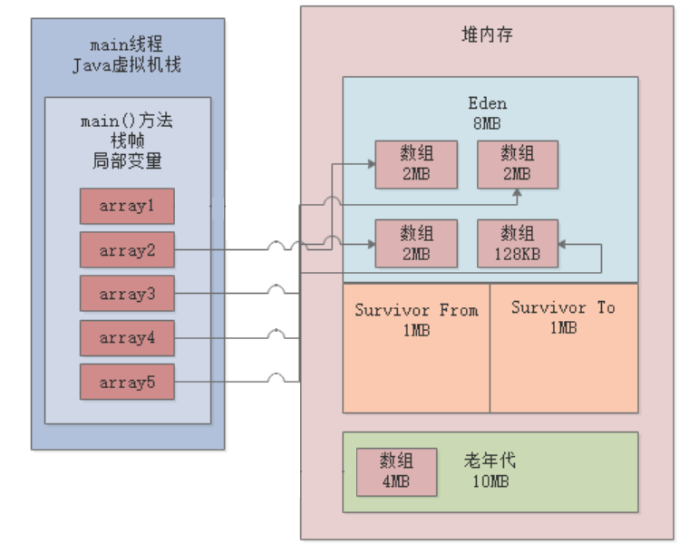

然后，执行代码`byte[] array6 = new byte[2 * 1024 * 1024]`，希望在Eden区继续创建一个2MB的数组。显然，Eden区的空间不足了，此时即将触发Young GC。


#### 2.3 程序执行

我们执行程序，得到以下GC日志：

```shell
0.260: [GC (Allocation Failure) 0.261: [ParNew (promotion failed): 8142K->8797K(9216K), 0.0035404 secs]0.264: [CMS: 8194K->6772K(10240K), 0.0064863 secs] 12238K->6772K(19456K), [Metaspace: 3227K->3227K(1056768K)], 0.0103195 secs] [Times: user=0.01 sys=0.00, real=0.01 secs] 
0.272: [GC (CMS Initial Mark) [1 CMS-initial-mark: 6772K(10240K)] 9112K(19456K), 0.0004078 secs] [Times: user=0.00 sys=0.00, real=0.00 secs] 
0.273: [CMS-concurrent-mark-start]
0.274: [CMS-concurrent-mark: 0.001/0.001 secs] [Times: user=0.00 sys=0.00, real=0.00 secs] 
0.274: [CMS-concurrent-preclean-start]
0.274: [CMS-concurrent-preclean: 0.000/0.000 secs] [Times: user=0.00 sys=0.00, real=0.00 secs] 
0.274: [CMS-concurrent-abortable-preclean-start]
Heap
 par new generation   total 9216K, used 2422K [0x00000000fec00000, 0x00000000ff600000, 0x00000000ff600000)
  eden space 8192K,  29% used [0x00000000fec00000, 0x00000000fee5d898, 0x00000000ff400000)
  from space 1024K,   0% used [0x00000000ff500000, 0x00000000ff500000, 0x00000000ff600000)
  to   space 1024K,   0% used [0x00000000ff400000, 0x00000000ff400000, 0x00000000ff500000)
 concurrent mark-sweep generation total 10240K, used 6772K [0x00000000ff600000, 0x0000000100000000, 0x0000000100000000)
 Metaspace       used 3233K, capacity 4496K, committed 4864K, reserved 1056768K
  class space    used 350K, capacity 388K, committed 512K, reserved 1048576K

```


### 三、日志分析

我们先来看下日志中的下面这行，这是本轮GC情况的概要说明：

```shell
0.260: [GC (Allocation Failure) 0.261: [ParNew (promotion failed): 8142K->8797K(9216K), 0.0035404 secs]0.264: [CMS: 8194K->6772K(10240K), 0.0064863 secs] 12238K->6772K(19456K), [Metaspace: 3227K->3227K(1056768K)], 0.0103195 secs] [Times: user=0.01 sys=0.00, real=0.01 secs]

```

**ParNew (promotion failed): 8142K->8797K(9216K), 0.0035404 secs：**：这行表明ParNew首先进行了一次Young GC，但是发现Eden区内的对象全部被引用着，一个都回收不掉。于是会尝试将存活对象转移到Survivor，是Survivor空间不足，所以又会尝试转移到老年代，但是老年代可用空间也只有6MB，容纳不了3个2MB和1个128KB数组，所以就会触发下面的Full GC。

**[CMS: 8194K->6772K(10240K), 0.0064863 secs] 12238K->6772K(19456K), [Metaspace: 3227K->3227K(1056768K)], 0.0103195 secs：**从这里可以看到，CMS垃圾回收器执行了Full GC，Full GC会对老年代进行Old GC，并是和上面的Young GC关联的，同时还会对元数据区（永久代）进行回收。

因为，老年代虽然容纳不了全部3个2MB数组和1个128KB数组，但是可以容纳2个2MB数组，所以会先将这两个2MB数组对象转移到老年代：


然后，发现剩下的一个2MB数组和128KB数组实在放不下了，就会进行一次Old GC（[CMS: 8194K->6772K(10240K), 0.0064863 secs] ），可以看到老年代空间最终变成了6772KB。

因为CMS进行Old GC时先对老年代清理，回收掉没有引用的那个4MB数组，然后将新生代中的2MB数组和128KB数组转移到老年代：


最后，Full GC完毕后，`byte[] array6 = new byte[2 * 1024 * 1024]`这行代码对应的2MB数组被成功分配到Eden区：


### 四、总结

本章通过GC日志分析了一个触发老年代GC的案例，即新生代存活对象太多，放不进Survivor区，同时也放不进老年代，此时就会触发CMS的Full GC。
当然，触发老年代GC的另一种情况就是：当老年代内存占用达到一定的比例，通过 `-XX:CMSInitiatingOccupancyFaction`参数可以设置这个比例，JDK1.6中默认是92%。


## **JM实战（20）——jstat实战（1）**


### 一、简介

本章和下一章，我们将通过之前讲过的两个案例，看看如何在生产环境下使用jstat对JVM运行情况进行分析。我们先来回顾下[商户BI系统](https://www.tpvlog.com/article/98)。

#### 1.1 案例背景

假设生产环境有一个商户BI系统，用于商户日常经营数据的分析和报表输出，其大致运行逻辑如下：

1. 商户会在业务平台上进行运营，产生各种各样的业务数据；
2. Hadoop、Spark等会对这些业务数据进行计算，然后放入MySQL、HBase之类的存储中；
3. 最后，我们的BI系统会把各种存储好的数据暴露给前端，允许前端基于各种搜索条件筛选和展示。

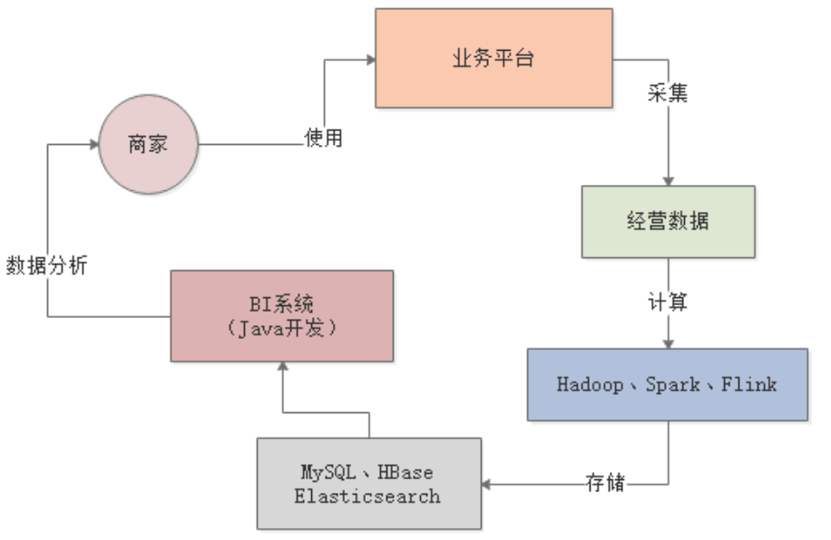


系统刚上线时，商户数量只有几万家，生产机器配置是4核8G，新生代分配1.5G，Eden区有1G：


#### 1.2 内存使用模型估算

每个商户的主页，前端每隔几秒钟就会发送一个请求给BI系统，用于生成一种实时报表。每台机器差不多每秒抗500个请求，由于报表需要的数据量比较大，一般每个请求需要加载约100KB的数据到内存中，每秒500个请求总共就是50MB数据，每次Young GC过后存活对象也就几十MB：

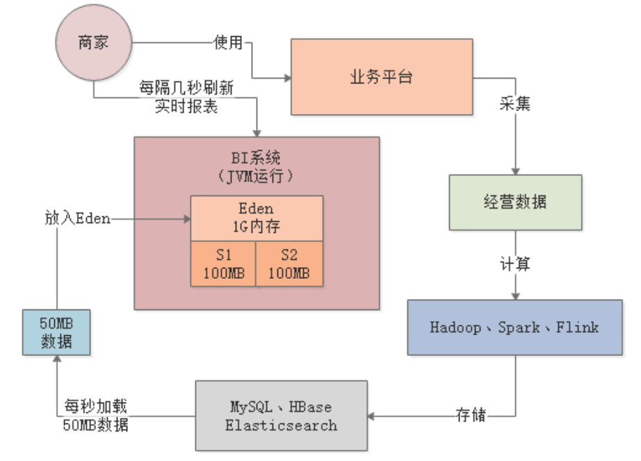


根据上述内存使用模型的估算，每秒需加载50MB数据到Eden区，那3分钟左右就会将Eden区占满，触发Young GC。在1G的内存空间中进行Young GC的效率是很高的，基本上10ms左右就可以搞定，所以BI系统**每运行几分钟就会出现10ms左右的卡顿**，但是对终端用户和系统运行基本没有影响：


### 二、代码示例

我们通过一段代码来模拟下上述情况，先来看下JVM参数配置。


#### 2.1 JVM内存参数

```shell
-XX:NewSize=104857600 -XX:MaxNewSize=104857600 -XX:InitialHeapSize=209715200 -XX:MaxHeapSize=209715200 -XX:SurvivorRatio=8 -XX:MaxTenuringThreshold=15 -XX:PretenureSizeThreshold=3145728 -XX:+UseParNewGC -XX:+UseConcMarkSweepGC -XX:+PrintGCDetails -XX:+PrintGCTimeStamps -Xloggc:gc.log
```

上述，我们把Java堆内存设置为200MB，其中年轻代100MB，Eden占80MB，Survivor各占10MB，老年代100MB。


#### 2.2 程序源码

```java
public class Demo1 {
    public static void main(String[] args) throws InterruptedException {
        Thread.sleep(30000);     // main线程休眠30s，以便jstat命令通过PID观察
        while (true) {
            loadData();
        }
    }
    private static void loadData() throws InterruptedException {
        byte[] data = null;
        for (int i = 0; i < 50; i++) {
            data = new byte[100 * 1024];    // 100KB
        }
        data = null;
        Thread.sleep(1000);         // 模拟上述操作全部发生在1s内
    }
}

```

上述程序代码中，`while(true)`用来模拟每秒50次请求，每次请求加载100KB数据，也就是每秒5MB数据。


#### 2.3 jstat分析

当我们启动程序后，main线程会阻塞30s，此时我们可以先通过`jps`命令查找当前JVM的进程ID——2236：


然后在30s内执行下述命令，统计JVM状态，每隔1s打印一次，共打印1000次：
`jstat -gc 2236 1000 1000`


我们来看下输出结果：

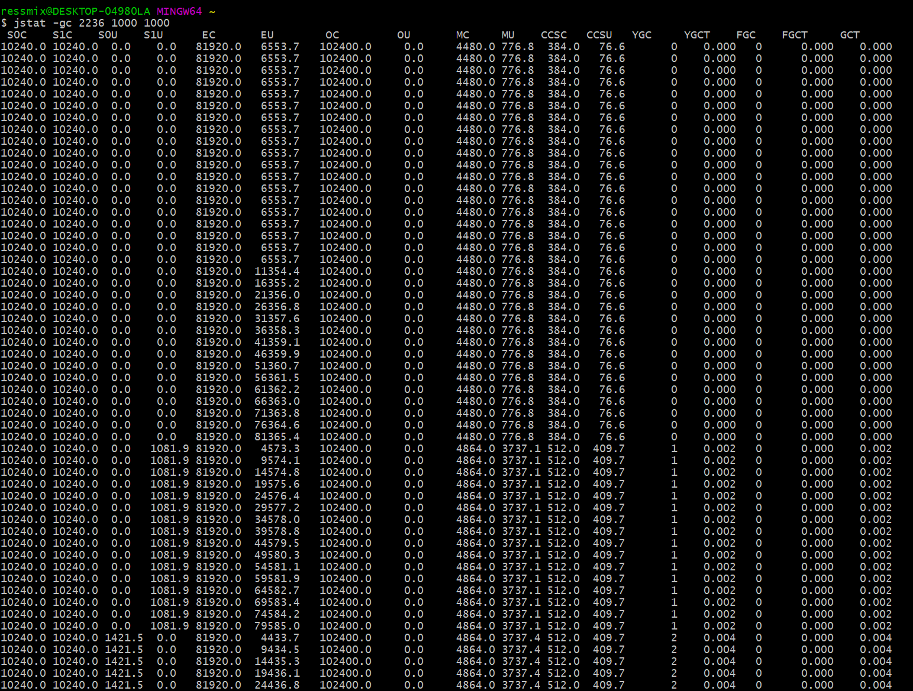

首先，看下**EU**那列，表示Eden区的内存使用情况，刚开始一直都是6MB多的使用量，此时main线程还在阻塞中：


之后，线程恢复运行，Eden区的使用空间每秒钟都在增长，根据差值计算大概就是每秒5MB，与我们的代码逻辑吻合：


当Eden区使用接近80MB时，再要分配就失败了，此时触发了一次Young GC，Eden区的使用空间降低到4573.3KB：


针对上述示例，我们可以通过jstat命令清晰的看出，新生代对象增速为5MB/s左右，大约十几秒就会触发一次Young GC，每次Young GC回收大约70MB空间，耗时2ms，所以Young GC的速度是很快的，即使回收800MB空间，也就耗时10ms左右。


### 三、总结

本章，我们通过jstat命令分析了BI系统中新生代对象的GC情况。通过jstat命令，我们清晰的看到虽然系统每隔十几秒就会进行一次Young GC，但是Young GC耗时很小，而且没有存活对象进入老年代，所以系统运行的效率还是挺高的。


## **JVM实战（21）——jstat实战（2）**


### 一、简介

上一章，我们通过jstat命令分析了BI系统中新生代对象的GC情况，也就是Young GC。本章，我们再来通过jstat命令分析下Full GC的情况。

#### 1.1 案例背景

假设现在生产环境有一套“数据计算系统”，不停地从MySQL等各类数据源提取数据到内存中进行计算，系统是分布式的。

每个节点（机器）每分钟执行100次操作（提取数据并计算，每次操作耗时10s），每次操作1万条数据，每条数据大小为1KB左右，那么每次操作的数据大小就是10MB：


>每台机器的配置是4核8G，JVM分配4G内存，其中新生代1.5G，老年代1.5G。


#### 1.2 内存使用模型估算

每次操作会在Eden区分配10MB对象，以1分钟100次操作来算，那么**Eden区1分钟内就会被占满**：


每个计算任务处理1万条数据耗时10s，假设此时80个计算任务都结束了，还有20个计算任务共计200MB正在计算中，那么此时**200MB对象是存活的**，不会被Young GC回收掉：


由于任何一块Survivor区只有100MB，所以新生代中这存活的200MB对象会晋升到老年代，然后清空Eden：


如此反复，大约经过7分钟后，也就是经历了7次Young GC，此时大概有1.4G对象在老年代中：


再经过1分钟，也就是第8分钟结束时，新生代又满了，此时发现老年代可用空间已经不足（剩余100MB），比历代平均的晋升对象大小（200MB）要小，所以会直接触发一次Full GC。

Full GC会先把老年代的垃圾回收了（假设能全部回收），然后执行一次Young GC，此时Eden区存活的对象会进入老年代：


按照这种情况，**每隔8分钟左右就会发生一次Full GC**。Full GC的性能是很差的，所以必须进行优化，最基本的优化思路就是扩大Survivor区的内存，比如扩到200MB。这样基本就能避免对象频繁进入老年代，将Full GC频率降低到几个小时一次。


### 二、代码示例

我们通过一段代码来模拟下上述情况，先来看下JVM参数配置。


#### 2.1 JVM内存参数

```shell
-XX:NewSize=104857600 -XX:MaxNewSize=104857600 -XX:InitialHeapSize=209715200 -XX:MaxHeapSize=209715200 -XX:SurvivorRatio=8 -XX:MaxTenuringThreshold=15 -XX:PretenureSizeThreshold=20971520 -XX:+UseParNewGC -XX:+UseConcMarkSweepGC -XX:+PrintGCDetails -XX:+PrintGCTimeStamps -Xloggc:gc.log
```

上述，我们把Java堆内存设置为200MB，其中年轻代100MB，Eden占80MB，Survivor各占10MB，老年代100MB，大对象阈值为20MB。


#### 2.2 程序源码

```java
public class Demo1 {
    public static void main(String[] args) throws InterruptedException {
        Thread.sleep(30000);     // main线程休眠30s，以便jstat命令通过PID观察

        while (true) {
            loadData();
        }
    }

    private static void loadData() throws InterruptedException {
        byte[] data = null;
        for (int i = 0; i < 4; i++) {
            data = new byte[10 * 1024 * 1024];    // 10MB
        }
        data = null;

        byte[] data1 = new byte[10 * 1024 * 1024];
        byte[] data2 = new byte[10 * 1024 * 1024];

        byte[] data3 = new byte[10 * 1024 * 1024];
        data3 = new byte[10 * 1024 * 1024];

        Thread.sleep(1000);         // 模拟上述操作全部发生在1s内
    }
}

```

上述程序代码中，每秒都会执行一次`loadData()`，它会首先分配4个10MB数组对象，但是立马变成垃圾；然后会有data1和data2两个10MB的数组对象被创建并一直被引用；最后，data3指向两个新创建的10MB数组对象。

总之，`loadData()`的目的就是为了模拟1s内创建接近80MB对象，触发Young GC的。


#### 2.3 jstat分析


当我们启动程序后，main线程会阻塞30s，此时我们可以先通过`jps`命令查找当前JVM的进程ID——13740：


然后在30s内执行下述命令，统计JVM状态，每隔1s打印一次，共打印1000次：
`jstat -gc 13740 1000 1000`

我们来看下输出结果：


首先，看下**EU**那列，表示Eden区的内存使用情况，刚开始一直都是6MB多的使用量，此时main线程还在阻塞中，当main线程恢复后，1秒钟就发生一次Young GC，因为Eden区只有80MB。

通过**OU**列，明显可以看到老年代新增了30MB对象，这就是程序中data1、data2、data3引用的存活对象，因为Eden区放不下，所以触发了Young GC，然后又发现存活对象在Survivor区也放不下，所以将转移到了老年代：

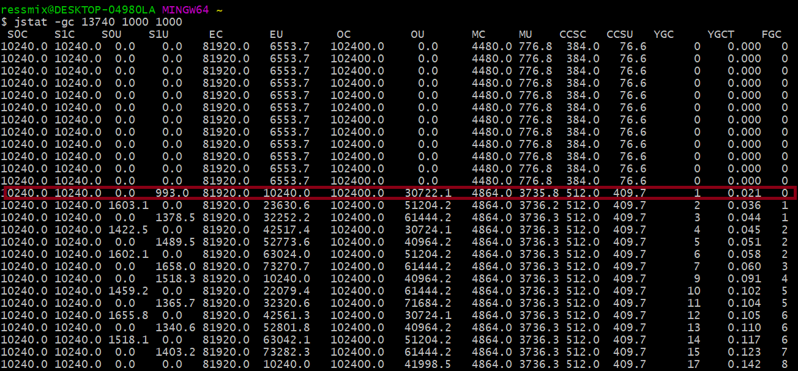

可以看到，Young GC和Full GC都特别频繁，Full GC几乎两三秒就会出现一次，而且从耗时看，Full GC平均耗时2ms左右，但是Young GC竟然又7ms，比Full GC还高：


因为上述的每次Full GC都是由Young GC的，Young GC时发现存活对象放不进Survivor，先尝试转移到老年代，但当老年代空间也不足时就会联动触发Full GC，必须等到Full GC完成后，才能将存活对象转移过去，Young GC才算完成。


### 三、优化

我们来对上述示例进行下优化，主要就是调整Survivor区的大小：

```shell
-XX:NewSize=209715200 -XX:MaxNewSize=209715200 -XX:InitialHeapSize=314572800 -XX:MaxHeapSize=314572800 -XX:SurvivorRatio=2 -XX:MaxTenuringThreshold=15 -XX:PretenureSizeThreshold=20971520 -XX:+UseParNewGC -XX:+UseConcMarkSweepGC -XX:+PrintGCDetails -XX:+PrintGCTimeStamps -Xloggc:gc.log
```

上述JVM参数，我们把Java堆内存调整为300MB，新生代占200MB，其中Eden区100MB，Survivor区各50MB，老年代100MB。


#### 3.1 jstat分析

我们根据上述JVM参数再重新运行程序，输出结果如下：


可以看到，Young GC频率每秒1次，每次存活对象大小约20MB，Survivor区足够容纳，所以没有触发过Full GC。而且15次Young GC耗时才120ms，也就是平均每次8ms，所以对系统的运行几乎没有影响。


### 四、总结

本章，我们通过一个示例引出频繁Full GC的问题，并通过jstat命令观察JVM运行情况，然后对JVM进行调优，最后再通过jstat观察优化后的JVM运行情况，将系统的运行效率提升了，避免了频繁Full GC。

通过本章和前一章的两个示例，相信读者已经掌握了jstat的核心用法。从下一章开始，我们会用一系列的真实生产案例还原出各种不同的JVM优化场景，帮助大家强化对JVM性能问题进行分析和处理的能力。


## **JVM实战（22）——jamp和MAT实战**


### 一、简介

我们通过jstat进行分析，发现Full GC非常频繁，基本上每隔两分钟就会执行一次，而且每次Full GC的时间长达10秒。

#### 1.1 案例背景

系统的JVM内存模型如下，当时给Java堆内存分配了20G，其中年轻代10G，老年代10G：


事实上，虽然分配了那么大的内存空间给年轻代和老年代，但是通过jstat分析发现，Eden区大概1分钟就会被占满，然后触发一次Young GC，而且Young GC过后有几个G的对象都会存活并进入老年代：


这说明系统代码运行时会产生大量对象，经常在1分钟过后就塞满Eden，然后会触发Young GC，但是由于程序处理极慢，导致大量存活对象Survivor区无法容纳，从而进入老年代。

由于老年代的内存有10GB，所以在没有采用G1的情况下，一次Full GC的回收速度很慢，长达10s，这就直接导致了工作线程无法正常运行，对于用户来说就是系统卡死。


### 二、JVM优化

#### 2.1 优化思路

通过上述分析，我们可以判断一定是程序代码的某处在不断生成各种对象，导致系统加载过多数据到内存中。所以，要对这个案例进行优化，就必须分析到底是程序哪里在源源不断地创建对象。

我们可以先通过jmap生成一个JVM内存快照文件，然后通过MAT进行分析。下面我们通过一段示例代码来排查：

```JAVA
public class Demo1{
    public static void main(String[] args){
        List<Data> datas = new ArrayList<>();
        for(int i=0; i<10000; i++){
            datas.add(new Data());
        }
        Thread.sleep(1 * 60 * 60 * 1000);
    }
}
```

#### 2.2 生成JVM内存快照

首先执行上述这段程序，通过`jps`获取JVM进程ID——1177：


然后执行jmap命令导出JVM内存快照：
`jmap -dump:live,format=b,file=dump.hprof 1177`


#### 2.3 MAT分析

线上dump出来的内存快照一般都有几个G，比如我们上述的程序就有8个多G的内存快照，所以运行MAT时，务必将`MemoryAnalyzer.ini`中的启动堆大小设置为8G以上：


启动MAT后，选择“Leak Suspects”，也就是内存泄漏分析，接着我们会看到下面的图：


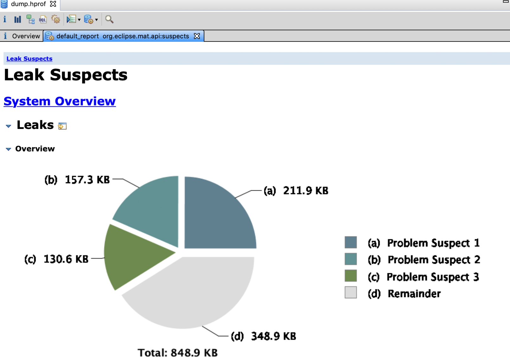


“Problem Suspect1”告诉我们：main线程通过局部变量引用占据内存24.97%的对象，而且占据内存的是一个`java.lang.Object[]`数组。

我们可以通过“Detail”链接进去查看这个数组到底是什么，通过这个详细说明，我们可以看到mian线程中引用的是一个`java.util.ArrayList`，里面的每个元素都是`Demo1$Data`对象：


然后，知道了这些不断创建的对象是什么后，我们还希望知道程序是在哪段代码创建了这些对象。如下图所示，先点击页面中的“See stacktrace”链接，就会进入一个线程执行代码堆栈的调用链：


可以看到，问题定位到了Demo1类的main方法内的第12行，最终发现是这个线程执行了`String.split()`方法导致产生了大量的对象。


#### 2.4 问题解决

*为什么String.split()方法会造成内存泄漏呢？*

在JDK1.6以前，`String.split()`方法对于“Hello World Ressmix”这种字符串，底层是基于一个数组来存放的，比如[H,e,l,l,o, ,W,o,r,l,d, ,R,e,s,s,m,i,x]，当基于空格切割时，比如“Hello”，不会存到一个新的数组中，而是采用偏移量来表明是对应原数组中的那一段。

但是JDK1.7以后，每个切割出来的子字符串都对应一个全新的数组。

所以，上述案例中程序的问题就是加载了大量数据出来，可能一次几十万条，然后通过split对这些字符串进行切割，导致字符串数组对象暴增几十倍，这就是为什么系统会频繁产生大量对象的原因。

解决方案就是对`String.split()`处的代码进行优化，避免同时加载大量数据并进行切割。


### 三、总结

本章通过一个内存泄漏的案例，讲解了分析此类问题的思路和解决方法。jmap和MAT经常组合在一起使用，用于线上问题此类的排查。


## **JVM实战（23）——内存碎片优化**


### 一、案例背景

本案例的背景是一个高峰期每秒十万QPS的社交APP，这类APP流量最大的模块就是个人主页模块，会有大量的用户在一个集中的时间段内（比如晚上）频繁访问各种个人主页数据，而且个人主页的数据量通常比较大，在几MB左右：


#### 1.1 存在问题

上述案例，由于高峰期的每秒并发量太高，所以新生代的Eden区会被迅速占满，频发触发Young GC。而在Young GC的时候，下一秒的请求又来了，导致很多请求是还没来得及处理完的，导致每次Young GC的时候很多对象需要存活下来，因此在高峰期经常会出现存活对象太多，导致Survivor区放不下的问题：


所以，此时就会有大量对象频繁进入老年代，从而频繁触发老年代的GC：


### 二、内存碎片


#### 2.1 优化前

我们先来看下系统优化前的一些关键JVM参数：
`-XX:UseCMSCompactAtFullCollection -XX:CMSFullGCsBeforeCompaction=5`

上述采用CMS对老年代进行垃圾回收，默认为标记-清除算法，所以每次GC后都会出现许多内存碎片。
我们来看下整个流程，首先老年代中有许多垃圾对象：


CMS回收掉一些垃圾对象后，就会出现内存碎片，由于`-XX:CMSFullGCsBeforeCompaction=5`，所以5次Full GC之后才会进行内存碎片整理：


但是，大家考虑一个场景，一次Full GC之后，老年代中有一部分内存里都是大量的内存碎片，只有部分可用的连续空间。这时候，随着大量对象进入老年代，一旦连续可用空间不足以容纳这些对象，就会导致立马触发下一次Full GC。

这样，随着一次次Full GC，导致老年代产生更多的内存碎片，触发下一次Full GC的速度也会越来越快，直到5次Full GC之后才会去整理内存碎片。


#### 2.2 优化后

这个案例的优化，其实非常简单。首先，可以用`jstat`分析下JVM的运行情况，判断出每次Young GC后存活对象的大小，然后增加Survivor区的大小，避免存活对象频繁进入老年代。

另外，优化后部分对象还是慢慢会进入老年代，毕竟系统的负载很高，所以调优后每小时还是会有一次Full GC。

所以，第二个优化点就是**针对CMS内存碎片问题进行优化**。在降低了Full GC的频率后，务必设置以下参数，使得每次Full GC后都进行内存碎片整理：
`-XX:UseCMSCompactAtFullCollection -XX:CMSFullGCsBeforeCompaction=0`

这样虽然每次Full GC的内存碎片整理需要消耗更多的时间，但是跟频繁Full GC的时间消耗相比，效率会提升很多。


### 三、总结

本章，我们通过示例分析了频繁Full GC导致的内存碎片问题，通过参数`-XX:CMSFullGCsBeforeCompaction`可以配置内存碎片整理的次数，从而提升系统的运行效率。


## **JVM实战（24）——大对象优化**


### 一、案例背景

本章将介绍一个因为大对象而导致的频繁GC问题，其本质也是开发童鞋在写程序代码时存在bug，进而导致出现JVM性能问题。

首先，这个系统上线之后发现一天的Full GC次数多达几十次，通常来说，我们建议的一个比较良好的JVM性能，应该是Full GC几天才发生一次，或者最多一天发生几次而已。

生产环境这个系统部署在2核4G的机器上，JVM参数如下：
`-Xms=1536M -Xmx=1536M -Xmn=512M -Xss=256K -XX:SurvivorRatio=5 -XX:+UseParNewGC -XX:+UseConcMarkSweepGC -XX:CMSInitiatingOccupancyFraction=68 -XX:CMSParallelRemarkEnable -XX:UseCMSInitiatingOccupancyOnly -XX:+PrintGCDetails -XX:+PrintGCTimeStamps -XX:PrintHeapAtGC -Xloggc:gc.log`

比较关键的几个设置是：

- -XX:SurvivorRatio=5：表示Eden:Survivor:Survivor=5:1:1
- -XX:CMSInitiatingOccupancyFraction=68：表示一旦老年代内存使用达到68%，就会触发Full GC

此时，整个系统对应的JVM内存模型如下：


#### 1.1 存在问题


我们通过jstat进行分析，统计出的JVM性能如下：

- 系统运行时间：6天
- 6天内的Full GC次数和总耗时：250次，70秒
- 6天内的Young GC次数和总耗时：26000次，1400秒

也就是说，平均每20s触发一次Young GC，每30分钟触发一次Full GC。根据Eden区和老年代的空间可以估算，系统每秒钟会产生约20MB对象进入Eden，每30分钟会有约600MB对象进入老年代：

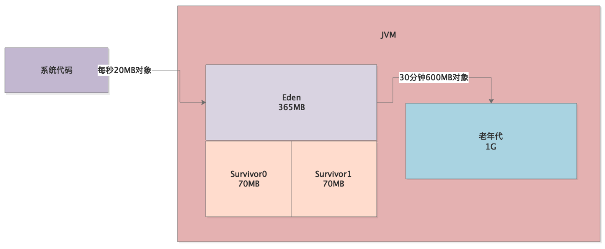

根据参数`-XX:CMSInitiatingOccupancyFraction=68`，老年代内存使用达到68%，就会触发Full GC，一次Full GC时间约300ms。


### 二、大对象 

#### 2.1 优化前

通过上述的案例背景介绍，我们首先想到的是会不会因为Survivor区太小，导致Young GC后的存活对象太多，放不下Survivor了，所以就一直有对象流入老年代，进而导致30分钟后触发Full GC？

但这只是推论，因为对象进入老年代也可能是因为动态年龄判断规则，所以我们就需要通过工具在高峰期观察JVM的内存使用情况。

事实上，我们观察到每次 Young GC后进入老年代的对象非常少，而且一次Young GC的存活对象也就是几十MB，Survior区可以容纳，偶尔触发动态年龄判断规则时，才有几十MB对象进入老年代：

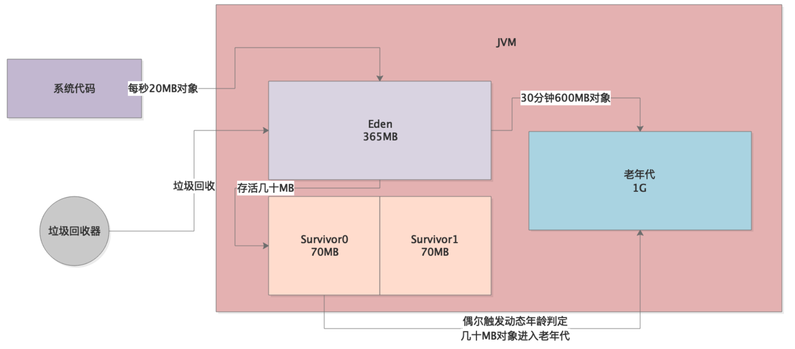

因此，分析到这里就很奇怪了，因为通过jstat追踪，并不是每次Young GC后都有几十MB对象进入老年代，而是偶尔才有对象进入老年代，记住，是偶尔。

*那么老年代里面到底为什么会有那么多对象呢？*

我们观察发现，**系统运行一段时间后，突然间老年代中的对象就会增加五六百MB**。

答案已经很明显了——**大对象**！一定是系统运行时，每隔一段时间就会产生几百兆的大对象，直接进入老年代，不会走年轻代的Eden区，然后配合年轻代还偶尔会有几十MB对象进入老年代，所以才30分钟触发一次Full GC：

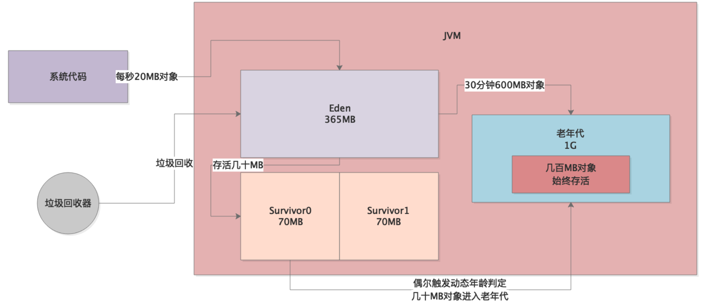


#### 2.2 优化后

了解了问题的所在，我们就开始针对这个案例进行优化。首先，就是要确定这个大对象到底是什么？

我们采用jmap工具导出一份JVM内存快照，然后通过jhat或者Visual VM之类的可视化工具进行分析，发现那几百兆大对象就是从数据库中查出的记录，然后对SQL进行排查，发现某个SQL在一种特殊场景下会执行类似`SELECT * FROM`的语句，导致一次性从数据库中查出几十万条数据。

针对该问题，主要做以下几点优化：

1. 解决程序bug，不允许全表查询，这样就避免了大对象直接进入老年代的问题；
2. Survivor区明显不够，70MB的空间很容易触发动态年龄判断，所以为其分配更多空间。

优化后的JVM参数如下：

```shell
-Xms=1536M -Xmx=1536M -Xmn=1024M -Xss=256K -XX:SurvivorRatio=5 -XX:PermSize=256M -XX:MaxPermSize=256M -XX:+UseParNewGC -XX:+UseConcMarkSweepGC -XX:CMSInitiatingOccupancyFraction=92 -XX:CMSParallelRemarkEnable -XX:UseCMSInitiatingOccupancyOnly -XX:+PrintGCDetails -XX:+PrintGCTimeStamps -XX:PrintHeapAtGC -Xloggc:gc.log
```

可以看到，新生代直接分配1G空间，其中Survivor各占150MB左右，此时Young GC过后的几十MB存活对象一般就不会进入老年代了。

同时，调整参数`-XX:CMSInitiatingOccupancyFraction=92`，将比例提高至92%，避免老年代仅占62%就触发Full GC。

最后，还设置永久代大小为256MB，因为默认永久代就几十MB，如果程序使用了反射等机制，很容
易被占满。

经过上述优化，系统基本上每分钟一次Young GC，几天才会发生一个Full GC。


### 三、总结

本章，我们通过示例分析了大对象导致的频繁Full GC问题，并一步一步展现了发现问题、分析问题、解决问题的思路。当我们发现Young GC过后并不是每次都有很多存活对象进入老年代的时候，就要从别的角度考虑下到底为什么会有那么多存活对象进入老年代。


## **JVM实战（25）——元数据区优化**


### 一、案例背景

本章介绍的案例比较特殊，是由于人为设置JVM参数错误，而导致的JVM性能问题。

首先，生产环境有一个新上线的系统，频繁触发Full GC告警。通过GC日志，我们发现日志中有大量以下字样：
`【Full GC(Metadata GC Threshold) xxxxx,xxxxx】`

从这里就知道，频繁的Full GC是因为Metadata区域（JDK1.8+）被占满。


#### 1.1 存在问题

Metadata区域，也就是元数据区，一般存放着类信息，为什么会被频繁占满，进而触发Full GC呢？我们通过工具分析元数据区的内存占用情况，发现元数据区域的内存使用波动曲线类似于下面这样：


也就是说，元数据区的内存占用不断增加，当达到一个顶点后（快占满）就会触发Full GC，Full GC会对元数据区域进行垃圾回收，所以接下来元数据区的内存占用就又变小了。


### 二、元数据区占满

#### 2.1 优化前

通过上述的案例背景介绍，已经可以很明显的看出，系统的问题就是**不断有新的类被加载到元数据区，导致不断地触发Full GC**：

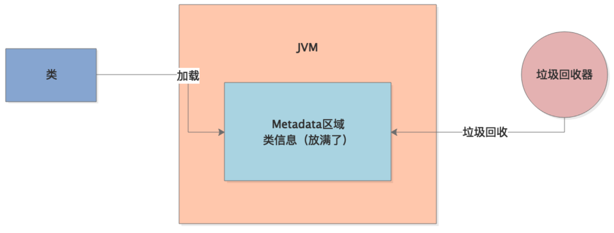

*那到底是什么类在不断地被加载呢？*

我们可以通过在JVM启动参数中加上以下配置，然后观察GC日志：
`-XX:TraceClassLoading -XX:TraceClassUnloading`

这两个参数，用来追踪类加载和类卸载的情况，GC日志中会打印出JVM加载了哪些类、卸载了哪些类：
`【Loaded sun.reflect.GeneratedSerializationConstructorAccessor from _JVM_Defined_Class】`

可以看到，JVM在运行期间不断地加载了大量的“GeneratedSerializationConstructorAccessor”类到元数据区，这些类是在程序中使用Java的反射时加载的，比如像下面这样：

```java
Method method = XXX.class.getDeclaredMethod(xxx, xxx);
method.invoke(target, params);
```

**在执行这类反射代码时，JVM会动态生成一些类放入元数据区：**


***那 JVM又为什么会不停的创建这些类对象呢？***

首先，我们要明白Class对象都是SoftRefence（软引用），软引用在正常情况下不会被回收。JVM在GC时判断是否回收软引用对象时，采用了一个公式：
$$
clock-timestamp ≤ freespace * SoftRefLRUPolicyMSPerMB
$$
这个公式的意思是说：clock-timestamp表示对象最近一次被访问距当前的时间差，freespace表示JVM中的空闲内存大小，SoftRefLRUPolicyMSPerMB表示每1MB空间可以允许SoftReference对象存活多久。

举个例子，假如JVM中的空闲内存大小为3000MB，SoftRefLRUPolicyMSPerMB设置为1000ms，那么Class对象就可以存活：3000*1000=3000秒，也就是50分钟。

SoftRefLRUPolicyMSPerMB可以通过JVM启动参数配置，在上述案例中，这个值被配置成了0，于是freespace * SoftRefLRUPolicyMSPerMB=0。这就导致程序通过反射创建出Class对象后，立马被回收了，接着JVM在反射代码的执行过程中，继续创建这种反射代理类，在JVM的机制下，这种类对象会越来越多，直到将元数据区占满。

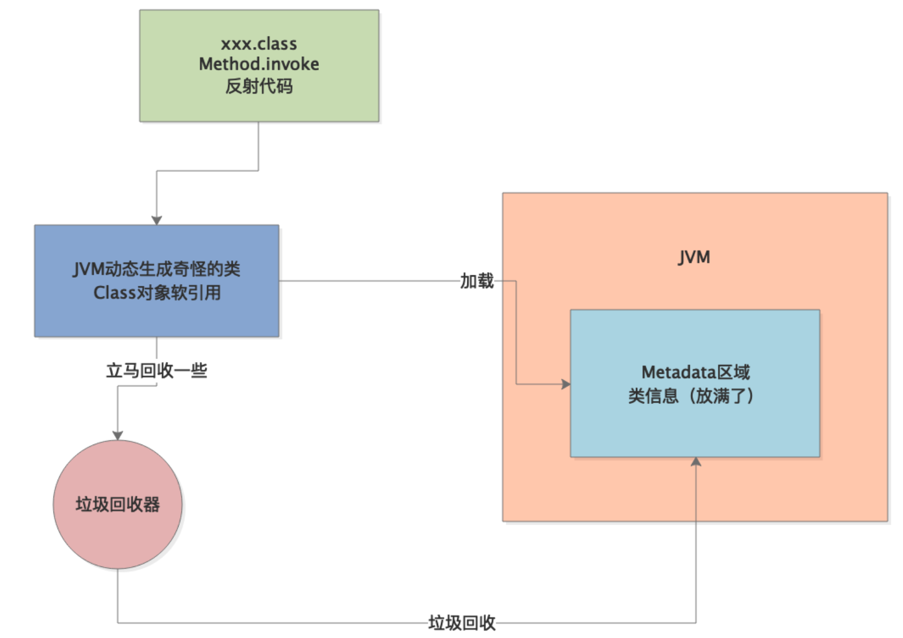


>这里其实大家会有个疑问，为什么软引用的class对象被回收后，就会导致JVM不断的创建更多的新class对象。其实这是JDK内部的一个缺陷，需要分析JDK源码，不再赘述。


#### 2.2 优化后

了解了问题的所在，我们就开始针对这个案例进行优化，其实非常简单，之所以出现元数据区的频繁GC就是因为JVM参数设置不合理，只要把`-XX:SoftRefLRUPolicyMSPerMB=0`这个参数的值设置大一点就可以了，比如1000、2000、5000。

提高这个数值，就是让反射过程中JVM自动创建的软引用的一些class对象不要被随便回收，那元数据区中的内存占用也就基本稳定了。


### 三、总结

本章，我们通过示例分析了元数据区被占满导致的频繁Full GC问题，通过参数`-XX:SoftRefLRUPolicyMSPerMB`可以配置软引用对象的平均存活时间，从而避免了元数据区频繁被占满。


## **JVM实战（26）——SystemGC**


### 一、案例背景

本章将介绍一个因为程序员同学不懂JVM的GC机制而导致的系统卡死的案例。

首先，这个系统上线之后，平时都还算正常，结果有一次大促活动的时候，系统直接卡死不动了。这个时候，我们首先想到的是可不可能是因为频繁Full GC导致Stop the World，正常工作线程无法执行。


#### 1.1 存在问题

我们通过jstat进行分析，发现JVM中各个区域的内存使用都正常，新生代对象增长也不快，老年代也才使用了10%左右的空间，永久代也就使用了20%。

但是，jstat日志显示，JVM竟然每秒执行一次Full GC，每次都耗时几百毫秒。

既然Java堆内存都正常，为啥会频繁Full GC？这是我们立马想到，是不是有开发人员在代码中写了`System.gc()`这种代码，结果通过代码走查，发现确实如此。


### 二、System.gc方法


#### 2.1 优化前

开发同学写`System.gc()`这行代码的思路是这样的：某段代码会一下子加载了好多数据，处理完成后这批数据就不用了，占用太多内存，所以就干脆显示调用GC方法把它们回收掉吧。

结果在平时没什么问题，因为流量很低。但是大促期间，访问量很高，`System.gc()`方法被频繁调用，因此频繁触发Full GC，从而导致了上述问题。


#### 2.2 优化后

针对这个问题，解决方案就是**禁止在代码中显式调用System.gc()方法**，GC完全交由JVM自己去处理，可以通过配置JVM参数`-XX:+DisableExplicitGC`来强制屏蔽。


### 三、总结

针对本章案例中的问题，我们平时自己写代码时，不要自己去调用`System.gc()`方法随便触发GC，一方面可以通过在JVM参数中加入`-XX:+DisableExplicitGC`显示禁止代码中的GC操作，另一方面也要加强对开发人员的JVM相关知识的培训。


## **JVM实战（27）——内存溢出概述**


### 一、简介

从本章开始，我们将介绍JVM中的内存溢出异常——Out of Memory。我们运行Java程序时，本质是创建了一个JVM进程，然后在里面执行Java字节码。既然是进程，就一定有内存限制，当Java程序使用的内存空间超过限制时，就可能发生内存溢出异常。

在JVM中，一共有三种可能出现OOM的地方：方法区（元数据区）、Java栈内存、Java堆内存。本章，我们就来一一看一下各个区域内存溢出的情况。


### 二、方法区溢出

在[JVM内存模型](https://www.tpvlog.com/article/86)中，我们介绍过JVM内存模型，JVM中有一块区域叫“方法区”，里面主要保存着从”.class“文件里加载进来的类，包括**类的名称**、**方法信息**、**字段信息**、**静态变量**、**常量**以及**编译器编译后的代码**等。

>JDK1.8及以后这块区域叫做“元数据区"，元数据区直接使用本地内存。默认情况下，元数据区会根据使用情况动态调整，避免了在JDK1.8以前由于加载类过多从而出现 `java.lang.OutOfMemoryError: PermGen`。但也不能无限扩展，因此可以使用`-XX:MaxMetaspaceSize`来控制最大内存。

既然元数据区有大小，那这里就可能发生内存溢出。


#### 2.1 溢出原因

元数据区中对象一般是不会被回收的，JVM进行Full GC时，会尝试对元数据区中的垃圾对象进行回收。但是元数据区中的对象回收的条件是相当苛刻的：比如加载这个类的类加载器先要被回收、这个类的所有对象实例都要被回收等等。所以，即使Full GC针对元数据区进行垃圾回收，也未必能够回收掉很多垃圾对象。

JVM启动时，元数据区默认情况只会分配几十MB空间，所以生产环境一定要显式指定该区域的大小，一般512MB就足够了：

```
--XX:MetaspaceSize=512m --XX:MaxMetaspaceSize=512m
```

针对元数据区，避免内存溢出的最好办法就是预估系统运行模型，然后合理分配Metaspace区域的内存大小，同时避免无限制的通过动态代理生成类。


### 三、栈溢出

JVM中，每个线程都有自己的虚拟机栈，就是所谓的**栈内存**。线程只要执行某个方法，就会为该方法创建一个栈帧，然后将栈帧入栈到虚拟机栈中。这个栈帧中存放着方法的各种局部变量。

我们通过参数JVM启动的`-Xss`参数设置栈内存的大小，比如我们之前的示例中，一般栈内存大小都指定为1MB——`-Xss1M`。所以，既然栈内存有大小，那这里也可能发生内存溢出，我们通过示例来看下。


#### 3.1 溢出原因

Java虚拟机栈的内存大小是有限的，如果一个线程不停的层层调用方法，每次调用就会创建栈帧入栈，因为栈帧是有大小的，所以当虚拟机栈满了以后，就会出现栈内存溢出。

一般来说，除非是一些递归调用，否则线程不会一直只入栈不出栈，而且1MB的栈大小也足够容纳递归调用所需的栈内存。所以，引发栈内存溢出的往往都是程序bug，比如递归调用时没有终结条件等。


### 四、堆溢出

Java堆内存，应该是我们进行JVM调优接触最多的一部分区域了。这里存放着我们程序代码里创建的各种各样的对象。一般来说，我们给Java堆内存分配空间时，是固定的大小，所以这里也是最容易出现内存溢出的区域。


#### 4.1 溢出原因

我们知道，Young GC过后的存活对象首先会先尝试进行一块Survivor区，如果Survivor区无法容纳，则尝试进入老年代，如果此时老年代也满了就会触发Full GC。但是，**如果Full GC之后，老年代的空间还是不够呢？**这时只能抛出内存溢出异常了。

所以，堆内存溢出的原因，总结起来就是一句话：有限的内存中放了过多的对象，而且大多数对象是存活的，此时要继续放入更多对象已经不可能了，只能抛出内存溢出异常。

通常，能引发堆内存溢出的场景主要有两种：

- 系统承载高并发请求，因为请求量过大，导致大量对象都是存活的，所以要继续放入新的对象实在是不行了，只能抛OOM。
- 程序存在bug导致内存泄漏，这即使触发GC也无法回收掉这些泄漏的对象，导致内存占用越来越多，直到OOM。


### 五、总结

本章我们介绍了JVM中可能出现内存溢出的几个区域，以及引发OOM的基本原因。一般来说，元数据区和Java虚拟机栈是不会出现OOM的，而Java堆内存则是最容易出现内存溢出的区域。

针对各类内存溢出问题，生产环境的系统需要有配套的监控系统对OS、JVM的状态进行监控，重点关注CPU、内存、JVM的GC频率这三个指标，一般来说成熟的公司都会有Zabbix、Open-Falcon之类的监控平台，小型公司则可以通过日志结合jhat进行内存快照分析的方式来排查。

后续章节，我们将通过实际案例和代码来分析和解决各类常见的内存溢出问题。


## **JVM实战（28）——模拟Metaspace内存溢出**


### 一、简介

本章，我们将通过示例代码演示Metaspace区域是如何发生内存溢出的，并根据内存快照进行分析。

我们回顾下Metaspace区发生内存溢出的一个场景：程序不停的动态生成类，然后不停的加载类到Metaspace区域，而且这些动态生成的类必须得是不能被回收的，一旦Metaspace区满了，就会触发Full GC，而由于Metaspace区中的对象无法被回收，此时就触发了Metaspace内存溢出。


### 二、示例程序

我们的示例程序采用CGLIB来动态生成类。


#### 2.1 程序源码

```java
public class Demo1 {
    public static void main(String[] args) {
        long count = 0L;
        while (true) {
            Enhancer enhancer = new Enhancer();
            enhancer.setSuperclass(Car.class);
            enhancer.setUseCache(false);
            enhancer.setCallback(new MethodInterceptor() {
                public Object intercept(Object o, Method method, Object[] objects, MethodProxy methodProxy) throws Throwable {
                    if (method.getName().equals("run")) {
                        System.out.println("Before run, security checking...");
                        return methodProxy.invokeSuper(o, objects);
                    } else {
                        return methodProxy.invokeSuper(o, objects);
                    }
                }
            });

            Car car = (Car) enhancer.create();
            car.run();

            System.out.println("Created " + ++count +" Car.");
        }
    }

    static class Car {
        public void run() {
            System.out.println("Car is running...");
        }
    }

    static class SafeCar extends Car{
        @Override
        public void run() {
            System.out.println("Car is running...");
            super.run();
        }
    }
}
```

上述代码，通过CGLIB的Enhancer生成了一个Car的代理子类：

```java
Enhancer enhancer = new Enhancer();
enhancer.setSuperclass(Car.class);
enhancer.setUseCache(false);
```

既然是Car的子类，就会有Car的所有方法，然后我们在调用子类的run方法时做了点手脚：

```java
enhancer.setCallback(new MethodInterceptor() {
    public Object intercept(Object o, Method method, Object[] objects, MethodProxy methodProxy) throws Throwable {
        if (method.getName().equals("run")) {
            System.out.println("Before run, security checking...");
            return methodProxy.invokeSuper(o, objects);
        } else {
            return methodProxy.invokeSuper(o, objects);
        }
    }
});
```

上述这段代码的意思是：如果调用了Car子类对象的方法，会先被这里的MethodInterceptor拦截，拦截后判断如果是run方法，则先做一些额外的工作——汽车安全检查，最后再执行父类的run方法。效果等同于：

```java
static class SubCar extends Car {
    @Override
    public void run() {
        System.out.println("Before run, security checking...");
        super.run();
    }
}
```


#### 2.2 JVM参数

接着，我们需要通过JVM参数限制下Metaspace区域的大小，我们把它设置为10MB，然后开启内存溢出时自动dump内存快照：

```shell
-XX:MetaspaceSize=10m -XX:MaxMetaspaceSize=10m -XX:+UseParNewGC -XX:+UseConcMarkSweepGC -XX:+PrintGCDetails -Xloggc:gc.log -XX:+HeapDumpOnOutOfMemoryError -XX:HeapDumpPath=./
```

使用该参数执行程序，可以看到如下所示的打印输出，当创建到第258辆Car时，Metaspace区的内存被耗尽了，导致`java.lang.OutOfMemoryError: Metaspace`：

```shell
Created 258 Car.
java.lang.OutOfMemoryError: Metaspace
Dumping heap to ./\java_pid11836.hprof ...
Heap dump file created [3470456 bytes in 0.120 secs]
Exception in thread "main" net.sf.cglib.core.CodeGenerationException: java.lang.reflect.InvocationTargetException-->null
    at net.sf.cglib.core.AbstractClassGenerator.generate(AbstractClassGenerator.java:348)
    at net.sf.cglib.proxy.Enhancer.generate(Enhancer.java:492)
    at net.sf.cglib.core.AbstractClassGenerator$ClassLoaderData.get(AbstractClassGenerator.java:117)
    at net.sf.cglib.core.AbstractClassGenerator.create(AbstractClassGenerator.java:294)
    at net.sf.cglib.proxy.Enhancer.createHelper(Enhancer.java:480)
    at net.sf.cglib.proxy.Enhancer.create(Enhancer.java:305)
    at com.ressmix.jvm.Demo1.main(Demo1.java:27)
Caused by: java.lang.reflect.InvocationTargetException
    at sun.reflect.GeneratedMethodAccessor1.invoke(Unknown Source)
    at sun.reflect.DelegatingMethodAccessorImpl.invoke(DelegatingMethodAccessorImpl.java:43)
    at java.lang.reflect.Method.invoke(Method.java:498)
    at net.sf.cglib.core.ReflectUtils.defineClass(ReflectUtils.java:459)
    at net.sf.cglib.core.AbstractClassGenerator.generate(AbstractClassGenerator.java:339)
    ... 6 more
Caused by: java.lang.OutOfMemoryError: Metaspace
    at java.lang.ClassLoader.defineClass1(Native Method)
    at java.lang.ClassLoader.defineClass(ClassLoader.java:763)
    ... 11 more

```


### 三、问题分析

上述程序执行完后，会在程序根目录生成两个文件：`gc.log`和`java_pid11836.hprof`，gc.log是JVM运行时信息，java_pid11836.hprof就是内存快照。


#### 3.1 GC日志分析

我们先来分析下gc.log：

```shell
1.218: [GC (Allocation Failure) 1.276: [ParNew: 52480K->2051K(59008K), 0.0160380 secs] 52480K->2051K(190080K), 0.0745051 secs] [Times: user=0.05 sys=0.00, real=0.08 secs] 
1.631: [GC (Allocation Failure) 1.631: [ParNew: 54531K->2855K(59008K), 0.0025661 secs] 54531K->2855K(190080K), 0.0026505 secs] [Times: user=0.00 sys=0.00, real=0.00 secs] 
1.881: [Full GC (Metadata GC Threshold) 1.881: [CMS: 0K->2708K(131072K), 0.0464583 secs] 36239K->2708K(190080K), [Metaspace: 9885K->9885K(1058816K)], 0.0467198 secs] [Times: user=0.05 sys=0.01, real=0.05 secs] 
1.927: [Full GC (Last ditch collection) 1.927: [CMS: 2708K->1749K(131072K), 0.0104116 secs] 2708K->1749K(190144K), [Metaspace: 9885K->9885K(1058816K)], 0.0104936 secs] [Times: user=0.02 sys=0.00, real=0.01 secs] 
2.012: [GC (CMS Initial Mark) [1 CMS-initial-mark: 1749K(131072K)] 1749K(190144K), 0.0001810 secs] [Times: user=0.00 sys=0.00, real=0.00 secs] 
2.012: [CMS-concurrent-mark-start]
2.022: [CMS-concurrent-mark: 0.011/0.011 secs] [Times: user=0.05 sys=0.00, real=0.01 secs] 
2.057: [CMS-concurrent-preclean-start]
2.058: [CMS-concurrent-preclean: 0.001/0.001 secs] [Times: user=0.00 sys=0.00, real=0.00 secs] 
Heap
 par new generation   total 59072K, used 1363K [0x0000000701a00000, 0x0000000705a10000, 0x00000007166c0000)
  eden space 52544K,   2% used [0x0000000701a00000, 0x0000000701b54c68, 0x0000000704d50000)
  from space 6528K,   0% used [0x0000000704d50000, 0x0000000704d50000, 0x00000007053b0000)
  to   space 6528K,   0% used [0x00000007053b0000, 0x00000007053b0000, 0x0000000705a10000)
 concurrent mark-sweep generation total 131072K, used 1749K [0x00000007166c0000, 0x000000071e6c0000, 0x00000007c0000000)
 Metaspace       used 9912K, capacity 10090K, committed 10240K, reserved 1058816K
  class space    used 890K, capacity 913K, committed 1024K, reserved 1048576K
2.063: [GC (CMS Final Remark) [YG occupancy: 1363 K (59072 K)]2.063: [Rescan (parallel) , 0.0002642 secs]2.063: [weak refs processing, 0.0000124 secs]2.063: [class unloading, 0.0012829 secs]2.065: [scrub symbol table, 0.0005776 secs]2.065: [scrub string table, 0.0001698 secs][1 CMS-remark: 1749K(131072K)] 3112K(190144K), 0.0024292 secs] [Times: user=0.00 sys=0.00, real=0.00 secs]

```

先触发了两次Young GC，主要是因为不断创建Car对象，最终Eden区无法容纳。我们关键看下Full GC，第一次Full GC如下：

```shell
1.881: [Full GC (Metadata GC Threshold) 1.881: [CMS: 0K->2708K(131072K), 0.0464583 secs] 36239K->2708K(190080K), [Metaspace: 9885K->9885K(1058816K)], 0.0467198 secs] [Times: user=0.05 sys=0.01, real=0.05 secs]
```

`Metadata GC Threshold`告诉我们是因为Metasapce区空间不足而引起Full GC。可以看到，Metasapce区的对象已经快占满了10MB了——`[Metaspace: 9885K->9885K(1058816K)]`，经过这次Full GC，里面的对象并没有被回收掉，接着就进行下一次Full GC，这是最后的拯救机会（Last ditch collection）：

```shell
1.927: [Full GC (Last ditch collection) 1.927: [CMS: 2708K->1749K(131072K), 0.0104116 secs] 2708K->1749K(190144K), [Metaspace: 9885K->9885K(1058816K)], 0.0104936 secs] [Times: user=0.02 sys=0.00, real=0.01 secs]
```

结果还是一样，Metaspace区中的对象依旧无法回收，也不够容纳新创建的类对象，所以JVM直接终止运行，并打印出最后的堆内存的情况。


#### 3.2 内存快照分析

我们通过MAT工具来对内存快照`java_pid11836.hprof`进行分析：


可以看到，大量的AppClassLoader占用了内存，点击Details继续看，发现里面有一大堆`Car$$EnhancerByCGLIB`对象，正是因为CGLIB动态生成的这些类导致了Metaspace被占满：


于是我们排查代码，看到底是哪里不断的动态创建类对象，发现Enhancer对象没有做缓存，所以只要加上缓存，不要无限制去生成类就可以了。


### 四、总结

本章，我们通过一个程序示例，不断利用CGLIB生成动态代理类的方式，模拟了Metaspace区内存溢出的场景。下一章，我们将模拟Java虚拟机栈内存溢出。


## **JVM实战（29）——模拟栈内存溢出**


### 一、简介

本章，我们将通过示例代码演示Java虚拟机栈区域是如何发生内存溢出的，并根据内存快照进行分析。

我们回顾下栈内存溢出的一个场景：每个线程的栈内存是固定的，如果某个线程不停的无限制调用方法，每次方法调用都会有一个栈帧入栈，此时就会导致线程的栈内存被耗尽。


### 二、示例程序

#### 2.1 程序源码

```java
package com.ressmix.jvm;

public class Demo2 {
    public static long counter = 0L;

    public static void main(String[] args) {
        work();
    }

    private static void work() {
        System.out.println("第" + ++counter + "次调用work方法");
        work();
    }
}

```

上述代码非常简单，就是无限制的递归调用work方法。


#### 2.2 JVM参数

我们设置JVM栈内存大小为1MB：`-XX:ThreadStackSize=1m`，然后执行程序，输出打印日志如下：

```shell
第6226次调用work方法
Exception in thread "main" java.lang.StackOverflowError
    at sun.nio.cs.UTF_8$Encoder.encodeLoop(UTF_8.java:691)
    at java.nio.charset.CharsetEncoder.encode(CharsetEncoder.java:579)
    at sun.nio.cs.StreamEncoder.implWrite(StreamEncoder.java:271)
    at sun.nio.cs.StreamEncoder.write(StreamEncoder.java:125)
    at java.io.OutputStreamWriter.write(OutputStreamWriter.java:207)
    at java.io.BufferedWriter.flushBuffer(BufferedWriter.java:129)
    at java.io.PrintStream.write(PrintStream.java:526)
    at java.io.PrintStream.print(PrintStream.java:669)
    at java.io.PrintStream.println(PrintStream.java:806)
    at com.ressmix.jvm.Demo2.work(Demo2.java:11)
    at com.ressmix.jvm.Demo2.work(Demo2.java:12)
    at com.ressmix.jvm.Demo2.work(Demo2.java:12)
    at com.ressmix.jvm.Demo2.work(Demo2.java:12)
    at com.ressmix.jvm.Demo2.work(Demo2.java:12)
    at com.ressmix.jvm.Demo2.work(Demo2.java:12)
    at com.ressmix.jvm.Demo2.work(Demo2.java:12)
    at com.ressmix.jvm.Demo2.work(Demo2.java:12)
    at com.ressmix.jvm.Demo2.work(Demo2.java:12)
    at com.ressmix.jvm.Demo2.work(Demo2.java:12)

```

可以看到，当执行到第5931次递归调用时，发生了栈内存溢出——`java.lang.StackOverflowError`。


### 三、问题分析

首先明确一点，GC日志和dump快照仅仅对Java堆内存的问题分析有效，就线程的栈内存和栈帧而言，是不存在所谓的GC的。所以，分析栈内存溢出最直接有效的方法就是看程序的本地日志：

```shell
at com.ressmix.jvm.Demo2.work(Demo2.java:11)
at com.ressmix.jvm.Demo2.work(Demo2.java:12)
at com.ressmix.jvm.Demo2.work(Demo2.java:12)
at com.ressmix.jvm.Demo2.work(Demo2.java:12)
at com.ressmix.jvm.Demo2.work(Demo2.java:12)
at com.ressmix.jvm.Demo2.work(Demo2.java:12)
at com.ressmix.jvm.Demo2.work(Demo2.java:12)
at com.ressmix.jvm.Demo2.work(Demo2.java:12)

```

程序日志大量报错`at com.ressmix.jvm.Demo2.work(Demo2.java:12)`，其实已经告诉我们了程序的问题所在——无限次调用work方法。


### 四、总结

本章，我们通过代码示例模拟了栈内存溢出的场景，大家可以看到1MB的栈内存大约可以支撑5000次的递归调用，这个数量已经很高了，一般的方法根本不可能出现连续几千次的调用。所以，栈内存溢出在生产环境是很少出现的，即使有，一般都是程序bug导致的。

我们在给Java虚拟机栈分配内存的时候，要根据JVM的线程数合理分配，一般来说每个线程1MB的栈内存是足够了，剩下的就是合理预估总线程数。基本上，线程主要来自以下几部分：

- JVM进程自带的一些后台线程
- 程序依赖的第三方组件创建的后台线程
- Web容器的工作线程
- 程序自己创建的一些额外线程

一般来说，一个JVM中上述这些线程总数不会超过1000个，我们以1000个来算，每个线程1MB栈内存，总共分配1G的空间给JVM栈内存就足够了。


## **JVM实战（30）——模拟堆内存溢出**


### 一、简介

我们回顾下堆内存溢出的一个场景：系统负载很高，不停的在Eden区创建新对象，直到触发Young GC，但是由于并发太高，Young GC发现Eden区存活对象非常多，Survivor无法容纳，只能把大批存活对象转移到老年代。经过几次这种Young GC之后，老年代也满了，于是触发Full GC，但是Full GC之后老年代里还是塞满了对象，导致Young GC过后的存活对象无处可安放，最终引发堆内存溢出。


### 二、示例程序


#### 2.1 程序源码

```java
package com.ressmix.jvm;

import java.util.ArrayList;
import java.util.List;

public class Demo3 {
    public static void main(String[] args) {
        long counter = 0L;
        List<Object> list = new ArrayList<Object>();

        while (true) {
            list.add(new Object());
            System.out.println("当前创建了第" + ++counter + "个对象");
        }
    }

```

上述代码很简单，就是不停的创建对象，由于对象由一个while循环外部的List引用着，且main()方法是无限执行的，所以这些创建的对象始终不会被回收掉。这样最终Eden区、老年代的空间都会被占满。


#### 2.2 JVM参数

我们设置下堆内存的总大小为5MB：`-Xms5m -Xmx5m -XX:+UseParNewGC -XX:+UseConcMarkSweepGC -XX:+PrintGCDetails -Xloggc:gc.log -XX:+HeapDumpOnOutOfMemoryError -XX:HeapDumpPath=./`，这样就可以快速触发堆内存溢出。程序执行后的打印日志输出如下：

```shell
当前创建了第160063个对象
当前创建了第160064个对象
当前创建了第160065个对象
java.lang.OutOfMemoryError: Java heap space
Dumping heap to ./\java_pid6412.hprof ...
Heap dump file created [7250823 bytes in 0.058 secs]
Exception in thread "main" java.lang.OutOfMemoryError: Java heap space
    at java.util.Arrays.copyOf(Arrays.java:3210)
    at java.util.Arrays.copyOf(Arrays.java:3181)
    at java.util.ArrayList.grow(ArrayList.java:261)
    at java.util.ArrayList.ensureExplicitCapacity(ArrayList.java:235)
    at java.util.ArrayList.ensureCapacityInternal(ArrayList.java:227)
    at java.util.ArrayList.add(ArrayList.java:458)
    at com.ressmix.jvm.Demo3.main(Demo3.java:12)

```

可以看到，在5MB的堆内存中，不断创建Obejct对象，当创建到第160065个对象时，堆内存实在放不下了，从而引发`java.lang.OutOfMemoryError`。


### 三、问题分析

我们通过程序日志中的报错`“java.lang.OutOfMemoryError: Java heap space”`，知道发生了Java堆内存溢出。针对Java堆内存溢出，一般不用看GC日志，因为堆内存溢出伴随的GC日志内容会非常多，我们直接分析dump出的内存快照即可。

采用MAT打开内存快照`java_pid6412.hprof`（进程名不同，文件名也略有区别）：


可以看到一大堆对象占据了81.19%的堆内存，我们直接点击`"See stacktrace"`，看看这些对象是在程序哪里创建出来的：


很显然，main方法的第12行，一直调用`list.add(new Object())`，由此直接引发了内存溢出，我们只要有针对性的修复我们代码的bug即可。


### 四、总结

本章，我们通过代码示例模拟了堆内存溢出的场景，Java堆内存也是最容易出现内存溢出的区域。基本的分析思路就是dump出事发现场的内存快照，然后通过MAT进行查看，分析出内存占用最多的对象，然后分析线程调用栈，找到代码位置，最后进行优化即可。

从下一章开始，我们将给出真实的生产环境案例，看看这些案例是如何引起OOM以及排查和解决的思路方法。


## **JVM实战（31）——内存溢出之请求超时**


### 一、简介

本章，我们将通过实际案例讲解一个Web应用的内存溢出问题，该内存溢出问题的排查涉及Tomcat的一些底层原理，最终排查发现是由于请求超时问题导致，我们先来看下系统的背景。


#### 1.1 系统背景

生产环境的一个系统发生告警，拿到生产日志后出现如下字样：
`Exception in thread "http-nio-8080-exec-1089" java.lang.OutOfMemoryError:Java heap space`。

很明显，Java堆内存区域发生了内存溢出异常。特别要注意的是`http-nio-8080-exec-1089`，由于当时系统部署在tomcat中（8080端口），所以上面这段日志的意思就是tomacat工作线程在处理请求时发生了内存溢出异常。

**为什么会是tomcat的工作线程发生异常？**这就涉及tomcat的一些基本原理。


#### 1.2 tomcat基本原理

首先，我们明确一点**Tomcat运行时本身就是一个JVM进程**，我们写好的程序打包后放到tomcat的指定目录下，程序中的各种类会由Tomcat加载到它的JVM内存区域中，然后由tomcat来执行我们程序中的类：


tomcat有许多自己的工作线程，它们默认会监听8080端口。8080端口上收到的请求会均匀分配给这些工作线程，工作线程接收到请求后负责调用程序自身的Servlet进行处理。上述异常日志中的`http-nio-8080-exec-1089`，说白了就是上图中的tomcat工作线程，因为它负责调用Spring中的一大堆代码，发现运行时堆内存不够了，所以就抛出了异常。

>Spring Boot应用可以把web容器直接内嵌在我们打包后的程序中，但本质还是一样的。


### 二、问题分析

知道了系统的大致情况，我们就要用MAT来分析下事故现场的堆内存快照了（线上系统记得加上JVM参数`-XX:+HeapDumpOnOutOfMemoryError`）。


#### 2.1 内存快照

我们分析内存快照，首先要找到占用堆内存最大的对象。我们发现有一大堆byte[]数组占据了大约8G的内存，而当时线上机器给Tomcat的JVM堆内存也是8G。这说明，tomcat工作线程在处理请求时大量创建了这些byte[]数组，直接把堆内存占满了，从而导致内存溢出。


然后，我们继续分析这些byte[]数组到底是个啥，通过MAT找了很多类似下面这样的数组，每个10MB，一共约800个，总量约8G：


通过MAT的引用分析，发现这些数组都被一个名为`org.apache.tomcat.util.threads.TaskThread`的Tomcat类引用着，这个一看就是Tomcat自己的线程类。MAT可以查看当前JVM中有哪些线程存在，我们发现上述种tomcat线程一个约400个，每一个引用着2个byte[]数组。

也就是说：**400个tomcat工作线程同时在处理请求，每个线程创建了2个10MB的byte[]数组，结果就总共创建了8G的数组，进而导致了内存溢出**。


#### 2.2 请求超时

根据上述分析，我们的脑海里应该有这样一副流动画面：*1秒钟内来了400个请求，导致tomcat的400个工作线程同时开始处理请求，每个线程在处理请求时会创建2个10MB的byte[]数组对象，用于自用，结果瞬间把8G内存空间占满，触发内存溢出异常*。

但是，我们通过监控系统发现，事故现场的QPS只有100，而不是400！出现这种情况只有一种可能，请求超时了，每个请求的处理时间达到4s，这样4s内400个工作线程会在同时工作，进而导致上述问题。


那么现在就剩下两个问题：

1. 每个tomcat工作线程创建的2个10MB的byte数组究竟是啥？
2. 程序哪里出现了大量超时？


先来看第一个，tomcat的配置文件中有一个`max-http-header-size:10000000`配置，根据查阅tomcat文档我们知道，这个是tomcat工作线程为请求和响应创建的数组，可以适当调小些，但是10MB也在合理范围内。所以，问题的根本原因就是程序超时。

我们通过程序日志发现，有大量的`Timeout Exception`字样，这是程序在通过RPC调用其他系统接口时抛出的，然后通过RPC超时参数配置发现，超时时间刚好是4s！

也就是说，在某一段时间内，某个外部依赖系统刚好挂掉了，导致我们系统通过RPC调用它的接口时出现大量超时，而在超时的4s内，工作线程会hang住，从而引发内存溢出，所以**这个4s请求超时的配置是根本原因**。


### 三、系统优化

分析清楚了问题原因，优化就很简单了，直接将超时时间改为1s就可以了。这样的话，每秒100个请求过来，每个拥有2个byte数组，那总共就是2G，不会将JVM堆内存占满，然后超过1s就超时，请求结束。

> 超时时间的配置要根据系统运行时模型合理配置。除此之外，一些核心系统，必须要有熔断、降级、限流的机制，可以通过Hystrix来实现，没有接触过的读者可以参阅[Hystrix官方资料](https://github.com/Netflix/Hystrix/wiki)或阅读我的[分布式系列](https://www.tpvlog.com/article/62)了解。


### 四、总结

本章，我们通过一个实际案例分析了因为请求超时引起的内存溢出问题，以及相应的排查思路。解决这类问题的思路其实都是一致的，需要一步步去分析，在实践中积累经验，举一反三。


## **JVM实战（32）——内存溢出之堆外内存**


### 一、简介

本章，我们将讲解一个使用Jetty作为Web容器的应用的内存溢出问题，该内存溢出问题发生的区域是堆外内存，主要原因是JVM内存区域划分不合理，我们先来看下系统的背景。


#### 1.1 系统背景

生产环境的一个系统发生告警，拿到生产日志后出现如下字样：

```shell
nio handle failed java.lang.OutOfMemoryError: Direct buffer memory
    at org.eclipse.jetty.io.nio.xxxx
    at org.eclipse.jetty.io.nio.xxxx
    at org.eclipse.jetty.io.nio.xxxx

```

通过日志，我们可以知道是`Direct buffer memory`这块区域发生了内存溢出异常，而且下面还有一大堆Jetty相关的调用栈。

**Direct buffer memory是什么？**我们先来了解下这块区域。


#### 1.2 堆外内存

Direct buffer memory——堆外内存，顾名思义是Java堆内存以外的一块内存区域，**这块区域不受JVM管理，而由操作系统管理**。我们的程序里并没有直接使用堆外内存，而且通过日志中的调用栈看到，是由Jetty引起的。也就是说，Jetty服务器可能在不停的使用堆外内存，然后堆外空间不足了，此时就抛出了内存溢出异常：


Jetty是采Java编写的Web容器，它的一些底层机制要求它需要使用到堆外内存。在Java中，要使用堆外内存，必须要用到`DirectByteBuffer`这个类，构建DirectByteBuffer对象的同时（DirectByteBuffer对象的引用本身在Java堆分配空间），就会在Java堆以外的内存空间划出一块区域，然后跟DirectByteBuffer对象关联起来：


当DirectByteBuffer对象失去所有引用，被垃圾回收器判定为垃圾对象时，就会在Young GC或Full GC时被回收掉，回收时也会将与它关联的那块堆外内存释放：


### 二、问题分析

了解了系统的大致情况以及堆外内存的基本原理，我们大致可以推测出正是因为DirectByteBuffer对象长期没有被回收，导致堆外内存被大量占用，从而引发内存溢出。

那么，**什么情况下会出现大量的DirectByteBuffer对象一直存活，导致大量的堆外内存也无法被释放呢？**根据我们之前的学习经验，有三种可能：

1. 系统承载着超高并发，瞬间大量请求过来，创建了过多的DirectByteBuffer对象，来不及回收掉下一次请求又过来的，导致内存溢出。
2. 处理请求速度过慢或超时。
3. JVM中某些区域划分不合理，导致对象大量存活。

根据监控系统的分析，系统的并发度并不高，程序日志显示也没有很多超时，所以很可能是因为JVM内存区域划分不合理或处理请求速度过慢导致的。


#### 2.1 jstat分析

我们通过jstat分析发现，Jetty会不断的创建DirectByteBuffer对象，直到新生代Eden区满了，就会触发Young GC。但是，往往垃圾回收的一瞬间，很多请求还没处理完，所以只有部分DirectByteBuffer对象被回收，存活下来的DirectByteBuffer对象需要转移到Survivor区，但是Survivor区的大小只有10MB！所以，只能将DirectByteBuffer对象转移到老年代：


按道理说，即使因为程序处理过慢，导致Young GC不能回收掉DirectByteBuffer对象，那么DirectByteBuffer对象进入到老年代后，等程序处理完了，下次Full GC时也会被回收掉。但问题就出在了JVM内存空间划分不合理，我们发现系统上线时的JVM配置是这样的：新生代一共200MB左右的空间，其中每个Survivor区就10MB，老年代反而有800MB左右。

Survivor区的空间不足，导致DirectByteBuffer对象进入老年代，随着老年代中的DirectByteBuffer对象越来越多，这些DirectByteBuffer对象关联的堆外内存占用也会越来越多，此时很多老年代中的DirectByteBuffer对象已经是垃圾对象了，但是由于一直没达到触发老年代回收的阈值，所以也就没法Full GC，堆外内存也就是没法释放，最终导致堆外内存溢出。


#### 2.2 SystemGC

Java NIO其实已经考虑到了上述DirectByteBuffer垃圾对象一直无法被回收的问题，它在每次分配堆外内存时，都会调用下`System.gc()`方法，提醒JVM主动去回收那些没人引用的DirectByteBuffer对象，从而释放其关联的堆外内存。

但是，我们的系统上线时设置了参数`-XX:+DisableExplictGC`，也就是屏蔽了程序中的`System.gc()`方法，最终导致了堆外内存溢出的发生。


### 三、系统优化

分析清楚了原因，主要从两方面进行优化：

1. 根据系统运行模型，重新合理分配JVM内存，给新生代更多内存，特别是Survivor区，保证能够容纳每次Young GC后的存活对象；
2. 去掉参数`-XX:+DisableExplictGC`，让System.gc()生效。

>生产环境原则上是要开启`-XX:+DisableExplictGC`的，但是如果能够保证自己程序里不出现`System.gc()`，则可以关闭。


### 四、总结

本章中，我们的案例之所以发生堆外内存溢出，其实是很多因素综合的结果。包括JVM内存划分不合理、处理请求速度较慢、屏蔽了System.gc()。

所以，生产环境一旦发生OOM异常，除去一些程序bug等很明显的原因，往往是比较难排查的，可能是很多因素综合在一起导致了内存异常，我们要做的就是抓住主要矛盾，先按照最基本的优化思路去分析。另外，从这个案例和之前的tomcat案例也可以看出，我们平时还是要多去了解一些开源框架的底层原理，这样才能在出现问题时直击要点并解决问题。


## **JVM实战（33）——内存溢出之内存使用率过高**

### 一、简介

本章，我们将讲解一个已经稳定运行的系统的内存溢出问题，该内存溢出问题的元凶是类加载器，我们先来看下系统的背景。


#### 1.1 系统背景

这个系统已经在线上稳定运行了一段时间，部署在Tomcat中启动。突然有一天收到告警，显示许多访问该系统的调用请求出现假死现象，但是过了一会儿又可以了。经过排查发现，每隔一段时间，系统就会出现假死。

一般来说，系统出现假死，接口无法调用，就是系统的资源不足以处理新的请求，所以我们先通过top命令排查下机器的CPU和内存使用情况。

- 如果这个服务大量使用了内存，导致频繁Full GC（这个问题我们之前的章节介绍过），从而引发STW，接口调用就会出现假死现象。
- 如果机器的CPU负载太高，比如某个进程耗尽了CPU资源，那么正常服务就始终无法得到CPU去执行，这也可能导致假死。

我们通过`top`命令发现，系统本身对CPU消耗非常少，也就1%，但是却耗费了50%的总内存。要知道，机器配置是4核8G，我们给JVM进程分配的总内存最多也就是4-5G，系统消耗了4-5G的内存，说明JVM中的Java堆内存几乎被占满。


### 二、问题分析

#### 2.1 内存使用率过高

我们先分析下，进程占用内存过高会导致什么，一般会发生三种情况：

1. 频繁Full GC，GC带来的Stop the World导致程序假死；
2. 内存占用过多，引起内存溢出；
3. 内存使用率过高，导致程序进程因为申请内存不足，直接被操作系统给干掉。

我们先用jstat分析下GC情况，发现确实经常发生GC，但是每次GC耗时也就几百毫秒，程序也没有因此出现假死现象。

我们再排查是否发生了OOM，经过日志分析，程序并没有抛出任何OOM异常。那只有第三种情况了，可能是程序进程被OS杀掉，然后由于自启脚本又重新启动了，但是在这段时间内，程序无法被访问，就出现了假死的现象。


#### 2.2 JVM参数不合理

我们通过MAT分析dump出的内存快照，发现有一大堆的ClassLoader占用超过了50%的内存。最后，根据MAT层层抽丝剥茧，发现是写这个代码的童鞋搞了个自定义的类加载器，但是代码中无限制的创建了大量的自定义类加载器，重复加载了大量数据，结果一下子把内存耗尽了，导致程序进程被OS杀掉。


### 三、系统优化

优化方式很明显，就是修改有问题的代码点，避免重复创建自定义的类加载器，避免重复加载大量数据到内存中。


### 四、总结

本章介绍的案例和之前有点区别，程序其实并没有发生OOM异常，但又确实是因为内存占用过多而被OS杀死。这个案例告诉大家，无论如何优化分析，它们背后的原理都是一套东西，掌握分析问题的思路才是最重要的。


## **JVM实战（34）——内存溢出之消息队列处理不当**


### 一、简介

本章，我们将介绍一个因为处理消息队列中的数据不当而引起的内存溢出问题，先来看下系统的背景。


#### 1.1 系统背景

这是一个线上的数据同步系统，专门从Kafka消费其它系统送进去的数据，处理后存储到自己的数据库中：


就这么简单的一个系统，生产上却时不时报出OOM异常，然后就得重启系统。重启系统后，Java堆内存使用率越来越高，直到下次OOM异常。这种情况要么是因为系统并发太高，对象来不及回收，要么就是发生了内存泄漏，很多对象赖在内存里，无论如何就是GC不掉。

根据监控系统的显示，系统的访问量并不高，所以很可能就是因为某种对象”赖在了内存里“，然后不断触发GC，但就是无法回收掉：


### 二、问题分析

我们通过jstat观察系统运行时JVM的情况，发现老年代的对象一直增长，直到触发Full GC，但是Full GC根本回收不掉老年代中的对象。

下面就要通过MAT来确认下到底是什么对象一直进入老年代，在内存快照中，我们发现有一个队列数据结构，里面引用了大量的对象，正是这些对象一直占据内存不能被回收导致了OOM。

这个队列数据结构是啥？我们根据MAT分析线程调用栈，发现系统从Kafka消费的数据，首会先被存入到该队列数据结构中，然后接着程序再慢慢从这个队列中读数据，做些处理后写入到数据库中：


我们发现，写这个代码的童鞋每次从Kafka消费几百个数据（Kafka支持批量消费数据），把它们存到一个List中，然后再把这个List放入上述的数据结构。这就是导致了数据同步系统中的队列里面积压了几十万甚至几百万的数据，数据处理的速度远远比不上从Kafka消费的速度，只要数据还是停留在队列数据结构中，就无法被回收，这样最终导致了内存溢出：


### 三、系统优化

根据分析，出现上述问题的根本原因是：**队列的生产和消费速率没有控制好**。从Kafka中消费消息放入内存队列的速度是非常快的，而从内存队列中消费数据进行处理，然后存储到数据库，则相对要慢很多，最终就导致内存队列快速积压数据，引发内存溢出。另外，内存队列中每个元素都是List的做法更是导致了内存队列的容量大幅度膨胀。

所以，解决方案就是限制内存队列中的最大元素个数，然后当内存队列满了以后进行阻塞，每次往内存队列里放数据时也不要再用List，直接一个元素一个元素放，可以用BlockingQueue实现：


### 四、总结

本章，我们分析了一个因为内存队列处理不当引起的内存泄漏问题，本质是程序逻辑没写好，这也是本系列的最后一章。通过本系列的各个实战案例，相信读者也积累了不少JVM优化的经验，最重要的还是要归纳总结、举一反三，在实践中去印证自己所学的知识，然后再总结完善，最终融会贯通。