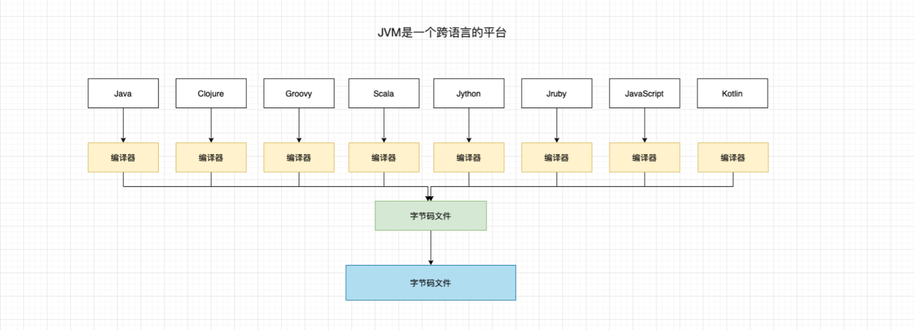
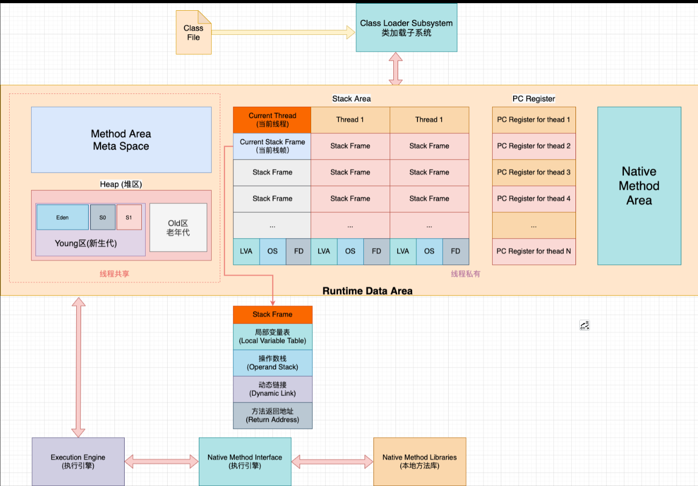
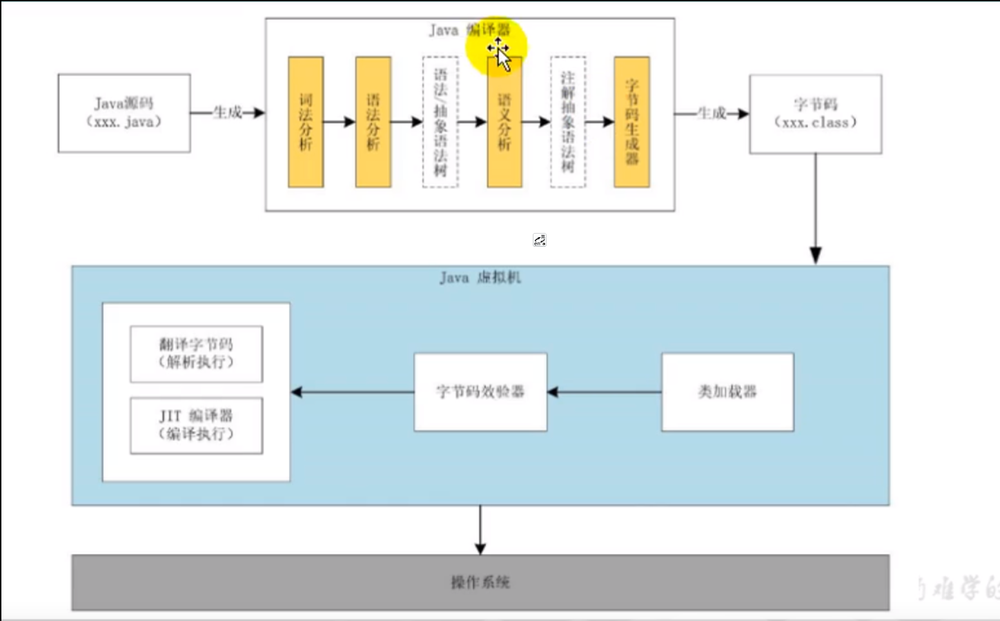

# 概述

## **JVM是一个跨语言的平台**

## **JVM的整体结构**

1.Hotspot VM是目前商用性能虚拟机的代表之一 

2.执行引擎采用解释器与及时编译器并存架构.

>执行引擎主要是JNI编译器和翻译字节码。

## **JVM模型架构**

Java 编译器输入的指令流基本上是一种**基于栈的指令架构**，另一种指令集架构是基于**寄存器的指令集架构**。

### 具体来说，这两种架构之间的区别：

**基于栈的指令架构**

1. 设计和实现更简单，适用于资源受限的系统。
2. 避开了寄存器的设计难题，使用零地址指令方式分配。
3. 指令流中的指令大部分都是零地址指令，其执行过程依赖于操作栈，指令集更小，编译器容易实现。
4. 不需要支持硬件，可移植性好，更好实现跨平台。

**寄存器的指令集架构**

1. 典型的应用是x86的二进制指令集，比如传统的PC以及Android的Devlik虚拟机。
2. 指令集架构则完全依赖硬件，可移植性差。
3. 性能优秀及挂靠更高效。
4. 花费更少的指令去完成一项操作。
5. 在大部分情况下，基于寄存器架构的指令集往往都以一地址指令、二地址指令和三地址指令为主，而基于栈式架构的指令集却是以零地址指令为主。

**总结**

由于跨平台性的设计，Java的指令都是根据栈来设计的，不同平台CPU架构不同，所以不能设计为基于寄存器的，优点是可跨平台，指令集小，编译器容易实现，缺点是性能下降，实现同样的功能需要更多的指令。

> 时至今日，尽管嵌入式平台已经不是Java程序的主机运行平台（准确来说应该是HotSpotVM的宿主环境已经不局限于嵌入嵌入式平台），那么为什么不将架构更换为基于寄存器的架构呢？

## JVM的生命同期（启动、执行、退出） 

### 虚拟机的启动

Java虚拟机的启动是通过引导类加载器(Bootstrap class loader)创建一个初始类(initial class)来完成，这个类是由虚拟机的具体实现指定的。

### 虚拟机的执行

1. 一个运行中的Java虚拟机有着一个清晰的任务：执行Java程序.
2. 程序开始执行时他才运行，程序结束时他就停止。
3. 执行一个所谓的Java程序的时候，真真正正执行的是一个叫做Java 虚拟机的进程。

### 虚拟机的退出

有如下情况：

1. 程序正常执行结束。  

2. 程序在执行过程中遇到了异常或错误而异常终止。

3. 由于操作系统出现错误导致Java虚拟机进行的终止。

4. 某线程调用Runtime类或System类的exit方法或Runtime类halt方法，并且Java案例管理器也允计这次exit或halt操作。

5. 除此之外，JNI(Java Native Interface)规范描述了用JNI Invocation API来加载或卸载Java虚拟机时，Java虚拟机的退出情。 

   

   
     

## **JVM 发展历程**

1. Sun Classic VM
   世界是第一款商用Java虚拟机，只提供了解释器，没有提交编译器(JIT),如果要使用JIT编译器，需要进行外挂，如果使用了JIT编译器，解释器就不再工作，解释器和编译器不能配合工具，现在是Hostspot中内置了此虚拟机。 

   > JIT 会把热点代码缓存起来，下次运行时不再使用编译成机器语言，增加程序的执行效率。

2. Exact VM：准确式内存管理

3. HostSpot WM：

4. JRockit：BEA公司出品，专注于服务器端的应用场景，不包含解析器的实现，使用即时编译后（JIT）执行,JRockit是世界是最快的JVM。

5. J9: 是IBM推出的的JVM产品，可用于服务器、桌面应用、嵌入式环境，

6. Azul WM和BEA Liquid VM：高性能Java虚拟机中的战斗机。和硬件耦合。

7. Microsoft JVM：

8. TaobaoVM：

9. Dalivik VM：

10. Graal VM：未来的虚拟机，跨语言的虚拟机。有望取代Hotspot。

  