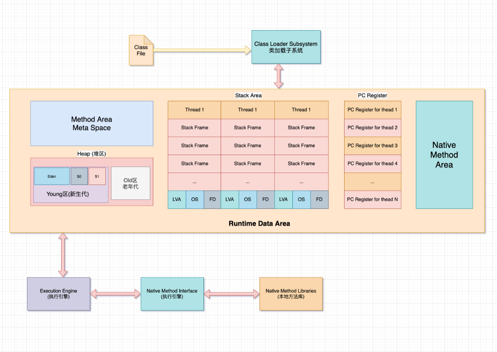
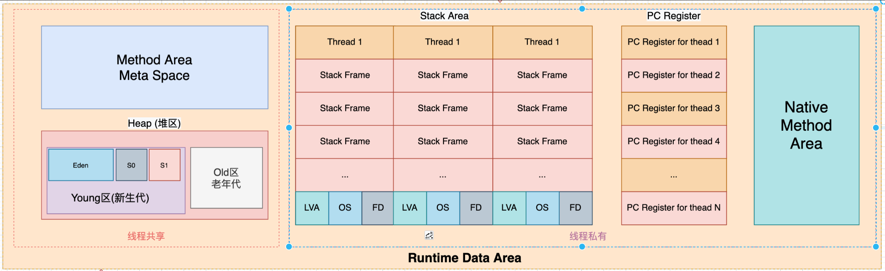
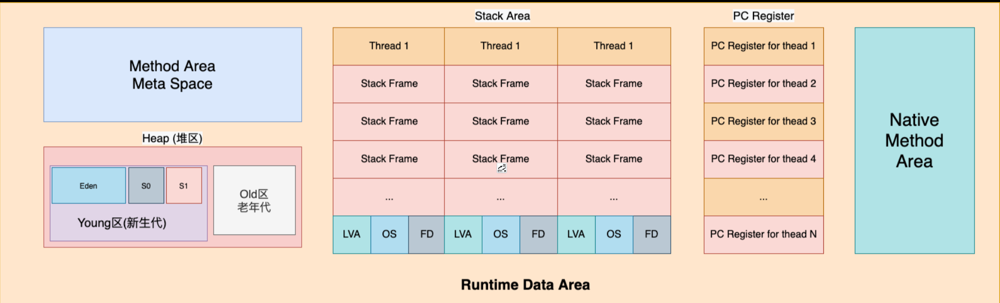

# 运行时数据区域

Java虚拟机定义了若干种程序运行期间会使用到的运行时数据区，其中有一些会随着虚拟机启动而创建，随着虚拟机退出而销毁，另外一些则是与线程一一对应的，这些与线程对应的数据区域会随着线程开始而开始，结束而结束。即生命周期与线程的生命周期保持一致。

## **关于线程间线程共享的说明**

Java虚拟机定义了若干种程序运行期间会使用到的运行时数据区，其中有一些会随着虚拟机启动而创建，随着虚拟机退出而销毁，另外一些则是与线程一一对应的，这些与线程对应的数据区域会随着线程开始而开始，结束而结束。即生命周期与线程的生命周期保持一致。 

由上图中可以看出：

- 每个线程有独立的程序计数器、虚拟机栈、本地方法栈。
- 线程间共享的有堆、堆外内存(永久代或元空间、代码缓存)

一个Java程序对应一个JVM，每个JVM只有一个Runtime实例，即为运行时环境，一个JVM进行拥有一个Runtime实例，包含了运行时数据区。如上图中所示。

  

