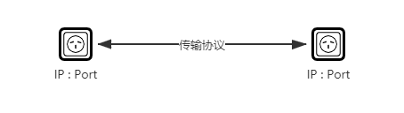
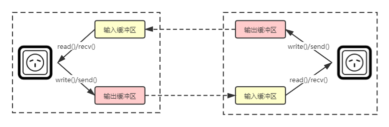
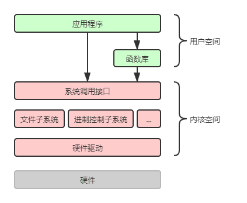
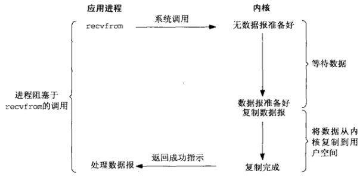
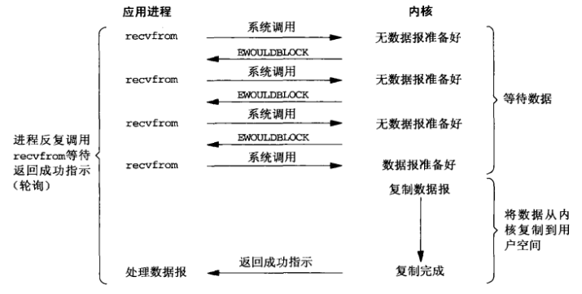
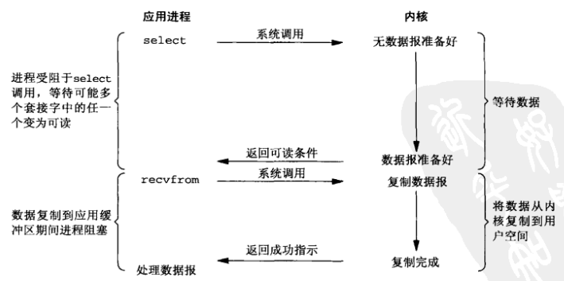
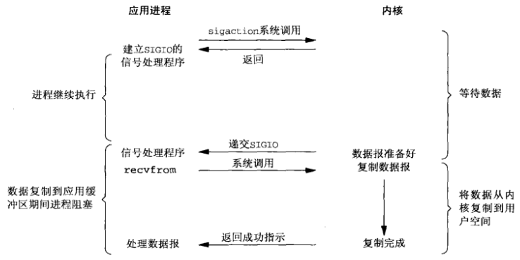
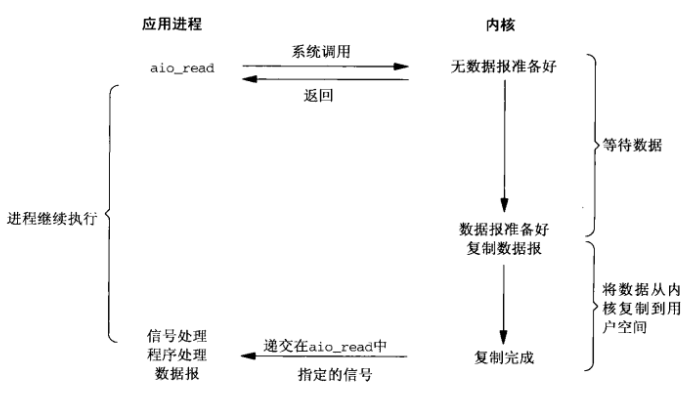
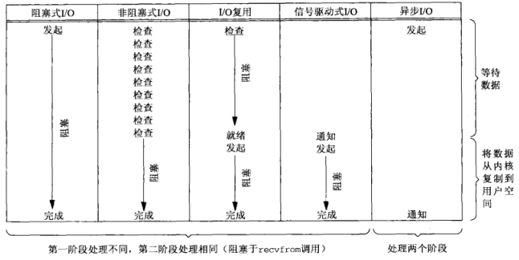

# 浅聊Linux的五种IO模型

在日常 Coding 中，多多少少都会接触到网络 IO，就会想要深入了解一下。看了很多文章，总是云里雾里的感觉，直到读了《[UNIX网络编程 卷1：套接字联网API](https://link.segmentfault.com/?enc=Mx0GQHeMQ4rj6ukbTYd2mg%3D%3D.o8jr1sv%2BJv9uz6oV7P9SKVb0Y9pRGCFdXLKha3Xsj8d7iHYYsif4KPNITvN5ST%2BR)》中的介绍后，才豁然开朗。这里就给大家分享一下，如有不对，欢迎指出。

## 1.概念说明

为了便于理解后面的内容，我们先来了解一些概念。

### 1.1 Socket

Socket 中文翻译为套接字，是计算机网络中进程间进行双向通信的端点的抽象。一个 Socket 代表了网络通信的一端，是由操作系统提供的进程间通信机制。

- 在操作系统中，通常会为应用程序提供一组应用程序接口，称为 Socket 接口（Socket API）。应用程序可以通过 Socket 接口，来使用网络 Socket，以进行数据的传输。
- 一个 Socket 由IP地址和端口组成，即：Socket 地址 = IP地址 : 端口号。
- 在同一台计算机上，TCP 协议与 UDP 协议可以同时使用相同的端口（Port），而互不干扰。
- 要想实现网络通信，至少需要一对 Socket，其中一个运行在客户端，称之为 Client Socket；另一个运行在服务器端，称之为 Server Socket。
- Socket 之间的连接过程可以分为三个步骤：（1）服务器监听；（2）客户端连接；（3）连接确认。

### 1.2 Socket 缓冲区

每个 Socket 被创建后，都会在内核中分配两个缓冲区：输入缓冲区和输出缓冲区。

- 通过 Socket 发送数据并不会立即向网络中传输数据，而是先将数据写入到输出缓冲区中，再由 TCP 协议将数据从输出缓冲区发送到目标主机。
- 通过 Socket 接收数据也是如此，也是从输入缓冲区中读取数据，而不是直接从网络中读取。

### 1.3 用户空间、内核空间、系统调用

操作系统的进程空间可以分为用户空间（User Space）和内核空间（Kernel Space），它们需要不同的执行权限。

- 大多数系统交互式操作需要在内核空间中运行，比如设备 IO 操作。

- 我们的应用程序运行在用户空间，是不具备系统级的直接操作权限的。如果应用程序想要访问系统核心功能，必须通过系统调用（System Call）来完成。比如调用`recv()`函数，会将输入缓冲区中的内容拷贝到用户缓冲区。

- 系统调用运行在内核空间，是操作系统为应用程序提供的接口。

  

下面列举了一些 Linux 操作系统中的系统调用接口（部分函数后面章节会用到）：

- socketcall socket系统调用
- socket 建立socket
- bind 绑定socket到端口
- connect 连接远程主机
- accept 响应socket连接请求
- send 通过socket发送信息
- sendto 发送UDP信息
- recv 通过socket接收信息
- recvfrom 接收UDP信息
- listen 监听socket端口
- select 对多路同步IO进行轮询
- shutdown 关闭socket上的连接
- sigaction 设置对指定信号的处理方法

### 1.4 阻塞与非阻塞

阻塞与非阻塞，用于描述调用者在等待返回结果时的状态。

- 阻塞：调用者发起请求后，会一直等待返回结果，这期间当前线程会被挂起（阻塞）。
- 非阻塞：调用者发起请求后，会立刻返回，当前线程也不会阻塞。该调用不会立刻得到结果，调用者需要定时轮询查看处理状态。

### 1.5 同步与异步

而同步与异步，用于描述调用结果的返回机制（或者叫通信机制）。

- 同步：调用者发起请求后，会一直等待返回结果，即由调用者主动等待这个调用结果。
- 异步：调用者发起请求后，会立刻返回，但不会立刻得到这个结果，而是由被调者在执行结束后主动通知（如 Callback）调用者。

## 2. 五种 IO 模型

IO 模型是指：用什么样的通道或者说是通信模式进行数据的传输，这很大程序上决定了程序通信的性能。

Linux 系统为我们提供五种可用的 IO 模型：阻塞式 IO 模型、非阻塞式 IO 模型、IO 多路复用模型、信号驱动 IO 模型和异步 IO 模型。

### 2.1 阻塞式 IO 模型

阻塞式 IO （Blocking IO）：应用进程从发起 IO 系统调用，至内核返回成功标识，这整个期间是处于阻塞状态的。

### 2.2 非阻塞式 IO 模型

非阻塞式IO（Non-Blocking IO）：应用进程可以将 Socket 设置为非阻塞，这样应用进程在发起 IO 系统调用后，会立刻返回。应用进程可以轮询的发起 IO 系统调用，直到内核返回成功标识。

### 2.3 IO 多路复用模型

IO 多路复用（IO Multiplexin）：可以将多个应用进程的 Socket 注册到一个 Select（多路复用器）上，然后使用一个进程来监听该 Select（该操作会阻塞），Select 会监听所有注册进来的 Socket。只要有一个 Socket 的数据准备好，就会返回该Socket。再由应用进程发起 IO 系统调用，来完成数据读取。

### 2.4 信号驱动 IO 模型

信号驱动 IO（Signal Driven IO）：可以为 Socket 开启信号驱动 IO 功能，应用进程需向内核注册一个信号处理程序，该操作并立即返回。当内核中有数据准备好，会发送一个信号给应用进程，应用进程便可以在信号处理程序中发起 IO 系统调用，来完成数据读取了。

### 2.5 异步 IO 模型

异步 IO（Asynchronous IO）： 应用进程发起 IO 系统调用后，会立即返回。当内核中数据完全准备后，并且也复制到了用户空间，会产生一个信号来通知应用进程。

## 3. 总结

从上述五种 IO 模型可以看出，应用进程对内核发起 IO 系统调用后，内核会经过两个阶段来完成数据的传输：

- 第一阶段：等待数据。即应用进程发起 IO 系统调用后，会一直等待数据；当有数据传入服务器，会将数据放入内核空间，此时数据准备好。
- 第二阶段：将数据从内核空间复制到用户空间，并返回给应用程序成功标识。

**前四种模型的第二阶段是相同的，都是处于阻塞状态，其主要区别在第一阶段。而异步 IO 模型则不同，应用进程在这两个阶段是完全不阻塞的。**

| IO 模型      | 第一阶段       | 第二阶段 |
| ------------ | -------------- | -------- |
| 阻塞式IO     | 阻塞           | 阻塞     |
| 非阻塞式IO   | 非阻塞         | 阻塞     |
| IO多路程复用 | 阻塞（Select） | 阻塞     |
| 信号驱动式IO | 异步           | 阻塞     |
| 异步IO       | 异步           | 异步     |

## 参考资料

- [UNIX网络编程 卷1：套接字联网API](https://link.segmentfault.com/?enc=fQETJsV5QZ%2Fxh8oubajDBg%3D%3D.bV40LV37LVRdSOgJPbn3JdjFTGnObdqsFV1SeK%2BZvxj%2BD4fNMT8y9Qknyzmgf0BP)