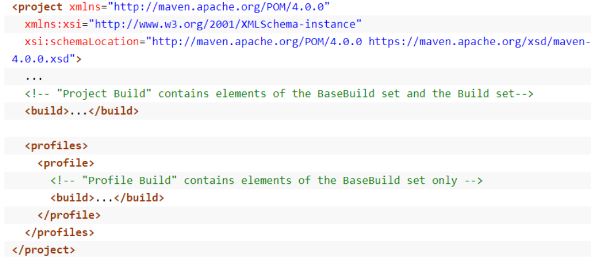
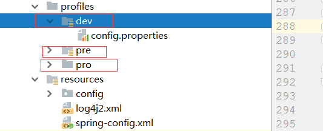

# POM配置


## build

**pom.xml中的两种build**

在Maven的pom.xml文件中，存在如下两种<build>：



说明：
一种<build>被称为Project Build，即是<project>的直接子元素。另一种<build>被称为Profile Build，即是<profile>的直接子元素。
Profile Build包含了基本的build元素，而Project Build还包含两个特殊的元素，即各种<...Directory>和<extensions>。

Project Build:

```xml
<resources>
    <resource>
        <directory>src/main/resources</directory>
        <filtering>true</filtering>
        <includes>
            <include>**/*.properties</include>
            <include>**/*.xml</include>
        </includes>
    </resource>
</resources>
```

表示打包时，将resources目录下的配置文件一并打入。

Profile Build：

```shell
<build>
    <resources>
        <resource>
            <directory>src/main/profiles/dev</directory>
        </resource>
    </resources>
</build>
```




将不同maven环境的指定文件打入包，一般是环境独有的（线上和线下） 


