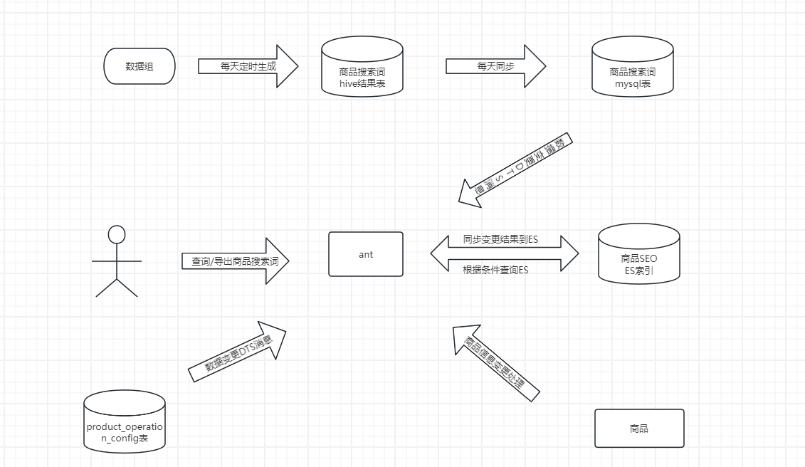

# ant

## topic 

### produc_change（监听商品消息变更）

流程

```
1.接收消息
2.从消息中获取skuId列表
3.同步商品后台类目信息到ES
  3.1 根据skuIdList获取商品基础信息（含有类目信息）
  3.2 构建ProductNameSeoModel
  3.3 根据构建ProductNameSeoModel同步到ES(就是使用bulkProcessor.add方法)
```


### dts（监听商品消息变更）

流程

```
1.接收消息
2.从消息中获取运营配置表id
3.同步商品运营配置信息到ES
  3.1 根据id获得商品运营配置信息
  3.2 构建ProductNameSeoModel
    3.2.1 已选搜索词列表
    3.2.2 sg商品审核状态
  3.3 根据构建ProductNameSeoModel同步到ES(就是使用bulkProcessor.add方法)
```


### product_operation_status_change(商品经营状态变更)

流程

```
1.接收消息
2.从消息中获取skuId
3.同步商品经营状态信息到ES
  3.1 根据skuId获取商品经营状态
  3.2 构建ProductNameSeoModel
    3.2.1 商品经营状态
  3.3 根据构建ProductNameSeoModel同步到ES(就是使用bulkProcessor.add方法)
```


### ProductNameSeoModel

```java
/**
 * 此处假设indexName为 product_name_seo_index
 * type为product_name_seo
 */
class ProductNameSeoModel{
    private Long skuId;
    private List<String> selectKeyWordList; // 已选搜索词列表
    private Integer approvalStatus; //sg商品审核状态
    private Long bgCategoryId; // 末级后台类目id
    private List<Integer> manageStatusList; // 经营状态列表
    private List<String> availableKeywordList; // 可选搜索词列表
}
```


## crane

### 同步全量商品可选搜索词信息到ES

流程

```
1.定时任务启动
2.分页便利商品基础
3.根据skuidList查询商品可选词
4.同步商品可选搜索词信息到ES
  4.1 可选搜索词列表
```


## Http接口

/sync/all/product/name/seo/eagle/index (同步全量商品的商品名称seo索引)

```
private Long skuId;  //全量便利商品基础库，所以可以拿到skuId
private List<String> selectKeyWordList; // 
private Integer approvalStatus; // 根据skuIdLIst 查询获得
private Long bgCategoryId; // SkubaseModel 有
private List<Integer> manageStatusList; // 根据skuId查询商品运营信息
private List<String> availableKeywordList; // 根据skuId查询商品可选搜索词
```


## thrift

### ProductNameSeoTService


#### query

商品名称SEO条件查询请求体

```
public class ProductNameSeoQueryRequest{
    private Long skuIdList;
    private Boolean selectKeyWordExist; // 是否已添加搜索词
    private List<String> selectKeyWord; // 已添加搜索词名称
    private Integer approvalStatus; //sg商品审核状态
    private Long bgCategoryId; // 末级后台类目id
    private List<Integer> manageStatusList; // 经营状态列表
    private Boolean availableKeywordExist;  // 是否有可选搜索词
    private List<String> availableKeyword; // 可选搜索词名称
}
```


商品名称SEO管理-列表查询（仅支持分页）

流程

```
1.条件查询ES获取skuId列表
2.根据skuId 查询商品名称SEO列表所需信息
  2.1 商品基础信息
  2.2 商品城市维度经营状态信息
  2.3 商品可选搜索词
  2.4 商品运营配置信息
```


##### 构建查询条件

```java
 private QueryBuilder buildQuery(TAntProductNameSeoQueryRequest request) {
        BoolQueryBuilder qb = QueryBuilders.boolQuery();
        if (request == null) {
            return qb;
        }
        // 默认查询所有
        qb.must(QueryBuilders.matchAllQuery());
        if (CollectionUtils.isNotEmpty(request.getBgCategoryIdList())) {
            qb.must(QueryBuilders.termsQuery("bgCategoryId", request.getBgCategoryIdList()));
        }
        if (request.getAvailableKeywordsExist() != null) {
            if (request.getAvailableKeywordsExist()) {
                qb.must(QueryBuilders.existsQuery("availableKeywordList"));
            } else {
                qb.mustNot(QueryBuilders.existsQuery("availableKeywordList"));
            }
        }
        if (StringUtils.isNotBlank(request.getAvailableKeyword())) {
            qb.must(QueryBuilders.termQuery("availableKeywordList", request.getAvailableKeyword()));
        }
        if (request.getSelectKeywordsExist() != null) {
            if (request.getSelectKeywordsExist()) {
                qb.must(QueryBuilders.existsQuery("selectKeywordList"));
            } else {
                qb.mustNot(QueryBuilders.existsQuery("selectKeywordList"));
            }
        }
        if (StringUtils.isNotBlank(request.getSelectKeyword())) {
            qb.must(QueryBuilders.termQuery("selectKeywordList", request.getSelectKeyword()));
        }
        if (request.getWaimaiRejected() != null) {
            if (request.getWaimaiRejected()) {
                qb.must(QueryBuilders.termQuery("approvalStatus", WaimaiProductNameApprovalStatus.TOO_MUCH_KEYWORD_REJECTED.type));
            } else {
                qb.mustNot(QueryBuilders.termQuery("approvalStatus", WaimaiProductNameApprovalStatus.TOO_MUCH_KEYWORD_REJECTED.type));
            }
        }
        if (CollectionUtils.isNotEmpty(request.getManageStatusList())) {
            qb.must(QueryBuilders.termsQuery("manageStatusList", request.getManageStatusList()));
        }
        if (CollectionUtils.isNotEmpty(request.getSkuIdList())) {
            qb.must(QueryBuilders.termsQuery("skuId", request.getSkuIdList()));
        }
        return qb;
    }
```


#### export

商品名称SEO管理-查询结果导出

```java
private void multiPartUploadProductNameSeoList(TAntProductNameSeoQueryRequest request) {
        uploadService.multiPartUploadAndSendDx(UploadType.PRODUCT_NAME_SEO_QUERY_RESULT,
                offset -> this.queryAllProductNameSeoList(request, offset, MULTI_UPLOAD_BOUNDARY),
                e -> log.error("商品名称SEO查询出现异常 request:{}", JsonTool.writeToString(request), e),
                request.getOperator(), CommonConstants.AVAILABLE_MINUTE);
    }
```


```java
/**
     * 分片上传，并发送大象消息
     * @param type
     * @param dataFunc
     * @param handler
     * @param operator
     * @param expireMin
     * @param <T>
     */
    public <T> void multiPartUploadAndSendDx(UploadType.Type<T> type, DataFunction dataFunc, ExceptionHandler handler,
                                             String operator, int expireMin) {
        String filename = type.title + "_" + System.currentTimeMillis() + ".csv";
        String url = null;
        String err = "";
        int partNumber = 1;
        int queryOffset = 0;

        // 1.初始化分片上传
        InitiateMultipartUploadRequest initRequest = new InitiateMultipartUploadRequest(bucketName, filename);
        InitiateMultipartUploadResult initResponse = amazonS3.initiateMultipartUpload(initRequest);
        List<PartETag> partETags = new ArrayList<>();

        try {
            // 2.循环分片上传
            do {
                // 2.1 获取需要分片上传的数据
                List<T> data;
                try {
                    data = dataFunc.apply(queryOffset);
                } catch (Exception e) {
                    handler.apply(e);
                    throw new AntException(ResponseCodeEnum.ErrorCode.SYSTEM_ERROR.getCode(), e);
                }
                if (CollectionUtils.isEmpty(data)) {
                    break;
                }
                // 只有第一片需要表头
                File file = FileTool.createTempFile(data, type.headerFunc, type.columnFunc, partNumber == 1);
                if (file == null) {
                    throw new AntException("生成文件为空");
                }

                // 2.2 构建分片上传请求参数
                UploadPartRequest uploadRequest = new UploadPartRequest()
                        .withBucketName(bucketName).withKey(filename)
                        .withUploadId(initResponse.getUploadId()).withPartNumber(partNumber)
                        .withFileOffset(0)
                        .withFile(file)
                        .withPartSize(file.length());

                // 2.3 上传该分片数据，记录etag值
                partETags.add(amazonS3.uploadPart(uploadRequest).getPartETag());

                // 2.4 清理数据
                FileTool.deleteTempFile(file);
                queryOffset += data.size();
                partNumber++;
            } while (true);

            // 3.上传完成，调用分片上传完成接口
            CompleteMultipartUploadRequest compRequest = new
                    CompleteMultipartUploadRequest(bucketName,
                    filename,
                    initResponse.getUploadId(),
                    partETags);
            amazonS3.completeMultipartUpload(compRequest);

            // 4.生成url
            url = genUploadUrl(filename, expireMin);

        } catch (Exception e) {
            // 5.上传失败，调用分片上传终止接口
            log.error("S3分片上传出现异常 traceId:{}", Tracer.id(), e);
            amazonS3.abortMultipartUpload(new AbortMultipartUploadRequest(
                    bucketName, filename, initResponse.getUploadId()));
            err = e.getMessage();
        }
        // 6.发送大象消息
        this.sendDx(type, operator, url, err);
    }
```


## 使用到ES的需求

### wm渠道商品名称（商品名称SEO管理）

目标：提高商品搜索DAU

收益：预计商品SEO后，商品搜索曝光量增加




**伪代码，方便理解**

商品搜索词表的表结构可以设计成如下样式，包含搜索词的基本信息、相关联的商品、词频、以及时间戳等字段：

```json
CREATE TABLE product_search_terms (
    id BIGINT PRIMARY KEY AUTO_INCREMENT,  -- 搜索词的唯一ID
    search_term VARCHAR(255) NOT NULL,     -- 搜索词
    product_id BIGINT NOT NULL,            -- 关联的商品ID
    frequency INT DEFAULT 0,               -- 搜索词出现的频率
    last_searched_at TIMESTAMP,            -- 最后一次搜索的时间
    created_at TIMESTAMP DEFAULT CURRENT_TIMESTAMP, -- 搜索词的创建时间
    updated_at TIMESTAMP DEFAULT CURRENT_TIMESTAMP ON UPDATE CURRENT_TIMESTAMP -- 搜索词的更新时间
);
```

>商品搜索词被添加到商品SEO后，商品搜索曝光量增加的原因与搜索引擎的工作原理、SEO优化技术及用户搜索行为密切相关。以下是主要原因：
>
>1. **提高搜索引擎可见性**
>
>SEO（搜索引擎优化）是一种通过优化网站内容和结构，让搜索引擎更容易索引和理解网页的技术。当商品的搜索词被正确添加到商品的SEO策略中，比如在商品标题、描述、标签中使用高效的搜索关键词，搜索引擎如Google、Bing或电商平台内的搜索引擎就更容易识别这些商品。
>
>2. **匹配用户搜索意图**
>
>当商品的搜索词与用户实际输入的搜索词相匹配时，商品更容易出现在搜索结果的前面。如果商品描述和元数据中包含了精准的用户搜索词，商品就更有可能在用户进行相关搜索时被展示，提升了曝光量。
>
>3. **提升搜索排名**
>
>搜索引擎通常根据相关性、页面质量、用户体验等因素对搜索结果进行排序。使用正确的搜索词和关键词优化商品信息可以提升其在搜索结果中的排名，增加被用户点击的机会。特别是在电商平台中，优化后的商品通常能获得更多展示机会，出现在推荐、相关搜索等位置。
>
>4. **提高点击率（CTR）**
>
>当商品内容经过SEO优化后，标题、描述、图片等信息与用户搜索意图更匹配，搜索引擎会认为该商品更符合用户需求，进而将其展示给更多用户。优化后的商品通常在搜索结果中的点击率会提高，进一步提升曝光率。
>
>5. **长尾关键词效应**
>
>除了热门的主关键词，SEO策略还可以针对更具体的长尾关键词进行优化。长尾关键词通常竞争较少，但转化率较高，添加这些关键词后，商品能够覆盖更广的用户搜索需求，从而获得更多的曝光机会。
>
>因此，商品搜索词被合理地添加到SEO策略中后，能帮助搜索引擎更好地理解商品信息，提升排名与点击率，从而增加商品的搜索曝光量。


为什么使用ES呢

Elasticsearch (ES) 和 MySQL 是两种不同的数据库系统，各有其适用的场景：

### Elasticsearch 适用场景

1. **全文搜索**：ES 是一个分布式的搜索引擎，擅长处理全文搜索和复杂的查询需求。它能够快速搜索大量文本数据，支持模糊匹配、前缀匹配、正则表达式等复杂查询。
2. **实时数据分析**：ES 可以用于实时数据分析，特别是需要快速查询和聚合大量数据的场景。它的倒排索引和聚合功能使得在大规模数据集上执行复杂的查询和聚合非常高效。
3. **日志分析**：由于 ES 可以处理海量数据，且支持快速搜索和过滤，因此常用于日志、事件、监控数据的实时分析，例如在 ELK（Elasticsearch, Logstash, Kibana）栈中，ES 是核心的存储和查询组件。
4. **非结构化和半结构化数据**：ES 能很好地处理非结构化和半结构化数据，比如 JSON 文档。在需要存储和查询复杂文档结构的场景下，ES 是一种很好的选择。
5. **高可扩展性和分布式存储**：ES 支持分布式架构，能轻松横向扩展，因此在需要处理海量数据和高并发查询的场景下，ES 是一种理想的选择。

### MySQL 适用场景

1. **关系型数据管理**：MySQL 是一种关系型数据库管理系统（RDBMS），适用于管理结构化数据的场景，特别是需要强一致性和事务支持的场景。
2. **事务处理**：MySQL 支持 ACID 特性（原子性、一致性、隔离性、持久性），适合需要强事务性的应用，如金融系统、订单管理系统等。
3. **复杂的关系模型**：当数据之间有复杂的关系，并需要使用外键、联合查询、复杂的表关系（如一对多、多对多）时，MySQL 是非常适合的选择。
4. **数据完整性和一致性**：在需要确保数据完整性和一致性的场景下，MySQL 提供了如外键约束、触发器、存储过程等工具，帮助维护数据的一致性和完整性。
5. **传统应用程序**：很多传统的企业应用程序（如 CRM、ERP 系统）是基于关系型数据库设计的，这些系统往往依赖于 MySQL 提供的强大的数据管理和查询能力。

### 总结

- 如果你需要处理复杂的全文搜索、实时分析或非结构化数据，ES 是更好的选择。
- 如果你需要管理结构化数据，保证事务的完整性和数据的一致性，MySQL 是更适合的选择。

两者可以结合使用，例如在 MySQL 中存储结构化数据，同时使用 ES 来处理搜索和实时分析需求。


## 订单流

### 提单

锁定库存


### 下单

流程

```
1.调用订单网关，创建买菜订单，使用重试组件，失败重试三次（不用加锁）
2.创建订单接口返回true:
  2.1 调用外卖接口，确认订单，成功返回
  2.2 确认订单失败，如果mallorder查不到订单，直接调用外卖接口，取消订单，能查到发送取消订单消息
3.创建订单接口返回false:
  3.1 直接调用外卖接口，取消订单
```


交易侧订单网关流程

```
1.加分布式锁，（根据orderId生成lockKey）
2.根据订单id查询查询订单（mallOrder）
3.mallOrder == null,走支付接单流程
  3.1 校验外卖订单中商品总数量
  3.2 生成leafId
  3.3 创建外卖订单
  3.4 扣减库存（失败会一直重试）
  3.5 更新订单为有效，如果更新失败，发mq加商品库存
  3.6 异步发起履约
  3.7 发送支付成功msg
4.mallOrder ！= null 走支付回调通知流程
```


## 退款


### 部分退款

流程

```
1.加分布式锁
  1.1 lockKey 为orderId  + 部分退款请求sig
  1.2 requestId 为orderID
2. 根据orderId 查询订单是否存在
3.退款 notify_type 为申请，直接推送交易
4.退款 notify_type 为同意，退款记录匹配
  4.1 查询订单进行中的退款记录
  4.2 进行商品匹配，退件数匹配
5.填充部分退款请求appiyId,推送交易  
 
  
```


## 分布式锁


### 实现方式1

```java
@Service
public class DistributeLockService {
    private static final String CATEGORY = "mall-order";

    @Autowired
    private RedisStoreClient redisStoreClient;

    @GatewayMonitor(needLogReturn = true)
    public Boolean tryLock(String key, String requestId, int expireInSeconds) {
        boolean lockResult = false;
        try {
            lockResult = redisStoreClient.setnx(new StoreKey(CATEGORY, key), requestId, expireInSeconds);
        } catch (Exception e) {
            log.error("tryLockOrder key={}, requestId={}, expireInSeconds={}", key, requestId, expireInSeconds, e);
        }
        return lockResult;
    }

    @GatewayMonitor(needLogReturn = true)
    public Boolean unlock(String key, String requestId) {
        boolean unlockResult = false;
        try {
            unlockResult = redisStoreClient.compareAndDelete(new StoreKey(CATEGORY, key), requestId);
        } catch (Exception e) {
            log.error("unlock key={}, requestId={}", key, requestId, e);
        }
        return unlockResult;
    }
}
```

