###  MyBatis-Plus使用详解1（安装配置、基本用法）

#### 一、基本介绍

##### 1、什么是 MyBatis-Plus？

（1）**MyBatis-Plus**（简称 **MP**）是一个 **MyBatis** 的增强工具，在 **MyBatis** 的基础上只做增强不做改变，为简化开发、提高效率而生。我们可以理解为它已经封装好了一些 **CRUD** 方法，我们不需要再写 **xml** 了，直接调用这些方法就行，类似于 **JPA**。

- **官网地址**：<https://mp.baomidou.com/>
- **GitHub 主页**：<https://github.com/baomidou/mybatis-plus>

（2）**MyBatis-Plus** 框架结构如下：

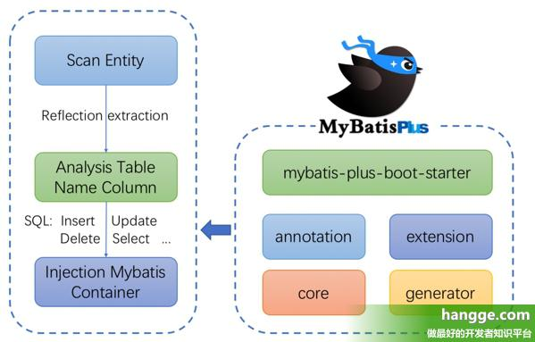

##### 2、MyBatis-Plus 的功能特点

- **无侵入**：只做增强不做改变，引入它不会对现有工程产生影响，如丝般顺滑
- **损耗小**：启动即会自动注入基本 **CURD**，性能基本无损耗，直接面向对象操作
- **强大的 CRUD 操作**：内置通用 **Mapper**、通用 **Service**，仅仅通过少量配置即可实现单表大部分 **CRUD** 操作，更有强大的条件构造器，满足各类使用需求
- **支持 Lambda 形式调用**：通过 **Lambda** 表达式，方便的编写各类查询条件，无需再担心字段写错
- **支持主键自动生成**：支持多达 **4** 种主键策略（内含分布式唯一 **ID** 生成器 - **Sequence**），可自由配置，完美解决主键问题
- **支持 ActiveRecord 模式**：支持 **ActiveRecord** 形式调用，实体类只需继承 **Model** 类即可进行强大的 **CRUD** 操作
- **支持自定义全局通用操作**：支持全局通用方法注入（ **Write once**, **use anywhere** ）
- **内置代码生成器**：采用代码或者 **Maven** 插件可快速生成 **Mapper** 、 **Model** 、 **Service** 、 **Controller** 层代码，支持模板引擎，更有超多自定义配置等您来使用
- **内置分页插件**：基于 **MyBatis** 物理分页，开发者无需关心具体操作，配置好插件之后，写分页等同于普通 **List** 查询
- **分页插件支持多种数据库**：支持 **MySQL**、**MariaDB**、**Oracle**、**DB2**、**H2**、**HSQL**、**SQLite**、**Postgre**、**SQLServer** 等多种数据库
- **内置性能分析插件**：可输出 **Sql** 语句以及其执行时间，建议开发测试时启用该功能，能快速揪出慢查询
- **内置全局拦截插件**：提供全表 **delete** 、 **update** 操作智能分析阻断，也可自定义拦截规则，预防误操作

##### 3、支持数据库

- **mysql** 、 **mariadb** 、 **oracle** 、 **db2** 、 **h2** 、 **hsql** 、 **sqlite** 、 **postgresql** 、 **sqlserver**
- 达梦数据库 、 虚谷数据库 、 人大金仓数据库

##### 4、安装配置

（1）首先编辑项目的 **pom.xml**文件，添加如下依赖：

>**mybatis-plus-boot-starter**：**MyBatis-Plus** 依赖
>**mysql-connector-java**：**MySQL** 数据库驱动
>**druid**：**Druid** 是阿里巴巴开发的号称为监控而生的数据库连接池，也是目前最好的数据库连接池。
>**lombok**：提供许多实用注解的工具插件

```xml
<!-- MyBatis-Plus依赖 -->
<dependency>
    <groupId>com.baomidou</groupId>
    <artifactId>mybatis-plus-boot-starter</artifactId>
    <version>3.3.1</version>
</dependency>
 
<!-- 数据库驱动依赖 -->
<dependency>
    <groupId>mysql</groupId>
    <artifactId>mysql-connector-java</artifactId>
</dependency>
 
<!-- 数据库连接池 -->
<dependency>
    <groupId>com.alibaba</groupId>
    <artifactId>druid</artifactId>
    <version>1.1.9</version>
</dependency>
 
<!-- Lombok -->
<dependency>
    <groupId>org.projectlombok</groupId>
    <artifactId>lombok</artifactId>
    <optional>true</optional>
</dependency>
```

（2）接着在 **application.properties** 中配置数据库连接信息：

```properties
spring.datasource.type=com.alibaba.druid.pool.DruidDataSource
spring.datasource.url=jdbc:mysql://localhost:3306/hangge
spring.datasource.username=root
spring.datasource.password=hangge1234
```

（3）最后 **Spring Boot** 启动类中添加 **@MapperScan** 注解，扫描 **Mapper** 文件夹：

```txt
要指明一个类是 Mapper 有如下两种方式：
一种方式是在具体的 Mapper 上添加 @Mapper 注解，表明该接口是一个 MyBatis 中的 Mapper。这种方式就是需要在每一个 Mapper 上都添加注解。
还有一种更简单的方式（即本样例使用的方式）便是在配置类上添加 @MapperScan("com.example.demo.mapper") 注解，表示扫描 com.example.demo.mapper 包下的所有接口作为 Mapper。这样就不需要在每个接口上配置 @Mapper 注解了。
```

```java
@SpringBootApplication
@MapperScan("com.example.demo.mapper")
public class DemoApplication {
    public static void main(String[] args) {
        SpringApplication.run(DemoApplication.class, args);
    }
}
```


#### 附：基本用法

##### 1、创建实体类

（1）假设我们数据库表结构如下：

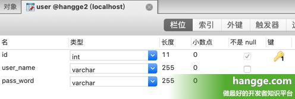


（2）创建对应的 **User** 实体类：

```java
@Data
public class User {
    //指定主键使用数据库ID自增策略
    @TableId(type = IdType.AUTO)
    private Integer id;
    private String userName;
    private String passWord;
}
```

##### 2、创建数据库访问层

我们编写一个 **Mapper** 类（**UserMapper**），我们只需要继承 **BaseMapper** 接口即可，里面不用写任何方法，也不需要编写 **xml** 文件。

```java
public interface UserMapper extends BaseMapper<User> {
}
```

##### 3、开始测试

（1）我们在 **Controller** 中通过调用 **UserMapper** 进行数据的增、删、改、查操作。

```java
@RestController
public class HelloController {
 
    @Autowired
    UserMapper userMapper;
 
    @RequestMapping("/test")
    public void test(){
        // 新增数据
        User user1 = new User();
        user1.setUserName("hangge");
        user1.setPassWord("123456");
        int i1 = userMapper.insert(user1);
        System.out.println("插入一条数据>>>" + i1);
 
        // 修改数据
        User user2 = new User();
        user2.setId(1);
        user2.setPassWord("888888");
        int i2 = userMapper.updateById(user2);
        System.out.println("更新一条数据>>>" + i2);
 
        // 删除数据
        int i3 = userMapper.deleteById(12);
        System.out.println("删除一条数据>>>" + i3);
 
        // 查询单条数据
        User user4 = userMapper.selectById(1);
        System.out.println("查询1条数据>>>" + user4.toString());
 
        // 查询多条数据
        List<User> users = userMapper.selectList(null);
        System.out.println("查询多条数据>>>" + users);
 
        return;
    }
}
```

（2）在浏览器中访问 **http://localhost:8080/test** 地址，可以看到控制台打印出的日志如下，可以发现通过几个简单的步骤，我们就实现了 **User** 表的 **CRUD** 功能：

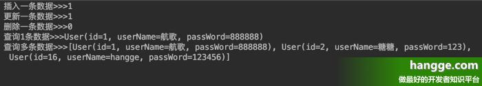


### MyBatis-Plus使用详解2（设置实体类对应的表名、字段名 ）

#### 设置模型对应的表名、字段名 

##### 1、设置关联的表名

（1）默认情况下，如果数据库表是使用标准的下划线命名，并且能对应上实体类的类名，我们就不需要特别去手动匹配。比如有张 **user_info** 表，那么会自动匹配下面这个实体类：

```java
@Data
public class UserInfo {
    private Integer id;
    private String userName;
    private String passWord;
}
```

（2）如果数据库中所有表都有个表名前缀，比如我们想让 **t_user_info** 表仍然对应 **UserInfo** 实体类，可以添加如下全局配置设置表名前缀：

```properties
mybatis-plus.global-config.db-config.table-prefix=t_
```

（3）如果所有表名都不是下划线命名（但能跟类名对应上），比如想让 **userinfo** 表对应 **UserInfo** 实体类，可以添加如下全局配置，表示数据库表不使用下划线命名：

```properties
mybatis-plus.global-config.db-config.table-underline=false
```

（4）除了上面两种全局配置方法外，我们还可以使用 **@TableName** 表名注解指定当前实体类对应的表名，比如下面 **UserInfo** 实体类对应表名为 **user**：

```java
@Data
@TableName(value = "user")
public class UserInfo {
    private Integer id;
    private String userName;
    private String passWord;
}
```

##### 2、设置关联的字段名

（1）同表名一样，如果数据库表里的字段名使用标准的下划线命名，并且能对应上实体类的成员名称（驼峰命名），我们就不需要特别去手动匹配。比如下面 **user_info** 表里的字段会自动跟 **UserInfo** 实体类的各个成员属性一一对应：


```java
@Data
public class UserInfo {
    private Integer id;
    private String userName;
    private String passWord;
}
```

（2）如果数据库表里的字段名并不是使用下划线命名（但能跟实体类的成员名称对应上），可以添加如下全局配置，表示数据库表字段名不使用下划线命名：


```properties
mybatis-plus.configuration.map-underscore-to-camel-case=false
```

（3）除了全局配置方法外，我们还可以使用 **@TableId** 注解（标注在主键上）和 **@TableField** 注解（标注在其他成员属性上）来指定对应的字段名：

```java
@Data
public class UserInfo {
    @TableId(value = "uuid")
    private Integer id;
    @TableField(value = "uname")
    private String userName;
    @TableField(value = "pword")
    private String passWord;
}

```


### MyBatis-Plus使用详解3（主键策略、UUID、Sequence）

#### 主键策略

> 我们可以通过 **@TableId** 注解的 **type** 属性来设置主键 **id** 的增长策略，一共有如下几种主键策略，可根据情况自由配

##### 1、ASSIGN_ID（雪花算法）

 如果不设置 **type** 值，默认则使用 **IdType.ASSIGN_ID** 策略（自 **3.3.0** 起）。该策略会使用雪花算法自动生成主键 **ID**，主键类型为 **Long** 或 **String**（分别对应 **MySQL** 的表字段为 **BIGINT** 和 **VARCHAR**）

>提示：该策略使用接口 IdentifierGenerator 的方法 nextId（默认实现类为 DefaultIdentifierGenerator 雪花算法），下面是雪花算法介绍：
>
>雪花算法（SnowFlake）是 Twitter 开源的分布式 id 生成算法。其核心思想就是：使用一个 64 bit 的 long 型的数字作为全局唯一 id。在分布式系统中的应用十分广泛，且 ID 引入了时间戳，基本上保持自增的。

```java
@Data
public` `class` `UserInfo {
    ``//指定主键生成策略使用雪花算法（默认策略）
    ``@TableId``(type = IdType.ASSIGN_ID)
    ``private` `Long id;
    ``private` `String userName;
    ``private` `String passWord;
}
```

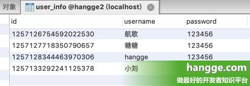

##### 2、ASSIGN_UUID（不含中划线的UUID）

 如果使用 **IdType.ASSIGN_UUID** 策略，则会自动生成不含中划线的 **UUID** 作为主键。主键类型为 **String**，对应 **MySQL** 的表字段为 **VARCHAR(32)**

>**提示**：该策略使用接口 **IdentifierGenerator** 的方法 **nextUUID**

```java
@Data
public class UserInfo {
    //指定主键生成策略为不含中划线的UUID
    @TableId(type = IdType.ASSIGN_UUID)
    private String id;
    private String userName;
    private String passWord;
}
```

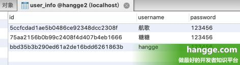

##### 3、AUTO（数据库 ID 自增）

对于像 **MySQL** 这样的支持主键自动递增的数据库，我们可以使用 **IdType.AUTO** 策略。

```java
@Data
public class UserInfo {
    //指定主键使用数据库ID自增策略
    @TableId(type = IdType.AUTO)
    private Integer id;
    private String userName;
    private String passWord;
}
```

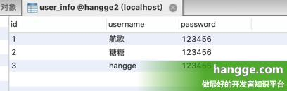

##### 4、INPUT（insert 前自行 set 主键值）

（1）针对有序列的数据库：比如 **Oracle**，**SQLServer** 等，当需要建立一个自增字段时，需要用到 **sequence**。

> 提示：
>
> - 在 **Oracle 11g** 中，设置自增字段，需要先创建序列（**SQUENCE**）再创建一个触发器（**TRIGGER**）。
> - 在 **Oracle 12c** 中，只需要使用 **IDENTITY** 属性就可以了，和 **MySQL** 一样简单。

（2）**Mybatis-Plus** 已经定义好了常见的数据库主键序列，我们首先只需要在 **@Configuration** 类中定义好 **@Bean**：

>Mybatis-Plus 
>
>内置了如下数据库主键序列（如果内置支持不满足你的需求，可实现 IKeyGenerator接口来进行扩展）：
>
>- **DB2KeyGenerator**
>- **H2KeyGenerator**
>- **KingbaseKeyGenerator**
>- **OracleKeyGenerator**
>- **PostgreKeyGenerator**

```java
@Bean
public OracleKeyGenerator oracleKeyGenerator(){
    return new OracleKeyGenerator();
}
```

（3）然后实体类配置主键 **Sequence**，指定主键策略为 **IdType.INPUT** 即可：

>**提示**：支持父类定义 **@KeySequence** 子类使用，这样就可以几个表共用一个 **Sequence**

```java
@TableName("TEST_SEQUSER")
@KeySequence("SEQ_TEST")//类注解
public class TestSequser{
  @TableId(value = "ID", type = IdType.INPUT)
  private Long id;
 
}
```

（4）如果主键是 **String** 类型的，也可以使用：

>
>
>如何使用 Sequence 作为主键，但是实体主键类型是 String 也就是说，表的主键是 varchar2，但是需要从 sequence 中取值
>
>- 实体定义 **@KeySequence** 注解 **clazz** 指定类型 **String.class**
>- 实体定义主键的类型 **String**
>- **注意**：**oracle** 的 **sequence** 返回的是 **Long** 类型，如果主键类型是 **Integer**，可能会引起 **ClassCastException**

```java
@KeySequence(value = "SEQ_ORACLE_STRING_KEY", clazz = String.class)
public class YourEntity{
     
    @TableId(value = "ID_STR", type = IdType.INPUT)
    private String idStr;
    ...
}
```

##### 5、NONE（无状态）

如果使用 **IdType.NONE** 策略，表示未设置主键类型（注解里等于跟随全局,全局里约等于 **INPUT**）

#### 全局策略配置

假设我们希望默认全部都使用 **AUTO** 策略（数据库 **ID** 自增），那么可以在 **application.properties** 中添加如下配置进行修改：

```properties
mybatis-plus.global-config.db-config.id-type=auto
```


### MyBatis-Plus使用详解4（Mapper的CRUD接口1：基本查询）

MyBatis-Plus 内置通用 Mapper，我们仅需要继承 BaseMapper，通过少量配置即可实现单表大部分 CRUD 操作，同时其更有强大的条件构造器，满足各类使用需求。


#### Mapper 的 CRUD 接口1：基本查询

##### 	1、准备工作

（1）假设我们有如下用户信息表 **user_info**：


（2）首先创建对应的实体类 **UserInfo**：

```java
@Data
public class UserInfo {
    private Integer id;
    private String userName;
    private String passWord;
    private Integer age;
}
```

（3）接着只需要创建 **UserInfoMapper** 接口，并继承 **BaseMapper** 接口，就可以使用各种 **CRUD** 方法了。

```java
public interface UserInfoMapper extends BaseMapper<UserInfo> {
}
```

##### 2、selectById（根据 id 查询一条记录）

```java
@RestController
public class HelloController {
 
    @Autowired
    UserInfoMapper userInfoMapper;
 
    @RequestMapping("/test")
    public void test(){
        // 根据id查询数据
        UserInfo user = userInfoMapper.selectById(2);
        System.out.println(user);
    }
}
```

##### 3、selectOne（使用查询构造器，查询一条记录）

> **注意**：是数据库中符合传入条件的记录有多条，那就不能用这个方法，会报错。

（1）查询前我们需要先创建相应的 **QueryWrapper**，通过自己写表中相应的属性来构造 **where** 条件：

```java
// 查询条件：名字中包含'ha'并且年龄小于40
QueryWrapper<UserInfo> queryWrapper = new QueryWrapper<>();
queryWrapper.like("user_name","ha").lt("age",40);
// 开始查询
UserInfo user = userInfoMapper.selectOne(queryWrapper);
System.out.println(user);
```

（2）除了使用 **QueryWrapper** 外，我们还可以 **lambda** 条件构造器做同样的事。

> **提示**：**lambda** 条件构造器好处是由于它是通过调用实体类中的方法，如果方法名称写错，会直接报错，从而提前纠错。不像 **QueryWrapper** 是通过自己写表中相应的属性来构造 **where** 条件，容易发生拼写错误，等到运行时才发现。

```java
// 查询条件：名字中包含'ha'并且年龄小于40
LambdaQueryWrapper<UserInfo> queryWrapper = new LambdaQueryWrapper<>();
queryWrapper.like(UserInfo::getUserName,"ha").lt(UserInfo::getAge,40);
// 开始查询
UserInfo user = userInfoMapper.selectOne(queryWrapper);
System.out.println(user);
```

- **MyBatis-Plus** 提供了 **4** 种方式创建 **lambda** 条件构造器，前三种分别如下：

```java
LambdaQueryWrapper<UserInfo> lqw1 = new QueryWrapper<UserInfo>().lambda();
LambdaQueryWrapper<UserInfo> lqw2= new LambdaQueryWrapper<>();
LambdaQueryWrapper<UserInfo> lqw3 = Wrappers.lambdaQuery();
```

- 无论是之前的 **lambda** 构造器还是 **queryWrapper**，每次编写完条件构造语句后都要将对象传递给 **mapper** 的 **selectOne** 方法，比较麻烦，**MyBatisPlus** 提供了第四种函数式编程方式，不用每次都传。

```java

UserInfo userInfo = new LambdaQueryChainWrapper<>(userInfoMapper)
        .like(UserInfo::getUserName,"ha")
        .lt(UserInfo::getAge,40)
        .one();
```

（3）我们也可以将对象直接以构造参数的形式传递给 **QueryWrapper**，**MyBatisPlus** 会自动根据实体对象中的属性自动构建相应查询的 **SQL** 语句：

```java
// 查询条件：名字为'hangge'并且年龄为22
UserInfo userInfo = new UserInfo();
userInfo.setUserName("hangge");
userInfo.setAge(22);
QueryWrapper<UserInfo> queryWrapper = new QueryWrapper<>(userInfo);
// 开始查询
UserInfo user = userInfoMapper.selectOne(queryWrapper);
System.out.println(user);
```

如果想通过对象中某些属性进行模糊查询，我们可以在跟数据库表对应的实体类中相应的属性标注相应注解即可。比如我们想通过姓名进行模糊查询用户：

```java
@Data
public class UserInfo {
    private Integer id;
    @TableField(condition = SqlCondition.LIKE)
    private String userName;
    private String passWord;
    private Integer age;
}
```

- 下面我们查询名字包含 **ha** 的用户，可以发现生成的 **sql** 语句确实使用 **like** 进行模糊查询：

```java
// 查询条件：名字包含为'ha'
UserInfo userInfo = new UserInfo();
userInfo.setUserName("ha");
QueryWrapper<UserInfo> queryWrapper = new QueryWrapper<>(userInfo);
// 开始查询
UserInfo user = userInfoMapper.selectOne(queryWrapper);
```

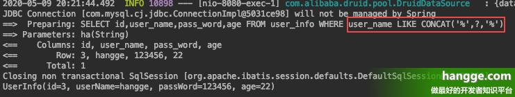

##### 4、selectBatchIds（根据 ID 批量查询，返回一个 List）

```java
List<Integer> ids = new ArrayList<>();
ids.add(1);
ids.add(2);
ids.add(3);
List<UserInfo> users = userInfoMapper.selectBatchIds(ids);
System.out.println(users);
```

##### 5、selectByMap（通过 Map 封装的条件查询，返回一个 List）

> **注意**：**map** 写的是数据表中的列名，而非实体类的属性名。比如属性名为 **userName**，数据表中字段为 **user_name**，这里应该写的是 **user_name**。

```java
Map<String,Object> columnMap = new HashMap<>();
columnMap.put("user_name", "hangge");
columnMap.put("age", 22);
List<UserInfo> users = userInfoMapper.selectByMap(columnMap);
System.out.println(users);
```

##### 6、selectList（使用查询构造器，返回一个 List）

> **注意**：**selectList** 使用与 **selectOne** 类似，不同的是当数据库中符合传入的条件的记录有多条，使用 **selectOne** 会报错。这时就要使用 **selectList**。

（1）查询前我们需要先创建相应的 **QueryWrapper**，通过自己写表中相应的属性来构造 **where** 条件：

```java
// 查询条件：名字中包含'ha'并且年龄小于40
QueryWrapper<UserInfo> queryWrapper = new QueryWrapper<>();
queryWrapper.like("user_name","ha").lt("age",40);
// 开始查询
List<UserInfo> users = userInfoMapper.selectList(queryWrapper);
System.out.println(user);
```

（2）除了使用 **QueryWrapper** 外，我们还可以 **lambda** 条件构造器做同样的事。

>**提示**：**lambda** 条件构造器好处是由于它是通过调用实体类中的方法，如果方法名称写错，会直接报错，从而提前纠错。不像 **QueryWrapper** 是通过自己写表中相应的属性来构造 **where** 条件，容易发生拼写错误，等到运行时才会发现。

```java
// 查询条件：名字中包含'ha'并且年龄小于40
LambdaQueryWrapper<UserInfo> queryWrapper = new LambdaQueryWrapper<>();
queryWrapper.like(UserInfo::getUserName,"ha").lt(UserInfo::getAge,40);
// 开始查询
List<UserInfo> users = userInfoMapper.selectList(queryWrapper);
System.out.println(users);
```

- **MyBatis-Plus** 提供了 **4** 种方式创建 **lambda** 条件构造器，前三种分别如下：

```java
LambdaQueryWrapper<UserInfo> lqw1 = new QueryWrapper<UserInfo>().lambda();
LambdaQueryWrapper<UserInfo> lqw2= new LambdaQueryWrapper<>();
LambdaQueryWrapper<UserInfo> lqw3 = Wrappers.lambdaQuery();
```

- 无论是之前的 **lambda** 构造器还是 **queryWrapper**，每次编写完条件构造语句后都要将对象传递给 **mapper** 的 **selectList** 方法，比较麻烦，**MyBatisPlus** 提供了第四种函数式编程方式，不用每次都传。

```java
List<UserInfo> userInfos = new LambdaQueryChainWrapper<>(userInfoMapper)
        .like(UserInfo::getUserName,"ha")
        .lt(UserInfo::getAge,40)
        .list();
```

（3）我们也可以将对象直接以构造参数的形式传递给 **QueryWrapper**，**MyBatisPlus** 会自动根据实体对象中的属性自动构建相应查询的 **SQL** 语句：

```java
// 查询条件：名字为'hangge'并且年龄为22
UserInfo userInfo = new UserInfo();
userInfo.setUserName("hangge");
userInfo.setAge(22);
QueryWrapper<UserInfo> queryWrapper = new QueryWrapper<>(userInfo);
// 开始查询
List<UserInfo> users = userInfoMapper.selectList(queryWrapper);
System.out.println(users);
```

- 如果想通过对象中某些属性进行模糊查询，我们可以在跟数据库表对应的实体类中相应的属性标注相应注解即可。比如我们想通过姓名进行模糊查询用户：

```java
@Data
public class UserInfo {
    private Integer id;
    @TableField(condition = SqlCondition.LIKE)
    private String userName;
    private String passWord;
    private Integer age;
}
```

- 下面我们查询名字包含 **ha** 的用户，可以发现生成的 **sql** 语句确实使用 **like** 进行模糊查询：

```java
// 查询条件：名字包含'ha'
UserInfo userInfo = new UserInfo();
userInfo.setUserName("ha");
QueryWrapper<UserInfo> queryWrapper = new QueryWrapper<>(userInfo);
// 开始查询
List<UserInfo> users = userInfoMapper.selectList(queryWrapper);
```

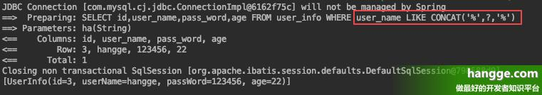

##### 7、selectMaps（使用查询构造器，返回一个 List<map>）

**selectMaps** 的用法和上面的 **selectList** 很像，都是传入一个查询构造器进行查询，然后返回一个 **List**。不同在于 **selectMaps** 返回的 **List** 里面是 **Map**：

>**注意**： **Map** 里的 **key** 为表字段名，而不是对应实体类的属性名。

```java
UserInfo userInfo = ``new` `UserInfo();
userInfo.setUserName(``"ha"``);
QueryWrapper<UserInfo> queryWrapper = ``new` `QueryWrapper<>(userInfo);
// 开始查询
List<Map<String, Object>> users = userInfoMapper.selectMaps(queryWrapper);
System.out.println(users);
```

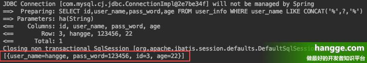


##### **8、selectObjs（使用查询构造器，返回一个 List<object>）**

**selectObjs** 的用法和前面的 **selectList** 很像，都是传入一个查询构造器进行查询，然后返回一个 **List**。不同在于 **selectObjs** 返回的 **List** 里面只有返回的第一个字段值：

```java
UserInfo userInfo = new UserInfo();
userInfo.setAge(22);
QueryWrapper<UserInfo> queryWrapper = new QueryWrapper<>(userInfo);
// 开始查询
List<Object> users = userInfoMapper.selectObjs(queryWrapper);
System.out.println(users);
```

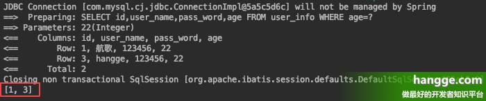

##### 9、selectCount（使用查询构造器，查询总记录数）

**selectCount** 的用法和前面的 **selectList** 很像，都是传入一个查询构造器进行查询，不同的是 **selectCount** 返回的是一个 **Integer** 值（符合条件的记录数）

```java
UserInfo userInfo = new UserInfo();
userInfo.setAge(22);
QueryWrapper<UserInfo> queryWrapper = new QueryWrapper<>(userInfo);
// 开始查询
Integer count = userInfoMapper.selectCount(queryWrapper);
System.out.println(count);
```

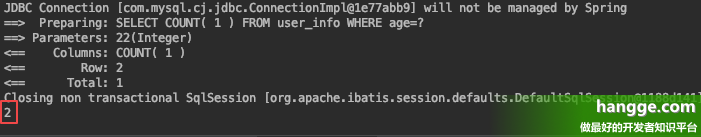

##### 附：添加自己的数据库操作

如果觉得默认提供的 **CRUD** 接口不能满足需求，我们可以添加自己的 **SQL** 语句，具体有如下两种方案。

###### 1、注解方式（Mapper.java）

我们可以直接在自定义方法上使用 

@Select设置对应的 sql 语句：

```java
public interface UserInfoMapper extends BaseMapper<UserInfo> {
    @Select("select * from user_info WHERE age > #{age}")
    List<UserInfo> getAll(Integer age);
}
```

###### 2、XML 形式（Mapper.xml）

（1）首先在 **mapper.xml** 中添加自定义的 **sql** 语句：

```XML
<?xml version="1.0" encoding="UTF-8" ?>
<!DOCTYPE mapper PUBLIC "-//mybatis.org//DTD Mapper 3.0//EN"
        "http://mybatis.org/dtd/mybatis-3-mapper.dtd">
<mapper namespace="com.example.demo.mapper.UserInfoMapper">
    <select id="getAll" resultType="com.example.demo.model.UserInfo">
        SELECT * FROM user_info WHERE age > #{age}
    </select>
</mapper>
```

（2）然后在 **mapper.java** 中添加相应的接口方法即可：

```java
public interface UserInfoMapper extends BaseMapper<UserInfo> {
    List<UserInfo> getAll(Integer age);
}
```


### MyBatis-Plus使用详解5（Mapper的CRUD接口2：条件构造器）

#### Mapper 的 CRUD 接口2：条件构造器

##### 1、相等、不相等

（1）**allEq** 表示全部 **eq**（或个别 **isNull**）：

> 方法最后一个参数 **null2IsNull** 是可选的（默认为 **true**），为 **true** 时则在 **map** 的 **value** 为 **null** 时调用 **isNull** 方法，为 **false** 时则忽略：
>
>- **allEq({id:1,user_name:"hangge",age:null})**   --- 生成的sql为 --->   **id = 1 and user_name = 'hangge' and age is null**
>- **allEq({id:1,user_name:"hangge",age:null}, false)**   --- 生成的sql为 --->   **id = 1 and user_name = 'hangge'**

```java
Map<SFunction<UserInfo, ?>, Object> map = new HashMap<>();
map.put(UserInfo::getId, 3);
map.put(UserInfo::getUserName, "hangge");
map.put(UserInfo::getAge, null);
 
List<UserInfo> userInfos = new LambdaQueryChainWrapper<>(userInfoMapper)
        .allEq(map)
        .list();
```

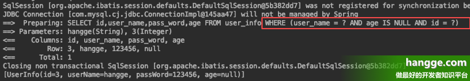

（2）**eq** 表示等于（**=**），**ne** 表示不等于（**<>**）

```java
List<UserInfo> userInfos = new LambdaQueryChainWrapper<>(userInfoMapper)
        .eq(UserInfo::getId, 1) // id = 1
        .ne(UserInfo::getAge, 22) // age <> 22
        .list();
```

##### 2、大于、小于

（1）**gt** 表示大于（**>**）、**ge** 表示大于等于（**>=**）、**lt** 表示小于（**<**）、**le** 表示小于等于（**<=**）

```java
List<UserInfo> userInfos = new LambdaQueryChainWrapper<>(userInfoMapper)
        .gt(UserInfo::getId, 1) // id > 1
        .ge(UserInfo::getAge, 22) // age >=18
        .lt(UserInfo::getId, 3) // id < 3
        .le(UserInfo::getAge, 50) // age <=50
        .list();
```

（2）**between** 表示（**BETWEEN 值1 AND 值2**），**notBetween** 表示（**NOT BETWEEN 值1 AND 值2**）

```java
List<UserInfo> userInfos = new LambdaQueryChainWrapper<>(userInfoMapper)
        .between(UserInfo::getId, 1,3) // id between 1 and 3
        .notBetween(UserInfo::getAge, 40, 50) // age not between 40 and 50
        .list();
```

##### 3、模糊查询

（1）**like** 表示包含指定的值（**like '%值%'**），**likeLeft** 表示以指定的值结尾（**like '%值'**），**likeRight** 表示以指定的值开头（**like '值%'**）

```java
List<UserInfo> userInfos = new LambdaQueryChainWrapper<>(userInfoMapper)
        .like(UserInfo::getUserName, "ha") // user_name like '%ha%'
        .likeLeft(UserInfo::getUserName, "ha") // user_name like '%ha'
        .likeRight(UserInfo::getUserName, "ha") // user_name like 'ha%'
        .list();
```

（2）**notLike** 表示不包含指定的值（**not like '%值%'**）

```java
List<UserInfo> userInfos = new LambdaQueryChainWrapper<>(userInfoMapper)
        .notLike(UserInfo::getUserName, "ha") // user_name not like '%ha%'
        .list();
```

##### 4、是否为 null

**isNull** 表示字段是否为 **null**（**is null**），**isNotNull** 表示字段是否不为 **null**（**is not null**）

```java
List<UserInfo> userInfos = new LambdaQueryChainWrapper<>(userInfoMapper)
        .isNull(UserInfo::getUserName) // user_name is null
        .isNotNull(UserInfo::getAge) // age is not null
        .list();
```

##### 5、n、notIn

```java
List<UserInfo> userInfos = new LambdaQueryChainWrapper<>(userInfoMapper)
        .in(UserInfo::getId, Arrays.asList(1, 2, 3)) // id in (1,2,3)
        .notIn(UserInfo::getAge, Arrays.asList(22, 33)) // age not in (22,33)
        .list();
```


##### 6、带子查询（sql 注入）  

（1）下面是 **inSql** 的用法：

```java
List<UserInfo> userInfos = new LambdaQueryChainWrapper<>(userInfoMapper)
        .inSql(UserInfo::getAge, "22,33") // age in (22,33)
        // id in (select id from vip where level > 3)
        .inSql(UserInfo::getId, "select id from vip where level > 3")
        .list();
```

(2)下面是notinsql的用法

```java
List<UserInfo> userInfos = new LambdaQueryChainWrapper<>(userInfoMapper)
        .notInSql(UserInfo::getAge, "22,33") // age not in (22,33)
        // id not in (select id from vip where level > 3)
        .notInSql(UserInfo::getId, "select id from vip where level > 3")
        .list();
```


##### 7、排序

**orderByAsc** 表示升序（**ASC**），**orderByDesc** 表示降序（**DESC**）

```java
List<UserInfo> userInfos = new LambdaQueryChainWrapper<>(userInfoMapper)
        .orderByAsc(UserInfo::getId, UserInfo::getUserName) // ORDER BY id ASC,user_name ASC
        .orderByDesc(UserInfo::getAge) // ORDER BY age DESC
        .list();
```


##### 8、分组、筛选

下面是 groupBy 和 having 的用法：

```java
List<UserInfo> userInfos = new LambdaQueryChainWrapper<>(userInfoMapper)
        .groupBy(UserInfo::getUserName, UserInfo::getAge) // group by user_name,age
        .having("sum(age) > 20") // HAVING sum(age) > 20
        .having("sum(age) > {0}", 30) // HAVING sum(age) > 30
        .select(UserInfo::getUserName, UserInfo::getAge)
        .list();
```


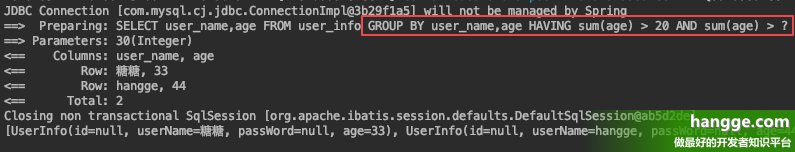

##### 9、or、 and、nested

（1）主动调用 **or** 表示紧接着下一个方法是用 **or** 连接（不调用 **or** 则默认为使用 **and** 连接）

```java
// WHERE age = 22 or age = 33
List<UserInfo> userInfos = new LambdaQueryChainWrapper<>(userInfoMapper)
        .eq(UserInfo::getAge, 22)
        .or()
        .eq(UserInfo::getAge, 33)
        .list();
```

（2）**or**、 **and**、**nested** 可以实现带嵌套的查询：

>- **or** 为 **OR** 嵌套
>- **and** 为 **AND** 嵌套
>- **nested** 为正常嵌套（不带 **AND** 或者 **OR**）

```java
// WHERE age IS NOT NULL AND ((id = 1 AND user_name = 'hangge') OR (id = 2 AND user_name = '航歌'))
List<UserInfo> userInfos = new LambdaQueryChainWrapper<>(userInfoMapper)
        .isNotNull(UserInfo::getAge)
        .and(i -> i.nested(
                j -> j.eq(UserInfo::getId,1).eq(UserInfo::getUserName,"hangge")
                )
                .or(j -> j.eq(UserInfo::getId,2).eq(UserInfo::getUserName,"航歌"))
        )
        .list();
```

##### 10、拼接 sql（sql 注入） 

（1）**apply** 方法可以直接将自定义的 **sql** 拼接到查询条件中：

```java
// WHERE age IS NOT NULL AND id = 3 AND user_name = 'hangge'
List<UserInfo> userInfos = new LambdaQueryChainWrapper<>(userInfoMapper)
        .isNotNull(UserInfo::getAge)
        .apply("id = 3") // 有sql注入的风险
        .apply("user_name = {0}", "hangge") //无sql注入的风险
        .list();
```

2）**last** 无视优化规则直接拼接到 **sql** 的最后：

>**注意：** **last** 只能调用一次，多次调用以最后一次为准。该方法有 **sql** 注入的风险，请谨慎使用。

```java
// WHERE age IS NOT NULL limit 2
List<UserInfo> userInfos = new LambdaQueryChainWrapper<>(userInfoMapper)
        .isNotNull(UserInfo::getAge)
        .last("limit 2")
        .list();
```

##### 11、exists、notExists

（1）**exists** 方法可以拼接 **EXISTS** ( **sql** 语句 )，比如下面查询底下有用户的所有区域：

```java
// SELECT id,area_name FROM area WHERE
//         (EXISTS (select * from user_info where user_info.area_id = area.id))
List<Area> areas = new LambdaQueryChainWrapper<>(areaMapper)
        .exists("select * from user_info where user_info.area_id = area.id")
        .list();
```

（2）**notExists** 方法用于拼接 **NOT EXISTS** ( **sql** 语句 )，比如下面查询底下没有用户的所有区域：

```java
// SELECT id,area_name FROM area WHERE
//         (NOT EXISTS (select * from user_info where user_info.area_id = area.id))
List<Area> areas = new LambdaQueryChainWrapper<>(areaMapper)
        .notExists("select * from user_info where user_info.area_id = area.id")
        .list();
```

##### 12、设置查询字段（select）

**select** 方法可以设置最终查询返回的字段：

```java
List<UserInfo> userInfos = new LambdaQueryChainWrapper<>(userInfoMapper)
        .select(UserInfo::getUserName, UserInfo::getAge)
        .list();
```

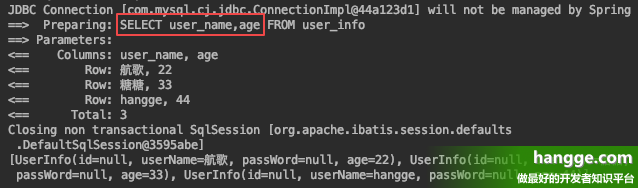

#### 自定义 SQL 语句使用 Wrapper

>**mybatis-plus** 在 **3.0.7** 版本之后，也支持自定义 **SQL** 语句使用 **Wrapper**，具体有如下两种方案。**注意**：使用 **Wrapper** 的话自定义 **sql** 中不能有 **WHERE** 语句。

##### 1、注解方式（Mapper.java）

（1）我们可以直接在自定义方法上使用 **@Select** 设置对应的 **sql** 语句，然后添加 **Wrapper** 参数：

```java
public interface UserInfoMapper extends BaseMapper<UserInfo> {
    @Select("SELECT * FROM user_info ${ew.customSqlSegment}")
    List<UserInfo> getAll(@Param(Constants.WRAPPER) Wrapper wrapper);
}
```

（2）下面调用这个自定义方法：

```java
List<UserInfo> userInfos = userInfoMapper.getAll(
        Wrappers.<UserInfo>lambdaQuery().eq(UserInfo::getId, 1)
);
```

##### 2、XML 形式（Mapper.xml）

（1）首先在 mapper.xml 中添加自定义的 sql 语句：

```xml
<?xml version="1.0" encoding="UTF-8" ?>
<!DOCTYPE mapper PUBLIC "-//mybatis.org//DTD Mapper 3.0//EN"
        "http://mybatis.org/dtd/mybatis-3-mapper.dtd">
<mapper namespace="com.example.demo.mapper.UserInfoMapper">
    <select id="getAll" resultType="com.example.demo.model.UserInfo">
        SELECT * FROM user_info ${ew.customSqlSegment}
    </select>
</mapper>
```

（2）然后在 **mapper.java** 中添加相应的接口方法即可：

```java
public interface UserInfoMapper extends BaseMapper<UserInfo> {
    List<UserInfo> getAll(@Param(Constants.WRAPPER) Wrapper wrapper);
}
```


### MyBatis-Plus使用详解6（Mapper的CRUD接口3：分页查询）

#### Mapper 的 CRUD 接口3：分页查询 

##### 1、添加配置

（1）**MyBatis-Plus** 提供了物理分页的功能，使用前我们需要要进行相关的插件配置：

> 逻辑分页与物理分页比较：
>
> - 逻辑分页：内存开销比较大，在数据量比较小的情况下效率比物理分页高；在数据量很大的情况下，内存开销过大，容易内存溢出，不建议使用。
> - 物理分页：内存开销比较小，在数据量比较小的情况下效率比逻辑分页还是低；在数据量很大的情况下，建议使用物理分页。

```java
@EnableTransactionManagement
@Configuration
public class MybatisPlusConfig {
    /**
     *   mybatis-plus分页插件
     */
    @Bean
    public PaginationInterceptor paginationInterceptor() {
        PaginationInterceptor paginationInterceptor = new PaginationInterceptor();
        // 设置请求的页面大于最大页后操作， true调回到首页，false 继续请求  默认false
        // paginationInterceptor.setOverflow(false);
        // 设置最大单页限制数量，默认 500 条，-1 不受限制
        // paginationInterceptor.setLimit(500);
        // 开启 count 的 join 优化,只针对部分 left join
        paginationInterceptor.setCountSqlParser(new JsqlParserCountOptimize(true));
        return paginationInterceptor;
    }
}
```

##### 2、selectPage 方法

（1）**BaseMapper** 提供的 **selectPage** 方法实现分页查询，比如下面我们查询第一页的数据（每页两条记录）：

```java
@RestController
public class HelloController {
 
    @Autowired
    UserInfoMapper userInfoMapper;
 
    @RequestMapping("/test")
    public IPage<UserInfo> test(){
        LambdaQueryWrapper<UserInfo> queryWrapper = new LambdaQueryWrapper<>();
        queryWrapper.like(UserInfo::getPassWord,"123").lt(UserInfo::getAge,40);
        // 开始查询
        IPage<UserInfo> page = userInfoMapper.selectPage(new Page<>(1,2), queryWrapper);
        return page;
    }
}
```

（2）返回结果如下：

 	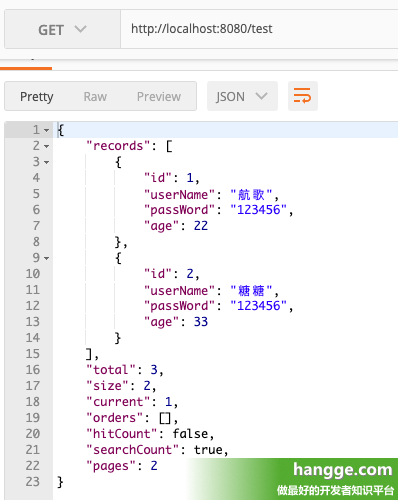

（3）从日志信息可以发现，分页插件会识别是何数据库，然后自动拼接相应分页语句（若是 **mysql** 则自动通过 **limit** 分页，若是 **oracle** 则自动通过 **rownum** 进行分页）

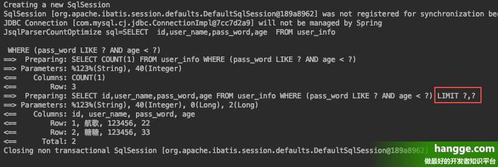

##### 3、selectMapsPage 方法

（1）**selectMapsPage** 的用法和上面的 **selectPage** 很像，都是传入分页查询条件、以及查询构造器进行查询，然后返回一个 **List**。不同在于 **selectMapsPage** 返回的结果里面是 **Map**：

>**注意**： **Map** 里的 **key** 为表字段名，而不是对应实体类的属性名。

```java
@RestController
public class HelloController {
 
    @Autowired
    UserInfoMapper userInfoMapper;
 
    @RequestMapping("/test")
    public IPage<Map<String, Object>> test(){
        LambdaQueryWrapper<UserInfo> queryWrapper = new LambdaQueryWrapper<>();
        queryWrapper.like(UserInfo::getPassWord,"123").lt(UserInfo::getAge,40);
        // 开始查询
        IPage<Map<String, Object>> page = userInfoMapper.selectMapsPage(new Page<>(1,2),
                queryWrapper);
        return page;
    }
}
```

（2）查询结果如下：

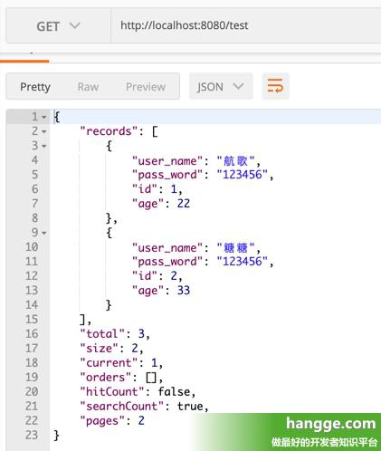

#### 自定义 SQL 语句的分页查询

（1）**MyBatis-Plus** 也支持对自定义的查询语句进行分页，假设我们在 **mapper.xml** 定义了一个 **sql** 语句：

```xml
<?xml version="1.0" encoding="UTF-8" ?>
<!DOCTYPE mapper PUBLIC "-//mybatis.org//DTD Mapper 3.0//EN"
        "http://mybatis.org/dtd/mybatis-3-mapper.dtd">
<mapper namespace="com.example.demo.mapper.UserInfoMapper">
    <select id="selectPage2" resultType="com.example.demo.model.UserInfo">
        SELECT * FROM user_info WHERE age > #{age}
    </select>
</mapper>
```

（2）对应的 **mapper** 只需要传递参数 **Page** 即自动会实现分页：

>**注意**：递参数 **Page** 即自动分页，必须放在第一位（我们也可以继承 **Page** 实现自己的分页对象）

```java
public interface UserInfoMapper extends BaseMapper<UserInfo> {
    IPage<UserInfo> selectPage2(Page<?> page, Integer age);
}
```

（3）我们调用一下这个自定义方法进行测试：

```java
@RestController
public class HelloController {
 
    @Autowired
    UserInfoMapper userInfoMapper;
 
    @RequestMapping("/test")
    public IPage<UserInfo> test(){
        IPage<UserInfo> page = userInfoMapper.selectPage2(new Page<>(1,2), 10);
        return page;
    }
}
```


  （4）可以看到最终执行的 **SQL** 会自动拼接相应的分页语句：

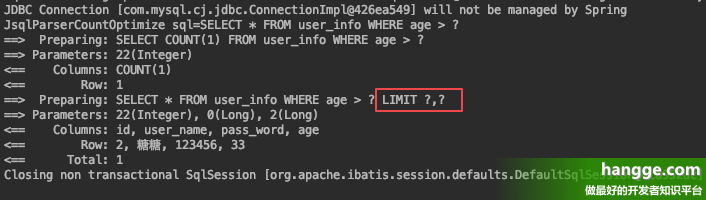


### MyBatis-Plus使用详解7（Mapper的CRUD接口4：多表关联查询）

  Mybatis-Plus 由于内置通用 Mapper、通用 Service，无需复杂的配置即可实现单表大部分 CRUD 操作，大大减少了 MyBatis 的代码量。
    但如果遇到关联属性的查询（1 对 1，1 对 n ），那么仍然需要我们通过自己写 SQL 的方式去做。这个我们可以使用注解的方式去做，也选择使用 xml 文件的方式，下面分别通过样例进行介绍。


#### Mapper 的 CRUD 接口4：多表关联查询（使用注解）

##### 1、自定义 sql

（1）假设我们有如下两张表：用户表（**User**）、区域表（**Area**），其中用户表里通过 **area_id** 字段关联区域表的 **id** 主键：

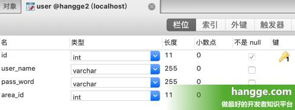

（2）假设我们希望查询 **User** 时也能获取其所属的区域名称，这里对 **User** 实体类增加 **areaName** 属性：

> **提示**：由于 **area_name** 不是 **User** 数据库表里的字段，因此需要添加 **@TableField** 注解，并将 **exist** 属性设置为 **false**。

```java
@Data
public class User {
    //指定主键使用数据库ID自增策略
    @TableId(type = IdType.AUTO)
    private Integer id;
    private String userName;
    private String passWord;
    private Integer areaId;
    @TableField(exist = false)
    private String areaName;
}
```

（3）然后在 **UserMapper** 中添加相关查询方法以及关联查询语句：

```java
public interface UserMapper extends BaseMapper<User> {
    @Select("SELECT user.*, area.area_name FROM user, area " +
            "WHERE user.area_id = area.id and user.id = #{id}")
    User getUserById(int id);
}
```

（4）最后调用这个方法测试一下：

```java
@RestController
public class HelloController {
 
    @Autowired
    UserMapper userMapper;
 
    @RequestMapping("/test")
    public User test(){
        User user = userMapper.getUserById(1);
        return user;
    }
}
```

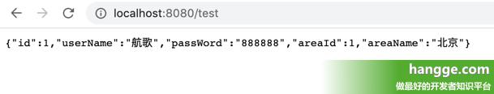

##### 2、使用 @One 注解实现一对一关联

（1）这里我们对 **User** 实体类稍作修改，这次不再是增加 **areaName** 属性，而是直接增加 **area** 关联对象：

```java
@Data
public class User {
    //指定主键使用数据库ID自增策略
    @TableId(type = IdType.AUTO)
    private Integer id;
    private String userName;
    private String passWord;
    private Integer areaId;
    @TableField(exist = false)
    private Area area;
}
```

（2）我们对 **UserMapper** 做如下修改，使用 **@Results** 注解来映射查询结果集到实体类属性：

>提示：
>
>- 当我们需要通过查询到的一个字段值作为参数，去执行另外一个方法来查询关联的内容，而且两者是一对一关系时，可以使用 **@One** 注解来便捷的实现。
>- **selectById** 方法是 **BaseMapper** 就提供的，所以我们不需要在 **AreaMapper** 中手动定义。
>- **@Result(column = "area_id", property = "areaId")** 可以不写，也不会报错。但是会导致我们查询结果（**User** 实体）的 **areaId** 属性没有值（因为第二个 **Result** 将 **area_id** 值作为查询条件传入子查询）。

```java
public interface UserMapper extends BaseMapper<User> {
    @Results({
            @Result(column = "area_id", property = "areaId"),
            @Result(column = "area_id", property = "area",
                    one = @One(select = "com.example.demo.mapper.AreaMapper.selectById"))
    })
    @Select("SELECT * FROM user WHERE id = #{id}")
    User getUserById(int id);
}
```

（3）最后调用这个方法测试一下：

```java
@RestController
public class HelloController {
 
    @Autowired
    UserMapper userMapper;
 
    @RequestMapping("/test")
    public User test(){
        User user = userMapper.getUserById(1);
        return user;
    }
}
```

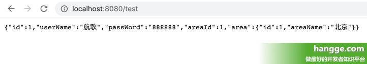

##### 3、使用 @Many 注解实现一对多关联

（1）假设我们需要查询一个区域及其下面的所有用户，首先对 **Area** 实体类稍作修改，增加 **users** 集合属性：

```java
@Data
public class Area {
    //指定主键使用数据库ID自增策略
    @TableId(type = IdType.AUTO)
    private Integer id;
    private String areaName;
    @TableField(exist = false)
    private List<User> users;
}
```

（2）我们对 **AreaMapper** 做如下修改，使用 **@Results** 注解来映射查询结果集到实体类属性：

>提示：
>
>- **@Many** 的用法与 **@One** 类似，只不过如果使用 **@One** 查询到的结果是多行，会抛出 **TooManyResultException** 异常，这种时候应该使用的是 **@Many** 注解，实现一对多的查询。
>- **@Result(column = "id", property = "id")** 可以不写，也不会报错。但是会导致我们查询结果（**Area** 实体）的 **id** 属性没有值（因为第二个 **Result** 将 **id** 值作为查询条件传入子查询）。

```java
public interface AreaMapper extends BaseMapper<Area> {
    @Results({
            @Result(column = "id", property = "id"),
            @Result(column = "id", property = "users",
                    many = @Many(select = "com.example.demo.mapper.UserMapper.selectByAreaId"))
    })
    @Select("SELECT * FROM area WHERE id = #{id}")
    Area getAreaById(int id);
}
```

（3）由于上面调用了 **UserMapper** 的 **selectByAreaId** 方法进行嵌套查询，因此 **UserMapper** 中要添加该方法：

```java
public interface UserMapper extends BaseMapper<User> {
    @Select("SELECT * FROM user WHERE area_id = #{areaId}")
    User selectByAreaId(int areaId);
}
```

（4）最后调用这个方法测试一下：

```java
@RestController
public class HelloController {
 
    @Autowired
    AreaMapper areaMapper;
 
    @RequestMapping("/test")
    public Area test(){
        Area area = areaMapper.getAreaById(1);
        return area;
    }
}
```

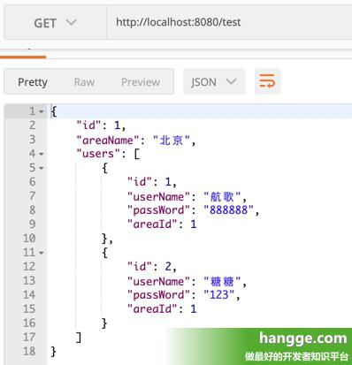


#### 多表关联查询（使用 xml 文件）

##### 1、自定义 sql

（1）假设我们有如下两张表：用户表（**User**）、区域表（**Area**）,其中用户表里通过 **area_id** 字段关联区域表的 **id** 主键：


（2）假设我们希望查询 **User** 时也能获取其所属的区域名称，这里对 **User** 实体类增加 **areaName** 属性：

> **提示**：由于 **area_name** 不是 **User** 数据库表里的字段，因此需要添加 **@TableField** 注解，并将 **exist** 属性设置为 **false**。

```java
@Data
public class User {
    //指定主键使用数据库ID自增策略
    @TableId(type = IdType.AUTO)
    private Integer id;
    private String userName;
    private String passWord;
    private Integer areaId;
    @TableField(exist = false)
    private String areaName;
}
```

（3）然后在 **UserMapper** 中添加相关查询方法：

```java
public interface UserMapper extends BaseMapper<User> {
    User getUserById(int id);
}
```

（4）接着在 **UserMapper** 同一个文件夹下创建一个 **UserMapper.xml**，在里面编写对应的 **sql** 语句：

```xml
<?xml version="1.0" encoding="UTF-8" ?>
<!DOCTYPE mapper PUBLIC "-//mybatis.org//DTD Mapper 3.0//EN"
        "http://mybatis.org/dtd/mybatis-3-mapper.dtd">
<mapper namespace="com.example.demo.mapper.UserMapper">
    <resultMap type="com.example.demo.model.User" id="BaseResultMap">
    </resultMap>
    <select id="getUserById" resultMap="BaseResultMap">
            SELECT user.*, area.area_name FROM user, area
            WHERE user.area_id = area.id and user.id = #{id}
    </select>
</mapper>
```


（5）由于在 **Maven** 工程中，XML 配置文件建议写在 **resources** 目录下，但上面的 **UserMapper.xml** 文件写在包下，**Maven** 在运行时会忽略包下的 **XML** 文件。因此需要在 **pom.xml** 文件中重新指明资源文件位置，配置如下：

```xml
<build>
    <plugins>
        <plugin>
            <groupId>org.springframework.boot</groupId>
            <artifactId>spring-boot-maven-plugin</artifactId>
        </plugin>
    </plugins>
    <!-- 重新指明资源文件位置 -->
    <resources>
        <resource>
            <directory>src/main/java</directory>
            <includes>
                <include>**/*.xml</include>
            </includes>
        </resource>
        <resource>
            <directory>src/main/resources</directory>
        </resource>
    </resources>
</build>
```

（6）最后调用这个方法测试一下：

```java
@RestController
public class HelloController {
 
    @Autowired
    UserMapper userMapper;
 
    @RequestMapping("/test")
    public User test(){
        User user = userMapper.getUserById(1);
        return user;
    }
}
```


##### 2、实现一对一关联

（1）这里我们对 **User** 实体类稍作修改，这次不再是增加 **areaName** 属性，而是直接增加 **area** 关联对象：

```java
@Data
public class User {
    //指定主键使用数据库ID自增策略
    @TableId(type = IdType.AUTO)
    private Integer id;
    private String userName;
    private String passWord;
    private Integer areaId;
    @TableField(exist = false)
    private Area area;
}
```

（2）**UserMapper** 里代码同上面一样，主要对 **UserMapper.xml** 稍作修改，使用子查询来查询关联的区域：

>提示：
>
>- **selectById** 方法是 **BaseMapper** 本身就提供的，所以我们不需要在 **AreaMapper** 中手动定义。
>- **resultMap** 中的第一个 **result** 可以不写，也不会报错。但是会导致我们查询结果（**User** 实体）的 **areaId** 属性没有值（因为后面将 **area_id** 值作为查询条件传入子查询）。

```xml
<?xml version="1.0" encoding="UTF-8" ?>
<!DOCTYPE mapper PUBLIC "-//mybatis.org//DTD Mapper 3.0//EN"
        "http://mybatis.org/dtd/mybatis-3-mapper.dtd">
<mapper namespace="com.example.demo.mapper.UserMapper">
 
    <resultMap type="com.example.demo.model.User" id="BaseResultMap">
        <result property="areaId" column="area_id"/>
        <association property="area" column="area_id"
                     select="com.example.demo.mapper.AreaMapper.selectById"/>
    </resultMap>
 
    <select id="getUserById" resultMap="BaseResultMap">
        SELECT * FROM user WHERE id = #{id}
    </select>
 
</mapper>
```

（3）当然我们也可以使用嵌套结果集来实现相同的效果（嵌套结果集这种方式是单纯使用注解没法做到的）：

```xml
<?xml version="1.0" encoding="UTF-8" ?>
<!DOCTYPE mapper PUBLIC "-//mybatis.org//DTD Mapper 3.0//EN"
        "http://mybatis.org/dtd/mybatis-3-mapper.dtd">
<mapper namespace="com.example.demo.mapper.UserMapper">
 
    <resultMap type="com.example.demo.model.User" id="BaseResultMap">
        <result property="id" column="id"/>
        <result property="userName" column="user_name"/>
        <result property="passWord" column="pass_word"/>
        <result property="areaId" column="area_id"/>
        <association property="area">
            <id property="id" column="area_id"/>
            <result property="areaName" column="area_name"/>
        </association>
    </resultMap>
 
    <select id="getUserById" resultMap="BaseResultMap">
        SELECT user.*, area.area_name, area.id as area_id
        FROM user, area
        WHERE user.area_id = area.id and user.id = #{id}
    </select>
 
</mapper>
```

（4）最后调用这个方法测试一下：

```java
@RestController
public class HelloController {
 
    @Autowired
    UserMapper userMapper;
 
    @RequestMapping("/test")
    public User test(){
        User user = userMapper.getUserById(1);
        return user;
    }
}
```


##### 3、实现一对多关联

（1）假设我们需要查询一个区域及其下面的所有用户，首先对 **Area** 实体类稍作修改，增加 **users** 集合属性：

```java
@Data
public class Area {
    //指定主键使用数据库ID自增策略
    @TableId(type = IdType.AUTO)
    private Integer id;
    private String areaName;
    @TableField(exist = false)
    private List<User> users;
}
```

（2）我们对 **AreaMapper** 做如下修改，增加一个查询方法：

```java
public interface AreaMapper extends BaseMapper<Area> {
    Area getAreaById(int id);
}
```

（3）接着在 **AreaMapper** 同一个文件夹下创建一个 **AreaMapper.xml**，在里面编写对应的 **sql** 语句，这里我们使用嵌套查询来实现：

>**提示**：**<result property="id" column="id"/>** 可以不写，也不会报错。但是会导致我们查询结果（**Area** 实体）的 **id** 属性没有值（因为后面将 **id** 值作为查询条件传入子查询）。

```xml
<?xml version="1.0" encoding="UTF-8" ?>
<!DOCTYPE mapper PUBLIC "-//mybatis.org//DTD Mapper 3.0//EN"
        "http://mybatis.org/dtd/mybatis-3-mapper.dtd">
<mapper namespace="com.example.demo.mapper.AreaMapper">
 
    <resultMap type="com.example.demo.model.Area" id="BaseResultMap">
        <result property="id" column="id"/>
        <collection property="users" column="id"
                    select="com.example.demo.mapper.UserMapper.selectByAreaId"/>
    </resultMap>
 
    <select id="getAreaById" resultMap="BaseResultMap">
        SELECT * FROM area WHERE id = #{id}
    </select>
 
</mapper>
```


- 由于上面调用了 **UserMapper** 的 **selectByAreaId** 方法进行嵌套查询，因此 **UserMapper** 中要添加该方法：

```java
public interface UserMapper extends BaseMapper<User> {
    User selectByAreaId(int id);
}
```

- 对应的 **UserMapper.xml** 中也要增加相应的 **SQL** 语句：

```xml
<mapper namespace="com.example.demo.mapper.UserMapper">
 
    <resultMap type="com.example.demo.model.User" id="BaseResultMap">
    </resultMap>
 
    <select id="selectByAreaId" resultMap="BaseResultMap">
        SELECT * FROM user WHERE area_id = #{areaId}
    </select>
 
</mapper>
```

（4）当然，我还可以使用嵌套结果集来实现相同的效果（嵌套结果集这种方式是单纯使用注解没法做到的），**AreaMapper.xml** 代码如下（而 **UserMapper** 就不用像上面一样增加接口了）：

```java
<?xml version="1.0" encoding="UTF-8" ?>
<!DOCTYPE mapper PUBLIC "-//mybatis.org//DTD Mapper 3.0//EN"
        "http://mybatis.org/dtd/mybatis-3-mapper.dtd">
<mapper namespace="com.example.demo.mapper.AreaMapper">
 
    <resultMap type="com.example.demo.model.Area" id="BaseResultMap">
        <id property="id" column="id"/>
        <id property="areaName" column="area_name"/>
        <collection property="users" ofType="com.example.demo.model.User">
            <id property="id" column="user_id"/>
            <result property="userName" column="user_name"/>
            <result property="passWord" column="pass_word"/>
            <result property="areaId" column="area_id"/>
        </collection>
    </resultMap>
 
    <select id="getAreaById" resultMap="BaseResultMap">
        SELECT area.*, user.id as user_id, user.user_name, user.pass_word, user.area_id
        FROM area, user
        WHERE area.id = user.area_id AND area.id = #{id}
    </select>
 
</mapper>
```

（5）最后调用这个方法测试一下：

```java
@RestController
public class HelloController {
 
    @Autowired
    AreaMapper areaMapper;
 
    @RequestMapping("/test")
    public Area test(){
        Area area = areaMapper.getAreaById(1);
        return area;
    }
}
```


### MyBatis-Plus使用详解8（Mapper的CRUD接口5：增删改操作）

#### Mapper 的 CRUD 接口5：增删改操作

##### 1、新增数据

（1）**insert** 方法可以将一个实体对象插入到对应的数据表中：

```java
@RestController
public class HelloController {
 
    @Autowired
    AreaMapper areaMapper;
 
    @RequestMapping("/test")
    public void test(){
        Area area = new Area();
        area.setAreaName("成都");
        areaMapper.insert(area);
    }
}
```

（2）插入成功后，当前插入对象在数据库中的 **id** 会写回到该实体中： 

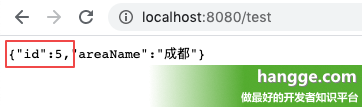

##### 2、删除数据

（1）**deleteById** 方法可以根据 **id** 删除一条记录：

```java
// 返回删除的记录数
int i = userInfoMapper.deleteById(4);
```

（2）**deleteBatchIds** 方法根据 **id** 批量删除：

```java
// 返回删除的记录数
int i = userInfoMapper.deleteBatchIds(Arrays.asList(4,5,6));
```

（3）**deleteByMap** 方法通过 **Map** 封装的条件删除记录：

>**注意**：**map** 写的是数据表中的列名，而非实体类的属性名。比如属性名为 **userName**，数据表中字段为 **user_name**，这里应该写的是 **user_name**。

```java
Map<String,Object> columnMap = new HashMap<>();
columnMap.put("user_name", "hangge");
columnMap.put("age", 22);
// 返回删除的记录数
int i = userInfoMapper.deleteByMap(columnMap);
```


（4）**delete** 方法使用查询构造器，删除记录：

```java
// 查询条件：名字中包含'ha'并且年龄小于40
LambdaQueryWrapper<UserInfo> queryWrapper = new LambdaQueryWrapper<>();
queryWrapper.like(UserInfo::getUserName,"ha").lt(UserInfo::getAge,40);
// 开始删除，返回删除的记录数
int i = userInfoMapper.delete(queryWrapper);
return i;
```

##### 3、修改数据

（1）**updateById** 方法根据实体对象中的 **ID** 进行修改：

**注意**：如果实体类某个属性为 **null**，不会更新该属性（不会把对应的数据库字段值设置为 **null**）

```java
UserInfo userInfo = new UserInfo();
userInfo.setId(3);
userInfo.setUserName("hangge");
userInfo.setPassWord("123");
// 开始修改，返回影响的记录数
int i = userInfoMapper.updateById(userInfo);
```

（2）**update** 方法可以实体对象封装操作类进行更新操作：

>（1）数据更新相关的构造器（UpdateWrapper、LambdaUpdateWrapper、LambdaUpdateChainWrapper）使用方法类似于查询构造器（QueryWrapper、LambdaQueryWrapper、LambdaQueryChainWrapper），不同的是它增加了如下两个方法：
>set：设置数据库字段值
>setSql：设置 set 部分的 sql
>（2）关于查询构造器（QueryWrapper、LambdaQueryWrapper、LambdaQueryChainWrapper）具体用法，可以查看我之前的文章：
>SpringBoot - MyBatis-Plus使用详解4（Mapper的CRUD接口1：基本查询）
>SpringBoot - MyBatis-Plus使用详解5（Mapper的CRUD接口2：条件构造器）

```java
// 查询条件：名字中包含'ha'并且年龄小于40
LambdaUpdateWrapper<UserInfo> updateWrapper = new LambdaUpdateWrapper<>();
updateWrapper.like(UserInfo::getUserName,"ha").lt(UserInfo::getAge,40);
// 将满足条件的记录密码都设置为8888
UserInfo userInfo = new UserInfo();
userInfo.setPassWord("8888");
// 开始修改，返回影响的记录数
int i = userInfoMapper.update(userInfo, updateWrapper);

```

- 我们也可以通过 **updateWrapper** 的 **set** 方法直接设置字段值，比如下面除了将密码设置为 **8888** 外，还将年龄设置为 **null**：

```java
// 查询条件：名字中包含'ha'并且年龄小于40
LambdaUpdateWrapper<UserInfo> updateWrapper = new LambdaUpdateWrapper<>();
updateWrapper.like(UserInfo::getUserName,"ha").lt(UserInfo::getAge,40)
        .set(UserInfo::getPassWord, "8888")
        .set(UserInfo::getAge, null);
// 开始修改，返回影响的记录数
int i = userInfoMapper.update(null, updateWrapper);
 
 
/*********** 二者可以结合使用的，下面效果等效于上面的 ****************/
 
// 查询条件：名字中包含'ha'并且年龄小于40
LambdaUpdateWrapper<UserInfo> updateWrapper = new LambdaUpdateWrapper<>();
updateWrapper.like(UserInfo::getUserName,"ha").lt(UserInfo::getAge,40)
        .set(UserInfo::getAge, null);
// 将满足条件的记录密码都设置为8888
UserInfo userInfo = new UserInfo();
userInfo.setPassWord("8888");
// 开始修改，返回影响的记录数
int i = userInfoMapper.update(userInfo, updateWrapper);
```

- 而也通过 **updateWrapper** 的 **setSql** 方法可以直接设置 **set** 部分的 **sql**，下面的效果同上面是一样的：

  ```java
  // 查询条件：名字中包含'ha'并且年龄小于40
  LambdaUpdateWrapper<UserInfo> updateWrapper = new LambdaUpdateWrapper<>();
  updateWrapper.like(UserInfo::getUserName,"ha").lt(UserInfo::getAge,40)
          .setSql("pass_word = '8888'")
          .setSql("age = null");
  // 开始修改，返回影响的记录数
  int i = userInfoMapper.update(null, updateWrapper);
   
  /*********** 二者可以结合使用的，下面效果等效于上面的 ****************/
   
  // 查询条件：名字中包含'ha'并且年龄小于40
  LambdaUpdateWrapper<UserInfo> updateWrapper = new LambdaUpdateWrapper<>();
  updateWrapper.like(UserInfo::getUserName,"ha").lt(UserInfo::getAge,40)
          .setSql("age = null");
  // 将满足条件的记录密码都设置为8888
  UserInfo userInfo = new UserInfo();
  userInfo.setPassWord("8888");
  // 开始修改，返回影响的记录数
  int i = userInfoMapper.update(userInfo, updateWrapper);
  ```

  （3）上面每次编写完构造语句后都要将对象传递给 **mapper** 的 **update** 方法，比较麻烦，**MyBatisPlus** 提供了函数式编程方式：

  ```java
  boolean success = new LambdaUpdateChainWrapper<>(userInfoMapper)
          .like(UserInfo::getUserName,"ha")
          .lt(UserInfo::getAge,40)
          .set(UserInfo::getPassWord, "8888")
          .set(UserInfo::getAge, null)
          .update();
   
  /*********** 二者可以结合使用的，下面效果等效于上面的 ****************/
   
  UserInfo userInfo = new UserInfo();
  userInfo.setPassWord("8888");
  boolean success = new LambdaUpdateChainWrapper<>(userInfoMapper)
          .like(UserInfo::getUserName,"ha")
          .lt(UserInfo::getAge,40)
          .set(UserInfo::getAge, null)
          .update(userInfo);
  ```

  下面是结合 **setSql** 使用：

  ```java
  boolean success = new LambdaUpdateChainWrapper<>(userInfoMapper)
          .like(UserInfo::getUserName,"ha")
          .lt(UserInfo::getAge,40)
          .setSql("pass_word = '8888'")
          .setSql("age = null")
          .update();
   
  /*********** 二者可以结合使用的，下面效果等效于上面的 ****************/
   
  UserInfo userInfo = new UserInfo();
  userInfo.setPassWord("8888");
  boolean success = new LambdaUpdateChainWrapper<>(userInfoMapper)
          .like(UserInfo::getUserName,"ha")
          .lt(UserInfo::getAge,40)
          .setSql("age = null")
          .update(userInfo);
  ```


### MyBatis-Plus使用详解9（Service的CRUD接口1：基本查询）

通常来说，我们会将具体的业务逻辑封装在 **service** 层中（一般会有个 **interface** 类以及具体的实现）。而 **MyBatis-Plus** 为我们提供了个 **IService** 接口，里面封装了通用 **Service CRUD** 操作。

>  通常来说，我们会将具体的业务逻辑封装在 **service** 层中（一般会有个 **interface** 类以及具体的实现）。而 **MyBatis-Plus** 为我们提供了个 **IService** 接口，里面封装了通用 **Service CRUD** 操作。

#### Service 的 CRUD 接口1：基本查询

##### 1、准备工作

（1）假设我们有如下用户信息表 **user_info**：

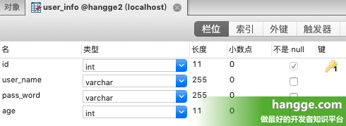

（2）首先创建对应的实体类 **UserInfo**：

```java
@Data
public class UserInfo {
    private Integer id;
    private String userName;
    private String passWord;
    private Integer age;
}
```

（3）接着创建 **UserInfoMapper** 接口，并继承 **BaseMapper** 接口，就可以使用 **Mapper** 的各种 **CRUD** 方法了。

```java
public interface UserInfoMapper extends BaseMapper<UserInfo> {
}
```

（4）最后我们继承 **IService** 创建 **Serivice** 接口，并创建对应的实现类，这样便可以使用 **Servive** 的各种 **CRUD** 方法了：

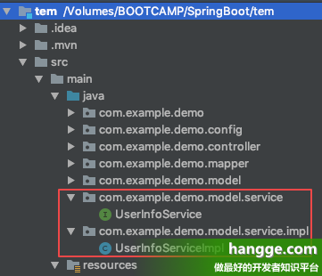


- **UserInfoService** 接口代码如下：

```java
public interface UserInfoService extends IService<UserInfo> {
}
```

- **UserInfoServiceImpl** 实现类代码如下：

```java
@Service("userInfoService")
public class UserInfoServiceImpl extends ServiceImpl<UserInfoMapper, UserInfo>
        implements UserInfoService {
}
```

##### 2、getById（根据 id 查询一条记录）

```java
@RestController
public class HelloController {
 
    @Autowired
    UserInfoService userInfoService;
 
    @RequestMapping("/test")
    public UserInfo test(){
        // 根据id查询数据
        UserInfo user = userInfoService.getById(1);
        return user;
    }
}
```

##### 3、getOne（使用查询构造器，查询一条记录）

```java
关于查询条件构造器（QueryWrapper、LambdaQueryWrapper、LambdaQueryChainWrapper）的详细用法可以参考我之前写的文章：
SpringBoot - MyBatis-Plus使用详解4（Mapper的CRUD接口1：基本查询）
SpringBoot - MyBatis-Plus使用详解5（Mapper的CRUD接口2：条件构造器）
```

```java
// 查询条件：名字中包含'ha'并且年龄小于40
LambdaQueryWrapper<UserInfo> queryWrapper = new LambdaQueryWrapper<>();
queryWrapper.like(UserInfo::getUserName,"ha").lt(UserInfo::getAge,40);
// 开始查询符合的单条记录（如果满足条件的记录有多条，那就不能用这个方法，会报错。）
UserInfo user = userInfoService.getOne(queryWrapper);
```

- 前面编写完条件构造语句后需要要将对象传递给 **service** 的 **getOne** 方法，比较麻烦。我们同样可以通过链式的方式进行调用：

```java
UserInfo user = userInfoService.lambdaQuery()
        .like(UserInfo::getUserName,"ha")
        .lt(UserInfo::getAge,40)
        .one();
```

##### 4、getMap（使用查询构造器，查询一条记录，返回的是 Map）

 **getMap** 的用法和上面的 **getOne** 很像，都是传入一个查询构造器进行查询。不同的是 **getMap** 返回的是一个 **Map**，而不是实体类对象：

>**注意**： **Map** 里的 **key** 为表字段名，而不是对应实体类的属性名。

```java
// 查询条件：名字中包含'ha'并且年龄小于40
LambdaQueryWrapper<UserInfo> queryWrapper = new LambdaQueryWrapper<>();
queryWrapper.like(UserInfo::getUserName,"ha").lt(UserInfo::getAge,40);
// 开始查询符合的单条记录（如果满足条件的记录有多条，那就不能用这个方法，会报错。）
Map<String, Object> user = userInfoService.getMap(queryWrapper);
```


##### 5、getObj（使用查询构造器，查询一条记录，返回这条记录的第一个字段值）

**getObj** 的用法和上面的 **getOne** 很像，都是传入一个查询构造器进行查询。不同的是 **getObj** 返回的是一个字段值（该方法第二个参数是转换函数，必填）：

```java
// 查询条件：名字中包含'ha'并且年龄小于40
LambdaQueryWrapper<UserInfo> queryWrapper = new LambdaQueryWrapper<>();
queryWrapper.like(UserInfo::getUserName,"ha").lt(UserInfo::getAge,40);
// 开始查询符合的单条记录的第一个字段值
Integer id = userInfoService.getObj(queryWrapper, (o) -> {
    return Integer.parseInt(o.toString());
});
System.out.println(id);
```

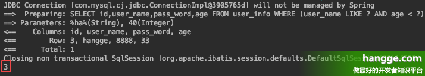


##### 6、listByIds（根据 ID 批量查询，返回一个 List）

```java
List<UserInfo> users = userInfoService.listByIds(Arrays.asList(1,2,3));
```

##### 7、listByMap（通过 Map 封装的条件查询，返回一个 List）

>**注意**：**map** 写的是数据表中的列名，而非实体类的属性名。比如属性名为 **userName**，数据表中字段为 **user_name**，这里应该写的是 **user_name**。

```java
Map<String,Object> columnMap = new HashMap<>();
columnMap.put("user_name", "hangge");
columnMap.put("age", 22);
List<UserInfo> users = userInfoService.listByMap(columnMap);

```

##### 8、list（使用查询构造器，返回一个 List）

（1）**list** 方法如果参数为空，则查询所有的数据：

```java
// 查询所有数据
List<UserInfo> users = userInfoService.list();
```

（2）**list** 方法也可以传入查询条件构造器进行查询：

```java
// 查询条件：名字中包含'ha'并且年龄小于40
LambdaQueryWrapper<UserInfo> queryWrapper = new LambdaQueryWrapper<>();
queryWrapper.like(UserInfo::getUserName,"ha").lt(UserInfo::getAge,40);
// 开始查询
List<UserInfo> users = userInfoService.list(queryWrapper);
```

- 前面编写完条件构造语句后需要要将对象传递给 **service** 的 **list** 方法，比较麻烦。我们同样可以通过链式的方式进行调用：

```java
List<UserInfo> users = userInfoService.lambdaQuery()
        .like(UserInfo::getUserName,"ha")
        .lt(UserInfo::getAge,40)
        .list();
```


##### 9、listMaps（使用查询构造器，返回一个 List）

>**listMaps** 的用法和上面的 **list** 很像，都是传入一个查询构造器进行查询，然后返回一个 **List**。不同在于 **listMaps** 返回的 **List** 里面是 **Map**。
>    **注意**： **Map** 里的 **key** 为表字段名，而不是对应实体类的属性名。

（1）**listMaps** 方法如果参数为空，则查询所有的数据：

```java
List<Map<String, Object>> users = userInfoService.listMaps();
System.out.println(users);
```


（2）**listMaps** 方法也可以传入查询条件构造器进行查询：

```java
// 查询条件：名字中包含'ha'并且年龄小于40
LambdaQueryWrapper<UserInfo> queryWrapper = new LambdaQueryWrapper<>();
queryWrapper.like(UserInfo::getUserName,"ha").lt(UserInfo::getAge,40);
// 开始查询
List<Map<String, Object>> users = userInfoService.listMaps(queryWrapper);
```

##### 10，listObjs（使用查询构造器，返回一个 List<object>）

**listObjs** 的用法和前面的 **list** 很像，都是传入一个查询构造器进行查询，然后返回一个 **List**。不同在于 **listObjs** 返回的 **List** 里面只有返每条结果的第一个字段值。

（1）**listObjs** 方法如果参数为空，则查询所有的数据：

```java
List<Object> users = userInfoService.listObjs();
System.out.println(users);
```

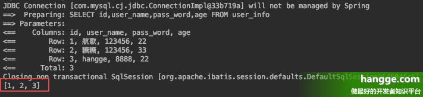

- 我们还可以传入个自定义的转换函数：

```
List<Object> users = userInfoService.listObjs((o) -> {
    ``return` `"用户"` `+ o.toString();
});
```

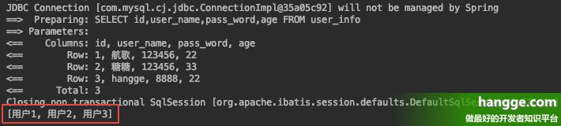

（2）**listObjs** 方法也可以传入查询条件构造器进行查询：

```java
// 查询条件：名字中包含'ha'并且年龄小于40
LambdaQueryWrapper<UserInfo> queryWrapper = new LambdaQueryWrapper<>();
queryWrapper.like(UserInfo::getUserName,"ha").lt(UserInfo::getAge,40);
// 开始查询
List<Object> users = userInfoService.listObjs(queryWrapper);
```

- 我们同样可以再传入个自定义的转换函数：

```java
// 查询条件：名字中包含'ha'并且年龄小于40
LambdaQueryWrapper<UserInfo> queryWrapper = new LambdaQueryWrapper<>();
queryWrapper.like(UserInfo::getUserName,"ha").lt(UserInfo::getAge,40);
// 开始查询
List<String> users = userInfoService.listObjs(queryWrapper,(o) -> {
    return "用户" + o.toString();
});
```

##### 11，count（使用查询构造器，查询总记录数）

（1）**count** 方法如果参数为空，则查询所有数据的记录数：

```java
Integer count = userInfoService.count();
System.out.println(count);
```

（2）**count** 方法也可以传入查询条件构造器进行查询：

```java
// 查询条件：名字中包含'ha'并且年龄小于40
LambdaQueryWrapper<UserInfo> queryWrapper = new LambdaQueryWrapper<>();
queryWrapper.like(UserInfo::getUserName,"ha").lt(UserInfo::getAge,40);
//开始根据条件查询总记录
Integer count = userInfoService.count(queryWrapper);
System.out.println(count);
```


#### 添加自己定义的方法

（1）假设我们 **UserInfoService** 接口中需要增加一个返回所有年轻人的方法：

```java
public interface UserInfoService extends IService<UserInfo> {
    List<UserInfo> getAllYoungPeople();
}
```

（2）对应的实现类 **UserInfoServiceImpl** 中内容如下。**注意**：由于该 **Service** 本身对应的 **Mapper** 就是 **UserInfoMapper**，我们直接使用 **baseMapper** 接口进行查询即可：

```java
@Service("userInfoService")
public class UserInfoServiceImpl extends ServiceImpl<UserInfoMapper, UserInfo>
        implements UserInfoService {
    public List<UserInfo> getAllYoungPeople() {
        return new LambdaQueryChainWrapper<>(baseMapper)
                .lt(UserInfo::getAge,40)
                .list();
    }
}
```

​	（3）如果需要使用其他的 **Mapper** 的话，我们就需要先注入在使用了：

```java
@Service("bookService")
public class UserInfoServiceImpl extends ServiceImpl<UserInfoMapper, UserInfo>
        implements UserInfoService {
 
    @Resource
    private AreaMapper areaMapper;
 
    public List<UserInfo> getAllYoungPeople() {
        return new LambdaQueryChainWrapper<>(baseMapper)
                .lt(UserInfo::getAge,40)
                .list();
    }
}
```


### MyBatis-Plus使用详解13（代码生成器）

> **AutoGenerator** 是 **MyBatis-Plus** 的代码生成器，通过 **AutoGenerator** 可以快速生成 **Entity**、**Mapper**、**Mapper XML**、**Service、Controller** 等各个模块的代码，极大的提升了开发效率。

#### 代码生成器

##### 1、添加依赖

要使用代码生成器，项目除了要添加数据库驱动依赖外，还需添加代码生成器以及模板引擎依赖。

```xml
<!-- 数据库驱动依赖 -->
<dependency>
    <groupId>mysql</groupId>
    <artifactId>mysql-connector-java</artifactId>
</dependency>
<!-- 代码生成器依赖 -->
<dependency>
    <groupId>com.baomidou</groupId>
    <artifactId>mybatis-plus-generator</artifactId>
    <version>3.3.1.tmp</version>
</dependency>
<!-- 模板引擎依赖 -->
<dependency>
    <groupId>org.apache.velocity</groupId>
    <artifactId>velocity-engine-core</artifactId>
    <version>2.2</version>
</dependency>
```

##### 2、开始生成代码

（1）这里我们选择创建一个测试类，里面内容如下：

 	>**提示**：具体的配置可以根据项目不同自行修改，尤其注意高亮部分。

```java
public class CodeGenerator {
 
    @Test
    public void startGenerator() {
        //1、全局配置
        GlobalConfig config = new GlobalConfig();
        String projectPath = System.getProperty("user.dir");
        config.setActiveRecord(true)//开启AR模式
                .setAuthor("hangge")//设置作者
                .setOutputDir(projectPath + "/src/main/java")//生成路径(一般在此项目的src/main/java下)
                .setFileOverride(true)//第二次生成会把第一次生成的覆盖掉
                .setOpen(true)//生成完毕后是否自动打开输出目录
                //.setSwagger2(true)//实体属性 Swagger2 注解
                .setIdType(IdType.AUTO)//主键策略
                .setServiceName("%sService")//生成的service接口名字首字母是否为I，这样设置就没有I
                .setBaseResultMap(true)//生成resultMap
                .setBaseColumnList(true);//在xml中生成基础列
        //2、数据源配置
        DataSourceConfig dataSourceConfig = new DataSourceConfig();
        dataSourceConfig.setDbType(DbType.MYSQL)//数据库类型
                .setDriverName("com.mysql.jdbc.Driver")
                .setUrl("jdbc:mysql://localhost:3306/hangge2")
                .setUsername("root")
                .setPassword("hangge1234");
        //3、策略配置
        StrategyConfig strategyConfig = new StrategyConfig();
        strategyConfig.setCapitalMode(true)//开启全局大写命名
                .setNaming(NamingStrategy.underline_to_camel)//表名映射到实体的命名策略(下划线到驼峰)
                //表字段映射属性名策略(未指定按naming)
                .setColumnNaming(NamingStrategy.underline_to_camel)
                //.setTablePrefix("tb_")//表名前缀
                //.setSuperEntityClass("你自己的父类实体,没有就不用设置!")
                //.setSuperEntityColumns("id");//写于父类中的公共字段
                //.setSuperControllerClass("自定义继承的Controller类全称，带包名,没有就不用设置!")
                .setRestControllerStyle(true) //生成 @RestController 控制器
                .setEntityLombokModel(true)//使用lombok
                .setInclude("user_info","area");//逆向工程使用的表
        //4、包名策略配置
        PackageConfig packageConfig = new PackageConfig();
        packageConfig.setParent("com.example.demo")//设置包名的parent
                .setMapper("mapper")
                .setService("service")
                .setController("controller")
                .setEntity("entity")
                .setXml("mapper");//设置xml文件的目录
        //5、整合配置
        AutoGenerator autoGenerator = new AutoGenerator();
        autoGenerator.setGlobalConfig(config)
                .setDataSource(dataSourceConfig)
                .setStrategy(strategyConfig)
                .setPackageInfo(packageConfig);
        //6、执行
        autoGenerator.execute();
    }
}
```

（2）运行该 **junit** 测试：

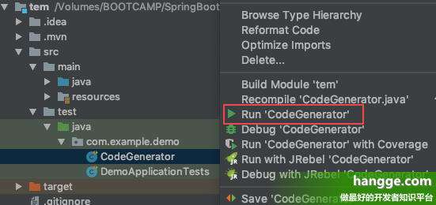

（3）代码执行成功后，便会自动生成 entity、mapper 接口、mapper 的 xml 文件、service、serviceImpl、controller代码：

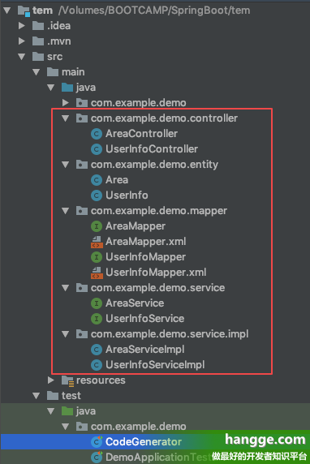