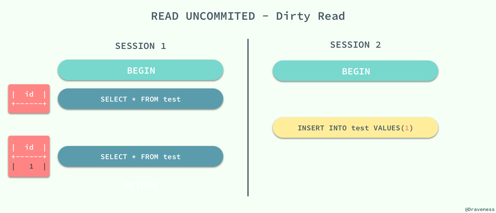
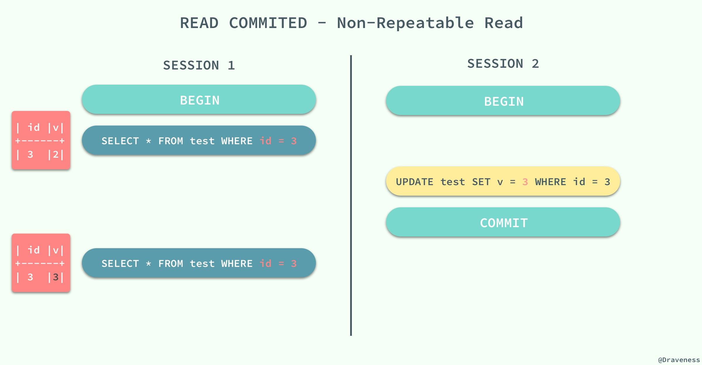
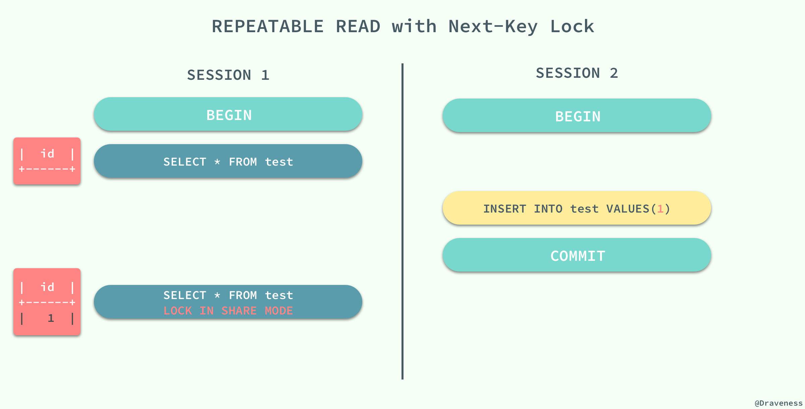
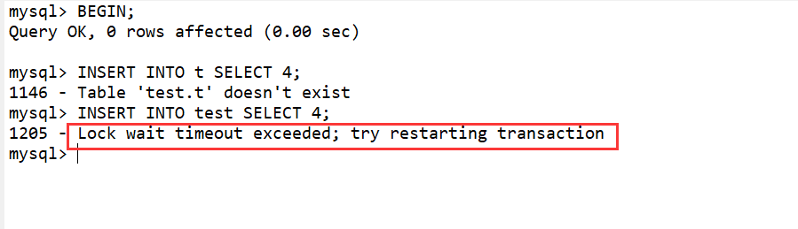

# InnoDB 存储引擎


## InnoDB 锁和事务模型


### InnoDB事务模型


#### 事务隔离级别

事务隔离是数据库处理的基础之一。[隔离是缩写ACID](https://dev.mysql.com/doc/refman/8.0/en/glossary.html#glos_acid)中的 I ；隔离级别是当多个事务同时进行更改和执行查询时，可微调性能与结果的可靠性、一致性和可重复性之间的平衡的设置。

`ISO 和 ANSI SQL 标准制定了四种事务隔离级别，而 InnoDB 遵循了 SQL:1992 标准中的四种隔离级别：`READ UNCOMMITED`、`READ COMMITED`、`REPEATABLE READ` 和 `SERIALIZABLE`；每个事务的隔离级别其实都比上一级多解决了一个问题：

- `RAED UNCOMMITED`：使用查询语句不会加锁，可能会读到未提交的行（Dirty Read）；
- `READ COMMITED`：只对记录加记录锁，而不会在记录之间加间隙锁，所以允许新的记录插入到被锁定记录的附近，所以再多次使用查询语句时，可能得到不同的结果（Non-Repeatable Read）；
- `REPEATABLE READ`：多次读取同一范围的数据会返回第一次查询的快照，不会返回不同的数据行，但是可能发生幻读（Phantom Read）；
- `SERIALIZABLE`：InnoDB 隐式地将全部的查询语句加上共享锁，解决了幻读的问题；

MySQL 中默认的事务隔离级别就是 `REPEATABLE READ`，但是它通过 Next-Key 锁也能够在某种程度上解决幻读的问题。


下面的列表描述了 MySQL 如何支持不同的事务级别。该列表从最常用的级别到最不使用的级别。


- **REPEATABLE READ**

  InnoDB 的默认隔离级别。 同一事务内的 一致读取会读取第一次读取建立的快照。这意味着，如果您SELECT 在同一事务中发出多个普通（非锁定）语句，这些 SELECT语句彼此之间也是一致的。请参见 第 15.7.2.3 节“一致的非锁定读取”。

  对于锁定读取 （SELECT使用FOR UPDATE或FOR SHARE）、 UPDATE和 DELETE语句，锁定取决于该语句是使用具有唯一搜索条件的唯一索引，还是使用范围类型搜索条件。

  - 对于具有唯一搜索条件的唯一索引， InnoDB仅锁定找到的索引记录，而不锁定 其之前的 间隙。


  - 对于其他搜索条件，InnoDB 锁定扫描的索引范围，使用 间隙锁或 next-key locks 来阻止其他会话插入该范围所覆盖的间隙。

  

- **READ COMMITTED**

   每个一致读取，即使在同一事务中，也会设置并读取其自己的最新快照。有关一致性读取的信息，请参阅 第 15.7.2.3 节“一致性非锁定读取”。

  对于锁定读取（SELECT 使用FOR UPDATE或FOR SHARE）、UPDATE 语句和DELETE 语句，InnoDB仅锁定索引记录，而不锁定它们之前的间隙，从而允许在锁定记录旁边自由插入新记录。间隙锁定仅用于外键约束检查和重复键检查。

  由于间隙锁定被禁用，因此可能会出现幻像行问题，因为其他会话可以将新行插入间隙中。

- **READ UNCOMMITTED**

   SELECT 语句是以非锁定方式执行的，但可能会使用记录的早期版本。因此，使用这种隔离级别，这种读取是不一致的。这也被称为 "脏读"。否则，该隔离级别的工作方式与 READ COMMITTED 类似。

- **SERIALIZABLE**


接下来，我们将数据库中创建如下的表并通过个例子来展示在不同的事务隔离级别之下，会发生什么样的问题：

```sql
CREATE TABLE test(
    id INT NOT NULL,
    UNIQUE(id)
);
```


#### 脏读

> 在一个事务中，读取了其他事务未提交的数据。

当事务的隔离级别为 `READ UNCOMMITED` 时，我们在 `SESSION 2` 中插入的**未提交**数据在 `SESSION 1` 中是可以访问的。




#### 不可重复读

> 在一个事务中，同一行记录被访问了两次却得到了不同的结果。

当事务的隔离级别为 `READ COMMITED` 时，虽然解决了脏读的问题，但是如果在 `SESSION 1` 先查询了**一行**数据，在这之后 `SESSION 2` 中修改了同一行数据并且提交了修改，在这时，如果 `SESSION 1` 中再次使用相同的查询语句，就会发现两次查询的结果不一样。



不可重复读的原因就是，在 `READ COMMITED` 的隔离级别下，存储引擎不会在查询记录时添加行锁，锁定 `id = 3` 这条记录。


#### 幻读

> 在一个事务中，同一个范围内的记录被读取时，其他事务向这个范围添加了新的记录。

重新开启了两个会话 `SESSION 1` 和 `SESSION 2`，在 `SESSION 1` 中我们查询全表的信息，没有得到任何记录；在 `SESSION 2` 中向表中插入一条数据并提交；由于 `REPEATABLE READ` 的原因，再次查询全表的数据时，我们获得到的仍然是空集，但是在向表中插入同样的数据却出现了错误。


这种现象在数据库中就被称作幻读，虽然我们使用查询语句得到了一个空的集合，但是插入数据时却得到了错误，好像之前的查询是幻觉一样。

在标准的事务隔离级别中，幻读是由更高的隔离级别 `SERIALIZABLE` 解决的，但是它也可以通过 MySQL 提供的 Next-Key 锁解决：



`REPEATABLE READ` 和 `READ UNCOMMITED` 其实是矛盾的，如果保证了前者就看不到已经提交的事务，如果保证了后者，就会导致两次查询的结果不同，MySQL 为我们提供了一种折中的方式，能够在 `REPEATABLE READ` 模式下加锁访问已经提交的数据，其本身并不能解决幻读的问题，而是通过文章前面提到的 Next-Key 锁来解决。


#### 实验

**REPEATABLE READ隔离级别下**

表 test 由1、2、5 这三个值组成

| 时间 | 会话A                                       | 会话B                      |
| ---- | ------------------------------------------- | -------------------------- |
| 1    | BEGIN;                                      | BEGIN;                     |
| 2    | SELECT * FROM test WHERE id > 2 FOR UPDATE; |                            |
| 3    |                                             | INSERT INTO test SELECT 4; |

会话B 在时间3 执行  INSERT INTO test SELECT 4;会锁超时



**InnoDB 存储引擎采用 Next-key Locking 的算法避免 Phantom Problem。对于上述的SQL语句 SELECT * FROM test WHERE id > 2 FOR UPDATE; 其锁住的不是5这单个值，而是对（2，+∞）这个范围加了X锁。因此任何对于这个范围的插入都是不被允许的，从而避免Phantom Problem。**


**READ COMMITTED隔离级别下**

同样

| 时间 | 会话A                                       | 会话B                      |
| ---- | ------------------------------------------- | -------------------------- |
| 1    | BEGIN;                                      | BEGIN;                     |
| 2    | SELECT * FROM test WHERE id > 2 FOR UPDATE; |                            |
| 3    |                                             | INSERT INTO test SELECT 4; |
| 4    |                                             | COMMIT;                    |
| 5    | SELECT * FROM test WHERE id > 2 FOR UPDATE; |                            |

逆天的是  INSERT INTO test SELECT 4; 执行成功了。好家伙，Phantom Problem 了。

