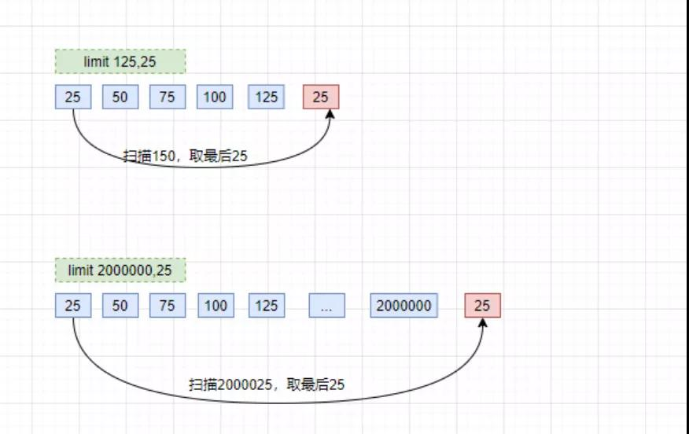

# 1次亿级数据分页优化

线上的一个查询数据的接口被疯狂的失去理智般的调用，这个操作直接导致线上的 MySQL 集群被拖慢了。

好吧，这问题算是严重了，下了地铁匆匆赶到家，开电脑，跟同事把 Pinpoint 上的慢查询日志捞出来。

看到一个很奇怪的查询，如下：

```
POST  domain/v1.0/module/method?order=condition&orderType=desc&offset=1800000&limit=500 
```

domain、module 和 method 都是化名，代表接口的域、模块和实例方法名，后面的 offset 和 limit 代表分页操作的偏移量和每页的数量。

也就是说该同学是在翻第(1800000/500+1=3601)页。初步捞了一下日志，发现有 8000 多次这样调用。

这太神奇了，而且我们页面上的分页单页数量也不是 500，而是 25 条每页，这个绝对不是人为的在功能页面上进行一页一页的翻页操作，而是数据被刷了(说明下，我们生产环境数据有 1 亿+)。

详细对比日志发现，很多分页的时间是重叠的，对方应该是多线程调用。

通过对鉴权的 Token 的分析，基本定位了请求是来自一个叫做 ApiAutotest 的客户端程序在做这个操作，也定位了生成鉴权 Token 的账号来自一个 QA 的同学。立马打电话给同学，进行了沟通和处理。

## 分析

其实对于我们的 MySQL 查询语句来说，整体效率还是可以的，该有的联表查询优化都有，该简略的查询内容也有，关键条件字段和排序字段该有的索引也都在。

问题在于他一页一页的分页去查询，查到越后面的页数，扫描到的数据越多，也就越慢。

我们在查看前几页的时候，发现速度非常快，比如 limit 200，25，瞬间就出来了。

但是越往后，速度就越慢，特别是百万条之后，卡到不行，那这个是什么原理呢。

先看一下我们翻页翻到后面时，查询的 SQL 是怎样的：

```
select * from t_name where c_name1='xxx' order by c_name2 limit 2000000,25; 
```

这种查询的慢，其实是因为 limit 后面的偏移量太大导致的。比如像上面的 limit 2000000，25。

这个等同于数据库要扫描出 2000025 条数据，然后再丢弃前面的 20000000 条数据，返回剩下 25 条数据给用户，这种取法明显不合理。



大家翻看《高性能 MySQL》第六章“查询性能优化”，对这个问题有过说明：

分页操作通常会使用 limit 加上偏移量的办法实现，同时再加上合适的 order by 子句。但这会出现一个常见问题：当偏移量非常大的时候，它会导致 MySQL 扫描大量不需要的行然后再抛弃掉。


## 数据模拟

那好，了解了问题的原理，那就要试着解决它了。涉及数据敏感性，我们这边模拟一下这种情况，构造一些数据来做测试。

①创建两个表：员工表和部门表。

```
/*部门表,存在则进行删除 */ 
drop table if EXISTS dep; 
create table dep( 
    id int unsigned primary key auto_increment, 
    depno mediumint unsigned not null default 0, 
    depname varchar(20) not null default "", 
    memo varchar(200) not null default "" 
); 
 
/*员工表,存在则进行删除*/ 
drop table if EXISTS emp; 
create table emp( 
    id int unsigned primary key auto_increment, 
    empno mediumint unsigned not null default 0, 
    empname varchar(20) not null default "", 
    job varchar(9) not null default "", 
    mgr mediumint unsigned not null default 0, 
    hiredate datetime not null, 
    sal decimal(7,2) not null, 
    comn decimal(7,2) not null, 
    depno mediumint unsigned not null default 0 
);
```

②创建两个函数：生成随机字符串和随机编号。

复制

```
/* 产生随机字符串的函数*/ 
DELIMITER $ 
drop FUNCTION if EXISTS rand_string; 
CREATE FUNCTION rand_string(n INT) RETURNS VARCHAR(255) 
BEGIN 
    DECLARE chars_str VARCHAR(100) DEFAULT 'abcdefghijklmlopqrstuvwxyzABCDEFGHIJKLMNOPQRSTUVWXYZ'; 
    DECLARE return_str VARCHAR(255) DEFAULT ''; 
    DECLARE i INT DEFAULT 0; 
    WHILE i < n DO 
    SET return_str = CONCAT(return_str,SUBSTRING(chars_str,FLOOR(1+RAND()*52),1)); 
    SET i = i+1; 
    END WHILE; 
    RETURN return_str; 
END $ 
DELIMITER; 
 
 
/*产生随机部门编号的函数*/ 
DELIMITER $ 
drop FUNCTION if EXISTS rand_num; 
CREATE FUNCTION rand_num() RETURNS INT(5) 
BEGIN 
    DECLARE i INT DEFAULT 0; 
    SET i = FLOOR(100+RAND()*10); 
    RETURN i; 
END $ 
DELIMITER; 
```

③编写存储过程，模拟 500W 的员工数据。

```
/*建立存储过程：往emp表中插入数据*/ 
DELIMITER $ 
drop PROCEDURE if EXISTS insert_emp; 
CREATE PROCEDURE insert_emp(IN START INT(10),IN max_num INT(10)) 
BEGIN 
    DECLARE i INT DEFAULT 0; 
    /*set autocommit =0 把autocommit设置成0，把默认提交关闭*/ 
    SET autocommit = 0; 
    REPEAT 
    SET i = i + 1; 
    INSERT INTO emp(empno,empname,job,mgr,hiredate,sal,comn,depno) VALUES ((START+i),rand_string(6),'SALEMAN',0001,now(),2000,400,rand_num()); 
    UNTIL i = max_num 
    END REPEAT; 
    COMMIT; 
END $ 
DELIMITER; 
/*插入500W条数据*/ 
call insert_emp(0,5000000); 
```

④编写存储过程，模拟 120 的部门数据。

```
/*建立存储过程：往dep表中插入数据*/ 
DELIMITER $ 
drop PROCEDURE if EXISTS insert_dept; 
CREATE PROCEDURE insert_dept(IN START INT(10),IN max_num INT(10)) 
BEGIN 
    DECLARE i INT DEFAULT 0; 
    SET autocommit = 0; 
    REPEAT 
    SET i = i+1; 
    INSERT  INTO dep( depno,depname,memo) VALUES((START+i),rand_string(10),rand_string(8)); 
    UNTIL i = max_num 
    END REPEAT; 
    COMMIT; 
END $ 
DELIMITER; 
/*插入120条数据*/ 
call insert_dept(1,120); 
```

⑤建立关键字段的索引，这边是跑完数据之后再建索引，会导致建索引耗时长，但是跑数据就会快一些。

```
/*建立关键字段的索引:排序、条件*/ 
CREATE INDEX idx_emp_id ON emp(id); 
CREATE INDEX idx_emp_depno ON emp(depno); 
CREATE INDEX idx_dep_depno ON dep(depno); 
```


## 测试

测试数据：

```
/*偏移量为100，取25*/ 
SELECT a.empno,a.empname,a.job,a.sal,b.depno,b.depname 
from emp a left join dep b on a.depno = b.depno order by a.id desc limit 100,25; 
/*偏移量为4800000，取25*/ 
SELECT a.empno,a.empname,a.job,a.sal,b.depno,b.depname 
from emp a left join dep b on a.depno = b.depno order by a.id desc limit 4800000,25; 
```

执行结果：

```
[SQL] 
SELECT a.empno,a.empname,a.job,a.sal,b.depno,b.depname 
from emp a left join dep b on a.depno = b.depno order by a.id desc limit 100,25; 
受影响的行: 0 
时间: 0.001s 
[SQL] 
SELECT a.empno,a.empname,a.job,a.sal,b.depno,b.depname 
from emp a left join dep b on a.depno = b.depno order by a.id desc limit 4800000,25; 
受影响的行: 0 
时间: 12.275s 
```

因为扫描的数据多，所以这个明显不是一个量级上的耗时。


## 解决方案

**①使用索引覆盖+子查询优化**

因为我们有主键 id，并且在上面建了索引，所以可以先在索引树中找到开始位置的 id 值，再根据找到的 id 值查询行数据。

```
/*子查询获取偏移100条的位置的id，在这个位置上往后取25*/ 
SELECT a.empno,a.empname,a.job,a.sal,b.depno,b.depname 
from emp a left join dep b on a.depno = b.depno 
where a.id >= (select id from emp order by id limit 100,1) 
order by a.id limit 25; 
 
/*子查询获取偏移4800000条的位置的id，在这个位置上往后取25*/ 
SELECT a.empno,a.empname,a.job,a.sal,b.depno,b.depname 
from emp a left join dep b on a.depno = b.depno 
where a.id >= (select id from emp order by id limit 4800000,1) 
order by a.id limit 25; 
```

执行结果，执行效率相比之前有大幅的提升：

```
[SQL] 
SELECT a.empno,a.empname,a.job,a.sal,b.depno,b.depname 
from emp a left join dep b on a.depno = b.depno 
where a.id >= (select id from emp order by id limit 100,1) 
order by a.id limit 25; 
受影响的行: 0 
时间: 0.106s 
 
[SQL] 
SELECT a.empno,a.empname,a.job,a.sal,b.depno,b.depname 
from emp a left join dep b on a.depno = b.depno 
where a.id >= (select id from emp order by id limit 4800000,1) 
order by a.id limit 25; 
受影响的行: 0 
时间: 1.541s 
```


**②起始位置重定义**

记住上次查找结果的主键位置，避免使用偏移量 offset：

复制

```
/*记住了上次的分页的最后一条数据的id是100，这边就直接跳过100，从101开始扫描表*/ 
SELECT a.id,a.empno,a.empname,a.job,a.sal,b.depno,b.depname 
from emp a left join dep b on a.depno = b.depno 
where a.id > 100 order by a.id limit 25; 
 
/*记住了上次的分页的最后一条数据的id是4800000，这边就直接跳过4800000，从4800001开始扫描表*/ 
SELECT a.id,a.empno,a.empname,a.job,a.sal,b.depno,b.depname 
from emp a left join dep b on a.depno = b.depno 
where a.id > 4800000 
order by a.id limit 25; 
```

执行结果：

```
[SQL] 
SELECT a.id,a.empno,a.empname,a.job,a.sal,b.depno,b.depname 
from emp a left join dep b on a.depno = b.depno 
where a.id > 100 order by a.id limit 25; 
受影响的行: 0 
时间: 0.001s 
 
[SQL] 
SELECT a.id,a.empno,a.empname,a.job,a.sal,b.depno,b.depname 
from emp a left join dep b on a.depno = b.depno 
where a.id > 4800000 
order by a.id limit 25; 
受影响的行: 0 
时间: 0.000s 
```

这个效率是最好的，无论怎么分页，耗时基本都是一致的，因为他执行完条件之后，都只扫描了 25 条数据。

但是有个问题，只适合一页一页的分页，这样才能记住前一个分页的最后 Id。

如果用户跳着分页就有问题了，比如刚刚刷完第 25 页，马上跳到 35 页，数据就会不对。

这种的适合场景是类似百度搜索或者腾讯新闻那种滚轮往下拉，不断拉取不断加载的情况。这种延迟加载会保证数据不会跳跃着获取。


**③降级策略**

看了网上一个阿里的 DBA 同学分享的方案：配置 limit 的偏移量和获取数一个最大值，超过这个最大值，就返回空数据。

因为他觉得超过这个值你已经不是在分页了，而是在刷数据了，如果确认要找数据，应该输入合适条件来缩小范围，而不是一页一页分页。

这个跟我同事的想法大致一样：request 的时候，如果 offset 大于某个数值就先返回一个 4xx 的错误。

## 小结

当晚我们应用上述第三个方案，对 offset 做一下限流，超过某个值，就返回空值。第二天使用第一种和第二种配合使用的方案对程序和数据库脚本进一步做了优化。

合理来说做任何功能都应该考虑极端情况，设计容量都应该涵盖极端边界测试。

另外，该有的限流、降级也应该考虑进去。比如工具多线程调用，在短时间频率内 8000 次调用，可以使用计数服务判断并反馈用户调用过于频繁，直接给予断掉。