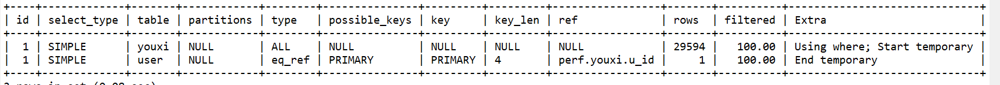

# MySQL调优

注意：以上是基于MySQL 5.7


## 优化SQL语句


### 优化子查询、派生表和视图引用


#### 使用物化优化子查询

优化器使用物化来实现更高效的子查询处理。物化通过将子查询结果生成为临时表（通常在内存中）来加速查询执行。MySQL 第一次需要子查询结果时，会将结果具体化到临时表中。以后任何时候需要结果时，MySQL 都会再次引用临时表。优化器可以使用哈希索引对表进行索引，以使查找快速且廉价。索引包含唯一值以消除重复并使表更小。

子查询实现在可能的情况下使用内存中的临时表，如果表变得太大，则回退到磁盘存储。请参见 [第 8.4.4 节，“MySQL 中内部临时表的使用”](https://dev.mysql.com/doc/refman/8.0/en/internal-temporary-tables.html)。

如果不使用物化，优化器有时会将不相关子查询重写为相关子查询。例如，以下子`IN`查询是不相关的（*where_condition* 仅涉及 from`t2`和 not 的 列`t1`）：

```sql
SELECT * FROM t1
WHERE t1.a IN (SELECT t2.b FROM t2 WHERE where_condition);
```

优化器可能会将其重写为 `EXISTS`相关子查询：

```sql
SELECT * FROM t1
WHERE EXISTS (SELECT t2.b FROM t2 WHERE where_condition AND t1.a=t2.b);
```

使用临时表的子查询实现可以避免此类重写，并且可以仅执行子查询一次，而不是外部查询的每行执行一次。

为了在 MySQL 中使用子查询实现，必须启用 optimizer_switch 系统变量[`materialization`](https://dev.mysql.com/doc/refman/5.7/en/switchable-optimizations.html#optflag_materialization) 标志。

启用该 [`materialization`](https://dev.mysql.com/doc/refman/5.7/en/switchable-optimizations.html#optflag_materialization)标志后，物化适用于出现在任意位置（在选择列表中、`WHERE`、 `ON`、`GROUP BY`、 `HAVING`或`ORDER BY`）的子查询谓词，对于属于以下任何用例的谓词：

- *oe_i*当没有外部表达式或内部表达式 *ie_i*可为空 时，谓词具有这种形式 。*N*是1或更大。

```sql
(oe_1, oe_2, ..., oe_N) [NOT] IN (SELECT ie_1, i_2, ..., ie_N ...)
```

- 谓词具有这种形式，当存在单个外部表达式 oe 和内部表达式 ie 时。这些表达式可以是可为空的。

```sql
oe [NOT] IN (SELECT ie ...)
```

- 谓词是IN或NOT IN，并且UNKNOWN（NULL）的结果与FALSE的结果具有相同的含义。


以下示例说明了对UNKNOWN和FALSE谓词评估等效性要求如何影响是否可以使用子查询物化。假设where_condition仅涉及来自t2而不是t1的列，因此子查询是非相关的。

这个查询需要进行物化处理：

```sql
SELECT * FROM t1
WHERE t1.a IN (SELECT t2.b FROM t2 WHERE where_condition);
```

在这里，IN谓词返回UNKNOWN或FALSE并不重要。无论哪种情况，来自t1的行都不会包含在查询结果中。

一个不使用子查询材料化的示例是下面的查询，其中t2.b是一个可为空的列：

```sql
SELECT * FROM t1
WHERE (t1.a,t1.b) NOT IN (SELECT t2.a,t2.b FROM t2
                          WHERE where_condition);
```

**以下限制适用于子查询物化的使用：**

- 内部和外部表达式的类型必须匹配。例如，如果两个表达式都是整数或都是小数，优化器可能能够使用物化，但如果一个表达式是整数而另一个是小数，则无法使用。

- 内部表达式不能是 [`BLOB`](https://dev.mysql.com/doc/refman/5.7/en/blob.html)。

在查询中使用[`EXPLAIN`](https://dev.mysql.com/doc/refman/5.7/en/explain.html)可以表明优化器是否使用子查询实现：

- 与不使用具体化的查询执行相比，`select_type`可能会从`DEPENDENT SUBQUERY`变为 `SUBQUERY`。这表明，对于每个外部行执行一次的子查询，具体化使子查询仅执行一次。


**对应示例**

在用户游戏示例中，执行如下sql

```sql
SELECT * FROM user
WHERE user.id IN (SELECT youxi.u_id FROM youxi);
```

查看执行计划如下


当我禁用 materialization  标志后，查询慢了很多，执行计划如下。




#### 使用 EXISTS 策略优化子查询

某些优化适用于使用 IN（或 =ANY）操作符来测试子查询结果的比较。本节讨论了这些优化，特别是关于 NULL 值所带来的挑战。讨论的最后部分提供了如何帮助优化器的建议。

考虑以下子查询比较：

```sql
outer_expr IN (SELECT inner_expr FROM ... WHERE subquery_where)
```

MySQL对查询进行“由外向内”的评估。也就是说，它首先获取外部表达式outer_expr的值，然后运行子查询并捕获其生成的行。

一种非常有用的优化是“告知”子查询，唯一感兴趣的行是那些内部表达式inner_expr等于outer_expr的行。这是通过将适当的等式条件下推到子查询的WHERE子句中以使其更加限制性来实现的。转换后的比较如下所示：

```sql
EXISTS (SELECT 1 FROM ... WHERE subquery_where AND outer_expr=inner_expr)
```

MySQL对查询进行“由外向内”的评估。也就是说，它首先获取外部表达式outer_expr的值，然后运行子查询并捕获其生成的行。

一种非常有用的优化是“告知”子查询，唯一感兴趣的行是那些内部表达式inner_expr等于outer_expr的行。这是通过将适当的等式条件下推到子查询的WHERE子句中以使其更加限制性来实现的。转换后的比较如下所示：

```sql
(oe_1, ..., oe_N) IN
  (SELECT ie_1, ..., ie_N FROM ... WHERE subquery_where)
```

Becomes:

```sql
EXISTS (SELECT 1 FROM ... WHERE subquery_where
                          AND oe_1 = ie_1
                          AND ...
                          AND oe_N = ie_N)
```

为简单起见，以下讨论假设存在单一的外部和内部表达式值对。

刚刚描述的转换有其限制性。只有在忽略可能的 NULL 值时，它才有效。也就是说，只要以下两个条件同时成立，“下推”策略才适用：

- outer_expr 和 inner_expr 不能为 NULL。

- 您无需区分 NULL 和 FALSE 的子查询结果。如果子查询是 WHERE 子句中 OR 或 AND 表达式的一部分，MySQL 假设您不关心这一点。另一个优化器注意到 NULL 和 FALSE 子查询结果无需区分的示例是这个结构。


说真的，你给我看迷糊了！！！！！


####  通过合并或物化优化派生表和视图引用


优化器可以使用两种策略处理派生表引用（也适用于视图引用）：

- 将派生表合并到外部查询块中
- 将派生表具体化为内部临时表

示例1：

```sql
SELECT * FROM (SELECT * FROM t1) AS derived_t1;
```

通过合并派生表 `derived_t1`，该查询的执行类似于：

```sql
SELECT * FROM t1;
```


示例2：

```sql
SELECT *
  FROM t1 JOIN (SELECT t2.f1 FROM t2) AS derived_t2 ON t1.f2=derived_t2.f1
  WHERE t1.f1 > 0;
```

合并派生表 derived_t2后，执行的查询类似于

```sql
SELECT t1.*, t2.f1
  FROM t1 JOIN t2 ON t1.f2=t2.f1
  WHERE t1.f1 > 0;
```

使用物化（materialization）时，derived_t1 和 derived_t2 都被视为各自查询中的单独表。

优化器以相同的方式处理派生表和视图引用：它尽可能避免不必要的物化，从而能够将条件从外部查询下推到派生表并生成更高效的执行计划。


## 优化索引


## 调优示例

### 用户游戏示例


表sql 如下,表中各插入三万条数据

```sql
用户表
CREATE TABLE `user` (
  `id` int(11) NOT NULL,
  `name` varchar(255) DEFAULT NULL,
  `agent_id` int(11) DEFAULT NULL,
  `status` int(11) DEFAULT NULL,
  `is_vip` int(11) DEFAULT NULL,
  PRIMARY KEY (`id`)
) ENGINE=InnoDB DEFAULT CHARSET=utf8mb4;

游戏表
CREATE TABLE `youxi` (
  `id` int(11) NOT NULL,
  `u_id` int(11) DEFAULT NULL,
  `income` decimal(10,2) DEFAULT NULL,
  PRIMARY KEY (`id`)
) ENGINE=InnoDB DEFAULT CHARSET=utf8mb4;
```


从user表中获取所有下级用户信息，并从youxi表中统计所有下级用户当日游戏记录获得的收入，最后按统计的收入由高到低排序。 很自然的写下了如下的简单语句：

```sql
--记为SQL1
explain SELECT u.`id`,SUM(yx.`income`) `total`,u.`name`
FROM `user` `u`
LEFT JOIN `youxi` `yx`
ON `u`.`id`=yx.u_id 
GROUP BY `u`.`id`
ORDER BY `total` DESC,`u`.`id` DESC
```

简单的说就是一名用户可以有多个下级，每个下级可以有多条游戏记录；由于在本地测试时仅添加了几位下级及游戏记录，因此并没有发现存在性能问题（毫秒级），但放到线上生产环境时，仅是几万的记录数据和几千的下级，加上服务器负载吧，这条语句竟耗时40几s左右，用workbench查看了下执行计划：


#### 为什么这么慢及解决方案

这条语句竟耗时50s左右，使用 explain 查看执行计划

| ID   | SELECT_TYPE | TABLE | PARTITIONS | TYPE | POSSIBLE_KEYS | KEY    | KEY_LEN | REF    | ROWS  | FILTERED | EXTRA                                              |
| :--- | :---------- | :---- | :--------- | :--- | :------------ | :----- | :------ | :----- | :---- | :------- | :------------------------------------------------- |
| 1    | SIMPLE      | u     | (NULL)     | ALL  | PRIMARY       | (NULL) | (NULL)  | (NULL) | 29391 | 100.00   | Using temporary; Using filesort                    |
| 1    | SIMPLE      | yx    | (NULL)     | ALL  | (NULL)        | (NULL) | (NULL)  | (NULL) | 29594 | 100.00   | Using where; Using join buffer (Block Nested Loop) |


**首先看到我们使用到了join ,就要思考此处可不可以使用 join**

我们看到 EXTRA 列 有 (Block Nested Loop)，说明 被驱动表上没有可用的索引，可以看到在这个过程中，对u和yx表都做了一次全表扫描，因此总的扫描行数是6万行左右，总共需要在内存中做的判断次数是：30000 * 30000=9亿次。


**因此我们可以在yx表给 u_id 添加索引**

添加后我们执行相同sql，此时sql 耗时5s左右，查看执行计划如下

| ID   | SELECT_TYPE | TABLE | PARTITIONS | TYPE  | POSSIBLE_KEYS | KEY     | KEY_LEN | REF       | ROWS  | FILTERED | EXTRA                           |
| :--- | :---------- | :---- | :--------- | :---- | :------------ | :------ | :------ | :-------- | :---- | :------- | :------------------------------ |
| 1    | SIMPLE      | u     | (NULL)     | index | PRIMARY       | PRIMARY | 4       | (NULL)    | 29391 | 100.00   | Using temporary; Using filesort |
| 1    | SIMPLE      | yx    | (NULL)     | ref   | u_id          | u_id    | 5       | test.u.id | 1     | 100.00   |                                 |

注意  Extra为null表示查询的列未被索引覆盖，且where筛选条件是索引的前导列，这意味着用到了索引，但是部分字段未被索引覆盖，必须通过“回表”来实现。

u 表 type 为index:  index 对索引表进行全扫描，这样做的好处是不再需要对数据进行排序，但是开销依然很大(回表)，从EXTRA 列也能佐证。

yx表 type 为ref:  ref 根据索引查找一个或多个值


**可以看出上面sql 没有使用到 索引覆盖**

修改sql实现索引覆盖

```sql
explain SELECT u.`id`,SUM(yx.`income`) `total`
FROM `user` `u`
LEFT JOIN `youxi` `yx`
ON `u`.`id`=yx.u_id 
GROUP BY `u`.`id`
ORDER BY `u`.`id` DESC
```

此时sql 耗时3s左右，查看执行计划如下

| ID   | SELECT_TYPE | TABLE | PARTITIONS | TYPE  | POSSIBLE_KEYS | KEY     | KEY_LEN | REF       | ROWS  | FILTERED | EXTRA       |
| :--- | :---------- | :---- | :--------- | :---- | :------------ | :------ | :------ | :-------- | :---- | :------- | :---------- |
| 1    | SIMPLE      | u     | (NULL)     | index | PRIMARY       | PRIMARY | 4       | (NULL)    | 29391 | 100.00   | Using index |
| 1    | SIMPLE      | yx    | (NULL)     | ref   | u_id          | u_id    | 5       | test.u.id | 1     | 100.00   |             |

继续修改sql 使yx 表也实现索引覆盖

```sql
explain SELECT u.`id`
FROM `user` `u`
LEFT JOIN `youxi` `yx`
ON `u`.`id`=yx.u_id 
GROUP BY `u`.`id`
ORDER BY `u`.`id` DESC
```

此时sql 耗时1s多左右，查看执行计划如下

| ID   | SELECT_TYPE | TABLE | PARTITIONS | TYPE  | POSSIBLE_KEYS | KEY     | KEY_LEN | REF       | ROWS  | FILTERED | EXTRA       |
| :--- | :---------- | :---- | :--------- | :---- | :------------ | :------ | :------ | :-------- | :---- | :------- | :---------- |
| 1    | SIMPLE      | u     | (NULL)     | index | PRIMARY       | PRIMARY | 4       | (NULL)    | 29391 | 100.00   | Using index |
| 1    | SIMPLE      | yx    | (NULL)     | ref   | u_id          | u_id    | 5       | test.u.id | 1     | 100.00   | Using index |


~~临时表~~

explain SELECT u.`id`,SUM(yx.`income`) `total`,u.`name`
FROM `user` `u`
LEFT JOIN `youxi` `yx`
ON `u`.`id`=yx.u_id 
GROUP BY `u`.`id`
ORDER BY `total` DESC,`u`.`id` DESC


**优化子查询、派生表和视图引用**

我们通过给yx 表添加索引，优化执行 join 语句的算法，使得sql 耗时从50s 优化到5s左右，又通过覆盖索引，使得sql 耗时从 5s 优化到1s多。

**可以不使用上面那些我们添加的优化方式，让MySQ的优化器替我们优化吗？有，那就是使将派生表材料化为内部临时表（Materialize the derived table to an internal temporary table）**

修改sql

```sql
--记为SQL2
SELECT u.`id`, u.`name`,yx.`total`
FROM `user` `u`
LEFT JOIN (
SELECT u_id,SUM(income) `total`
FROM `youxi`
GROUP BY u_id
) yx
ON `u`.`id`=yx.u_id
ORDER BY `total` DESC,`u`.`id` DESC
```

此时sql 耗时5s左右，Explain结果如下：

| ID   | SELECT_TYPE | TABLE      | PARTITIONS | TYPE | POSSIBLE_KEYS | KEY         | KEY_LEN | REF       | ROWS  | FILTERED | EXTRA                           |
| :--- | :---------- | :--------- | :--------- | :--- | :------------ | :---------- | :------ | :-------- | :---- | :------- | :------------------------------ |
| 1    | PRIMARY     | u          | (NULL)     | ALL  | (NULL)        | (NULL)      | (NULL)  | (NULL)    | 29391 | 100.00   | Using temporary; Using filesort |
| 1    | PRIMARY     | <derived2> | (NULL)     | ref  | <auto_key0>   | <auto_key0> | 5       | test.u.id | 10    | 100.00   | Using where                     |
| 2    | DERIVED     | yx         | (NULL)     | ALL  | NULL          | (NULL)      | (NULL)  | (NULL)    | 29594 | 100.00   | Using temporary; Using filesort |

可以使用上面的索引覆盖的方式优化至1s 左右，此处暂且略过。


**LIMIT 查询优化**

如果只需要从结果集中获取指定数量的记录，请在查询中使用 LIMIT 子句，而不是获取整个结果集并丢弃多余的数据。

修改sql

```sql
SELECT u.`id`,SUM(yx.`income`) `total`,u.`name`
FROM `user` `u`
LEFT JOIN `youxi` `yx`
ON `u`.`id`=yx.u_id 
GROUP BY `u`.`id`
ORDER BY `total` DESC,`u`.`id` DESC
LIMIT 0,8
```

此时sql 耗时0.3s左右，Explain结果如下：

| ID   | SELECT_TYPE | TABLE | PARTITIONS | TYPE  | POSSIBLE_KEYS | KEY     | KEY_LEN | REF       | ROWS  | FILTERED | EXTRA                           |
| :--- | :---------- | :---- | :--------- | :---- | :------------ | :------ | :------ | :-------- | :---- | :------- | :------------------------------ |
| 1    | SIMPLE      | u     | (NULL)     | index | PRIMARY       | PRIMARY | 4       | (NULL)    | 29391 | 100.00   | Using temporary; Using filesort |
| 1    | SIMPLE      | yx    | (NULL)     | ref   | u_id          | u_id    | 5       | test.u.id | 1     | 100.00   |                                 |

如果去掉 total 排序

修改sql

```sql
SELECT u.`id`,SUM(yx.`income`) `total`,u.`name`
FROM `user` `u`
LEFT JOIN `youxi` `yx`
ON `u`.`id`=yx.u_id 
GROUP BY `u`.`id`
ORDER BY `u`.`id` DESC
LIMIT 0,8
```

此时sql 耗时0.3s左右（区别不大，暂时忽略），Explain结果如下：

| ID   | SELECT_TYPE | TABLE | PARTITIONS | TYPE  | POSSIBLE_KEYS | KEY     | KEY_LEN | REF       | ROWS | FILTERED | EXTRA |
| :--- | :---------- | :---- | :--------- | :---- | :------------ | :------ | :------ | :-------- | :--- | :------- | :---- |
| 1    | SIMPLE      | u     | (NULL)     | index | PRIMARY       | PRIMARY | 4       | (NULL)    | 8    | 100.00   |       |
| 1    | SIMPLE      | yx    | (NULL)     | ref   | u_id          | u_id    | 5       | test.u.id | 1    | 100.00   |       |

注意：如果没有添加索引，此处的limit 优化sql 耗时是没有效果的。

**长话短说**

**文件排序算法：如果索引不能用于满足ORDER BY子句，MySQL将使用文件排序算法。这是一个非常有趣的算法。其它略。**

**MySQL ORDER BY 背后的智能算法** 

- **如果数据无法放入内存，则外部归并排序（快速排序+归并排序）**
- **快速排序，如果数据适合内存并且我们想要全部数据**
- **堆排序，如果数据适合内存但我们使用 LIMIT 只获取一些结果**
- **索引查找（不完全是排序算法，只是预先计算的二叉树）**

> 借助 EXPLAIN 语句，我们可以查看查询是否使用文件排序或索引。


**最终：sql耗时从 50s 优化到 0.3s（返回3万条数据的sql）**

