# 								mysql 调优实战


## **1. order by limit分页数据重复问题**

这个问题相信不少人都遇到过，但很少有人追根溯源。今天我抽出一点时间，来讨论讨论 order by + limit 在什么情况下会出现分页数据重复。

排序离不开算法，在关系型数据库中，往往会存在多种排序算法。通过 MySQL 的源码和官方文档介绍可以得知，它的排序规律可以总结如下：

- **当 order by 不能使用索引进行排序时，将使用排序算法进行排序；**
- **若排序内容能全部放入内存，则仅在内存中使用快速排序；**

- **若排序内容不能全部放入内存，则分批次将排好序的内容放入文件，然后将多个文件进行归并排序；**
- **若排序中包含 limit 语句，则使用堆排序优化排序过程。**

其他如：PG，MariaDB，AliSQL，SQL Server 等排序算法方面差别不大。

根据上面的总结，当你的 order by limit 分页出现数据重复。比如，一个用户表，当使用 limit 5 后出现一个张三。再使用 limit 5,10 的时候，张三又出现了。注意，这两个张三是同一个人，id 是相同的。在这种情况下，你的 order by 肯定是没有使用索引的。因为使用了索引，就会进行索引排序。

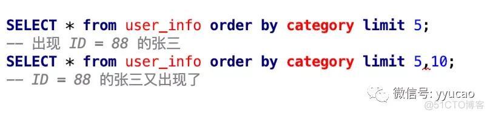

根据官方文档显示，以及我上面的总结，可以得出。上面的 SQL 使用了堆排序。因为，category 没索引，所以没走索引排序；其二我们使用了 limit，所以最终使用了堆排序。而了解算法的朋友都知道，堆排序是不稳定的。

比如，我们现在有下面一列数。


为了，看清两个 2 的区别，我分别给它们多标了一个数字。

那么使用堆排序的结果，可能会存在下面的结果。


这种不稳定性，指的就是多次排序后，各个数的相对位置发生了变化。

除了堆排序，不稳定的排序还有下面这些排序算法。

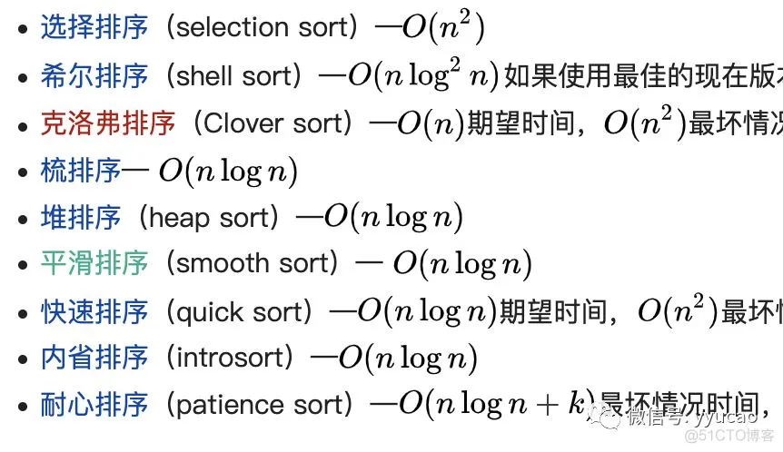

那么如何解决 order by limit 分页数据重复问题呢？方法有多种，我这里列举最常用的两种方法。

第一种就是，在排序中加上唯一值，比如主键 id，这样由于 id 是唯一的，就能确保参与排序的 key 值不相同。


第二种就是避免使用堆排序，让 order by 根据索引来排序。说白了，就是 order by 后面的字段要有索引。

以上，知道的越多，不知道的就越多，业余的就像一棵小草一样！


## 2. explain


### possible_keys 

possible_keys 字段表示可能用到的索引；


### key 

key 字段表示实际用的索引，如果这一项为 NULL，说明没有使用索引；


### key_len

key_len 表示索引的长度；


### rows

rows 表示扫描的数据行数。


### type

type 表示数据扫描类型。

type 字段就是描述了找到所需数据时使用的扫描方式是什么，常见扫描类型的**执行效率从低到高的顺序为**：

- All（全表扫描）；
- index（全索引扫描）；
- range（索引范围扫描）；
- ref（非唯一索引扫描）；
- eq_ref（唯一索引扫描）；
- const（结果只有一条的主键或唯一索引扫描）。

在这些情况里，all 是最坏的情况，因为采用了全表扫描的方式。index 和 all 差不多，只不过 index 对索引表进行全扫描，这样做的好处是不再需要对数据进行排序，但是开销依然很大。所以，要尽量避免全表扫描和全索引扫描。

range 表示采用了索引范围扫描，一般在 where 子句中使用 < 、>、in、between 等关键词，只检索给定范围的行，属于范围查找。**从这一级别开始，索引的作用会越来越明显，因此我们需要尽量让 SQL 查询可以使用到 range 这一级别及以上的 type 访问方式**。

ref 类型表示采用了非唯一索引，或者是唯一索引的非唯一性前缀，返回数据返回可能是多条。因为虽然使用了索引，但该索引列的值并不唯一，有重复。这样即使使用索引快速查找到了第一条数据，仍然不能停止，要进行目标值附近的小范围扫描。但它的好处是它并不需要扫全表，因为索引是有序的，即便有重复值，也是在一个非常小的范围内扫描。

eq_ref 类型是使用主键或唯一索引时产生的访问方式，通常使用在多表联查中。比如，对两张表进行联查，关联条件是两张表的 user_id 相等，且 user_id 是唯一索引，那么使用 EXPLAIN 进行执行计划查看的时候，type 就会显示 eq_ref。

const 类型表示使用了主键或者唯一索引与常量值进行比较，比如 select name from product where id=1。

需要说明的是 const 类型和 eq_ref 都使用了主键或唯一索引，不过这两个类型有所区别，**const 是与常量进行比较，查询效率会更快，而 eq_ref 通常用于多表联查中**。


### Extra

在 MySQL 的执行计划中，**Extra** 列是用来显示一些额外信息的。

测试表结构

```sql
create table test_order
(
    id int auto_increment primary key,
    user_id int,
    order_id int,
    order_status tinyint,
    create_date datetime
);

create table test_orderdetail
(
    id int auto_increment primary key,
    order_id int,
    product_name varchar(100),
    cnt int,
    create_date datetime
);

create index idx_userid_order_id_createdate on test_order(user_id,order_id,create_date);

create index idx_orderid_productname on test_orderdetail(order_id,product_name);
```

测试数据（50W）

```sql
CREATE DEFINER=`root`@`%` PROCEDURE `test_insertdata`(IN `loopcount` INT)
    LANGUAGE SQL
    NOT DETERMINISTIC
    CONTAINS SQL
    SQL SECURITY DEFINER
    COMMENT ''
BEGIN
    declare v_uuid  varchar(50);
    while loopcount>0 do
        set v_uuid = uuid();
        insert into test_order (user_id,order_id,order_status,create_date) values (rand()*1000,id,rand()*10,DATE_ADD(NOW(), INTERVAL - RAND()*20000 HOUR));
        insert into test_orderdetail(order_id,product_name,cnt,create_date) values (rand()*100000,v_uuid,rand()*10,DATE_ADD(NOW(), INTERVAL - RAND()*20000 HOUR));
        set loopcount = loopcount -1;
    end while;
END
```

Using index VS Using where Using index

```
首先，在"订单表"上，这里是一个多列复合索引
create index idx_userid_order_id_createdate on test_order(user_id,order_id,create_date);
```


#### Using filesort

Using filesort ：当查询语句中包含 group by 操作，而且无法利用索引完成排序操作的时候， 这时不得不选择相应的排序算法进行，甚至可能会通过文件排序，效率是很低的，所以要避免这种问题的出现。


##### 全字段排序

Extra 这个字段中的“Using filesort”表示的就是需要排序，MySQL 会给每个线程分配一块内存用于排序，称为 **sort_buffer**。

图中“按 name 排序”这个动作，可能在内存中完成，也可能需要使用外部排序，这取决于排序所需的内存和参数 sort_buffer_size。

sort_buffer_size，就是 MySQL 为排序开辟的内存（sort_buffer）的大小。如果要排序的数据量小于 sort_buffer_size，排序就在内存中完成。但如果排序数据量太大，内存放不下，则不得不利用磁盘临时文件辅助排序。


##### rowid 排序

在上面这个算法过程里面，只对原表的数据读了一遍，剩下的操作都是在 sort_buffer 和临时文件中执行的。但这个算法有一个问题，就是如果查询要返回的字段很多的话，那么 sort_buffer 里面要放的字段数太多，这样内存里能够同时放下的行数很少，要分成很多个临时文件，排序的性能会很差。

所以如果单行很大，这个方法效率不够好。

那么，**如果 MySQL 认为排序的单行长度太大会怎么做呢？**

接下来，我来修改一个参数，让 MySQL 采用另外一种算法。

```sql
SET max_length_for_sort_data = 16;
```

max_length_for_sort_data，是 MySQL 中专门控制用于排序的行数据的长度的一个参数。它的意思是，如果单行的长度超过这个值，MySQL 就认为单行太大，要换一个算法。


##### 全字段排序 VS rowid 排序

我们来分析一下，从这两个执行流程里，还能得出什么结论。

如果 MySQL 实在是担心排序内存太小，会影响排序效率，才会采用 rowid 排序算法，这样排序过程中一次可以排序更多行，但是需要再回到原表去取数据。

如果 MySQL 认为内存足够大，会优先选择全字段排序，把需要的字段都放到 sort_buffer 中，这样排序后就会直接从内存里面返回查询结果了，不用再回到原表去取数据。

这也就体现了 MySQL 的一个设计思想：**如果内存够，就要多利用内存，尽量减少磁盘访问。**

对于 InnoDB 表来说，rowid 排序会要求回表多造成磁盘读，因此不会被优先选择。

看到这里，你就了解了，MySQL 做排序是一个成本比较高的操作。那么你会问，是不是所有的 order by 都需要排序操作呢？如果不排序就能得到正确的结果，那对系统的消耗会小很多，语句的执行时间也会变得更短。

其实，并不是所有的 order by 语句，都需要排序操作的。从上面分析的执行过程，我们可以看到，MySQL 之所以需要生成临时表，并且在临时表上做排序操作，**其原因是原来的数据都是无序的。**

你可以设想下，如果能够保证从 city 这个索引上取出来的行，天然就是按照 name 递增排序的话，是不是就可以不用再排序了呢？

确实是这样的。

所以，我们可以在这个市民表上创建一个 city 和 name 的联合索引，对应的 SQL 语句是：

```sql
alter table t add index city_user(city, name);
```

作为与 city 索引的对比，我们来看看这个索引的示意图。


在这个索引里面，我们依然可以用树搜索的方式定位到第一个满足 city='杭州’的记录，并且额外确保了，接下来按顺序取“下一条记录”的遍历过程中，只要 city 的值是杭州，**name 的值就一定是有序的**。


#### Using temporary

Using temporary：使了用临时表保存中间结果，MySQL 在对查询结果排序时使用临时表，常见于排序 order by 和分组查询 group by。效率低，要避免这种问题的出现。


#### Using index

1，查询的列被索引覆盖，并且where筛选条件是索引的是前导列，Extra中为Using index

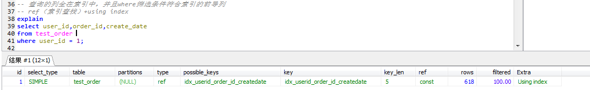


#### Using where Using index

1，查询的列被索引覆盖，并且where筛选条件是索引列之一但是不是索引的不是前导列，Extra中为Using where; Using index， 意味着无法直接通过索引查找来查询到符合条件的数据

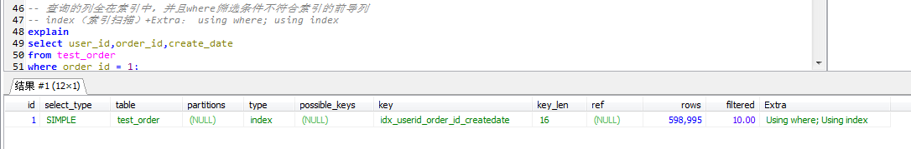

2，查询的列被索引覆盖，并且where筛选条件是索引列前导列的一个范围，同样意味着无法直接通过索引查找查询到符合条件的数据

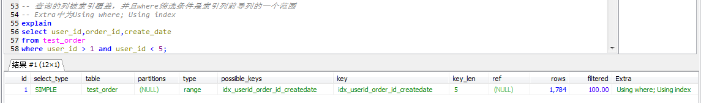


#### **NULL（既没有Using index，也没有Using where Using index，也没有using where）**

1，查询的列未被索引覆盖，并且where筛选条件是索引的前导列，意味着用到了索引，但是部分字段未被索引覆盖，必须通过“回表”来实现，不是纯粹地用到了索引，也不是完全没用到索引，Extra中为NULL(没有信息)

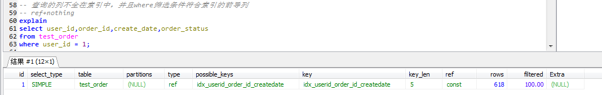


#### **Using where**

1，查询的列未被索引覆盖，where筛选条件非索引的前导列，Extra中为Using where

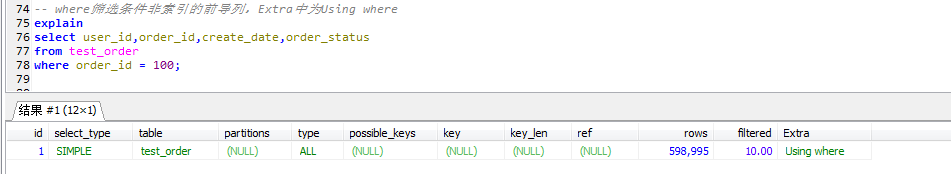

2，查询的列未被索引覆盖，where筛选条件非索引列，Extra中为Using where

 　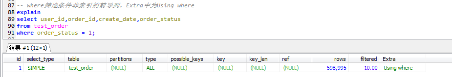

using where 意味着通过索引或者表扫描的方式进程where条件的过滤，反过来说，也就是没有可用的索引查找，当然这里也要考虑索引扫描+回表与表扫描的代价。这里的type都是all，说明MySQL认为全表扫描是一种比较低的代价。


#### Using index Condition

1，查询的列不全在索引中，where条件中是一个前导列的范围

　　**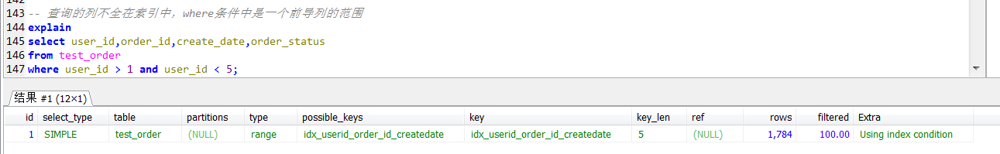**

2，查询列不完全被索引覆盖，查询条件完全可以使用到索引（进行索引查找）

　　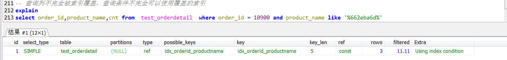

参考：MySQL · 特性分析 · Index Condition Pushdown (ICP)
using index conditoin 意味着查询列的某一部分无法直接使用索引
上述case1中，
如果禁用ICP（set optimizer_switch='index_condition_pushdown=off'），
执行计划是using where，意味着全表扫描，如果启用ICP，执行计划为using index Condition，意味着在筛选的过程中实现过滤。
上述case2中
第二个查询条件无法直接使用索引，隐含了一个查找+筛选的过程。
两个case的共同点就是无法直接使用索引。


#### Index Nested-Loop Join

**背景**

为了便于量化分析，我还是创建两个表 t1 和 t2 来和你说明。

```sql
CREATE TABLE `t2` (
  `id` int(11) NOT NULL,
  `a` int(11) DEFAULT NULL,
  `b` int(11) DEFAULT NULL,
  PRIMARY KEY (`id`),
  KEY `a` (`a`)
) ENGINE=InnoDB;
 
drop procedure idata;
delimiter ;;
create procedure idata()
begin
  declare i int;
  set i=1;
  while(i<=1000)do
    insert into t2 values(i, i, i);
    set i=i+1;
  end while;
end;;
delimiter ;
call idata();
 
create table t1 like t2;
insert into t1 (select * from t2 where id<=100)
```

可以看到，这两个表都有一个主键索引 id 和一个索引 a，字段 b 上无索引。存储过程 idata() 往表 t2 里插入了 1000 行数据，在表 t1 里插入的是 100 行数据。


**我们来看一下这个语句：**

```sql
select * from t1 straight_join t2 on (t1.a=t2.a);
```

如果直接使用 join 语句，MySQL 优化器可能会选择表 t1 或 t2 作为驱动表，这样会影响我们分析 SQL 语句的执行过程。所以，为了便于分析执行过程中的性能问题，我改用 straight_join 让 MySQL 使用固定的连接方式执行查询，这样优化器只会按照我们指定的方式去 join。在这个语句里，t1 是驱动表，t2 是被驱动表。

现在，我们来看一下这条语句的 explain 结果。

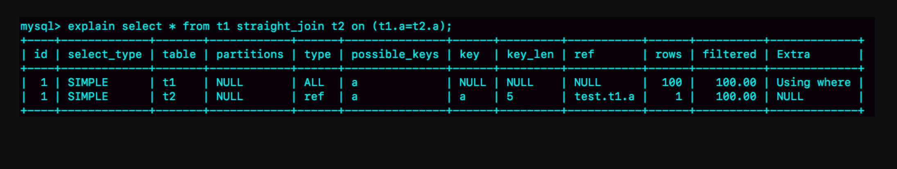


​																				图 1 使用索引字段 join 的 explain 结果

可以看到，在这条语句里，被驱动表 t2 的字段 a 上有索引，join 过程用上了这个索引，因此这个语句的执行流程是这样的：

1. 从表 t1 中读入一行数据 R；
2. 从数据行 R 中，取出 a 字段到表 t2 里去查找；
3. 取出表 t2 中满足条件的行，跟 R 组成一行，作为结果集的一部分；
4. 重复执行步骤 1 到 3，直到表 t1 的末尾循环结束。

这个过程是先遍历表 t1，然后根据从表 t1 中取出的每行数据中的 a 值，去表 t2 中查找满足条件的记录。在形式上，这个过程就跟我们写程序时的嵌套查询类似，并且可以用上被驱动表的索引，所以我们称之为“Index Nested-Loop Join”，简称 NLJ。

它对应的流程图如下所示：

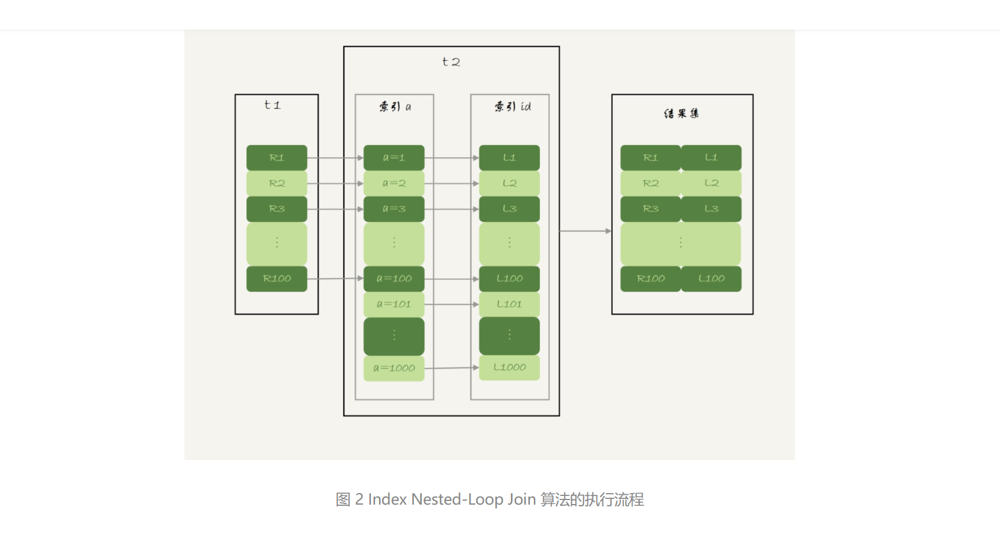

在这个流程里：

1. 对驱动表 t1 做了全表扫描，这个过程需要扫描 100 行；
2. 而对于每一行 R，根据 a 字段去表 t2 查找，走的是树搜索过程。由于我们构造的数据都是一一对应的，因此每次的搜索过程都只扫描一行，也是总共扫描 100 行；
3. 所以，整个执行流程，总扫描行数是 200。


#### Block Nested-Loop Join

这时候，被驱动表上没有可用的索引，算法的流程是这样的：

1. 把表 t1 的数据读入线程内存 join_buffer 中，由于我们这个语句中写的是 select *，因此是把整个表 t1 放入了内存；
2. 扫描表 t2，把表 t2 中的每一行取出来，跟 join_buffer 中的数据做对比，满足 join 条件的，作为结果集的一部分返回。

这个过程的流程图如下：


对应地，这条 SQL 语句的 explain 结果如下所示：

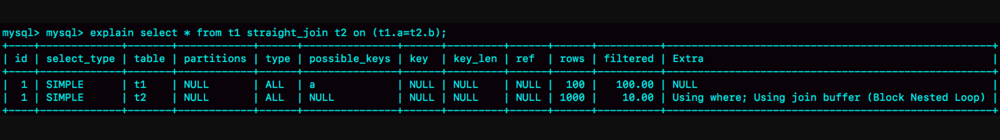

​																					图 4 不使用索引字段 join 的 explain 结果


可以看到，在这个过程中，对表 t1 和 t2 都做了一次全表扫描，因此总的扫描行数是 1100。由于 join_buffer 是以无序数组的方式组织的，因此对表 t2 中的每一行，都要做 100 次判断，总共需要在内存中做的判断次数是：100*1000=10 万次。


#### 总结

​        在用explain对select语句进行执行计划分析时，我们常常会其中的Extra字段中出现Using index或Using index;Using where或Using where或Using index condition，那么这四者有什么区别呢？哪个检索的性能更好呢？

​        其实顾名思义，Extra是补充说明的意思，也就是说，Extra中的值补充说明了[MySQL](https://cloud.tencent.com/product/cdb?from=20065&from_column=20065)的搜索引擎（默认为InnoDB）对当前的select语句的执行计划。因而并不是说Using index的效率就一定比Using where;Using index要好。

​        在分别介绍以上四个值之前，我们需要知道，MySQL的架构分成了server层和存储引擎层（storage engine），server层通过调用存储引擎层来返回数据。       

​        其中Using index表示查询的列被索引覆盖，因而无需再回表（如果你不知道啥叫回表，请参见第3篇博客）查询，因而效率较高。例如：select id from test where id = 5;其中id为主键。

​        Using where;Using index表示查询的列被索引覆盖，且where筛选条件是索引列前导列的一个范围，或者是索引列的非前导列，例如：select id from test where id > 5;。很明显，效率也很高。

​        Using where表示查询的列未被索引覆盖，且where筛选条件是索引列前导列的一个范围，或者是索引列的非前导列，或者是非索引列，例如：select * from test where id > 30; 。因为未被索引覆盖，所以需要回表，因而性能比前两者差。

​        Extra为null表示查询的列未被索引覆盖，且where筛选条件是索引的前导列，这意味着用到了索引，但是部分字段未被索引覆盖，必须通过“回表”来实现，因而性能也比前两者差。

​        Using index condition是MySQL 5.6中引入的一种新特性，叫做Index Condition Pushdown(ICP)，是一种在存储引擎层使用索引过滤数据的一种优化方式。这里的“下推” 是指将原来在server层进行的table filter中可以进行index filter的部分，在引擎层面使用index filter进行处理，不再需要回表进行table filter。使用ICP可以减少存储引擎层返回需要被index filter过滤掉的行记录，省去了存储引擎访问基表的次数以及MySQL[服务器](https://cloud.tencent.com/product/cvm?from=20065&from_column=20065)访问存储引擎的次数。Using index condition仅适用于二级索引，原因是ICP的目的是减少全行读取的次数，从而减少IO操作。而对于innodb聚集索引，完整的记录已被读入到innodb缓冲区，在这种情况下，ICP不会减少io，所以ICP只适用于二级索引，一般发生在查询字段无法被二级索引覆盖的场景，该场景下往往需要回表。通过ICP，可以减少存储引擎返回的行记录，从而减少了IO操作。**


##  **3. 建立索引的** **正确姿势**


### 无条件查询

对于**无条件**查询，如果只是根据某个字段排序，那么即使该字段有索引，MySQL也不一定会使用该索引。这是因为索引需要先定位到对应的数据行再进行排序，而全表扫描则不需要定位，直接按照顺序扫描表即可完成排序，因此对于MySQL优化器来说，全表扫描可能会更加高效。

在这种情况下，如果你要使用索引完成排序，可以采用两种方式：第一种是通过FORCE INDEX强制使用索引；第二种是通过调整查询语句的写法，将查询条件和排序条件合并在一起，这样MySQL就可以使用索引进行查询和排序了。


### ~~**in** **+ order by 导致排序失效**~~

索引：
index(col_a,col_b)

SQL：

```sql
select * from my_table where col_a in (1,2) order by col_b
```

解决方式：

- 如果col_a的过滤性不高，在组合索引中可以通过将col_b字段前置，将col_a移动到组合索引后面，只用于避免或减少回表。
- 如果col_a的过滤性高，过滤后的数据相对较少，则维持当前的索引即可，剩余不多的数据通过filesort进行排序。
- 如果存在大量数据，并且经过col_b过滤后还是存在大量数据，建议基于别的数据存储实现，比如Elasticsearch。

另外SQL建议调整为只查询id（或者其他已经在索引中的字段），再根据id去查对应的数据。可以促使SQL走覆盖索引进一步优化、也可以促使MySQL底层在进行filesort使用更优的排序算法。


### 什么情况下索引失效


#### 如果索引进行了表达式计算，则会失效

我们可以使用 EXPLAIN 关键字来查看 MySQL 中一条 SQL 语句的执行计划，比如：

```sql
EXPLAIN SELECT comment_id, user_id, comment_text FROM product_comment WHERE comment_id+1 = 900001
```

运行结果：

你能看到如果对索引进行了表达式计算，索引就失效了。这是因为我们需要把索引字段的取值都取出来，然后依次进行表达式的计算来进行条件判断，因此采用的就是全表扫描的方式，运行时间也会慢很多，最终运行时间为 2.538 秒。

为了避免索引失效，我们对 SQL 进行重写：

```sql
SELECT comment_id, user_id, comment_text FROM product_comment WHERE comment_id = 900000
```

运行时间为 0.039 秒。


#### 如果对索引使用函数，也会造成失效

比如我们想要对 comment_text 的前三位为 abc 的内容进行条件筛选，这里我们来查看下执行计划：

```sql
EXPLAIN SELECT comment_id, user_id, comment_text FROM product_comment WHERE SUBSTRING(comment_text, 1,3)='abc'
```

运行结果：

略

你能看到对索引字段进行函数操作，造成了索引失效，这时可以进行查询重写：

```sql
SELECT comment_id, user_id, comment_text FROM product_comment WHERE comment_text LIKE 'abc%'
```

使用 EXPLAIN 对查询语句进行分析：

你能看到经过查询重写后，可以使用索引进行范围检索，从而提升查询效率。


####  当我们使用 LIKE 进行模糊查询的时候，后面不能是 %

```sql
EXPLAIN SELECT comment_id, user_id, comment_text FROM product_comment WHERE comment_text LIKE '%abc'
```

这个很好理解，如果一本字典按照字母顺序进行排序，我们会从首位开始进行匹配，而不会对中间位置进行匹配，否则索引就失效了。


**注意**

>'ab%' 和 'a%c'是走索引的
>


#### **在 WHERE 子句中，如果在 OR 前的条件列进行了索引，而在 OR 后的条件列没有进行索引，那么索引会失效**

联合索引：
index(col_a,col_b)

SQL：

```sql
select * from table where col_a=1 or col_b=''
```

or查询会导致索引失效，可以将col_a和col_b分别建立索引，利用Mysql的index merge(索引合并)进行优化。本质上是分别两个字段分别走各自索引查出对应的数据，再将数据进行合并。


比如下面的 SQL 语句，comment_id 是主键，而 comment_text 没有进行索引，因为 OR 的含义就是两个只要满足一个即可，因此只有一个条件列进行了索引是没有意义的，只要有条件列没有进行索引，就会进行全表扫描，因此索引的条件列也会失效：

```sql
EXPLAIN SELECT comment_id, user_id, comment_text FROM product_comment WHERE comment_id = 900001 OR comment_text = '462eed7ac6e791292a79'
```

如果我们把 **comment_text** 创建了索引会是怎样的呢？

你能看到这里使用到了 **index merge**，简单来说 index merge 就是对 **comment_id** 和 **comment_text** 分别进行了扫描，然后将这两个结果集进行了合并。这样做的好处就是避免了全表扫描。


#### 索引列与 NULL 或者 NOT NULL 进行判断的时候也会失效

这是因为索引并不存储空值，所以最好在设计数据表的时候就将字段设置为 NOT NULL 约束，比如你可以将 INT 类型的字段，默认值设置为 0。将字符类型的默认值设置为空字符串 (’’)。


#### 联合索引的最左原则

最左原则也就是需要从左到右的使用索引中的字段，一条 SQL 语句可以只使用联合索引的一部分，但是需要从最左侧开始，否则就会失效。我在讲联合索引的时候举过索引失效的例子。

SQL：

```csharp
select * from my_table where col_b=1  
select * from my_table order by col_b
```

索引:
index(col_a,col_b)

组合索引的匹配规则是从左往右匹配，无论是作为**过滤条件**还是**排序条件**都要遵循这个原则。如果要使用col_b字段走索引，查询条件则必须要携带col_a字段。


##### **排序字段**

col_b作为排序字段如果要走索引，只要保证组合索引中col_b前面的字段都可以包含在过滤条件或者排序条件中即可，也不需要保证col_b作为组合索引中的最后一个字段。

比如：

```sql
select * from my_table order by col_a,col_b
```

col_a和col_b都可以走索引。


##### **过滤条件**

如果col_b是作为过滤条件，则col_b前面的字段都应该在过滤条件中。
比如：

```sql
select * from my_table where col_b=1 order by col_a
```

col_a和col_b都走不了索引，因为col_a在组合索引左边，但是col_a不在查询条件中。


## 4. in vs exists


### 解读in和exists

这两个关键字的区别主要是在于子查询上面，in是独立子查询，exists是相关子查询，例如：

用in查询有员工的部门       ：select dept_name from dept where id in (select dept_id from emp);

用exists查询有员工的部门：select dept_name from dept where exists (select 1 from emp where dept.id=emp.dept_id);

当然，执行结果完全一致。


### in和exists的效率问题

上面的SQL语句执行的完全结果一样，那么这两个的效率如何呢？

网上也是有很多文章进行解读，总的来说就是体现一种小数据集驱动大数据集的思想。很多文章是直接说小表驱动大表，其实这样是很不准确的，因为我们可以这样【select dept_name from dept where id in (select dept_id from emp where id>5;)】这样对于子查询来说他返回的结果集与他的表没太大关系了，所以小数据集驱动大的数据集是一种更精准的说法。参考【[知乎 MySQL查询语句中的IN 和Exists 对比分析](https://zhuanlan.zhihu.com/p/37920214)】

下面分析它的执行原理（关于版本5.5和5.6的区别在文章后面会说）：

对于in来说，他是先执行子查询然后得到子查询的结果集，再用子查询的结果去匹配外部表。这样的话需要遍历一边刚刚的结果集，如果外部表的相应字段建立了索引的话，在匹配外部表的时候就能使用上外部表的索引了。假设子查询结果大小为M，外部表的大小为N，外部表使用B+Tree索引匹配每一条数据的时间复杂度是O（log N），那么这个总的时间复杂度就相当于O（M*log N）。

对于exists来说，他是执行外表的遍历操作（不一定是全表扫描也可能是索引扫描，但是差别不是很大），然后里面的相关子查询会利用外部表的数据对内部表进行匹配，这个时候如果内部表的相关字段建立了索引的话，匹配的时候就能走索引了。同样假设子查询结果大小为M，外部表的大小为N，内部表使用B+Tree索引匹配每一条数据的时间复杂度是O（log M），那么这个总的时间复杂度就相当于O（N*log M）。

>这里的M和N都是正整数。
>
>1. 当M = N时：
>
>M * log N - N * log M = M * log M - M * log M = 0
>
>1. 当M < N时：
>
>M * log N - N * log M < 0
>
>1. 当M > N时：
>
>M * log N - N * log M > 0
>
>这是因为当M < N时，log M < log N，因此M * log N < N * log N，即M * log N - N * log M < 0。
>
>同样地，当M > N时，log M > log N，因此M * log N > N * log M，即M * log N - N * log M > 0。

很明显：当外表大，内部数据集小，适合适使用in。当外表小，内部数据集大，适合使用exists。


### not in和not exists

这个就比较明朗了，对于not exists来说，和exists一样会利用内部表建立好的索引，唯一的区别在于当有数据匹配的时候exists返回true而not exists返回false。

实践如下：执行SQL，explain select emp_name from emp where not exists (select 1 from dept where dept.id=dept_id);
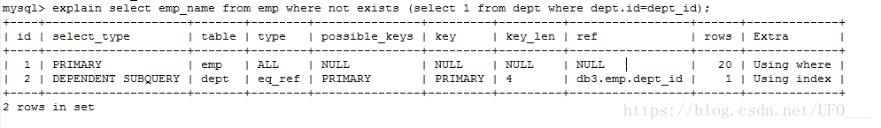

和预期一致，外表全表扫描，内表使用上了索引。

对于not in来说，**哪个表的索引的用不上**，除非覆盖索引的时候用一下。

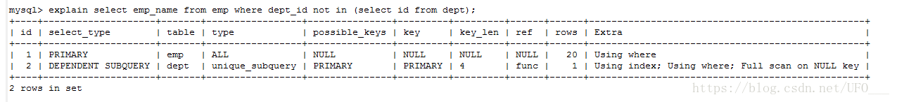

外表外表扫描，内表的查询覆盖索引，因为extra字段出现了using index，但是效率比使用索引进行查找低多了。

所以对于 not exists 和 not in 来说毫不犹豫的使用 not exists 。


## 5. join

结论：

1. 使用 join 语句，性能比强行拆成多个单表执行 SQL 语句的性能要好；
2. 如果使用 join 语句的话，需要让小表做驱动表。

但是，你需要注意，这个结论的前提是“可以使用被驱动表的索引”。


### 优化


## 6. 存储过程

尽管存储过程有诸多优点，但是对于存储过程的使用，一直都存在着很多争议，比如有些公司对于大型项目要求使用存储过程，而有些公司在手册中明确禁止使用存储过程，为什么这些公司对存储过程的使用需求差别这么大呢？

我们得从存储过程的特点来找答案。

你能看到存储过程有很多好处。

首先存储过程可以一次编译多次使用。存储过程只在创造时进行编译，之后的使用都不需要重新编译，这就提升了 SQL 的执行效率。其次它可以减少开发工作量。将代码封装成模块，实际上是编程的核心思想之一，这样可以把复杂的问题拆解成不同的模块，然后模块之间可以重复使用，在减少开发工作量的同时，还能保证代码的结构清晰。还有一点，存储过程的安全性强，我们在设定存储过程的时候可以设置对用户的使用权限，这样就和视图一样具有较强的安全性。最后它可以减少网络传输量，因为代码封装到存储过程中，每次使用只需要调用存储过程即可，这样就减少了网络传输量。同时在进行相对复杂的数据库操作时，原本需要使用一条一条的 SQL 语句，可能要连接多次数据库才能完成的操作，现在变成了一次存储过程，只需要连接一次即可。

基于上面这些优点，不少大公司都要求大型项目使用存储过程，比如微软、IBM 等公司。但是国内的阿里并不推荐开发人员使用存储过程，这是为什么呢？

存储过程虽然有诸如上面的好处，但缺点也是很明显的。

它的可移植性差，存储过程不能跨数据库移植，比如在 MySQL、Oracle 和 SQL Server 里编写的存储过程，在换成其他数据库时都需要重新编写。

其次调试困难，只有少数 DBMS 支持存储过程的调试。对于复杂的存储过程来说，开发和维护都不容易。

此外，存储过程的版本管理也很困难，比如数据表索引发生变化了，可能会导致存储过程失效。我们在开发软件的时候往往需要进行版本管理，但是存储过程本身没有版本控制，版本迭代更新的时候很麻烦。

最后它不适合高并发的场景，高并发的场景需要减少数据库的压力，有时数据库会采用分库分表的方式，而且对可扩展性要求很高，在这种情况下，存储过程会变得难以维护，增加数据库的压力，显然就不适用了。

了解了存储过程的优缺点之后，我想说的是，存储过程既方便，又有局限性。尽管不同的公司对存储过程的态度不一，但是对于我们开发人员来说，不论怎样，掌握存储过程都是必备的技能之一。