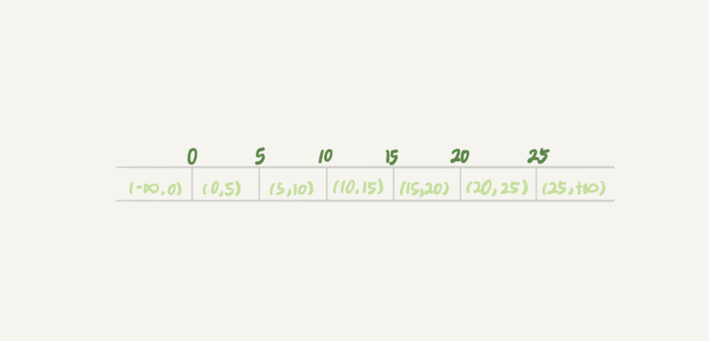
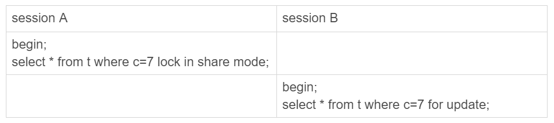
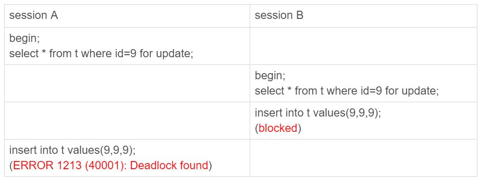
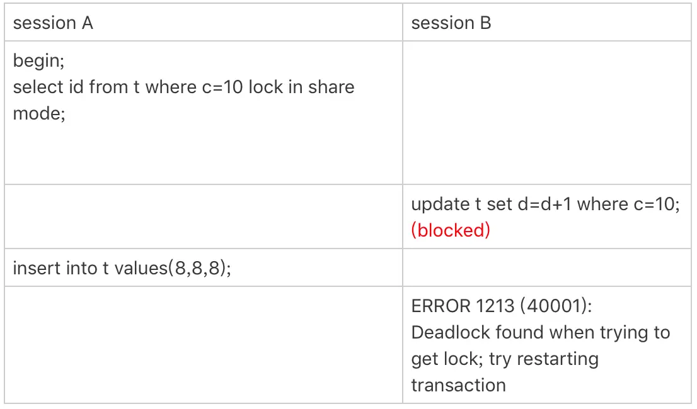

# MySQL - 幻读、间隙锁和next-Key Lock


间隙锁和next-key lock是为了解决幻读问题的，先回顾一下幻读的定义：

> A事务通过`SELECT ... WHERE`得到一些行，B事务插入新行或者更新已有的行使得这些行满足A事务的`WHERE`条件，A事务再次`SELECT ... WHERE`结果比上一次少了一些或者多了一些行。


## 幻读

MySQL默认隔离级别为Repeatable Read（可重复读）：

```shell
show variables like '%isolation%';

+-----------------------+-----------------+
| Variable_name         | Value           |
+-----------------------+-----------------+
| transaction_isolation | REPEATABLE-READ |
+-----------------------+-----------------+
```

在这个隔离级别下，下面所讲的间隙锁、next-key lock才会起作用。

再接下去看间隙锁和next-key lock之前，先复习一下`SELECT ... FOR SHARE`和`SELECT ... FOR UPDATE`：

> `SELECT ... FOR SHARE/LOCK IN SHARE MODE`只会锁定扫描过程中***使用***的索引里的记录行，即如果你的查询正好***使用***了覆盖索引，那么只有这个索引里的记录行会被锁定，主键索引的记录行是不会被锁定的。

> `SELECT ... FOR UPDATE`除了会锁定扫描过程中***使用***的索引里的记录行，相关的其他索引的记录行也会被锁定。换句话说就算你使用了覆盖索引，但是主键索引里的记录行也会被锁定。而又因为主键索引就已经包含了所有字段，那么就相当于锁定表的整行记录。
>
> 详情见：[Locking Reads](https://dev.mysql.com/doc/refman/8.0/en/innodb-locking-reads.html)

所以分析问题的时候：

- 一定要先明确扫描过程中用到了哪些索引（不仅仅是条件判断用到，还包括回表），如果是share mode那么就到此为止，如果是`SELECT ... FOR UPDATE`和`UPDATE/DELETE`，则还会用到主键索引。
- 然后再明确影响了哪些记录行。
- 最后再根据索引的类型和扫描到的行，分析间隙锁和next-key lock。


## 间隙锁(gap lock)

传统的行锁只能锁定表中已经存在的行，因此就算你把表中所有行都锁住，也无法阻止插入新行（幻读问题）。为了解决这个问题InnoDB引入[gap lock](https://dev.mysql.com/doc/refman/8.0/en/glossary.html#glos_gap_lock)（间隙锁）。

表t就有7个间隙：

```shell
CREATE TABLE `t` (
  `id` int(11) NOT NULL,
  `c` int(11) DEFAULT NULL,
  `d` int(11) DEFAULT NULL,
  PRIMARY KEY (`id`),
  KEY `c` (`c`)
) ENGINE=InnoDB;

insert into t values(0,0,0),(5,5,5),
(10,10,10),(15,15,15),(20,20,20),(25,25,25);
```



间隙锁就是把索引的间隙给锁住，防止往中间插入新行。

所以下面语句在扫描全表的过程中，除了把6个已有行（主键索引）加了锁，也把主键索引的7个间隙加上锁：

```shell
select * from t where d=5 for update
```

和行锁有冲突的关系的是“另外一个行锁”，但是**跟间隙锁存在冲突关系的，是“往这个间隙中插入一个记录”这个操作**。所以下面的session B不会被阻塞：



因为表 t 里并没有 c=7 这个记录，因此 session A 加的是间隙锁 (5,10)，而 session B 也是在这个间隙加的间隙锁，它们都是保护这个间隙，不允许插入值，他们之间不冲突。


### 间隙锁造成的死锁

间隙锁的引入会使同样的语句锁住更大的范围，这其实是影响并发度的，有时候还会更容易造成死锁，看下面场景：



分析一下：

1. session A 执行 select … for update 语句，由于 id=9 这一行并不存在，因此会加上间隙锁 (5,10);
2. session B 执行 select … for update 语句，由于 id=9 这一行并不存在，因此也会加上间隙锁 (5,10);
3. session B 试图插入一行 (9,9,9)，被 session A 的间隙锁挡住了，只好进入等待
4. session A 试图插入一行 (9,9,9)，被 session B 的间隙锁挡住了


### 间隙锁和binlog

MySQL在可重复读个里级别下（默认），才会启用间隙锁。你如果把隔离级别设置为读提交的话，就没有间隙锁了。但同时，你要解决可能出现的数据和日志不一致问题，需要把 binlog 格式设置为 row。

## next-key lock

行锁 + 该行***之前***的间隙锁 合称 [next-key lock](https://dev.mysql.com/doc/refman/8.0/en/glossary.html#glos_next_key_lock)，每个 next-key lock 是前开后闭区间。也就是说，我们的表 t 初始化以后，如果用 `select * from t for update` 要把整个表所有记录锁起来，就形成了 7 个 next-key lock，分别是 (-∞,0]、(0,5]、(5,10]、(10,15]、(15,20]、(20, 25]、(25, +supremum]（supremum只是为了保证开闭区间的一致性，可以理解为无穷大）。

next-key lock的加锁过程是先加间隙锁再加行锁，这不是一个原子性操作，因此会出现只加了间隙锁但加行锁被阻塞的情况，比如下面这个情况：



分析一下过程：

1. session A 启动事务后执行查询语句加 lock in share mode，在索引 c 上加了 next-key lock (5,10] 和间隙锁 (10,15)；
2. session B 的 update 语句也要在索引 c 上加 next-key lock(5,10] ，但是只有间隙锁(5, 10) 加成功了，行锁[10]进入锁等待；
3. 然后 session A 要再插入 (8,8,8) 这一行，被 session B 的间隙锁锁住。由于出现了死锁，InnoDB 让 session B 回滚。


## 间隙锁和next-key lock的加锁规则

两个原则：

1. 加锁的基本单位是 next-key lock，next-key lock 是前开后闭区间。
2. 查找过程中访问到的对象才会加锁。

两个优化：

1. 索引上的**等值**查询，给唯一索引加锁的时候，如果满足条件，next-key lock 退化为行锁。
2. 索引上的**等值**查询，向右遍历时且最后一个值不满足等值条件的时候，next-key lock 退化为间隙锁。

- 注意，非等值查询是不会优化的。

一个 bug：

- 唯一索引上的范围查询会访问到不满足条件的第一个值为止。（8.0.26 没有这个bug）

### 案例分析

案例分析见：

- [极客时间 - 为什么我只改一行的语句，锁这么多？](https://time.geekbang.org/column/article/75659)
- [用动态的观点看加锁](https://time.geekbang.org/column/article/78427)

