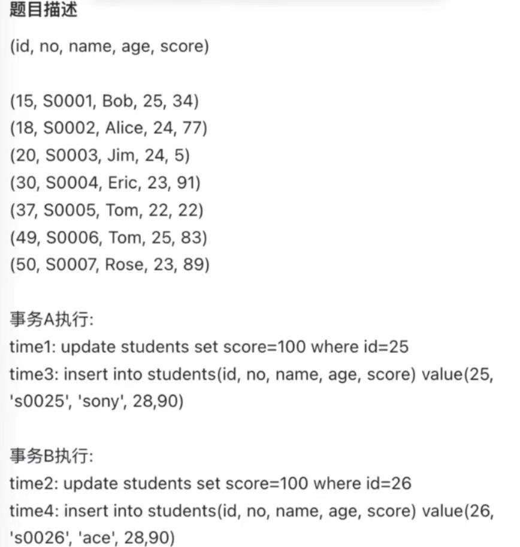
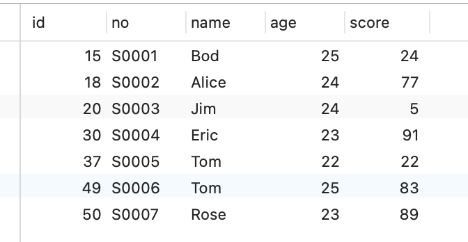
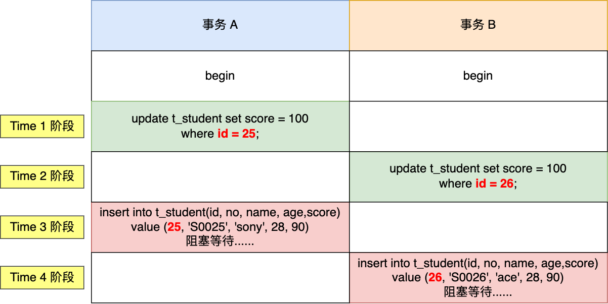
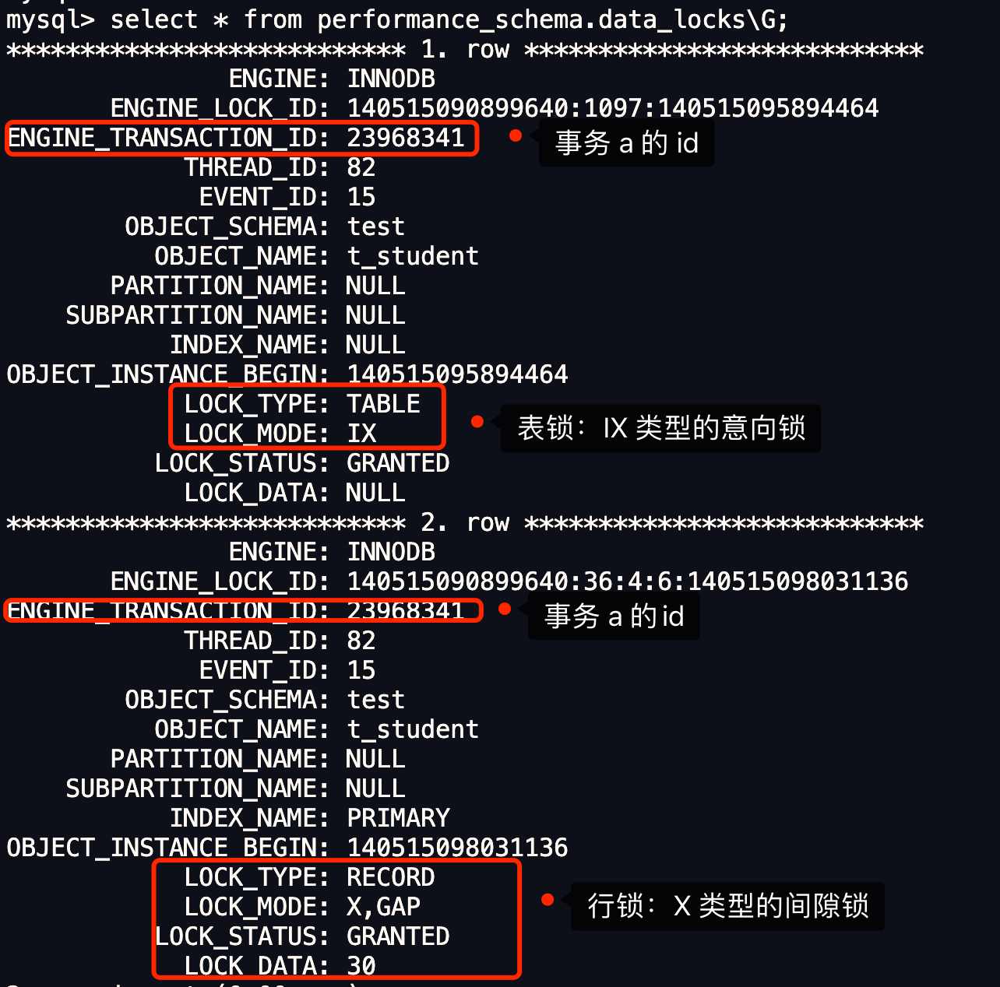
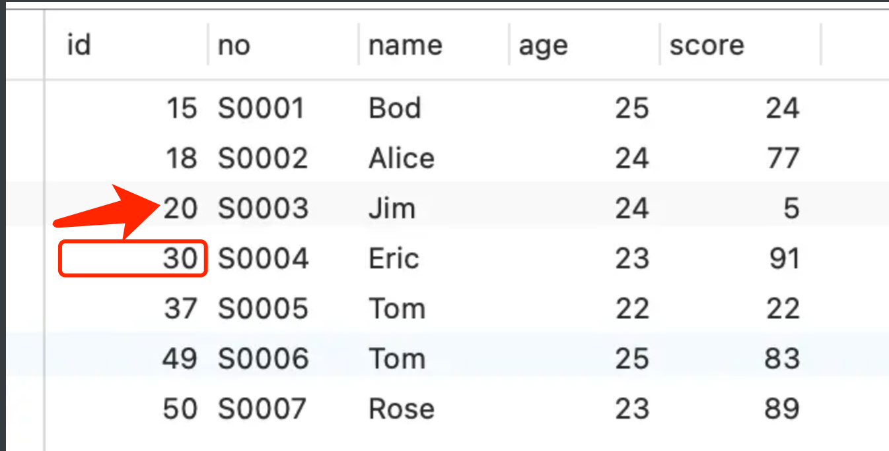
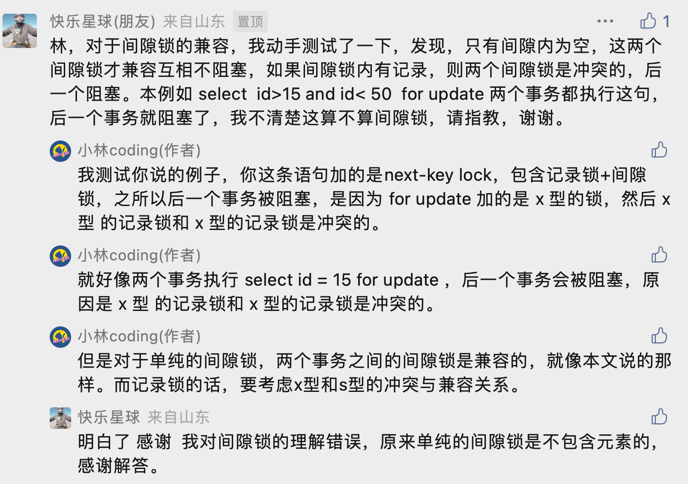

# 死锁

## 什么是死锁

- 1.必须满足的条件

```
1. 必须有两个或者两个以上的事务
2. 不同事务之间都持有对方需要的锁资源。 A事务需要B的资源，B事务需要A的资源，这就是典型的AB-BA死锁
```

- 2.死锁相关的参数

```
* innodb_print_all_deadlocks
1. 如果这个参数打开，那么死锁相关的信息都会打印输出到error log

* innodb_lock_wait_timeout
1. 当MySQL获取row lock的时候，如果wait了innodb_lock_wait_timeout=N的时间，会报以下错误
ERROR 1205 (HY000): Lock wait timeout exceeded; try restarting transaction

* innodb_deadlock_detect
1. innodb_deadlock_detect = off  可以关闭掉死锁检测，那么就发生死锁的时候，用锁超时来处理。
2. innodb_deadlock_detect = on  （默认选项）开启死锁检测，数据库自动回滚

* innodb_status_lock_output = on
1. 可以看到更加详细的锁信息
```


## 死锁有什么危害

1. 死锁，即表明有多个事务之间需要互相争夺资源而互相等待。
2. 如果没有死锁检测，那么就会互相卡死，一直hang死
3. 如果有死锁检测机制，那么数据库会自动根据代价来评估出哪些事务可以被回滚掉，用来打破这个僵局
4. 所以说：死锁并没有啥坏处，反而可以保护数据库和应用
5. 那么出现死锁，而且非常频繁，我们应该调整业务逻辑，让其避免产生死锁方为上策


## 典型的死锁案例剖析


### 死锁案例一

> 典型的 AB-BA 死锁

```
session 1:
    select * from tb_b where id_2 = 1 for update (A)
session 2:
    select * from tb_a where id = 2 for update (B)
session 1:
    select * from tb_a where id = 2 for update (B)
session 2:
    select * from tb_b where id_2 = 1 for update (A)
    ERROR 1213 (40001): Deadlock found when trying to get lock; try restarting transaction
1213的死锁错误，mysql会自动回滚
哪个回滚代价最小，回滚哪个（根据undo判断）
------------------------
LATEST DETECTED DEADLOCK
------------------------

2017-06-22 16:39:50 0x7f547dd02700
*** (1) TRANSACTION:
TRANSACTION 133601982, ACTIVE 48 sec starting index read
mysql tables in use 1, locked 1
LOCK WAIT 4 lock struct(s), heap size 1136, 2 row lock(s)
MySQL thread id 11900, OS thread handle 140000866637568, query id 25108 localhost dba statistics
select * from tb_a where id = 2 for update    -----session1 持有tb_a中记录为2的锁
*** (1) WAITING FOR THIS LOCK TO BE GRANTED:
RECORD LOCKS space id 303 page no 3 n bits 72 index PRIMARY of table `lc_5`.`tb_a` trx id 133601982 lock_mode X locks rec but not gap waiting
Record lock, heap no 3 PHYSICAL RECORD: n_fields 3; compact format; info bits 0
 0: len 4; hex 80000002; asc     ;;   --session 1 需要tb_a中记录为2的锁( session1 -> session2   )
 1: len 6; hex 000007f69ab2; asc       ;;
 2: len 7; hex dc000027100110; asc    '   ;;
*** (2) TRANSACTION:
TRANSACTION 133601983, ACTIVE 28 sec starting index read, thread declared inside InnoDB 5000
mysql tables in use 1, locked 1
4 lock struct(s), heap size 1136, 2 row lock(s)
MySQL thread id 11901, OS thread handle 140000864773888, query id 25109 localhost dba statistics
select * from tb_b where id_2 = 1 for update
*** (2) HOLDS THE LOCK(S):
RECORD LOCKS space id 303 page no 3 n bits 72 index PRIMARY of table `lc_5`.`tb_a` trx id 133601983 lock_mode X locks rec but not gap
Record lock, heap no 3 PHYSICAL RECORD: n_fields 3; compact format; info bits 0
 0: len 4; hex 80000002; asc     ;;              --session 2 持有tb_a中记录等于2的锁
 1: len 6; hex 000007f69ab2; asc       ;;
 2: len 7; hex dc000027100110; asc    '   ;;
*** (2) WAITING FOR THIS LOCK TO BE GRANTED:
RECORD LOCKS space id 304 page no 3 n bits 72 index PRIMARY of table `lc_5`.`tb_b` trx id 133601983 lock_mode X locks rec but not gap waiting
Record lock, heap no 2 PHYSICAL RECORD: n_fields 3; compact format; info bits 0
 0: len 4; hex 80000001; asc     ;;             --session 2 需要tb_b中记录为1的锁 ( session2 -> session1 )
 1: len 6; hex 000007f69ab8; asc       ;;
 2: len 7; hex e0000027120110; asc    '   ;;
最终的结果：
	死锁路径：[session1 -> session2 , session2 -> session1]
	ABBA死锁产生
```


### 死锁案例二

>同一个事务中，S-lock 升级为 X-lock 不能直接继承

```
* session 1:
mysql> CREATE TABLE t (i INT) ENGINE = InnoDB;
Query OK, 0 rows affected (1.07 sec)
mysql> INSERT INTO t (i) VALUES(1);
Query OK, 1 row affected (0.09 sec)
mysql> START TRANSACTION;
Query OK, 0 rows affected (0.00 sec)
mysql> SELECT * FROM t WHERE i = 1 LOCK IN SHARE MODE;   --获取S-lock
+------+
| i    |
+------+
|    1 |
+------+
* session 2:
mysql> START TRANSACTION;
Query OK, 0 rows affected (0.00 sec)
mysql> DELETE FROM t WHERE i = 1;   --想要获取X-lock，但是被session1的S-lock 卡住，目前处于waiting lock阶段
* session 1:
mysql> DELETE FROM t WHERE i = 1;   --想要获取X-lock，session1本身拥有S-lock，但是由于session 2 获取X-lock再前，所以session1不能够从S-lock 提升到 X-lock，需要等待session2 释放才可以获取，所以造成死锁
ERROR 1213 (40001): Deadlock found when trying to get lock;
try restarting transaction
死锁路径：
	session2 -> session1 , session1 -> session2
```


### 死锁案例三

>唯一键死锁 （delete + insert）
>关键点在于：S-lock


```
dba:lc_3> show create table uk;
+-------+--------------------------------------------------------------------------------------------------------------+
| Table | Create Table                                                                                                 |
+-------+--------------------------------------------------------------------------------------------------------------+
| uk    | CREATE TABLE `uk` (
  `a` int(11) NOT NULL,
  UNIQUE KEY `uniq_a` (`a`)
) ENGINE=InnoDB DEFAULT CHARSET=utf8 |
+-------+--------------------------------------------------------------------------------------------------------------+
1 row in set (0.00 sec)
dba:lc_3> select * from uk;
+---+
| a |
+---+
| 1 |
+---+
1 row in set (0.00 sec)
session 1:
dba:lc_3> begin;
Query OK, 0 rows affected (0.00 sec)
dba:lc_3> delete from uk where a=1;
Query OK, 1 row affected (0.00 sec)
session 2:
dba:(none)> use lc_3;
Database changed
dba:lc_3> insert into uk values(1);  --wait lock(想要加S-lock，却被sesson1的X-lock卡住)
sesson 3:
dba:(none)> use lc_3;
Database changed
dba:lc_3> insert into uk values(1); --wait lock（想要加S-lock，却被sesson1的X-lock卡住）
session 1:
commit;    --session2和session3 都获得了S-lock，然后都想要去给记录1 加上X-lock，却互相被对方的S-lock卡住，死锁产生
再来看session 2 和 session 3 的结果：
session2：
Query OK, 1 row affected (7.36 sec)
session3：
ERROR 1213 (40001): Deadlock found when trying to get lock; try restarting transaction
总结： 试想想，如果session 1 不是commit，而是rollback会是怎么样呢？ 大家去测测就会发现，结果肯定是唯一键冲突啊
```


### 死锁案例四

>主键和二级索引的死锁

```
* primary key
1   2   3   4   --primary key col1
10  30  20  40  --idx_key2 col2
100 200 300 400  --idx_key3 col3
* idx_key2      select * from t where col2 > 10: 锁二级索引顺序为：20 =》30 ， 对应锁主键的顺序为：3 =》2
10 20 30 40
1  3  2  4
* idx_key3    select * from t where col3 > 100：锁二级索引顺序为：200 =》300 ， 对应锁主键的顺序为：2 =》3
100 200 300 400
1   2   3   4
死锁路径：
	由于二级索引引起的主键加锁顺序： 3 =》2
	由于二级索引引起的主键加锁顺序： 2 =》3
这个要求并发，且刚好
session 1 加锁3的时候 session 2 要加锁2.
session 1 加锁2的时候 session 3 要加锁3.
这样就产生了 AB-BA 死锁
```


###  死锁案例五

> purge + unique key 引发的死锁

```
A表的记录： id =  1    10   40   100    200   500  800  900

session 1 :
	delete from a where id = 10;   ???
session 2 :
	delete from a where id = 800;  ???
session 1 :
	insert into a select 800; ???
session 2 :
	insert into a select 10; ???
* 如果大家去跑这两钟SQL语句的并发测试，是可以导致死锁的。
* 如何验证是由于purge导致的问题呢？这个本想用mysqld-debug模式去关闭purge线程，但是很遗憾我没能模拟出来。。。
```


### 死锁案例六

> REPLACE INTO问题

```
* 这个问题模拟起来非常简单，原理非常复杂，这里不过多解释
	* 详情请看姜老师的文章,据说看懂了年薪都100w了：  http://www.innomysql.com/26186-2/

* 解决方案：
	* 用insert into ... on duplicate key update 代替 replace into
	* 此方案亲测有效
```


## 案例


大家好，我是小林。

之前收到读者面试字节时，被问到一个关于 MySQL 的问题。




如果对 MySQL 加锁机制比较熟悉的同学，应该一眼就能看出**会发生死锁**，但是具体加了什么锁而导致死锁，是需要我们具体分析的。

接下来，就跟聊聊上面两个事务执行 SQL 语句的过程中，加了什么锁，从而导致死锁的。

### 准备工作

先创建一张 t_student 表，假设除了 id 字段，其他字段都是普通字段。

```sql
CREATE TABLE `t_student` (
  `id` int NOT NULL,
  `no` varchar(255) DEFAULT NULL,
  `name` varchar(255) DEFAULT NULL,
  `age` int DEFAULT NULL,
  `score` int DEFAULT NULL,
  PRIMARY KEY (`id`)
) ENGINE=InnoDB DEFAULT CHARSET=utf8mb4;
```

然后，插入相关的数据后，t_student 表中的记录如下：



### 开始实验

在实验开始前，先说明下实验环境：

- MySQL 版本：8.0.26
- 隔离级别：可重复读（RR）

启动两个事务，按照题目的 SQL 执行顺序，过程如下表格：



可以看到，事务 A 和 事务 B 都在执行  insert 语句后，都陷入了等待状态（前提没有打开死锁检测），也就是发生了死锁，因为都在相互等待对方释放锁。

### 为什么会发生死锁？

我们可以通过 `select * from performance_schema.data_locks\G;` 这条语句，查看事务执行 SQL 过程中加了什么锁。

接下来，针对每一条 SQL 语句分析具体加了什么锁。

#### Time 1 阶段加锁分析

Time 1 阶段，事务 A 执行以下语句：

```sql
# 事务 A
mysql> begin;
Query OK, 0 rows affected (0.00 sec)

mysql> update t_student set score = 100 where id = 25;
Query OK, 0 rows affected (0.01 sec)
Rows matched: 0  Changed: 0  Warnings: 0
```

然后执行 `select * from performance_schema.data_locks\G;` 这条语句，查看事务 A 此时加了什么锁。



从上图可以看到，共加了两个锁，分别是：

- 表锁：X 类型的意向锁；
- 行锁：X 类型的间隙锁；

这里我们重点关注行锁，图中 LOCK_TYPE 中的 RECORD 表示行级锁，而不是记录锁的意思，通过 LOCK_MODE 可以确认是 next-key 锁，还是间隙锁，还是记录锁：

- 如果 LOCK_MODE 为 `X`，说明是 next-key 锁；
- 如果 LOCK_MODE 为 `X, REC_NOT_GAP`，说明是记录锁；
- 如果 LOCK_MODE 为 `X, GAP`，说明是间隙锁；

**因此，此时事务 A 在主键索引（INDEX_NAME : PRIMARY）上加的是间隙锁，锁范围是`(20, 30)`**。

> 间隙锁的范围`(20, 30)` ，是怎么确定的？

根据我的经验，如果 LOCK_MODE 是 next-key 锁或者间隙锁，那么 LOCK_DATA 就表示锁的范围最右值，此次的事务 A 的 LOCK_DATA 是 30。

然后锁范围的最左值是 t_student 表中 id 为 30 的上一条记录的 id 值，即 20。



因此，间隙锁的范围`(20, 30)`。

#### Time 2 阶段加锁分析

Time 2 阶段，事务 B 执行以下语句：

```sql
# 事务 B
mysql> begin;
Query OK, 0 rows affected (0.00 sec)

mysql> update t_student set score = 100 where id = 26;
Query OK, 0 rows affected (0.01 sec)
Rows matched: 0  Changed: 0  Warnings: 0
```

然后执行 `select * from performance_schema.data_locks\G;` 这条语句，查看事务 B 此时加了什么锁。


从上图可以看到，行锁是 X 类型的间隙锁，间隙锁的范围是`(20, 30)`。

> 事务 A 和 事务 B 的间隙锁范围都是一样的，为什么不会冲突？

两个事务的间隙锁之间是相互兼容的，不会产生冲突。

在 MySQL 官网上还有一段非常关键的描述：

*Gap locks in InnoDB are “purely inhibitive”, which means that their only purpose is to prevent other transactions from Inserting to the gap. Gap locks can co-exist. A gap lock taken by one transaction does not prevent another transaction from taking a gap lock on the same gap. There is no difference between shared and exclusive gap locks. They do not conflict with each other, and they perform the same function.*

**间隙锁的意义只在于阻止区间被插入**，因此是可以共存的。**一个事务获取的间隙锁不会阻止另一个事务获取同一个间隙范围的间隙锁**，共享（S 型）和排他（X 型）的间隙锁是没有区别的，他们相互不冲突，且功能相同。

#### Time 3 阶段加锁分析

Time 3，事务 A 插入了一条记录：

```sql
# Time 3 阶段，事务 A 插入了一条记录
mysql> insert into t_student(id, no, name, age,score) value (25, 'S0025', 'sony', 28, 90);
    /// 阻塞等待......
```

此时，事务 A 就陷入了等待状态。

然后执行 `select * from performance_schema.data_locks\G;` 这条语句，查看事务 A 在获取什么锁而导致被阻塞。


可以看到，事务 A 的状态为等待状态（LOCK_STATUS: WAITING），因为向事务 B 生成的间隙锁（范围 `(20, 30)`）中插入了一条记录，所以事务 A 的插入操作生成了一个插入意向锁（`LOCK_MODE:INSERT_INTENTION`）。

> 插入意向锁是什么？

注意！插入意向锁名字里虽然有意向锁这三个字，但是它并不是意向锁，它属于行级锁，是一种特殊的间隙锁。

在 MySQL 的官方文档中有以下重要描述：

*An Insert intention lock is a type of gap lock set by Insert operations prior to row Insertion. This lock signals the intent to Insert in such a way that multiple transactions Inserting into the same index gap need not wait for each other if they are not Inserting at the same position within the gap. Suppose that there are index records with values of 4 and 7. Separate transactions that attempt to Insert values of 5 and 6, respectively, each lock the gap between 4 and 7 with Insert intention locks prior to obtaining the exclusive lock on the Inserted row, but do not block each other because the rows are nonconflicting.*

这段话表明尽管**插入意向锁是一种特殊的间隙锁，但不同于间隙锁的是，该锁只用于并发插入操作**。

如果说间隙锁锁住的是一个区间，那么「插入意向锁」锁住的就是一个点。因而从这个角度来说，插入意向锁确实是一种特殊的间隙锁。

插入意向锁与间隙锁的另一个非常重要的差别是：**尽管「插入意向锁」也属于间隙锁，但两个事务却不能在同一时间内，一个拥有间隙锁，另一个拥有该间隙区间内的插入意向锁（当然，插入意向锁如果不在间隙锁区间内则是可以的）。所以，插入意向锁和间隙锁之间是冲突的**。

另外，我补充一点，插入意向锁的生成时机：

- 每插入一条新记录，都需要看一下待插入记录的下一条记录上是否已经被加了间隙锁，如果已加间隙锁，此时会生成一个插入意向锁，然后锁的状态设置为等待状态（*PS：MySQL 加锁时，是先生成锁结构，然后设置锁的状态，如果锁状态是等待状态，并不是意味着事务成功获取到了锁，只有当锁状态为正常状态时，才代表事务成功获取到了锁*），现象就是 Insert 语句会被阻塞。

#### Time 4 阶段加锁分析

Time 4，事务 B 插入了一条记录：

```sql
# Time 4 阶段，事务 B 插入了一条记录
mysql> insert into t_student(id, no, name, age,score) value (26, 'S0026', 'ace', 28, 90);
    /// 阻塞等待......
```

此时，事务 B 就陷入了等待状态。

然后执行 `select * from performance_schema.data_locks\G;` 这条语句，查看事务 B 在获取什么锁而导致被阻塞。


可以看到，事务 B 在生成插入意向锁时而导致被阻塞，这是因为事务 B 向事务 A 生成的范围为 (20, 30) 的间隙锁插入了一条记录，而插入意向锁和间隙锁是冲突的，所以事务  B 在获取插入意向锁时就陷入了等待状态。

> 最后回答，为什么会发生死锁？

本次案例中，事务 A 和事务 B 在执行完后 update 语句后都持有范围为`(20, 30）`的间隙锁，而接下来的插入操作为了获取到插入意向锁，都在等待对方事务的间隙锁释放，于是就造成了循环等待，满足了死锁的四个条件：**互斥、占有且等待、不可强占用、循环等待**，因此发生了死锁。

### 总结

两个事务即使生成的间隙锁的范围是一样的，也不会发生冲突，因为间隙锁目的是为了防止其他事务插入数据，因此间隙锁与间隙锁之间是相互兼容的。

在执行插入语句时，如果插入的记录在其他事务持有间隙锁范围内，插入语句就会被阻塞，因为插入语句在碰到间隙锁时，会生成一个插入意向锁，然后插入意向锁和间隙锁之间是互斥的关系。

如果两个事务分别向对方持有的间隙锁范围内插入一条记录，而插入操作为了获取到插入意向锁，都在等待对方事务的间隙锁释放，于是就造成了循环等待，满足了死锁的四个条件：**互斥、占有且等待、不可强占用、循环等待**，因此发生了死锁。


### 读者问答



---

