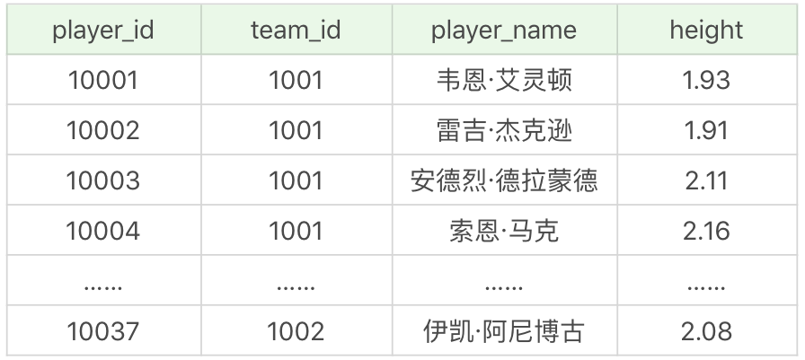
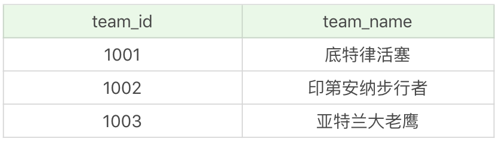
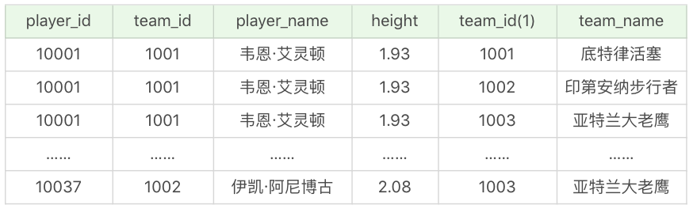
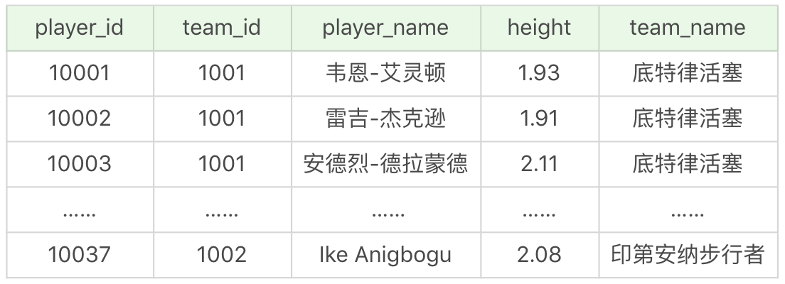
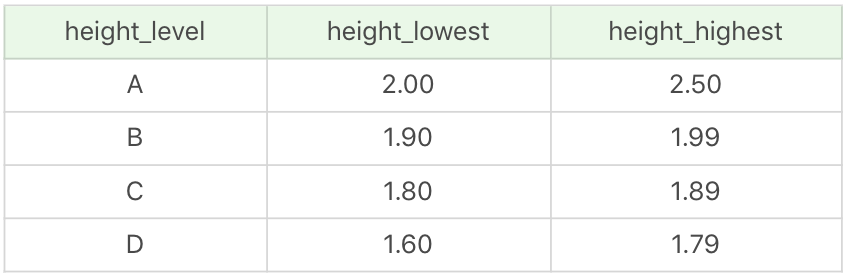
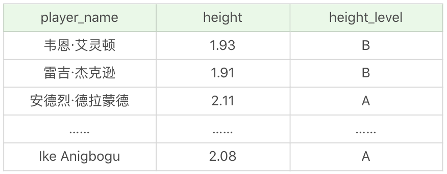
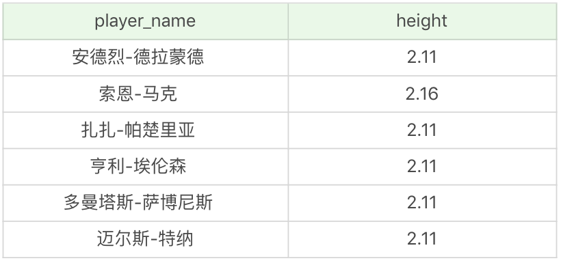
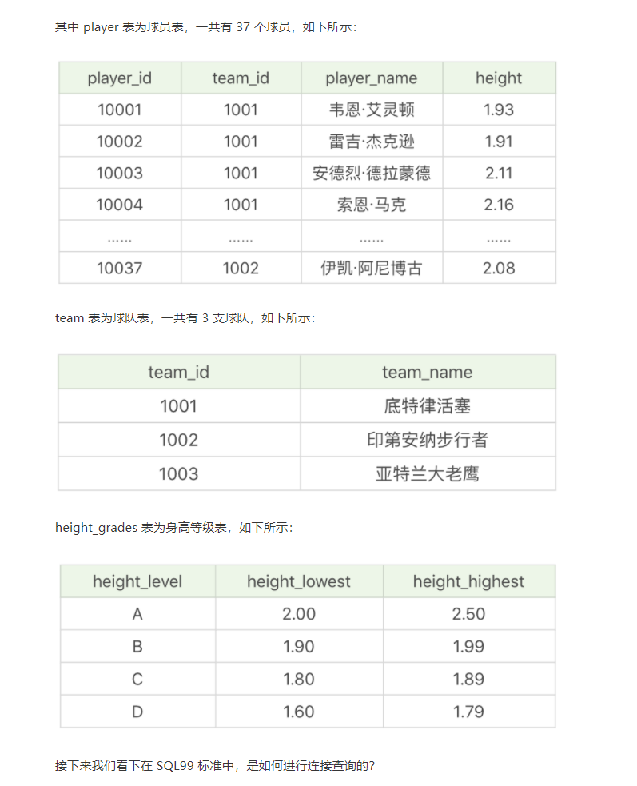
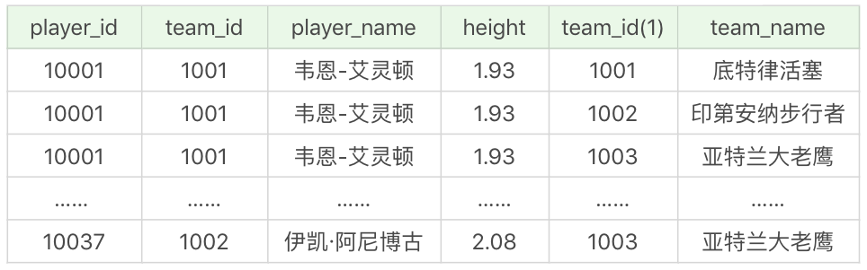
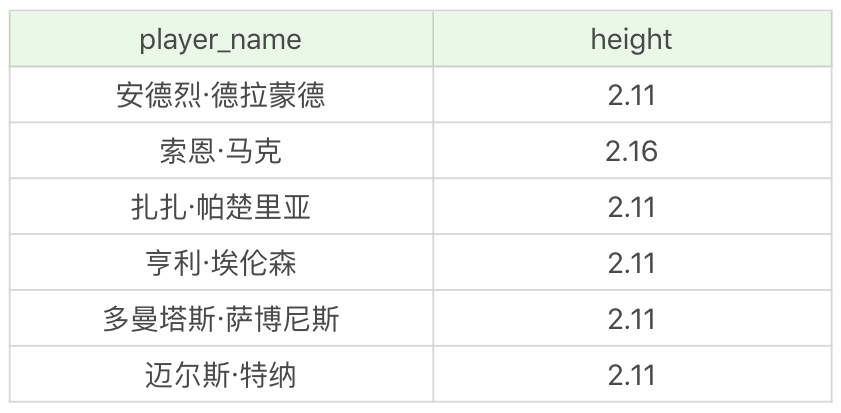

# JOIN

我们知道 SQL 的英文全称叫做 Structured Query Language，它有一个很强大的功能，就是能在各个数据表之间进行连接查询（Query）。这是因为 SQL 是建立在关系型数据库基础上的一种语言。关系型数据库的典型数据结构就是数据表，这些数据表的组成都是结构化的（Structured）。你可以把关系模型理解成一个二维表格模型，这个二维表格是由行（row）和列（column）组成的。每一个行（row）就是一条数据，每一列（column）就是数据在某一维度的属性。

正是因为在数据库中，表的组成是基于关系模型的，所以一个表就是一个关系。一个数据库中可以包括多个表，也就是存在多种数据之间的关系。而我们之所以能使用 SQL 语言对各个数据表进行复杂查询，核心就在于连接，它可以用一条 SELECT 语句在多张表之间进行查询。你也可以理解为，关系型数据库的核心之一就是连接。

既然连接在 SQL 中这么重要，那么针对今天的内容，需要你从以下几个方面进行掌握：

1. SQL 实际上存在不同的标准，不同标准下的连接定义也有不同。你首先需要了解常用的 SQL 标准有哪些；
2. 了解了 SQL 的标准之后，我们从 SQL92 标准入门，来看下连接表的种类有哪些；
3. 针对一个实际的数据库表，如果你想要做数据统计，需要学会使用跨表的连接进行操作。


## 常用的 SQL 标准有哪些

我们首先需要知道 SQL 存在不同版本的标准规范，因为不同规范下的表连接操作是有区别的。

SQL 有两个主要的标准，分别是 SQL92 和 SQL99。92 和 99 代表了标准提出的时间，SQL92 就是 92 年提出的标准规范。当然除了 SQL92 和 SQL99 以外，还存在 SQL-86、SQL-89、SQL:2003、SQL:2008、SQL:2011 和 SQL:2016 等其他的标准。

这么多标准，到底该学习哪个呢？实际上最重要的 SQL 标准就是 SQL92 和 SQL99。一般来说 SQL92 的形式更简单，但是写的 SQL 语句会比较长，可读性较差。而 SQL99 相比于 SQL92 来说，语法更加复杂，但可读性更强。我们从这两个标准发布的页数也能看出，SQL92 的标准有 500 页，而 SQL99 标准超过了 1000 页。实际上你不用担心要学习这么多内容，基本上从 SQL99 之后，很少有人能掌握所有内容，因为确实太多了。就好比我们使用 Windows、Linux 和 Office 的时候，很少有人能掌握全部内容一样。我们只需要掌握一些核心的功能，满足日常工作的需求即可。


## 在 SQL92 中是如何使用连接的

相比于 SQL99，SQL92 规则更简单，更适合入门。在这篇文章中，我会先讲 SQL92 是如何对连接表进行操作的，下一篇文章再讲 SQL99，到时候你可以对比下这两者之间有什么区别。

在进行连接之前，我们需要用数据表做举例。这里我创建了 NBA 球员和球队两张表，SQL 文件你可以从[GitHub](https://github.com/cystanford/sql_nba_data)上下载。

其中 player 表为球员表，一共有 37 个球员，如下所示：



team 表为球队表，一共有 3 支球队，如下所示：



有了这两个数据表之后，我们再来看下 SQL92 中的 5 种连接方式，它们分别是笛卡尔积、等值连接、非等值连接、外连接（左连接、右连接）和自连接。


### 笛卡尔积

笛卡尔乘积是一个数学运算。假设我有两个集合 X 和 Y，那么 X 和 Y 的笛卡尔积就是 X 和 Y 的所有可能组合，也就是第一个对象来自于 X，第二个对象来自于 Y 的所有可能。

我们假定 player 表的数据是集合 X，先进行 SQL 查询：

```sql
SELECT * FROM player
```

再假定 team 表的数据为集合 Y，同样需要进行 SQL 查询：

```sql
SELECT * FROM team
```

你会看到运行结果会显示出上面的两张表格。

接着我们再来看下两张表的笛卡尔积的结果，这是笛卡尔积的调用方式：

```sql
SQL: SELECT * FROM player, team
```

运行结果（一共 37*3=111 条记录）：



笛卡尔积也称为交叉连接，英文是 CROSS JOIN，它的作用就是可以把任意表进行连接，即使这两张表不相关。但我们通常进行连接还是需要筛选的，因此你需要在连接后面加上 WHERE 子句，也就是作为过滤条件对连接数据进行筛选。比如后面要讲到的等值连接。


### 等值连接

两张表的等值连接就是用两张表中都存在的列进行连接。我们也可以对多张表进行等值连接。

针对 player 表和 team 表都存在 team_id 这一列，我们可以用等值连接进行查询。

```sql
SQL: SELECT player_id, player.team_id, player_name, height, team_name FROM player, team WHERE player.team_id = team.team_id
```

运行结果（一共 37 条记录）：



我们在进行等值连接的时候，可以使用表的别名，这样会让 SQL 语句更简洁：

```sql
SELECT player_id, a.team_id, player_name, height, team_name FROM player AS a, team AS b WHERE a.team_id = b.team_id

```

需要注意的是，如果我们使用了表的别名，在查询字段中就只能使用别名进行代替，不能使用原有的表名，比如下面的 SQL 查询就会报错：

```sql
SELECT player_id, player.team_id, player_name, height, team_name FROM player AS a, team AS b WHERE a.team_id = b.team_id
```


### 非等值连接

当我们进行多表查询的时候，如果连接多个表的条件是等号时，就是等值连接，其他的运算符连接就是非等值查询。

这里我创建一个身高级别表height_grades,如下所示



我们知道 player 表中有身高 height 字段，如果想要知道每个球员的身高的级别，可以采用非等值连接查询。

```sql
SQL：SELECT p.player_name, p.height, h.height_level
FROM player AS p, height_grades AS h
WHERE p.height BETWEEN h.height_lowest AND h.height_highest

```

运行结果（37 条记录）：




### 外连接

除了查询满足条件的记录以外，外连接还可以查询某一方不满足条件的记录。两张表的外连接，会有一张是主表，另一张是从表。如果是多张表的外连接，那么第一张表是主表，即显示全部的行，而第剩下的表则显示对应连接的信息。在 SQL92 中采用（+）代表从表所在的位置，而且在 SQL92 中，只有左外连接和右外连接，没有全外连接。

什么是左外连接，什么是右外连接呢？

左外连接，就是指左边的表是主表，需要显示左边表的全部行，而右侧的表是从表，（+）表示哪个是从表。

```sql
SQL：SELECT * FROM player, team where player.team_id = team.team_id(+)
```

相当于 SQL99 中的：

```sql
SQL：SELECT * FROM player LEFT JOIN team on player.team_id = team.team_id
```

右外连接，指的就是右边的表是主表，需要显示右边表的全部行，而左侧的表是从表。

```sql
SQL：SELECT * FROM player, team where player.team_id(+) = team.team_id
```

相当于 SQL99 中的：

```sql
SQL：SELECT * FROM player RIGHT JOIN team on player.team_id = team.team_id
```

需要注意的是，LEFT JOIN 和 RIGHT JOIN 只存在于 SQL99 及以后的标准中，在 SQL92 中不存在，只能用（+）表示。


### 自连接

自连接可以对多个表进行操作，也可以对同一个表进行操作。也就是说查询条件使用了当前表的字段。

比如我们想要查看比布雷克·格里芬高的球员都有谁，以及他们的对应身高：

```sql
SQL：SELECT b.player_name, b.height FROM player as a , player as b WHERE a.player_name = '布雷克 - 格里芬' and a.height < b.height
```

运行结果（6 条记录）：



如果不用自连接的话，需要采用两次 SQL 查询。首先需要查询布雷克·格里芬的身高。

```sql
SQL：SELECT height FROM player WHERE player_name = '布雷克 - 格里芬'
```

运行结果为 2.08。

然后再查询比 2.08 高的球员都有谁，以及他们的对应身高：

```sql
SQL：SELECT player_name, height FROM player WHERE height > 2.08
```

运行结果和采用自连接的运行结果是一致的。


### 总结

今天我讲解了常用的 SQL 标准以及 SQL92 中的连接操作。SQL92 和 SQL99 是经典的 SQL 标准，也分别叫做 SQL-2 和 SQL-3 标准。也正是在这两个标准发布之后，SQL 影响力越来越大，甚至超越了数据库领域。现如今 SQL 已经不仅仅是数据库领域的主流语言，还是信息领域中信息处理的主流语言。在图形检索、图像检索以及语音检索中都能看到 SQL 语言的使用。

除此以外，我们使用的主流 RDBMS，比如 MySQL、Oracle、SQL Sever、DB2、PostgreSQL 等都支持 SQL 语言，也就是说它们的使用符合大部分 SQL 标准，但很难完全符合，因为这些数据库管理系统都在 SQL 语言的基础上，根据自身产品的特点进行了扩充。即使这样，SQL 语言也是目前所有语言中半衰期最长的，在 1992 年，Windows3.1 发布，SQL92 标准也同时发布，如今我们早已不使用 Windows3.1 操作系统，而 SQL92 标准却一直持续至今。

当然我们也要注意到 SQL 标准的变化，以及不同数据库管理系统使用时的差别，比如 Oracle 对 SQL92 支持较好，而 MySQL 则不支持 SQL92 的外连接。


## SQL99是如何使用连接的

上节课我们讲解了 SQL92 标准，在它之后又提出了 SQL99 标准。现在各大 DBMS 中对 SQL99 标准的支持度更好。你一定听说过 LEFT JOIN、RIGHT JOIN 这样的操作符，这实际上就是 SQL99 的标准，在 SQL92 中它们是用（+）代替的。SQL92 和 SQL99 标准原理类似，只是 SQL99 标准的可读性更强。

今天我就来讲解一下 SQL99 标准中的连接查询，在今天的课程中你需要重点掌握以下几方面的内容：

1. SQL99 标准下的连接查询是如何操作的？
2. SQL99 与 SQL92 的区别是什么？
3. 在不同的 DBMS 中，使用连接需要注意什么？


上一篇文章中，我用 NBA 球员的数据表进行了举例，包括了三张数据表 player、team 和 height_grades。




### 交叉连接

交叉连接实际上就是 SQL92 中的笛卡尔乘积，只是这里我们采用的是 CROSS JOIN。

我们可以通过下面这行代码得到 player 和 team 这两张表的笛卡尔积的结果：

```sql
SELECT * FROM player CROSS JOIN team
```

运行结果



如果多张表进行交叉连接，有比如表t1,表t2，表t3进行交叉连接，又可以写成下面这样：

```sql
SELECT* FROM t1 CROSS JOIN t2 CROSS JOIN t3
```


### 自然连接

你可以把自然连接理解为SQL92中的等值连接。他会帮你自动查询两张连接表中所有相同的字段，然后进行等值连接。

如果我们想把 player 表和 team 表进行等值连接，相同的字段是 team_id。还记得在 SQL92 标准中，是如何编写的么？

```sql
SELECT player_id, a.team_id, player_name, height, team_name FROM player as a, team as b WHERE a.team_id = b.team_id
```

在SQL 99中你可以写成：

```sql
SELECT player_id, team_id, player_name, height, team_name FROM player NATURAL JOIN team 
```

实际上，在 SQL99 中用 NATURAL JOIN 替代了 `WHERE player.team_id = team.team_id`。


### ON 连接

ON连接用来指定我们想要的连接条件，针对上面的例子，它同样可以帮助我们实现自然连接的功能：

```sql
SELECT player_id, player.team_id, player_name, height, team_name FROM player JOIN team ON player.team_id = team.team_id
```

这里我们指定了连接条件是`ON player.team_id = team.team_id`，相当于是用 ON 进行了 team_id 字段的等值连接。

当然你也可以 ON 连接进行非等值连接，比如我们想要查询球员的身高等级，需要用 player 和 height_grades 两张表：

```sql
SQL99：SELECT p.player_name, p.height, h.height_level
FROM player as p JOIN height_grades as h
ON height BETWEEN h.height_lowest AND h.height_highest
```

这个语句的运行结果和我们之前采用 SQL92 标准的查询结果一样。

```sql
SQL92：SELECT p.player_name, p.height, h.height_level
FROM player AS p, height_grades AS h
WHERE p.height BETWEEN h.height_lowest AND h.height_highest
```

一般来说在 SQL99 中，我们需要连接的表会采用 JOIN 进行连接，ON 指定了连接条件，后面可以是等值连接，也可以采用非等值连接。


### USING 连接

当我们进行连接的时候，可以用 USING 指定数据表里的同名字段进行等值连接。比如：

```sql
SELECT player_id, team_id, player_name, height, team_name FROM player JOIN team USING(team_id)
```

你能看出与自然连接 NATURAL JOIN 不同的是，USING 指定了具体的相同的字段名称，你需要在 USING 的括号 () 中填入要指定的同名字段。同时使用 JOIN USING 可以简化 JOIN ON 的等值连接，它与下面的 SQL 查询结果是相同的：

```sql
SELECT player_id, player.team_id, player_name, height, team_name FROM player JOIN team ON player.team_id = team.team_id
```


### 外连接

SQL 99 的外连接包括了三种形式

1. 左外连接：LEFT JOIN 或 LEFT OUTER JOIN
2. 右外连接：RIGHT JOIN 或 RIGHT OUTER JOIN
3. 全外连接：FULL JOIN 或 FULL OUTER JOIN

我们在SQL92中讲解了左外连接、右外连接，在 SQL99 中还有全外连接。全外连接实际上就是左外连接和右外连接的结合。在这三种外连接中，我们一般省略 OUTER 不写。

1、左外连接

SQL 92

```SQL
SELECT * FROM player,team where play.team_id = team.team_id(+)
```

SQL 99

```sql
SELECT * FROM player LEFT JOIN team ON player.team_id = team.team_id
```

2、右外连接

SQL 92:

```sql
SELECT * FROM player,team WHERE player.team_id(+) = team.team_id
```

SQL 99:

```SQL
SELECT * FROM player RIGHT JOIN team ON  player.team_id =teamteam.team_id
```

3、全外连接

```sql
SELECT * FROM player FULL JOIN team ON player.team_id = team.team_id
```

需要注意的是MYSQL 不支持全外连接，否则的话全外连接会返回左表和右表中的所有行。当表之间有匹配的行，会显示内连接的结果。当某行在另一个表中没有匹配时，那么会把另一个表中选择的列显示为空值。

也就是说，全外连接的结果 = 左右表匹配的数据 + 左表没有匹配到的数据 + 右表没有匹配到的数据。


### 自连接

自连接的原理在SQL 92 和SQL 99中都是一样的，只是表述方式不同。

比如我们想要查看比布雷克·格里芬身高高的球员都有哪些，在两个 SQL 标准下的查询如下。

SQL 92:

```sql
ELECT b.player_name, b.height FROM player as a , player as b WHERE a.player_name = '布雷克 - 格里芬' and a.height < b.height
```

**SQL99**

```sql
SELECT b.player_name, b.height FROM player as a JOIN player as b ON a.player_name = '布雷克 - 格里芬' and a.height < b.height
```

运行结果（6 条记录）：



## SQL99 和 SQL92 的区别

至此我们讲解完了 SQL92 和 SQL99 标准下的连接查询，它们都对连接进行了定义，只是操作的方式略有不同。我们再来回顾下，这些连接操作基本上可以分成三种情况：

1. 内连接：将多个表之间满足连接条件的数据行查询出来。它包括了等值连接、非等值连接和自连接。
2. 外连接：会返回一个表中的所有记录，以及另一个表中匹配的行。它包括了左外连接、右外连接和全连接。
3. 交叉连接：也称为笛卡尔积，返回左表中每一行与右表中每一行的组合。在 SQL99 中使用的 CROSS JOIN。

不过 SQL92 在这三种连接操作中，和 SQL99 还存在着明显的区别。

首先我们看下 SQL92 中的 WHERE 和 SQL99 中的 JOIN。

你能看出在 SQL92 中进行查询时，会把所有需要连接的表都放到 FROM 之后，然后在 WHERE 中写明连接的条件。而 SQL99 在这方面更灵活，它不需要一次性把所有需要连接的表都放到 FROM 之后，而是采用 JOIN 的方式，每次连接一张表，可以多次使用 JOIN 进行连接。

另外，我建议多表连接使用 SQL99 标准，因为层次性更强，可读性更强，比如：

```sql
SELECT ...
FROM table1
    JOIN table2 ON table1 和 table2 的连接条件
        JOIN table3 ON table2 和 table3 的连接条件
```

它的嵌套逻辑类似我们使用的 FOR 循环：

```sql
for t1 in table1:
    for t2 in table2:
       if condition1:
           for t3 in table3:
              if condition2:
                  output t1 + t2 + t3
```

SQL99 采用的这种嵌套结构非常清爽，即使再多的表进行连接也都清晰可见。如果你采用 SQL92，可读性就会大打折扣。

最后一点就是，SQL99 在 SQL92 的基础上提供了一些特殊语法，比如 NATURAL JOIN 和 JOIN USING。它们在实际中是比较常用的，省略了 ON 后面的等值条件判断，让 SQL 语句更加简洁。

SQL 连接具有通用性，但是不同的 DBMS 在使用规范上会存在差异，在标准支持上也存在不同。在实际工作中，你需要参考你正在使用的 DBMS 文档，这里我整理了一些需要注意的常见的问题。

**1. 不是所有的 DBMS 都支持全外连接**

虽然 SQL99 标准提供了全外连接，但不是所有的 DBMS 都支持。不仅 MySQL 不支持，Access、SQLite、MariaDB 等数据库软件也不支持。不过在 Oracle、DB2、SQL Server 中是支持的。

**2.Oracle 没有表别名 AS**

为了让 SQL 查询语句更简洁，我们经常会使用表别名 AS，不过在 Oracle 中是不存在 AS 的，使用表别名的时候，直接在表名后面写上表别名即可，比如 player p，而不是 player AS p。

**3.SQLite 的外连接只有左连接**

SQLite 是一款轻量级的数据库软件，在外连接上只支持左连接，不支持右连接，不过如果你想使用右连接的方式，比如`table1 RIGHT JOIN table2`，在 SQLite 你可以写成`table2 LEFT JOIN table1`，这样就可以得到相同的效果。

除了一些常见的语法问题，还有一些关于连接的性能问题需要你注意：

**1. 控制连接表的数量**

多表连接就相当于嵌套 for 循环一样，非常消耗资源，会让 SQL 查询性能下降得很严重，因此不要连接不必要的表。在许多 DBMS 中，也都会有最大连接表的限制。

**2. 在连接时不要忘记 WHERE 语句**

多表连接的目的不是为了做笛卡尔积，而是筛选符合条件的数据行，因此在多表连接的时候不要忘记了 WHERE 语句，这样可以过滤掉不必要的数据行返回。

我们在查看比布雷克·格里芬高的球员都有谁的时候，可以使用子查询，也可以使用自连接。一般情况建议你使用自连接，因为在许多 DBMS 的处理过程中，对于自连接的处理速度要比子查询快得多。你可以这样理解：子查询实际上是通过未知表进行查询后的条件判断，而自连接是通过已知的自身数据表进行条件判断，因此在大部分 DBMS 中都对自连接处理进行了优化。


## 总结

连接可以说是 SQL 中的核心操作，通过两篇文章的学习，你已经从多个维度对连接进行了了解。同时，我们对 SQL 的两个重要标准 SQL92 和 SQL99 进行了学习，在我们需要进行外连接的时候，建议采用 SQL99 标准，这样更适合阅读。

此外我还想强调一下，我们在进行连接的时候，使用的关系型数据库管理系统，之所以存在关系是因为各种数据表之间存在关联，它们并不是孤立存在的。在实际工作中，尤其是做业务报表的时候，我们会用到 SQL 中的连接操作（JOIN），因此我们需要理解和熟练掌握 SQL 标准中连接的使用，以及不同 DBMS 中对连接的语法规范。剩下要做的，就是通过做练习和实战来增强你的经验了，做的练习多了，也就自然有感觉了。