# SQL函数


## 什么是SQL函数？为什么使用SQL函数可能会带来问题？

函数在计算机语言的使用中贯穿始终，在 SQL 中我们也可以使用函数对检索出来的数据进行函数操作，比如求某列数据的平均值，或者求字符串的长度等。从函数定义的角度出发，我们可以将函数分成内置函数和自定义函数。在 SQL 语言中，同样也包括了内置函数和自定义函数。内置函数是系统内置的通用函数，而自定义函数是我们根据自己的需要编写的，下面讲解的是 SQL 的内置函数。

你需要从以下几个方面掌握 SQL 函数：

1. 什么是 SQL 函数？
2. 内置的 SQL 函数都包括哪些？
3. 如何使用 SQL 函数对一个数据表进行操作，比如针对一个王者荣耀的英雄数据库，我们可以使用这些函数完成哪些操作？
4. 什么情况下使用 SQL 函数？为什么使用 SQL 函数有时候会带来问题？


### 什么是 SQL 函数

当我们学习编程语言的时候，也会遇到函数。函数的作用是什么呢？它可以把我们经常使用的代码封装起来，需要的时候直接调用即可。这样既提高了代码效率，又提高了可维护性。

SQL 中的函数一般是在数据上执行的，可以很方便地转换和处理数据。一般来说，当我们从数据表中检索出数据之后，就可以进一步对这些数据进行操作，得到更有意义的结果，比如返回指定条件的函数，或者求某个字段的平均值等。


### 常用的 SQL 函数有哪些

SQL 提供了一些常用的内置函数，当然你也可以自己定义 SQL 函数。SQL 的内置函数对于不同的数据库软件来说具有一定的通用性，我们可以把内置函数分成四类：

1. 算术函数
2. 字符串函数
3. 日期函数
4. 转换函数

这 4 类函数分别代表了算术处理、字符串处理、日期处理、数据类型转换，它们是 SQL 函数常用的划分形式，你可以思考下，为什么是这 4 个维度？

函数是对提取出来的数据进行操作，那么数据表中字段类型的定义有哪几种呢？

我们经常会保存一些数值，不论是整数类型，还是浮点类型，实际上对应的就是数值类型。同样我们也会保存一些文本内容，可能是人名，也可能是某个说明，对应的就是字符串类型。此外我们还需要保存时间，也就是日期类型。那么针对数值、字符串和日期类型的数据，我们可以对它们分别进行算术函数、字符串函数以及日期函数的操作。如果想要完成不同类型数据之间的转换，就可以使用转换函数。


### 算术函数

算术函数，顾名思义就是对数值类型的字段进行算术运算。常用的算术函数及含义如下表所示：


这里我举一些简单的例子，你来体会下：
SELECT ABS(-2)，运行结果为 2。
SELECT MOD(101,3)，运行结果 2。
SELECT ROUND(37.25,1)，运行结果 37.3。 


### 字符串函数 

常用的字符串函数操作包括了字符串拼接，大小写转换，求长度以及字符串替换和截取等。具体的函数名称及含义如下表所示：

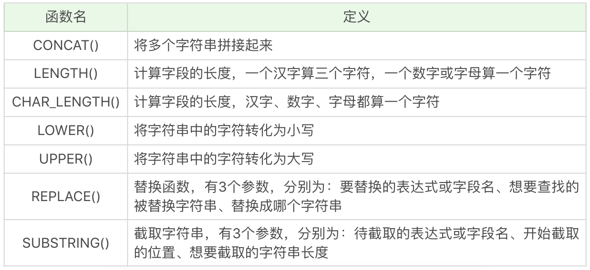

这里同样有一些简单的例子，你可以自己运行下：

`SELECT CONCAT('abc', 123)`，运行结果为 abc123。

`SELECT LENGTH('你好')`，运行结果为 6。

`SELECT CHAR_LENGTH('你好')`，运行结果为 2。

`SELECT LOWER('ABC')`，运行结果为 abc。

`SELECT UPPER('abc')`，运行结果 ABC。

`SELECT REPLACE('fabcd', 'abc', 123)`，运行结果为 f123d。

`SELECT SUBSTRING('fabcd', 1,3)`，运行结果为 fab。


### 日期函数

日期函数是对数据表中的日期进行处理，常用的函数包括：

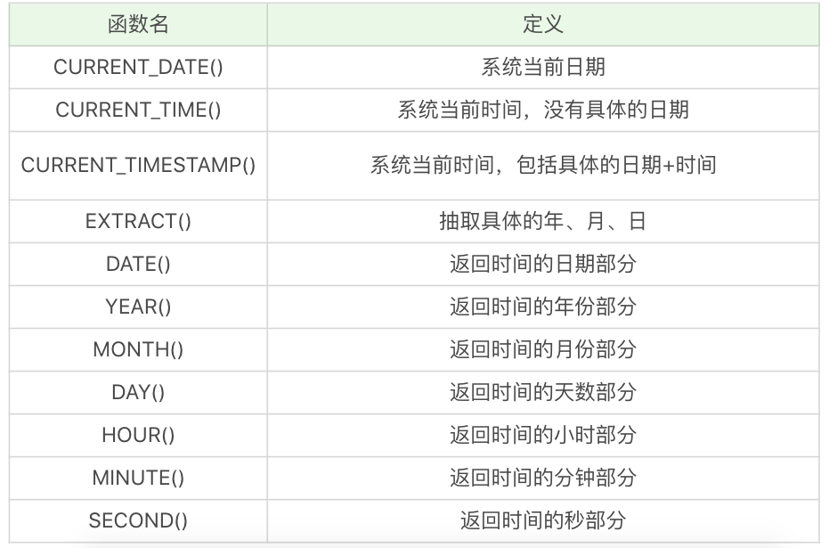

下面是一些简单的例子，你可自己运行下：

`SELECT CURRENT_DATE()`，运行结果为 2019-04-03。

`SELECT CURRENT_TIME()`，运行结果为 21:26:34。

`SELECT CURRENT_TIMESTAMP()`，运行结果为 2019-04-03 21:26:34。

`SELECT EXTRACT(YEAR FROM '2019-04-03')`，运行结果为 2019。

`SELECT DATE('2019-04-01 12:00:05')`，运行结果为 2019-04-01。

这里需要注意的是，DATE 日期格式必须是 yyyy-mm-dd 的形式。如果要进行日期比较，就要使用 DATE 函数，不要直接使用日期与字符串进行比较，我会在后面的例子中讲具体的原因。


### 转换函数

转换函数可以转换数据之间的类型，常用的函数如下表所示：

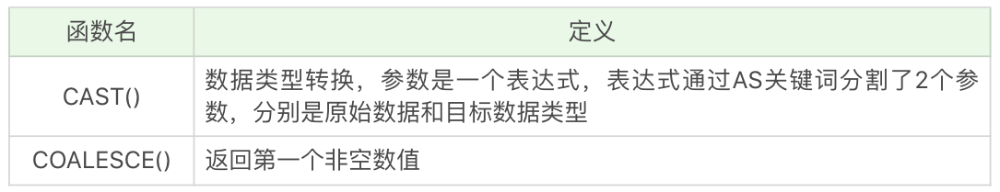

这两个函数不像其他函数，看一眼函数名就知道代表什么、如何使用。下面举了这两个函数的例子，你需要自己运行下：

`SELECT CAST(123.123 AS INT)`，运行结果会报错。

`SELECT CAST(123.123 AS DECIMAL(8,2))`，运行结果为 123.12。

`SELECT COALESCE(null,1,2)`，运行结果为 1。

CAST 函数在转换数据类型的时候，不会四舍五入，如果原数值有小数，那么转换为整数类型的时候就会报错。不过你可以指定转化的小数类型，在 MySQL 和 SQL Server 中，你可以用`DECIMAL(a,b)`来指定，其中 a 代表整数部分和小数部分加起来最大的位数，b 代表小数位数，比如`DECIMAL(8,2)`代表的是精度为 8 位（整数加小数位数最多为 8 位），小数位数为 2 位的数据类型。所以`SELECT CAST(123.123 AS DECIMAL(8,2))`的转换结果为 123.12。


### 用 SQL 函数对王者荣耀英雄数据做处理

显示英雄以及他的物攻成长，对应字段为`attack_growth`。我们让这个字段精确到小数点后一位，需要使用的是算术函数里的 ROUND 函数。

```sql
SELECT name, ROUND(attack_growth,1) FROM heros
```

代码中，`ROUND(attack_growth,1)`中的`attack_growth`代表想要处理的数据，“1”代表四舍五入的位数，也就是我们这里需要精确到的位数。

运行结果为：

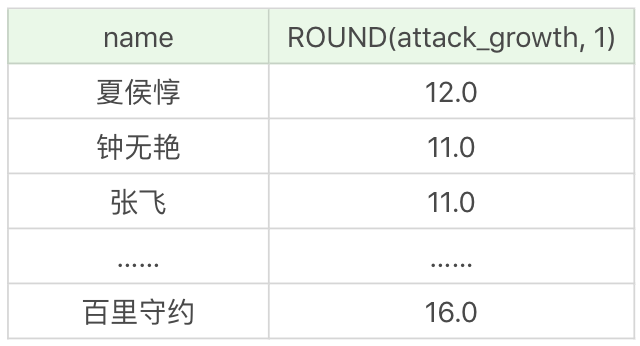

假设我们想显示英雄最大生命值的最大值，就需要用到 MAX 函数。在数据中，“最大生命值”对应的列数为`hp_max`，在代码中的格式为`MAX(hp_max)`。

```sql
SELECT MAX(hp_max) FROM heros
```

运行结果为 9328。

假如我们想要知道最大生命值最大的是哪个英雄，以及对应的数值，就需要分成两个步骤来处理：首先找到英雄的最大生命值的最大值，即`SELECT MAX(hp_max) FROM heros`，然后再筛选最大生命值等于这个最大值的英雄，如下所示。

```sql
SELECT name, hp_max FROM heros WHERE hp_max = (SELECT MAX(hp_max) FROM heros)
```

运行结果：

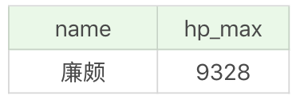


假如我们想显示英雄的名字，以及他们的名字字数，需要用到`CHAR_LENGTH`函数。

```sql
SELECT CHAR_LENGTH(name), name FROM heros
```

运行结果为：

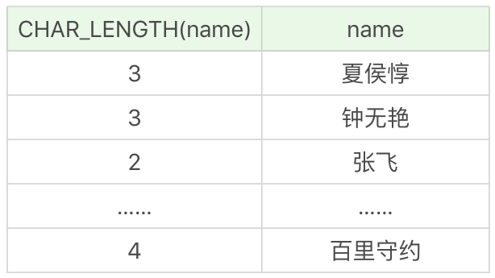

假如想要提取英雄上线日期（对应字段 birthdate）的年份，只显示有上线日期的英雄即可（有些英雄没有上线日期的数据，不需要显示），这里我们需要使用 EXTRACT 函数，提取某一个时间元素。所以我们需要筛选上线日期不为空的英雄，即`WHERE birthdate is not null`，然后再显示他们的名字和上线日期的年份，即：

```sql
SELECT name, EXTRACT(YEAR FROM birthdate) AS birthdate FROM heros WHERE birthdate is NOT NULL
```

或者使用如下形式：

```sql
SELECT name, YEAR(birthdate) AS birthdate FROM heros WHERE birthdate is NOT NULL
```

运行结果为：

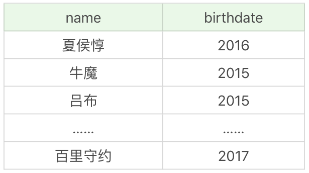

假设我们需要找出在 2016 年 10 月 1 日之后上线的所有英雄。这里我们可以采用 DATE
函数来判断 birthdate 的日期是否大于 2016-10-01，即WHERE
DATE(birthdate)>'2016-10-01'，然后再显示符合要求的全部字段信息，即： 

```sql
SELECT * FROM heros WHERE DATE(birthdate)>'2016-10-01'
```

需要注意的是下面这种写法是不安全的 

```sql
SELECT * FROM heros WHERE birthdate>'2016-10-01
```

因为很多时候你无法确认 birthdate 的数据类型是字符串，还是 datetime 类型，如果你想
对日期部分进行比较，那么使用DATE(birthdate)来进行比较是更安全的。 

运行结果为 

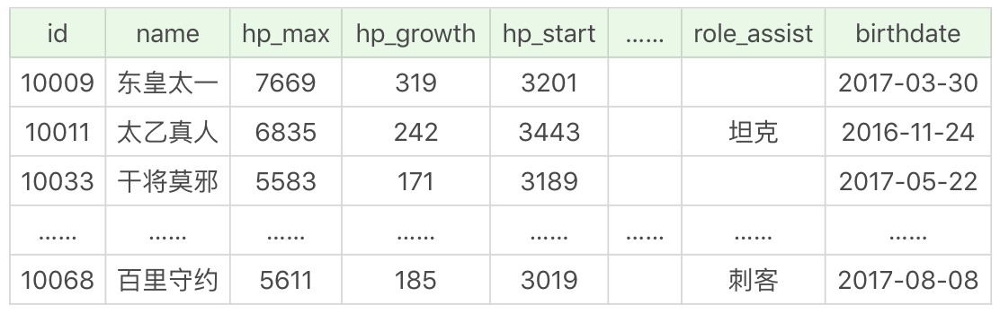

假设我们需要知道在 2016 年 10 月 1 日之后上线英雄的平均最大生命值、平均最大法力和最高物攻最大值。同样我们需要先筛选日期条件，即`WHERE DATE(birthdate)>'2016-10-01'`，然后再选择`AVG(hp_max), AVG(mp_max), MAX(attack_max)`字段进行显示。

```sql
SELECT AVG(hp_max), AVG(mp_max), MAX(attack_max) FROM heros WHERE DATE(birthdate)>'2016-10-01'
```

运行结果为：

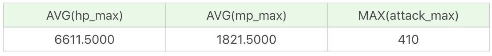


### 为什么使用 SQL 函数会带来问题 

尽管 SQL 函数使用起来会很方便，但我们使用的时候还是要谨慎，因为你使用的函数很可能在运行环境中无法工作，这是为什么呢？

如果你学习过编程语言，就会知道语言是有不同版本的，比如 Python 会有 2.7 版本和 3.x 版本，不过它们之间的函数差异不大，也就在 10% 左右。但我们在使用 SQL 语言的时候，不是直接和这门语言打交道，而是通过它使用不同的数据库软件，即 DBMS。DBMS 之间的差异性很大，远大于同一个语言不同版本之间的差异。实际上，只有很少的函数是被 DBMS 同时支持的。比如，大多数 DBMS 使用（||）或者（+）来做拼接符，而在 MySQL 中的字符串拼接函数为`Concat()`。大部分 DBMS 会有自己特定的函数，这就意味着采用 SQL 函数的代码可移植性是很差的，因此在使用函数的时候需要特别注意。


### 关于大小写的规范

细心的人可能会发现，我在写 SELECT 语句的时候用的是大写，而你在网上很多地方，包括你自己写的时候可能用的是小写。实际上在 SQL 中，关键字和函数名是不用区分字母大小写的，比如 SELECT、WHERE、ORDER、GROUP BY 等关键字，以及 ABS、MOD、ROUND、MAX 等函数名。

不过在 SQL 中，你还是要确定大小写的规范，因为在 Linux 和 Windows 环境下，你可能会遇到不同的大小写问题。

比如 MySQL 在 Linux 的环境下，数据库名、表名、变量名是严格区分大小写的，而字段名是忽略大小写的。

而 MySQL 在 Windows 的环境下全部不区分大小写。

这就意味着如果你的变量名命名规范没有统一，就可能产生错误。这里有一个有关命名规范的建议：

1. 关键字和函数名称全部大写；
2. 数据库名、表名、字段名称全部小写；
3. SQL 语句必须以分号结尾。

虽然关键字和函数名称在 SQL 中不区分大小写，也就是如果小写的话同样可以执行，但是数据库名、表名和字段名在 Linux MySQL 环境下是区分大小写的，因此建议你统一这些字段的命名规则，比如全部采用小写的方式。同时将关键词和函数名称全部大写，以便于区分数据库名、表名、字段名。


## 什么是SQL的聚集函数，如何利用它们汇总表的数据？

我们上节课讲到了 SQL 函数，包括算术函数、字符串函数、日期函数和转换函数。实际上 SQL 函数还有一种，叫做聚集函数，它是对一组数据进行汇总的函数，输入的是一组数据的集合，输出的是单个值。通常我们可以利用聚集函数汇总表的数据，如果稍微复杂一些，我们还需要先对数据做筛选，然后再进行聚集，比如先按照某个条件进行分组，对分组条件进行筛选，然后得到筛选后的分组的汇总信息。

有关今天的内容，你重点需要掌握以下几个方面：

1. 聚集函数都有哪些，能否在一条 SELECT 语句中使用多个聚集函数；
2. 如何对数据进行分组，并进行聚集统计；
3. 如何使用 HAVING 过滤分组，HAVING 和 WHERE 的区别是什么。


### 聚集函数都有哪些

SQL 中的聚集函数一共包括 5 个，可以帮我们求某列的最大值、最小值和平均值等，它们分别是：

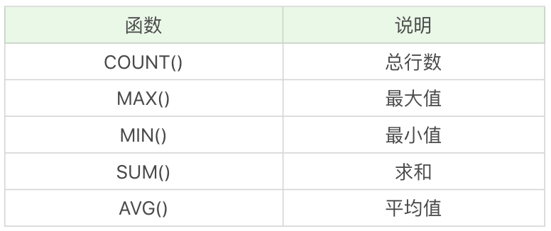

这些函数你可能已经接触过，我们再来简单复习一遍。我们继续使用 heros 数据表，对王者荣耀的英雄数据进行聚合。

如果我们想要查询最大生命值大于 6000 的英雄数量。

```sql
SELECT COUNT(*) FROM heros WHERE hp_max > 6000
```

运行结果为 41。

如果想要查询最大生命值大于 6000，且有次要定位的英雄数量，需要使用 COUNT 函数。

```sql
SELECT COUNT(role_assist) FROM heros WHERE hp_max > 6000
```

运行结果是 23。

需要说明的是，有些英雄没有次要定位，即 role_assist 为 NULL，这时`COUNT(role_assist)`会忽略值为 NULL 的数据行，而 COUNT(*) 只是统计数据行数，不管某个字段是否为 NULL。

如果我们想要查询射手（主要定位或者次要定位是射手）的最大生命值的最大值是多少，需要使用 MAX 函数。

```sql
SELECT MAX(hp_max) FROM heros WHERE role_main = '射手' or role_assist = '射手'
```

运行结果为 6014。


你能看到，上面的例子里，都是在一条 SELECT 语句中使用了一次聚集函数，实际上我们也可以在一条 SELECT 语句中进行多项聚集函数的查询，比如我们想知道射手（主要定位或者次要定位是射手）的英雄数、平均最大生命值、法力最大值的最大值、攻击最大值的最小值，以及这些英雄总的防御最大值等汇总数据。

如果想要知道英雄的数量，我们使用的是 COUNT(*) 函数，求平均值、最大值、最小值，以及总的防御最大值，我们分别使用的是 AVG、MAX、MIN 和 SUM 函数。另外我们还需要对英雄的主要定位和次要定位进行筛选，使用的是`WHERE role_main = '射手' or role_assist = '射手'`。

```sql
SELECT COUNT(*), AVG(hp_max), MAX(mp_max), MIN(attack_max), SUM(defense_max) FROM heros WHERE role_main = '射手' or role_assist = '射手'
```

运行结果：

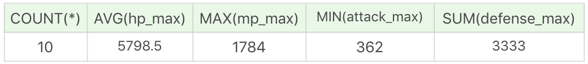

需要说明的是 AVG、MAX、MIN 等聚集函数会自动忽略值为 NULL 的数据行，MAX 和 MIN 函数也可以用于字符串类型数据的统计，如果是英文字母，则按照 A—Z 的顺序排列，越往后，数值越大。如果是汉字则按照全拼拼音进行排列。比如：

```sql
SELECT MIN(CONVERT(name USING gbk)), MAX(CONVERT(name USING gbk)) FROM heros
```

运行结果：

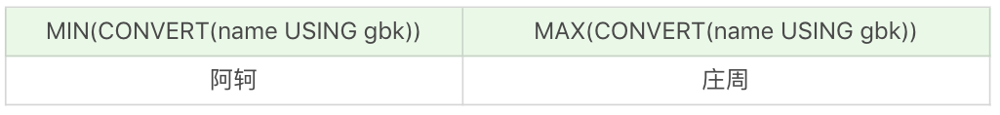

需要说明的是，我们需要先把 name 字段统一转化为 gbk 类型，使用CONVERT(nameUSING gbk)，然后再使用 MIN 和 MAX 取最小值和最大值。 

我们也可以对数据行中不同的取值进行聚集，先用 DISTINCT 函数取不同的数据，然后再使用聚集函数。比如我们想要查询不同的生命最大值的英雄数量是多少。

```sql
SELECT COUNT(DISTINCT hp_max) FROM heros
```

运行结果为 61。

实际上在 heros 这个数据表中，一共有 69 个英雄数量，生命最大值不一样的英雄数量是 61 个。


假如我们想要统计不同生命最大值英雄的平均生命最大值，保留小数点后两位。首先需要取不同生命最大值，即`DISTINCT hp_max`，然后针对它们取平均值，即`AVG(DISTINCT hp_max)`，最后再针对这个值保留小数点两位，也就是`ROUND(AVG(DISTINCT hp_max), 2)`。

```sql
SELECT ROUND(AVG(DISTINCT hp_max), 2) FROM heros
```

运行结果为 6653.84。

你能看到，如果我们不使用 DISTINCT 函数，就是对全部数据进行聚集统计。如果使用了 DISTINCT 函数，就可以对数值不同的数据进行聚集。一般我们使用 MAX 和 MIN 函数统计数据行的时候，不需要再额外使用 DISTINCT，因为使用 DISTINCT 和全部数据行进行最大值、最小值的统计结果是相等的。


### 如何对数据进行分组，并进行聚集统计

我们在做统计的时候，可能需要先对数据按照不同的数值进行分组，然后对这些分好的组进行聚集统计。对数据进行分组，需要使用 GROUP BY 子句。

比如我们想按照英雄的主要定位进行分组，并统计每组的英雄数量。

```sql
 SELECT COUNT(*), role_main FROM heros GROUP BY role_main
```

运行结果（6 条记录）：

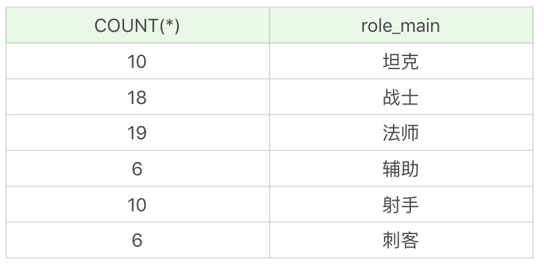

如果我们想要对英雄按照次要定位进行分组，并统计每组英雄的数量。

```sql
SELECT COUNT(*), role_assist FROM heros GROUP BY role_assist
```

运行结果：（6 条记录）

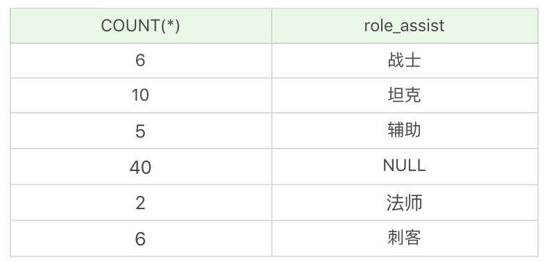

你能看出如果字段为 NULL，也会被列为一个分组。在这个查询统计中，次要定位为 NULL，即只有一个主要定位的英雄是 40 个。


我们也可以使用多个字段进行分组，这就相当于把这些字段可能出现的所有的取值情况都进行分组。比如，我们想要按照英雄的主要定位、次要定位进行分组，查看这些英雄的数量，并按照这些分组的英雄数量从高到低进行排序。

```sql
SELECT COUNT(*) as num, role_main, role_assist FROM heros GROUP BY role_main, role_assist ORDER BY num DESC
```

运行结果：（19 条记录）

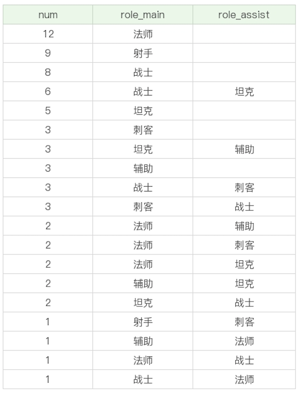


### 如何使用 HAVING 过滤分组，它与 WHERE 的区别是什么？ 

当我们创建出很多分组的时候，有时候就需要对分组进行过滤。你可能首先会想到 WHERE 子句，实际上过滤分组我们使用的是 HAVING。HAVING 的作用和 WHERE 一样，都是起到过滤的作用，只不过 WHERE 是用于数据行，而 HAVING 则作用于分组。

比如我们想要按照英雄的主要定位、次要定位进行分组，并且筛选分组中英雄数量大于 5 的组，最后按照分组中的英雄数量从高到低进行排序。

首先我们需要获取的是英雄的数量、主要定位和次要定位，即`SELECT COUNT(*) as num, role_main, role_assist`。然后按照英雄的主要定位和次要定位进行分组，即`GROUP BY role_main, role_assist`，同时我们要对分组中的英雄数量进行筛选，选择大于 5 的分组，即`HAVING num > 5`，然后按照英雄数量从高到低进行排序，即`ORDER BY num DESC`。

```sql
SELECT COUNT(*) as num, role_main, role_assist FROM heros GROUP BY role_main, role_assist HAVING num > 5 ORDER BY num DESC
```

运行结果：（4 条记录）

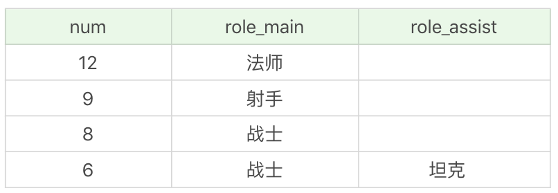

你能看到还是上面这个分组，只不过我们按照数量进行了过滤，筛选了数量大于 5 的分组进行输出。如果把 HAVING 替换成了 WHERE，SQL 则会报错。对于分组的筛选，我们一定要用 HAVING，而不是 WHERE。另外你需要知道的是，HAVING 支持所有 WHERE 的操作，因此所有需要 WHERE 子句实现的功能，你都可以使用 HAVING 对分组进行筛选。


我们再来看个例子，通过这个例子查看一下 WHERE 和 HAVING 进行条件过滤的区别。筛选最大生命值大于 6000 的英雄，按照主要定位、次要定位进行分组，并且显示分组中英雄数量大于 5 的分组，按照数量从高到低进行排序。

```sql
SELECT COUNT(*) as num, role_main, role_assist FROM heros WHERE hp_max > 6000 GROUP BY role_main, role_assist HAVING num > 5 ORDER BY num DESC
```

运行结果：（2 条记录）

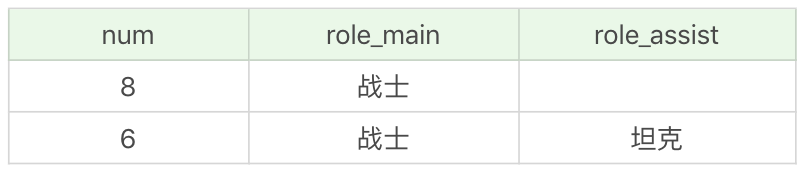你能看到，还是针对上一个例子的查询，只是我们先增加了一个过滤条件，即筛选最大生命值大于 6000 的英雄。这里我们就需要先使用 WHERE 子句对最大生命值大于 6000 的英雄进行条件过滤，然后再使用 GROUP BY 进行分组，使用 HAVING 进行分组的条件判断，然后使用 ORDER BY 进行排序。


### 总结

**你要记住，在 SELECT 查询中，关键字的顺序是不能颠倒的，它们的顺序是：**

SELECT ... FROM ... WHERE ... GROUP BY ... HAVING ... ORDER BY ...

另外需要注意的是，使用 GROUP BY 进行分组，如果想让输出的结果有序，可以在 GROUP BY 后使用 ORDER BY。因为 GROUP BY 只起到了分组的作用，排序还是需要通过 ORDER BY 来完成。

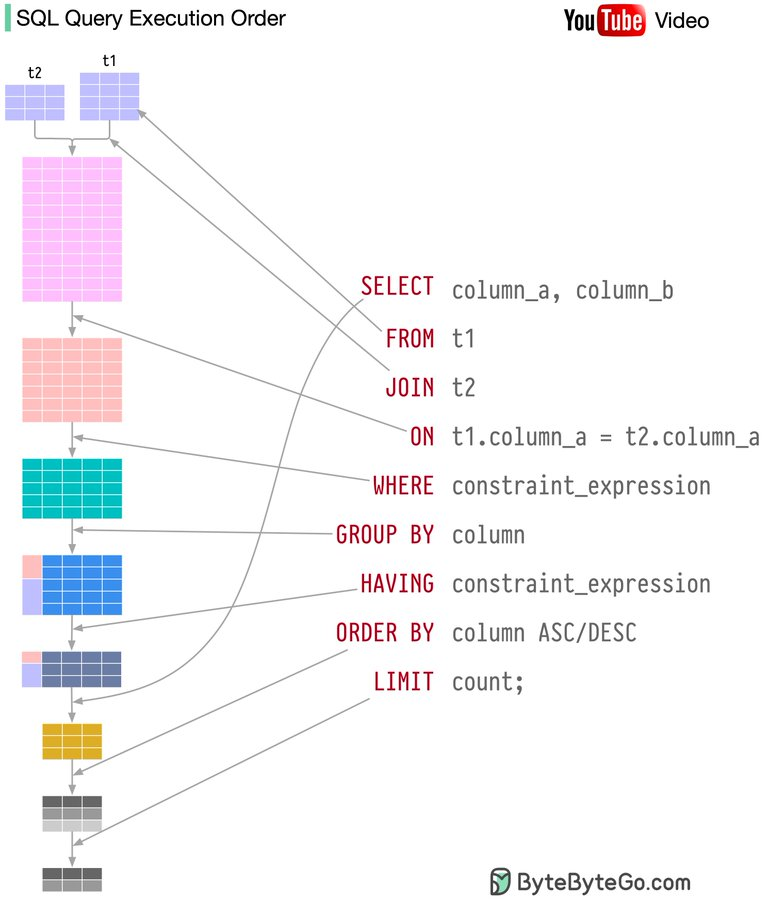