## SQL可能是你掌握的最有用的技能 

尽管技术人员或多或少地会使用 SQL，但不同的人编写出来的 SQL 的效率是不同的，比如
说一份好的 SQL 执行计划就会尽量减少 I/O 操作，因为 I/O 是 DBMS 最容易出现瓶颈的
地方，可以说数据库操作中有大量的时间都花在了 I/O 上。
此外，你还需要考虑如何降低 CPU 的计算量，在 SQL 语句中使用 GROUP BY、ORDER
BY 等这些语句会消耗大量的 CPU 计算资源，因此我们需要从全局出发，不仅需要考虑数
据库的 I/O 性能，还需要考虑 CPU 计算、内存使用情况等 。

比如 EXIST 查询和 IN 查询在某些情况下可以得到相同的结果，但是具体执行起来，哪个效
率更高呢？
假设我把这个模式抽象为下面这样： 

```sql
1 SELECT * FROM A WHERE cc IN (SELECT cc FROM B)
```


```sql
 SELECT * FROM A WHERE EXIST (SELECT cc FROM B WHERE B.cc=A.cc)
```

在查询过程中，我们需要判断表 A 和表 B 的大小。如果表 A 比表 B 大，那么 IN 子查询的
效率比 EXIST 子查询效率高。 

假如你是一名运营人员，想要看下 7 天内的新增用户数有多少，该怎么做呢？首先我们需
要获取现在的时间，使用 NOW() 函数即可，然后把它转化成天数，与用户的注册时间进行
对比，小于 7 天的时间即是我们的筛选条件，最后就可以得到想要的数据了： 

>SELECT COUNT(*) as num FROM new_user WHERE TO_DAYS(NOW())-TO_DAYS(regist_time)<=7 


## sql语法基础篇

### 了解SQL：一门半衰期很长的语言 

SQL 有两个重要的标准，分别是 SQL92 和 SQL99，它们分别代表了 92 年和 99 年颁布的
SQL 标准，我们今天使用的 SQL 语言依然遵循这些标准。

**我们可以把 SQL 语言按照功能划分成以下的 4 个部分** 

1. DDL，英文叫做 Data Definition Language，也就是数据定义语言，它用来定义我们的
数据库对象，包括数据库、数据表和列。通过使用 DDL，我们可以创建，删除和修改数
据库和表结构。
2. DML，英文叫做 Data Manipulation Language，数据操作语言，我们用它操作和数据
库相关的记录，比如增加、删除、修改数据表中的记录。
3. DCL，英文叫做 Data Control Language，数据控制语言，我们用它来定义访问权限和
安全级别。 
4. DQL，英文叫做 Data Query Language，数据查询语言，我们用它查询想要的记录，它
    是 SQL 语言的重中之重。在实际的业务中，我们绝大多数情况下都是在和查询打交道，
    因此学会编写正确且高效的查询语句，是学习的重点。 

#### 开启 SQL 之旅 

SQL 是我们与 DBMS 交流的语言，我们在创建 DBMS 之前，还需要对它进行设计，对于
RDBMS 来说采用的是 ER 图（Entity Relationship Diagram），即实体 - 关系图的方式
进行设计。 

ER 图评审通过后，我们再用 SQL 语句或者可视化管理工具（如 Navicat）创建数据表。 

实体 - 关系图有什么用呢？它是我们用来描述现实世界的概念模型，在这个模型中有 3 个
要素：实体、属性、关系 

>实体就是我们要管理的对象，属性是标识每个实体的属性，关系则是对象之间的关系。比如
>我们创建了“英雄”这个实体，那么它下面的属性包括了姓名、职业、最大生命值、初始生 
>
>命值、最大魔法值、初始魔法值和攻击范围等。同时，我们还有“用户”这个实体，它下面
>的属性包括用户 ID、登录名、密码、性别和头像等。 
>
>英雄”和“用户”这两个实体之间就是多对多的关系，也就是说一个英雄可以从属多个用
>户，而一个用户也可以拥有多个英雄。 

除了多对多之外，也有一对一和一对多的关系。 

创建完数据表之后，我们就可以用 SQL 操作了。你能看到很多 SQL 语句的大小写不统一，
虽然大小写不会影响 SQL 的执行，不过我还是推荐你采用统一的书写规范，因为好的代码
规范是提高效率的关键 

**关于 SQL 大小写的问题，我总结了下面两点：** 

1. 表名、表别名、字段名、字段别名等都小写；
2. SQL 保留字、函数名、绑定变量等都大写。 

比如下面这个 SQL 语句： 

```sql
SELECT name, hp_max FROM heros WHERE role_main = '战士'
```

你能看到 SELECT、FROM、WHERE 这些常用的 SQL 保留字都采用了大写，而 name、
hp_max、role_main 这些字段名，表名都采用了小写。此外在数据表的字段名推荐采用下
划线命名，比如 role_main 这种。 

### DBMS的前世今生

#### DB、DBS 和 DBMS 的区别是什么 

DBMS 的英文全称是 DataBase Management System，数据库管理系统，实际上它可以
对多个数据库进行管理，所以你可以理解为 DBMS = 多个数据库（DB） + 管理程序。 

DB 的英文是 DataBase，也就是数据库。数据库是存储数据的集合，你可以把它理解为多
个数据表。 

DBS 的英文是 DataBase System，数据库系统。它是更大的概念，包括了数据库、数据库
管理系统以及数据库管理人员 DBA。 

这里需要注意的是，虽然我们有时候把 Oracle、MySQL 等称之为数据库，但确切讲，它
们应该是数据库管理系统，即 DBMS 

#### 排名前 20 的 DBMS 都是那些 

>了解了 DBMS 的概念之后，我们来看下当前主流的 DBMS 都有哪些。下面这张表是 2019
>年 5 月 DB-Engines 公布的 DBMS 的排名（每年的排名会有更新，主要依据这些 DBMS
>在搜索引擎上的热度）： 


从排名中我们能看出来，关系型数据库绝对是 DBMS 的主流，其中使用最多的 DBMS 分
别是 Oracle、MySQL 和 SQL Server。 

关系型数据库（RDBMS）就是建立在关系模型基础上的数据库，SQL 就是关系型数据库的
查询语言。 

相比于 SQL，NoSQL 泛指非关系型数据库，包括了榜单上的键值型数据库、文档型数据
库、搜索引擎和列存储等，除此以外还包括图形数据库。 

键值型数据库通过 Key-Value 键值的方式来存储数据，其中 Key 和 Value 可以是简单的
对象，也可以是复杂的对象。Key 作为唯一的标识符，优点是查找速度快，在这方面明显
优于关系型数据库，同时缺点也很明显，它无法像关系型数据库一样自由使用条件过滤（比 

如 WHERE），如果你不知道去哪里找数据，就要遍历所有的键，这就会消耗大量的计算。
键值型数据库典型的使用场景是作为内容缓存。Redis 是最流行的键值型数据库。 

文档型数据库用来管理文档，在数据库中文档作为处理信息的基本单位，一个文档就相当于
一条记录，MongoDB 是最流行的文档型数据库。 

搜索引擎也是数据库检索中的重要应用，常见的全文搜索引擎有 Elasticsearch、Splunk 和
Solr。虽然关系型数据库采用了索引提升检索效率，但是针对全文索引效率却较低。搜索引
擎的优势在于采用了全文搜索的技术，核心原理是“倒排索引” 

列式数据库是相对于行式存储的数据库，Oracle、MySQL、SQL Server 等数据库都是采用
的行式存储（Row-based），而列式数据库是将数据按照列存储到数据库中，这样做的好
处是可以大量降低系统的 I/O，适合于分布式文件系统，不足在于功能相对有限。 

图形数据库，利用了图这种数据结构存储了实体（对象）之间的关系。最典型的例子就是社
交网络中人与人的关系，数据模型主要是以节点和边（关系）来实现，特点在于能高效地解
决复杂的关系问题 


### 学会用数据库的方式思考SQL是如何执行的 

虽然 SQL 是声明式语言，我们可以像使用英语一样使用它，不过在 RDBMS（关系型数据库管理 系统）中，SQL 的实现方式还是有差别的。今天我们就从数据库的角度来思考一下 SQL 是如何被执行的。 

关于今天的内容，你会从以下几个方面进行学习：
1. Oracle 中的 SQL 是如何执行的，什么是硬解析和软解析；
2. MySQL 中的 SQL 是如何执行的，MySQL 的体系结构又是怎样的；
3. 什么是存储引擎，MySQL 的存储引擎都有哪些？ 

#### Oracle 中的 SQL 是如何执行的 

我们先来看下 SQL 在 Oracle 中的执行过程： 


从上面这张图中可以看出，SQL 语句在 Oracle 中经历了以下的几个步骤。 

1. 语法检查：检查 SQL 拼写是否正确，如果不正确，Oracle 会报语法错误。
2. 语义检查：检查 SQL 中的访问对象是否存在。比如我们在写 SELECT 语句的时候，列名写错了，系统就会提示错
误。语法检查和语义检查的作用是保证 SQL 语句没有错误。
3. 权限检查：看用户是否具备访问该数据的权限。
4. 共享池检查：共享池（Shared Pool）是一块内存池，最主要的作用是缓存 SQL 语句和该语句的执行计划。Oracle通过检查共享池是否存在 SQL 语句的执行计划，来判断进行软解析，还是硬解析。那软解析和硬解析又该怎么理解呢？
在共享池中，Oracle 首先对 SQL 语句进行 Hash 运算，然后根据 Hash 值在库缓存（Library Cache）中查找，如果存在 SQL 语句的执行计划，就直接拿来执行，直接进入“执行器”的环节，这就是软解析。如果没有找到 SQL 语句和执行计划，Oracle 就需要创建解析树进行解析，生成执行计划，进入“优化器”这个步骤，这就是硬解析。
5. 优化器：优化器中就是要进行硬解析，也就是决定怎么做，比如创建解析树，生成执行计划。
6. 执行器：当有了解析树和执行计划之后，就知道了 SQL该怎么被执行，这样就可以在执行器中执行语句了。

共享池是 Oracle 中的术语，包括了库缓存，数据字典缓冲区等。我们上面已经讲到了库缓存区，它主要缓存 SQL 语句和执行计划。而数据字典缓冲区存储的是 Oracle 中的对象定义，比如表、视图、索引等对象。当对 SQL 语句进行解析的时候，如果需要相关的数据，会从数据字典缓冲区中提取 。

库缓存这一个步骤，决定了 SQL 语句是否需要进行硬解析。为了提升 SQL 的执行效率，我们应该尽量避免硬解析，因为在 SQL 的执行过程中，创建解析树，生成执行计划是很消耗资源的。

你可能会问，如何避免硬解析，尽量使用软解析呢？在Oracle 中，绑定变量是它的一大特色。绑定变量就是在SQL 语句中使用变量，通过不同的变量取值来改变 SQL 的执行结果。这样做的好处是能提升软解析的可能性，不足之处在于可能会导致生成的执行计划不够优化，因此是否需要绑定变量还需要视情况而定。 


举个例子，我们可以使用下面的查询语句： 

```sql
SQL> select * from player where player_id = 10001;
```

你也可以使用绑定变量，如： 

```sql
SQL> select * from player where player_id = :player_id;
```


这两个查询语句的效率在 Oracle 中是完全不同的。如果你在查询 player_id = 10001 之后，还会查询 10002、10003 之类的数据，那么每一次查询都会创建一个新的查询解析。而第二种方式使用了绑定变量，那么在第一次查询之后，在共享池中就会存在这类查询的执行计划，也就是软解析。

因此我们可以通过使用绑定变量来减少硬解析，减少Oracle 的解析工作量。但是这种方式也有缺点，使用动态
SQL 的方式，因为参数不同，会导致 SQL 的执行效率不同，同时 SQL 优化也会比较困难。 

#### MySQL 中的 SQL 是如何执行的 

Oracle 中采用了共享池来判断 SQL 语句是否存在缓存和执行计划，通过这一步骤我们可以知道应该采用硬解析还是软
解析。那么在 MySQL 中，SQL 是如何被执行的呢？ 

首先 MySQL 是典型的 C/S 架构，即 Client/Server 架构，服务器端程序使用的 mysqld。整体的 MySQL 流程如下图
所示： 


你能看到 MySQL 由三层组成： 

1. 连接层：客户端和服务器端建立连接，客户端发送 SQL至服务器端；
2. SQL 层：对 SQL 语句进行查询处理；
3. 存储引擎层：与数据库文件打交道，负责数据的存储和读取。 

其中 SQL 层与数据库文件的存储方式无关，我们来看下SQL 层的结构： 


1. 查询缓存：Server 如果在查询缓存中发现了这条 SQL 语句，就会直接将结果返回给客户端；如果没有，就进入到 解析器阶段。需要说明的是，因为查询缓存往往效率不高，所以在 MySQL8.0 之后就抛弃了这个功能。 
2. 解析器：在解析器中对 SQL 语句进行语法分析、语义分析。
3. 优化器：在优化器中会确定 SQL 语句的执行路径，比如是根据全表检索，还是根据索引来检索等。
4. 执行器：在执行之前需要判断该用户是否具备权限，如果具备权限就执行 SQL 查询并返回结果。在 MySQL8.0 以
下的版本，如果设置了查询缓存，这时会将查询结果进行缓存。 

你能看到 SQL 语句在 MySQL 中的流程是：SQL 语句→缓存查询→解析器→优化器→执行器。在一部分中，MySQL
和 Oracle 执行 SQL 的原理是一样的。 

与 Oracle 不同的是，MySQL 的存储引擎采用了插件的形式，每个存储引擎都面向一种特定的数据库应用环境。同时
开源的 MySQL 还允许开发人员设置自己的存储引擎，下面是一些常见的存储引擎： 

1. InnoDB 存储引擎：它是 MySQL 5.5 版本之后默认的存储引擎，最大的特点是支持事务、行级锁定、外键约束
等。 

2. MyISAM 存储引擎：在 MySQL 5.5 版本之前是默认的存储引擎，不支持事务，也不支持外键，最大的特点是速度
快，占用资源少。 
3. Memory 存储引擎：使用系统内存作为存储介质，以便得到更快的响应速度。不过如果 mysqld 进程崩溃，则会
    导致所有的数据丢失，因此我们只有当数据是临时的情况下才使用 Memory 存储引擎。 
4. NDB 存储引擎：也叫做 NDB Cluster 存储引擎，主要用于 MySQL Cluster 分布式集群环境，类似于 Oracle 的
    RAC 集群。
5. Archive 存储引擎：它有很好的压缩机制，用于文件归档，在请求写入时会进行压缩，所以也经常用来做仓库。 

>需要注意的是，数据库的设计在于表的设计，而在 MySQL中每个表的设计都可以采用不同的存储引擎，我们可以根据实际的数据处理需要来选择存储引擎，这也是 MySQL 的强大之处。 

#### 数据库管理系统也是一种软件 

我们刚才了解了 SQL 语句在 Oracle 和 MySQL 中的执行流程，实际上完整的 Oracle 和 MySQL 结构图要复杂得多： 


如果你只是简单地把 MySQL 和 Oracle 看成数据库管理系统软件，从外部看难免会觉得“晦涩难懂”，毕竟组织结构
太多了。我们在学习的时候，还需要具备抽象的能力，抓取最核心的部分：SQL 的执行原理。因为不同的 DBMS 的
SQL 的执行原理是相通的，只是在不同的软件中，各有各的实现路径 


既然一条 SQL 语句会经历不同的模块，那我们就来看下，在不同的模块中，SQL 执行所使用的资源（时间）是怎样
的。下面我来教你如何在 MySQL 中对一条 SQL 语句的执行时间进行分析。 


首先我们需要看下 profiling 是否开启，开启它可以让MySQL 收集在 SQL 执行时所使用的资源情况，命令如下 首先我们需要看下 profiling 是否开启，开启它可以让MySQL 收集在 SQL 执行时所使用的资源情况，命令如下 :

```sql
mysql> select @@profiling;
```


profiling=0 代表关闭，我们需要把 profiling 打开，即设置为 1： 

```sql
mysql> set profiling=1; 
```

然后我们执行一个 SQL 查询（你可以执行任何一个 SQL 查询）： 

```sql
mysql> select * from wucai.heros;
```

查看当前会话所产生的所有 profiles： 


你会发现我们刚才执行了两次查询，Query ID 分别为 1 和2。如果我们想要获取上一次查询的执行时间，可以使用 :

```sql
mysql> show profile;
```


当然你也可以查询指定的 Query ID，比如： 

```sql
mysql> show profile for query 2;
```

查询 SQL 的执行时间结果和上面是一样的。 

在 8.0 版本之后，MySQL 不再支持缓存的查询，原因我在上文已经说过。一旦数据表有更新，缓存都将清空，因此只
有数据表是静态的时候，或者数据表很少发生变化时，使用缓存查询才有价值，否则如果数据表经常更新，反而增加了
SQL 的查询时间。 

你可以使用 select version() 来查看 MySQL 的版本情况。 

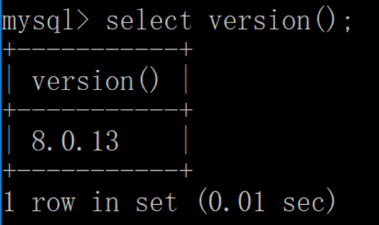

### 使用DDL创建数据库&数据表时需要注意什么？ 

#### DDL 的基础语法及设计工具 

DDL 的英文全称是 Data Definition Language，中文是数据定义语言。它定义了数据库的结构和数据表的结构 

在 DDL 中，我们常用的功能是增删改，分别对应的命令是CREATE、DROP 和 ALTER。需要注意的是，在执行 DDL
的时候，不需要 COMMIT，就可以完成执行任务 。

##### 1.对数据库进行定义 

```sql
CREATE DATABASE nba; // 创建一个名为 nba 的数据库
DROP DATABASE nba; // 删除一个名为 nba 的数据库
```

##### 2.对数据表进行定义 

创建表结构的语法是这样的： 

```sql
CREATE TABLE table_name
```

#### 创建表结构 

比如我们想创建一个球员表，表名为 player，里面有两个字段，一个是 player_id，它是 int 类型，另一个player_name 字段是varchar(255)类型。这两个字段都不为空，且 player_id 是递增的。
那么创建的时候就可以写为： 

```sql
CREATE TABLE player (
  player_id int(11) NOT NULL AUTO_INCREMENT,
  player_name varchar(255) NOT NULL
);
```

>需要注意的是，语句最后以分号（;）作为结束符，最后一个字段的定义结束后没有逗号。数据类型中 int(11) 代表整数类型，显示长度为 11 位，括号中的参数 11 代表的是最大有效显示长度，与类型包含的数值范围大小无关。
>varchar(255)代表的是最大长度为 255 的可变字符串类型。NOT NULL表明整个字段不能是空值，是一种数据约
>束。AUTO_INCREMENT代表主键自动增长。 


实际上，我们通常很少自己写 DDL 语句，可以使用一些可视化工具来创建和操作数据库和数据表。在这里我推荐使用
Navicat，它是一个数据库管理和设计工具，跨平台，支持很多种数据库管理软件，比如 MySQL、Oracle、MariaDB
等。基本上专栏讲到的数据库软件都可以使用 Navicat 来管
理。 


假如还是针对 player 这张表，我们想设计以下的字段： 


其中 player_id 是数据表 player 的主键，且自动增长，也 就是 player_id 会从 1 开始，然后每次加 1。player_id、 

team_id、player_name 这三个字段均不为空，height 字段可以为空。 


按照上面的设计需求，我们可以使用 Navicat 软件进行设计，如下所示： 


然后，我们还可以对 player_name 字段进行索引，索引类型为Unique。使用 Navicat 设置如下： 


这样一张 player 表就通过可视化工具设计好了。我们可以把这张表导出来，可以看看这张表对应的 SQL 语句是怎样
的。方法是在 Navicat 左侧用右键选中 player 这张表，然后选择“转储 SQL 文件”→“仅结构”，这样就可以看到
导出的 SQL 文件了，代码如下： 

```sql
DROP TABLE IF EXISTS `demo`;
CREATE TABLE `demo`  (
  `player_id` int(11) NOT NULL AUTO_INCREMENT,
  `team_id` int(11) NOT NULL,
  `player_name` varchar(255) CHARACTER SET utf8 COLLATE utf8_general_ci NOT NULL,
  `height` float(3, 2) NULL DEFAULT NULL,
  PRIMARY KEY (`player_id`) USING BTREE,
  UNIQUE INDEX `player_name`(`player_name`) USING BTREE
) ENGINE = InnoDB AUTO_INCREMENT = 1 CHARACTER SET = utf8 COLLATE = utf8_general_ci;
```

你能看到整个 SQL 文件中的 DDL 处理，首先先删除player 表（如果数据库中存在该表的话），然后再创建player 表，里面的数据表和字段都使用了反引号，这是为了避免它们的名称与 MySQL 保留字段相同，对数据表和字段名称都加上了反引号。 

其中 player_name 字段的字符集是 utf8，排序规则是utf8_general_ci，代表对大小写不敏感，如果设置为utf8_bin，代表对大小写敏感，还有许多其他排序规则这里不进行介绍。 

因为 player_id 设置为了主键，因此在 DDL  中使用PRIMARY  KEY进行规定，同时索引方法采用 BTREE。

因为我们对 player_name 字段进行索引，在设置字段索引时，我们可以设置为UNIQUE INDEX（唯一索引），也可以
设置为其他索引方式，比如NORMAL INDEX（普通索引），这里我们采用UNIQUE INDEX。唯一索引和普通索引的区别
在于它对字段进行了唯一性的约束。在索引方式上，你可以选择BTREE或者HASH，这里采用了BTREE方法进行索引。
我会在后面介绍BTREE和HASH索引方式的区别。 

整个数据表的存储规则采用 InnoDB。之前我们简单介绍过InnoDB，它是 MySQL5.5 版本之后默认的存储引擎。同
时，我们将字符集设置为 utf8，排序规则为utf8_general_ci，行格式为Dynamic，就可以定义数据表的最后约定了： 

```sql
ENGINE = InnoDB AUTO_INCREMENT = 1 CHARACTER SET = utf8 COLLATE = utf8_general_ci ROW_FORMAT = Dynamic;
```

#### 修改表结构 

在创建表结构之后，我们还可以对表结构进行修改，虽然直接使用 Navicat 可以保证重新导出的数据表就是最新的，但
你也有必要了解，如何使用 DDL 命令来完成表结构的修改。 

1. 添加字段，比如我在数据表中添加一个 age 字段，类型为int(11) 

  ```sql
   ALTER TABLE player ADD (age int(11));
  ```

  

2. 修改字段名，将 age 字段改成player_age float(3,1) 

   ```sql
    ALTER TABLE player RENAME COLUMN age to player_age
   ```

3. 修改字段的数据类型，将player_age的数据类型设置为

   ```sql
   ALTER TABLE player MODIFY (player_age float(3,1));
   ```

4. 删除字段, 删除刚才添加的player_age字段 

   ```sql
   ALTER TABLE player DROP COLUMN player_age;
   ```

#### 数据表的常见约束 

当我们创建数据表的时候，还会对字段进行约束，约束的目的在于保证 RDBMS 里面数据的准确性和一致性。下面，我
们来看下常见的约束有哪些。 

##### 主键约束 

>主键起的作用是唯一标识一条记录，不能重复，不能为空，即 UNIQUE+NOT NULL。一个数据表的主键只能有一个。主键可以是一个字段，也可以由多个字段复合组成。在上面的例子中，我们就把 player_id 设置为了主键。 


##### 外键约束 

>外键确保了表与表之间引用的完整性。一个表中的外键对应另一张表的主键。外键可以是重复的，也可以为空。比如player_id 在 player 表中是主键，如果你想设置一个球员比分表即 player_score，就可以在 player_score 中设置player_id 为外键，关联到 player 表中。 


除了对键进行约束外，还有字段约束。 

##### 唯一性约束 

>唯一性约束表明了字段在表中的数值是唯一的，即使我们已经有了主键，还可以对其他字段进行唯一性约束。比如我们在 player 表中给 player_name 设置唯一性约束，就表明任何两个球员的姓名不能相同。需要注意的是，唯一性约束和普通索引（NORMAL INDEX）之间是有区别的。唯一性约束相当于创建了一个约束和普通索引，目的是保证字段的正确性，而普通索引只是提升数据检索的速度，并不对字段的唯一性进行约束。 


##### NOT NULL 约束 

 >对字段定义了 NOT NULL，即表明该字段不应为空，必须有取值。 


##### DEFAULT 

>表明了字段的默认值。如果在插入数据的时候，这个字段没有取值，就设置为默认值。比如我们将身高
>height 字段的取值默认设置为 0.00，即DEFAULT 0.00 


##### CHECK 约束 

> 用来检查特定字段取值范围的有效性， CHECK 约束的结果不能为 FALSE，比如我们可以对身高height 的数值进行 CHECK 约束，必须≥0，且＜3，即CHECK(height>=0 AND height<3)。 

 

##### 设计数据表的原则 

>我们在设计数据表的时候，经常会考虑到各种问题，比如：用户都需要什么数据？需要在数据表中保存哪些数据？哪些数据是经常访问的数据？如何提升检索效率？
>
>如何保证数据表中数据的正确性，当插入、删除、更新的时候该进行怎样的约束检查？
>
>如何降低数据表的数据冗余度，保证数据表不会因为用户量的增长而迅速扩张？
>如何让负责数据库维护的人员更方便地使用数据库？ 

这里我整理了一个“三少一多”原则：

> 1.数据表的个数越少越好   
>
> RDBMS 的核心在于对实体和联系的定义，也就是 E-R 图（Entity Relationship Diagram），数据表越少，证明实
> 体和联系设计得越简洁，既方便理解又方便操作。 
>
> 2.数据表中的字段个数越少越好 
>
> 字段个数越多，数据冗余的可能性越大。设置字段个数少的
> 前提是各个字段相互独立，而不是某个字段的取值可以由其他字段计算出来。当然字段个数少是相对的，我们通常会在数据冗余和检索效率中进行平衡。
>
> 3.数据表中联合主键的字段个数越少越好 
>
> 设置主键是为了确定唯一性，当一个字段无法确定唯一性的时候，就需要采用联合主键的方式（也就是用多个字段来定义一个主键）。联合主键中的字段越多，占用的索引空间越大，不仅会加大理解难度，还会增加运行时间和索引空间，因此联合主键的字段个数越少越好。
>
> 4.使用主键和外键越多越好 
>
> 数据库的设计实际上就是定义各种表，以及各种字段之间的关系。这些关系越多，证明这些实体之间的冗余度越低，利用度越高。这样做的好处在于不仅保证了数据表之间的独立性，还能提升相互之间的关联使用率。 
>
> 你应该能看出来“三少一多”原则的核心就是简单可复用。简单指的是用更少的表、更少的字段、更少的联合主键字段来完成数据表的设计。可复用则是通过主键、外键的使用来增强数据表之间的复用率。因为一个主键可以理解是一张表的代表。键设计得越多，证明它们之间的利用率越高。 

##### 是否使用外键

是否使用外键确实会有一些争议。我来解释下关于外键的使用： 

>首先，外键本身是为了实现强一致性，所以如果需要正确性性能的话，还是建议使用外键，它可以让我们在数据库的层面保证数据的完整性和一致性。当然不用外键，你也可以在业务层进行实现。不过，这样做也同样存在一定的风险，因为这样，就会让业务逻辑会与数据具备一定的耦合性。也就是业务逻辑和数据必须同时修改。而且在工作中，业务层可能会经常发生变化。 
>
>当然，很多互联网的公司，尤其是超大型的数据应用场景，大量的插入，更新和删除在外键的约束下会降低性能，同时数据库在水平拆分和分库的情况下，数据库端也做不到执行外键约束。另外，在高并发的情况下，外键的存在也会造成额外的开销。因为每次更新数据，都需要检查另外一张表的数据，也容易造成死锁。所以在这种情况下，尤其是大型项目中后期，可以采用业务层来实现，取消外键提高效率。不过在SQL学习之初，包括在系统最初设计的时候，还是建议你采用规范的数据库设计，也就是采用外键来对数据表进行约束。因为这样可以建立一个强一致性，可靠性高的数据库结构，也不需要在业务层来实现过多的检查。当然在项目后期，业务量增大的情况下，你需要更多考虑到数据库性能问题，可以取消外键的约束，转移到业务层来实现。
>
>而且在大型互联网项目中，考虑到分库分表的情况，也会降低外键的使用。不过在SQL学习，以及项目早期，还是建议你使用外键。在 项目后期，你可以分析有哪些外键造成了过多的性能消耗。一般遵循2/8原则，会有20%的外键造成80%的资源效率，你可以只把这20%的外键进行开放，采用业务层逻辑来进行实现，当然你需要保证业务层的实现没有错误。不同阶段，考虑的问题不同。当用户和业务量增大的时候，对于大型互联网应用，也会通过减少外键的使用，来减低死锁发生的概率，提高并发处理能力。 


### 检索数据：你还在SELECT * 么？ 

#### SELECT 查询的基础语法 

我创建了一个王者荣耀英雄数据表，这张表里一共有 69 个英雄，23 个属性值（不包括英雄名 name）。SQL 文件见
Github (这里放在图片文件夹)地址。

 

数据表中这 24 个字段（除了 id 以外），分别代表的含义见下图 


#### 查询列 

如果我们想要对数据表中的某一列进行检索，在 SELECT 后面加上这个列的字段名即可。比如我们想要检索数据表中都
有哪些英雄。 

```sql
SELECT name FROM heros
```

运行结果（69 条记录）见下图，你可以看到这样就等于单独输出了 name 这一列 


 我们也可以对多个列进行检索，在列名之间用逗号 (,) 分割即可。比如我们想要检索有哪些英雄，他们的最大生命、最
大法力、最大物攻和最大物防分别是多少。 

```sql
SELECT name, hp_max, mp_max, attack_max, defense_max FROM heros
```

但是在生产环境时要尽量避免使用SELECT*，具体原因我会在后面讲。


#### 起别名 

我们在使用 SELECT 查询的时候，还有一些技巧可以使用，比如你可以给列名起别名。我们在进行检索的时候，可以给
英雄名、最大生命、最大法力、最大物攻和最大物防等取别名： 

```sql
SELECT name AS n, hp_max AS hm, mp_max AS mm, attack_max AS am, defense_max AS dm FROM heros
```

运行结果和上面多列检索的运行结果是一样的，只是将列名改成了 n、hm、mm、am 和 dm。当然这里的列别名只是举例，一般来说起别名的作用是对原有名称进行简化，从而让 SQL 语句看起来更精简。同样我们也可以对表名称起别名，这个在多表连接查询的时候会用到。


#### 查询常数

SELECT 查询还可以对常数进行查询。对的，就是在 SELECT 查询结果中增加一列固定的常数列。这列的取值是我们指定的，而不是从数据表中动态取出的。你可能会问为什么我们还要对常数进行查询呢？SQL 中的 SELECT 语法的确提供了这个功能，一般来说我们只从一个表中查询数据，通常不需要增加一个固定的常数列，但如果我们想整合不同的数据源，用常数列作为这个表的标记，就需要查询常数。比如说，我们想对 heros 数据表中的英雄名进行查询，同时增加一列字段platform，这个字段固定值为“王者荣耀”，可以这样写：

```sql
SELECT '王者荣耀' as platform, name FROM heros
```

运行结果：（69 条记录）


> 在这个 SQL 语句中，我们虚构了一个platform字段，并且把它设置为固定值“王者荣耀”。需要说明的是，如果常数是个字符串，那么使用单引号（‘’）就非常重要了，比如‘王者荣耀’。单引号说明引号中的字符串是个常数，否则 SQL 会把王者荣耀当成列名进行查询，但实际上数据表里没有这个列名，就会引起错误。如果常数是英文字母，比如'WZRY'也需要加引号。如果常数是个数字，就可以直接写数字，不需要单引号，比如：

```sql
SELECT 123 as platform, name FROM heros
```

运行结果：（69 条记录）


#### 去除重复行

关于单个表的 SELECT 查询，还有一个非常实用的操作，就是从结果中去掉重复的行。使用的关键字是 DISTINCT。比如我们想要看下 heros 表中关于攻击范围的取值都有哪些：

```sql
SELECT DISTINCT attack_range FROM heros
```

这是运行结果（2 条记录），这样我们就能直观地看到攻击范围其实只有两个值，那就是近战和远程。


如果我们带上英雄名称，会是怎样呢：

```sql
SELECT DISTINCT attack_range, name FROM heros
```

运行结果（69 条记录）：


**这里有两点需要注意：**

- DISTINCT 需要放到所有列名的前面，如果写成SELECT name, DISTINCT attack_range FROM heros会报错。

- DISTINCT 其实是对后面所有列名的组合进行去重，你能看到最后的结果是 69 条，因为这 69 个英雄名称不同，都有攻击范围（attack_range）这个属性值。**如果你想要看都有哪些不同的攻击范围（attack_range），只需要写DISTINCT attack_range即可，后面不需要再加其他的列名了。**

  

#### 如何排序检索数据

当我们检索数据的时候，有时候需要按照某种顺序进行结果的返回，比如我们想要查询所有的英雄，按照最大生命从高到底的顺序进行排列，就需要使用 ORDER BY 子句。使用 ORDER BY 子句有以下几个点需要掌握：

- 排序的列名：ORDER BY 后面可以有一个或多个列名，如果是多个列名进行排序，会按照后面第一个列先进行排序，当第一列的值相同的时候，再按照第二列进行排序，以此类推。
- 排序的顺序：ORDER BY 后面可以注明排序规则，ASC 代表递增排序，DESC 代表递减排序。如果没有注明排序规则，默认情况下是按照 ASC 递增排序。我们很容易理解 ORDER BY 对数值类型字段的排序规则，但如果排序字段类型为文本数据，就需要参考数据库的设置方式了，这样才能判断 A 是在 B 之前，还是在 B 之后。比如使用 MySQL 在创建字段的时候设置为 BINARY 属性，就代表区分大小写。
- 非选择列排序：ORDER BY 可以使用非选择列进行排序，所以即使在 SELECT 后面没有这个列名，你同样可以放到 ORDER BY 后面进行排序。
- ORDER BY 的位置：ORDER BY 通常位于 SELECT 语句的最后一条子句，否则会报错。

在了解了 ORDER BY 的使用语法之后，我们来看下如何对 heros 数据表进行排序。假设我们想要显示英雄名称及最大生命值，按照最大生命值从高到低的方式进行排序：

```sql
SELECT name, hp_max FROM heros ORDER BY hp_max DESC
```

运行结果（69 条记录）：


如果想要显示英雄名称及最大生命值，按照第一排序最大法力从低到高，当最大法力值相等的时候则按照第二排序进行，即最大生命值从高到低的方式进行排序：

```sql
SELECT name, hp_max FROM heros ORDER BY mp_max, hp_max DESC
```

运行结果：（69 条记录）


#### 约束返回结果的数量

另外在查询过程中，我们可以约束返回结果的数量，使用 LIMIT 关键字。比如我们想返回英雄名称及最大生命值，按照最大生命值从高到低排序，返回 5 条记录即可。

```sql

SELECT name, hp_max FROM heros ORDER BY hp_max DESC LIMIT 5
```

运行结果（5 条记录）：


有一点需要注意，约束返回结果的数量，在不同的 DBMS 中使用的关键字可能不同。在 MySQL、PostgreSQL、MariaDB 和 SQLite 中使用 LIMIT 关键字，而且需要放到 SELECT 语句的最后面。如果是 SQL Server 和 Access，需要使用 TOP 关键字，比如：

```sql
SELECT TOP 5 name, hp_max FROM heros ORDER BY hp_max DESC
```

如果是 DB2，使用FETCH FIRST 5 ROWS ONLY这样的关键字：

```sql
SELECT name, hp_max FROM heros ORDER BY hp_max DESC FETCH FIRST 5 ROWS ONLY
```

如果是 Oracle，你需要基于 ROWNUM 来统计行数：

```sql
SELECT name, hp_max FROM heros WHERE ROWNUM <=5 ORDER BY hp_max DESC
```

需要说明的是，这条语句是先取出来前 5 条数据行，然后再按照 hp_max 从高到低的顺序进行排序。但这样产生的结果和上述方法的并不一样。我会在后面讲到子查询，你可以使用SELECT name, hp_max FROM (SELECT name, hp_max FROM heros ORDER BY hp_max) WHERE **ROWNUM** <=5得到与上述方法一致的结果。

约束返回结果的数量可以减少数据表的网络传输量，也可以提升查询效率。如果我们知道返回结果只有 1 条，就可以使用LIMIT 1，告诉 SELECT 语句只需要返回一条记录即可。这样的好处就是 SELECT 不需要扫描完整的表，只需要检索到一条符合条件的记录即可返回。

#### SELECT 的执行顺序

查询是 RDBMS 中最频繁的操作。我们在理解 SELECT 语法的时候，还需要了解 SELECT 执行时的底层原理。只有这样，才能让我们对 SQL 有更深刻的认识。其中你需要记住 SELECT 查询时的两个顺序：

1. 关键字的顺序是不能颠倒的：

   ```sql
   
   SELECT ... FROM ... WHERE ... GROUP BY ... HAVING ... ORDER BY ...
   ```

2. SELECT 语句的执行顺序（在 MySQL 和 Oracle 中，SELECT 执行顺序基本相同）：

   ```sql
   
   FROM > WHERE > GROUP BY > HAVING > SELECT的字段 > DISTINCT > ORDER BY > LIMIT
   ```

3. 比如你写了一个 SQL 语句，那么它的关键字顺序和执行顺序是下面这样的：

   ```sql
   
   SELECT DISTINCT player_id, player_name, count(*) as num #顺序5
   FROM player JOIN team ON player.team_id = team.team_id #顺序1
   WHERE height > 1.80 #顺序2
   GROUP BY player.team_id #顺序3
   HAVING num > 2 #顺序4
   ORDER BY num DESC #顺序6
   LIMIT 2 #顺序7
   ```

   在 SELECT 语句执行这些步骤的时候，每个步骤都会产生一个虚拟表，然后将这个虚拟表传入下一个步骤中作为输入。需要注意的是，这些步骤隐含在 SQL 的执行过程中，对于我们来说是不可见的。

   >我来详细解释一下 SQL 的执行原理。首先，你可以注意到，SELECT 是先执行 FROM 这一步的。在这个阶段，如果是多张表联查，还会经历下面的几个步骤：
   >
   >- 首先先通过 CROSS JOIN 求笛卡尔积，相当于得到虚拟表 vt（virtual table）1-1；
   >
   >- 通过 ON 进行筛选，在虚拟表 vt1-1 的基础上进行筛选，得到虚拟表 vt1-2；
   >
   >- 添加外部行。如果我们使用的是左连接、右链接或者全连接，就会涉及到外部行，也就是在虚拟表 vt1-2 的基础上增加外部行，得到虚拟表 vt1-3。
   >
   >  
   >
   >当然如果我们操作的是两张以上的表，还会重复上面的步骤，直到所有表都被处理完为止。这个过程得到是我们的原始数据。当我们拿到了查询数据表的原始数据，也就是最终的虚拟表 vt1，就可以在此基础上再进行 WHERE 阶段。在这个阶段中，会根据 vt1 表的结果进行筛选过滤，得到虚拟表 vt2。
   >
   >
   >
   >然后进入第三步和第四步，也就是 GROUP 和 HAVING 阶段。在这个阶段中，实际上是在虚拟表 vt2 的基础上进行分组和分组过滤，得到中间的虚拟表 vt3 和 vt4。
   >
   >
   >
   >当我们完成了条件筛选部分之后，就可以筛选表中提取的字段，也就是进入到 SELECT 和 DISTINCT 阶段。
   >
   >首先在 SELECT 阶段会提取想要的字段，然后在 DISTINCT 阶段过滤掉重复的行，分别得到中间的虚拟表 vt5-1 和 vt5-2。
   >
   >当我们提取了想要的字段数据之后，就可以按照指定的字段进行排序，也就是 ORDER BY 阶段，得到虚拟表 vt6。最后在 vt6 的基础上，取出指定行的记录，也就是 LIMIT 阶段，得到最终的结果，对应的是虚拟表 vt7。当然我们在写 SELECT 语句的时候，不一定存在所有的关键字，相应的阶段就会省略。同时因为 SQL 是一门类似英语的结构化查询语言，所以我们在写 SELECT 语句的时候，还要注意相应的关键字顺序，所谓底层运行的原理，就是我们刚才讲到的执行顺序。


#### 什么情况下用 SELECT*，如何提升 SELECT 查询效率？

当我们初学 SELECT 语法的时候，经常会使用SELECT *，因为使用方便。实际上这样也增加了数据库的负担。所以如果我们不需要把所有列都检索出来，还是先指定出所需的列名，因为写清列名，可以减少数据表查询的网络传输量，而且考虑到在实际的工作中，我们往往不需要全部的列名，因此你需要养成良好的习惯，写出所需的列名。

如果我们只是练习，或者对数据表进行探索，那么是可以使用SELECT *的。它的查询效率和把所有列名都写出来再进行查询的效率相差并不大。这样可以方便你对数据表有个整体的认知。但是在生产环境下，不推荐你直接使用SELECT *进行查询。

#### COUNT()

>COUNT()的效率是一个很好的问题，欢迎探讨：
>在MySQL InnoDB存储引擎中，COUNT(*)和COUNT(1)都是对的所有结果进行的COUNT。如果有WHERE子句，则是对所有符合筛选条件的数据行进行统计。如果没有WHERE子句，则是对数据表的数据行数进行统计。
>因此COUNT(*)和COUNT(1)本质上没有区别，执行的复杂度都是O(N)，也就是采用全表扫描，进行循环+计数的方式进行统计。
>如果是MySQL MyISAM存储引擎，统计数据表的行数只需要O(1)复杂度，这是因为每张MyISAM的数据表都有一个meta信息有存储了row_count值。而一致性由表级锁来保证。而InnoDB支持事务，采用行级锁和MVCC机制，所以无法像MyISAM一样，只维护一个row_count变量。因此就需要采用扫描全表，进行循环+计数的方式来完成统计。
>需要注意的是，在实际执行中COUNT(*)和COUNT(1)执行时间可能略有差别，不过你还是可以把这两个在执行效率上看成是相等的。
>
>另外在InnoDB引擎中，如果是采用COUNT(*)和COUNT(1)来统计数据行数，要尽量采用二级索引。
>因为主键采用的索引是聚簇索引，聚簇索引包含的信息多，明显会大于二级索引（非聚簇索引）。
>对于查找具体的行来说，采用主键索引效率更高。而对于COUNT(*)和COUNT(1)这种，不需要查找具体的行，只是统计行数来说，系统会自动采用占用空间更小的二级索引来进行统计。
>如果有多个二级索引的时候，会使用key_len小的二级索引进行扫描。当没有二级索引的时候，才会采用主键索引来进行统计。
>
>优化总结：
>1、一般情况下：COUNT(*) = COUNT(1) > COUNT(字段)
>所以尽量使用COUNT(*)，当然如果你要统计的是就是某个字段的非空数据行数，那另当别论。毕竟执行效率比较的前提是要结果一样才行。
>2、如果要统计COUNT(*)，尽量在数据表上建立二级索引，系统会自动采用key_len小的二级索引进行扫描，这样当我们使用SELECT COUNT(*)的时候效率就会提升，有时候提升几倍甚至更高都是有可能的。  


### 数据过滤：SQL数据过滤都有哪些方法？

我在上篇文章中讲到过，提升查询效率的一个很重要的方式，就是约束返回结果的数量，还有一个很有效的方式，就是指定筛选条件，进行过滤。过滤可以筛选符合条件的结果，并进行返回，减少不必要的数据行。

那么在今天的内容里，我们来学习如何对 SQL 数据进行过滤，这里主要使用的就是 WHERE 子句。

你可能已经使用过 WHERE 子句，说起来 SQL 其实很简单，只要能把满足条件的内容筛选出来即可，但在实际使用过程中，不同人写出来的 WHERE 子句存在很大差别，比如执行效率的高低，有没有遇到莫名的报错等。

在今天的学习中，你重点需要掌握以下几方面的内容：

1. 学会使用 WHERE 子句，如何使用比较运算符对字段的数值进行比较筛选；
2. 如何使用逻辑运算符，进行多条件的过滤；
3. 学会使用通配符对数据条件进行复杂过滤。

#### 比较运算符

在 SQL 中，我们可以使用 WHERE 子句对条件进行筛选，在此之前，你需要了解 WHERE 子句中的比较运算符。这些比较运算符的含义你可以参见下面这张表格：

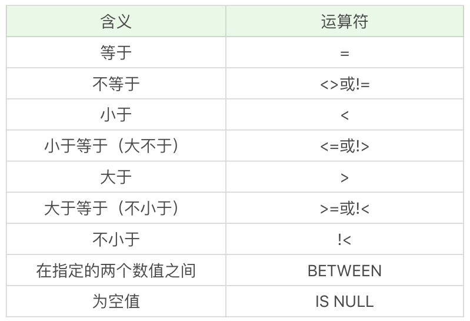

实际上你能看到，同样的含义可能会有多种表达方式，比如小于等于，可以是（<=），也可以是不大于（!>）。同样不等于，可以用（<>），也可以用（!=），它们的含义都是相同的，但这些符号的顺序都不能颠倒，比如你不能写（=<）。需要注意的是，你需要查看使用的 DBMS 是否支持，不同的 DBMS 支持的运算符可能是不同的，比如 Access 不支持（!=），不等于应该使用（<>）。在 MySQL 中，不支持（!>）（!<）等。

我在上一篇文章中使用了 heros 数据表，今天还是以这张表格做练习。下面我们通过比较运算符对王者荣耀的英雄属性进行条件筛选。

WHERE 子句的基本格式是：`SELECT ……(列名) FROM ……(表名) WHERE ……(子句条件)`

比如我们想要查询所有最大生命值大于 6000 的英雄：

```sql
SELECT name, hp_max FROM heros WHERE hp_max > 6000
```

运行结果（41 条记录）：


想要查询所有最大生命值在 5399 到 6811 之间的英雄：

```sql
SELECT name, hp_max FROM heros WHERE hp_max BETWEEN 5399 AND 6811
```

运行结果：（41 条记录）


需要注意的是hp_max可以取值到最小值和最大值，即 5399和 6811。 

我们也可以对 heros 表中的`hp_max`字段进行空值检查。

```sql
SELECT name, hp_max FROM heros WHERE hp_max IS NULL
```

运行结果为空，说明 heros 表中的`hp_max`字段没有存在空值的数据行。


#### 逻辑运算符

我刚才介绍了比较运算符，如果我们存在多个 WHERE 条件子句，可以使用逻辑运算符：


我们还是通过例子来看下这些逻辑运算符的使用，同样采用 heros 这张表的数据查询。

```sql
SELECT name, hp_max, mp_max FROM heros WHERE hp_max > 6000 AND mp_max > 1700 ORDER BY (hp_max+mp_max) DESC
```

运行结果：（23 条记录）


如果 AND 和 OR 同时存在 WHERE 子句中会是怎样的呢？假设我们想要查询最大生命值加最大法力值大于 8000 的英雄，或者最大生命值大于 6000 并且最大法力值大于 1700 的英雄。

```sql
SELECT name, hp_max, mp_max FROM heros WHERE (hp_max+mp_max) > 8000 OR hp_max > 6000 AND mp_max > 1700 ORDER BY (hp_max+mp_max) DESC
```

运行结果：（33 条记录）


你能看出来相比于上一个条件查询，这次的条件查询多出来了 10 个英雄，这是因为我们放宽了条件，允许最大生命值 + 最大法力值大于 8000 的英雄显示出来。另外你需要注意到，当 WHERE 子句中同时存在 OR 和 AND 的时候，AND 执行的优先级会更高，也就是说 SQL 会优先处理 AND 操作符，然后再处理 OR 操作符。

如果我们对这条查询语句 OR 两边的条件增加一个括号，结果会是怎样的呢？

```sql
SELECT name, hp_max, mp_max FROM heros WHERE ((hp_max+mp_max) > 8000 OR hp_max > 6000) AND mp_max > 1700 ORDER BY (hp_max+mp_max) DESC
```

运行结果：


所以当 WHERE 子句中同时出现 AND 和 OR 操作符的时候，你需要考虑到执行的先后顺序，也就是两个操作符执行的优先级。一般来说 () 优先级最高，其次优先级是 AND，然后是 OR。

如果我想要查询主要定位或者次要定位是法师或是射手的英雄，同时英雄的上线时间不在 2016-01-01 到 2017-01-01 之间。

```sql
SELECT name, role_main, role_assist, hp_max, mp_max, birthdate
FROM heros 
WHERE (role_main IN ('法师', '射手') OR role_assist IN ('法师', '射手')) 
AND DATE(birthdate) NOT BETWEEN '2016-01-01' AND '2017-01-01'
ORDER BY (hp_max + mp_max) DESC
```

你能看到我把 WHERE 子句分成了两个部分。第一部分是关于主要定位和次要定位的条件过滤，使用的是`role_main in ('法师', '射手') OR role_assist in ('法师', '射手')`。这里用到了 IN 逻辑运算符，同时`role_main`和`role_assist`是 OR（或）的关系。

第二部分是关于上线时间的条件过滤。NOT 代表否，因为我们要找到不在 2016-01-01 到 2017-01-01 之间的日期，因此用到了`NOT BETWEEN '2016-01-01' AND '2017-01-01'`。同时我们是在对日期类型数据进行检索，所以使用到了 DATE 函数，将字段 birthdate 转化为日期类型再进行比较。关于日期的操作，我会在下一篇文章中再作具体介绍。

这是运行结果（6 条记录）：


#### 使用通配符进行过滤

刚才讲解的条件过滤都是对已知值进行的过滤，还有一种情况是我们要检索文本中包含某个词的所有数据，这里就需要使用通配符。通配符就是我们用来匹配值的一部分的特殊字符。这里我们需要使用到 LIKE 操作符。

如果我们想要匹配任意字符串出现的任意次数，需要使用（%）通配符。比如我们想要查找英雄名中包含“太”字的英雄都有哪些：

```sql
SELECT name FROM heros WHERE name LIKE '% 太 %'
```

运行结果：（2 条记录）


需要说明的是不同 DBMS 对通配符的定义不同，在 Access 中使用的是（*）而不是（%）。另外关于字符串的搜索可能是需要区分大小写的，比如`'liu%'`就不能匹配上`'LIU BEI'`。具体是否区分大小写还需要考虑不同的 DBMS 以及它们的配置。

如果我们想要匹配单个字符，就需要使用下划线 (`_`) 通配符。（%）和（`_`）的区别在于，（%）代表一个或多个字符，而（`_`）只代表一个字符。比如我们想要查找英雄名除了第一个字以外，包含“太”字的英雄有哪些。

```sql
SELECT name FROM heros WHERE name LIKE '_% 太 %'
```

运行结果（1 条记录）：

​	

因为太乙真人的太是第一个字符，而`_%太%`中的太不是在第一个字符，所以匹配不到“太乙真人”，只可以匹配上“东皇太一”。

同样需要说明的是，在 Access 中使用（?）来代替（`_`），而且在 DB2 中是不支持通配符（`_`）的，因此你需要在使用的时候查阅相关的 DBMS 文档。

你能看出来通配符还是很有用的，尤其是在进行字符串匹配的时候。不过在实际操作过程中，我还是建议你尽量少用通配符，因为它需要消耗数据库更长的时间来进行匹配。即使你对 LIKE 检索的字段进行了索引，索引的价值也可能会失效。如果要让索引生效，那么 LIKE 后面就不能以（%）开头，比如使用`LIKE '%太%'`或`LIKE '%太'`的时候就会对全表进行扫描。如果使用`LIKE '太%'`，同时检索的字段进行了索引的时候，则不会进行全表扫描。

####  总结：

比较运算符是对数值进行比较，不同的 DBMS 支持的比较运算符可能不同，你需要事先查阅相应的 DBMS 文档。逻辑运算符可以让我们同时使用多个 WHERE 子句，你需要注意的是 AND 和 OR 运算符的执行顺序。通配符可以让我们对文本类型的字段进行模糊查询，不过检索的代价也是很高的，通常都需要用到全表扫描，所以效率很低。只有当 LIKE 语句后面不用通配符，并且对字段进行索引的时候才不会对全表进行扫描。

你可能认为学习 SQL 并不难，掌握这些语法就可以对数据进行筛选查询。但实际工作中不同人写的 SQL 语句的查询效率差别很大，保持高效率的一个很重要的原因，就是要避免全表扫描，所以我们会考虑在 WHERE 及 ORDER BY 涉及到的列上增加索引。

#### 问题

ORDER BY字段是否增加索引?

>  这是一个很好的问题，关于ORDER BY字段是否增加索引：
>  在MySQL中，支持两种排序方式：FileSort和Index排序。Index排序的效率更高，
>  Index排序：索引可以保证数据的有序性，因此不需要再进行排序。
>  FileSort排序：一般在内存中进行排序，占用CPU较多。如果待排结果较大，会产生临时文件I/O到磁盘进行排序，效率较低。
>
>  所以使用ORDER BY子句时，应该尽量使用Index排序，避免使用FileSort排序。
>  当然具体优化器是否采用索引进行排序，你可以使用explain来进行执行计划的查看。
>  优化建议：
>  1、SQL中，可以在WHERE子句和ORDER BY子句中使用索引，目的是在WHERE子句中避免全表扫描，ORDER BY子句避免使用FileSort排序。
>  当然，某些情况下全表扫描，或者FileSort排序不一定比索引慢。但总的来说，我们还是要避免，以提高查询效率。
>  一般情况下，优化器会帮我们进行更好的选择，当然我们也需要建立合理的索引。
>  2、尽量Using Index完成ORDER BY排序。
>  如果WHERE和ORDER BY相同列就使用单索引列；如果不同使用联合索引。
>  3、无法Using Index时，对FileSort方式进行调优。  


### 什么是SQL函数？为什么使用SQL函数可能会带来问题？

函数在计算机语言的使用中贯穿始终，在 SQL 中我们也可以使用函数对检索出来的数据进行函数操作，比如求某列数据的平均值，或者求字符串的长度等。从函数定义的角度出发，我们可以将函数分成内置函数和自定义函数。在 SQL 语言中，同样也包括了内置函数和自定义函数。内置函数是系统内置的通用函数，而自定义函数是我们根据自己的需要编写的，下面讲解的是 SQL 的内置函数。

你需要从以下几个方面掌握 SQL 函数：

1. 什么是 SQL 函数？
2. 内置的 SQL 函数都包括哪些？
3. 如何使用 SQL 函数对一个数据表进行操作，比如针对一个王者荣耀的英雄数据库，我们可以使用这些函数完成哪些操作？
4. 什么情况下使用 SQL 函数？为什么使用 SQL 函数有时候会带来问题？

#### 什么是 SQL 函数

当我们学习编程语言的时候，也会遇到函数。函数的作用是什么呢？它可以把我们经常使用的代码封装起来，需要的时候直接调用即可。这样既提高了代码效率，又提高了可维护性。

SQL 中的函数一般是在数据上执行的，可以很方便地转换和处理数据。一般来说，当我们从数据表中检索出数据之后，就可以进一步对这些数据进行操作，得到更有意义的结果，比如返回指定条件的函数，或者求某个字段的平均值等。

#### 常用的 SQL 函数有哪些

SQL 提供了一些常用的内置函数，当然你也可以自己定义 SQL 函数。SQL 的内置函数对于不同的数据库软件来说具有一定的通用性，我们可以把内置函数分成四类：

1. 算术函数
2. 字符串函数
3. 日期函数
4. 转换函数

这 4 类函数分别代表了算术处理、字符串处理、日期处理、数据类型转换，它们是 SQL 函数常用的划分形式，你可以思考下，为什么是这 4 个维度？

函数是对提取出来的数据进行操作，那么数据表中字段类型的定义有哪几种呢？

我们经常会保存一些数值，不论是整数类型，还是浮点类型，实际上对应的就是数值类型。同样我们也会保存一些文本内容，可能是人名，也可能是某个说明，对应的就是字符串类型。此外我们还需要保存时间，也就是日期类型。那么针对数值、字符串和日期类型的数据，我们可以对它们分别进行算术函数、字符串函数以及日期函数的操作。如果想要完成不同类型数据之间的转换，就可以使用转换函数。

#### 算术函数

算术函数，顾名思义就是对数值类型的字段进行算术运算。常用的算术函数及含义如下表所示：


这里我举一些简单的例子，你来体会下：
SELECT ABS(-2)，运行结果为 2。
SELECT MOD(101,3)，运行结果 2。
SELECT ROUND(37.25,1)，运行结果 37.3。 

#### 字符串函数 

常用的字符串函数操作包括了字符串拼接，大小写转换，求长度以及字符串替换和截取等。具体的函数名称及含义如下表所示：


这里同样有一些简单的例子，你可以自己运行下：

`SELECT CONCAT('abc', 123)`，运行结果为 abc123。

`SELECT LENGTH('你好')`，运行结果为 6。

`SELECT CHAR_LENGTH('你好')`，运行结果为 2。

`SELECT LOWER('ABC')`，运行结果为 abc。

`SELECT UPPER('abc')`，运行结果 ABC。

`SELECT REPLACE('fabcd', 'abc', 123)`，运行结果为 f123d。

`SELECT SUBSTRING('fabcd', 1,3)`，运行结果为 fab。

#### 日期函数

日期函数是对数据表中的日期进行处理，常用的函数包括：


下面是一些简单的例子，你可自己运行下：

`SELECT CURRENT_DATE()`，运行结果为 2019-04-03。

`SELECT CURRENT_TIME()`，运行结果为 21:26:34。

`SELECT CURRENT_TIMESTAMP()`，运行结果为 2019-04-03 21:26:34。

`SELECT EXTRACT(YEAR FROM '2019-04-03')`，运行结果为 2019。

`SELECT DATE('2019-04-01 12:00:05')`，运行结果为 2019-04-01。

这里需要注意的是，DATE 日期格式必须是 yyyy-mm-dd 的形式。如果要进行日期比较，就要使用 DATE 函数，不要直接使用日期与字符串进行比较，我会在后面的例子中讲具体的原因。

#### 转换函数

转换函数可以转换数据之间的类型，常用的函数如下表所示：


这两个函数不像其他函数，看一眼函数名就知道代表什么、如何使用。下面举了这两个函数的例子，你需要自己运行下：

`SELECT CAST(123.123 AS INT)`，运行结果会报错。

`SELECT CAST(123.123 AS DECIMAL(8,2))`，运行结果为 123.12。

`SELECT COALESCE(null,1,2)`，运行结果为 1。

CAST 函数在转换数据类型的时候，不会四舍五入，如果原数值有小数，那么转换为整数类型的时候就会报错。不过你可以指定转化的小数类型，在 MySQL 和 SQL Server 中，你可以用`DECIMAL(a,b)`来指定，其中 a 代表整数部分和小数部分加起来最大的位数，b 代表小数位数，比如`DECIMAL(8,2)`代表的是精度为 8 位（整数加小数位数最多为 8 位），小数位数为 2 位的数据类型。所以`SELECT CAST(123.123 AS DECIMAL(8,2))`的转换结果为 123.12。

#### 用 SQL 函数对王者荣耀英雄数据做处理

显示英雄以及他的物攻成长，对应字段为`attack_growth`。我们让这个字段精确到小数点后一位，需要使用的是算术函数里的 ROUND 函数。

```sql
SELECT name, ROUND(attack_growth,1) FROM heros
```

代码中，`ROUND(attack_growth,1)`中的`attack_growth`代表想要处理的数据，“1”代表四舍五入的位数，也就是我们这里需要精确到的位数。

运行结果为：


假设我们想显示英雄最大生命值的最大值，就需要用到 MAX 函数。在数据中，“最大生命值”对应的列数为`hp_max`，在代码中的格式为`MAX(hp_max)`。

```sql
SELECT MAX(hp_max) FROM heros
```

运行结果为 9328。

假如我们想要知道最大生命值最大的是哪个英雄，以及对应的数值，就需要分成两个步骤来处理：首先找到英雄的最大生命值的最大值，即`SELECT MAX(hp_max) FROM heros`，然后再筛选最大生命值等于这个最大值的英雄，如下所示。

```sql
SELECT name, hp_max FROM heros WHERE hp_max = (SELECT MAX(hp_max) FROM heros)
```

运行结果：


假如我们想显示英雄的名字，以及他们的名字字数，需要用到`CHAR_LENGTH`函数。

```sql
SELECT CHAR_LENGTH(name), name FROM heros
```

运行结果为：


假如想要提取英雄上线日期（对应字段 birthdate）的年份，只显示有上线日期的英雄即可（有些英雄没有上线日期的数据，不需要显示），这里我们需要使用 EXTRACT 函数，提取某一个时间元素。所以我们需要筛选上线日期不为空的英雄，即`WHERE birthdate is not null`，然后再显示他们的名字和上线日期的年份，即：

```sql
SELECT name, EXTRACT(YEAR FROM birthdate) AS birthdate FROM heros WHERE birthdate is NOT NULL
```

或者使用如下形式：

```sql
SELECT name, YEAR(birthdate) AS birthdate FROM heros WHERE birthdate is NOT NULL
```

运行结果为：


假设我们需要找出在 2016 年 10 月 1 日之后上线的所有英雄。这里我们可以采用 DATE
函数来判断 birthdate 的日期是否大于 2016-10-01，即WHERE
DATE(birthdate)>'2016-10-01'，然后再显示符合要求的全部字段信息，即： 

```sql
SELECT * FROM heros WHERE DATE(birthdate)>'2016-10-01'
```

需要注意的是下面这种写法是不安全的 

```sql
SELECT * FROM heros WHERE birthdate>'2016-10-01
```

因为很多时候你无法确认 birthdate 的数据类型是字符串，还是 datetime 类型，如果你想
对日期部分进行比较，那么使用DATE(birthdate)来进行比较是更安全的。 

运行结果为 


假设我们需要知道在 2016 年 10 月 1 日之后上线英雄的平均最大生命值、平均最大法力和最高物攻最大值。同样我们需要先筛选日期条件，即`WHERE DATE(birthdate)>'2016-10-01'`，然后再选择`AVG(hp_max), AVG(mp_max), MAX(attack_max)`字段进行显示。

```sql
SELECT AVG(hp_max), AVG(mp_max), MAX(attack_max) FROM heros WHERE DATE(birthdate)>'2016-10-01'
```

运行结果为：


#### 为什么使用 SQL 函数会带来问题 

尽管 SQL 函数使用起来会很方便，但我们使用的时候还是要谨慎，因为你使用的函数很可能在运行环境中无法工作，这是为什么呢？

如果你学习过编程语言，就会知道语言是有不同版本的，比如 Python 会有 2.7 版本和 3.x 版本，不过它们之间的函数差异不大，也就在 10% 左右。但我们在使用 SQL 语言的时候，不是直接和这门语言打交道，而是通过它使用不同的数据库软件，即 DBMS。DBMS 之间的差异性很大，远大于同一个语言不同版本之间的差异。实际上，只有很少的函数是被 DBMS 同时支持的。比如，大多数 DBMS 使用（||）或者（+）来做拼接符，而在 MySQL 中的字符串拼接函数为`Concat()`。大部分 DBMS 会有自己特定的函数，这就意味着采用 SQL 函数的代码可移植性是很差的，因此在使用函数的时候需要特别注意。

#### 关于大小写的规范

细心的人可能会发现，我在写 SELECT 语句的时候用的是大写，而你在网上很多地方，包括你自己写的时候可能用的是小写。实际上在 SQL 中，关键字和函数名是不用区分字母大小写的，比如 SELECT、WHERE、ORDER、GROUP BY 等关键字，以及 ABS、MOD、ROUND、MAX 等函数名。

不过在 SQL 中，你还是要确定大小写的规范，因为在 Linux 和 Windows 环境下，你可能会遇到不同的大小写问题。

比如 MySQL 在 Linux 的环境下，数据库名、表名、变量名是严格区分大小写的，而字段名是忽略大小写的。

而 MySQL 在 Windows 的环境下全部不区分大小写。

这就意味着如果你的变量名命名规范没有统一，就可能产生错误。这里有一个有关命名规范的建议：

1. 关键字和函数名称全部大写；
2. 数据库名、表名、字段名称全部小写；
3. SQL 语句必须以分号结尾。

虽然关键字和函数名称在 SQL 中不区分大小写，也就是如果小写的话同样可以执行，但是数据库名、表名和字段名在 Linux MySQL 环境下是区分大小写的，因此建议你统一这些字段的命名规则，比如全部采用小写的方式。同时将关键词和函数名称全部大写，以便于区分数据库名、表名、字段名。


### 什么是SQL的聚集函数，如何利用它们汇总表的数据？

我们上节课讲到了 SQL 函数，包括算术函数、字符串函数、日期函数和转换函数。实际上 SQL 函数还有一种，叫做聚集函数，它是对一组数据进行汇总的函数，输入的是一组数据的集合，输出的是单个值。通常我们可以利用聚集函数汇总表的数据，如果稍微复杂一些，我们还需要先对数据做筛选，然后再进行聚集，比如先按照某个条件进行分组，对分组条件进行筛选，然后得到筛选后的分组的汇总信息。

有关今天的内容，你重点需要掌握以下几个方面：

1. 聚集函数都有哪些，能否在一条 SELECT 语句中使用多个聚集函数；
2. 如何对数据进行分组，并进行聚集统计；
3. 如何使用 HAVING 过滤分组，HAVING 和 WHERE 的区别是什么。

#### 聚集函数都有哪些

SQL 中的聚集函数一共包括 5 个，可以帮我们求某列的最大值、最小值和平均值等，它们分别是：


这些函数你可能已经接触过，我们再来简单复习一遍。我们继续使用 heros 数据表，对王者荣耀的英雄数据进行聚合。

如果我们想要查询最大生命值大于 6000 的英雄数量。

```sql
SELECT COUNT(*) FROM heros WHERE hp_max > 6000
```

运行结果为 41。

如果想要查询最大生命值大于 6000，且有次要定位的英雄数量，需要使用 COUNT 函数。

```sql
SELECT COUNT(role_assist) FROM heros WHERE hp_max > 6000
```

运行结果是 23。

需要说明的是，有些英雄没有次要定位，即 role_assist 为 NULL，这时`COUNT(role_assist)`会忽略值为 NULL 的数据行，而 COUNT(*) 只是统计数据行数，不管某个字段是否为 NULL。

如果我们想要查询射手（主要定位或者次要定位是射手）的最大生命值的最大值是多少，需要使用 MAX 函数。

```sql
SELECT MAX(hp_max) FROM heros WHERE role_main = '射手' or role_assist = '射手'
```

运行结果为 6014。


你能看到，上面的例子里，都是在一条 SELECT 语句中使用了一次聚集函数，实际上我们也可以在一条 SELECT 语句中进行多项聚集函数的查询，比如我们想知道射手（主要定位或者次要定位是射手）的英雄数、平均最大生命值、法力最大值的最大值、攻击最大值的最小值，以及这些英雄总的防御最大值等汇总数据。

如果想要知道英雄的数量，我们使用的是 COUNT(*) 函数，求平均值、最大值、最小值，以及总的防御最大值，我们分别使用的是 AVG、MAX、MIN 和 SUM 函数。另外我们还需要对英雄的主要定位和次要定位进行筛选，使用的是`WHERE role_main = '射手' or role_assist = '射手'`。

```sql
SELECT COUNT(*), AVG(hp_max), MAX(mp_max), MIN(attack_max), SUM(defense_max) FROM heros WHERE role_main = '射手' or role_assist = '射手'
```

运行结果：


需要说明的是 AVG、MAX、MIN 等聚集函数会自动忽略值为 NULL 的数据行，MAX 和 MIN 函数也可以用于字符串类型数据的统计，如果是英文字母，则按照 A—Z 的顺序排列，越往后，数值越大。如果是汉字则按照全拼拼音进行排列。比如：

```sql
SELECT MIN(CONVERT(name USING gbk)), MAX(CONVERT(name USING gbk)) FROM heros
```

运行结果：


需要说明的是，我们需要先把 name 字段统一转化为 gbk 类型，使用CONVERT(nameUSING gbk)，然后再使用 MIN 和 MAX 取最小值和最大值。 

我们也可以对数据行中不同的取值进行聚集，先用 DISTINCT 函数取不同的数据，然后再使用聚集函数。比如我们想要查询不同的生命最大值的英雄数量是多少。

```sql
SELECT COUNT(DISTINCT hp_max) FROM heros
```

运行结果为 61。

实际上在 heros 这个数据表中，一共有 69 个英雄数量，生命最大值不一样的英雄数量是 61 个。


假如我们想要统计不同生命最大值英雄的平均生命最大值，保留小数点后两位。首先需要取不同生命最大值，即`DISTINCT hp_max`，然后针对它们取平均值，即`AVG(DISTINCT hp_max)`，最后再针对这个值保留小数点两位，也就是`ROUND(AVG(DISTINCT hp_max), 2)`。

```sql
SELECT ROUND(AVG(DISTINCT hp_max), 2) FROM heros
```

运行结果为 6653.84。

你能看到，如果我们不使用 DISTINCT 函数，就是对全部数据进行聚集统计。如果使用了 DISTINCT 函数，就可以对数值不同的数据进行聚集。一般我们使用 MAX 和 MIN 函数统计数据行的时候，不需要再额外使用 DISTINCT，因为使用 DISTINCT 和全部数据行进行最大值、最小值的统计结果是相等的。


#### 如何对数据进行分组，并进行聚集统计


我们在做统计的时候，可能需要先对数据按照不同的数值进行分组，然后对这些分好的组进行聚集统计。对数据进行分组，需要使用 GROUP BY 子句。

比如我们想按照英雄的主要定位进行分组，并统计每组的英雄数量。

```sql
 SELECT COUNT(*), role_main FROM heros GROUP BY role_main
```

运行结果（6 条记录）：


如果我们想要对英雄按照次要定位进行分组，并统计每组英雄的数量。

```sql
SELECT COUNT(*), role_assist FROM heros GROUP BY role_assist
```

运行结果：（6 条记录）


你能看出如果字段为 NULL，也会被列为一个分组。在这个查询统计中，次要定位为 NULL，即只有一个主要定位的英雄是 40 个。


我们也可以使用多个字段进行分组，这就相当于把这些字段可能出现的所有的取值情况都进行分组。比如，我们想要按照英雄的主要定位、次要定位进行分组，查看这些英雄的数量，并按照这些分组的英雄数量从高到低进行排序。

```sql
SELECT COUNT(*) as num, role_main, role_assist FROM heros GROUP BY role_main, role_assist ORDER BY num DESC
```

运行结果：（19 条记录）

 

#### 如何使用 HAVING 过滤分组，它与 WHERE 的区别是什么？ 

当我们创建出很多分组的时候，有时候就需要对分组进行过滤。你可能首先会想到 WHERE 子句，实际上过滤分组我们使用的是 HAVING。HAVING 的作用和 WHERE 一样，都是起到过滤的作用，只不过 WHERE 是用于数据行，而 HAVING 则作用于分组。

比如我们想要按照英雄的主要定位、次要定位进行分组，并且筛选分组中英雄数量大于 5 的组，最后按照分组中的英雄数量从高到低进行排序。

首先我们需要获取的是英雄的数量、主要定位和次要定位，即`SELECT COUNT(*) as num, role_main, role_assist`。然后按照英雄的主要定位和次要定位进行分组，即`GROUP BY role_main, role_assist`，同时我们要对分组中的英雄数量进行筛选，选择大于 5 的分组，即`HAVING num > 5`，然后按照英雄数量从高到低进行排序，即`ORDER BY num DESC`。

```sql
SELECT COUNT(*) as num, role_main, role_assist FROM heros GROUP BY role_main, role_assist HAVING num > 5 ORDER BY num DESC
```

运行结果：（4 条记录）


你能看到还是上面这个分组，只不过我们按照数量进行了过滤，筛选了数量大于 5 的分组进行输出。如果把 HAVING 替换成了 WHERE，SQL 则会报错。对于分组的筛选，我们一定要用 HAVING，而不是 WHERE。另外你需要知道的是，HAVING 支持所有 WHERE 的操作，因此所有需要 WHERE 子句实现的功能，你都可以使用 HAVING 对分组进行筛选。


我们再来看个例子，通过这个例子查看一下 WHERE 和 HAVING 进行条件过滤的区别。筛选最大生命值大于 6000 的英雄，按照主要定位、次要定位进行分组，并且显示分组中英雄数量大于 5 的分组，按照数量从高到低进行排序。

```sql
SELECT COUNT(*) as num, role_main, role_assist FROM heros WHERE hp_max > 6000 GROUP BY role_main, role_assist HAVING num > 5 ORDER BY num DESC
```

运行结果：（2 条记录）


你能看到，还是针对上一个例子的查询，只是我们先增加了一个过滤条件，即筛选最大生命值大于 6000 的英雄。这里我们就需要先使用 WHERE 子句对最大生命值大于 6000 的英雄进行条件过滤，然后再使用 GROUP BY 进行分组，使用 HAVING 进行分组的条件判断，然后使用 ORDER BY 进行排序。

#### 总结

**你要记住，在 SELECT 查询中，关键字的顺序是不能颠倒的，它们的顺序是：**

SELECT ... FROM ... WHERE ... GROUP BY ... HAVING ... ORDER BY ...

另外需要注意的是，使用 GROUP BY 进行分组，如果想让输出的结果有序，可以在 GROUP BY 后使用 ORDER BY。因为 GROUP BY 只起到了分组的作用，排序还是需要通过 ORDER BY 来完成。


### 子查询：子查询的种类都有哪些，如何提高子查询的性能？

上节课我讲到了聚集函数，以及如何对数据进行分组统计，可以说我们之前讲的内容都是围绕单个表的 SELECT 查询展开的，实际上 SQL 还允许我们进行子查询，也就是嵌套在查询中的查询。这样做的好处是可以让我们进行更复杂的查询，同时更加容易理解查询的过程。因为很多时候，我们无法直接从数据表中得到查询结果，需要从查询结果集中再次进行查询，才能得到想要的结果。这个“查询结果集”就是今天我们要讲的子查询。

通过今天的文章，我希望你可以掌握以下的内容：

1. 子查询可以分为关联子查询和非关联子查询。我会举一个 NBA 数据库查询的例子，告诉你什么是关联子查询，什么是非关联子查询；
2. 子查询中有一些关键词，可以方便我们对子查询的结果进行比较。比如存在性检测子查询，也就是 EXISTS 子查询，以及集合比较子查询，其中集合比较子查询关键词有 IN、SOME、 ANY 和 ALL，这些关键词在子查询中的作用是什么；
3. 子查询也可以作为主查询的列，我们如何使用子查询作为计算字段出现在 SELECT 查询中呢？

#### 什么是关联子查询，什么是非关联子查询

子查询虽然是一种嵌套查询的形式，不过我们依然可以依据子查询是否执行多次，从而将子查询划分为关联子查询和非关联子查询。

子查询从数据表中查询了数据结果，如果这个数据结果只执行一次，然后这个数据结果作为主查询的条件进行执行，那么这样的子查询叫做非关联子查询。

 同样，如果子查询需要执行多次，即采用循环的方式，先从外部查询开始，每次都传入子查询进行查询，然后再将结果反馈给外部，这种嵌套的执行方式就称为关联子查询。

单说概念有点抽象，我们用数据表举例说明一下。这里我创建了 NBA 球员数据库，SQL 文件你可以从[GitHub](https://github.com/cystanford/sql_nba_data)上下载。

文件中一共包括了 5 张表，player 表为球员表，team 为球队表，team_score 为球队比赛表，player_score 为球员比赛成绩表，height_grades 为球员身高对应的等级表。

其中 player 表，也就是球员表，一共有 37 个球员，如下所示：

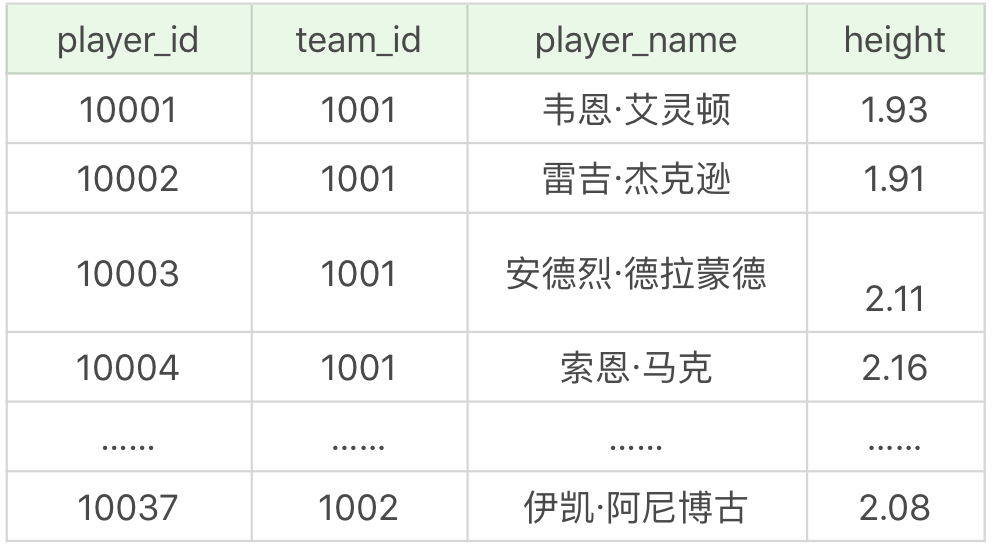

team 表为球队表，一共有 3 支球队，如下所示：

 	

team_score 表为球队比赛成绩表，一共记录了两场比赛的成绩，如下所示： 


player_score 表为球员比赛成绩表，记录了一场比赛中球员的表现。这张表一共包括 19 个字段，代表的含义如下：

 		

其中 shoot_attempts 代表总出手的次数，它等于二分球出手和三分球出手次数的总和。比如 2019 年 4 月 1 日，韦恩·艾灵顿在底特律活塞和印第安纳步行者的比赛中，总出手次数为 19，总命中 10，三分球 13 投 4 中，罚球 4 罚 2 中，因此总分 score=(10-4)×2+4×3+2=26，也就是二分球得分 12+ 三分球得分 12+ 罚球得分 2=26。

需要说明的是，通常在工作中，数据表的字段比较多，一开始创建的时候会知道每个字段的定义，过了一段时间再回过头来看，对当初的定义就不那么确定了，容易混淆字段，解决这一问题最好的方式就是做个说明文档，用实例举例。

比如 shoot_attempts 是总出手次数（这里的总出手次数 = 二分球出手次数 + 三分球出手次数，不包括罚球的次数），用上面提到的韦恩·艾灵顿的例子做补充说明，再回过头来看这张表的时候，就可以很容易理解每个字段的定义了。

我们以 NBA 球员数据表为例，假设我们想要知道哪个球员的身高最高，最高身高是多少，就可以采用子查询的方式：

```sql
SQL: SELECT player_name, height FROM player WHERE height = (SELECT max(height) FROM player)
```

运行结果：（1 条记录）


你能看到，通过`SELECT max(height) FROM player`可以得到最高身高这个数值，结果为 2.16，然后我们再通过 player 这个表，看谁具有这个身高，再进行输出，这样的子查询就是非关联子查询。

如果子查询的执行依赖于外部查询，通常情况下都是因为子查询中的表用到了外部的表，并进行了条件关联，因此每执行一次外部查询，子查询都要重新计算一次，这样的子查询就称之为关联子查询。比如我们想要查找每个球队中大于平均身高的球员有哪些，并显示他们的球员姓名、身高以及所在球队 ID。

首先我们需要统计球队的平均身高，即`SELECT avg(height) FROM player AS b WHERE a.team_id = b.team_id`，然后筛选身高大于这个数值的球员姓名、身高和球队 ID，即：

```sql
SELECT player_name, height, team_id FROM player AS a WHERE height > (SELECT avg(height) FROM player AS b WHERE a.team_id = b.team_id)
```

运行结果：（18 条记录）


#### EXISTS 子查询

关联子查询通常也会和 EXISTS 一起来使用，EXISTS 子查询用来判断条件是否满足，满足的话为 True，不满足为 False。

比如我们想要看出场过的球员都有哪些，并且显示他们的姓名、球员 ID 和球队 ID。在这个统计中，是否出场是通过 player_score 这张表中的球员出场表现来统计的，如果某个球员在 player_score 中有出场记录则代表他出场过，这里就使用到了 EXISTS 子查询，即`EXISTS (SELECT player_id FROM player_score WHERE player.player_id = player_score.player_id)`，然后将它作为筛选的条件，实际上也是关联子查询，即：

```sql
SQL：SELECT player_id, team_id, player_name FROM player WHERE EXISTS (SELECT player_id FROM player_score WHERE player.player_id = player_score.player_id)

```

运行结果：（19 条记录）


同样，NOT EXISTS 就是不存在的意思，我们也可以通过 NOT EXISTS 查询不存在于 player_score 表中的球员信息，比如主表中的 player_id 不在子表 player_score 中，判断语句为`NOT EXISTS (SELECT player_id FROM player_score WHERE player.player_id = player_score.player_id)`。整体的 SQL 语句为：

```sql
SQL: SELECT player_id, team_id, player_name FROM player WHERE NOT EXISTS (SELECT player_id FROM player_score WHERE player.player_id = player_score.player_id)

```

运行结果：（18 条记录）

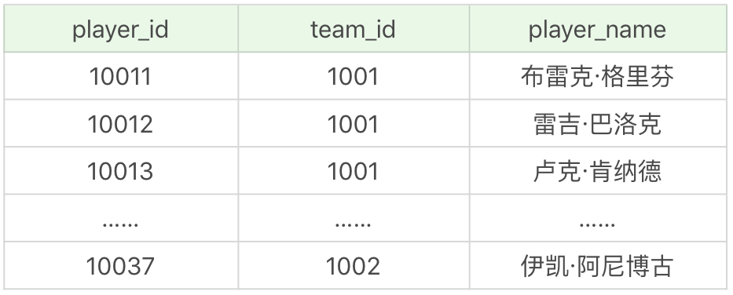


#### 集合比较子查询

集合比较子查询的作用是与另一个查询结果集进行比较，我们可以在子查询中使用 IN、ANY、ALL 和 SOME 操作符，它们的含义和英文意义一样：


还是通过上面那个例子，假设我们想要看出场过的球员都有哪些，可以采用 IN 子查询来进行操作：

```sql
SELECT player_id, team_id, player_name FROM player WHERE player_id in (SELECT player_id FROM player_score WHERE player.player_id = player_score.player_id)
```

你会发现运行结果和上面的是一样的，那么问题来了，既然 IN 和 EXISTS 都可以得到相同的结果，那么我们该使用 IN 还是 EXISTS 呢？

我们可以把这个模式抽象为：

```sql
SELECT * FROM A WHERE cc IN (SELECT cc FROM B)
```

```sql
SELECT * FROM A WHERE EXIST (SELECT cc FROM B WHERE B.cc=A.cc)
```

```
复制代码
```

实际上在查询过程中，在我们对 cc 列建立索引的情况下，我们还需要判断表 A 和表 B 的大小。在这里例子当中，表 A 指的是 player 表，表 B 指的是 player_score 表。如果表 A 比表 B 大，那么 IN 子查询的效率要比 EXIST 子查询效率高，因为这时 B 表中如果对 cc 列进行了索引，那么 IN 子查询的效率就会比较高。

同样，如果表 A 比表 B 小，那么使用 EXISTS 子查询效率会更高，因为我们可以使用到 A 表中对 cc 列的索引，而不用从 B 中进行 cc 列的查询。

了解了 IN 查询后，我们来看下 ANY 和 ALL 子查询。刚才讲到了 ANY 和 ALL 都需要使用比较符，比较符包括了（>）（=）（<）（>=）（<=）和（<>）等。


如果我们想要查询球员表中，比印第安纳步行者（对应的 team_id 为 1002）中任何一个球员身高高的球员的信息，并且输出他们的球员 ID、球员姓名和球员身高，该怎么写呢？首先我们需要找出所有印第安纳步行者队中的球员身高，即`SELECT height FROM player WHERE team_id = 1002`，然后使用 ANY 子查询即：

```java
SQL: SELECT player_id, player_name, height FROM player WHERE height > ANY (SELECT height FROM player WHERE team_id = 1002)
```

运行结果：（35 条记录）


运行结果为 35 条，你发现有 2 个人的身高是不如印第安纳步行者的所有球员的。

同样，如果我们想要知道比印第安纳步行者（对应的 team_id 为 1002）中所有球员身高都高的球员的信息，并且输出球员 ID、球员姓名和球员身高，该怎么写呢？

```sql
SQL: SELECT player_id, player_name, height FROM player WHERE height > ALL (SELECT height FROM player WHERE team_id = 1002)
```

运行结果：（1 条记录）


我们能看到比印第安纳步行者所有球员都高的球员，在 player 这张表（一共 37 个球员）中只有索恩·马克。

需要强调的是 ANY、ALL 关键字必须与一个比较操作符一起使用。因为如果你不使用比较操作符，就起不到集合比较的作用，那么使用 ANY 和 ALL 就没有任何意义。

#### 将子查询作为计算字段

我刚才讲了子查询的几种用法，实际上子查询也可以作为主查询的计算字段。比如我想查询每个球队的球员数，也就是对应 team 这张表，我需要查询相同的 team_id 在 player 这张表中所有的球员数量是多少。

```sql
SQL: SELECT team_name, (SELECT count(*) FROM player WHERE player.team_id = team.team_id) AS player_num FROM team
```

运行结果：（3 条记录）


你能看到，在 player 表中只有底特律活塞和印第安纳步行者的球员数据，所以它们的 player_num 不为 0，而亚特兰大老鹰的 player_num 等于 0。在查询的时候，我将子查询`SELECT count(*) FROM player WHERE player.team_id = team.team_id`作为了计算字段，通常我们需要给这个计算字段起一个别名，这里我用的是 player_num，因为子查询的语句比较长，使用别名更容易理解。

#### 总结

今天我讲解了子查询的使用，按照子查询执行的次数，我们可以将子查询分成关联子查询和非关联子查询，其中非关联子查询与主查询的执行无关，只需要执行一次即可，而关联子查询，则需要将主查询的字段值传入子查询中进行关联查询。

同时，在子查询中你可能会使用到 EXISTS、IN、ANY、ALL 和 SOME 等关键字。在某些情况下使用 EXISTS 和 IN 可以得到相同的效果，具体使用哪个执行效率更高，则需要看字段的索引情况以及表 A 和表 B 哪个表更大。同样，IN、ANY、ALL、SOME 这些关键字是用于集合比较的，SOME 是 ANY 的别名，当我们使用 ANY 或 ALL 的时候，一定要使用比较操作符。

最后，我讲解了如何使用子查询作为计算字段，把子查询的结果作为主查询的列。

SQL 中，子查询的使用大大增强了 SELECT 查询的能力，因为很多时候查询需要从结果集中获取数据，或者需要从同一个表中先计算得出一个数据结果，然后与这个数据结果（可能是某个标量，也可能是某个集合）进行比较。


### 视图在SQL中的作用是什么，它是怎样工作的？

我们之前对 SQL 中的数据表查询进行了讲解，今天我们来看下如何对视图进行查询。视图，也就是我们今天要讲的虚拟表，本身是不具有数据的，它是 SQL 中的一个重要概念。从下面这张图中，你能看到，虚拟表的创建连接了一个或多个数据表，不同的查询应用都可以建立在虚拟表之上。


视图一方面可以帮我们使用表的一部分而不是所有的表，另一方面也可以针对不同的用户制定不同的查询视图。比如，针对一个公司的销售人员，我们只想给他看部分数据，而某些特殊的数据，比如采购的价格，则不会提供给他。

刚才讲的只是视图的一个使用场景，实际上视图还有很多作用，今天我们就一起学习下。今天的文章里，你将重点掌握以下的内容：

1. 什么是视图？如何创建、更新和删除视图？
2. 如何使用视图来简化我们的 SQL 操作？
3. 视图和临时表的区别是什么，它们各自有什么优缺点？

#### 如何创建，更新和删除视图

视图作为一张虚拟表，帮我们封装了底层与数据表的接口。它相当于是一张表或多张表的数据结果集。视图这一特点，可以帮我们简化复杂的SQL查询，比如在编写视图后，我们就可以直接重用它，而不需要考虑视图中包含的基础查询的细节。同样，我们也可以根据需要更改数据格式，返回与底层数据表格式不同的数据。

通常情况下，小型项目的数据库可以不使用视图，但是在大型项目中，以及数据表比较复杂的情况下，视图的价值就凸显出来了，它可以帮助我们把经常查询的结果集放到虚拟表中，提升使用效率。理解和使用起来都非常方便。

#### 创建视图：CREATE VIEW

那么该如何创建视图呢？创建视图的语法是：

```sql
CREATE VIEW view_name AS SELECT column1,column2 FROM table WHERE condition 
```

实际上就是我们在SQL查询语句的基础上封装了视图VIEW ,这样就会基于SQL语句的结果集形成一张虚拟表。其中view_name为视图名称，column1,column2 代表列名，condition代表查询过滤条件。

我们以NBA球员数据为例。我们想要查询比NBA球员平均身高高的球员有哪些，显示他们的球员ID和身高。假如我们给这个视图起个名字player_above_avg_height ,那么创建视图可以写成：

```sql
CTEATE VIEW play_above_avg_height AS 
SELECT player_id,height 
FROM player
WHERE height >(SELECT AVG(height) FROM player)
```

视图查询结果（18 条记录）：

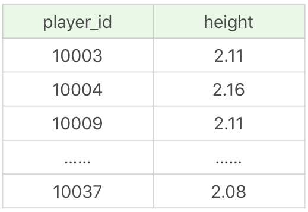

d当视图创建之后，它相当于一个虚拟表，可以直接使用：

```sql
SELECT * FROM player_-above_avg_height
```

运行结果和上面一样。

#### 嵌套视图

```sql
CREATE VIEW player_above_above_avg_height AS
SELECT player_id, height
FROM player
WHERE height > (SELECT AVG(height) from player_above_avg_height)
```

视图查询结果（11 条记录）：


你能看到这个视图的数据记录数为 11 个，比之前的记录少了 7 个。

#### 修改视图：ALTER VIEW

修改视图的语法是：

```sql
ALTER VIEW view_name AS
SELECT column1, column2
FROM table
WHERE condition
```

你能看出来它的语法和创建视图一样，只是对原有视图的更新。比如我们想更新视图 player_above_avg_height，增加一个 player_name 字段，可以写成：

```sql
ALTER VIEW player_above_avg_height AS
SELECT player_id, player_name, height
FROM player
WHERE height > (SELECT AVG(height) from player)
```

这样的话，下次再对视图进行查询的时候，视图结果就进行了更新。

```sql
SELECT * FROM player_above_avg_height
```

运行结果（18 条记录）：


#### 删除视图：DROP VIEW

删除视图的语法是：

```
DROP VIEW view_name
```

比如我们想把刚才创建的视图删除，可以使用：

```sql
DROP VIEW player_above_avg_height
```

需要说明的是，SQLite 不支持视图的修改，仅支持只读视图，也就是说你只能使用 CREATE VIEW 和 DROP VIEW，如果想要修改视图，就需要先 DROP 然后再 CREATE。

#### 如何使用视图简化 SQL 操作

从上面这个例子中，你能看出视图就是对 SELECT 语句进行了封装，方便我们重用它们。下面我们再来看几个视图使用的例子。

##### 利用视图完成复杂的连接

我在讲解 SQL99 标准连接操作的时候，举了一个 NBA 球员和身高等级连接的例子，有两张表，分别为 player 和 height_grades。其中 height_grades 记录了不同身高对应的身高等级。这里我们可以通过创建视图，来完成球员以及对应身高等级的查询。

首先我们对 player 表和 height_grades 表进行连接，关联条件是球员的身高 height（在身高等级表规定的最低身高和最高身高之间），这样就可以得到这个球员对应的身高等级，对应的字段为 height_level。然后我们通过 SELECT 得到我们想要查询的字段，分别为球员姓名 player_name、球员身高 height，还有对应的身高等级 height_level。然后把取得的查询结果集放到视图 player_height_grades 中，即：

```sql
CREATE VIEW player_height_grades AS
SELECT p.player_name, p.height, h.height_level
FROM player as p JOIN height_grades as h
ON height BETWEEN h.height_lowest AND h.height_highest
```

以后我们进行查询的时候，可以直接通过视图查询，比如我想查询身高介于 1.90m 和 2.08m 之间的球员及他们对应的身高：

```sql
SELECT * FROM player_height_grades WHERE height >= 1.90 AND height <= 2.08

```

这样就把一个相对复杂的连接查询转化成了视图查询。

##### 利用视图对数据进行格式化

我们经常需要输出某个格式的内容，比如我们想输出球员姓名和对应的球队，对应格式为 player_name(team_name)，就可以使用视图来完成数据格式化的操作：

```sql
CREATE VIEW player_team AS 
SELECT CONCAT(player_name, '(' , team.team_name , ')') AS player_team FROM player JOIN team WHERE player.team_id = team.team_id
```

首先我们将 player 表和 team 表进行连接，关联条件是相同的 team_id。我们想要的格式是`player_name(team_name)`，因此我们使用 CONCAT 函数，即`CONCAT(player_name, '(' , team.team_name , ')')`，将 player_name 字段和 team_name 字段进行拼接，得到了拼接值被命名为 player_team 的字段名，将它放到视图 player_team 中。

这样的话，我们直接查询视图，就可以得到格式化后的结果：

```sql
SELECT * FROM player_team
```

运行结果（37 条记录）：


##### 使用视图与计算字段

我们在数据查询中，有很多统计的需求可以通过视图来完成。正确地使用视图可以帮我们简化复杂的数据处理

我以球员比赛成绩表为例，对应的是 player_score 表。这张表中一共有 19 个字段，它们代表的含义如下：


如果我想要统计每位球员在每场比赛中的二分球、三分球和罚球的得分，可以通过创建视图完成：

```sql
CREATE VIEW game_player_score AS
SELECT game_id, player_id, (shoot_hits-shoot_3_hits)*2 AS shoot_2_points, shoot_3_hits*3 AS shoot_3_points, shoot_p_hits AS shoot_p_points, score  FROM player_score
```

然后通过查询视图就可以完成。

```sql
SELECT * FROM game_player_score
```

运行结果（19 条记录）：


你能看出正确使用视图可以简化复杂的 SQL 查询，让 SQL 更加清爽易用。不过有一点需要注意，视图是虚拟表，它只是封装了底层的数据表查询接口，因此有些 RDBMS 不支持对视图创建索引（有些 RDBMS 则支持，比如新版本的 SQL Server）

#### 总结

今天我讲解了视图的使用，包括创建，修改和删除视图。使用视图有很多好处，比如安全、简单清晰。

1. 安全性：虚拟表是基于底层数据表的，我们在使用视图时，一般不会轻易通过视图对底层数据进行修改，即使是使用单表的视图，也会受到限制，比如计算字段，类型转换等是无法通过视图来对底层数据进行修改的，这也在一定程度上保证了数据表的数据安全性。同时，我们还可以针对不同用户开放不同的数据查询权限，比如人员薪酬是个敏感的字段，那么只给某个级别以上的人员开放，其他人的查询视图中则不提供这个字段。
2. 简单清晰：视图是对 SQL 查询的封装，它可以将原本复杂的 SQL 查询简化，在编写好查询之后，我们就可以直接重用它而不必要知道基本的查询细节。同时我们还可以在视图之上再嵌套视图。这样就好比我们在进行模块化编程一样，不仅结构清晰，还提升了代码的复用率。

另外，我们也需要了解到视图是虚拟表，本身不存储数据，如果想要通过视图对底层数据表的数据进行修改也会受到很多限制，通常我们是把视图用于查询，也就是对 SQL 查询的一种封装。那么它和临时表又有什么区别呢？在实际工作中，我们可能会见到各种临时数据。比如你可能会问，如果我在做一个电商的系统，中间会有个购物车的功能，需要临时统计购物车中的商品和金额，那该怎么办呢？这里就需要用到临时表了，临时表是真实存在的数据表，不过它不用于长期存放数据，只为当前连接存在，关闭连接后，临时表就会自动释放。


### 什么是存储过程，在实际项目中用得多么？

今天我来讲一下 SQL 的存储过程，它是 SQL 中另一个重要应用，和视图一样，都是对 SQL 代码进行封装，可以反复利用。它和视图有着同样的优点，清晰、安全，还可以减少网络传输量。不过它和视图不同，视图是虚拟表，通常不对底层数据表直接操作，而存储过程是程序化的 SQL，可以直接操作底层数据表，相比于面向集合的操作方式，能够实现一些更复杂的数据处理。存储过程可以说是由 SQL 语句和流控制语句构成的语句集合，它和我们之前学到的函数一样，可以接收输入参数，也可以返回输出参数给调用者，返回计算结果

今天有关存储过程的内容，你将重点掌握以下几个部分：

1. 什么是存储过程，如何创建一个存储过程？
2. 流控制语句都有哪些，如何使用它们？
3. 各大公司是如何看待存储过程的？在实际工作中，我们该如何使用存储过程？

#### 什么是存储过程，如何创建一个存储过程

存储过程的英文是 Stored Procedure。它的思想很简单，就是 SQL 语句的封装。一旦存储过程被创建出来，使用它就像使用函数一样简单，我们直接通过调用存储过程名即可。我在前面讲过，存储过程实际上由 SQL 语句和流控制语句共同组成。流控制语句都有哪些呢？这个我稍后讲解。

我们先来看下如何定义一个存储过程：

在这里，我们使用 CREATE PROCEDURE 创建一个存储过程，后面是存储过程的名称，以及过程所带的参数，可以包括输入参数和输出参数。最后由 BEGIN 和 END 来定义我们所要执行的语句块。

和视图一样，我们可以删除已经创建的存储过程，使用的是 DROP PROCEDURE。如果要更新存储过程，我们需要使用 ALTER PROCEDURE。

讲完了如何创建，更新和删除一个存储过程，下面我们来看下如何实现一个简单的存储过程。比如我想做一个累加运算，计算 1+2+…+n 等于多少，我们可以通过参数 n 来表示想要累加的个数，那么如何用存储过程实现这一目的呢？这里我做一个 add_num 的存储过程，具体的代码如下：

```sql
CREATE PROCEDURE `add_num`(IN n INT)
BEGIN
       DECLARE i INT;
       DECLARE sum INT;
       
       SET i = 1;
       SET sum = 0;
       WHILE i <= n DO
              SET sum = sum + i;
              SET i = i +1;
       END WHILE;
       SELECT sum;
END
```


当我们需要再次使用这个存储过程的时候，直接使用 `CALL add_num(50);`即可。这里我传入的参数为 50，也就是统计 1+2+…+50 的积累之和，查询结果为：


这就是一个简单的存储过程，除了理解1+2+...+n的实现过程，还需要两点你需要理解，一个是DELIMITER定义语句的结束符，另一个是存储过程的三种参数类型。

让我们先来看下DELIMITER的作用，如果你使用Navicat这个工具来管理MySQL执行存储过程，那临时么直接执行上面这段代码就可以了。如果用的是MySQL,你还需要用DELIMITER来临时定义新的结束符 。因为默认情况下SQL采用(;)作为结束符，这样存储过程中每一句SQL结束之后，采用（；）作为结束符，就相当于告诉 SQL 可以执行这一句了。但是存储过程是一个整体，我们不希望 SQL 逐条执行，而是采用存储过程整段执行的方式，因此我们就需要临时定义新的 DELIMITER，新的结束符可以用（//）或者（$$）。如果你用的是 MySQL，那么上面这段代码，应该写成下面这样：

```sql
DELIMITER //
CREATE PROCEDURE `add_num`(IN n INT)
BEGIN
       DECLARE i INT;
       DECLARE sum INT;
       
       SET i = 1;
       SET sum = 0;
       WHILE i <= n DO
              SET sum = sum + i;
              SET i = i +1;
       END WHILE;
       SELECT sum;
END //
DELIMITER ;
```

首先我用（//）作为结束符，又在整个存储过程结束后采用了（//）作为结束符号，告诉 SQL 可以执行了，然后再将结束符还原成默认的（;）。

需要注意的是，如果你使用的Navicat 工具，那么在编写存储过程的时候，Navicat 会自动设置 DELIMITER 为其他符号，我们不需要再进行 DELIMITER 的操作。

我们再来看下存储过程的3种参数类型。在刚才的存储过程，我们使用了IN类型的参数，另外还有OUT类和型和INOUT类型，作用如下。

IN 和 OUT 的结合，既用于存储过程的传入参数，同时又可以把计算结果放到参数中，调用者可以得到返回值。

你能看到，IN 参数必须在调用存储过程时指定，而在存储过程中修改该参数的值不能被返回。而 OUT 参数和 INOUT 参数可以在存储过程中被改变，并可返回。

举个例子，这里会用到我们之前讲过的王者荣耀的英雄数据表 heros。假设我想创建一个存储类型 get_hero_scores，用来查询某一类型英雄中的最大的最大生命值，最小的最大魔法值，以及平均最大攻击值，那么该怎么写呢？

```sql
CREATE PROCEDURE `get_hero_scores`(
       OUT max_max_hp FLOAT,
       OUT min_max_mp FLOAT,
       OUT avg_max_attack FLOAT,  
       s VARCHAR(255)
       )
BEGIN
       SELECT MAX(hp_max), MIN(mp_max), AVG(attack_max) FROM heros WHERE role_main = s INTO max_max_hp, min_max_mp, avg_max_attack;
END
```

你能看到我定义了 4 个参数类型，其中 3 个为 OUT 类型，分别为 max_max_hp、min_max_mp 和 avg_max_attack，另一个参数 s 为 IN 类型。

这里我们从 heros 数据表中筛选主要英雄定位为 s 的英雄数据，即筛选条件为 role_main=s，提取这些数据中的最大的最大生命值，最小的最大魔法值，以及平均最大攻击值，分别赋值给变量 max_max_hp、min_max_mp 和 avg_max_attack。

然后我们就可以调用存储过程，使用下面这段代码即可：

```sql
CALL get_hero_scores(@max_max_hp, @min_max_mp, @avg_max_attack, '战士');
SELECT @max_max_hp, @min_max_mp, @avg_max_attack;
```

运行结果：


#### 流控制语句

流控制语句是用来做流程控制的，我刚才讲了两个简单的存储过程的例子，一个是 1+2+…+n 的结果计算，一个是王者荣耀的数据查询，你能看到这两个例子中，我用到了下面的流控制语句：

1. BEGIN…END：BEGIN…END 中间包含了多个语句，每个语句都以（;）号为结束符。
2. DECLARE：DECLARE 用来声明变量，使用的位置在于 BEGIN…END 语句中间，而且需要在其他语句使用之前进行变量的声明。
3. SET：赋值语句，用于对变量进行赋值。
4. SELECT…INTO：把从数据表中查询的结果存放到变量中，也就是为变量赋值。

除了上面这些用到流控制语句外，还有有些常用的流控制语句

```sql
1.IF…THEN…ENDIF：条件判断语句，我们还可以在 IF…THEN…ENDIF 中使用 ELSE 和 ELSEIF 来进行条件判断。
2.CASE：CASE 语句用于多条件的分支判断，使用的语法是下面这样的。

```

3.LOOP、LEAVE 和 ITERATE：LOOP 是循环语句，使用 LEAVE 可以跳出循环，使用 ITERATE 则可以进入下一次循环。如果你有面向过程的编程语言的使用经验，你可以把 LEAVE 理解为 BREAK，把 ITERATE 理解为 CONTINUE。
4.REPEAT…UNTIL…END REPEAT：这是一个循环语句，首先会执行一次循环，然后在 UNTIL 中进行表达式的判断，如果满足条件就退出，即 END REPEAT；如果条件不满足，则会就继续执行循环，直到满足退出条件为止。
5.WHILE…DO…END WHILE：这也是循环语句，和 REPEAT 循环不同的是，这个语句需要先进行条件判断，如果满足条件就进行循环，如果不满足条件就退出循环。

我们之前说过 SQL 是声明型语言，使用 SQL 就像在使用英语，简单直接。今天讲的存储过程，尤其是在存储过程中使用到的流控制语句，属于过程性语言，类似于 C++ 语言中函数，这些语句可以帮我们解决复杂的业务逻辑。


#### 关于存储过程的使用争议

尽管存储过程有诸多优点，但对于存储过程的使用，一直都存在着许多争议，比如有些公司对于大型项目要求使用存储过程，而有些公司在手册中明确禁止使用存储过程，为什么这些公司对存储过程的使用需求差别这么大呢？

我们测从存储过程的特点来找答案。

你能看到存储过程有很多好处。

首先存储过程可以一次编译多次使用。存储过程只在创造时进行编译，之后的使用都不需要重新编译，这就提升了 SQL 的执行效率。其次它追歼可以减少开发工作量。将代码封装成模块，实际上是编程的核心思想之一，这样可以把复杂的问题拆解成不同的模块，然后模块之间可以重复使用，在减少开发工作量的同时，还能保证代码的结构清晰。还有一点，存储过程的安全性强，我们在设定存储过程的时候可以设置对用户的使用权限，这样就和视图一样具有较强的安全性。最后它可以减少网络传输量，因为代码封装到存储过程中，每次使用只需要调用存储过程即可，这样就减少了网络传输量。同时在进行相对复杂的数据库操作时，原本需要使用一条一条的 SQL 语句，可能要连接多次数据库才能完成的操作，现在变成了一次存储过程，只需要连接一次即可。

基于上面这些优点，不少大公司都要求大型项目使用存储过程，比如微软、IBM 等公司。但是国内的阿里并不推荐开发人员使用存储过程，这是为什么呢？

存储过程虽然有诸如上面的好处，但缺点也是很明显的。

它的可移植性差，存储过程不能跨数据库移植，比如在 MySQL、Oracle 和 SQL Server 里编写的存储过程，在换成其他数据库时都需要重新编写。

其次调试困难，只有少数 DBMS 支持存储过程的调试。对于复杂的存储过程来说，开发和维护都不容易。

此外，存储过程的版本管理也很困难，比如数据表索引发生变化了，可能会导致存储过程失效。我们在开发软件的时候往往需要进行版本管理，但是存储过程本身没有版本控制，版本迭代更新的时候很麻烦。

最后它不适合高并发的场景，高并发的场景需要减少数据库的压力，有时数据库会采用分库分表的方式，而且对可扩展性要求很高，在这种情况下，存储过程会变得难以维护，增加数据库的压力，显然就不适用了。

了解了存储过程的优缺点之后，我想说的是，存储过程既方便，又有局限性。尽管不同的公司对存储过程的态度不一，但是对于我们开发人员来说，不论怎样，掌握存储过程都是必备的技能之一。


### 什么是事务处理，如何使用COMMIT和ROLLBACK进行操作？

我们知道在MySQL5.5版本之前，版本默认的存储引擎是MyISAM,在5.5之后默认的存储引擎是InnoDB。InnoDB和MyISAM区别之一就是InnoDb支持事务，也可以说这是InnoDB取代MyISAM的重要原因。 那么什么是事务呢？事务的英文是 transaction，从英文中你也能看出来它是进行一次处理的基本单元，要么完全执行，要么都不执行。 

这么讲，你可能觉得有些抽象，我换一种方式讲 。

不知道你是否遇到过这样的情况，你去家门口的小卖铺买东西，已经交了钱，但是老板比较忙接了个电话，忘记你是否交过钱，然后让你重新付款，这时你还要找之前的付款记录证明你已经完成了付款。


实际上如果我们线下的交易也能支持事务（满足事务的特性），就不会出现交了钱却拿不到商品的烦恼了，同样，对于小卖铺的老板来说，也不存在给出了商品但没有收到款的风险。总之，事务保证了一次处理的完整性，也保证了数据库中的数据一致性。它是一种高级的数据处理方式，如果我们在增加、删除、修改的时候某一个环节出了错，它允许我们回滚还原。正是因为这个特点，事务非常适合应用在安全性高的场景里，比如金融行业等。

我们今天就来学习下 SQL 中的事务。今天的课程你将重点掌握以下的内容：

1. 事务的特性是什么？如何理解它们？
2. 如何对事务进行控制？控制的命令都有哪些？
3. 为什么我们执行 COMMIT、ROLLBACK 这些命令的时候，有时会成功，有时会失败？


#### 事务的特性：ACID

我刚才提到了事务的特性：要么完全执行，要么都不执行。不过要对事务进行更深一步的理解，还要从事务的 4 个特性说起，这 4 个特性用英文字母来表达就是 ACID。

1. A，也就是原子性（Atomicity）。原子的概念就是不可分割，你可以把它理解为组成物质的基本单位，也是我们进行数据处理操作的基本单位。
2. C，就是一致性（Consistency）。一致性指的就是数据库在进行事务操作后，会由原来的一致状态，变成另一种一致的状态。也就是说当事务提交后，或者当事务发生回滚后，数据库的完整性约束不能被破坏。
3. I，就是隔离性（Isolation）。它指的是每个事务都是彼此独立的，不会受到其他事务的执行影响。也就是说一个事务在提交之前，对其他事务都是不可见的。
4. 最后一个 D，指的是持久性（Durability）。事务提交之后对数据的修改是持久性的，即使在系统出故障的情况下，比如系统崩溃或者存储介质发生故障，数据的修改依然是有效的。因为当事务完成，数据库的日志就会被更新，这时可以通过日志，让系统恢复到最后一次成功的更新状态。

ACID 可以说是事务的四大特性，在这四个特性中，原子性是基础，隔离性是手段，一致性是约束条件，而持久性是我们的目的。原子性和隔离性比较好理解，这里我讲下对一致性的理解（国内很多网站上对一致性的阐述有误，具体你可以参考 Wikipedia 对[Consistency](https://en.wikipedia.org/wiki/ACID)的阐述）。

比如说，在数据表中我们将姓名字段设置为唯一性约束，这时当事务进行提交或者事务发生回滚的时候，如果数据表中的姓名非唯一，就破坏了事务的一致性要求。所以说，事务操作会让数据表的状态变成另一种一致的状态，如果事务中的某个操作失败了，系统就会自动撤销当前正在执行的事务，返回到事务操作之前的状态。

事务的另一个特点就是持久性，持久性是通过事务日志来保证的。日志包括了回滚日志和重做日志。当我们通过事务对数据进行修改的时候，首先会将数据库的变化信息记录到重做日志中，然后再对数据库中对应的行进行修改。这样做的好处是，即使数据库系统崩溃，数据库重启后也能找到没有更新到数据库系统中的重做日志，重新执行，从而使事务具有持久性。


#### 事务的控制

当我们了解了事务的特性后，再来看下如何使用事务。我们知道 Oracle 是支持事务的，而在 MySQL 中，则需要选择适合的存储引擎才可以支持事务。如果你使用的是 MySQL，可以通过 SHOW ENGINES 命令来查看当前 MySQL 支持的存储引擎都有哪些，以及这些存储引擎是否支持事务。


你能看出在 MySQL 中，InnoDB 是支持事务的，而 MyISAM 存储引擎不支持事务。

看到这里，我们已经对事务有了一定的了解，现在我们再来看下事务的常用控制语句都有哪些。

1. START TRANSACTION 或者 BEGIN，作用是显式开启一个事务。
2. COMMIT：提交事务。当提交事务后，对数据库的修改是永久性的。
3. ROLLBACK 或者 ROLLBACK TO [SAVEPOINT]，意为回滚事务。意思是撤销正在进行的所有没有提交的修改，或者将事务回滚到某个保存点。
4. SAVEPOINT：在事务中创建保存点，方便后续针对保存点进行回滚。一个事务中可以存在多个保存点。
5. RELEASE SAVEPOINT：删除某个保存点。
6. SET TRANSACTION，设置事务的隔离级别。


需要说明的是，使用事务有两种方式，分别为隐式事务和显式事务。隐式事务实际上就是自动提交，Oracle 默认不自动提交，需要手写 COMMIT 命令，而 MySQL 默认自动提交，当然我们可以配置 MySQL 的参数：

```sql
mysql> set autocommit =0;  // 关闭自动提交
```

```sql
mysql> set autocommit =1;  // 开启自动提交
```


我们看下在 MySQL 的默认状态下，下面这个事务最后的处理结果是什么：

```sql
CREATE TABLE test(name varchar(255), PRIMARY KEY (name)) ENGINE=InnoDB;
BEGIN;
INSERT INTO test SELECT '关羽';
COMMIT;
BEGIN;
INSERT INTO test SELECT '张飞';
INSERT INTO test SELECT '张飞';
ROLLBACK;
SELECT * FROM test;
```

运行结果（1 行数据）：


在这个事务中，整个 SQL 一共执行了 2 个事务，第一个是插入“关羽”，提交后执行成功，第二个是插入两次“张飞”，这里需要注意的是，我们将 name 设置为了主键，也就是说主键的值是唯一的，那么第二次插入“张飞”时就会产生错误，然后执行 ROLLBACK 相当于对事务进行了回滚，所以我们看到最终结果只有一行数据，也就是第一个事务执行之后的结果，即“关羽”。


那么如果我们进行下面的操作又会怎样呢？

```sql
CREATE TABLE test(name varchar(255), PRIMARY KEY (name)) ENGINE=InnoDB;
BEGIN;
INSERT INTO test SELECT '关羽';
COMMIT;
INSERT INTO test SELECT '张飞';
INSERT INTO test SELECT '张飞';
ROLLBACK;
SELECT * FROM test;
```

运行结果（2 行数据）：


你能看到这次数据是 2 行，上一次操作我把两次插入“张飞”放到一个事务里，而这次操作它们不在同一个事务里，那么对于 MySQL 来说，默认情况下这实际上就是两个事务，因为在 autocommit=1 的情况下，MySQL 会进行隐式事务，也就是自动提交，因此在进行第一次插入“张飞”后，数据表里就存在了两行数据，而第二次插入“张飞”就会报错：`1062 - Duplicate entry '张飞' for key 'PRIMARY'`。

最后我们在执行 ROLLBACK 的时候，实际上事务已经自动提交了，就没法进行回滚了。

同样的我们再来看下这段代码，你又能发现什么不同呢？

```sql
CREATE TABLE test(name varchar(255), PRIMARY KEY (name)) ENGINE=InnoDB;
SET @@completion_type = 1;
BEGIN;
INSERT INTO test SELECT '关羽';
COMMIT;
INSERT INTO test SELECT '张飞';
INSERT INTO test SELECT '张飞';
ROLLBACK;
SELECT * FROM test;
```

运行结果（1 行数据）：


你能看到还是相同的 SQL 代码，只是我在事务开始之前设置了`SET @@completion_type = 1;`，结果就和我们第一次处理的一样，只有一个“关羽”。这是为什么呢？

这里我讲解下 MySQL 中 completion_type 参数的作用，实际上这个参数有 3 种可能：

1. completion=0，这是默认情况。也就是说当我们执行 COMMIT 的时候会提交事务，在执行下一个事务时，还需要我们使用 START TRANSACTION 或者 BEGIN 来开启。
2. completion=1，这种情况下，当我们提交事务后，相当于执行了 COMMIT AND CHAIN，也就是开启一个链式事务，即当我们提交事务之后会开启一个相同隔离级别的事务（隔离级别会在下一节中进行介绍）。
3. completion=2，这种情况下 COMMIT=COMMIT AND RELEASE，也就是当我们提交后，会自动与服务器断开连接。

在上面这段代码里，我使用了 completion=1，也就是说当我提交之后，相当于在下一行写了一个 START TRANSACTION 或 BEGIN。这时两次插入“张飞”会被认为是在同一个事务之内的操作，那么第二次插入“张飞”就会导致事务失败，而回滚也将这次事务进行了撤销，所以你能看到的结果就只有一个“关羽”。


通过这样简单的练习，你应该能体会到事务提交和回滚的操作。

当我们设置 autocommit=0 时，不论是否采用 START TRANSACTION 或者 BEGIN 的方式来开启事务，都需要用 COMMIT 进行提交，让事务生效，使用 ROLLBACK 对事务进行回滚。

当我们设置 autocommit=1 时，每条 SQL 语句都会自动进行提交。
不过这时，如果你采用 START TRANSACTION 或者 BEGIN 的方式来显式地开启事务，那么这个事务只有在 COMMIT 时才会生效，在 ROLLBACK 时才会回滚。

#### 总结

关于 SQL 中的事务处理，内容相对比较多，因此我会采用两节来进行讲解。今天我们对事务的概念进行了理解，并进行了简单的事务操作。我们在做数据库操作的时候，可能会失败，但正是因为有事务的存在，即使在数据库操作失败的情况下，也能保证数据的一致性。同样，多个应用程序访问数据库的时候，事务可以提供隔离，保证事务之间不被干扰。最后，事务一旦提交，结果就会是永久性的，这就意味着，即使系统崩溃了，数据库也可以对数据进行恢复。

在使用事务的过程中，我们会采用控制流语句对事务进行操作，不过在实际操作中，不一定每次使用 COMMIT 或 ROLLBACK 都会成功，你还需要知道当前系统的事务执行方式，也就是一些常用的参数情况，比如 MySQL 中的 autocommit 和 completion_type 等。

事务是数据库区别于文件系统的重要特性之一，当我们有了事务就会让数据库始终保持一致性，同时我们还能通过事务的机制恢复到某个时间点，这样可以保证已提交到数据库的修改不会因为系统崩溃而丢失。


### 初识事务隔离：隔离的级别有哪些，它们都解决了哪些异常问题？

上一篇文章中，我们讲到了事务的四大特性 ACID，分别是原子性、一致性、隔离性和持久性，其中隔离性是事务的基本特性之一，它可以防止数据库在并发处理时出现数据不一致的情况。最严格的情况下，我们可以采用串行化的方式来执行每一个事务，这就意味着事务之间是相互独立的，不存在并发的情况。然而在实际生产环境下，考虑到随着用户量的增多，会存在大规模并发访问的情况，这就要求数据库有更高的吞吐能力，这个时候串行化的方式就无法满足数据库高并发访问的需求，我们还需要降低数据库的隔离标准，来换取事务之间的并发能力。

有时候我们需要牺牲一定的正确性来换群效率的提升，也就是说，我们需要通过设置不同的隔离等级，以便在正确性和效率之间平衡。同时，随着 RDBMS 种类和应用场景的增多，数据库的设计者需要统一对数据库隔离级别进行定义，说明这些隔离标准都解决了哪些问题。

我们今天主要讲解事务的异常以及隔离级别都有哪些，如果你已经对它们有所了解，可以跳过本次章节，当然你也可以通过今天的课程快速复习一遍：

1. 事务并发处理可能存在的三种异常有哪些？什么是脏读、不可重复读和幻读？
2. 针对可能存在的异常情况，四种事务隔离的级别分别是什么？
3. 如何使用 MySQL 客户端来模拟脏读、不可重复读和幻读？


#### 事务并发处理可能存在的异常都有哪些？

在了解数据库隔离级别之前，我们需要了解设定事务的隔离级别都要解决哪些可能存在的问题，也就是事务并发处理时会存在哪些异常情况。实际上，SQL-92 标准中已经对 3 种异常情况进行了定义，这些异常情况级别分别为脏读（Dirty Read）、不可重复读（Nnrepeatable Read）和幻读（Phantom Read）。

脏读、不可重复读和幻读都代表了什么，我用一个例子来给你讲解下。比如说我们有个英雄表 heros_temp，如下所示：


这张英雄表，我们会记录很多英雄的姓名，假设我们不对事务进行隔离操作，那么数据库在进行事务的并发处理时会出现怎样的情况？

第一天，小张访问数据库，正在进行事务操作，往里面写入一个新的英雄“吕布”：

```sql
BEGIN;
INSERT INTO heros_temp values(4, '吕布');
```

当小张还没有提交改事务的时访问候，小李又对数据表进行了访问，他想看下这张英雄表里有哪些英雄？

```sql
SELECT * FROM heros_temp;
```

这时，小李看到的结果如下：


你有没有发现什么异常？这个时候小张还没有提交事务，但是小李却读到了小张还没有提交的数据，这种现象我们称之为“脏读日二胺”。


那什么是不可重复读呢？

第二天，小张想查看ID=1的英雄是谁，于是他进行了 SQL 查询：

```sql
SELECT name FROM heros_temp WHERE id = 1 
```

运行结果：


然而此时，小李开始了一个事务操作，他对 id=1 的英雄姓名进行了修改，把原来的“张飞”改成了“张翼德”：

```SQL
BEGIN;
UPDATE heros_temp SET name = '张翼德' WHERE id =1;
```


然后小张再一次进行查询，同样也是查看 id=1 的英雄是谁：

```sql
SQL> SELECT name FROM heros_temp WHERE id = 1;

```

运行结果：


这个时候你会发现，两次查询的结果并不一样。小张会想这是怎么回事呢？他明明刚执行了一次查询，马上又进行了一次查询，结果两次的查询结果不同。实际上小张遇到的情况我们称之为“不可重复读”，也就是同一条记录，两次读取的结果不同。

什么是幻读？

第三天，小张想要看下数据表里都有哪些英雄，他开始执行下面这条语句：

```sql
SQL> SELECT * FROM heros_temp;
```


这时当小张执行完之后，小李又开始了一个事务，往数据库里插入一个新的英雄“吕布”：

```sql
SQL> BEGIN;
SQL> INSERT INTO heros_temp values(4, '吕布');
```

不巧的是，小张这时忘记了英雄都有哪些，又重新执行了一遍查询：

```sql\
SQL> SELECT * FROM heros_temp;
```

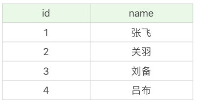

他发现这一次查询多了一个英雄，原来只有 3 个，现在变成了 4 个。这种异常情况我们称之为“幻读”。

我来总结下这三内容种异常情况的特点：

脏读：堵到了其它事务还没有提交的数据。

不可重复读：对某数据进行读取，发现两次读取结果不同，也就是说没有读到相同的内容。这是因为有其它事务对这个数据同时进行了修改与删除。

幻读：事务A根据天健查询得到了N条数据，但此时事务B更改或者增加了M条符合事务A查询条件的数据。这样当事务 A 再次进行查询的时候发现会有 N+M 条数据，产生了幻读。


#### 事务隔离的级别有哪些？

脏读、不可重复读和幻读这三种异常情况，是在 SQL-92 标准中定义的，同时 SQL-92 标准还定义了 4 种隔离级别来解决这些异常情况。

解决异常数量从少到多的顺序（比如读未提交可能存在 3 种异常，可串行化则不会存在这些异常）决定了隔离级别的高低，这四种隔离级别从低到高分别是：读未提交（READ UNCOMMITTED ）、读已提交（READ COMMITTED）、可重复读（REPEATABLE READ）和可串行化（SERIALIZABLE）。这些隔离级别能解决的异常情况如下表所示：


你能看到可串行化能避免所有异常情况，而读未提交则允许异常情况发生。

关于这四种级别，我来简单讲解下。

读未提交，也就是允许读到未提交的数据，这种情况下查询是不会使用锁的，可能会产生脏读，不可重复读、幻读情况。

读已提交就是只能读到已经提交的内容，可以避免脏读的产生，属于RDBMS中常见的默认隔离级别（比如说 Oracle 和 SQL Server），但如果想要避免不可重复读和幻读，就需要我们在SQL查询中编写带加锁的sql语句。

可重复读，保证一个事务在相同查询条件下两次查询得到的数据结果是一致的，可以避免不可重复读和脏读，但无法避免幻读。MySQL 默认的隔离级别就是可重复读。

可串行化，将事务进行串行化，也就是在一个队列中按照顺序执行，可串行化是最高级别的隔离等级，可以解决事务读取中所有可能出现的异常情况，但是它牺牲了系统的并发性。

#### 使用 MySQL 客户端来模拟三种异常

我在讲解这三种异常的时候举了一个英雄数据表查询的例子，你还可以自己写 SQL 来模拟一下这三种异常。

首先我们需要一个英雄数据表 heros_temp，具体表结构和数据，你可以从[GitHub](https://github.com/cystanford/sql_heros_data)上下载 heros_temp.sql 文件。

你也可以执行下面的 SQL 文件，来完成 heros_temp 数据表的创建。

```sql
-- ----------------------------
-- Table structure for heros_temp
-- ----------------------------
DROP TABLE IF EXISTS `heros_temp`;
CREATE TABLE `heros_temp`  (
  `id` int(11) NOT NULL,
  `name` varchar(255) CHARACTER SET utf8 COLLATE utf8_general_ci NOT NULL,
  PRIMARY KEY (`id`) USING BTREE
) ENGINE = InnoDB CHARACTER SET = utf8 COLLATE = utf8_general_ci ROW_FORMAT = Dynamic;
 
-- ----------------------------
-- Records of heros_temp
-- ----------------------------
INSERT INTO `heros_temp` VALUES (1, '张飞');
INSERT INTO `heros_temp` VALUES (2, '关羽');
INSERT INTO `heros_temp` VALUES (3, '刘备');
```

模拟的时候我们需要开两个 MySQL 客户端，分别是客户端 1 和客户端 2。

在客户端 1 中，我们先来查看下当前会话的隔离级别，使用命令：

```sql
mysql> SHOW VARIABLES LIKE 'transaction_isolation';
```

然后你能看到当前的隔离级别是 REPEATABLE-READ，也就是可重复读。


现在我们把隔离级别降到最低，设置为 READ UNCOMMITTED（读未提交）。

```sql
mysql> SET SESSION TRANSACTION ISOLATION LEVEL READ UNCOMMITTED;
```

然后再查看下当前会话（SESSION）下的隔离级别，结果如下：


因为 MySQL 默认是事务自动提交，这里我们还需要将 autocommit 参数设置为 0，命令如下：

```sql
mysql> SET autocommit = 0;
```

然后我们再来查看 SESSION 中的 autocommit 取值，结果如下

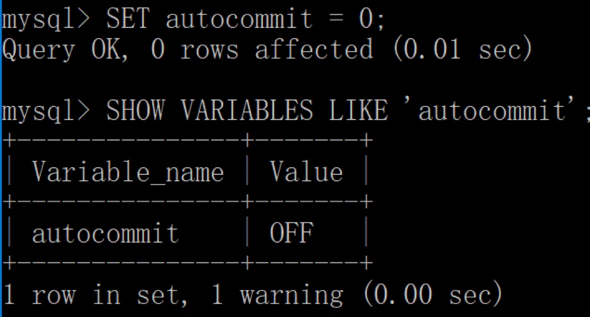


接着我们以同样的操作启动客户端 2，也就是将隔离级别设置为 READ UNCOMMITTED（读未提交），autocommit 设置为 0。

##### 模拟“脏读”

我们在客户端 2 中开启一个事务，在 heros_temp 表中写入一个新的英雄“吕布”，注意这个时候不要提交。


然后我们在客户端 1 中，查看当前的英雄表：


你能发现客户端 1 中读取了客户端 2 未提交的新英雄“吕布”，实际上客户端 2 可能马上回滚，从而造成了“脏读”。

##### 模拟“不可重复读”

我们用客户端 1 来查看 id=1 的英雄：


然后用客户端 2 对 id=1 的英雄姓名进行修改：

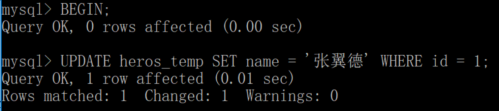

这时用客户端 1 再次进行查询：

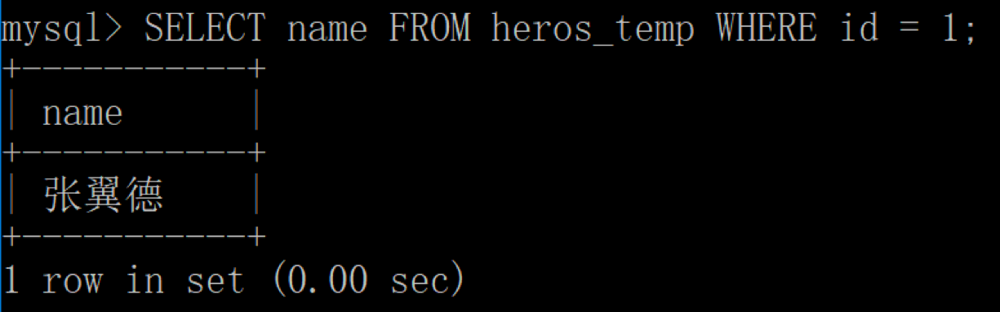

你能发现对于客户端 1 来说，同一条查询语句出现了“不可重复读”。


##### 模拟“幻读”

我们先用客户端 1 查询数据表中的所有英雄：

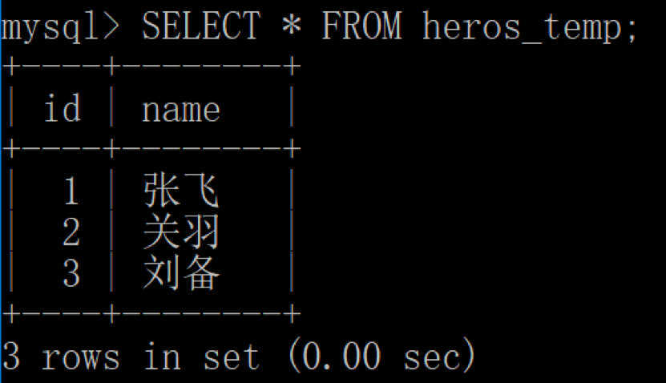

然后用客户端 2，开始插入新的英雄“吕布”： 

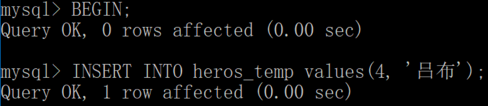

这时，我们再用客户端 1 重新进行查看：


你会发现数据表多出一条数据。

如果你是初学者，那么你可以采用 heros_temp 数据表简单模拟一下以上的过程，加深对脏读、不可重复读以及幻读的理解。对应的，你也会更了解不同的隔离级别解决的异常问题。

隔离级别越低，意味着系统吞吐量（并发程度）越大，但同时也意味着出现异常问题的可能性会更大。在实际使用过程中我们往往需要在性能和正确性上进行权衡和取舍，没有完美的解决方案，只有适合与否。


#### 总结

我们今天只是简单讲解了 4 种隔离级别，以及对应的要解决的三种异常问题。我会在优化篇这一模块里继续讲解隔离级别以及锁的使用。

你能看到，标准的价值在于，即使是不同的 RDBMS 都需要达成对异常问题和隔离级别定义的共识。这就意味着一个隔离级别的实现满足了下面的两个条件：

1. 正确性：只要能满足某一个隔离级别，一定能解决这个隔离级别对应的异常问题。
2. 与实现无关：实际上 RDBMS 种类很多，这就意味着有多少种 RDBMS，就有多少种锁的实现方式，因此它们实现隔离级别的原理可能不同，然而一个好的标准不应该限制其实现的方式。


### 游标：当我们需要逐条处理数据时，该怎么做？

我们在编写 SQL 语句的时候通常是面向集合进行思考，这种思考方式更让我们关注结果集的特征，而不是具体的实现过程。面向集合的思考方式与面向过程的思考方式各有特点，我们该如何理解它们呢？

我们用下面这张图开启今天的学习。这张图中一共有 9 个图形，每个图形有不同的特征，包括形状、纹理、颜色和个数等。


当我们看到这张图时，有时候会不由自主地按照某个属性进行分类，比如说按照红色分类，那么 1、4、9 就是一类。这实际上就是属于同一个条件下的查询结果集。或者我们也可以按照物体的个数来划分，比如都有 3 个物体的，那么对应的就是 2、5、6、8，这就是对应着“都包括 3 个物体”的查询结果集。

你能看出来集合思维更像是从整体的角度来考虑，然后把整个数据集按照不同的属性进行划分，形成不同的子集合。面向集合的思考方式，让我们关注“获取什么”，而不是“如何获取”，这也可以说是 SQL 与传统编程最大的区别之一，因为 SQL 本身是以关系模型和集合论为基础的。

然而也有一些情况，我们不需要对查询结果集中的所有数据行都采用相同的处理方式，需要每次处理一行或者一部分行，这时就需要面向过程的编程方法了。游标就是这种编程方式的体现。如果你之前已经有了一些面向过程的编程经验，那么对于游标的理解也会比较容易。

关于游标，你需要掌握以下几个方面的内容：

1. 什么是游标？我们为什么要使用游标？
2. 如何使用游标？使用游标的常用步骤都包括哪些？
3. 如何使用游标来解决一些常见的问题？

#### 什么是游标？

在数据库中，游标是个重要的概念，它提供了一种灵活的操作方式，可以让我们从数据结果集中每次提取一条数据记录进行操作。游标让SQL这种面向集合的语言有了面向过程开发阿德能力。可以说，游标是面向过程的编程方式，这与面向集合的编程方式有所不同。

在 SQL 中，游标是一种临时的数据库对象，可以指向存储在数据库表中的数据行指针。这里游标充当了指针的作用，我们可以通过操作游标来对数据行进行操作。

比如我们查询了 heros 数据表中最大生命值大于 8500 的英雄都有哪些：

```sql
SELECT id, name, hp_max FROM heros WHERE hp_max > 8500
```

查询结果（4 条数据）


这里我们就可以通过游标来操作数据行，如图所示此时游标所在的行是“白起”的记录，我们也可以在结果集上滚动游标，指向结果集中的任意一行。

#### 如何使用游标？

游标实际上是一种控制数据集的更加灵活的处理方式。

如果我们想要使用游标，一般需要经历五个步骤。不同 DBMS 中，使用游标的语法可能略有不同。

第一步，定义游标。

```sql
DECLARE cursor_name CURSOR FOR select_statement
```

这个语法适用于 MySQL，SQL Server，DB2 和 MariaDB。如果是用 Oracle 或者 PostgreSQL，需要写成：

```sql
DECLARE cursor_name CURSOR IS select_statement
```

要使用 SELECT 语句来获取数据结果集，而此时还没有开始遍历数据，这里 select_statement 代表的是 SELECT 语句。

下面我用 MySQL 举例讲解游标的使用，如果你使用的是其他的 RDBMS，具体的游标语法可能略有差异。我们定义一个能够存储 heros 数据表中的最大生命值的游标，可以写为：

```sql
DECLARE cur_hero CURSOR FOR 
	SELECT hp_max FROM heros;
```

第二步，打开游标。

```sql
OPEN cursor_name
```

当我们定义好游标之后，如果想要使用游标，必须先打开游标。打开游标的时候 SELECT 语句的查询结果集就会送到游标工作区。

```sql
FETCH cursor_name INTO var_name ...
```

这句的作用是使用 cursor_name 这个游标来读取当前行，并且将数据保存到 var_name 这个变量中，游标指针指到下一行。如果游标读取的数据行有多个列名，则在 INTO 关键字后面赋值给多个变量名即可。

第四步，关闭游标。

```sql
CLOSE cursor_name
```

有 OPEN 就会有 CLOSE，也就是打开和关闭游标。当我们使用完游标后需要关闭掉该游标。关闭游标之后，我们就不能再检索查询结果中的数据行，如果需要检索只能再次打开游标。

最后一步，释放游标。

```sql
DEALLOCATE PREPARE
```

有 DECLARE 就需要有 DEALLOCATE，DEALLOCATE 的作用是释放游标。我们一定要养成释放游标的习惯，否则游标会一直存在于内存中，直到进程结束后才会自动释放。当你不需要使用游标的时候，释放游标可以减少资源浪费。

上面就是 5 个常用的游标步骤。我来举一个简单的例子，假设我想用游标来扫描 heros 数据表中的数据行，然后累计最大生命值，那么该怎么做呢？

我先创建一个存储过程 calc_hp_max，然后在存储过程中定义游标 cur_hero，使用 FETCH 获取每一行的具体数值，然后赋值给变量 hp，再用变量 hp_sum 做累加求和，最后再输出 hp_sum，代码如下：

```sql
CREATE PROCEDURE `calc_hp_max`()
BEGIN
       -- 创建接收游标的变量
       DECLARE hp INT;  
       -- 创建总数变量 
       DECLARE hp_sum INT DEFAULT 0;
       -- 创建结束标志变量  
       DECLARE done INT DEFAULT false;
       -- 定义游标     
       DECLARE cur_hero CURSOR FOR SELECT hp_max FROM heros;
       
       OPEN cur_hero;
       read_loop:LOOP 
       FETCH cur_hero INTO hp;
       SET hp_sum = hp_sum + hp;
       END LOOP;
       CLOSE cur_hero;
       SELECT hp_sum;
       DEALLOCATE PREPARE cur_hero;
END
```

你会发现执行`call calc_hp_max()`这一句的时候系统会提示 1329 错误，也就是在 LOOP 中当游标没有取到数据时会报的错误。

当游标溢出时（也就是当游标指向到最后一行数据后继续执行会报的错误），我们可以定义一个 continue 的事件，指定这个事件发生时修改变量 done 的值，以此来判断游标是否已经溢出，即：

```sql
DECLARE CONTINUE HANDLER FOR NOT FOUND SET done = true;  
```

同时在循环中我们需要加上对 done 的判断，如果游标的循环已经结束，就需要跳出 read_loop 循环，完善的代码如下：

```sql
CREATE PROCEDURE `calc_hp_max`()
BEGIN
       -- 创建接收游标的变量
       DECLARE hp INT;  
 
       -- 创建总数变量 
       DECLARE hp_sum INT DEFAULT 0;
       -- 创建结束标志变量  
     DECLARE done INT DEFAULT false;
       -- 定义游标     
       DECLARE cur_hero CURSOR FOR SELECT hp_max FROM heros;
       -- 指定游标循环结束时的返回值  
     DECLARE CONTINUE HANDLER FOR NOT FOUND SET done = true;  
       
       OPEN cur_hero;
       read_loop:LOOP 
       FETCH cur_hero INTO hp;
       -- 判断游标的循环是否结束  
       IF done THEN  
                     LEAVE read_loop;
       END IF; 
              
       SET hp_sum = hp_sum + hp;
       END LOOP;
       CLOSE cur_hero;
       SELECT hp_sum;
       DEALLOCATE PREPARE cur_hero;
END
```

运行结果（1 行数据）：


在游标中的循环中，除了使用 LOOP 循环以外，你还可以使用 REPEAT… UNTIL…以及 WHILE 循环。它们同样需要设置 CONTINUE 事件来处理游标溢出的情况。

所以你能看出，使用游标可以让我们对 SELECT 结果集中的每一行数据进行相同或者不同的操作，从而很精细化地管理结果集中的每一条数据。

#### **使用游标来解决一些常见的问题**

我刚才讲了一个简单的使用案例，实际上如果想要统计 hp_sum，完全可以通过 SQL 语句来完成，比如：

```sql
SELECT SUM(hp_max) FROM heros
```

运行结果（1 行数据）：


那么游标都有什么用呢？

当你需要处理一些复杂的数据行计算的时候，游标就会起到作用了。我举个例子，还是针对 heros 数据表，假设我们想要对英雄的物攻成长（对应 attack_growth）进行升级，在新版本中大范围提升英雄的物攻成长数值，但是针对不同的英雄情况，提升的幅度也不同，具体提升的方式如下。

如果这个英雄原有的物攻成长小于 5，那么将在原有基础上提升 7%-10%。如果物攻成长的提升空间（即最高物攻 attack_max- 初始物攻 attack_start）大于 200，那么在原有的基础上提升 10%；如果物攻成长的提升空间在 150 到 200 之间，则提升 8%；如果物攻成长的提升空间不足 150，则提升 7%。

如果原有英雄的物攻成长在 5—10 之间，那么将在原有基础上提升 5%。

如果原有英雄的物攻成长大于 10，则保持不变。

以上所有的更新后的物攻成长数值，都需要保留小数点后 3 位。

你能看到上面这个计算的情况相对复杂，实际工作中你可能会遇到比这个更加复杂的情况，这时你可以采用面向过程的思考方式来完成这种任务，也就是说先取出每行的数值，然后针对数值的不同情况采取不同的计算方式。

针对上面这个情况，你自己可以用游标来完成转换，具体的代码如下：

```sql
CREATE PROCEDURE `alter_attack_growth`()
BEGIN
       -- 创建接收游标的变量
       DECLARE temp_id INT;  
       DECLARE temp_growth, temp_max, temp_start, temp_diff FLOAT;  
 
       -- 创建结束标志变量  
       DECLARE done INT DEFAULT false;
       -- 定义游标     
       DECLARE cur_hero CURSOR FOR SELECT id, attack_growth, attack_max, attack_start FROM heros;
       -- 指定游标循环结束时的返回值  
       DECLARE CONTINUE HANDLER FOR NOT FOUND SET done = true;  
       
       OPEN cur_hero;  
       FETCH cur_hero INTO temp_id, temp_growth, temp_max, temp_start;
       REPEAT
                     IF NOT done THEN
                            SET temp_diff = temp_max - temp_start;
                            IF temp_growth < 5 THEN
                                   IF temp_diff > 200 THEN
                                          SET temp_growth = temp_growth * 1.1;
                                   ELSEIF temp_diff >= 150 AND temp_diff <=200 THEN
                                          SET temp_growth = temp_growth * 1.08;
                                   ELSEIF temp_diff < 150 THEN
                                          SET temp_growth = temp_growth * 1.07;
                                   END IF;                       
                            ELSEIF temp_growth >=5 AND temp_growth <=10 THEN
                                   SET temp_growth = temp_growth * 1.05;
                            END IF;
                            UPDATE heros SET attack_growth = ROUND(temp_growth,3) WHERE id = temp_id;
                     END IF;
       FETCH cur_hero INTO temp_id, temp_growth, temp_max, temp_start;
       UNTIL done = true END REPEAT;
       
       CLOSE cur_hero;
       DEALLOCATE PREPARE cur_hero;
END
```


这里我创建了 alter_attack_growth 这个存储过程，使用了 REPEAT…UNTIL…的循环方式，针对不同的情况计算了新的物攻成长 temp_growth，然后对原有的 attack_growth 进行了更新，最后调用 call alter_attack_growth(); 执行存储过程。

有一点需要注意的是，我们在对数据表进行更新前，需要备份之前的表，我们可以将备份后的表命名为 heros_copy1。更新完 heros 数据表之后，你可以看下两张表在 attack_growth 字段上的对比，我们使用 SQL 进行查询：

```sql
SELECT heros.id, heros.attack_growth, heros_copy1.attack_growth FROM heros JOIN heros_copy1 WHERE heros.id = heros_copy1.id
```

运行结果（69 条记录）：

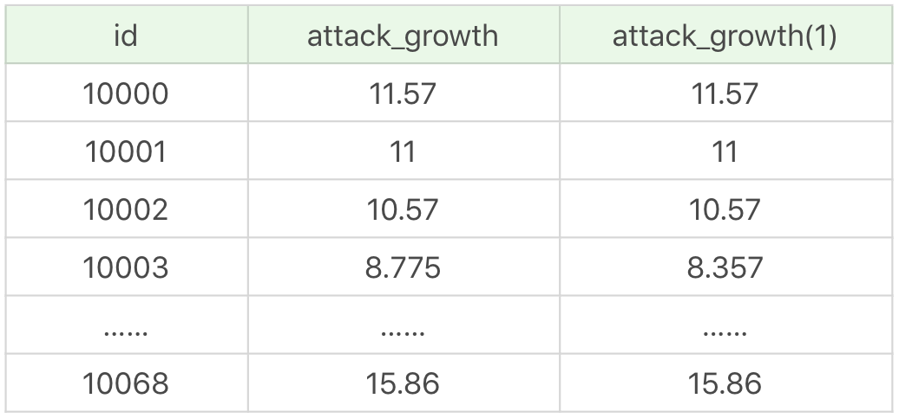

通过前后两张表的 attack_growth 对比你也能看出来，存储过程通过游标对不同的数据行进行了更新。

需要说明的是，以上代码适用于 MySQL，如果在 SQL Server 或 Oracle 中，使用方式会有些差别。

#### 总结

今天我们讲解了如何在 SQL 中使用游标，游标实际上是面向过程的思维方式，与面向集合的思维方式不同的地方在于，游标更加关注“如何执行”。我们可以通过游标更加精细、灵活地查询和管理想要的数据行。

有的时候，我们需要找特定数据，用 SQL 查询写起来会比较困难，比如两表或多表之间的嵌套循环查找，如果用 JOIN 会非常消耗资源，效率也可能不高，而用游标则会比较高效。

虽然在处理某些复杂的数据情况下，使用游标可以更灵活，但同时也会带来一些性能问题，比如在使用游标的过程中，会对数据行进行加锁，这样在业务并发量大的时候，不仅会影响业务之间的效率，还会消耗系统资源，造成内存不足，这是因为游标是在内存中进行的处理。如果有游标的替代方案，我们可以采用替代方案。


### 基础篇总结：如何理解查询优化、通配符以及存储过程？

#### 关于各种 DBMS 的介绍

##### 答疑 1

文章中有句话不太理解，“列式数据库是将数据按照列存储到数据库中，这样做的好处是可以大量降低系统的 I/O”，可以解释一些“降低系统 I/O”是什么意思吗？

##### 解答

行式存储数据库是把一行的数据都串起来进行存储，然后再存储下一行。同样，列式存储是把一列的数据都串起来进行存储，然后再存储下一列。这样做的话，相邻数据的数据类型都是一样的，更加容易压缩，压缩之后就自然降低了I/O。

我们还需要从数据处理的需求出发，去理解行式存储和列式存储。数据处理可以分为 OLTP（联机事务处理）和 OLAP（联机分析处理）两大类。

OLTP 一般用于处理客户的事务和进行查询，需要随时对数据表中的记录进行增删改查，对实时性要求高。

那么对于 OLTP 来说，由于随时需要对数据记录进行增删改查，更适合采用行式存储，因为一行数据的写入会同时修改多个列。传统的 RDBMS 都属于行式存储，比如 Oracle、SQL Server 和 MySQL 等。

对于 OLAP 来说，由于需要对大量历史数据进行汇总和分析，则适合采用列式存储，这样的话汇总数据会非常快，但是对于插入（INSERT）和更新（UPDATE）会比较麻烦，相比于行式存储性能会差不少。

所以说列式存储适合大批量数据查询，可以降低 I/O，但如果对实时性要求高，则更适合行式存储。

#### 关于查询优化

##### 答疑 1

在 MySQL 中统计数据表的行数，可以使用三种方式：`SELECT COUNT(*)`、`SELECT COUNT(1)`和`SELECT COUNT(具体字段)`，使用这三者之间的查询效率是怎样的？之前看到说是：`SELECT COUNT(*)`＞ `SELECT COUNT(1)`＞ `SELECT COUNT(具体字段)`。

##### 解答

在 MySQL InnoDB 存储引擎中，`COUNT(*)`和`COUNT(1)`都是对所有结果进行`COUNT`。如果有 WHERE 子句，则是对所有符合筛选条件的数据行进行统计；如果没有 WHERE 子句，则是对数据表的数据行数进行统计。

因此`COUNT(*)`和`COUNT(1)`本质上并没有区别，执行的复杂度都是`O(N)`，也就是采用全表扫描，进行循环 + 计数的方式进行统计。

如果是 MySQL MyISAM 存储引擎，统计数据表的行数只需要`O(1)`的复杂度，这是因为每张 MyISAM 的数据表都有一个 meta 信息存储了`row_count`值，而一致性则由表级锁来保证。因为 InnoDB 支持事务，采用行级锁和 MVCC 机制，所以无法像 MyISAM 一样，只维护一个`row_count`变量，因此需要采用扫描全表，进行循环 + 计数的方式来完成统计。

需要注意的是，在实际执行中，`COUNT(*)`和`COUNT(1)`的执行时间可能略有差别，不过你还是可以把它俩的执行效率看成是相等的。

另外在 InnoDB 引擎中，如果采用`COUNT(*)`和`COUNT(1)`来统计数据行数，要尽量采用二级索引。因为主键采用的索引是聚簇索引，聚簇索引包含的信息多，明显会大于二级索引（非聚簇索引）。对于`COUNT(*)`和`COUNT(1)`来说，它们不需要查找具体的行，只是统计行数，系统会自动采用占用空间更小的二级索引来进行统计。

然而如果想要查找具体的行，那么采用主键索引的效率更高。如果有多个二级索引，会使用 key_len 小的二级索引进行扫描。当没有二级索引的时候，才会采用主键索引来进行统计。

这里我总结一下：

1. 一般情况下，三者执行的效率为 `COUNT(*)`= `COUNT(1)`> `COUNT(字段)`。我们尽量使用`COUNT(*)`，当然如果你要统计的是某个字段的非空数据行数，则另当别论，毕竟比较执行效率的前提是结果一样才可以。
2. 如果要统计`COUNT(*)`，尽量在数据表上建立二级索引，系统会自动采用`key_len`小的二级索引进行扫描，这样当我们使用`SELECT COUNT(*)`的时候效率就会提升，有时候可以提升几倍甚至更高。


##### 答疑 2

在 MySQL 中，`LIMIT`关键词是最后执行的，如果可以确定只有一条结果，那么就起不到查询优化的效果了吧，因为`LIMIT`是对最后的结果集过滤，如果结果集本来就只有一条，那就没有什么用了。

##### 解答

在 MySQL 中，`LIMIT`关键词是最后执行的，如果可以确定只有一条结果，那么就起不到查询优化的效果了吧，因为`LIMIT`是对最后的结果集过滤，如果结果集本来就只有一条，那就没有什么用了。


#### 关于通配符的解释

关于查询语句中通配符的使用理解，我举了一个查询英雄名除了第一个字以外，包含“太”字的英雄都有谁的例子，使用的 SQL 语句是：

```sql
SELECT name FROM heros WHERE name LIKE '_%太%'
```

（_）匹配任意一个字符，（%） 匹配大于等于 0 个任意字符。

所以通配符`'_%太%'`说明在第一个字符之后需要有“太”字，这里就不能匹配上“太乙真人”，但是可以匹配上“东皇太一”。如果数据表中有“太乙真人太太”，那么结果集中也可以匹配到。

另外，单独的`LIKE '%'`无法查出 NULL 值，比如：`SELECT * FROM heros WHERE role_assist LIKE '%'`。

##### 答疑 4

可以理解在 WHERE 条件字段上加索引，但是为什么在 ORDER BY 字段上还要加索引呢？这个时候已经通过 WHERE 条件过滤得到了数据，已经不需要再筛选过滤数据了，只需要根据字段排序就好了。

##### 解答

在 MySQL 中，支持两种排序方式，分别是 FileSort 和 Index 排序。在 Index 排序中，索引可以保证数据的有序性，不需要再进行排序，效率更高。而 FileSort 排序则一般在内存中进行排序，占用 CPU 较多。如果待排结果较大，会产生临时文件 I/O 到磁盘进行排序的情况，效率较低。

所以使用 ORDER BY 子句时，应该尽量使用 Index 排序，避免使用 FileSort 排序。当然你可以使用 explain 来查看执行计划，看下优化器是否采用索引进行排序。

优化建议：

1、SQL中，可以再WHERE 字句和ORDER BY字句中使用索引，谜底是在WHERE 字句中避免全表扫描，在ORDER BY 在字句中避免使用FileSort 排序。当然，某些情况下全表扫描，或者FileSort排序不一定比索引慢。但总得来说，我们好还是要避免，已提高查询效率。一般情况下，优化器会帮我们进行更好的选择，淡然我们也需要建立合适的索引。

2.尽量使用 Index 完成 ORDER BY 排序。如果 WHERE 和 ORDER BY 后面是相同的列就使用单索引列；如果不同就使用联合索引。

3.无法使用 Index 时，需要对 FileSort 方式进行调优。


##### 答疑 5

ORDER BY 是对分的组排序还是对分组中的记录排序呢？

##### 解答

ORDER BY 就是对记录进行排序。如果你在 ORDER BY 前面用到了 GROUP BY，实际上这是一种分组的聚合方式，已经把一组的数据聚合成为了一条记录，再进行排序的时候，相当于对分的组进行了排序。


##### 答疑 6

请问下关于 SELECT 语句内部的执行步骤。

##### 解答

一条完整的 SELECT 语句内部的执行顺序是这样的：

1. FROM 子句组装数据（包括通过 ON 进行连接）；
2. WHERE 子句进行条件筛选；
3. GROUP BY 分组 ；
4. 使用聚集函数进行计算；
5. HAVING 筛选分组；
6. 计算所有的表达式；
7. SELECT 的字段；
8. ORDER BY 排序；
9. LIMIT 筛选。

##### 答疑 7

不太理解哪种情况下应该使用 EXISTS，哪种情况应该用 IN。选择的标准是看能否使用表的索引吗？

##### 解答

索引是个前提，其实选择与否还是要看表的大小。你可以将选择的标准理解为小表驱动大表。在这种方式下效率是最高的。

比如下面这样：

```
 SELECT * FROM A WHERE cc IN (SELECT cc FROM B)
 SELECT * FROM A WHERE EXISTS (SELECT cc FROM B WHERE B.cc=A.cc)
```

当 A 小于 B 时，用 EXISTS。因为 EXISTS 的实现，相当于外表循环，实现的逻辑类似于：

```sql
 for i in A
     for j in B
         if j.cc == i.cc then ...
```

当 B 小于 A 时用 IN，因为实现的逻辑类似于：

```sql
 for i in B
     for j in A
         if j.cc == i.cc then ...
```

哪个表小就用哪个表来驱动，A 表小就用 EXISTS，B 表小就用 IN。

#### 关于存储过程

##### 答疑 1

在使用存储过程声明变量时，都支持哪些数据类型呢？

##### 解答

不同的 DBMS 对数据类型的定义不同，你需要查询相关的 DBMS 文档。以 MySQL 为例，常见的数据类型可以分成三类，分别是数值类型、字符串类型和日期／时间类型。

##### 答疑 2

“IN 参数必须在调用存储过程时指定”的含义是什么？我查询了 MySQL 的存储过程定义，可以不包含 IN 参数。当存储过程的定义语句里有 IN 参数时，存储过程的语句中必须用到这个参数吗?

##### 解答

如果存储过程定义了 IN 参数，就需要在调用的时候传入。当然在定义存储过程的时候，如果不指定参数类型，就默认是 IN 类型的参数。因为 IN 参数在存储过程中是默认值，可以省略不写。比如下面两种定义方式都是一样的：

```sql
CREATE PROCEDURE `add_num`(IN n INT)
```

```sql
CREATE PROCEDURE `add_num`(n INT)
```

在存储过程中的语句里，不一定要用到 IN 参数，只是在调用的时候需要传入这个。另外 IN 参数在存储过程中进行了修改，也不会进行返回的。如果想要返回参数，需要使用 OUT，或者 INOUT 参数类型。

##### 关于事务处理

##### 答疑 1

如果`INSERT INTO test SELECT '关羽';`之后没有执行 COMMIT，结果应该是空。但是我执行出来的结果是`'关羽'`，为什么 ROLLBACK 没有全部回滚？

代码如下：

```
 CREATE TABLE test(name varchar(255), PRIMARY KEY (name)) ENGINE=InnoDB;
 BEGIN;
 INSERT INTO test SELECT '关羽';
 BEGIN;
 INSERT INTO test SELECT '张飞';
 INSERT INTO test SELECT '张飞';
 ROLLBACK;
 SELECT * FROM test;
```

##### 解答

先解释下连续 BEGIN 的情况。

在 MySQL 中 BEGIN 用于开启事务，如果是连续 BEGIN，当开启了第一个事务，还没有进行 COMMIT 提交时，会直接进行第二个事务的 BEGIN，这时数据库会隐式地 COMMIT 第一个事务，然后再进入到第二个事务。

为什么 ROLLBACK 没有全部回滚呢？

因为 ROLLBACK 是针对当前事务的，在 BEGIN 之后已经开启了第二个事务，当遇到 ROLLBACK 的时候，第二个事务都进行了回滚，也就得到了第一个事务执行之后的结果即“关羽”。

关于事务的 ACID，以及我们使用 COMMIT 和 ROLLBACK 来控制事务的时候，有一个容易出错的地方。

在一个事务的执行过程中可能会失败。遇到失败的时候是进行回滚，还是将事务执行过程中已经成功操作的来进行提交，这个逻辑是需要开发者自己来控制的。

这里开发者可以决定，如果遇到了小错误是直接忽略，提交事务，还是遇到任何错误都进行回滚。如果我们强行进行 COMMIT，数据库会将这个事务中成功的操作进行提交，它会认为你觉得已经是 ACID 了（就是你认为可以做 COMMIT 了，即使遇到了一些小问题也是可以忽略的）。


## sql性能优化篇

### 当我们思考数据库调优的时候，都有哪些维度可以选择？

从这一篇开始，我们正式进入了 SQL 性能优化篇。在这一模块中，我们会关注如何提升 SQL 查询的效率。你可以思考一下，如何你是一名 DBA 或者开发人员，都有哪些维度可以进行数据库调优？

其实关于数据库调优的知识点非常分散。不同的 DBMS，不同的公司，不同的职位，不同的项目遇到的问题都不尽相同。为了能让你对数据库调优有一个整体的概览，我把这些知识点做了一个梳理，希望能对你有一些帮助。

今天的课程你需要掌握以下几个方面的内容：

1. 数据库调优的目标是什么？
2. 如果要进行调优，都有哪些维度可以选择？
3. 如何思考和分析数据库调优这件事？

#### 数据库调优的目标

简单来说，数据库调优的目的就是要让数据库运行得更快，也就是说响应的时间更快，吞吐量更大。

不过随着用户量的不断增加，以及应用程序复杂度的提升，我们很难用“更快”去定义数据库调优的目标，因为用户在不同时间段访问服务器遇到的瓶颈不同，比如双十一促销的时候会带来大规模的并发访问；还有用户在进行不同业务操作的时候，数据库的事务处理和 SQL 查询都会有所不同。因此我们还需要更加精细的定位，去确定调优的目标。

如何确定呢？一般情况下，有两种方式可以得到反馈。

#### 用户的反馈

用户是我们的服务对象，因此他们的反馈是最直接的。虽然他们不会直接提出技术建议，但是有些问题往往是用户第一时间发现的。我们要重视用户的反馈，找到和数据相关的问题。

#### 日志分析

我们可以通过查看数据库日志和操作系统日志等方式找出异常情况，通过它们来定位遇到的问题。

除了这些具体的反馈以外，我们还可以通过监控运行状态来整体了解服务器和数据库的运行情况。

#### 服务器资源使用监控

通过监控服务器的 CPU、内存、I/O 等使用情况，可以实时了解服务器的性能使用，与历史情况进行对比。

#### 数据库内部状况监控

在数据库的监控中，活动会话（Active Session）监控是一个重要的指标。通过它，你可以清楚地了解数据库当前是否处于非常繁忙的状态，是否存在 SQL 堆积等。

除了活动会话监控以外，我们也可以对事务、锁等待等进行监控，这些都可以帮助我们对数据库的运行状态有更全面的认识。

#### 对数据库进行调优，都有哪些维度可以进行选择？

我们需要调优的对象是整个数据库管理系统，它不仅包括 SQL 查询，还包括数据库的部署配置、架构等。从这个角度来说，我们思考的维度就不仅仅局限在 SQL 优化上了。

听起来比较复杂，但其实我们可以一步步通过下面的步骤进行梳理。

#### 第一步，选择适合的 DBMS

我们之前讲到了 SQL 阵营和 NoSQL 阵营。在 RDBMS 中，常用的有 Oracle，SQL Server 和 MySQL 等。如果对事务性处理以及安全性要求高的话，可以选择商业的数据库产品。这些数据库在事务处理和查询性能上都比较强，比如采用 SQL Server，那么单表存储上亿条数据是没有问题的。如果数据表设计得好，即使不采用分库分表的方式，查询效率也不差。

NoSQL 阵营包括键值型数据库、文档型数据库、搜索引擎、列式存储和图形数据库。这些数据库的优缺点和使用场景各有不同，比如列式存储数据库可以大幅度降低系统的 I/O，适合于分布式文件系统和 OLAP，但如果数据需要频繁地增删改，那么列式存储就不太适用了。原因我在答疑篇已经讲过，这里不再赘述。

DBMS 的选择关系到了后面的整个设计过程，所以第一步就是要选择适合的 DBMS。如果已经确定好了 DBMS，那么这步可以跳过，但有时候我们要根据业务需求来进行选择。

#### 第二步，优化表设计

选择了 DBMS 之后，我们就需要进行表设计了。RDBMS 中，每个对象都可以定义为一张表，表与表之间的关系代表了对象之间的关系。如果用的是 MySQL，我们还可以根据不同表的使用需求，选择不同的存储引擎。除此以外，还有一些优化的原则可以参考：

1. 表结构要尽量遵循第三范式的原则（关于第三范式，我在后面章节会讲）。这样可以让数据结构更加清晰规范，减少冗余字段，同时也减少了在更新，插入和删除数据时等异常情况的发生。
2. 如果分析查询应用比较多，尤其是需要进行多表联查的时候，可以采用反范式进行优化。反范式采用空间换时间的方式，通过增加冗余字段提高查询的效率。
3. 表字段的数据类型选择，关系到了查询效率的高低以及存储空间的大小。一般来说，如果字段可以采用数值类型就不要采用字符类型；字符长度要尽可能设计得短一些。针对字符类型来说，当确定字符长度固定时，就可以采用 CHAR 类型；当长度不固定时，通常采用 VARCHAR 类型。

数据表的结构设计很基础，也很关键。好的表结构可以在业务发展和用户量增加的情况下依然发挥作用，不好的表结构设计会让数据表变得非常臃肿，查询效率也会降低。

#### 第三步，优化逻辑查询

当我们建立好数据表之后，就可以对数据表进行增删改查的操作了。这时我们首先需要考虑的是逻辑查询优化，什么是逻辑查询优化呢？

SQL 查询优化，可以分为逻辑查询优化和物理查询优化。逻辑查询优化就是通过改变 SQL 语句的内容让 SQL 执行效率更高效，采用的方式是对 SQL 语句进行等价变换，对查询进行重写。重写查询的数学基础就是关系代数。

SQL 的查询重写包括了子查询优化、等价谓词重写、视图重写、条件简化、连接消除和嵌套连接消除等。

比如我们在讲解 EXISTS 子查询和 IN 子查询的时候，会根据小表驱动大表的原则选择适合的子查询。在 WHERE 子句中会尽量避免对字段进行函数运算，它们会让字段的索引失效。

我举一个例子，假设我想对商品评论表中的评论内容进行检索，查询评论内容开头为 abc 的内容都有哪些，如果在 WHERE 子句中使用了函数，语句就会写成下面这样：

```sql
SELECT comment_id, comment_text, comment_time FROM product_comment WHERE SUBSTRING(comment_text, 1,3)='abc'
```

我们可以采用查询重写的方式进行等价替换：

```sql
SELECT comment_id, comment_text, comment_time FROM product_comment WHERE comment_text LIKE 'abc%'
```

你会发现在数据量大的情况下，第二条 SQL 语句的查询效率要比前面的高很多，执行时间为前者的 1/10。

#### 第四步，优化物理查询

物理查询优是将逻辑查询的内容变成可以被执行的物理操作符，从而为后续执行器的执行的执行提供准备。它的核心是高效的建立索引，并通过这些索引来做各种优化。

但你要知道索引不是万能的，我们需要根据实际情况来创建索引。那么都有哪些情况需要考虑呢？

1、如果数据重复度高，就不需要创建索引。通常在重复度超过 10% 的情况下，可以不创建这个字段的索引。比如性别这个字段（取值为男和女）。

2、要注意索引列的位置对索引使用的影响。比如我们在 WHERE 子句中对索引字段进行了表达式的计算，会造成这个字段的索引失效。

3、要注意联合索引对索引使用的影响。我们在创建联合索引的时候会对多个字段创建索引，这时索引的顺序就很重要了。比如我们对字段 x, y, z 创建了索引，那么顺序是 (x,y,z) 还是 (z,y,x)，在执行的时候就会存在差别。

4、要注意多个索引对索引使用的影响。索引不是越多越好，因为每个索引都需要存储空间，索引多也就意味着需要更多的存储空间。此外，过多的索引也会导致优化器在进行评估的时候增加了筛选出索引的计算时间，影响评估的效率。

查询优化器在对 SQL 语句进行等价变换之后，还需要根据数据表的索引情况和数据情况确定访问路径，这就决定了执行 SQL 时所需要消耗的资源。SQL 查询时需要对不同的数据表进行查询，因此在物理查询优化阶段也需要确定这些查询所采用的路径，具体的情况包括：

1、单表扫描：用于单表扫描来说，我们可以全表扫描所有的数据，也可以局部扫描。

2、两张表的连接：常用的连接方式包括了嵌套循环连接、HASH连接和合并连接。

3、多张表的连接：多张数据表进行连接的时候，顺序很重要，因为不同的连接路径查询的效率不同，搜索空间也会不同。我们在进行多表连接的时候，搜索空间可能会达到很高的数据量级，巨大的搜索空间显然会占用更多的资源，因此我们需要通过调整连接顺序，将搜索空间调整在一个可接收的范围内。

物理查询优化是在确定了逻辑查询优化之后，采用物理优化技术（比如索引等），通过计算代价模型对各种可能的访问路径进行估算，从而找到执行方式中代价最小的作为执行计划。在这个部分中，我们需要掌握的重点是对索引的创建和使用。

#### 第五步，使用 Redis 或 Memcached 作为缓存

除了可以对 SQL 本身进行优化以外，我们还可以请外援提升查询的效率。

因为数据都是存放到数据库中，我们需要从数据库层中取出数据放到内存中进行业务逻辑的操作，当用户量增大的时候，如果频繁地进行数据查询，会消耗数据库的很多资源。如果我们将常用的数据直接放到内存中，就会大幅提升查询的效率。

键值存储数据库可以帮我们解决这个问题。常用的键值存储数据库有 Redis 和 Memcached，它们都可以将数据存放到内存中。

从可靠性来说，Redis 支持持久化，可以让我们的数据保存在硬盘上，不过这样一来性能消耗也会比较大。而 Memcached 仅仅是内存存储，不支持持久化。

从支持的数据类型来说，Redis 比 Memcached 要多，它不仅支持 key-value 类型的数据，还支持 List，Set，Hash 等数据结构。 当我们有持久化需求或者是更高级的数据处理需求的时候，就可以使用 Redis。如果是简单的 key-value 存储，则可以使用 Memcached。

通常我们对于查询响应要求高的场景（响应时间短，吞吐量大），可以考虑内存数据库，毕竟术业有专攻。传统的 RDBMS 都是将数据存储在硬盘上，而内存数据库则存放在内存中，查询起来要快得多。不过使用不同的工具，也增加了开发人员的使用成本。

#### 第六步，库级优化

库级优化是站在数据库的维度上进行的优化策略，比如控制一个库中的数据表数量。另外我们可以采用主从架构优化我们的读写策略。

如果读和写的业务量都很大，并且它们都在同一个数据库服务器中进行操作，那么数据库的性能就会出现瓶颈，这时为了提升系统的性能，优化用户体验，我们可以采用读写分离的方式降低主数据库的负载，比如用主数据库（master）完成写操作，用从数据库（slave）完成读操作。

除此以外，我们还可以对数据库分库分表。当数据量级达到亿级以上时，有时候我们需要把一个数据库切成多份，放到不同的数据库服务器上，减少对单一数据库服务器的访问压力。如果你使用的是 MySQL，就可以使用 MySQL 自带的分区表功能，当然你也可以考虑自己做垂直切分和水平切分。

什么情况下做垂直切分，什么情况下做水平切分呢？

如果数据库中的数据表过多，可以采用垂直分库的方式，将关联的数据表部署在一个数据库上。

如果数据表中的如果数据表中的数据达到了亿级以上，可以考虑水平切分，将大的数据表分拆成不同的子表，每张表保持相同的表结构。比如你可以按照年份来划分，把不同年份的数据放到不同的数据表中。2017 年、2018 年和 2019 年的数据就可以分别放到三张数据表中。列过多，可以采用垂直分表的方式，将数据表分拆成多张，把经常一起使用的列放到同一张表里。

采用垂直分表的形式，就是将一张数据表分拆成多张表，采用水平拆分的方式，就是将单张数据量大的表按照某个属性维度分成不同的小表。

#### 但需要注意的是，分拆在提升数据库性能的同时，也会增加维护和使用成本。

做任何事情之前，我们都需要确认目标。在数据库调优中，我们的目标就是响应时间更快，吞吐量更大。利用宏观的监控工具和微观的日志分析可以帮我们快速找到调优的思路和方式。

虽然每个人的情况都不一样，但我们同样需要对数据库调优这件事有一个整体的认知。在思考数据库调优的时候，可以从三个维度进行考虑。

##### **首先，选择比努力更重要。**

在进行 SQL 调优之前，可以先选择 DBMS 和数据表的设计方式。你能看到，不同的 DBMS 直接决定了后面的操作方式，数据表的设计方式也直接影响了后续的 SQL 查询语句。

##### **另外，你可以把 SQL 查询优化分成两个部分，逻辑查询优化和物理查询优化。**

虽然 SQL 查询优化的技术有很多，但是大方向上完全可以分成逻辑查询优化和物理查询优化两大块。逻辑查询优化就是通过 SQL 等价变换提升查询效率，直白一点就是说，换一种查询写法执行效率可能更高。物理查询优化则是通过索引和表连接方式等技术来进行优化，这里重点需要掌握索引的使用。

##### **最后，我们可以通过外援来增强数据库的性能。**

单一的数据库总会遇到各种限制，不如取长补短，利用外援的方式。

另外通过对数据库进行垂直或者水平切分，突破单一数据库或数据表的访问限制，提升查询的性能。

本篇文章中涉及到的概念和知识点比较多，也有可能出现纰漏，不过没有关系，我会在在后续的文章中陆续进行讲解。希望这篇文章可以让你站在一个宏观的角度对数据库的调优有系统性的认知，对今后的工作有一些启发。


### 范式设计：数据表的范式有哪些，3NF指的是什么？

在日常工作中，我们都需要遵守一定的规范，比如签到打卡、审批流程等，这些规范虽然有一定的约束感，却是非常有必要的，这样可以保证正确性和严谨性，但有些情况下，约束反而会带来效率的下降，比如一个可以直接操作的任务，却需要通过重重审批才能执行。

实际上，数据表的设计和工作流程的设计很像，我们既需要规范性，也要考虑到执行时的方便性。

今天，我来讲解一下数据表的设计范式。范式是数据表设计的基本原则，又很容易被忽略。很多时候，当数据库运行了一段时间之后，我们才发现数据表设计得有问题。重新调整数据表的结构，就需要做数据迁移，还有可能影响程序的业务逻辑，以及网站正常的访问。所以在开始设置数据库的时候，我们就需要重视数据表的设计。

今天的课程你需要掌握以下几个方面的内容：

1. 数据库的设计范式都有哪些？
2. 数据表的键都有哪些？
3. 1NF、2NF 和 3NF 指的是什么？

#### 数据库的设计范式都包括哪些

我们在设计关系型数据库模型的时候，需要对关系内部各个属性之间的联系的合理化程度进行定义，这就有了不同等级的规范要求，这些规范要求被称为范式（NF）。你可以把范式理解为，一张数据表的设计结构需要满足的某种设计标准的级别。

目前关系型数据库一共有6种，按照范式级别，从低到高的是：1NF（第一范式）、2NF（第二范式）、3NF（第三范式）、BCNF（巴斯 - 科德范式）、4NF（第四范式）和 5NF（第五范式，又叫做完美范式）。

数据库的范式设计越高阶，冗余度就越低，同时高阶的范式一定符合低阶范式的要求，比如满足2NF的一定满足1NF,满足3NF的一定满足2NF，依此类推。

你可能会问，这么多范式是不是都要掌握呢？

一般来说数据表的设计应尽量满足 3NF。但也不绝对，有时候为了提高某些查询性能，我们还需要破坏范式规则，也就是反规范化。


#### 数据表中的那些键

范式的定义会使用到主键和候选键（因为主键和候选键可以唯一标识元组），数据库中的键（Key）由一个或者多个属性组成。我总结了下数据表中常用的几种键和属性的定义：

- 超键：能唯一标识元组的属性集叫做超键。
- 候选键：如果超键不包括多余的属性，那么这个超键就是候选键。
- 主键：用户可以从候选键中选择一个作为主键。
- 外键：如果数据表 R1 中的某属性集不是 R1 的主键，而是另一个数据表 R2 的主键，那么这个属性集就是数据表 R1 的外键。
- 主属性：包含在任一候选键中的属性称为主属性。
- 非主属性：与主属性相对，指的是不包含在任何一个候选键中的属性。

通常，我们也将候选键称之为“码”，把主键也称为“主码”。因为键可能是由多个属性组成的，针对单个属性，我们还可以用主属性和非主属性来进行区分。

看到上面的描述你可能还是有点懵，我举个简单的例子。

我们之前用过 NBA 的球员表（player）和球队表（team）。这里我可以把球员表定义为包含球员编号、姓名、身份证号、年龄和球队编号；球队表包含球队编号、主教练和球队所在地。

对于球员表来说，超键就是包括球员编号或者身份证号的任意组合，比如（球员编号）（球员编号，姓名）（身份证号，年龄）等。

候选键就是最小的超键，对于球员表来说，候选键就是（球员编号）或者（身份证号）。

主键是我们自己选定，也就是从候选键中选择一个，比如（球员编号）。

外键就是球员表中的球队编号。

在 player 表中，主属性是（球员编号）（身份证号），其他的属性（姓名）（年龄）（球队编号）都是非主属性。


#### 从 1NF 到 3NF

了解了数据表中的 4 种键之后，我们再来看下 1NF、2NF 和 3NF，BCNF 我们放在后面讲。

**1NF 指的是数据库表中的任何属性都是原子性的，不可再分**。这很好理解，我们在设计某个字段的时候，对于字段 X 来说，就不能把字段 X 拆分成字段 X-1 和字段 X-2。事实上，任何的 DBMS 都会满足第一范式的要求，不会将字段进行拆分。

**2NF 指的数据表里的非主属性都要和这个数据表的候选键有完全依赖关系**。所谓完全依赖不同于部分依赖，也就是不能仅依赖候选键的一部分属性，而必须依赖全部属性。

这里我举一个没有满足 2NF 的例子，比如说我们设计一张球员比赛表 player_game，里面包含球员编号、姓名、年龄、比赛编号、比赛时间和比赛场地等属性，这里候选键和主键都为（球员编号，比赛编号），我们可以通过候选键来决定如下的关系：

(球员编号, 比赛编号) → (姓名, 年龄, 比赛时间, 比赛场地，得分)

上面这个关系说明球员编号和比赛编号的组合决定了球员的姓名、年龄、比赛时间、比赛地点和该比赛的得分数据。

但是这个数据表不满足第二范式，因为数据表中的字段之间还存在着如下的对应关系：

(球员编号) → (姓名，年龄)

(比赛编号) → (比赛时间, 比赛场地)

也就是说候选键中的某个字段决定了非主属性。你也可以理解为，对于非主属性来说，并非完全依赖候选键。这样会产生怎样的问题呢？

1. 数据冗余：如果一个球员可以参加 m 场比赛，那么球员的姓名和年龄就重复了 m-1 次。一个比赛也可能会有 n 个球员参加，比赛的时间和地点就重复了 n-1 次。
2. 插入异常：如果我们想要添加一场新的比赛，但是这时还没有确定参加的球员都有谁，那么就没法插入。
3. 删除异常：如果我要删除某个球员编号，如果没有单独保存比赛表的话，就会同时把比赛信息删除掉。
4. 更新异常：如果我们调整了某个比赛的时间，那么数据表中所有这个比赛的时间都需要进行调整，否则就会出现一场比赛时间不同的情况。

为了避免出现上述的情况，我们可以把球员比赛表设计为下面的三张表。

球员player表包含球员编号、姓名和年龄属性；比赛 game 表包含比赛编号、比赛时间和比赛场地等属性；球员比赛关系 player_game 表包含球员编号、比赛编号和得分等属性。

这样的话，每张数据表都符合第二范式，也就避免了异常情况的发生。某种程度上 2NF 是对 1NF 原子性的升级。1NF 告诉我们字段属性需要是原子性的，而 2NF 告诉我们一张表就是一个独立的对象，也就是说一张表只表达一个意思。

**3NF 在满足 2NF 的同时，对任何非主属性都不传递依赖于候选键**。也就是说不能存在非主属性 A 依赖于非主属性 B，非主属性 B 依赖于候选键的情况。

我们用球员 player 表举例子，这张表包含的属性包括球员编号、姓名、球队名称和球队主教练。现在，我们把属性之间的依赖关系画出来，如下图所示：

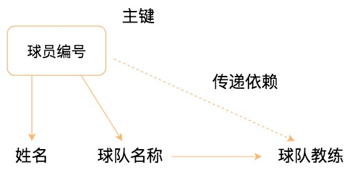

你能看到球员编号决定了球队名称，同时球队名称决定了球队主教练，非主属性球队主教练就会传递依赖于球员编号，因此不符合 3NF 的要求。

如果要达到 3NF 的要求，需要把数据表拆成下面这样：

球员表的属性包括球员编号、姓名和球队名称；球队表的属性包括球队名称、球队主教练。

我再总结一下，1NF 需要保证表中每个属性都保持原子性；2NF 需要保证表中的非主属性与候选键完全依赖；3NF 需要保证表中的非主属性与候选键不存在传递依赖。

#### 总结

我们今天讲解了数据表设计的三种范式。关系型数据库的设计都是基于关系模型的，在关系模型中存在着 4 种键，这些键的核心作用就是标识。

在这些概念的基础上，我又讲了 1NF，2NF 和 3NF。我们经常会与这三种范式打交道，利用它们建立冗余度小、结构合理的数据库。

有一点需要注意的是，这些范式只是提出了设计的标准，实际上设计数据表时，未必要符合这些原则。一方面是因为这些范式本身存在一些问题，可能会带来插入，更新，删除等的异常情况（这些会在下一讲举例说明），另一方面，它们也可能降低会查询的效率。这是为什么呢？因为范式等级越高，设计出来的数据表就越多，进行数据查询的时候就可能需要关联多张表，从而影响查询效率。


### 反范式设计：3NF有什么不足，为什么有时候需要反范式设计？

上一篇文章中，我们介绍了数据表设计的三种范式。作为数据库的设计人员，理解范式的设计以及反范式优化是非常有必要的。

为什么这么说呢？了解以下几个方面的内容之后你就明白了。

1. 3NF 有什么不足？除了 3NF，我们为什么还需要 BCNF？
2. 有了范式设计，为什么有时候需要进行反范式设计？
3. 反范式设计适用的场景是什么？又可能存在哪些问题？

#### BCNF（巴斯范式）

如果数据表的关系模式符合 3NF 的要求，就不存在问题了吗？我们来看下这张仓库管理关系 warehouse_keeper 表：

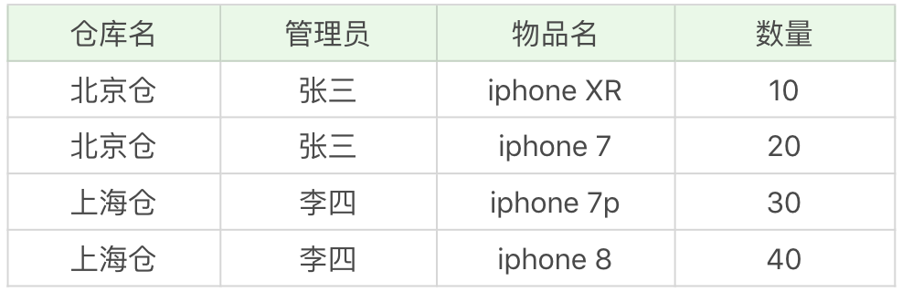


在这个数据表中，一个仓库只有一个管理员，同时一个管理员也只管理一个仓库。我们先来梳理下这些属性之间的依赖关系。

仓库名决定了管理员，管理员也决定了仓库名，同时（仓库名，物品名）的属性集合可以决定数量这个属性。

这样，我们就可以找到数据表的候选键是（管理员，物品名）和（仓库名，物品名），然后我们从候选键中选择一个作为主键，比如（仓库名，物品名）。

在这里，主属性是包含在任一候选键中的属性，也就是仓库名，管理员和物品名。非主属性是数量这个属性。

如何判断一张表的范式呢？我们需要根据范式的等级，从低到高来进行判断。

首先，数据表每个属性都是原子性的，符合 1NF 的要求；其次，数据表中非主属性”数量“都与候选键全部依赖，（仓库名，物品名）决定数量，（管理员，物品名）决定数量，因此，数据表符合 2NF 的要求；最后，数据表中的非主属性，不传递依赖于候选键。因此符合 3NF 的要求。

既然数据表已经符合了 3NF 的要求，是不是就不存在问题了呢？我们来看下下面的情况：

1. 增加一个仓库，但是还没有存放任何物品。根据数据表实体完整性的要求，主键不能有空值，因此会出现插入异常；
2. 如果仓库更换了管理员，我们就可能会修改数据表中的多条记录；
3. 如果仓库里的商品都卖空了，那么此时仓库名称和相应的管理员名称也会随之被删除。

你能看到，即便数据表符合 3NF 的要求，同样可能存在插入，更新和删除数据的异常情况。

这种情况下该怎么解决呢？

首先我们需要确认造成异常的原因：主属性仓库名对于候选键（管理员，物品名）是部分依赖的关系，这样就有可能导致上面的异常情况。人们在 3NF 的基础上进行了改进，提出了**BCNF，也叫做巴斯 - 科德范式，它在 3NF 的基础上消除了主属性对候选键的部分依赖或者传递依赖关系**。

根据 BCNF 的要求，我们需要把仓库管理关系 warehouse_keeper 表拆分成下面这样：

仓库表：（仓库名，管理员）

库存表：（仓库名，物品名，数量）

这样就不存在主属性对于候选键的部分依赖或传递依赖，上面数据表的设计就符合 BCNF。


#### 反范式设计

尽管围绕着数据表的设计有很多范式，但事实上，我们在设计数据表的时候却不一定要参照这些标准。

我们在之前已经了解了越高阶的范式得到的数据表越多，数据冗余度越低。但有时候，我们在设计数据表的时候，还需要为了性能和读取效率违反范式化的原则。反范式就是相对范式化而言的，换句话说，就是允许少量的冗余，通过空间来换时间。

如果我们想对查询效率进行优化，有时候反范式优化也是一种优化思路。

比如我们想要查询某个商品的前 1000 条评论，会涉及到两张表。

商品评论表 product_comment，对应的字段名称及含义如下：

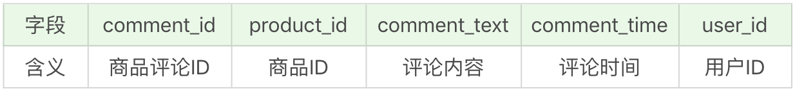

用户表 user，对应的字段名称及含义如下：


下面，我们就用这两张表模拟一下反范式优化。

##### 实验数据：模拟两张百万量级的数据表

为了更好地进行 SQL 优化实验，我们需要给用户表和商品评论表随机模拟出百万量级的数据。我们可以通过存储过程来实现模拟数据。

下面是给用户表随机生成 100 万用户的代码：

```sql
CREATE DEFINER=`root`@`localhost` PROCEDURE `insert_many_user`(IN start INT(10), IN max_num INT(10))
BEGIN
DECLARE i INT DEFAULT 0;
DECLARE date_start DATETIME DEFAULT ('2017-01-01 00:00:00');
DECLARE date_temp DATETIME;
SET date_temp = date_start;
SET autocommit=0;
REPEAT
SET i=i+1;
SET date_temp = date_add(date_temp, interval RAND()*60 second);
INSERT INTO user(user_id, user_name, create_time)
VALUES((start+i), CONCAT('user_',i), date_temp);
UNTIL i = max_num
END REPEAT;
COMMIT;
END
```

我用 date_start 变量来定义初始的注册时间，时间为 2017 年 1 月 1 日 0 点 0 分 0 秒，然后用 date_temp 变量计算每个用户的注册时间，新的注册用户与上一个用户注册的时间间隔为 60 秒内的随机值。然后使用 REPEAT … UNTIL … END REPEAT 循环，对 max_num 个用户的数据进行计算。在循环前，我们将 autocommit 设置为 0，这样等计算完成再统一插入，执行效率更高。

然后我们来运行 call insert_many_user(10000, 1000000); 调用存储过程。这里需要通过 start 和 max_num 两个参数对初始的 user_id 和要创建的用户数量进行设置。运行结果：


你能看到在 MySQL 里，创建 100 万的用户数据用时 1 分 37 秒。

接着我们再来给商品评论表 product_comment 随机生成 100 万条商品评论。这里我们设置为给某一款商品评论，比如 product_id=10001。评论的内容为随机的 20 个字母。以下是创建随机的 100 万条商品评论的存储过程：

```sql
CREATE DEFINER=`root`@`localhost` PROCEDURE `insert_many_product_comments`(IN START INT(10), IN max_num INT(10))
BEGIN
DECLARE i INT DEFAULT 0;
DECLARE date_start DATETIME DEFAULT ('2018-01-01 00:00:00');
DECLARE date_temp DATETIME;
DECLARE comment_text VARCHAR(25);
DECLARE user_id INT;
SET date_temp = date_start;
SET autocommit=0;
REPEAT
SET i=i+1;
SET date_temp = date_add(date_temp, INTERVAL RAND()*60 SECOND);
SET comment_text = substr(MD5(RAND()),1, 20);
SET user_id = FLOOR(RAND()*1000000);
INSERT INTO product_comment(comment_id, product_id, comment_text, comment_time, user_id)
VALUES((START+i), 10001, comment_text, date_temp, user_id);
UNTIL i = max_num
END REPEAT;
COMMIT;
END
```

同样的，我用 date_start 变量来定义初始的评论时间。这里新的评论时间与上一个评论的时间间隔还是 60 秒内的随机值，商品评论表中的 user_id 为随机值。我们使用 REPEAT … UNTIL … END REPEAT 循环，来对 max_num 个商品评论的数据进行计算。

然后调用存储过程，运行结果如下：


MySQL 一共花了 2 分 7 秒完成了商品评论数据的创建。


##### 反范式优化实验对比

如果我们想要查询某个商品 ID，比如 10001 的前 1000 条评论，需要写成下面这样

```sql
SELECT p.comment_text, p.comment_time, u.user_name FROM product_comment AS p 
LEFT JOIN user AS u 
ON p.user_id = u.user_id 
WHERE p.product_id = 10001 
ORDER BY p.comment_id DESC LIMIT 1000
```

运行结果（1000 条数据行）：


运行时长为 0.395 秒，查询效率并不高。

这是因为在实际生活中，我们在显示商品评论的时候，通常会显示这个用户的昵称，而不是用户 ID，因此我们还需要关联 product_comment 和 user 这两张表来进行查询。当表数据量不大的时候，查询效率还好，但如果表数据量都超过了百万量级，查询效率就会变低。这是因为查询会在 product_comment 表和 user 表这两个表上进行聚集索引扫描，然后再嵌套循环，这样一来查询所耗费的时间就有几百毫秒甚至更多。对于网站的响应来说，这已经很慢了，用户体验会非常差。

如果我们想要提升查询的效率，可以允许适当的数据冗余，也就是在商品评论表中增加用户昵称字段，在 product_comment 数据表的基础上增加 user_name 字段，就得到了 product_comment2 数据表。

你可以在[百度网盘](https://pan.baidu.com/s/104t0vIlrA4nypu_PZIXG0w)中下载这三张数据表 product_comment、product_comment2 和 user 表，密码为 n3l8。

这样一来，只需单表查询就可以得到数据集结果：

```sql
SELECT comment_text, comment_time, user_name FROM product_comment2 WHERE product_id = 10001 ORDER BY comment_id DESC LIMIT 1000

```

运行结果（1000 条数据）：

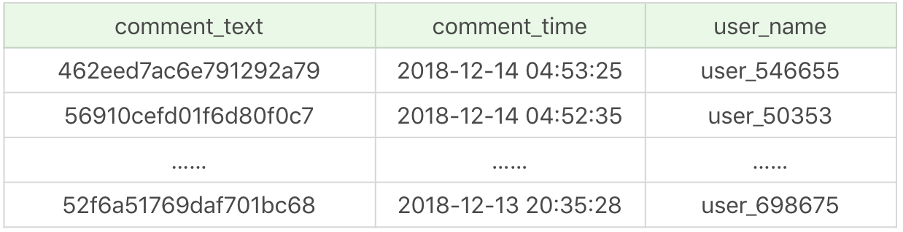

优化之后只需要扫描一次聚集索引即可，运行时间为 0.039 秒，查询时间是之前的 1/10。 你能看到，在数据量大的情况下，查询效率会有显著的提升。

#### 反范式存在的问题 & 适用场景

从上面的例子中可以看出，反范式可以通过空间换时间，提升查询的效率，但是反范式也会带来一些新问题。

在数据量小的情况下，反范式不能体现性能的优势，可能还会让数据库的设计更加复杂。比如采用存储过程来支持数据的更新、删除等额外操作，很容易增加系统的维护成本。

比如用户每次更改昵称的时候，都需要执行存储过程来更新，如果昵称更改频繁，会非常消耗系统资源。

那么反范式优化适用于哪些场景呢？

在现实生活中，我们经常需要一些冗余信息，比如订单中的收货人信息，包括姓名、电话和地址等。每次发生的订单收货信息都属于历史快照，需要进行保存，但用户可以随时修改自己的信息，这时保存这些冗余信息是非常有必要的。

当冗余信息有价值或者能大幅度提高查询效率的时候，我们就可以采取反范式的优化。

此外反范式优化也常用在数据仓库的设计中，因为数据仓库通常存储历史数据，对增删改的实时性要求不强，对历史数据的分析需求强。这时适当允许数据的冗余度，更方便进行数据分析。

我简单总结下数据仓库和数据库在使用上的区别：

1. 数据库设计的目的在于捕获数据，而数据仓库设计的目的在于分析数据；
2. 数据库对数据的增删改实时性要求强，需要存储在线的用户数据，而数据仓库存储的一般是历史数据；
3. 数据库设计需要尽量避免冗余，但为了提高查询效率也允许一定的冗余度，而数据仓库在设计上更偏向采用反范式设计。

#### 总结

今天我们讲了 BCNF，它是基于 3NF 进行的改进。你能看到设计范式越高阶，数据表就会越精细，数据的冗余度也就越少，在一定程度上可以让数据库在内部关联上更好地组织数据。但有时候我们也需要采用反范进行优化，通过空间来换取时间。

范式本身没有优劣之分，只有适用场景不同。没有完美的设计，只有合适的设计，我们在数据表的设计中，还需要根据需求将范式和反范式混合使用。


### 索引的概览：用还是不用索引，这是一个问题

提起优化 SQL，你可能会把它理解为优化索引。简单来说这也不算错，索引在 SQL 优化中占了很大的比重。索引用得好，可以将 SQL 查询的效率提升 10 倍甚至更多。但索引是万能的吗？既然索引可以提升效率，只要创建索引不就好了吗？实际上，在有些情况下，创建索引反而会降低效率。

今天我们就来讲一下索引，索引涉及到的内容比较多，今天先来对索引有个整体的认知。

1. 什么情况下创建索引，什么时候不需要索引？
2. 索引的种类有哪些？

索引的原理很好理解，在今天的内容里，我依然会通过 SQL 查询实验验证今天的内容，帮你进一步加深理解。


#### 索引是万能的吗？

首先我们需要了解什么是索引。数据库中的索引，就好比一本书的目录，它可以帮我们快速进行特定值的定位与查找，从而加快数据查询的效率。

索引就是帮助数据库管理系统高效获取数据的数据结构。

如果我们不适用索引，就必须从第 1 条记录开始扫描，直到把所有的数据表都扫描完，才能找到想要的数据。既然如此，如果我们想要快速查找数据，就只需要创建更多的索引就好了呢？

其实**索引不是万能的，在有些情况下使用索引反而会让效率变低**。

索引的价值是帮我们从海量数据中找到想要的数据，如果数据量少，那么是否使用索引对结果的影响并不大。

在数据表中的数据行数比较少的情况下，比如不到 1000 行，是不需要创建索引的。另外，当数据重复度大，比如高于 10% 的时候，也不需要对这个字段使用索引。我之前讲到过，如果是性别这个字段，就不需要对它创建索引。这是为什么呢？如果你想要在 100 万行数据中查找其中的 50 万行（比如性别为男的数据），一旦创建了索引，你需要先访问 50 万次索引，然后再访问 50 万次数据表，这样加起来的开销比不使用索引可能还要大。

当然，空口无凭，我们来做两个实验，更直观地了解索引。

#### 实验 1：数据行数少的情况下，索引效率如何

我在[百度网盘](https://pan.baidu.com/s/1X47UAx6EWasYLLU91RYHKQ)上提供了数据表，heros_without_index.sql 和 heros_with_index.sql，提取码为 wxho。

在第一个数据表中，除了自增的 id 以外没有建立额外的索引。第二张数据表中，我对 name 字段建立了唯一索引。

heros 数据表一共有 69 个英雄，数据量很少。当我们对 name 进行条件查询的时候，我们观察一下创建索引前后的效率。

```sql
SELECT id, name, hp_max, mp_max FROM heros_without_index WHERE name = '刘禅'

```

运行结果（1 条数据，运行时间 0.072s）：

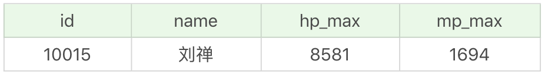

我对 name 字段建立索引后，再进行查询：

```sql
SELECT id, name, hp_max, mp_max FROM heros_with_index WHERE name = '刘禅'
```

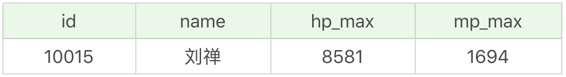

你能看到运行结果相同，但是创建了 name 字段索引的效率比没有创建索引时效率更低。在数据量不大的情况下，索引就发挥不出作用了。

#### 实验 2：性别（男或女）字段真的不应该创建索引吗？

如果一个字段的取值少，比如性别这个字段，通常是不需要创建索引的。那么有没有特殊的情况呢？

下面我们来看一个例子，假设有一个女儿国，人口总数为 100 万人，男性只有 10 个人，也就是占总人口的 10 万分之 1。

女儿国的人口数据表 user_gender 见百度网盘中的 user_gender.sql。其中数据表中的 user_gender 字段取值为 0 或 1，0 代表女性，1 代表男性。

如果我们要筛选出这个国家中的男性，可以使用：

```sql
SELECT * FROM user_gender WHERE user_gender = 1
```

运行结果（10 条数据，运行时间 0.696s）：


你能看到在未创建索引的情况下

的效率并不高。如果我们针对 user_gender 字段创建索引呢？

```sql

SELECT * FROM user_gender WHERE user_gender = 1
```

同样是 10 条数据，运行结果相同，时间却缩短到了 0.052s，大幅提升了查询的效率。

其实通过这两个实验你也能看出来，索引的价值是帮你快速定位。如果想要定位的数据有很多，那么索引就失去了它的使用价值，比如通常情况下的性别字段。不过有时候，我们还要考虑这个字段中的数值分布的情况，在实验 2 中，性别字段的数值分布非常特殊，男性的比例非常少。

我们不仅要看字段中的数值个数，还要根据数值的分布情况来考虑是否需要创建索引。


#### 索引的种类有哪些？

虽然使用索引的本质目的是帮我们快速定位想要查找的数据，但实际上，索引有很多种类。

从功能逻辑上说，索引主要有四种，分别是普通索引、唯一索引、主键索引和全文索引。

普通索引是基础的索引，没有任何约束，主要用于提高查询效率。唯一索引就是在普通索引的基础上增加了数据唯一性的约束，在一张数据表里可以有多个唯一索引。主键索引在唯一索引的基础上增加了不为空的约束，也就是 NOT NULL+UNIQUE，一张表里最多只有一个主键索引。全文索引用的不多，MySQL 自带的全文索引只支持英文。我们通常可以采用专门的全文搜索引擎，比如 ES(ElasticSearch) 和 Solr。

其实前三种索引（普通索引、唯一索引和主键索引）都是一类索引，只不过对数据的约束性逐渐提升。在一张数据表中只能有一个主键索引，这是由主键索引的物理实现方式决定的，因为数据存储在文件中只能按照一种顺序进行存储。但可以有多个普通索引或者多个唯一索引。

按照物理实现方式，索引可以分为 2 种：聚集索引和非聚集索引。我们也把非聚集索引称为二级索引或者辅助索引。

聚集索引可以按照主键来排序存储数据，这样在查找行的时候非常有效。举个例子，如果是一本汉语字典，我们想要查找“数”这个字，直接在书中找汉语拼音的位置即可，也就是拼音“shu”。这样找到了索引的位置，在它后面就是我们想要找的数据行。

非聚集索引又是什么呢？

在数据库系统会有单独的存储空间存放非聚集索引，这些索引项是按照顺序存储的，但索引项指向的内容是随机存储的。也就是说系统会进行两次查找，第一次先找到索引，第二次找到索引对应的位置取出数据行。非聚集索引不会把索引指向的内容像聚集索引一样直接放到索引的后面，而是维护单独的索引表（只维护索引，不维护索引指向的数据），为数据检索提供方便。我们还以汉语字典为例，如果想要查找“数”字，那么按照部首查找的方式，先找到“数”字的偏旁部首，然后这个目录会告诉我们“数”字存放到第多少页，我们再去指定的页码找这个字。

聚集索引指表中数据行按索引的排序方式进行存储，对查找行很有效。只有当表包含聚集索引时，表内的数据行才会按找索引列的值在磁盘上进行物理排序和存储。每一个表只能有一个聚集索引，因为数据行本身只能按一个顺序存储。

聚集索引与非聚集索引的原理不同，在使用上也有一些区别：

1. 聚集索引的叶子节点存储的就是我们的数据记录，非聚集索引的叶子节点存储的是数据位置。非聚集索引不会影响数据表的物理存储顺序。
2. 一个表只能有一个聚集索引，因为只能有一种排序存储的方式，但可以有多个非聚集索引，也就是多个索引目录提供数据检索。
3. 使用聚集索引的时候，数据的查询效率高，但如果对数据进行插入，删除，更新等操作，效率会比非聚集索引低。


#### 实验 3：使用聚集索引和非聚集索引的查询效率

还是针对刚才的 user_gender 数据表，我们来看下使用聚集索引和非聚集索引的查询效率有什么区别。在 user_gender 表中，我设置了 user_id 为主键，也就是聚集索引的字段是 user_id。这里我们查询下 user_id=90001 的用户信息：

```sql
SELECT user_id, user_name, user_gender FROM user_gender WHERE user_id = 900001
```

运行结果（1 条数据，运行时间 0.043s）：


我们再直接对 user_name 字段进行条件查询，此时 user_name 字段没有创建索引：

```sql
SELECT user_id, user_name, user_gender FROM user_gender WHERE user_name = 'student_890001'
```

运行结果（1 条数据，运行时间 0.961s）：

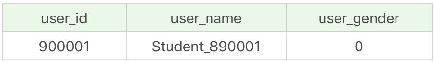

你能看出对没有建立索引的字段进行条件查询，查询效率明显降低了。

然后我们对 user_name 字段创建普通索引，进行 SQL 查询：

```sql
SELECT user_id, user_name, user_gender FROM user_gender WHERE user_name = 'student_890001'
```

运行结果（1 条数据，运行时间 0.050s）：

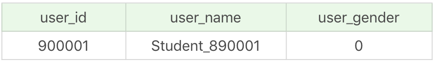

通过对这 3 次 SQL 查询结果的对比，我们可以总结出以下两点内容：

1. 对 WHERE 子句的字段建立索引，可以大幅提升查询效率。
2. 采用聚集索引进行数据查询，比使用非聚集索引的查询效率略高。如果查询次数比较多，还是尽量使用主键索引进行数据查询。

除了业务逻辑和物理实现方式，索引还可以按照字段个数进行划分，分成单一索引和联合索引。

索引列为一列时为单一索引；多个列组合在一起创建的索引叫做联合索引。

创建联合索引时，我们需要注意创建时的顺序问题，因为联合索引 (x, y, z) 和 (z, y, x) 在使用的时候效率可能会存在差别。

这里需要说明的是联合索引存在最左匹配原则，也就是按照最左优先的方式进行索引的匹配。比如刚才举例的 (x, y, z)，如果查询条件是 WHERE x=1 AND y=2 AND z=3，就可以匹配上联合索引；如果查询条件是 WHERE y=2，就无法匹配上联合索引。


#### 实验 4：联合索引的最左原则

还是针对user_gender 数据表，我们把 user_id 和 user_name 字段设置为联合主键，然后看下 SQL 查询效率有什么区别。

```sql
SELECT user_id, user_name, user_gender FROM user_gender WHERE user_id = 900001 AND user_name = 'student_890001'
```

运行结果（1 条数据，运行时间 0.046s）：

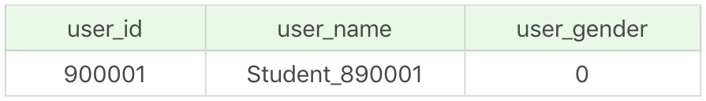


```sql
SELECT user_id, user_name, user_gender FROM user_gender WHERE user_id = 900001

```

运行结果（1 条数据，运行时间 0.046s）：


我们再来看下普通的条件查询是什么样子的：

```sql
SELECT user_id, user_name, user_gender FROM user_gender WHERE user_name = 'student_890001'
```

运行结果（1 条数据，运行时间 0.943s）：


你能看到当我们使用了联合索引 (user_id, user_name) 的时候，在 WHERE 子句中对联合索引中的字段 user_id 和 user_name 进行条件查询，或者只对 user_id 进行查询，效率基本上是一样的。当我们对 user_name 进行条件查询时，效率就会降低很多，这是因为根据联合索引的最左原则，user_id 在 user_name 的左侧，如果没有使用 user_id，而是直接使用 user_name 进行条件查询，联合索引就会失效。

#### 总结

使用索引可以帮助我们从海量的数据中快速定位想要查找的数据，不过索引也存在一些不足，比如占用存储空间、降低数据库写操作的性能，如果有多个索引还会增加索引索引选择的时间。当我们使用索引时，需要平衡索引的利（提升查询效率）和弊（维护索引所需的代价）。

在实际工作中，我们还需要基于需求和数据本身的分布情况来确定是否使用索引，尽管索引不是万能的，但数据量大的时候不使用索引是不可想象的，毕竟索引的本质，是帮助我们提升数据检索的效率。


### 索引的原理：我们为什么用B+树来做索引？

上节课我讲到了索引的作用，是否需要建立索引，以及建立什么样的索引，需要我们根据实际情况进行选择。我之前说过，索引其实就是一种数据结构，那么今天我们就来看下，索引的数据结构究竟是怎样的？对索引底层的数据结构有了更深入的了解后，就会更了解索引的使用原则。

今天的文章内容主要包括下面几个部分：

1. 为什么索引要存放到硬盘上？如何评价索引的数据结构设计的好坏？
2. 使用平衡二叉树作为索引的数据结构有哪些不足？
3. B 树和 B+ 树的结构是怎样的？为什么我们常用 B+ 树作为索引的数据结构？

#### 如何评价索引的数据结构设计好坏

数据库服务器有两种存储介质，分别为硬盘和内存。内存属于临时存储，容量有限，而且当发生意外时（比如断电或者发生故障重启）会造成数据丢失；硬盘相当于永久存储介质，这也是为什么我们需要把数据保存到硬盘上。

虽然内存的读取速度很快，但我们还是需要将索引存放到硬盘上，这样的话，当我们在硬盘上进行查询时，也就产生了硬盘的 I/O 操作。相比于内存的存取来说，硬盘的 I/O 存取消耗的时间要高很多。我们通过索引来查找某行数据的时候，需要计算产生的磁盘 I/O 次数，当磁盘 I/O 次数越多，所消耗的时间也就越大。如果我们能让索引的数据结构尽量减少硬盘的 I/O 操作，所消耗的时间也就越小。

#### 二叉树的局限性

二分查找法是一种高效的数据检索方式，时间复杂度为 O(log2n)，是不是采用二叉树就适合作为索引的数据结构呢？

我们先来看下最基础的二叉搜索树（Binary Search Tree），搜索某个节点和插入节点的规则一样，我们假设搜索插入的数值为 key：

1. 如果 key 大于根节点，则在右子树中进行查找；
2. 如果 key 小于根节点，则在左子树中进行查找；
3. 如果 key 等于根节点，也就是找到了这个节点，返回根节点即可。

举个例子，我们对数列（34，22，89，5，23，77，91）创造出来的二分查找树如下图所示：


但是存在特殊的情况，就是有时候二叉树的深度非常大。比如我们给出的数据顺序是 (5, 22, 23, 34, 77, 89, 91)，创造出来的二分搜索树如下图所示：


你能看出来第一个树的深度是 3，也就是说最多只需 3 次比较，就可以找到节点，而第二个树的深度是 7，最多需要 7 次比较才能找到节点。

第二棵树也属于二分查找树，但是性能上已经退化成了一条链表，查找数据的时间复杂度变成了 O(n)。为了解决这个问题，人们提出了平衡二叉搜索树（AVL 树），它在二分搜索树的基础上增加了约束，每个节点的左子树和右子树的高度差不能超过 1，也就是说节点的左子树和右子树仍然为平衡二叉树。

这里说一下，常见的平衡二叉树有很多种，包括了平衡二叉搜索树、红黑树、数堆、伸展树。平衡二叉搜索树是最早提出来的自平衡二叉搜索树，当我们提到平衡二叉树时一般指的就是平衡二叉搜索树。事实上，第一棵树就属于平衡二叉搜索树，搜索时间复杂度就是 O(log2n)。

我刚才提到过，数据查询的时间主要依赖于磁盘 I/O 的次数，如果我们采用二叉树的形式，即使通过平衡二叉搜索树进行了改进，树的深度也是 O(log2n)，当 n 比较大时，深度也是比较高的，比如下图的情况：


每访问一次节点就需要进行一次磁盘 I/O 操作，对于上面的树来说，我们需要进行 5 次 I/O 操作。虽然平衡二叉树比较的效率高，但是树的深度也同样高，这就意味着磁盘 I/O 操作次数多，会影响整体数据查询的效率。

针对同样的数据，如果我们把二叉树改成 M 叉树（M>2）呢？当 M=3 时，同样的 31 个节点可以由下面的三叉树来进行存储：

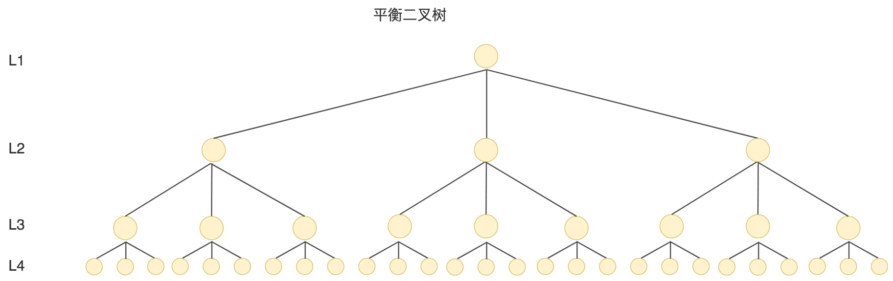


你能看到此时树的高度降低了，当数据量 N 大的时候，以及树的分叉数 M 大的时候，M 叉树的高度会远小于二叉树的高度。

#### 什么是 B 树

如果用二叉树作为索引的实现结构，会让树变得很高，增加硬盘的 I/O 次数，影响数据查询的时间。因此一个节点就不能只有 2 个子节点，而应该允许有 M 个子节点 (M>2)。

B 树的出现就是为了解决这个问题，B 树的英文是 Balance Tree，也就是平衡的多路搜索树，它的高度远小于平衡二叉树的高度。在文件系统和数据库系统中的索引结构经常采用 B 树来实现。

B 树的结构如下图所示：


B 树作为平衡的多路搜索树，它的每一个节点最多可以包括 M 个子节点，M 称为 B 树的阶。同时你能看到，每个磁盘块中包括了关键字和子节点的指针。如果一个磁盘块中包括了 x 个关键字，那么指针数就是 x+1。对于一个 100 阶的 B 树来说，如果有 3 层的话最多可以存储约 100 万的索引数据。对于大量的索引数据来说，采用 B 树的结构是非常适合的，因为树的高度要远小于二叉树的高度。

一个 M 阶的 B 树（M>2）有以下的特性：

1. 根节点的儿子数的范围是 [2,M]。
2. 每个中间节点包含 k-1 个关键字和 k 个孩子，孩子的数量 = 关键字的数量 +1，k 的取值范围为 [ceil(M/2), M]。
3. 叶子节点包括 k-1 个关键字（叶子节点没有孩子），k 的取值范围为 [ceil(M/2), M]。
4. 假设中间节点节点的关键字为：Key[1], Key[2], …, Key[k-1]，且关键字按照升序排序，即 Key[i]<Key[i+1]。此时 k-1 个关键字相当于划分了 k 个范围，也就是对应着 k 个指针，即为：P[1], P[2], …, P[k]，其中 P[1] 指向关键字小于 Key[1] 的子树，P[i] 指向关键字属于 (Key[i-1], Key[i]) 的子树，P[k] 指向关键字大于 Key[k-1] 的子树。
5. 所有叶子节点位于同一层。

上面那张图所表示的 B 树就是一棵 3 阶的 B 树。我们可以看下磁盘块 2，里面的关键字为（8，12），它有 3 个孩子 (3，5)，(9，10) 和 (13，15)，你能看到 (3，5) 小于 8，(9，10) 在 8 和 12 之间，而 (13，15) 大于 12，刚好符合刚才我们给出的特征。

然后我们来看下如何用 B 树进行查找。假设我们想要查找的关键字是 9，那么步骤可以分为以下几步：

1. 我们与根节点的关键字 (17，35）进行比较，9 小于 17 那么得到指针 P1；
2. 按照指针 P1 找到磁盘块 2，关键字为（8，12），因为 9 在 8 和 12 之间，所以我们得到指针 P2；
3. 按照指针 P2 找到磁盘块 6，关键字为（9，10），然后我们找到了关键字 9。

你能看出来在 B 树的搜索过程中，我们比较的次数并不少，但如果把数据读取出来然后在内存中进行比较，这个时间就是可以忽略不计的。而读取磁盘块本身需要进行 I/O 操作，消耗的时间比在内存中进行比较所需要的时间要多，是数据查找用时的重要因素，B 树相比于平衡二叉树来说磁盘 I/O 操作要少，在数据查询中比平衡二叉树效率要高。

#### 什么是 B+ 树

B+ 树基于 B 树做出了改进，主流的 DBMS 都支持 B+ 树的索引方式，比如 MySQL。B+ 树和 B 树的差异在于以下几点：

1. 有 k 个孩子的节点就有 k 个关键字。也就是孩子数量 = 关键字数，而 B 树中，孩子数量 = 关键字数 +1。
2. 非叶子节点的关键字也会同时存在在子节点中，并且是在子节点中所有关键字的最大（或最小）。
3. 非叶子节点仅用于索引，不保存数据记录，跟记录有关的信息都放在叶子节点中。而 B 树中，非叶子节点既保存索引，也保存数据记录。
4. 所有关键字都在叶子节点出现，叶子节点构成一个有序链表，而且叶子节点本身按照关键字的大小从小到大顺序链接。


比如，我们想要查找关键字 16，B+ 树会自顶向下逐层进行查找：

1. 与根节点的关键字 (1，18，35) 进行比较，16 在 1 和 18 之间，得到指针 P1（指向磁盘块 2）
2. 找到磁盘块 2，关键字为（1，8，14），因为 16 大于 14，所以得到指针 P3（指向磁盘块 7）
3. 找到磁盘块 7，关键字为（14，16，17），然后我们找到了关键字 16，所以可以找到关键字 16 所对应的数据。

整个过程一共进行了 3 次 I/O 操作，看起来 B+ 树和 B 树的查询过程差不多，但是 B+ 树和 B 树有个根本的差异在于，B+ 树的中间节点并不直接存储数据。这样的好处都有什么呢？

首先，B+ 树查询效率更稳定。因为 B+ 树每次只有访问到叶子节点才能找到对应的数据，而在 B 树中，非叶子节点也会存储数据，这样就会造成查询效率不稳定的情况，有时候访问到了非叶子节点就可以找到关键字，而有时需要访问到叶子节点才能找到关键字。

其次，B+ 树的查询效率更高，这是因为通常 B+ 树比 B 树更矮胖（阶数更大，深度更低），查询所需要的磁盘 I/O 也会更少。同样的磁盘页大小，B+ 树可以存储更多的节点关键字。

不仅是对单个关键字的查询上，在查询范围上，B+ 树的效率也比 B 树高。这是因为所有关键字都出现在 B+ 树的叶子节点中，并通过有序链表进行了链接。而在 B 树中则需要通过中序遍历才能完成查询范围的查找，效率要低很多。

#### 总结

磁盘的 I/O 操作次数对索引的使用效率至关重要。虽然传统的二叉树数据结构查找数据的效率高，但很容易增加磁盘 I/O 操作的次数，影响索引使用的效率。因此在构造索引的时候，我们更倾向于采用“矮胖”的数据结构。

B 树和 B+ 树都可以作为索引的数据结构，在 MySQL 中采用的是 B+ 树，B+ 树在查询性能上更稳定，在磁盘页大小相同的情况下，树的构造更加矮胖，所需要进行的磁盘 I/O 次数更少，更适合进行关键字的范围查询。


### Hash索引的底层原理是什么？

我们上节课讲解了 B+ 树的原理，今天我们来学习下 Hash 的原理和使用。Hash 本身是一个函数，又被称为散列函数，它可以帮助我们大幅提升检索数据的效率。打个比方，Hash 就好像一个智能前台，你只要告诉它想要查找的人的姓名，它就会告诉你那个人坐在哪个位置，只需要一次交互就可以完成查找，效率非常高。大名鼎鼎的 MD5 就是 Hash 函数的一种。

Hash 算法是通过某种确定性的算法（比如 MD5、SHA1、SHA2、SHA3）将输入转变为输出。相同的输入永远可以得到相同的输出，假设输入内容有微小偏差，在输出中通常会有不同的结果。如果你想要验证两个文件是否相同，那么你不需要把两份文件直接拿来比对，只需要让对方把 Hash 函数计算得到的结果告诉你即可，然后在本地同样对文件进行 Hash 函数的运算，最后通过比较这两个 Hash 函数的结果是否相同，就可以知道这两个文件是否相同。

Hash 可以高效地帮我们完成验证的工作，它在数据库中有广泛的应用。今天的课程主要包括下面几个部分：

1. 动手写程序统计一下 Hash 检索的效率。
2. 了解 MySQL 中的 Hash 索引，理解使用它的优点和不足。
3. Hash 索引和 B+ 树索引的区别以及使用场景。

#### 动手统计 Hash 检索效率

我们知道 Python 的数据结构中有数组和字典两种，其中数组检索数据类似于全表扫描，需要对整个数组的内容进行检索；而字典是由 Hash 表实现的，存储的是 key-value 值，对于数据检索来说效率非常快。

对于 Hash 的检索效率，我们来个更直观的认知。下面我们分别看一下采用数组检索数据和采用字典（Hash）检索数据的效率到底有怎样的差别。

实验 1：在数组中添加 10000 个元素，然后分别对这 10000 个元素进行检索，最后统计检索的时间。

代码如下：

```python
import time
# 插入数据
result = []
for i in range(10000):
       result.append(i)
# 检索数据
time_start=time.time()
for i in range(10000):
       temp = result.index(i)
time_end=time.time()
print('检索时间', time_end-time_start)
```

运行结果：

检索时间为 1.2436728477478027 秒

实验 2：采用 Hash 表的形式存储数据，即在 Python 中采用字典方式添加 10000 个元素，然后检索这 10000 个数据，最后再统计一下时间。代码如下：

```python
import time
# 插入数据
result = {}
for i in range(1000000):
       result[i] = i
# 检索数据
time_start=time.time()
for i in range(10000):
       temp = result[i]
time_end=time.time()
print('检索时间：',time_end-time_start)
```

运行结果：

检索时间为 0.0019941329956054688 秒。

你能看到 Hash 方式检索差不多用了 2 毫秒的时间，检索效率提升得非常明显。这是因为 Hash 只需要一步就可以找到对应的取值，算法复杂度为 O(1)，而数组检索数据的算法复杂度为 O(n)。

#### MySQL 中的 Hash 索引

采用 Hash 进行检索效率非常高，基本上一次检索就可以找到数据，而 B+ 树需要自顶向下依次查找，多次访问节点才能找到数据，中间需要多次 I/O 操作，从效率来说 Hash 比 B+ 树更快。

我们来看下 Hash 索引的示意图：

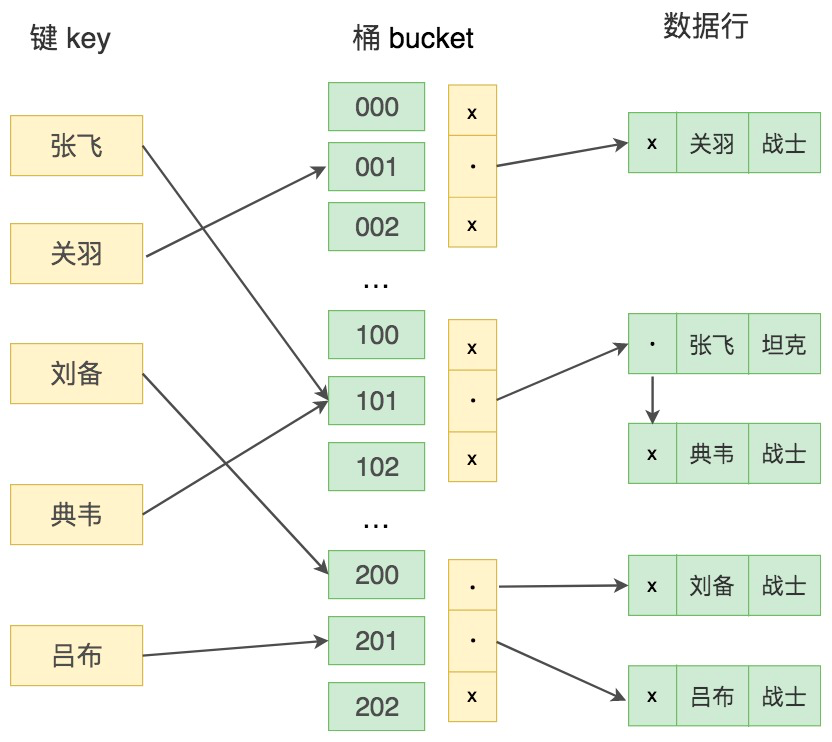

键值 key 通过 Hash 映射找到桶 bucket。在这里桶（bucket）指的是一个能存储一条或多条记录的存储单位。一个桶的结构包含了一个内存指针数组，桶中的每行数据都会指向下一行，形成链表结构，当遇到 Hash 冲突时，会在桶中进行键值的查找。

那么什么是 Hash 冲突呢？

如果桶的空间小于输入的空间，不同的输入可能会映射到同一个桶中，这时就会产生 Hash 冲突，如果 Hash 冲突的量很大，就会影响读取的性能。

通常 Hash 值的字节数比较少，简单的 4 个字节就够了。在 Hash 值相同的情况下，就会进一步比较桶（Bucket）中的键值，从而找到最终的数据行。

Hash 值的字节数多的话可以是 16 位、32 位等，比如采用 MD5 函数就可以得到一个 16 位或者 32 位的数值，32 位的 MD5 已经足够安全，重复率非常低。

我们模拟一下 Hash 索引。关键字如下所示，每个字母的内部编码为字母的序号，比如 A 为 01，Y 为 25。我们统计内部编码平方的第 8-11 位（从前向后）作为 Hash 值：


#### Hash 索引与 B+ 树索引的区别

我们之前讲到过 B+ 树索引的结构，Hash 索引结构和 B+ 树的不同，因此在索引使用上也会有差别。

1. Hash 索引不能进行范围查询，而 B+ 树可以。这是因为 Hash 索引指向的数据是无序的，而 B+ 树的叶子节点是个有序的链表。
2. Hash 索引不支持联合索引的最左侧原则（即联合索引的部分索引无法使用），而 B+ 树可以。对于联合索引来说，Hash 索引在计算 Hash 值的时候是将索引键合并后再一起计算 Hash 值，所以不会针对每个索引单独计算 Hash 值。因此如果用到联合索引的一个或者几个索引时，联合索引无法被利用。
3. Hash 索引不支持 ORDER BY 排序，因为 Hash 索引指向的数据是无序的，因此无法起到排序优化的作用，而 B+ 树索引数据是有序的，可以起到对该字段 ORDER BY 排序优化的作用。同理，我们也无法用 Hash 索引进行模糊查询，而 B+ 树使用 LIKE 进行模糊查询的时候，LIKE 后面前模糊查询（比如 % 开头）的话就可以起到优化作用。

对于等值查询来说，通常 Hash 索引的效率更高，不过也存在一种情况，就是索引列的重复值如果很多，效率就会降低。这是因为遇到 Hash 冲突时，需要遍历桶中的行指针来进行比较，找到查询的关键字，非常耗时。所以，Hash 索引通常不会用到重复值多的列上，比如列为性别、年龄的情况等。

#### 总结

我今天讲了 Hash 索引的底层原理，你能看到 Hash 索引存在着很多限制，相比之下在数据库中 B+ 树索引的使用面会更广，不过也有一些场景采用 Hash 索引效率更高，比如在键值型（Key-Value）数据库中，Redis 存储的核心就是 Hash 表。

另外 MySQL 中的 Memory 存储引擎支持 Hash 存储，如果我们需要用到查询的临时表时，就可以选择 Memory 存储引擎，把某个字段设置为 Hash 索引，比如字符串类型的字段，进行 Hash 计算之后长度可以缩短到几个字节。当字段的重复度低，而且经常需要进行等值查询的时候，采用 Hash 索引是个不错的选择。

另外 MySQL 的 InnoDB 存储引擎还有个“自适应 Hash 索引”的功能，就是当某个索引值使用非常频繁的时候，它会在 B+ 树索引的基础上再创建一个 Hash 索引，这样让 B+ 树也具备了 Hash 索引的优点。


### 索引的使用原则：如何通过索引让SQL查询效率最大化？

我之前讲了索引的使用和它的底层原理，今天我来讲一讲索引的使用原则。既然我们的目标是提升 SQL 的查询效率，那么该如何通过索引让效率最大化呢？

今天的课程主要包括下面几个部分：

1. 什么情况下使用索引？当我们进行数据表查询的时候，都有哪些特征需要我们创建索引？
2. 索引不是万能的，索引设计的不合理可能会阻碍数据库和业务处理的性能。那么什么情况下不需要创建索引？
3. 创建了索引不一定代表一定用的上，甚至在有些情况下索引会失效。那些情况下，索引会失效呢？又改如何避免这一情况？

#### 创建索引有哪些规律？

创建索引有一定的规律。当这些规律出现的时候，我们就可以通过创建索引提升查询效率，下面我们来看看什么情况下可以创建索引：

##### 1、字段的数值有唯一性的限制，比如用户名

索引本身可以起到约束的作用，比如唯一索引、主键索引都是可以起到唯一性约束的，因此在我们的数据表中，如果某个字段是唯一性的，就可以直接创建唯一性索引，或者主键索引。

##### 2、频繁作为WHERE查询条件的字段，尤其在数据表打的情况下

在数据量大的情况下，某个字段在 SQL 查询的 WHERE 条件中经常被使用到，那么就需要给这个字段创建索引了。创建普通索引就可以大幅提升数据查询的效率。

我之前列举了 product_comment 数据表，这张数据表中一共有 100 万条数据，假设我们想要查询 user_id=785110 的用户对商品的评论。

如果我们没有对 user_id 字段创建索引，进行如下查询：

```sql
SELECT comment_id, product_id, comment_text, comment_time, user_id FROM product_comment WHERE user_id = 785110
```

运行结果：


运行时间为 0.699s，你能看到查询效率还是比较低的。当我们对 user_id 字段创建索引之后，运行时间为 0.047s，不到原来查询时间的 1/10，效率提升还是明显的。

##### 3、需要经常**GROUP BY 和 ORDER BY 的列**

索引就是让数据按照某种顺序进行存储或检索，因此当我们使用 GROUP BY 对数据进行分组查询，或者使用 ORDER BY 对数据进行排序的时候，就需要对分组或者排序的字段进行索引。

比如我们按照 user_id 对商品评论数据进行分组，显示不同的 user_id 和商品评论的数量，显示 100 个即可。

如果我们不对 user_id 创建索引，执行下面的 SQL 语句：

```sql
SELECT user_id, count(*) as num FROM product_comment group by user_id limit 100
```

运行结果（100 条记录，运行时间 1.666s）：


如果我们对 user_id 创建索引，再执行 SQL 语句：

```sql
SELECT user_id, count(*) as num FROM product_comment group by user_id limit 100

```

运行结果（100 条记录，运行时间 0.042s）：


你能看到当对 user_id 创建索引后，得到的结果中 user_id 字段的数值也是按照顺序展示的，运行时间却不到原来时间的 1/40，效率提升很明显。

同样，如果是 ORDER BY，也需要对字段创建索引。我们再来看下同时有 GROUP BY 和 ORDER BY 的情况。比如我们按照 user_id 进行评论分组，同时按照评论时间降序的方式进行排序，这时我们就需要同时进行 GROUP BY 和 ORDER BY，那么是不是需要单独创建 user_id 的索引和 comment_time 的索引呢？

当我们对 user_id 和 comment_time 分别创建索引，执行下面的 SQL 查询：

```sql
SELECT user_id, count(*) as num FROM product_comment group by user_id order by comment_time desc limit 100
```

运行结果（运行时间 >100s）：


实际上多个单列索引在多条件查询时只会生效一个索引（MySQL 会选择其中一个限制最严格的作为索引），所以在多条件联合查询的时候最好创建联合索引。在这个例子中，我们创建联合索引 (user_id, comment_time)，再来看下查询的时间，查询时间为 0.775s，效率提升了很多。如果我们创建联合索引的顺序为 (comment_time, user_id) 呢？运行时间为 1.990s，同样比两个单列索引要快，但是会比顺序为 (user_id, comment_time) 的索引要慢一些。这是因为在进行 SELECT 查询的时候，先进行 GROUP BY，再对数据进行 ORDER BY 的操作，所以按照这个联合索引的顺序效率是最高的。


##### **4.UPDATE、DELETE 的 WHERE 条件列，一般也需要创建索引**

我们刚才说的是数据检索的情况。那么当我们对某条数据进行 UPDATE 或者 DELETE 操作的时候，是否也需要对 WHERE 的条件列创建索引呢？

我们先看一下对数据进行 UPDATE 的情况。

如果我们想要把 comment_text 为 462eed7ac6e791292a79 对应的 product_id 修改为 10002，当我们没有对 comment_text 进行索引的时候，执行 SQL 语句：

```sql
UPDATE product_comment SET product_id = 10002 WHERE comment_text = '462eed7ac6e791292a79'
```

运行结果为 Affected rows: 1，运行时间为 1.173s。

```sql
你能看到效率不高，但如果我们对 comment_text 字段创建了索引，然后再把刚才那条记录更新回 product_id=10001，执行 SQL 语句：
```

运行结果为 Affected rows: 1，运行时间仅为 0.1110s。你能看到这个运行时间是之前的 1/10，效率有了大幅的提升。

如果我们对某条数据进行 DELETE，效率如何呢？

比如我们想删除 comment_text 为 462eed7ac6e791292a79 的数据。当我们没有对 comment_text 字段进行索引的时候，执行 SQL 语句：

```sql
DELETE FROM product_comment WHERE comment_text = '462eed7ac6e791292a79'
```

运行结果为 Affected rows: 1，运行时间为 1.027s，效率不高。

如果我们对 comment_text 创建了索引，再来执行这条 SQL 语句，运行时间为 0.032s，时间是原来的 1/32，效率有了大幅的提升。你能看到，对数据按照某个条件进行查询后再进行 UPDATE 或 DELETE 的操作，如果对 WHERE 字段创建了索引，就能大幅提升效率。原理是因为我们需要先根据 WHERE 条件列检索出来这条记录，然后再对它进行更新或删除。如果进行更新的时候，更新的字段是非索引字段，提升的效率会更明显，这是因为非索引字段更新不需要对索引进行维护。

不过在实际工作中，我们也需要注意平衡，如果索引太多了，在更新数据的时候，如果涉及到索引更新，就会造成负担。

##### **5.DISTINCT 字段需要创建索引**

有时候我们需要对某个字段进行去重，使用 DISTINCT，那么对这个字段创建索引，也会提升查询效率。

比如我们想要查询商品评论表中不同的 user_id 都有哪些，如果我们没有对 user_id 创建索引，执行 SQL 语句，看看情况是怎样的。

```sql
SELECT DISTINCT(user_id) FROM `product_comment`

```

运行结果（600637 条记录，运行时间 2.283s）：


如果我们对 user_id 创建索引，再执行 SQL 语句，看看情况又是怎样的。

```sql
SELECT DISTINCT(user_id) FROM `product_comment`
```

运行结果（600637 条记录，运行时间 0.627s）：


你能看到 SQL 查询效率有了提升，同时显示出来的 user_id 还是按照递增的顺序进行展示的。这是因为索引会对数据按照某种顺序进行排序，所以在去重的时候也会快很多。

##### **6. 做多表 JOIN 连接操作时，创建索引需要注意以下的原则**

首先，连接表的数量尽量不要超过 3 张，因为每增加一张表就相当于增加了一次嵌套的循环，数量级增长会非常快，严重影响查询的效率。

其次，对WHERE 条件创建索引，因为 WHERE 才是对数据条件的过滤。如果在数据量非常大的情况下，没有 WHERE 条件过滤是非常可怕的。

的情况下，没有 WHERE 条件过滤是非常可怕的。

最后，对用于连接的字段创建索引，并且该字段在多张表中的类型必须一致。比如 user_id 在 product_comment 表和 user 表中都为 int(11) 类型，而不能一个为 int 另一个为 varchar 类型。

举个例子，如果我们只对 user_id 创建索引，执行 SQL 语句：

```sql
SELECT comment_id, comment_text, product_comment.user_id, user_name FROM product_comment JOIN user ON product_comment.user_id = user.user_id
WHERE comment_text = '462eed7ac6e791292a79'
```

运行结果（1 条数据，运行时间 0.810s）：


这里我们对 comment_text 创建索引，再执行上面的 SQL 语句，运行时间为 0.046s。

如果我们不使用 WHERE 条件查询，而是直接采用 JOIN…ON…进行连接的话，即使使用了各种优化手段，总的运行时间也会很长（>100s）。


##### 什么时候不需要创建索引

我之前讲到过索引不是万能的，有一些情况是不需要创建索引的，这里再进行一下说明。

WHERE 条件（包括 GROUP BY、ORDER BY）里用不到的字段不需要创建索引，索引的价值是快速定位，如果起不到定位的字段通常是不需要创建索引的。举个例子：

```sql
SELECT comment_id, product_id, comment_time FROM product_comment WHERE user_id = 41251
```

因为我们是按照 user_id 来进行检索的，所以不需要对其他字段创建索引，即使这些字段出现在 SELECT 字段中。

第二种情况是，如果表记录太少，比如少于 1000 个，那么是不需要创建索引的。我之前讲过一个 SQL 查询的例子（第 23 篇中的 heros 数据表查询的例子，一共 69 个英雄不用索引也很快），表记录太少，是否创建索引对查询效率的影响并不大。

第三种情况是，字段中如果有大量重复数据，也不用创建索引，比如性别字段。不过我们也需要根据实际情况来做判断，这一点我在之前的文章里已经进行了说明，这里不再赘述。

最后一种情况是，频繁更新的字段不一定要创建索引。因为更新数据的时候，也需要更新索引，如果索引太多，在更新索引的时候也会造成负担，从而影响效率。

#### 什么情况下索引失效

我们创建了索引，还要避免索引失效，你可以先思考下都有哪些情况会造成索引失效呢？下面是一些常见的索引失效的例子：

##### **1. 如果索引进行了表达式计算，则会失效**

我们可以使用 EXPLAIN 关键字来查看 MySQL 中一条 SQL 语句的执行计划，比如：

```sql
EXPLAIN SELECT comment_id, user_id, comment_text FROM product_comment WHERE comment_id+1 = 900001
```

运行结果：

你能看到如果对索引进行了表达式计算，索引就失效了。这是因为我们需要把索引字段的取值都取出来，然后依次进行表达式的计算来进行条件判断，因此采用的就是全表扫描的方式，运行时间也会慢很多，最终运行时间为 2.538 秒。

为了避免索引失效，我们对 SQL 进行重写：

```sql
SELECT comment_id, user_id, comment_text FROM product_comment WHERE comment_id = 900000
```

运行时间为 0.039 秒。


##### **2. 如果对索引使用函数，也会造成失效**

比如我们想要对 comment_text 的前三位为 abc 的内容进行条件筛选，这里我们来查看下执行计划：

```sql
EXPLAIN SELECT comment_id, user_id, comment_text FROM product_comment WHERE SUBSTRING(comment_text, 1,3)='abc'
```

运行结果：

略

你能看到对索引字段进行函数操作，造成了索引失效，这时可以进行查询重写：

```sql
SELECT comment_id, user_id, comment_text FROM product_comment WHERE comment_text LIKE 'abc%'
```

使用 EXPLAIN 对查询语句进行分析：

你能看到经过查询重写后，可以使用索引进行范围检索，从而提升查询效率。

##### **3. 在 WHERE 子句中，如果在 OR 前的条件列进行了索引，而在 OR 后的条件列没有进行索引，那么索引会失效。**

比如下面的 SQL 语句，comment_id 是主键，而 comment_text 没有进行索引，因为 OR 的含义就是两个只要满足一个即可，因此只有一个条件列进行了索引是没有意义的，只要有条件列没有进行索引，就会进行全表扫描，因此索引的条件列也会失效：

```sql
EXPLAIN SELECT comment_id, user_id, comment_text FROM product_comment WHERE comment_id = 900001 OR comment_text = '462eed7ac6e791292a79'
```

如果我们把 comment_text 创建了索引会是怎样的呢？

你能看到这里使用到了 index merge，简单来说 index merge 就是对 comment_id 和 comment_text 分别进行了扫描，然后将这两个结果集进行了合并。这样做的好处就是避免了全表扫描。


##### **4. 当我们使用 LIKE 进行模糊查询的时候，后面不能是 %**

```sql
EXPLAIN SELECT comment_id, user_id, comment_text FROM product_comment WHERE comment_text LIKE '%abc'
```

这个很好理解，如果一本字典按照字母顺序进行排序，我们会从首位开始进行匹配，而不会对中间位置进行匹配，否则索引就失效了。

##### **5. 索引列与 NULL 或者 NOT NULL 进行判断的时候也会失效。**

这是因为索引并不存储空值，所以最好在设计数据表的时候就将字段设置为 NOT NULL 约束，比如你可以将 INT 类型的字段，默认值设置为 0。将字符类型的默认值设置为空字符串 (’’)。

##### **6. 我们在使用联合索引的时候要注意最左原则**

最左原则也就是需要从左到右的使用索引中的字段，一条 SQL 语句可以只使用联合索引的一部分，但是需要从最左侧开始，否则就会失效。我在讲联合索引的时候举过索引失效的例子。

#### 总结

今天我们对索引的使用原则进行了梳理，使用好索引可以提升 SQL 查询的效率，但同时 也要注意索引不是万能的。为了避免全表扫描，我们还需要注意有哪些情况可能会导致索引失效，这时就需要进行查询重写，让索引发挥作用。

实际工作中，查询的需求多种多样，创建的索引也会越来越多。这时还需要注意，我们要尽可能扩展索引，而不是新建索引，因为索引数量过多需要维护的成本也会变大，导致写效率变低。同时，我们还需要定期查询使用率低的索引，对于从未使用过的索引可以进行删除，这样才能让索引在 SQL 查询中发挥最大价值。


### 从数据页的角度理解B+树查询

我们之前已经了解了 B+ 树和 Hash 索引的原理，这些索引结构给我们提供了高效的索引方式，不过这些索引信息以及数据记录都是保存在文件上的，确切说是存储在页结构中。

对数据库的存储结构以及页结构的底层进行了解，可以加深我们对索引运行机制的认识，从而你对索引的存储、查询原理，以及对 SQL 查询效率有更深的理解。

今天的课程主要包括下面几个部分：

1. 数据库中的存储结构是怎样的？页、区、段和表空间分别指的是什么？
2. 为什么页（Page）是数据库存储空间的基本单位？
3. 从数据页的角度来看，B+ 树是如何进行查询的？

#### 数据库中的存储结构是怎样的

记录是按照行来存储的，但是数据库的读取并不以行为单位，否则一次读取（也就是一次 I/O 操作）只能处理一行数据，效率会非常低。因此**在数据库中，不论读一行，还是读多行，都是将这些行所在的页进行加载。也就是说，数据库管理存储空间的基本单位是页（Page）。**

一个页中可以存储多个行记录（Row），同时在数据库中，还存在着区（Extent）、段（Segment）和表空间（Tablespace）。行、页、区、段、表空间的关系如下图所示：


从图中你能看到一个表空间包括了一个或多个段，一个段包括了一个或多个区，一个区包括了多个页，而一个页中可以有多行记录，这些概念我简单给你讲解下。

区（Extent）是比页大一级的存储结构，在 InnoDB 存储引擎中，一个区会分配 64 个连续的页。因为 InnoDB 中的页大小默认是 16KB，所以一个区的大小是 64*16KB=1MB。

段（Segment）由一个或多个区组成，区在文件系统是一个连续分配的空间（在 InnoDB 中是连续的 64 个页），不过在段中不要求区与区之间是相邻的。段是数据库中的分配单位，不同类型的数据库对象以不同的段形式存在。当我们创建数据表、索引的时候，就会相应创建对应的段，比如创建一张表时会创建一个表段，创建一个索引时会创建一个索引段。

表空间（Tablespace）是一个逻辑容器，表空间存储的对象是段，在一个表空间中可以有一个或多个段，但是一个段只能属于一个表空间。数据库由一个或多个表空间组成，表空间从管理上可以划分为系统表空间、用户表空间、撤销表空间、临时表空间等。

在 InnoDB 中存在两种表空间的类型：共享表空间和独立表空间。如果是共享表空间就意味着多张表共用一个表空间。如果是独立表空间，就意味着每张表有一个独立的表空间，也就是数据和索引信息都会保存在自己的表空间中。独立的表空间可以在不同的数据库之间进行迁移。

你可以通过下面的命令来查看 InnoDB 的表空间类型：

```sql
mysql > show variables like 'innodb_file_per_table';
```


你能看到 innodb_file_per_table=ON，这就意味着每张表都会单独保存为一个.ibd 文件。

#### 数据页内的结构是怎样的

页（Page）如果按类型划分的话，常见的有数据页（保存 B+ 树节点）、系统页、Undo 页和事务数据页等。数据页是我们最常使用的页。

表页的大小限定了表行的最大长度，不同 DBMS 的表页大小不同。比如在 MySQL 的 InnoDB 存储引擎中，默认页的大小是 16KB，我们可以通过下面的命令来进行查看：

```sql
mysql> show variables like '%innodb_page_size%';
```


在 SQL Server 的页大小为 8KB，而在 Oracle 中我们用术语“块”（Block）来代表“页”，Oralce 支持的块大小为 2KB，4KB，8KB，16KB，32KB 和 64KB。

数据库 I/O 操作的最小单位是页，与数据库相关的内容都会存储在页结构里。数据页包括七个部分，分别是文件头（File Header）、页头（Page Header）、最大最小记录（Infimum+supremum）、用户记录（User Records）、空闲空间（Free Space）、页目录（Page Directory）和文件尾（File Tailer）。

页结构的示意图如下所示：


这 7 个部分到底有什么作用呢？我简单梳理下：


实际上，我们可以把这 7 个数据页分成 3 个部分。

首先是文件通用部分，也就是文件头和文件尾。它们类似集装箱，将页的内容进行封装，通过文件头和文件尾校验的方式来确保页的传输是完整的。

在文件头中有两个字段，分别是 FIL_PAGE_PREV 和 FIL_PAGE_NEXT，它们的作用相当于指针，分别指向上一个数据页和下一个数据页。连接起来的页相当于一个双向的链表，如下图所示：


需要说明的是采用链表的结构让数据页之间不需要是物理上的连续，而是逻辑上的连续。

我们之前讲到过 Hash 算法，这里文件尾的校验方式就是采用 Hash 算法进行校验。举个例子，当我们进行页传输的时候，如果突然断电了，造成了该页传输的不完整，这时通过文件尾的校验和（checksum 值）与文件头的校验和做比对，如果两个值不相等则证明页的传输有问题，需要重新进行传输，否则认为页的传输已经完成。

第二个部分是记录部分，页的主要作用是存储记录，所以“最小和最大记录”和“用户记录”部分占了页结构的主要空间。另外空闲空间是个灵活的部分，当有新的记录插入时，会从空闲空间中进行分配用于存储新记录，如下图所示：


第三部分是索引部分，这部分重点指的是页目录，它起到了记录的索引作用，因为在页中，记录是以单向链表的形式进行存储的。单向链表的特点就是插入、删除非常方便，但是检索效率不高，最差的情况下需要遍历链表上的所有节点才能完成检索，因此在页目录中提供了二分查找的方式，用来提高记录的检索效率。这个过程就好比是给记录创建了一个目录：

1. 将所有的记录分成几个组，这些记录包括最小记录和最大记录，但不包括标记为“已删除”的记录。
2. 第 1 组，也就是最小记录所在的分组只有 1 个记录；最后一组，就是最大记录所在的分组，会有 1-8 条记录；其余的组记录数量在 4-8 条之间。这样做的好处是，除了第 1 组（最小记录所在组）以外，其余组的记录数会尽量平分。
3. 在每个组中最后一条记录的头信息中会存储该组一共有多少条记录，作为 n_owned 字段。
4. 页目录用来存储每组最后一条记录的地址偏移量，这些地址偏移量会按照先后顺序存储起来，每组的地址偏移量也被称之为槽（slot），每个槽相当于指针指向了不同组的最后一个记录。如下图所示：


页目录存储的是槽，槽相当于分组记录的索引。我们通过槽查找记录，实际上就是在做二分查找。这里我以上面的图示进行举例，5 个槽的编号分别为 0，1，2，3，4，我想查找主键为 9 的用户记录，我们初始化查找的槽的下限编号，设置为 low=0，然后设置查找的槽的上限编号 high=4，然后采用二分查找法进行查找。

首先找到槽的中间位置 p=(low+high)/2=(0+4)/2=2，这时我们取编号为 2 的槽对应的分组记录中最大的记录，取出关键字为 8。因为 9 大于 8，所以应该会在槽编号为 (p,high] 的范围进行查找

接着重新计算中间位置 p’=(p+high)/2=(2+4)/2=3，我们查找编号为 3 的槽对应的分组记录中最大的记录，取出关键字为 12。因为 9 小于 12，所以应该在槽 3 中进行查找。

遍历槽 3 中的所有记录，找到关键字为 9 的记录，取出该条记录的信息即为我们想要查找的内容。


#### 从数据页的角度看 B+ 树是如何进行查询的

MySQL 的 InnoDB 存储引擎采用 B+ 树作为索引，而索引又可以分成聚集索引和非聚集索引（二级索引），这些索引都相当于一棵 B+ 树，如图所示。一棵 B+ 树按照节点类型可以分成两部分：

1. 叶子节点，B+ 树最底层的节点，节点的高度为 0，存储行记录。
2. 非叶子节点，节点的高度大于 0，存储索引键和页面指针，并不存储行记录本身。

   

我们刚才学习了页结构的内容，你可以用**页结构对比，看下 B+ 树的结构**。

在一棵 B+ 树中，每个节点都是一个页，每次新建节点的时候，就会申请一个页空间。同一层上的节点之间，通过页的结构构成一个双向的链表（页文件头中的两个指针字段）。非叶子节点，包括了多个索引行，每个索引行里存储索引键和指向下一层页面的页面指针。最后是叶子节点，它存储了关键字和行记录，在节点内部（也就是页结构的内部）记录之间是一个单向的链表，但是对记录进行查找，则可以通过页目录采用二分查找的方式来进行。

当我们从页结构来理解 B+ 树的结构的时候，可以帮我们理解一些通过索引进行检索的原理：


##### **1.B+ 树是如何进行记录检索的？**

如果通过 B+ 树的索引查询行记录，首先是从 B+ 树的根开始，逐层检索，直到找到叶子节点，也就是找到对应的数据页为止，将数据页加载到内存中，页目录中的槽（slot）采用二分查找的方式先找到一个粗略的记录分组，然后再在分组中通过链表遍历的方式查找记录。


##### **2. 普通索引和唯一索引在查询效率上有什么不同？**

我们创建索引的时候可以是普通索引，也可以是唯一索引，那么这两个索引在查询效率上有什么不同呢？

唯一索引就是在普通索引上增加了约束性，也就是关键字唯一，找到了关键字就停止检索。而普通索引，可能会存在用户记录中的关键字相同的情况，根据页结构的原理，当我们读取一条记录的时候，不是单独将这条记录从磁盘中读出去，而是将这个记录所在的页加载到内存中进行读取。InnoDB 存储引擎的页大小为 16KB，在一个页中可能存储着上千个记录，因此在普通索引的字段上进行查找也就是在内存中多几次“判断下一条记录”的操作，对于 CPU 来说，这些操作所消耗的时间是可以忽略不计的。所以对一个索引字段进行检索，采用普通索引还是唯一索引在检索效率上基本上没有差别。

#### 总结

今天我们学习了数据库中的基本存储单位，也就是页（Page），磁盘 I/O 都是基于页来进行读取的，在页之上还有区、段和表空间，它们都是更大的存储单位。我们在分配空间的时候会按照页为单位来进行分配，同一棵树上同一层的页与页之间采用双向链表，而在页里面，记录之间采用的单向链表的方式。

链表这种数据结构的特点是增加、删除比较方便，所以在对记录进行删除的时候，有时候并不是真的删除了记录，而只是逻辑上的删除，也就是在标记为上标记为“已删除”。但链表还有个问题就是查找效率低，因此在页结构中还专门设计了页目录这个模块，专门给记录做一个目录，通过二分查找法的方式进行检索提升效率。


### 从磁盘I/O的角度理解SQL查询的成本

在开始今天的内容前，我们先来回忆一下之前的内容。

数据库存储的基本单位是页，对于一棵 B+ 树的索引来说，是先从根节点找到叶子节点，也就是先查找数据行所在的页，再将页读入到内存中，在内存中对页的记录进行查找，从而得到想要数据。你看，虽然我们想要查找的，只是一行记录，但是对于磁盘 I/O 来说却需要加载一页的信息，因为页是最小的存储单位。

那么对于数据库来说，如果我们想要查找多行记录，查询时间是否会成倍地提升呢？其实数据库会采用缓冲池的方式提升页的查找效率。

为了更好地理解 SQL 查询效率是怎么一回事，今天我们就来看看磁盘 I/O 是如何加载数据的。

这部分的内容主要包括以下几个部分：

1. 数据库的缓冲池在数据库中起到了怎样的作用？如果我们对缓冲池内的数据进行更新，数据会直接更新到磁盘上吗？
2. 对数据页进行加载都有哪些方式呢？
3. 如何查看一条 SQL 语句需要在缓冲池中进行加载的页的数量呢？


#### 数据库缓冲池

磁盘 I/O 需要消耗的时间很多，而在内存中进行操作，效率则会高很多，为了能让数据表或者索引中的数据随时被我们所用，DBMS 会申请占用内存来作为数据缓冲池，这样做的好处是可以让磁盘活动最小化，从而减少与磁盘直接进行 I/O 的时间。要知道，这种策略对提升 SQL 语句的查询性能来说至关重要。如果索引的数据在缓冲池里，那么访问的成本就会降低很多。

那么缓冲池如何读取数据呢？

缓冲池管理器会尽量将经常使用的的数据保存起立，在数据库进行页面读操作的时候，首先会判断该页面是否在缓冲池中，如果存在就直接读取，如果不存在，就会通过内存或磁盘将页面存放到缓冲池中再进行读取。

缓存在数据库中的结构和作用如下图所示：


如果我们执行SQL语句的时候更新了缓存池中的数据，那么这些数据会马上同步到磁盘上吗？

实际上，当我们对数据库中的记录进行修改的时候，首先会修改缓冲池中页里面的记录信息，然后数据库会以一定的频率刷新到磁盘上。注意并不是每次发生更新操作，都会立刻进行磁盘回写。缓冲池会采用一种叫做 checkpoint 的机制将数据回写到磁盘上，这样做的好处就是提升了数据库的整体性能。

比如，当缓冲池不够用时，需要释放掉一些不常用的页，就可以采用强行采用 checkpoint 的方式，将不常用的脏页回写到磁盘上，然后再从缓冲池中将这些页释放掉。这里脏页（dirty page）指的是缓冲池中被修改过的页，与磁盘上的数据页不一致。


#### 查看缓冲池的大小

了解完缓冲池的工作原理后，你可能想问，我们如何判断缓冲池的大小？

如果你使用的是 MySQL MyISAM 存储引擎，它只缓存索引，不缓存数据，对应的键缓存参数为 key_buffer_size，你可以用它进行查看。

如果你使用的是 InnoDB 存储引擎，可以通过查看 innodb_buffer_pool_size 变量来查看缓冲池的大小，命令如下：

```sql
mysql > show variables like 'innodb_buffer_pool_size'
```


你能看到此时 InnoDB 的缓冲池大小只有 8388608/1024/1024=8MB，我们可以修改缓冲池大小为 128MB，方法如下：


然后再来看下修改后的缓冲池大小，此时已成功修改成了 128MB：


在 InnoDB 存储引擎中，我们可以同时开启多个缓冲池，这里我们看下如何查看缓冲池的个数，使用命令：

```sql
mysql > show variables like 'innodb_buffer_pool_instances'
```

你能看到当前只有一个缓冲池。实际上`innodb_buffer_pool_instances`默认情况下为 8，为什么只显示只有一个呢？这里需要说明的是，如果想要开启多个缓冲池，你首先需要将`innodb_buffer_pool_size`参数设置为大于等于 1GB，这时`innodb_buffer_pool_instances`才会大于 1。你可以在 MySQL 的配置文件中对`innodb_buffer_pool_size`进行设置，大于等于 1GB，然后再针对`innodb_buffer_pool_instances`参数进行修改。

#### 数据页加载的三种方式

我们刚才已经对缓冲池有了基本的了解。

如果缓冲池中没有该页数据，那么缓冲池有以下三种读取数据的方式，每种方式的读取效率都是不同的：

**1. 内存读取**

如果该数据存在于内存中，基本上执行时间在 1ms 左右，效率还是很高的。


**2. 随机读取**

如果数据没有在内存中，就需要在磁盘上对该页进行查找，整体时间预估在 10ms 左右，这 10ms 中有 6ms 是磁盘的实际繁忙时间（包括了寻道和半圈旋转时间），有 3ms 是对可能发生的排队时间的估计值，另外还有 1ms 的传输时间，将页从磁盘服务器缓冲区传输到数据库缓冲区中。这 10ms 看起来很快，但实际上对于数据库来说消耗的时间已经非常长了，因为这还只是一个页的读取时间。


**3. 顺序读取**

顺序读取其实是一种批量读取的方式，因为我们请求的数据在磁盘上往往都是相邻存储的，顺序读取可以帮我们批量读取页面，这样的话，一次性加载到缓存池中就不需要再对其它页面单独进行磁盘I/O操作了。如果一个磁盘的吞吐量是 40MB/S，那么对于一个 16KB 大小的页来说，一次可以顺序读取 2560（40MB/16KB）个页，相当于一个页的读取时间为 0.4ms。采用批量读取的方式，即使是从磁盘上进行读取，效率也比从内存中只单独读取一个页的效率要高。


#### 通过 last_query_cost 统计 SQL 语句的查询成本

我们先前已经讲过，一条SQL 查询语句在执行前需要确定查询计划，如果存在多种查询计划的话，MySQL 会计算每个查询计划所需要的成本，从中选择成本最小的一个作为最终执行的查询计划。

如果我们想要查看某条SQL语句之后，通过查看当前会话中的 last_query_cost 变量值来得到当前查询的成本。这个查询成本对应的是 SQL 语句所需要读取的页的数量。

我以 product_comment 表为例，如果我们想要查询 comment_id=900001 的记录，然后看下查询成本，我们可以直接在聚集索引上进行查找：

```sql
mysql> SELECT comment_id, product_id, comment_text, user_id FROM product_comment WHERE comment_id = 900001;

```

运行结果（1 条记录，运行时间为 0.042s）：


然后再看下查询优化器的成本，实际上我们只需要检索一个页即可：

```sql
mysql> SHOW STATUS LIKE 'last_query_cost';

```


如果我们想要查询 comment_id 在 900001 到 9000100 之间的评论记录呢？

```sql
mysql> SELECT comment_id, product_id, comment_text, user_id FROM product_comment WHERE comment_id BETWEEN 900001 AND 900100;
```

运行结果（100 条记录，运行时间为 0.046s）：


然后再看下查询优化器的成本，这时我们大概需要进行 20 个页的查询。

```sql
mysql> SHOW STATUS LIKE 'last_query_cost';
```


你能看到页的数量是刚才的 20 倍，但是查询的效率并没有明显的变化，实际上这两个 SQL 查询的时间基本上一样，就是因为采用了顺序读取的方式将页面一次性加载到缓冲池中，然后再进行查找。虽然页数量（last_query_cost）增加了不少，但是通过缓冲池的机制，并没有增加多少查询时间。

#### 总结

上一节我们了解到了页是数据库存储的最小单位，这一节我们了解了在数据库中是如何加载使用页的。SQL 查询是一个动态的过程，从页加载的角度来看，我们可以得到以下两点结论：

1、位置决定效率。如果也就在数据缓存池中，那么效率是最高的，否则还需要从内存或者磁盘中进行读取，当然针对单个页的读取来说，如果夜存在于内存中，会比在磁盘中读取的效率高很多。

2、批量决定效率。如果我们从磁盘中对单一页进行随机读，那么效率是很低的（差不多 10ms），而采用顺序读取的方式，批量对页进行读取，平均一页的读取效率就会提升很多，甚至要快于单个页面在内存中的随机读取。

所以说，遇到 I/O 并不用担心，方法找对了，效率还是很高的。我们首先要考虑数据存放的位置，如果是经常使用的数据就要尽量放到缓冲池中，其次我们可以充分利用磁盘的吞吐能力，一次性批量读取数据，这样单个页的读取效率也就得到了提升。


### 为什么没有理想的索引？

我之前讲过页这个结构，表和索引都会存储在页中，不同的DBMS的默认的页的大小是不同的，同时我们也了解到 DBMS 会有缓冲池的机制，在缓冲池里需要有足够多的空间，存储经常被使用到的页，尽可能减少直接的磁盘 I/O 操作。这种策略对 SQL 查询的底层执行来说非常重要，可以从物理层面上最大程度提升 SQL 的查询效率。

但同时我们还需要关注索引的设计，如果只是针对 SQL 查询，我们是可以设计出理想的索引的，不过在实际工作中这种理想的索引往往会带来更多的资源消耗。这是为什么呢？今天我们就来对这部分内容进行学习，内容包括以下几个部分：

1. 什么是索引片？如何计算过滤因子？
2. 设计索引的时候，可以遵循哪些原则呢？
3. 为什么理想的索引很难在实际工作中应用起来？

#### 索引片和过滤因子

索引片就是SQL查询语句在执行中需要扫描的一个索引片段，我们会根据索引片中包含的匹配列的数量不同将索引分成窄索引（比如包含索引列数为 1 或 2）和宽索引（包含的索引列数大于 2）。

如果索引片越宽，那么需要顺序扫描的索引页就越多；如果索引片越窄，就会减少索引访问的开销。比如在 product_comment 数据表中，我们将 comment_id 设置为主键，然后执行下面的 SQL 查询语句：

```sql
SELECT comment_id, product_id, comment_text, user_id FROM product_comment WHERE user_id between 100001 and 100100
```


针对这条SQL查询语句，我们可以设置窄索引（user_id）。需要说明的是，每个非聚集索引保存的数据都会储存主键值，然后通过主键值，来回表查找相应的数据，因此每个索引都相当于包括了主键，也就是`（comment_id, user_id）`。

同样我们可以设置宽索引`（user_id, product_id, comment_text）`，相当于包括了主键，也就是`（comment_id, user_id, product_id, comment_text）`。

#### 如何通过宽索引避免回表

刚才我讲过宽索引需要扫描的索引页很多，不过它也可以避免通过索引找到主键，再通过主键回表进行数据查找的情况。回表指的就是数据库根据索引找到了数据行之后，还需要通过主键再次到数据表中读取数据的情况。

我们可以用不同索引片来运行下刚才的 SQL 语句，比如我们采用窄索引（user_id）的方式，来执行下面这条语句：

```sql
SELECT comment_id, product_id, comment_text, user_id FROM product_comment WHERE user_id between 100001 and 100100
```

运行结果（110 条记录，运行时间 0.062s）：


同样，如果我们设置宽索引`（user_id, product_id, comment_text）`，然后执行相同的 SQL 语句，运行结果相同，运行时间为 0.043s，你能看到查询效率有了一些提升。这就是因为我们可以通过宽索引将 SELECT 中需要用到的列（主键列可以除外）都设置在宽索引中，这样就避免了回表扫描的情况，从而提升 SQL 查询效率。

#### 什么是过滤因子

在索引片的设计中，我们还需要考虑一个因素，那就是过滤因子，它描述了谓词的选择性。在 WHERE 条件语句中，每个条件都称为一个谓词，谓词的选择性也等于满足这个条件列的记录数除以总记录数的比例。

举个例子，我们在 player 数据表中，定义了 team_id 和 height 字段，我们也可以设计个 gender 字段，这里 gender 的取值都为 male。

在 player 表中记录比较少，一共 37 条记录，不过我们也可以统计以下字段：gender、team_id、height 和 name，以便评估过滤因子的筛选能力，如下表所示：

你能看到`gender='male'`不是个好过滤因子，因为所有球员都是男性，同样`team_id=1001`也不是个好过滤因子，因为这个比例在这个特定的数据集中高达 54%，相比之下`height=2.08`具有一定的筛选性，过滤因子能力最强的是 name 字段。

这时如果我们创建一个联合的过滤条件`（height, team_id）`，那么它的过滤能力是怎样的呢？


联合过滤因子有更高的过滤能力，这里还需要注意一个条件，那就是条件列的关联性应该尽量相互独立，否则如果列与列之间具有相关性，联合过滤

子的能力就会下降很多。比如城市名称和电话区号就有强相关性，这两个列组合到一起不会加强过滤效果。

你能看到过滤因子决定了索引片的大小（注意这里不是窄索引和宽索引），过滤因子的条件过滤能力越强，满足条件的记录数就越少，SQL 查询需要扫描的索引片也就越小。同理，如果我们没有选择好索引片中的过滤因子，就会造成索引片中的记录数过多的情况

#### 针对 SQL 查询的理想索引设计：三星索引

刚才我介绍了宽索引和窄索引，有些时候宽索引可以提升 SQL 的查询效率，那么你可能会问，如果针对 SQL 查询来说，有没有一个标准能让 SQL 查询效率最大化呢？

实际上，存在着一个三星索引的标准，这就好比我们在学习数据表设计时提到的三范式一样。三星索引具体指的是：

1. 在 WHERE 条件语句中，找到所有等值谓词中的条件列，将它们作为索引片中的开始列；
2. 将 GROUP BY 和 ORDER BY 中的列加入到索引中；
3. 将 SELECT 字段中剩余的列加入到索引片中。

你能看到这样操作下来，索引片基本上会变成一个宽索引，把能添加的相关列都加入其中。为什么对于一条 SQL 查询来说，这样做的效率是最高的吗？

首先，如果我们要通过索引查找符合条件的记录，就需要将 WHERE 子句中的等值谓词列加入到索引片中，这样索引的过滤能力越强，最终扫描的数据行就越少。

另外，如果我们要对数据记录分组或者排序，都需要重新扫描数据记录。为了避免进行 file sort 排序，可以把 GROUP BY 和 ORDER BY 中涉及到的列加入到索引中，因为创建了索引就会按照索引的顺序来存储数据，这样再对这些数据按照某个字段进行分组或者排序的时候，就会提升效率。


最后，我们取数据的时候，可能会存在回表情况。回表就是通过索引找到了数据行，但是还需要通过主键的方式在数据表中查找完成的记录。这是因为 SELECT 所需的字段并不都保存在索引中，因此我们可以将 SELECT 中的字段都保存在索引中避免回表的情况，从而提升查询效率。


#### 为什么很难存在理想的索引设计

从三星索引的创建过程中，你能看到三星索引实际上分析了在 SQL 查询过程中所有可能影响效率的环节，通过在索引片中添加索引的方式来提升效率。通过上面的原则，我们可以很快创建一个 SQL 查询语句的三星索引（有时候可能只有两星，比如同时拥有范围谓词和 ORDER BY 的时候）。

但就同三范式一样，很多时候我们并没有遵循三范式的设计原则，而是采用了反范式设计。同样，有时候我们并不能需要完全遵循三星索引的原则，原因主要有以下两点：

1. 采用三星索引会让索引片变宽，这样每个页能够存储的索引数据就会变少，从而增加了页加载的数量。从另一个角度来看，如果数据量很大，比如有 1000 万行数据，过多索引所需要的磁盘空间可能会成为一个问题，对缓冲池所需空间的压力也会增加。
2. 增加了索引维护的成本。如果我们为所有的查询语句都设计理想的三星索引，就会让数据表中的索引个数过多，这样索引维护的成本也会增加。举个例子，当我们添加一条记录的时候，就需要在每一个索引上都添加相应的行（存储对应的主键值），假设添加一行记录的时间成本是 10ms（磁盘随机读取一个页的时间），那么如果我们创建了 10 个索引，添加一条记录的时间就可能变成 0.1s，如果是添加 10 条记录呢？就会花费近 1s 的时间。从索引维护的成本来看消耗还是很高的。当然对于数据库来说，数据的更新不一定马上回写到磁盘上，但即使不及时将脏页进行回写，也会造成缓冲池中的空间占用过多，脏页过多的情况。

#### 总结

你能看到针对一条 SQL 查询来说，三星索引是个理想的方式，但实际运行起来我们要考虑更多维护的成本，在索引效率和索引维护之间进行权衡。

三星索引会让索引变宽，好处就是不需要进行回表查询，减少了磁盘 I/O 的次数，弊端就是会造成频繁的页分裂和页合并，对于数据的插入和更新来说，效率会降低不少。

那我们该如何设计索引呢？

首先一张表的索引个数不宜过多，否则一条记录的增加和修改，会因为过多的索引造成额外的负担。针对这个情况，当你需要新建索引的时候，首先考虑在原有的索引片上增加索引，也就是采用复合索引的方式，而不是新建一个新的索引。另外我们可以定期检查索引的使用情况，对于很少使用到的索引可以及时删除，从而减少索引数量。

同时，在索引片中，我们也需要控制索引列的数量，通常情况下我们将 WHERE 里的条件列添加到索引中，而 SELECT 中的非条件列则不需要添加。除非 SELECT 中的非条件列数少，并且该字段会经常使用到。

另外单列索引和复合索引的长度也需要控制，在 MySQL InnoDB 中，系统默认单个索引长度最大为 767 bytes，如果单列索引长度超过了这个限制，就会取前缀索引，也就是取前 255 字符。这实际上也是告诉我们，字符列会占用较大的空间，在数据表设计的时候，尽量采用数值类型替代字符类型，尽量避免用字符类型做主键，同时针对字符字段最好只建前缀索引


### 锁：悲观锁和乐观锁是什么？

你可以思考下为什么我们需要给数据加锁呢？

实际上加锁是为了保证数据的一致性，这个思想在程序开发领域中同样很重要。在程序开发中也会存在多线程同步的问题。当多个线程并发访问某个数据的时候，尤其是针对一些敏感的数据（比如订单、金额等），我们就需要保证这个数据在任何时刻最多只有一个线程在进行访问，保证数据的完整性和一致性。

今天的内容主要包括一下几个方面：

1. 就分类而言，锁的划分有多种方式，这些划分方式都包括哪些？
2. 为什么共享锁会发生死锁？
3. 乐观锁和悲观锁的思想是什么？乐观锁有两种实现方式，这两种实现方式是什么？
4. 多个事务并发，发生死锁时该如何解决？怎样降低死锁发生的概率？

#### 按照锁力度进行划分

锁用来对数据进行锁定，我们可以从锁定对象的粒度大小来对锁进行划分，分别为行锁、页锁和表锁。

顾名思义，行锁就是按照行的粒度对数据进行锁定。锁定力度小，发生锁冲突概率低，可以实现的并发度高，但是对于锁的开销比较大，加锁会比较慢，容易出现死锁情况。

页锁就是在页的力度上进行锁定，锁定的数据资源比行锁要多，因为一个页中可以有多个行记录。当我们使用页锁的时候，会出现数据浪费的现象，但这样的浪费最多也就是一个页上的数据行。页锁的开销介于表锁和行锁之间，会出现死锁。锁定粒度介于表锁和行锁之间，并发度一般。

表锁就是对数据表进行锁定，锁定粒度很大，同时发生锁冲突的概率也会较高，数据访问的并发度低。不过好处在于对锁的使用开销小，加锁会很快。

行锁、页锁和表锁是相对常见的三种锁，除此以外我们还可以在区和数据库的粒度上锁定数据，对应区锁和数据库锁。不同的数据库和存储引擎支持的锁粒度不同，InnoDB 和 Oracle 支持行锁和表锁。而 MyISAM 只支持表锁，MySQL 中的 BDB 存储引擎支持页锁和表锁。SQL Server 可以同时支持行锁、页锁和表锁，如下表所示：


这里需要说明下，每个层级的锁数量是有限制的，因为锁会占用内存空间，锁空间的大小是有限的。当某个层级的锁数量超过了这个层级的阈值时，就会进行锁升级。锁升级就是用更大粒度的锁替代多个更小粒度的锁，比如 InnoDB 中行锁升级为表锁，这样做的好处是占用的锁空间降低了，但同时数据的并发度也下降了。

#### 从数据库管理的角度对锁进行划分

除了按照锁粒度大小共享锁也叫读锁或 S 锁，共享锁锁定的资源可以被其他用户读取，但不能修改。在进行`SELECT`的时候，会将对象进行共享锁锁定，当数据读取完毕之后，就会释放共享锁，这样就可以保证数据在读取时不被修改。对锁进行划分外，我们还可以从数据库管理的角度对锁进行划分。共享锁和排它锁，是我们经常会接触到的两把锁。

共享锁也叫读锁或 S 锁，共享锁锁定的资源可以被其他用户读取，但不能修改。在进行`SELECT`的时候，会将对象进行共享锁锁定，当数据读取完毕之后，就会释放共享锁，这样就可以保证数据在读取时不被修改。

```sql
LOCK TABLE product_comment READ;
```

当对数据表加上共享锁的时候，该数据表就变成了只读模式，此时我们想要更新 product_comment 表中的数据，比如下面这样：

```sql
UPDATE product_comment SET product_id = 10002 WHERE user_id = 912178;
```

系统会做出如下提示：

```sql
ERROR 1099 (HY000): Table 'product_comment' was locked with a READ lock and can't be updated
```

也就是当共享锁没有释放时，不能对锁住的数据进行修改。

如果我们想要对表上的共享锁进行解锁，可以使用下面这行命令：

```sql
UNLOCK TABLE;
```

如果我们想要给某一行加上共享锁呢？比如想对 user_id=912178 的数据行加上共享锁，可以像下面这样：

```sql
SELECT comment_id, product_id, comment_text, user_id FROM product_comment WHERE user_id = 912178 LOCK IN SHARE MODE
```

排它锁也叫独占锁，写锁或 X 锁。排它锁锁定的数据只允许进行锁定操作的事务使用，其它事务无法对已锁定的数据进行查询和修改。

如果我们想给 product_comment 数据表添加排它锁，可以使用下面这行命令：

```sql
LOCK TABLE product_comment WRITE;
```

这时只有获得排它锁的事务可以对 product_comment 进行查询或修改，其他事务如果想要在 product_comment 表上查询数据，则需要等待。你可以自己开两个 MySQL 客户端来模拟下。

这时我们释放掉排它锁，使用这行命令即可。

```sql
UNLOCK TABLE
```

同样地，如果我们想要在某个数据行上添加排它锁，，比如针对 user_id=912178 的数据行，则写成如下这样：

```sql
SELECT comment_id, product_id, comment_text, user_id FROM product_comment WHERE user_id = 912178 FOR UPDATE;
```

另外当我们对数据进行更新的时候，也就是INSERT,DAELTE ,UPDATE的时候，数据库也会自动使用排它锁，防止其它事务对该数据进行操作。

当我们想要获取某个数据表的排它锁的时候，需要先看下这张数据表有没有上了排它锁。如果这个数据表中的某个数据行被上了行锁，我们就无法获取排它锁。这时需要对数据表中的行逐一排查，检查是否有行锁，如果没有，才可以获取这张数据表的排它锁。这个过程是不是有些麻烦？这里就需要用到意向锁。

意向锁（Intent Lock），简单来说就是给更大一级别的空间示意里面是否已经上过锁。举个例子，你可以给整个房子设置一个标识，告诉它里面有人，即使你只是获取了房子中某一个房间的锁。这样其他人如果想要获取整个房子的控制权，只需要看这个房子的标识即可，不需要再对房子中的每个房间进行查找。这样是不是很方便？

返回数据表的场景，如果我们给某一行数据加上了排它锁，数据库会自动给更大一级的空间，比如数据页或数据表加上意向锁，告诉其他人这个数据页或数据表已经有人上过排它锁了，这样当其他人想要获取数据表排它锁的时候，只需要了解是否有人已经获取了这个数据表的意向排他锁即可。

如果事务想要获得数据表中某些记录的共享锁，就需要在数据表上添加意向共享锁。同理，事务想要获得数据表中某些记录的排他锁，就需要在数据表上添加意向排他锁。这时，意向锁会告诉其他事务已经有人锁定了表中的某些记录，不能对整个表进行全表扫描。

#### 为什么共享锁会发生思索的情况？

当我们使用共享锁的时候或出现思索的风险，下面我们用两个MySQL客户端来模拟以下事务查询、

首先客户端 1 开启事务，然后采用读锁的方式对`user_id=912178`的数据行进行查询，这时事务没有提交的时候，这两行数据行上了读锁。


然后我们用客户端 2 开启事务，同样对`user_id=912178`获取读锁，理论上获取读锁后还可以对数据进行修改，比如执行下面这条语句：

```sql
UPDATE product_comment SET product_i = 10002 WHERE user_id = 912178;
```

当我们执行的时候客户端 2 会一直等待，因为客户端 1 也获取了该数据的读锁，不需要客户端 2 对该数据进行修改。这时客户端 2 会提示等待超时，重新执行事务。


你能看到当有多个事务对同一数据获得读锁的时候，可能会出现死锁的情况。

#### 从程序员的角度对锁进行划分

如果从程序员的视角来看锁的话，可以将锁分成乐观锁和悲观锁，从名字中也可以看出这两种锁是两种看待数据并发的思维方式。

乐观锁（Optimistic Locking）认为对同一数据的并发操作不会总发生，属于小概率事件，不用每次都对数据上锁，也就是不采用数据库自身的锁机制，而是通过程序来实现。在程序上，我们可以采用版本号机制或者时间戳机制实现。

#### 乐观锁的版本号机制

在表中设计一个版本version字段，第一次读的时候，会获取vesion字段的取值。然后对数据进行更新或删除操作的时候，会执行`UPDATE ... SET version=version+1 WHERE version=version`。此时如果已经有事务对这条数据进行了更改，修改就不会成功。

这种方式类似我们熟悉的 SVN、CVS 版本管理系统，当我们修改了代码进行提交时，首先会检查当前版本号与服务器上的版本号是否一致，如果一致就可以直接提交，如果不一致就需要更新服务器上的最新代码，然后再进行提交。

#### 乐观锁时间戳机制

时间戳和版本号机制一样，也是在更新提交的时候，将当前数据的时间戳

和更新之前取得的时间戳进行比较，如果两者一致则更新成功，否则就是版本冲突。

你能看到乐观锁就是程序员自己控制数据并发操作的权限，基本是通过给数据行增加一个戳（版本号或者时间戳），从而证明当前拿到的数据是否最新。

悲观锁（Pessimistic Locking）也是一种思想，对数据被其它事务的修改持保守态度，会通过数据库自身的锁机制来实现，从而保证数据操作的排它性。


从这两种锁的设计思想中，你能看出乐观锁和悲观锁的适用场景：

1、乐观锁适合读操作多的场景，相对来说写的操作比较少。

它的优点在于程序实现，不存在死锁问题，不过适用场景也会相对乐观，因为它阻止不了除了程序以外的数据库操作。

2、悲观锁适合写操作多的场景，因为写的操作具有排它性。采用悲观锁的方式，可以在数据库层面阻止其他事务对该数据的操作权限，防止读 - 写和写 - 写的冲突。

#### 总结

今天我们讲解了数据库中锁的划分，你能看到从不同维度都可以对锁进行划分，需要注意的是，乐观锁和悲观锁并不是锁，而是锁的设计思想。

既然有锁的存在，就有可能发生死锁的情况。死锁就是多个事务（如果是在程序层面就是多个进程）在执行过程中，因为竞争某个相同的资源而造成阻塞的现象。发生死锁，往往是因为在事务中，锁的获取是逐步进行的。

我在文章中举了一个例子，在客户端 1 获取某数据行共享锁的同时，另一个客户端 2 也获取了该数据行的共享锁，这时任何一个客户端都没法对这个数据进行更新，因为共享锁会阻止其他事务对数据的更新，当某个客户端想要对锁定的数据进行更新的时候，就出现了死锁的情况。当死锁发生的时候，就需要一个事务进行回滚，另一个事务获取锁完成事务，然后将锁释放掉，很像交通堵塞时候的解决方案。


我们都不希望出现死锁的情况，可以采取一些方法避免死锁的发生：

1. 如果事务涉及多个表，操作比较复杂，那么可以尽量一次锁定所有的资源，而不是逐步来获取，这样可以减少死锁发生的概率；
2. 如果事务需要更新数据表中的大部分数据，数据表又比较大，这时可以采用锁升级的方式，比如将行级锁升级为表级锁，从而减少死锁产生的概率；
3. 不同事务并发读写多张数据表，可以约定访问表的顺序，采用相同的顺序降低死锁发生的概率。

当然在数据库中，也有一些情况是不会发生死锁的，比如采用乐观锁的方式。另外在 MySQL MyISAM 存储引擎中也不会出现死锁，这是因为 MyISAM 总是一次性获得全部的锁，这样的话要么全部满足可以执行，要么就需要全部等待。


### 为什么大部分RDBMS都会支持MVCC？

上一篇文章中，我们讲到了锁的划分，以及乐观锁和悲观锁的思想。今天我们就来看下 MVCC，它就是采用乐观锁思想的一种方式。那么它到底有什么用呢？

我们知道事务有四个隔离级别，


在 MySQL 中，默认的隔离级别是可重复读，可以解决脏读和不可重复读的问题，但不能解决幻读问题。如果我们想要解决幻读问题，就需要采用串行化的方式，也就是将隔离级别提升到最高，但这样一来就会大幅降低数据库的事务并发能力。

有没有一种方式，可以不采用锁机制，而是通过乐观锁的方式来解决不可重复读和幻读问题呢？实际上 MVCC 机制的设计，就是用来解决这个问题的，它可以在大多数情况下替代行级锁，降低系统的开销。

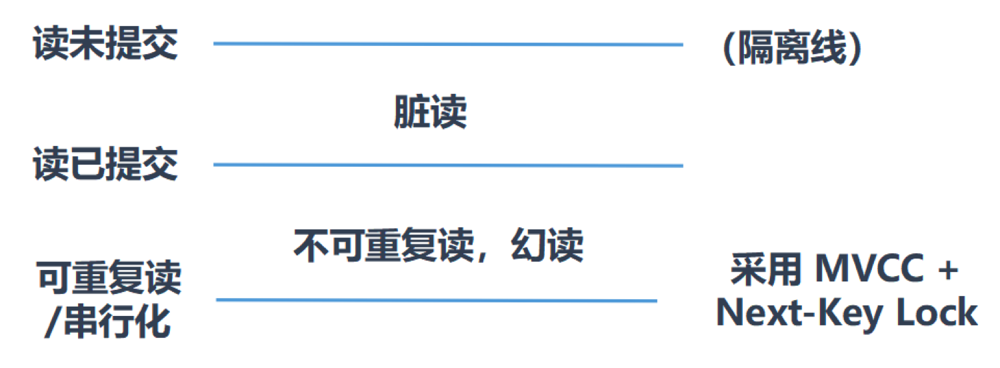

今天的课程主要包括以下几个方面的内容：

1. MVCC 机制的思想是什么？为什么 RDBMS 会采用 MVCC 机制？
2. 在 InnoDB 中，MVCC 机制是如何实现的 ？
3. Read View 是如何工作的？

#### MVCC 是什么，解决了什么问题

MVCC 的英文全称是 Multiversion Concurrency Control，中文翻译过来就是多版本并发控制技术。从名字中也能看出来，MVCC 是通过数据行的多个版本管理来实现数据库的并发控制，简单来说它的思想就是保存数据的历史版本。这样我们就可以通过比较版本号决定数据是否显示出来（具体的规则后面会介绍到），读取数据的时候不需要加锁也可以保证事务的隔离效果。

通过MVCC我们可以解决以下几个问题：

1.读写之间阻塞的问题，通过 MVCC 可以让读写互相不阻塞，即读不阻塞写，写不阻塞读，这样就可以提升事务并发处理能力。

2.降低死锁的概率。这是因为 MVCC 采用了乐观锁的方式，读取数据时并不需要加锁，对于写操作，也只锁定必要的行。

3.解决一致性读的问题。一致性读也被称为快照读，当我们查询数据库在某个时间点的快照时，只能看到这个时间点之前事务提交更新的结果，而不能看到这个时间点之后事务提交的更新结果。

#### 什么是快照读，什么是当前读

那么什么是快照读呢？快照读读取的是快照数据。不加锁的简单的 SELECT 都属于快照读，比如这样：

```sql
SELECT * FROM player WHERE ...
```

当前读就是读取最新的数据，而不是历史版本的数据。加锁SELECT,或者对数据进行增删改都会进行当前读，比如：

```sql
ELECT * FROM player LOCK IN SHARE MODE;
SELECT * FROM player FOR UPDATE;
INSERT INTO player values ...
DELETE FROM player WHERE ...
UPDATE player SET ...
```

这里需要说明的是，快照读就是普通的读操作，而当前读包括了加锁的读取和 DML 操作。

上面讲 MVCC 的作用，你可能觉得有些抽象。我们用具体的例子体会一下。

比如我们有个账户金额表 user_balance，包括三个字段，分别是 username 用户名、balance 余额和 bankcard 卡号，具体的数据示意如下：


为了方便，我们假设 user_balance 表中只有用户 A 和 B 有余额，其他人的账户余额均为 0。下面我们考虑一个使用场景。

用户 A 和用户 B 之间进行转账，此时数据库管理员想要查询 user_balance 表中的总金额：

```sql
SELECT SUM(balance) FROM user_balance
```

你可以思考下，如果数据库不支持 MVCC 机制，而是采用自身的锁机制来实现的话，可能会出现怎样的情况呢？

情况 1：因为需要采用加行锁的方式，用户 A 给 B 转账时间等待很久，如下图所示。


你能看到为了保证数据的一致性，我们需要给统计到的数据行都加上行锁。这时如果 A 所在的数据行加上了行锁，就不能给 B 转账了，只能等到所有操作完成之后，释放行锁再继续进行转账，这样就会造成用户事务处理的等待时间过长。

情况 2：当我们读取的时候用了加行锁，可能会出现死锁的情况，如下图所示。比如当我们读到 A 有 1000 元的时候，此时 B 开始执行给 A 转账：

```sql
UPDATE user_balance SET balance=balance-100 WHERE username ='B'

```

执行完之后马上执行下一步：

```sql
UPDATE user_balance SET balance=balance+100 WHERE username ='A'

```

我们会发现此时 A 被锁住了，而管理员事务还需要对 B 进行访问，但 B 被用户事务锁住了，此时就发生了死锁。

MVCC 可以解决读写互相阻塞的问题，这样提升了效率，同时因为采用了乐观锁的思想，降低了死锁的概率。

#### InnoDB 中的 MVCC 是如何实现的？

我刚才讲解了 MVCC 的思想和作用，实际上 MVCC 没有正式的标准，所以在不同的 DBMS 中，MVCC 的实现方式可能是不同的，你可以参考相关的 DBMS 文档。今天我来讲一下 InnoDB 中 MVCC 的实现机制。

在了解 InnoDB 中 MVCC 的实现方式之前，我们需要了解 InnoDB 是如何存储记录的多个版本的。这里的多版本对应的就是 MVCC 前两个字母的释义：Multi Version，我们需要了解和它相关的数据都有哪些，存储在哪里。这些数据包括事务版本号、行记录中的隐藏列和 Undo Log。

#### 事务版本号

每开启一个事务，我们都会从数据库中获得一个事务 ID（也就是事务版本号），这个事务 ID 是自增长的，通过 ID 大小，我们就可以判断事务的时间顺序。

#### 行记录的隐藏列

InnoDB 的叶子段存储了数据页，数据页中保存了行记录，而在行记录中有一些重要的隐藏字段，如下图所示：

1. db_row_id：隐藏的行 ID，用来生成默认聚集索引。如果我们创建数据表的时候没有指定聚集索引，这时 InnoDB 就会用这个隐藏 ID 来创建聚集索引。采用聚集索引的方式可以提升数据的查找效率。
2. db_trx_id：操作这个数据的事务 ID，也就是最后一个对该数据进行插入或更新的事务 ID。
3. db_roll_ptr：回滚指针，也就是指向这个记录的 Undo Log 信息。


#### Undo Log

InnoDB 将行记录快照保存在了 Undo Log 里，我们可以在回滚段中找到它们，如下图所示：


从图中你能看到回滚指针将数据行的所有快照记录都通过链表的结构串联了起来，每个快照的记录都保存了当时的 db_trx_id，也是那个时间点操作这个数据的事务 ID。这样如果我们想要找历史快照，就可以通过遍历回滚指针的方式进行查找。

#### Read View 是如何工作的

在 MVCC 机制中，多个事务对同一个行记录进行更新会产生多个历史快照，这些历史快照保存在 Undo Log 里。如果一个事务想要查询这个行记录，需要读取哪个版本的行记录呢？这时就需要用到 Read View 了，它帮我们解决了行的可见性问题。Read View 保存了当前事务开启时所有活跃（还没有提交）的事务列表，换个角度你可以理解为 Read View 保存了不应该让这个事务看到的其他的事务 ID 列表。

在 Read VIew 中有几个重要的属性：

1. trx_ids，系统当前正在活跃的事务 ID 集合。
2. low_limit_id，活跃的事务中最大的事务 ID。
3. up_limit_id，活跃的事务中最小的事务 ID。
4. creator_trx_id，创建这个 Read View 的事务 ID。

如图所示，trx_ids 为 trx2、trx3、trx5 和 trx8 的集合，活跃的最大事务 ID（low_limit_id）为 trx8，活跃的最小事务 ID（up_limit_id）为 trx2。


假设当前有事务 creator_trx_id 想要读取某个行记录，这个行记录的事务 ID 为 trx_id，那么会出现以下几种情况。

如果 trx_id < 活跃的最小事务 ID（up_limit_id），也就是说这个行记录在这些活跃的事务创建之前就已经提交了，那么这个行记录对该事务是可见的。

如果 trx_id > 活跃的最大事务 ID（low_limit_id），这说明该行记录在这些活跃的事务创建之后才创建，那么这个行记录对当前事务不可见。

如果 up_limit_id < trx_id < low_limit_id，说明该行记录所在的事务 trx_id 在目前 creator_trx_id 这个事务创建的时候，可能还处于活跃的状态，因此我们需要在 trx_ids 集合中进行遍历，如果 trx_id 存在于 trx_ids 集合中，证明这个事务 trx_id 还处于活跃状态，不可见。否则，如果 trx_id 不存在于 trx_ids 集合中，证明事务 trx_id 已经提交了，该行记录可见。

了解了这些概念之后，我们来看下当查询一条记录的时候，系统如何通过多版本并发控制技术找到它：

1. 首先获取事务自己的版本号，也就是事务 ID；
2. 获取 Read View；
3. 查询得到的数据，然后与 Read View 中的事务版本号进行比较；
4. 如果不符合 ReadView 规则，就需要从 Undo Log 中获取历史快照；
5. 最后返回符合规则的数据。

你能看到 InnoDB 中，MVCC 是通过 Undo Log + Read View 进行数据读取，Undo Log 保存了历史快照，而 Read View 规则帮我们判断当前版本的数据是否可见。

需要说明的是，在隔离级别为读已提交（Read Commit）时，一个事务中的每一次 SELECT 查询都会获取一次 Read View。如表所示：


你能看到，在读已提交的隔离级别下，同样的查询语句都会重新获取一次 Read View，这时如果 Read View 不同，就可能产生不可重复读或者幻读的情况。

当隔离级别为可重复读的时候，就避免了不可重复读，这是因为一个事务只在第一次 SELECT 的时候会获取一次 Read View，而后面所有的 SELECT 都会复用这个 Read View，如下表所示：


#### InnoDB 是如何解决幻读的

不过这里需要说明的是，在可重复读的情况下，InnoDB 可以通过 Next-Key 锁 +MVCC 来解决幻读问题。

在读已提交的情况下，即使采用了 MVCC 方式也会出现幻读。如果我们同时开启事务 A 和事务 B，先在事务 A 中进行某个条件范围的查询，读取的时候采用排它锁，在事务 B 中增加一条符合该条件范围的数据，并进行提交，然后我们在事务 A 中再次查询该条件范围的数据，就会发现结果集中多出一个符合条件的数据，这样就出现了幻读。


出现幻读的原因是在读已提交的情况下，InnoDB 只采用记录锁（Record Locking）。这里要介绍下 InnoDB 三种行锁的方式：

1. 记录锁：针对单个行记录添加锁。
2. 间隙锁（Gap Locking）：可以帮我们锁住一个范围（索引之间的空隙），但不包括记录本身。采用间隙锁的方式可以防止幻读情况的产生。
3. Next-Key 锁：帮我们锁住一个范围，同时锁定记录本身，相当于间隙锁 + 记录锁，可以解决幻读的问题。

在隔离级别为可重复读时，InnoDB 会采用 Next-Key 锁的机制，帮我们解决幻读问题。

还是这个例子，我们能看到当我们想要插入球员艾利克斯·伦（身高 2.16 米）的时候，事务 B 会超时，无法插入该数据。这是因为采用了 Next-Key 锁，会将 height>2.08 的范围都进行锁定，就无法插入符合这个范围的数据了。然后事务 A 重新进行条件范围的查询，就不会出现幻读的情况。


#### 总结

今天关于 MVCC 的内容有些多，通过学习你应该能对采用 MVCC 这种乐观锁的方式来保证事务的隔离效果更有体会。

我们需要记住，MVCC 的核心就是 Undo Log+ Read View，“MV”就是通过 Undo Log 来保存数据的历史版本，实现多版本的管理，“CC”是通过 Read View 来实现管理，通过 Read View 原则来决定数据是否显示。同时针对不同的隔离级别，Read View 的生成策略不同，也就实现了不同的隔离级别。

MVCC 是一种机制，MySQL、Oracle、SQL Server 和 PostgreSQL 的实现方式均有不同，我们在学习的时候，更主要的是要理解 MVCC 的设计思想。


### 如何使用性能分析工具定位SQL执行慢的原因？

在上一篇文章中，我们了解了查询优化器，知道在查询优化器中会经历逻辑查询优化和物理查询优化。需要注意的是，查询优化器只能在已经确定的情况下（SQL 语句、索引设计、缓冲池大小、查询优化器参数等）决定最优的查询执行计划。

但实际上 SQL 执行起来可能还是很慢，那么到底从哪里定位 SQL 查询慢的问题呢？是索引设计的问题？服务器参数配置的问题？还是需要增加缓存的问题呢？今天我们就从性能分析来入手，定位导致 SQL 执行慢的原因。

今天的内容主要包括以下几个部分：

1. 数据库服务器的优化分析的步骤是怎样的？中间有哪些需要注意的地方？
2. 如何使用慢查询日志查找执行慢的 SQL 语句？
3. 如何使用 EXPLAIN 查看 SQL 执行计划？
4. 如何使用 SHOW PROFILING 分析 SQL 执行步骤中的每一步的执行时间？

#### 数据库服务器的优化步骤

当我们遇到数据库调优问题的时候，该如何思考呢？我把思考的流程整理成了下面这张图。

整个流程划分成了观察（Show status）和行动（Action）两个部分 。

字母 S 的部分代表观察（会使用相应的分析工具），字母 A 代表的部分是行动（对应分析可以采取的行动）。


我们可以通过观察了解数据库整体的运行状态，通过性能分析工具可以让我们了解执行慢的SQL都有哪些，查看具体的SQL执行计划，甚至是SQL执行中的每一步称不能代价，这样才能定位问题所在，找到了问题，再采取相应的行动。

我来详细解释一下这张图。

首先在 S1 部分，我们需要观察服务器的状态是否存在周期性的波动。如果存在周期性波动，有可能是周期性节点的原因，比如双十一、促销活动等。这样的话，我们可以通过 A1 这一步骤解决，也就是加缓存，或者更改缓存失效策略。

如果缓存策略没有解决，或者不是周期性波动的原因，我们就需要进一步分析查询延迟和卡顿的原因。接下来进入 S2 这一步，我们需要开启慢查询。慢查询可以帮我们定位执行慢的 SQL 语句。我们可以通过设置 long_query_time 参数定义“慢”的阈值，如果 SQL 执行时间超过了 long_query_time，则会认为是慢查询。当收集上来这些慢查询之后，我们就可以通过分析工具对慢查询日志进行分析。

在 S3 这一步骤中，我们就知道了执行慢的 SQL，这样就可以针对性地用 EXPLAIN 查看对应 SQL 语句的执行计划，或者使用 show profile 查看 SQL 中每一个步骤的时间成本。这样我们就可以了解 SQL 查询慢是因为执行时间长，还是等待时间长。

如果是 SQL 等待时间长，我们进入 A2 步骤。在这一步骤中，我们可以调优服务器的参数，比如适当增加数据库缓冲池等。如果是 SQL 执行时间长，就进入 A3 步骤，这一步中我们需要考虑是索引设计的问题？还是查询关联的数据表过多？还是因为数据表的字段设计问题导致了这一现象。然后在这些维度上进行对应的调整。

如果 A2 和 A3 都不能解决问题，我们需要考虑数据库自身的 SQL 查询性能是否已经达到了瓶颈，如果确认没有达到性能瓶颈，就需要重新检查，重复以上的步骤。如果已经达到了性能瓶颈，进入 A4 阶段，需要考虑增加服务器，采用读写分离的架构，或者考虑对数据库进行分库分表，比如垂直分库、垂直分表和水平分表等。

以上就是数据库调优的流程思路。如果我们发现执行 SQL 时存在不规则延迟或卡顿的时候，就可以采用分析工具帮我们定位有问题的 SQL，这三种分析工具你可以理解是 SQL 调优的三个步骤：慢查询、EXPLAIN 和 SHOW PROFILING。

#### 使用慢查询定位执行慢的 SQL

慢询可以帮我们找到执行慢的 SQL，在使用前，我们需要先看下慢查询是否已经开启，使用下面这条命令即可：

```sql
mysql > show variables like '%slow_query_log';

```


我们能看到 slow_query_log=OFF，也就是说慢查询日志此时是关上的。我们可以把慢查询日志打开，注意设置变量值的时候需要使用 global，否则会报错：

```sql
mysql > set global slow_query_log='ON';
```

然后我们再来查看下慢查询日志是否开启，以及慢查询日志文件的位置：


你能看到这时慢查询分析已经开启，同时文件保存在 DESKTOP-4BK02RP-slow 文件中。

接下来我们来看下慢查询的时间阈值设置，使用如下命令：

```sql
mysql > show variables like '%long_query_time%';
```

这里如果我们想把时间缩短，比如设置为 3 秒，可以这样设置：

```sql
mysql > set global long_query_time = 3;
```


我们可以使用 MySQL 自带的 mysqldumpslow 工具统计慢查询日志（这个工具是个 Perl 脚本，你需要先安装好 Perl）。

mysqldumpslow 命令的具体参数如下：

- -s：采用 order 排序的方式，排序方式可以有以下几种。分别是 c（访问次数）、t（查询时间）、l（锁定时间）、r（返回记录）、ac（平均查询次数）、al（平均锁定时间）、ar（平均返回记录数）和 at（平均查询时间）。其中 at 为默认排序方式。
- -t：返回前 N 条数据 。
- -g：后面可以是正则表达式，对大小写不敏感。

比如我们想要按照查询时间排序，查看前两条 SQL 语句，这样写即可：

```sql
perl mysqldumpslow.pl -s t -t 2 "C:\ProgramData\MySQL\MySQL Server 8.0\Data\DESKTOP-4BK02RP-slow.log"
```


你能看到开启了慢查询日志，并设置了相应的慢查询时间阈值之后，只要大于这个阈值的 SQL 语句都会保存在慢查询日志中，然后我们就可以通过 mysqldumpslow 工具提取想要查找的 SQL 语句了。

#### 如何使用 EXPLAIN 查看执行计划

定位了查询慢的 SQL 之后，我们就可以使用 EXPLAIN 工具做针对性的分析，比如我们想要了解 product_comment 和 user 表进行联查的时候所采用的的执行计划，可以使用下面这条语句：

```sql
EXPLAIN SELECT comment_id, product_id, comment_text, product_comment.user_id, user_name FROM product_comment JOIN user on product_comment.user_id = user.user_id 
```


EXPLAIN 可以帮助我们了解数据表的读取顺序、SELECT 子句的类型、数据表的访问类型、可使用的索引、实际使用的索引、使用的索引长度、上一个表的连接匹配条件、被优化器查询的行的数量以及额外的信息（比如是否使用了外部排序，是否使用了临时表等）等。

SQL 执行的顺序是根据 id 从大到小执行的，也就是 id 越大越先执行，当 id 相同时，从上到下执行。

数据表的访问类型所对应的 type 列是我们比较关注的信息。type 可能有以下几种情况：


在这些情况里，all 是最坏的情况，因为采用了全表扫描的方式。index 和 all 差不多，只不过 index 对索引表进行全扫描，这样做的好处是不再需要对数据进行排序，但是开销依然很大。如果我们在 extra 列中看到 Using index，说明采用了索引覆盖，也就是索引可以覆盖所需的 SELECT 字段，就不需要进行回表，这样就减少了数据查找的开销。all 差不多，只不过 index 对索引表进行全扫描，这样做的好处是不再需要对数据进行排序，但是开销依然很大。如果我们在 extra 列中看到 Using index，说明采用了索引覆盖，也就是索引可以覆盖所需的 SELECT 字段，就不需要进行回表，这样就减少了数据查找的开销。

比如我们对 product_comment 数据表进行查询，设计了联合索引 composite_index (user_id, comment_text)，然后对数据表中的 comment_id、comment_text、user_id 这三个字段进行查询，最后用 EXPLAIN 看下执行计划：

```
EXPLAIN SELECT comment_id, comment_text, user_id FROM product_comment 
```


你能看到这里的访问方式采用了 index 的方式，key 列采用了联合索引，进行扫描。Extral 列为 Using index，告诉我们索引可以覆盖 SELECT 中的字段，也就不需要回表查询了。

range 表示采用了索引范围扫描，这里不进行举例，从这一级别开始，索引的作用会越来越明显，因此我们需要尽量让 SQL 查询可以使用到 range 这一级别及以上的 type 访问方式。

index_merge 说明查询同时使用了两个或以上的索引，最后取了交集或者并集。比如想要对 comment_id=500000 或者 user_id=500000 的数据进行查询，数据表中 comment_id 为主键，user_id 是普通索引，我们可以查看下执行计划：


```sql
EXPLAIN SELECT comment_id, product_id, comment_text, user_id FROM product_comment WHERE comment_id = 500000 OR user_id = 500000
```


你能看到这里同时使用到了两个索引，分别是主键和 user_id，采用的数据表访问类型是 index_merge，通过 union 的方式对两个索引检索的数据进行合并。

ref 类型表示采用了非唯一索引，或者是唯一索引的非唯一性前缀。比如我们想要对 user_id=500000 的评论进行查询，使用 EXPLAIN 查看执行计划：

```sql
EXPLAIN SELECT comment_id, comment_text, user_id FROM product_comment WHERE user_id = 500000 
```


这里 user_id 为普通索引（因为 user_id 在商品评论表中可能是重复的），因此采用的访问类型是 ref，同时在 ref 列中显示 const，表示连接匹配条件是常量，用于索引列的查找。

eq_ref 类型是使用主键或唯一索引时产生的访问方式，通常使用在多表联查中。假设我们对 product_comment 表和 usre 表进行联查，关联条件是两张表的 user_id 相等，使用 EXPLAIN 进行执行计划查看：

```sql
EXPLAIN SELECT * FROM product_comment JOIN user WHERE product_comment.user_id = user.user_id 
```


const 类型表示我们使用了主键或者唯一索引（所有的部分）与常量值进行比较，比如我们想要查看 comment_id=500000，查看执行计划：

```
EXPLAIN SELECT comment_id, comment_text, user_id FROM product_comment WHERE comment_id = 500000 
```


需要说明的是 const 类型和 eq_ref 都使用了主键或唯一索引，不过这两个类型有所区别，const 是与常量进行比较，查询效率会更快，而 eq_ref 通常用于多表联查中。

system 类型一般用于 MyISAM 或 Memory 表，属于 const 类型的特例，当表只有一行时连接类型为 system（我在 GitHub 上上传了 test_myisam 数据表，该数据表只有一行记录，下载地址：<https://github.com/cystanford/SQL_MyISAM>）。我们查看下执行计划：

```sql
EXPLAIN SELECT * FROM test_myisam
```


你能看到除了 all 类型外，其他类型都可以使用到索引，但是不同的连接方式的效率也会有所不同，效率从低到高依次为 all < index < range < index_merge < ref < eq_ref < const/system。我们在查看执行计划的时候，通常希望执行计划至少可以使用到 range 级别以上的连接方式，如果只使用到了 all 或者 index 连接方式，我们可以从 SQL 语句和索引设计的角度上进行改进。


#### 使用 SHOW PROFILE 查看 SQL 的具体执行成本

SHOW PROFILE 相比 EXPLAIN 能看到更进一步的执行解析，包括 SQL 都做了什么、所花费的时间等。默认情况下，profiling 是关闭的，我们可以在会话级别开启这个功能。

```sql
mysql > show variables like 'profiling';
```


通过设置 profiling='ON’来开启 show profile：

```sql
mysql > set profiling = 'ON';
```


我们可以看下当前会话都有哪些 profiles，使用下面这条命令：

```sql
mysql > show profiles;
```


你能看到当前会话一共有 2 个查询，如果我们想要查看上一个查询的开销，可以使用：

```sql
mysql > show profile;
```


我们也可以查看指定的 Query ID 的开销，比如 show profile for query 2 查询结果是一样的。在 SHOW PROFILE 中我们可以查看不同部分的开销，比如 cpu、block.io 等：


通过上面的结果，我们可以弄清楚每一步骤的耗时，以及在不同部分，比如 CPU、block.io 的执行时间，这样我们就可以判断出来 SQL 到底慢在哪里。

不过 SHOW PROFILE 命令将被弃用，我们可以从 information_schema 中的 profiling 数据表进行查看。

#### 总结

我今天梳理了 SQL 优化的思路，从步骤上看，我们需要先进行观察和分析，分析工具的使用在日常工作中还是很重要的。今天只介绍了常用的三种分析工具，实际上可以使用的分析工具还有很多。

我在这里总结一下今天文章里提到的三种分析工具。我们可以通过慢查询日志定位执行慢的 SQL，然后通过 EXPLAIN 分析该 SQL 语句是否使用到了索引，以及具体的数据表访问方式是怎样的。我们也可以使用 SHOW PROFILE 进一步了解 SQL 每一步的执行时间，包括 I/O 和 CPU 等资源的使用情况。


### 查询优化器是如何工作的？

我们总是希望数据库可以运行得更快，也就是响应时间更快，吞吐量更大。想要达到这样的目的，我们一方面需要高并发的事务处理能力，另一方面需要创建合适的索引，让数据的查找效率最大化。事务和索引的使用是数据库中的两个重要核心，事务可以让数据库在增删查改的过程中，保证数据的正确性和安全性，而索引可以帮数据库提升数据的查找效率。

如果我们想要知道如何获取更高的 SQL 查询性能，最好的方式就是理解数据库是如何进行查询优化和执行的。

今天我们就来看看查询优化的原理是怎么一回事。今天的主要内容包括以下几个部分：

1. 什么是查询优化器？一条 SQL 语句的执行流程都会经历哪些环节，在查询优化器中都包括了哪些部分？
2. 查询优化器的两种优化方式分别是什么？
3. 基于代价的优化器是如何统计代价的？总的代价又如何计算？

#### 什么是查询优化器

了解查询优化器的作用之前，我们先来看看一条 SQL 语句的执行都需要经历哪些环节，如下图所示：


你能看到一条 SQL 查询语句首先会经过分析器，进行语法分析和语义检查。我们之前讲过语法分析是检查 SQL 拼写和语法是否正确，语义检查是检查 SQL 中的访问对象是否存在。比如我们在写 SELECT 语句的时候，列名写错了，系统就会提示错误。语法检查和语义检查可以保证 SQL 语句没有错误，最终得到一棵语法分析树，然后经过查询优化器得到查询计划，最后交给执行器进行执行。

查询优化器的目标是找到执行 SQL 查询的最佳执行计划，执行计划就是查询树，它由一系列物理操作符组成，这些操作符按照一定的运算关系组成查询的执行计划。在查询优化器中，可以分为逻辑查询优化阶段和物理查询优化阶段。

逻辑查询优化就是通过改变 SQL 语句的内容来使得 SQL 查询更高效，同时为物理查询优化提供更多的候选执行计划。通常采用的方式是对 SQL 语句进行等价变换，对查询进行重写，而查询重写的数学基础就是关系代数。对条件表达式进行等价谓词重写、条件简化，对视图进行重写，对子查询进行优化，对连接语义进行了外连接消除、嵌套连接消除等。

逻辑查询优化是基于关系代数进行的查询重写，而关系代数的每一步都对应着物理计算，这些物理计算往往存在多种算法，因此需要计算各种物理路径的代价，从中选择代价最小的作为执行计划。在这个阶段里，对于单表和多表连接的操作，需要高效地使用索引，提升查询效率。

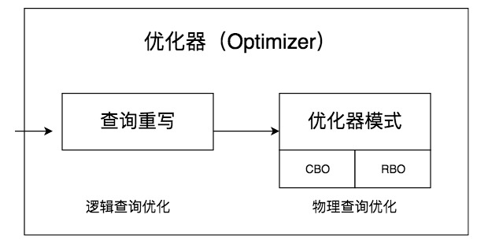

在这两个阶段中，查询重写属于代数级、语法级的优化，也就是属于逻辑范围内的优化，而基于代价的估算模型是从连接路径中选择代价最小的路径，属于物理层面的优化。

#### 查询优化器的两种优化方式

查询优化器的目的就是生成最佳的执行计划，而生成最佳执行计划的策略通常有以下两种方式。

第一种是基于规则的优化器（RBO，Rule-Based Optimizer），规则就是人们以往的经验，或者是采用已经被证明是有效的方式。通过在优化器里面嵌入规则，来判断 SQL 查询符合哪种规则，就按照相应的规则来制定执行计划，同时采用启发式规则去掉明显不好的存取路径。

第二种是基于代价的优化器（CBO，Cost-Based Optimizer），这里会根据代价评估模型，计算每条可能的执行计划的代价，也就是 COST，从中选择代价最小的作为执行计划。相比于 RBO 来说，CBO 对数据更敏感，因为它会利用数据表中的统计信息来做判断，针对不同的数据表，查询得到的执行计划可能是不同的，因此制定出来的执行计划也更符合数据表的实际情况。

但我们需要记住，SQL 是面向集合的语言，并没有指定执行的方式，因此在优化器中会存在各种组合的可能。我们需要通过优化器来制定数据表的扫描方式、连接方式以及连接顺序，从而得到最佳的 SQL 执行计划。

你能看出来，RBO 的方式更像是一个出租车老司机，凭借自己的经验来选择从 A 到 B 的路径。而 CBO 更像是手机导航，通过数据驱动，来选择最佳的执行路径。

#### CBO 是如何统计代价的

大部分 RDBMS 都支持基于代价的优化器（CBO），CBO 随着版本的迭代也越来越成熟，但是 CBO 依然存在缺陷。通过对 CBO 工作原理的了解，我们可以知道 CBO 可能存在的不足有哪些，有助于让我们知道优化器是如何确定执行计划的。

#### 能调整的代价模型的参数有哪些

首先，我们先来了解下 MySQL 中的`COST Model`，`COST Model`就是优化器用来统计各种步骤的代价模型，在 5.7.10 版本之后，MySQL 会引入两张数据表，里面规定了各种步骤预估的代价（Cost Value） ，我们可以从`mysql.server_cost`和`mysql.engine_cost`这两张表中获得这些步骤的代价：

```sql
SQL > SELECT * FROM mysql.server_cost
```


server_cost 数据表是在 server 层统计的代价，具体的参数含义如下：

1. `disk_temptable_create_cost`，表示临时表文件（MyISAM 或 InnoDB）的创建代价，默认值为 20。
2. `disk_temptable_row_cost`，表示临时表文件（MyISAM 或 InnoDB）的行代价，默认值 0.5。
3. `key_compare_cost`，表示键比较的代价。键比较的次数越多，这项的代价就越大，这是一个重要的指标，默认值 0.05。
4. `memory_temptable_create_cost`，表示内存中临时表的创建代价，默认值 1。
5. `memory_temptable_row_cost`，表示内存中临时表的行代价，默认值 0.1。
6. `row_evaluate_cost`，统计符合条件的行代价，如果符合条件的行数越多，那么这一项的代价就越大，因此这是个重要的指标，默认值 0.1。

由这张表中可以看到，如果想要创建临时表，尤其是在磁盘中创建相应的文件，代价还是很高的。

然后我们看下在存储引擎层都包括了哪些代价：

```sql
SQL > SELECT * FROM mysql.engine_cost
```


`engine_cost`主要统计了页加载的代价，我们之前了解到，一个页的加载根据页所在位置的不同，读取的位置也不同，可以从磁盘 I/O 中获取，也可以从内存中读取。因此在`engine_cost`数据表中对这两个读取的代价进行了定义：

1. `io_block_read_cost`，从磁盘中读取一页数据的代价，默认是 1。
2. `memory_block_read_cost`，从内存中读取一页数据的代价，默认是 0.25。

既然 MySQL 将这些代价参数以数据表的形式呈现给了我们，我们就可以根据实际情况去修改这些参数。因为随着硬件的提升，各种硬件的性能对比也可能发生变化，比如针对普通硬盘的情况，可以考虑适当增加`io_block_read_cost`的数值，这样就代表从磁盘上读取一页数据的成本变高了。当我们执行全表扫描的时候，相比于范围查询，成本也会增加很多。

比如我想将`io_block_read_cost`参数设置为 2.0，那么使用下面这条命令就可以：

```sql
UPDATE mysql.engine_cost
  SET cost_value = 2.0
  WHERE cost_name = 'io_block_read_cost';
FLUSH OPTIMIZER_COSTS;
```


我们对`mysql.engine_cost`中的`io_block_read_cost`参数进行了修改，然后使用`FLUSH OPTIMIZER_COSTS`更新内存，然后再查看`engine_cost`数据表，发现`io_block_read_cost`参数中的`cost_value`已经调整为 2.0。

如果我们想要专门针对某个存储引擎，比如 InnoDB 存储引擎设置`io_block_read_cost`，比如设置为 2，可以这样使用：

```sql
INSERT INTO mysql.engine_cost(engine_name, device_type, cost_name, cost_value, last_update, comment)
  VALUES ('InnoDB', 0, 'io_block_read_cost', 2,
  CURRENT_TIMESTAMP, 'Using a slower disk for InnoDB');
FLUSH OPTIMIZER_COSTS;
```

然后我们再查看一下`mysql.engine_cost`数据表：


从图中你能看到针对 InnoDB 存储引擎可以设置专门的`io_block_read_cost`参数值。

#### 代价模型如何计算

总代价的计算是一个比较复杂的过程，上面只是列出了一些常用的重要参数，我们可以根据情况对它们进行调整，也可以使用默认的系统参数值。

那么总的代价是如何进行计算的呢？

在论文[《Access Path Selection-in a Relational Database Management System》](http://dbis.rwth-aachen.de/lehrstuhl/staff/li/resources/download/AccessPathSelectionInRelationalDatabase.pdf）)中给出了计算模型，如下图所示：

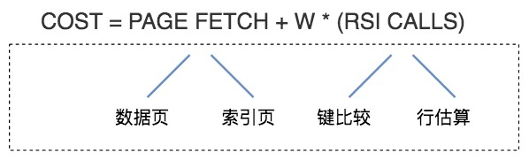


你可以简单地认为，总的执行代价等于 I/O 代价 +CPU 代价。在这里 PAGE FETCH 就是 I/O 代价，也就是页面加载的代价，包括数据页和索引页加载的代价。W*(RSI CALLS) 就是 CPU 代价。W 在这里是个权重因子，表示了 CPU 到 I/O 之间转化的相关系数，RSI CALLS 代表了 CPU 的代价估算，包括了键比较（compare key）以及行估算（row evaluating）的代价。

为了让你更好地理解，我说下关于 W 和 RSI CALLS 的英文解释：W is an adjustable weight between I/O and CPU utilization. The number of RSI calls is used to approximate CPU utilization。

这样你应该能明白为了让 CPU 代价和 I/O 代价放到一起来统计，我们使用了转化的系数 W，

另外需要说明的是，在 MySQL5.7 版本之后，代价模型又进行了完善，不仅考虑到了 I/O 和 CPU 开销，还对内存计算和远程操作的代价进行了统计，也就是说总代价的计算公式演变成下面这样：

总代价 = I/O 代价 + CPU 代价 + 内存代价 + 远程代价

这里对内存代价和远程代价不进行讲解，我们只需要关注 I/O 代价和 CPU 代价即可。


#### 总结

我今天讲解了查询优化器，它在 RDBMS 中是个非常重要的角色。在优化器中会经历逻辑查询优化和物理查询优化阶段。

最后我们只是简单梳理了下 CBO 的总代价是如何计算的，以及包括了哪些部分。CBO 的代价计算是个复杂的过程，细节很多，不同优化器的实现方式也不同。另外随着优化器的逐渐成熟，考虑的因素也会越来越多。在某些情况下 MySQL 还会把 RBO 和 CBO 组合起来一起使用。RBO 是个简单固化的模型，在 Oracle 8i 之前采用的就是 RBO，在优化器中一共包括了 15 种规则，输入的 SQL 会根据符合规则的情况得出相应的执行计划，在 Oracle 10g 版本之后就用 CBO 替代了 RBO。

CBO 中需要传入的参数除了 SQL 查询以外，还包括了优化器参数、数据表统计信息和系统配置等，这实际上也导致 CBO 出现了一些缺陷，比如统计信息不准确，参数配置过高或过低，都会导致路径选择的偏差。除此以外，查询优化器还需要在优化时间和执行计划质量之间进行平衡，比如一个执行计划的执行时间是 10 秒钟，就没有必要花 1 分钟优化执行计划，除非该 SQL 使用频繁高，后续可以重复使用该执行计划。同样 CBO 也会做一些搜索空间的剪枝，以便在有效的时间内找到一个“最优”的执行计划。这里，其实也是在告诉我们，为了得到一个事物，付出的成本过大，即使最终得到了，有时候也是得不偿失的。


### 答疑篇：关于索引以及缓冲池的一些解惑


这篇文章是进阶篇的最后一篇，在这一模块中，我主要针对 SQL 运行的底层原理进行了讲解，其中还有很多问题没有回答，我总结了进阶篇中常见的一些问题，希望能对你有所帮助。下面的内容主要包括了索引原则、自适应 Hash、缓冲池机制和存储引擎等。

#### 关于索引（B+ 树索引和 Hash 索引，以及索引原则）

#### 什么是自适应 Hash 索引？

回答这个问题前，让我们先回顾下 B+ 树索引和 Hash 索引：

因为B+树可以使用范围查找，同样是按照顺序的方式对数据进行存储，因此对数据进行排序操作，在联合索引中也可以利用部分索引键进行查询。这些情况下，我们都没法使用 Hash 索引，因为 Hash 索引仅能满足（=）（<>）和 IN 查询，不能使用范围查询。此外，Hash 索引还有一个缺陷，数据的存储是没有顺序的，在 ORDER BY 的情况下，使用 Hash 索引还需要对数据重新排序。而对于联合索引的情况，Hash 值是将联合索引键合并后一起来计算的，无法对单独的一个键或者几个索引键进行查询。

MySQL 默认使用 B+ 树作为索引，因为 B+ 树有着 Hash 索引没有的优点，那么为什么还需要自适应 Hash 索引呢？这是因为 Hash 索引在进行数据检索的时候效率非常高，通常只需要 O(1) 的复杂度，也就是一次就可以完成数据的检索。虽然 Hash 索引的使用场景有很多限制，但是优点也很明显，所以 MySQL 提供了一个自适应 Hash 索引的功能（Adaptive Hash Index）。注意，这里的自适应指的是不需要人工来制定，系统会根据情况自动完成。

什么情况下才会使用自适应 Hash 索引呢？如果某个数据经常被访问，当满足一定条件的时候，就会将这个数据页的地址存放到 Hash 表中。这样下次查询的时候，就可以直接找到这个页面的所在位置。

需要说明的是自适应 Hash 索引只保存热数据（经常被使用到的数据），并非全表数据。因此数据量并不会很大，因此自适应 Hash 也是存放到缓冲池中，这样也进一步提升了查找效率。

InnoDB 中的自适应 Hash 相当于“索引的索引”，采用 Hash 索引存储的是 B+ 树索引中的页面的地址。如下图所示：


你能看到，采用自适应 Hash 索引目的是方便根据 SQL 的查询条件加速定位到叶子节点，特别是当 B+ 树比较深的时候，通过自适应 Hash 索引可以明显提高数据的检索效率。

我们来看下自适应 Hash 索引的原理。

自适应 Hash 采用 Hash 函数映射到一个 Hash 表中，如下图所示，查找字典类型的数据非常方便。

Hash 表是数组 + 链表的形式。通过 Hash 函数可以计算索引键值所对应的 bucket（桶）的位置，如果产生 Hash 冲突，就需要遍历链表来解决。


我们可以通过`innodb_adaptive_hash_index`变量来查看是否开启了自适应 Hash，比如：

```sql
mysql> show variables like '%adaptive_hash_index';
```


我来总结一下，InnoDB 本身不支持 Hash 索引，但是提供自适应 Hash 索引，不需要用户来操作，存储引擎会自动完成。自适应 Hash 是 InnoDB 三大关键特性之一，另外两个分别是插入缓冲和二次写。

#### 什么是联合索引的最左原则？

关于联合索引的最左原则，读者 @老毕 给出了一个非常形象的解释：

假设我们有 x、y、z 三个字段，创建联合索引（x, y, z）之后，我们可以把 x、y、z 分别类比成“百分位”、“十分位”和“个位”。

查询“x=9 AND y=8 AND z=7”的过程，就是在一个由小到大排列的数值序列中寻找“987”，可以很快找到。

查询“y=8 AND z=7”，就用不上索引了，因为可能存在 187、287、387、487………这样就必须扫描所有数值。

我在这个基础上再补充说明一下。

查询“z=7 AND y=8 AND x=9”的时候，如果三个字段 x、y、z 在条件查询的时候是乱序的，但采用的是等值查询（=）或者是 IN 查询，那么 MySQL 的优化器可以自动帮我们调整为可以使用联合索引的形式。

当我们查询“x=9 AND y>8 AND z=7”的时候，如果建立了 (x,y,z) 顺序的索引，这时候 z 是用不上索引的。这是因为 MySQL 在匹配联合索引最左前缀的时候，如果遇到了范围查询，比如（<）（>）和 between 等，就会停止匹配。索引列最多作用于一个范围列，对于后面的 Z 来说，就没法使用到索引了。

通过这个我们也可以知道，联合索引的最左前缀匹配原则针对的是创建的联合索引中的顺序，如果创建了联合索引（x,y,z），那么这个索引的使用顺序就很重要了。如果在条件语句中只有 y 和 z，那么就用不上联合索引。

此外，SQL 条件语句中的字段顺序并不重要，因为在逻辑查询优化阶段会自动进行查询重写。

最后你需要记住，如果我们遇到了范围条件查询，比如（<）（<=）（>）（>=）和 between 等，那么范围列后的列就无法使用到索引了。

#### Hash 索引与 B+ 树索引是在建索引的时候手动指定的吗？

如果使用的是 MySQL 的话，我们需要了解 MySQL 的存储引擎都支持哪些索引结构，如下图所示（参考来源 <https://dev.mysql.com/doc/refman/8.0/en/create-index.html>）。如果是其他的 DBMS，可以参考相关的 DBMS 文档。


你能看到，针对 InnoDB 和 MyISAM 存储引擎，都会默认采用 B+ 树索引，无法使用 Hash 索引。InnoDB 提供的自适应 Hash 是不需要手动指定的。如果是 Memory/Heap 和 NDB 存储引擎，是可以进行选择 Hash 索引的。


#### 关于缓冲池

#### 缓冲池和查询缓存是一个东西吗？

首先我们需要了解在 InnoDB 存储引擎中，缓冲池都包括了哪些。

在 InnoDB 存储引擎中有一部分数据会放到内存中，缓冲池则占了这部分内存的大部分，它用来存储各种数据的缓存，如下图所示：


从图中，你能看到 InnoDB 缓冲池包括了数据页、索引页、插入缓冲、锁信息、自适应 Hash 和数据字典信息等。

我们之前讲过使用缓冲池技术的原因。这里重新回顾一下。InnoDB 存储引擎基于磁盘文件存储，访问物理硬盘和在内存中进行访问，速度相差很大，为了尽可能弥补这两者之间 I/O 效率的差值，我们就需要把经常使用的数据加载到缓冲池中，避免每次访问都进行磁盘 I/O。

“频次 * 位置”这个原则，可以帮我们对 I/O 访问效率进行优化。

首先，位置决定效率，提供缓冲池就是为了在内存中可以直接访问数据。

其次，频次决定优先级顺序。因为缓冲池的大小是有限的，比如磁盘有 200G，但是内存只有 16G，缓冲池大小只有 1G，就无法将所有数据都加载到缓冲池里，这时就涉及到优先级顺序，会优先对使用频次高的热数据进行加载。

了解了缓冲池的作用之后，我们还需要了解缓冲池的另一个特性：预读。

缓冲池的作用就是提升 I/O 效率，而我们进行读取数据的时候存在一个“局部性原理”，也就是说我们使用了一些数据，大概率还会使用它周围的一些数据，因此采用“预读”的机制提前加载，可以减少未来可能的磁盘 I/O 操作。

那么什么是查询缓存呢？

查询缓存是提前把查询结果缓存起来，这样下次不需要执行就可以直接拿到结果。需要说明的是，在 MySQL 中的查询缓存，不是缓存查询计划，而是查询对应的结果。这就意味着查询匹配的鲁棒性大大降低，只有相同的查询操作才会命中查询缓存。因此 MySQL 的查询缓存命中率不高，在 MySQL8.0 版本中已经弃用了查询缓存功能。

查看是否使用了查询缓存，使用命令：

```sql
show variables like '%query_cache%';

```


缓冲池并不等于查询缓存，它们的共同点都是通过缓存的机制来提升效率。但缓冲池服务于数据库整体的 I/O 操作，而查询缓存服务于 SQL 查询和查询结果集的，因为命中条件苛刻，而且只要数据表发生变化，查询缓存就会失效，因此命中率低。

#### 其他

很多人对 InnoDB 和 MyISAM 的取舍存在疑问，到底选择哪个比较好呢？

我们需要先了解 InnoDB 和 MyISAM 各自的特点。InnoDB 支持事务和行级锁，是 MySQL 默认的存储引擎；MyISAM 只支持表级锁，不支持事务，更适合读取数据库的情况。

如果是小型的应用，需要大量的 SELECT 查询，可以考虑 MyISAM；如果是事务处理应用，需要选择 InnoDB。

这两种引擎各有特点，当然你也可以在 MySQL 中，针对不同的数据表，可以选择不同的存储引擎。

最后给大家提供一下专栏中学习资料的下载。

如果你想导入文章中的“product_comment”表结构和数据，点击[这里](https://github.com/cystanford/product_comment)即可。你也可以在[网盘](https://pan.baidu.com/s/1LBEAm50DDP9AjErLtGplLg)里下载，提取码为 32ep。

关于文章中涉及到的思维导图，点击[这里](https://github.com/cystanford/SQL-XMind)下载即可。

最后留一道思考题，供你消化今天答疑篇里的内容。

假设我们有 x、y、z 三个字段，创建联合索引（x, y, z）。数据表中的数据量比较大，那么对下面语句进行 SQL 查询的时候，哪个会使用联合索引？如果使用了联合索引，分别使用到了联合索引的哪些部分？

A

```
SELECT x, y, z FROM table WHERE y=2 AND x>1 AND z=3
 
```

B

```
SELECT x, y, z FROM table WHERE y=2 AND x=1 AND z>3
复制代码
```

C

```
SELECT x, y, z FROM table WHERE y=2 AND x=1 AND z=3
复制代码
```

D

```
SELECT x, y, z FROM table WHERE y>2 AND x=1 AND z=3
 
```

### 数据库主从同步的作用是什么，如何解决数据不一致问题？(略)

### 数据库没有备份，没有使用Binlog的情况下，如何恢复数据？

### SQL注入：你的SQL是如何被注入的？（略）


## 认识DBMS

### 如何在Excel中使用SQL语言（略）

### WebSQL：如何在H5中存储一个本地数据库？（略）

### SQLite：为什么微信用SQLite存储聊天记录？（略）

### 初识Redis：Redis为什么会这么快？

之前我们讲解了一些 RDBMS 的使用，比如 MySQL、Oracle、SQL Server 和 SQLite 等，实际上在日常工作中，我们还会接触到一些 NoSQL 类型的数据库。如果对比 RDBMS 和 NoSQL 数据库，你会发现 RDBMS 建立在关系模型基础上，强调数据的一致性和各种约束条件，而 NoSQL 的规则是“只提供你想要的”，数据模型灵活，查询效率高，成本低。但同时，相比 RDBMS，NoSQL 数据库没有统一的架构和标准语言，每种数据库之间差异较大，各有所长。

今天我们要讲解的 Redis 属于键值（key-value）数据库，键值数据库会使用哈希表存储键值和数据，其中 key 作为唯一的标识，而且 key 和 value 可以是任何的内容，不论是简单的对象还是复杂的对象都可以存储。键值数据库的查询性能高，易于扩展。

今天我们就来了解下 Redis，具体的内容包括以下几个方面：

1. Redis 是什么，为什么使用 Redis 会非常快？
2. Redis 支持的数据类型都有哪些？
3. 如何通过 Python 和 Redis 进行交互？


#### Redis 是什么，为什么这么快

Redis 全称是 REmote DIctionary Server，从名字中你也能看出来它用字典结构存储数据，也就是 key-value 类型的数据。

Redis 的查询效率非常高，根据官方提供的数据，Redis 每秒最多处理的请求可以达到 10 万次。

为什么这么快呢？

Redis 采用 ANSI C 语言编写，它和 SQ

Lite 一样。采用 C 语言进行编写的好处是底层代码执行效率高，依赖性低，因为使用 C 语言开发的库没有太多运行时（Runtime）依赖，而且系统的兼容性好，稳定性高。

此外，Redis 是基于内存的数据库，我们之前讲到过，这样可以避免磁盘 I/O，因此 Redis 也被称为缓存工具。

其次，数据结构结构简单，Redis 采用 Key-Value 方式进行存储，也就是使用 Hash 结构进行操作，数据的操作复杂度为 O(1)。

但 Redis 快的原因还不止这些，它采用单进程单线程模型，这样做的好处就是避免了上下文切换和不必要的线程之间引起的资源竞争。

在技术上 Redis 还采用了多路 I/O 复用技术。这里的多路指的是多个 socket 网络连接，复用指的是复用同一个线程。采用多路 I/O 复用技术的好处是可以在同一个线程中处理多个 I/O 请求，尽量减少网络 I/O 的消耗，提升使用效率。


#### Redis 的数据类型

相比 Memcached，Redis 有一个非常大的优势，就是支持多种数据类型。Redis 支持的数据类型包括字符串、哈希、列表、集合、有序集合等。

字符串类型是 Redis 提供的最基本的数据类型，对应的结构是 key-value。

如果我们想要设置某个键的值，使用方法为`set key value`，比如我们想要给 name 这个键设置值为 zhangfei，可以写成`set name zhangfei`。如果想要取某个键的值，可以使用`get key`，比如想取 name 的值，写成 get name 即可。


哈希（hash）提供了字段和字段值的映射，对应的结构是 key-field-value。

如果我们想要设置某个键的哈希值，可以使用`hset key field value`，如果想要给 user1 设置 username 为 zhangfei，age 为 28，可以写成下面这样：

```sql
hset user1 username zhangfei
hset user1 age 28
```

如果我们想要同时将多个 field-value 设置给某个键 key 的时候，可以使用`hmset key field value [field value...]`，比如上面这个可以写成：

```sql
Hmset user1 username zhangfei age 28
```

如果想要取某个键的某个 field 字段值，可以使用`hget key field`，比如想要取 user1 的 username，那么写成`hget user1 username`即可。

如果想要一次获取某个键的多个 field 字段值，可以使用`hmget key field[field...]`，比如想要取 user1 的 username 和 age，可以写成`hmget user1 username age`。


字符串列表（list）的底层是一个双向链表结构，所以我们可以向列表的两端添加元素，时间复杂度都为 O(1)，同时我们也可以获取列表中的某个片段。

如果想要向列表左侧增加元素可以使用：`LPUSH key value [...]`，比如我们给 heroList 列表向左侧添加 zhangfei、guanyu 和 liubei 这三个元素，可以写成：

```sql
LPUSH heroList zhangfei guanyu liubei
```

同样，我们也可以使用`RPUSH key value [...]`向列表右侧添加元素，比如我们给 heroList 列表向右侧添加 dianwei、lvbu 这两个元素，可以写成下面这样：

```sql
RPUSH heroList dianwei lvbu
 
```

如果我们想要获取列表中某一片段的内容，使用`LRANGE key start stop`即可，比如我们想要获取 heroList 从 0 到 4 位置的数据，写成`LRANGE heroList 0 4`即可。


字符串集合（set）是字符串类型的无序集合，与列表（list）的区别在于集合中的元素是无序的，同时元素不能重复。

如果想要在集合中添加元素，可以使用`SADD key member [...]`，比如我们给 heroSet 集合添加 zhangfei、guanyu、liubei、dianwei 和 lvbu 这五个元素，可以写成：

```sql
SADD heroSet zhangfei guanyu liubei dianwei lvbu
```

如果想要在集合中删除某元素，可以使用`SREM key member [...]`，比如我们从 heroSet 集合中删除 liubei 和 lvbu 这两个元素，可以写成：

```sql
SREM heroSet liubei lvbu
```

如果想要获取集合中所有的元素，可以使用`SMEMBERS key`，比如我们想要获取 heroSet 集合中的所有元素，写成`SMEMBERS heroSet`即可。

如果想要判断集合中是否存在某个元素，可以使用`SISMEMBER key member`，比如我们想要判断 heroSet 集合中是否存在 zhangfei 和 liubei，就可以写成下面这样：

```sql
SISMEMBER heroSet zhangfei
SISMEMBER heroSet liubei
```


我们可以把有序字符串集合（SortedSet，简称 ZSET）理解成集合的升级版。实际上 ZSET 是在集合的基础上增加了一个分数属性，这个属性在添加修改元素的时候可以被指定。每次指定后，ZSET 都会按照分数来进行自动排序，也就是说我们在给集合 key 添加 member 的时候，可以指定 score。

有序集合与列表有一定的相似性，比如这两种数据类型都是有序的，都可以获得某一范围的元素。但它俩在数据结构上有很大的不同，首先列表 list 是通过双向链表实现的，在操作左右两侧的数据时会非常快，而对于中间的数据操作则相对较慢。有序集合采用 hash 表的结构来实现，读取排序在中间部分的数据也会很快。同时有序集合可以通过 score 来完成元素位置的调整，但如果我们想要对列表进行元素位置的调整则会比较麻烦。

如果我们想要在有序集合中添加元素和分数，使用`ZADD key score member [...]`，比如我们给 heroScore 集合添加下面 5 个英雄的 hp_max 数值，如下表所示：


那么我们可以写成下面这样：

```sql
ZADD heroScore 8341 zhangfei 7107 guanyu 6900 liubei 7516 dianwei 7344 lvbu

```

如果我们想要获取某个元素的分数，可以使用`ZSCORE key member`，比如我们想要获取 guanyu 的分数，写成`ZSCORE heroScore guanyu`即可。

如果我们想要删除一个或多元素，可以使用 ZREM key member [member …]，比如我们想要删除 guanyu 这个元素，使用`ZREM heroScore guanyu`即可。

我们也可以获取某个范围的元素列表。如果想要分数从小到大进行排序，使用`ZRANGE key start stop [WITHSCORES]`，如果分数从大到小进行排序，使用`ZREVRANGE key start stop [WITHSCORES]`。需要注意的是，WITHSCORES 是个可选项，如果使用 WITHSCORES 会将分数一同显示出来，比如我们想要查询 heroScore 这个有序集合中分数排名前 3 的英雄及数值，写成`ZREVRANGE heroScore 0 2 WITHSCORES`即可。

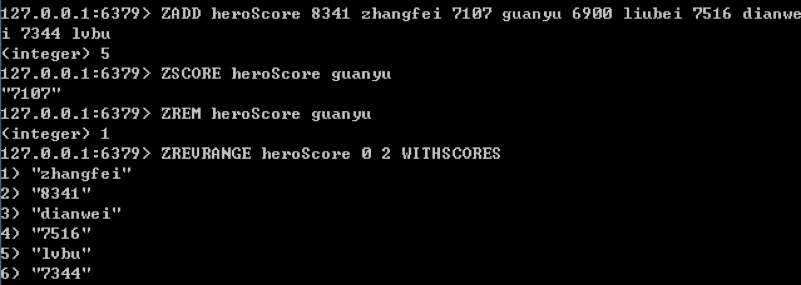


除了这 5 种数据类型以外，Redis 还支持位图（Bitmaps）数据结构，在 2.8 版本之后，增加了基数统计（HyperLogLog），3.2 版本之后加入了地理空间（Geospatial）以及索引半径查询的功能，在 5.0 版本引用了数据流（Streams）数据类型。

#### 总结

NoSQL 数据库种类非常多，了解 Redis 是非常有必要的，在实际工作中，我们也经常将 RDBMS 和 Redis 一起使用，优势互补。

作为常见的 NoSQL 数据库，Redis 支持的数据类型比 Memcached 丰富得多，在 I/O 性能上，Redis 采用的是单线程 I/O 复用模型，而 Memcached 是多线程，可以利用多核优势。而且在持久化上，Redis 提供了两种持久化的模式，可以让数据永久保存，这是 Memcached 不具备的。


### 如何使用Redis来实现多用户抢票问题

在上一篇文章中，我们已经对 Redis 有了初步的认识，了解到 Redis 采用 Key-Value 的方式进行存储，在 Redis 内部，使用的是 redisObject 对象来表示所有的 key 和 value。同时我们还了解到 Redis 本身用的是单线程的机制，采用了多路 I/O 复用的技术，在处理多个 I/O 请求的时候效率很高。

今天我们来更加深入地了解一下 Redis 的原理，内容包括以下几方面：

1. Redis 的事务处理机制是怎样的？与 RDBMS 有何不同？
2. Redis 的事务处理的命令都有哪些？如何使用它们完成事务操作？
3. 如何使用 Python 的多线程机制和 Redis 的事务命令模拟多用户抢票？

#### Redis 的事务处理机制

在此之前，让我们先来回忆下 RDBMS 中事务满足的 4 个特性 ACID，它们分别代表原子性、一致性、隔离性和持久性。

Redis 的事务处理与 RDBMS 的事务有一些不同。

首先 Redis 不支持事务的回滚机制（Rollback），这也就意味着当事务发生了错误（只要不是语法错误），整个事务依然会继续执行下去，直到事务队列中所有命令都执行完毕。在[Redis 官方文档](https://redis.io/topics/transactions)中说明了为什么 Redis 不支持事务回滚。

只有当编程语法错误的时候，Redis 命令执行才会失败。这种错误通常出现在开发环境中，而很少出现在生产环境中，没有必要开发事务回滚功能。

另外，Redis 是内存数据库，与基于文件的 RDBMS 不同，通常只进行内存计算和操作，无法保证持久性。不过 Redis 也提供了两种持久化的模式，分别是 RDB 和 AOF 模式。

RDB（Redis DataBase）持久化可以把当前进程的数据生成快照保存到磁盘上，触发 RDB 持久化的方式分为手动触发和自动触发。因为持久化操作与命令操作不是同步进行的，所以无法保证事务的持久性。

AOF（Append Only File）持久化采用日志的形式记录每个写操作，弥补了 RDB 在数据一致性上的不足，但是采用 AOF 模式，就意味着每条执行命令都需要写入文件中，会大大降低 Redis 的访问性能。启用 AOF 模式需要手动开启，有 3 种不同的配置方式，默认为 everysec，也就是每秒钟同步一次。其次还有 always 和 no 模式，分别代表只要有数据发生修改就会写入 AOF 文件，以及由操作系统决定什么时候记录到 AOF 文件中。

虽然 Redis 提供了两种持久化的机制，但是作为内存数据库，持久性并不是它的擅长。

Redis 是单线程程序，在事务执行时不会中断事务，其他客户端提交的各种操作都无法执行，因此你可以理解为 Redis 的事务处理是串行化的方式，总是具有隔离性的。

#### Redis的事务处理命令

了解了 Redis 的事务处理机制之后，我们来看下 Redis 的事务处理都包括哪些命令。

1. MULTI：开启一个事务；
2. EXEC：事务执行，将一次性执行事务内的所有命令；
3. DISCARD：取消事务；
4. WATCH：监视一个或多个键，如果事务执行前某个键发生了改动，那么事务也会被打断；
5. UNWATCH：取消 WATCH 命令对所有键的监视。

需要说明的是 Redis 实现事务是基于 COMMAND 队列，如果 Redis 没有开启事务，那么任何的 COMMAND 都会立即执行并返回结果。如果 Redis 开启了事务，COMMAND 命令会放到队列中，并且返回排队的状态 QUEUED，只有调用 EXEC，才会执行 COMMAND 队列中的命令。

比如我们使用事务的方式存储 5 名玩家所选英雄的信息，代码如下：

```sql
MULTI
hmset user:001 hero 'zhangfei' hp_max 8341 mp_max 100
hmset user:002 hero 'guanyu' hp_max 7107 mp_max 10
hmset user:003 hero 'liubei' hp_max 6900 mp_max 1742
hmset user:004 hero 'dianwei' hp_max 7516 mp_max 1774
hmset user:005 hero 'diaochan' hp_max 5611 mp_max 1960
EXEC
```

你能看到在 MULTI 和 EXEC 之间的 COMMAND 命令都会被放到 COMMAND 队列中，并返回排队的状态，只有当 EXEC 调用时才会一次性全部执行。


我们经常使用 Redis 的 WATCH 和 MULTI 命令来处理共享资源的并发操作，比如秒杀，抢票等。实际上 WATCH+MULTI 实现的是乐观锁。下面我们用两个 Redis 客户端来模拟下抢票的流程。


我们启动 Redis 客户端 1，执行上面的语句，然后在执行 EXEC 前，等待客户端 2 先完成上面的执行，客户端 2 的结果如下：


然后客户端 1 执行 EXEC，结果如下：


你能看到实际上最后一张票被客户端 2 抢到了，这是因为客户端 1WATCH 的票的变量在 EXEC 之前发生了变化，整个事务就被打断，返回空回复（nil）。

需要说明的是 MULTI 后不能再执行 WATCH 命令，否则会返回 WATCH inside MULTI is not allowed 错误（因为 WATCH 代表的就是在执行事务前观察变量是否发生了改变，如果变量改变了就不将事务打断，所以在事务执行之前，也就是 MULTI 之前，使用 WATCH）。同时，如果在执行命令过程中有语法错误，Redis 也会报错，整个事务也不会被执行，Redis 会忽略运行时发生的错误，不会影响到后面的执行。


#### 模拟多用户抢票

我们刚才讲解了 Redis 的事务命令，并且使用 Redis 客户端的方式模拟了两个用户抢票的流程。下面我们使用 Python 继续模拟一下这个过程，这里需要注意三点。

在 Python 中，Redis 事务是通过 pipeline 封装而实现的，因此在创建 Redis 连接后，需要获取管道 pipeline，然后通过 pipeline 使用 WATCH、MULTI 和 EXEC 命令。

其次，用户是并发操作的，因此我们需要使用到 Python 的多线程，这里使用 threading 库来创建多线程。

对于用户的抢票，我们设置了 sell 函数，用于模拟用户 i 的抢票。在执行 MULTI 前，我们需要先使用 pipe.watch(KEY) 监视票数，如果票数不大于 0，则说明票卖完了，用户抢票失败；如果票数大于 0，证明可以抢票，再执行 MULTI，将票数减 1 并进行提交。不过在提交执行的时候可能会失败，这是因为如果监视的 KEY 发生了改变，则会产生异常，我们可以通过捕获异常，来提示用户抢票失败，重试一次。如果成功执行事务，则提示用户抢票成功，显示当前的剩余票数。

具体代码如下：

```sql
import redis
import threading
# 创建连接池
pool = redis.ConnectionPool(host = '127.0.0.1', port=6379, db=0)
# 初始化 redis
r = redis.StrictRedis(connection_pool = pool)
 
# 设置 KEY
KEY="ticket_count"
# 模拟第 i 个用户进行抢票
def sell(i):
    # 初始化 pipe
    pipe = r.pipeline()
    while True:
        try:
            # 监视票数
            pipe.watch(KEY)
            # 查看票数
            c = int(pipe.get(KEY))      
            if c > 0:
                # 开始事务
                pipe.multi()            
                c = c - 1
                pipe.set(KEY, c)        
                pipe.execute()
                print('用户 {} 抢票成功，当前票数 {}'.format(i, c))
                break
            else:
                print('用户 {} 抢票失败，票卖完了'.format(i))
                break
        except Exception as e:
            print('用户 {} 抢票失败，重试一次'.format(i))
            continue
        finally:
            pipe.unwatch()
 
if __name__ == "__main__":
    # 初始化 5 张票
    r.set(KEY, 5)  
    # 设置 8 个人抢票
    for i in range(8):
        t = threading.Thread(target=sell, args=(i,))
        t.start()
```

运行结果：

```
用户 0 抢票成功，当前票数 4
用户 4 抢票失败，重试一次
用户 1 抢票成功，当前票数 3
用户 2 抢票成功，当前票数 2
用户 4 抢票失败，重试一次
用户 5 抢票失败，重试一次
用户 6 抢票成功，当前票数 1
用户 4 抢票成功，当前票数 0
用户 5 抢票失败，重试一次
用户 3 抢票失败，重试一次
用户 7 抢票失败，票卖完了
用户 5 抢票失败，票卖完了
用户 3 抢票失败，票卖完了
```

在 Redis 中不存在悲观锁，事务处理要考虑到并发请求的情况，我们需要通过 WATCH+MULTI 的方式来实现乐观锁，如果监视的 KEY 没有发生变化则可以顺利执行事务，否则说明事务的安全性已经受到了破坏，服务器就会放弃执行这个事务，直接向客户端返回空回复（nil），事务执行失败后，我们可以重新进行尝试。

#### 总结

今天我讲解了 Redis 的事务机制，Redis 事务是一系列 Redis 命令的集合，事务中的所有命令都会按照顺序进行执行，并且在执行过程中不会受到其他客户端的干扰。不过在事务的执行中，Redis 可能会遇到下面两种错误的情况：

首先是语法错误，也就是在 Redis 命令入队时发生的语法错误。Redis 在事务执行前不允许有语法错误，如果出现，则会导致事务执行失败。如官方文档所说，通常这种情况在生产环境中很少出现，一般会发生在开发环境中，如果遇到了这种语法错误，就需要开发人员自行纠错。

第二个是执行时错误，也就是在事务执行时发生的错误，比如处理了错误类型的键等，这种错误并非语法错误，Redis 只有在实际执行中才能判断出来。不过 Redis 不提供回滚机制，因此当发生这类错误时 Redis 会继续执行下去，保证其他命令的正常执行。

在事务处理中，我们需要通过锁的机制来解决共享资源并发访问的情况。在 Redis 中提供了 WATCH+MULTI 的乐观锁方式。我们之前了解过乐观锁是一种思想，它是通过程序实现的锁机制，在数据更新的时候进行判断，成功就执行，不成功就失败，不需要等待其他事务来释放锁。事实上，在在 Redis 的设计中，处处体现了这种乐观、简单的设计理念。


### 如何使用Redis搭建玩家排行榜？

上一篇文章中，我们使用 Redis 模拟了多用户抢票的问题，这里再回顾一下原理。我们通过使用 WATCH+MULTI 的方式实现乐观锁机制，对 ticket_count 这个键进行监视，当这个键发生变化的时候事务就会被打断，重新请求，这样做的好处就是可以保证事务对键进行操作的原子性，当然我们也可以使用 Redis 的 incr 和 decr 来实现键的原子性递增或递减。

今天我们用 Redis 搭建一个玩家的排行榜，假设一个服务器存储了 10 万名玩家的数据，我们想给这个区（这台服务器）上的玩家做个全区的排名，该如何用 Redis 实现呢？

不妨一起来思考下面几个问题：

1. MySQL 是如何实现玩家排行榜的？有哪些难题需要解决？
2. 如何用 Redis 模拟 10 万名玩家数据？Redis 里的 Lua 又是什么？
3. Redis 如何搭建玩家排行榜？和 MySQL 相比有什么优势？


#### 使用MySQL搭建玩家排行榜

我们如果用 MySQL 搭建玩家排行榜的话，首先需要生成 10 万名玩家的数据，这里我们使用之前学习过的存储过程来模拟。

为了简化，玩家排行榜主要包括 3 个字段：user_id、score、和 create_time，它们分别代表玩家的用户 ID、玩家的积分和玩家的创建时间。

#### 王者荣耀英雄等级说明

这里我们可以模拟王者荣耀的英雄等级，具体等级标准如下：


如果想要英雄要达到最强王者的段位，那么之前需要积累 112 颗（9+12+16+25+25+25）星星，而达到最强王者之后还可以继续积累无上限的星星。在随机数模拟上，我们也分成两个阶段，第一个阶段模拟英雄的段位，我们使用随机数来模拟 score（数值范围是 1-112 之间），当 score=112 的时候，再模拟最强王者等级中的星星个数。如果我们只用一个随机数进行模拟，会出现最强王者的比例变大的情况，显然不符合实际情况。

#### 使用存储过程模拟10万名玩家数据

这里我们使用存储过程，具体代码如下

```sql
CREATE DEFINER=`root`@`localhost` PROCEDURE `insert_many_user_scores`(IN START INT(10), IN max_num INT(10))
BEGIN
DECLARE i INT DEFAULT 0;
-- 模拟玩家英雄的星星数
DECLARE score INT;
DECLARE score2 INT;
-- 初始注册时间
DECLARE date_start DATETIME DEFAULT ('2017-01-01 00:00:00');
-- 每个玩家的注册时间
DECLARE date_temp DATETIME;
SET date_temp = date_start;
SET autocommit=0;
 
REPEAT
SET i=i+1;
SET date_temp = date_add(date_temp, interval RAND()*60 second);
-- 1-112 随机数
SET score = CEIL(RAND()*112);
-- 如果达到了王者，继续模拟王者的星星数
IF score = 112 THEN
           SET score2 = FLOOR(RAND()*100);
           SET score = score + score2;
END IF;
-- 插入新玩家
INSERT INTO user_score(user_id, score, create_time) VALUES((START+i), score, date_temp); 
UNTIL i = max_num
END REPEAT;
COMMIT;
END
```

然后我们使用`call insert_many_user_scores(10000,100000);`模拟生成 10 万名玩家的得分数据。注意在 insert 之前，需要先设置`autocommit=0`，也就是关闭了自动提交，然后在批量插入结束之后再手动进行 COMMIT，这样做的好处是可以进行批量提交，提升插入效率。你可以看到整体的用时为 5.2 秒。


如上代码所示，我用 score 来模拟第一阶段的星星数，如果 score 达到了 112 再来模拟 score2 的分数，这里我限定最强王者阶段的星星个数上限为 100。同时我们还模拟了用户注册的时间，这是因为排行榜可以有两种表示方式，第二种方式需要用到这个时间。

第一种表示方式为并列排行榜，也就是分数相同的情况下，允许排名并列，如下所示：


第二种为严格排行榜。当分数相同的时候，会按照第二条件来进行排序，比如按照注册时间的长短，注册时间越长的排名越靠前。这样的话，上面那个排行榜就会变成如下所示的严格排行榜。


你能看到当 10013 和 10015 得分相同的时候，如果按照注册时间来进行排名的话，会将 10013 排到 10015 前面。

上面的数据仅仅为示意，下面我们用实际的 10 万条数据做一个严格排行榜（你可以点击[下载地址](https://github.com/cystanford/mysql_user_scores)下载这 10 万条数据， 也可以自己使用上面的存储过程来进行模拟）首先使用 SQL 语句进行查询：

```sql
SELECT (@rownum := @rownum + 1) AS user_rank, user_id, score, create_time
FROM user_score, (SELECT @rownum := 0) b
ORDER BY score DESC, create_time ASC
```

运行结果如下（10 万条数据，用时 0.17s）：


这里有几点需要说明。

MySQL 不像 Oracle 一样自带 rownum 统计行编号的功能，所以这里我们需要自己来实现 rownum 功能，也就是设置 MySQL 的变量`@rownum`，初始化为`@rownum :=0`，然后每次 SELECT 一条数据的时候都自动加 1。

通过开发程序（比如 Python、PHP 和 Java 等）统计排名会更方便，这里同样需要初始化一个变量，比如`rownum=0`，然后每次 fetch 一条数据的时候都将该变量加 1，作为记录的排名。同时，开发程序也可以很方便地实现并列排名，因为程序可以进行上下文的统计，当两名玩家得分相同时，排名相同，否则排名会顺序加 1。

如果想要通过 SQL 来实现，可以写成下面这样：

```sql
SELECT user_id, score,
    IFNULL((SELECT COUNT(*) FROM user_score WHERE score > t.score), 0) + 1 AS user_rank  
FROM user_score t
ORDER BY user_rank ASC
```

这样做的原理是查找比当前分数大的数据行数，然后加 1，但是这样执行效率会很低，相当于需要对每个玩家都统计一遍排名。

#### Lua 是什么，如何在 Redis 中使用

知道如何用 MySQL 模拟数据后，我们再来看下如何在 Redis 中完成这一步。事实上，Redis 本身不提供存储过程的功能，不过在 2.6 版本之后集成了 Lua 语言，可以很方便地实现类似存储过程的函数调用方式。

Lua 是一个小巧的脚本语言，采用标准 C 语言编写，一个完整的 Lua 解析器大小只有 200K。我们之前讲到过采用标准 C 语言编写的好处就在于执行效率高，依懒性低，同时兼容性好，稳定性高。这些特性同样 Lua 也有，它可以嵌入到各种应用程序中，提供灵活的扩展和定制功能。


#### 如何在 Redis 中使用 Lua

在 Redis 中使用 Lua 脚本的命令格式如下：

```
EVAL script numkeys key [key ...] arg [arg ...]
```

我来说明下这些命令中各个参数代表的含义。

1. script，代表的是 Lua 的脚本内容。
2. numkeys，代表后续参数 key 的个数。
3. key 就是我们要操作的键，可以是多个键。我们在 Lua 脚本中可以直接使用这些 key，直接通过`KEYS[1]`、`KEYS[2]`来获取，默认下标是从 1 开始。
4. arg，表示传入到 Lua 脚本中的参数，就像调用函数传入的参数一样。在 Lua 脚本中我们可以通过`ARGV[1]`、`ARGV[2]`来进行获取，同样默认下标从 1 开始。

下面我们通过 2 个例子来体会下，比如我们使用 eval `"return {ARGV[1], ARGV[2]}" 0 cy 123`，代表的是传入的 key 的个数为 0，后面有两个 arg，分别为 cy 和 123。在 Lua 脚本中，我们直接返回这两个参数`ARGV[1]`, `ARGV[2]`，执行结果如下：


比如我们要用这一条语句：

```sql
eval "math.randomseed(ARGV[1]); local temp = math.random(1,112); redis.call('SET', KEYS[1], temp); return 'ok';" 1 score 30
```

这条语句代表的意思是，我们传入 KEY 的个数为 1，参数是 score，arg 参数为 30。在 Lua 脚本中使用`ARGV[1]`，也就是 30 作为随机数的种子，然后创建本地变量 temp 等于 1 到 112 之间的随机数，再使用 SET 方法对 KEY，也就是用刚才创建的随机数对 score 这个字段进行赋值，结果如下：


然后我们在 Redis 中使用`GET score`对刚才设置的随机数进行读取，结果为 34。

另外我们还可以在命令中调用 Lua 脚本，使用的命令格式：

```sql
redis-cli --eval lua_file key1 key2 , arg1 arg2 arg3

```

使用 redis-cli 的命令格式不需要输入 key 的个数，在 key 和 arg 参数之间采用了逗号进行分割，注意逗号前后都需要有空格。同时在 eval 后面可以带一个 lua 文件（以.lua 结尾）。


#### 使用 Lua 创建 10 万名玩家数据

如果我们想要通过 Lua 脚本创建 10 万名玩家的数据，文件名为`insert_user_scores.lua`，代码如下：

```sql
-- 设置时间种子
math.randomseed(ARGV[1]) 
-- 设置初始的生成时间
local create_time = 1567769563 - 3600*24*365*2.0 
local num = ARGV[2]
local user_id = ARGV[3]
for i=1, num do
  -- 生成 1 到 60 之间的随机数
  local interval = math.random(1, 60) 
  -- 产生 1 到 112 之间的随机数
  local temp = math.random(1, 112) 
  if (temp == 112) then
        -- 产生 0 到 100 之间的随机数
        temp = temp + math.random(0, 100) 
  end
  create_time = create_time + interval
  temp = temp + create_time / 10000000000
  redis.call('ZADD', KEYS[1], temp, user_id+i-1)
end
return 'Generation Completed'

```

上面这段代码可以实现严格排行榜的排名，具体方式是将 score 进行了改造，score 为浮点数。整数部分为得分，小数部分为时间差。

在调用的时候，我们通过`ARGV[1]`获取时间种子的参数，传入的`KEYS[1]`为`user_score`，也就是创建有序集合`user_score`。然后通过 num 来设置生成玩家的数量，通过`user_id`获取初始的`user_id`。最后调用如下命令完成玩家数据的创建：

```sql
redis-cli -h localhost -p 6379 --eval insert_user_scores.lua user_score , 30 100000 10000

```

#### 使用 Redis 实现玩家排行榜

我们通过 Lua 脚本模拟完成 10 万名玩家数据，并将其存储在了 Redis 的有序集合`user_score`中，下面我们就来使用 Redis 来统计玩家排行榜的数据。

首先我们需要思考的是，一个典型的游戏排行榜都包括哪些功能呢？

1. 统计全部玩家的排行榜
2. 按名次查询排名前 N 名的玩家
3. 查询某个玩家的分数
4. 查询某个玩家的排名
5. 对玩家的分数和排名进行更新
6. 查询指定玩家前后 M 名的玩家
7. 增加或移除某个玩家，并对排名进行更新

在 Redis 中实现上面的功能非常简单，只需要使用 Redis 我们提供的方法即可，针对上面的排行榜功能需求，我们分别来看下 Redis 是如何实现的。

#### 统计全部玩家的排行榜

在 Redis 里，统计全部玩家的排行榜的命令格式为`ZREVRANGE 排行榜名称 起始位置 结束为止 [WITHSCORES]`。

我们使用这行命令即可：

```sql
ZREVRANGE user_score 0 -1 WITHSCORES
```

我们对玩家排行榜`user_score`进行统计，其中 -1 代表的是全部的玩家数据，`WITHSCORES`代表的是输出排名的同时也输出分数。

#### 按名次查询排名前 N 名的玩家

同样我们可以使用`ZREVRANGE`完成前 N 名玩家的排名，比如我们想要统计前 10 名玩家，可以使用：`ZREVRANGE user_score 0 9`。


#### 查询某个玩家的分数

命令格式为`ZSCORE 排行榜名称 玩家标识`。

时间复杂度为`O(1)`。

如果我们想要查询玩家 10001 的分数可以使用：`ZSCORE user_score 10001`。


#### 查询某个玩家的排名

命令格式为`ZREVRANK 排行榜名称 玩家标识`。

时间复杂度为`O(log(N))`。

如果我们想要查询玩家 10001 的排名可以使用：`ZREVRANK user_score 10001`。


#### 对玩家的分数进行更新，同时排名进行更新

如果我们想要对玩家的分数进行增减，命令格式为`ZINCRBY 排行榜名称 分数变化 玩家标识`。

时间复杂度为`O(log(N))`。

比如我们想对玩家 10001 的分数减 1，可以使用：`ZINCRBY user_score -1 10001`。


然后我们再来查看下玩家 10001 的排名，使用：`ZREVRANK user_score 10001`。


你能看到排名由 17153 降到了 18036 名。

#### 查询指定玩家前后 M 名的玩家

比如我们想要查询玩家 10001 前后 5 名玩家都是谁，当前已知玩家 10001 的排名是 18036，那么可以使用：`ZREVRANGE user_score 18031 18041`。


这样就可以得到玩家 10001 前后 5 名玩家的信息。

#### **增加或删除某个玩家，并对排名进行更新**

如果我们想要删除某个玩家，命令格式为`ZREM 排行榜名称 玩家标识`。

时间复杂度为`O(log(N))`。

比如我们想要删除玩家 10001，可以使用：`ZREM user_score 10001`。


这样我们再来查询下排名在 18031 到 18041 的玩家是谁，使用：`ZREVRANGE user_score 18031 18041`。


你能看到玩家 10001 的信息被删除，同时后面的玩家排名都向前移了一位。

如果我们想要增加某个玩家的数据，命令格式为`ZADD 排行榜名称 分数 玩家标识`。

时间复杂度为`O(log(N))`。

这里，我们把玩家 10001 的信息再增加回来，使用：`ZADD user_score 93.1504697596 10001`。


然后我们再来看下排名在 18031 到 18041 的玩家是谁，使用：`ZREVRANGE user_score 18031 18041`。


你能看到插入了玩家 10001 的数据之后，排名又回来了。

#### 总结

今天我们使用 MySQL 和 Redis 搭建了排行榜，根据相同分数的处理方式，我们可以把排行榜分成并列排行榜和严格排行榜。虽然 MySQL 和 Redis 都可以搭建排行榜，但两者还是有区别的。MySQL 擅长存储数据，而对于数据的运算来说则效率不高，比如统计排行榜的排名，通常还是需要使用后端语言（比如 Python、PHP、Java 等）再进行统计。而 Redis 本身提供了丰富的排行榜统计功能，不论是增加、删除玩家，还是对某个玩家的分数进行调整，Redis 都可以对排行榜实时更新，对于游戏的实时排名来说，这还是很重要的。

在 Redis 中还集成了 Lua 脚本语言，通过 Lua 我们可以更加灵活地扩展 Redis 的功能，同时在 Redis 中使用 Lua 语言，还可以对 Lua 脚本进行复用，减少网络开销，编写代码也更具有模块化。此外 Redis 在调用 Lua 脚本的时候，会将它作为一个整体，也就是说中间如果有其他的 Redis 命令是不会被插入进去的，也保证了 Lua 脚本执行过程中不会被其他命令所干扰。


### DBMS篇总结和答疑：用SQLite做词云(略)


## SQL项目实战

### 数据清洗：如何使用SQL对数据进行清洗？

SQL 可以帮我们进行数据处理，总的来说可以分成 OLTP 和 OLAP 两种方式。

OLTP 称之为联机事

务处理，我们之前讲解的对数据进行增删改查，SQL 查询优化，事务处理等就属于 OLTP 的范畴。它对实时性要求高，需要将用户的数据有效地存储到数据库中，同时有时候针对互联网应用的需求，我们还需要设置数据库的主从架构保证数据库的高并发和高可用性。

OLAP 称之为联机分析处理，它是对已经存储在数据库中的数据进行分析，帮我们得出报表，指导业务。它对数据的实时性要求不高，但数据量往往很大，存储在数据库（数据仓库）中的数据可能还存在数据质量的问题，比如数据重复、数据中有缺失值，或者单位不统一等，因此在进行数据分析之前，首要任务就是对收集的数据进行清洗，从而保证数据质量。

对于数据分析工作来说，好的数据质量才是至关重要的，它决定了后期数据分析和挖掘结果的上限。数据挖掘模型选择的再好，也只能最大化的将数据特征挖掘出来。

对于数据分析工作来说，好的数据质量才是至关重要的，它决定了后期数据分析和挖掘的结果上限。数据挖掘模型选择得再好，也只能最大化地将数据特征挖掘出来。

高质量的数据清洗，才有高质量的数据。今天我们就来看下，如何用 SQL 对数据进行清洗。

1. 想要进行数据清洗有怎样的准则呢？
2. 如何使用 SQL 对数据进行清洗？
3. 如何对清洗之后的数据进行可视化？

#### 数据清洗的准则（略）

我在《数据分析实战 45 讲》里专门讲到过数据清洗的原则，这里为了方便你理解，我用一个数据集实例讲一遍。

### 数据集成：如何对各种数据库进行集成和转换？（略）

### 如何利用SQL对零售数据进行分析？（略）

## 结束语（略）


