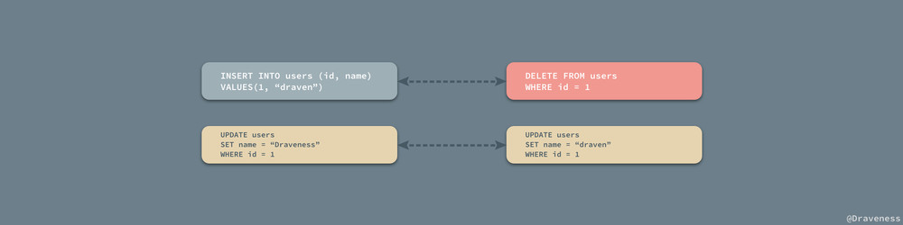
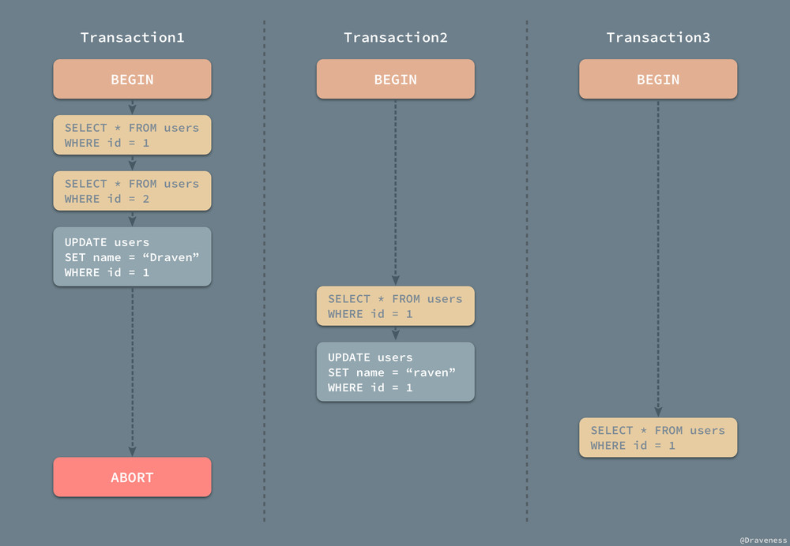
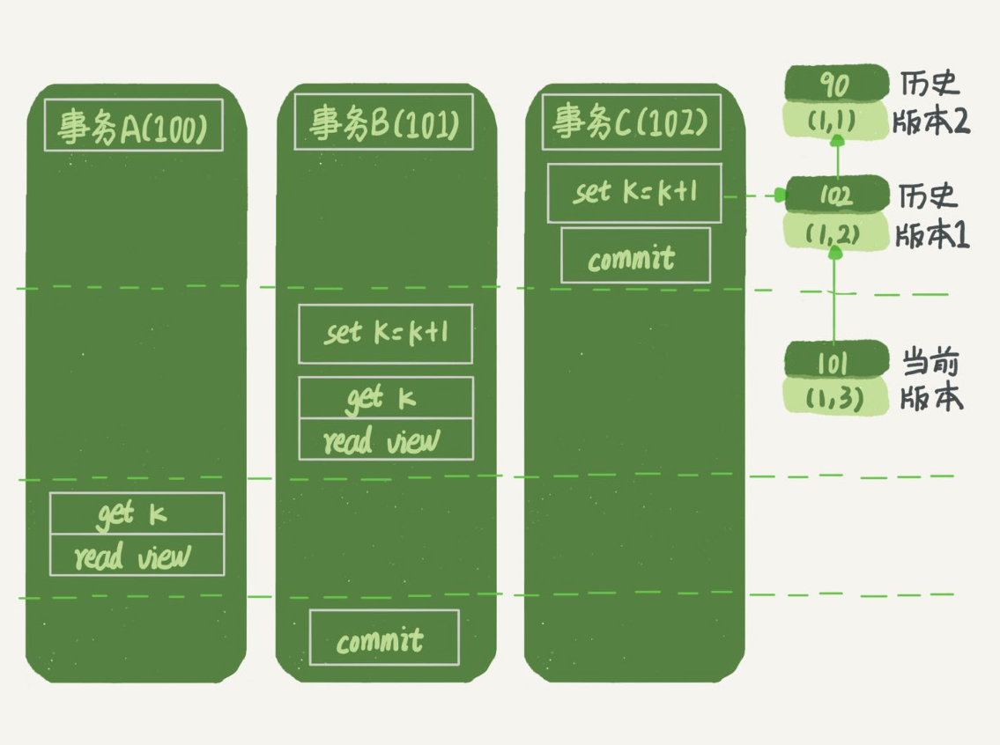

# 『浅入深出』MySQL 中事务的实现


在关系型数据库中，事务的重要性不言而喻，只要对数据库稍有了解的人都知道事务具有 ACID 四个基本属性，而我们不知道的可能就是数据库是如何实现这四个属性的；在这篇文章中，我们将对事务的实现进行分析，尝试理解数据库是如何实现事务的，当然我们也会在文章中简单对 MySQL 中对 ACID 的实现进行简单的介绍。


事务其实就是**并发控制的基本单位**；相信我们都知道，事务是一个序列操作，其中的操作要么都执行，要么都不执行，它是一个不可分割的工作单位；数据库事务的 ACID 四大特性是事务的基础，了解了 ACID 是如何实现的，我们也就清楚了事务的实现，接下来我们将依次介绍数据库是如何实现这四个特性的。


## 原子性


在学习事务时，经常有人会告诉你，事务就是一系列的操作，要么全部都执行，要都不执行，这其实就是对事务原子性的刻画；虽然事务具有原子性，但是原子性并不是只与事务有关系，它的身影在很多地方都会出现。


由于操作并不具有原子性，并且可以再分为多个操作，当这些操作出现错误或抛出异常时，整个操作就可能不会继续执行下去，而已经进行的操作造成的副作用就可能造成数据更新的丢失或者错误。

事务其实和一个操作没有什么太大的区别，它是一系列的数据库操作（可以理解为 SQL）的集合，如果事务不具备原子性，那么就没办法保证同一个事务中的所有操作都被执行或者未被执行了，整个数据库系统就既不可用也不可信。


### undo
log

想要保证事务的原子性，就需要在异常发生时，对已经执行的操作进行**回滚**，而在 MySQL 中，恢复机制是通过*回滚日志*（undo log）实现的，所有事务进行的修改都会先记录到这个回滚日志中，然后在对数据库中的对应行进行写入。


undo
log
和
binlog
一样，同属于逻辑日志，其作用主要是用来实现事务回滚和
MVCC，undo
log 通常保存在共享表 空间内。

当我们对数据进行修改时，除了会产生
redo
log 以外，还会产生
undo
log。当事务执行失败或者是客户端要求回滚事务 时，InnoDB 就可以通过
undo
log 逻辑性地将数据回滚到事务开始时的样子 。

当事务进行回滚时，每一个
INSERT
会对应一个
DELETE，对于每一个
DELETE 会对应一个
INSERT。而对于每一个 UPDATE，InnoDB 会执行一个相反的
UPDATE，把修改的数据再逻辑地回复回去。

另外，InnoDB 通过
undo
log
来实现
MVCC，也就是把数据的历史版本也记录下来。只不过这些数据的历史版本是服 务于
InnoDB 自身事务执行需要的，并不会永久的持久化。




#### undo
log 格式

一般会有两种格式的
undo
log，一种是
insert
undo
log，另一种则是
update
undo
log。我们通常会更关注
update
 undo
log，因为
insert
undo
log 只会在插入数据时产生，我们不会有获取
“插入的这条数据的历史版本” 这种需求


### 事务的状态

因为事务具有原子性，所以从远处看的话，事务就是密不可分的一个整体，事务的状态也只有三种：Active、Commited 和 Failed，事务要不就在执行中，要不然就是成功或者失败的状态：


但是如果放大来看，我们会发现事务不再是原子的，其中包括了很多中间状态，比如部分提交，事务的状态图也变得越来越复杂。


> 事务的状态图以及状态的描述取自 [Database System Concepts](https://www.amazon.com/Database-System-Concepts-Computer-Science/dp/0073523321) 一书中第 14 章的内容。

- Active：事务的初始状态，表示事务正在执行；
- Partially Commited：在最后一条语句执行之后；
- Failed：发现事务无法正常执行之后；
- Aborted：事务被回滚并且数据库恢复到了事务进行之前的状态之后；
- Commited：成功执行整个事务；

虽然在发生错误时，整个数据库的状态可以恢复，但是如果我们在事务中执行了诸如：向标准输出打印日志、向外界发出邮件、没有通过数据库修改了磁盘上的内容甚至在事务执行期间发生了转账汇款，那么这些操作作为可见的外部输出都是没有办法回滚的；这些问题都是由应用开发者解决和负责的，在绝大多数情况下，我们都需要在整个事务提交后，再触发类似的无法回滚的操作。


以订票为例，哪怕我们在整个事务结束之后，才向第三方发起请求，由于向第三方请求并获取结果是一个需要较长时间的操作，如果在事务刚刚提交时，数据库或者服务器发生了崩溃，那么我们就非常有可能丢失发起请求这一过程，这就造成了非常严重的问题；而这一点就不是数据库所能保证的，开发者需要在适当的时候查看请求是否被发起、结果是成功还是失败。


### 并行事务的原子性

到目前为止，所有的事务都只是串行执行的，一直都没有考虑过并行执行的问题；然而在实际工作中，并行执行的事务才是常态，然而并行任务下，却可能出现非常复杂的问题：


当 Transaction1 在执行的过程中对 `id = 1` 的用户进行了读写，但是没有将修改的内容进行提交或者回滚，在这时 Transaction2 对同样的数据进行了读操作并提交了事务；也就是说 Transaction2 是依赖于 Transaction1 的，当 Transaction1 由于一些错误需要回滚时，因为要保证事务的原子性，需要对 Transaction2 进行回滚，但是由于我们已经提交了 Transaction2，所以我们已经没有办法进行回滚操作，在这种问题下我们就发生了问题，[Database System Concepts](https://www.amazon.com/Database-System-Concepts-Computer-Science/dp/0073523321) 一书中将这种现象称为*不可恢复安排*（Nonrecoverable Schedule），那什么情况下是可以恢复的呢？

A recoverable schedule is one where, for each pair of transactions Ti and Tj such that Tj reads a data item previously written by Ti , the commit operation of Ti appears before the commit operation of Tj .


简单理解一下，如果 Transaction2 依赖于事务 Transaction1，那么事务 Transaction1 必须在 Transaction2 提交之前完成提交的操作：


然而这样还不算完，当事务的数量逐渐增多时，整个恢复流程也会变得越来越复杂，如果我们想要从事务发生的错误中恢复，也不是一件那么容易的事情。



在上图所示的一次事件中，Transaction2 依赖于 Transaction1，而 Transaction3 又依赖于 Transaction1，当 Transaction1 由于执行出现问题发生回滚时，为了保证事务的原子性，就会将 Transaction2 和 Transaction3 中的工作全部回滚，这种情况也叫做*级联回滚*（Cascading Rollback），级联回滚的发生会导致大量的工作需要撤回，是我们难以接受的，不过如果想要达到**绝对的**原子性，这件事情又是不得不去处理的，我们会在文章的后面具体介绍如何处理并行事务的原子性。


## 持久性

既然是数据库，那么一定对数据的持久存储有着非常强烈的需求，如果数据被写入到数据库中，那么数据一定能够被安全存储在磁盘上；而事务的持久性就体现在，一旦事务被提交，那么数据一定会被写入到数据库中并持久存储起来。


当事务已经被提交之后，就无法再次回滚了，唯一能够撤回已经提交的事务的方式就是创建一个相反的事务对原操作进行『补偿』，这也是事务持久性的体现之一。


### 重做日志

与原子性一样，事务的持久性也是通过日志来实现的，MySQL 使用重做日志（redo log）实现事务的持久性，重做日志由两部分组成，一是内存中的重做日志缓冲区，因为重做日志缓冲区在内存中，所以它是易失的，另一个就是在磁盘上的重做日志文件，它是持久的。


当我们在一个事务中尝试对数据进行修改时，它会先将数据从磁盘读入内存，并更新内存中缓存的数据，然后生成一条重做日志并写入重做日志缓存，当事务真正提交时，MySQL 会将重做日志缓存中的内容刷新到重做日志文件，再将内存中的数据更新到磁盘上，图中的第 4、5 步就是在事务提交时执行的。

在 InnoDB 中，重做日志都是以 512 字节的块的形式进行存储的，同时因为块的大小与磁盘扇区大小相同，所以重做日志的写入可以保证原子性，不会由于机器断电导致重做日志仅写入一半并留下脏数据。

除了所有对数据库的修改会产生重做日志，因为回滚日志也是需要持久存储的，它们也会创建对应的重做日志，在发生错误后，数据库重启时会从重做日志中找出未被更新到数据库磁盘中的日志重新执行以满足事务的持久性。


### 回滚日志和重做日志

到现在为止我们了解了 MySQL 中的两种日志，回滚日志（undo log）和重做日志（redo log）；在数据库系统中，事务的原子性和持久性是由事务日志（transaction log）保证的，在实现时也就是上面提到的两种日志，前者用于对事务的影响进行撤销，后者在错误处理时对已经提交的事务进行重做，它们能保证两点：

1. 发生错误或者需要回滚的事务能够成功回滚（原子性）；
2. 在事务提交后，数据没来得及写会磁盘就宕机时，在下次重新启动后能够成功恢复数据（持久性）；

在数据库中，这两种日志经常都是一起工作的，我们**可以**将它们整体看做一条事务日志，其中包含了事务的 ID、修改的行元素以及修改前后的值。


一条事务日志同时包含了修改前后的值，能够非常简单的进行回滚和重做两种操作，在这里我们也不会对重做和回滚日志展开进行介绍，可能会在之后的文章谈一谈数据库系统的恢复机制时提到两种日志的使用。


## 隔离性

其实作者在之前的文章 [『浅入浅出』MySQL 和 InnoDB](https://draveness.me/mysql-innodb) 就已经介绍过数据库事务的隔离性，不过为了保证文章的独立性和完整性，我们还会对事务的隔离性进行介绍，介绍的内容可能稍微有所不同。

事务的隔离性是数据库处理数据的几大基础之一，如果没有数据库的事务之间没有隔离性，就会发生在 [并行事务的原子性](https://draveness.me/mysql-transaction/#并行事务的原子性) 一节中提到的级联回滚等问题，造成性能上的巨大损失。如果所有的事务的执行顺序都是线性的，那么对于事务的管理容易得多，但是允许事务的并行执行却能能够提升吞吐量和资源利用率，并且可以减少每个事务的等待时间。


当多个事务同时并发执行时，事务的隔离性可能就会被违反，虽然单个事务的执行可能没有任何错误，但是从总体来看就会造成数据库的一致性出现问题，而串行虽然能够允许开发者忽略并行造成的影响，能够很好地维护数据库的一致性，但是却会影响事务执行的性能。


### 事务的隔离级别

所以说数据库的隔离性和一致性其实是一个需要开发者去权衡的问题，为数据库提供什么样的隔离性层级也就决定了数据库的性能以及可以达到什么样的一致性；在 SQL 标准中定义了四种数据库的事务的隔离级别：`READ UNCOMMITED`、`READ COMMITED`、`REPEATABLE READ` 和 `SERIALIZABLE`；每个事务的隔离级别其实都比上一级多解决了一个问题：

- `RAED UNCOMMITED`：使用查询语句不会加锁，可能会读到未提交的行（Dirty Read）；
- `READ COMMITED`：只对记录加记录锁，而不会在记录之间加间隙锁，所以允许新的记录插入到被锁定记录的附近，所以再多次使用查询语句时，可能得到不同的结果（Non-Repeatable Read）；
- `REPEATABLE READ`：多次读取同一范围的数据会返回第一次查询的快照，不会返回不同的数据行，但是可能发生幻读（Phantom Read）；
- `SERIALIZABLE`：InnoDB 隐式地将全部的查询语句加上共享锁，解决了幻读的问题；

以上的所有的事务隔离级别都不允许脏写入（Dirty Write），也就是当前事务更新了另一个事务已经更新但是还未提交的数据，大部分的数据库中都使用了 READ COMMITED 作为默认的事务隔离级别，但是 MySQL 使用了 REPEATABLE READ 作为默认配置；从 RAED UNCOMMITED 到 SERIALIZABLE，随着事务隔离级别变得越来越严格，数据库对于并发执行事务的性能也逐渐下降。


对于数据库的使用者，从理论上说，并不需要知道事务的隔离级别是如何实现的，我们只需要知道这个隔离级别解决了什么样的问题，但是不同数据库对于不同隔离级别的是实现细节在很多时候都会让我们遇到意料之外的坑。

如果读者不了解脏读、不可重复读和幻读究竟是什么，可以阅读之前的文章 [『浅入浅出』MySQL 和 InnoDB](https://draveness.me/mysql-innodb)，在这里我们仅放一张图来展示各个隔离层级对这几个问题的解决情况。


### 隔离级别的实现

数据库对于隔离级别的实现就是使用**并发控制机制**对在同一时间执行的事务进行控制，限制不同的事务对于同一资源的访问和更新，而最重要也最常见的并发控制机制，在这里我们将简单介绍三种最重要的并发控制器机制的工作原理。


#### 锁

锁是一种最为常见的并发控制机制，在一个事务中，我们并不会将整个数据库都加锁，而是只会锁住那些需要访问的数据项， MySQL 和常见数据库中的锁都分为两种，共享锁（Shared）和互斥锁（Exclusive），前者也叫读锁，后者叫写锁。


读锁保证了读操作可以并发执行，相互不会影响，而写锁保证了在更新数据库数据时不会有其他的事务访问或者更改同一条记录造成不可预知的问题。


#### 时间戳


除了锁，另一种实现事务的隔离性的方式就是通过时间戳，使用这种方式实现事务的数据库，例如 PostgreSQL 会为每一条记录保留两个字段；*读时间戳*中包括了所有访问该记录的事务中的最大时间戳，而记录行的*写时间戳*中保存了将记录改到当前值的事务的时间戳。


使用时间戳实现事务的隔离性时，往往都会使用乐观锁，先对数据进行修改，在写回时再去判断当前值，也就是时间戳是否改变过，如果没有改变过，就写入，否则，生成一个新的时间戳并再次更新数据，乐观锁其实并不是真正的锁机制，它只是一种思想，在这里并不会对它进行展开介绍。


#### 多版本和快照隔离

通过维护多个版本的数据，数据库可以允许事务在数据被其他事务更新时对旧版本的数据进行读取，很多数据库都对这一机制进行了实现；因为所有的读操作不再需要等待写锁的释放，所以能够显著地提升读的性能，MySQL 和 PostgreSQL 都对这一机制进行自己的实现，也就是 MVCC，虽然各自实现的方式有所不同，MySQL 就通过文章中提到的回滚日志实现了 MVCC，保证事务并行执行时能够不等待互斥锁的释放直接获取数据。


### 隔离性与原子性

在这里就需要简单提一下在在原子性一节中遇到的级联回滚等问题了，如果一个事务对数据进行了写入，这时就会获取一个互斥锁，其他的事务就想要获得改行数据的读锁就必须等待写锁的释放，自然就不会发生级联回滚等问题了。


不过在大多数的数据库，比如 MySQL 中都使用了 MVCC 等特性，也就是正常的读方法是不需要获取锁的，在想要对读取的数据进行更新时需要使用 `SELECT ... FOR UPDATE` 尝试获取对应行的互斥锁，以保证不同事务可以正常工作。


### InnoDB-undo-log与MVCC


#### “快照”在 MVCC 里是怎么工作的

在可重复读隔离级别下，事务在启动的时候就“拍了个快照”。注意，这个快照是基于整库的。

这时，你会说这看上去不太现实啊。如果一个库有 100G，那么我启动一个事务，MySQL 就要拷贝 100G 的数据出来，这个过程得多慢啊。可是，我平时的事务执行起来很快啊。

实际上，我们并不需要拷贝出这 100G 的数据。我们先来看看这个快照是怎么实现的。

InnoDB 里面每个事务有一个唯一的事务 ID，叫作 transaction id。它是在事务开始的时候向 InnoDB 的事务系统申请的，是按申请顺序严格递增的。

而每行数据也都是有多个版本的。每次事务更新数据的时候，都会生成一个新的数据版本，并且把 transaction id 赋值给这个数据版本的事务 ID，记为 row trx_id。同时，旧的数据版本要保留，并且在新的数据版本中，能够有信息可以直接拿到它。

也就是说，数据表中的一行记录，其实可能有多个版本 (row)，每个版本有自己的 row trx_id。

如图所示，就是一个记录被多个事务连续更新后的状态。

                                                

图中虚线框里是同一行数据的 4 个版本，当前最新版本是 V4，k 的值是 22，它是被 transaction id 为 25 的事务更新的，因此它的 row trx_id 也是 25。

你可能会问，前面的文章不是说，语句更新会生成 undo log（回滚日志）吗？那么，**undo log 在哪呢？**

实际上，图 2 中的三个虚线箭头，就是 **undo log**；而 V1、V2、V3 并不是物理上真实存在的，而是每次需要的时候根据当前版本和 undo log 计算出来的。比如，需要 V2 的时候，就是通过 V4 依次执行 U3、U2 算出来。

明白了多版本和 row trx_id 的概念后，我们再来想一下，InnoDB 是怎么定义那个“100G”的快照的。

按照可重复读的定义，一个事务启动的时候，能够看到所有已经提交的事务结果。但是之后，这个事务执行期间，其他事务的更新对它不可见。

因此，一个事务只需要在启动的时候声明说，“以我启动的时刻为准，如果一个数据版本是在我启动之前生成的，就认；如果是我启动以后才生成的，我就不认，我必须要找到它的上一个版本”。

当然，如果“上一个版本”也不可见，那就得继续往前找。还有，如果是这个事务自己更新的数据，它自己还是要认的。

在实现上， InnoDB 为每个事务构造了一个数组，用来保存这个事务启动瞬间，当前正在“活跃”的所有事务 ID。“活跃”指的就是，启动了但还没提交。

**数组里面事务 ID 的最小值记为低水位，当前系统里面已经创建过的事务 ID 的最大值加 1 记为高水位。**

这个视图数组和高水位，就组成了当前事务的一致性视图（read-view）。

而数据版本的可见性规则，就是基于数据的 row trx_id 和这个一致性视图的对比结果得到的。

这个视图数组把所有的 row trx_id 分成了几种不同的情况。


1. 如果落在绿色部分，表示这个版本是已提交的事务或者是当前事务自己生成的，这个数据是可见的；
2. 如果落在红色部分，表示这个版本是由将来启动的事务生成的，是肯定不可见的；
3. 如果落在黄色部分，那就包括两种情况
   a. 若 row trx_id 在数组中，表示这个版本是由还没提交的事务生成的，不可见；
   b. 若 row trx_id 不在数组中，表示这个版本是已经提交了的事务生成的，可见。


比如，对于图 2 中的数据来说，如果有一个事务，它的低水位是 18，那么当它访问这一行数据时，就会从 V4 通过 U3 计算出 V3，所以在它看来，这一行的值是 11。

你看，有了这个声明后，系统里面随后发生的更新，是不是就跟这个事务看到的内容无关了呢？因为之后的更新，生成的版本一定属于上面的 2 或者 3(a) 的情况，而对它来说，这些新的数据版本是不存在的，所以这个事务的快照，就是“静态”的了。

所以你现在知道了，**InnoDB 利用了“所有数据都有多个版本”的这个特性，实现了“秒级创建快照”的能力。**


接下来，我们继续看一下图 1 中的三个事务，分析下事务 A 的语句返回的结果，为什么是 k=1。

这里，我们不妨做如下假设：

1. 事务 A 开始前，系统里面只有一个活跃事务 ID 是 99；
2. 事务 A、B、C 的版本号分别是 100、101、102，且当前系统里只有这四个事务；
3. 三个事务开始前，(1,1）这一行数据的 row trx_id 是 90。

这样，事务 A 的视图数组就是 [99,100], 事务 B 的视图数组是 [99,100,101], 事务 C 的视图数组是 [99,100,101,102]。

为了简化分析，我先把其他干扰语句去掉，只画出跟事务 A 查询逻辑有关的操作：


从图中可以看到，第一个有效更新是事务 C，把数据从 (1,1) 改成了 (1,2)。这时候，这个数据的最新版本的 row trx_id 是 102，而 90 这个版本已经成为了历史版本。

第二个有效更新是事务 B，把数据从 (1,2) 改成了 (1,3)。这时候，这个数据的最新版本（即 row trx_id）是 101，而 102 又成为了历史版本。

你可能注意到了，在事务 A 查询的时候，其实事务 B 还没有提交，但是它生成的 (1,3) 这个版本已经变成当前版本了。但这个版本对事务 A 必须是不可见的，否则就变成脏读了。

好，现在事务 A 要来读数据了，它的视图数组是 [99,100]。当然了，读数据都是从当前版本读起的。所以，事务 A 查询语句的读数据流程是这样的：

- 找到 (1,3) 的时候，判断出 row trx_id=101，比高水位大，处于红色区域，不可见；
- 接着，找到上一个历史版本，一看 row trx_id=102，比高水位大，处于红色区域，不可见；
- 再往前找，终于找到了（1,1)，它的 row trx_id=90，比低水位小，处于绿色区域，可见。

这样执行下来，虽然期间这一行数据被修改过，但是事务 A 不论在什么时候查询，看到这行数据的结果都是一致的，所以我们称之为一致性读。

这个判断规则是从代码逻辑直接转译过来的，但是正如你所见，用于人肉分析可见性很麻烦。

所以，我来给你翻译一下。一个数据版本，对于一个事务视图来说，除了自己的更新总是可见以外，有三种情况：

1. 版本未提交，不可见；
2. 版本已提交，但是是在视图创建后提交的，不可见；
3. 版本已提交，而且是在视图创建前提交的，可见。

现在，我们用这个规则来判断图 4 中的查询结果，事务 A 的查询语句的视图数组是在事务 A 启动的时候生成的，这时候：

- (1,3) 还没提交，属于情况 1，不可见；
- (1,2) 虽然提交了，但是是在视图数组创建之后提交的，属于情况 2，不可见；
- (1,1) 是在视图数组创建之前提交的，可见。

你看，去掉数字对比后，只用时间先后顺序来判断，分析起来是不是轻松多了。所以，后面我们就都用这个规则来分析。


##### 更新逻辑

细心的同学可能有疑问了：**事务 B 的 update 语句，如果按照一致性读，好像结果不对哦？**

你看图 5 中，事务 B 的视图数组是先生成的，之后事务 C 才提交，不是应该看不见 (1,2) 吗，怎么能算出 (1,3) 来？


是的，如果事务 B 在更新之前查询一次数据，这个查询返回的 k 的值确实是 1。

但是，当它要去更新数据的时候，就不能再在历史版本上更新了，否则事务 C 的更新就丢失了。因此，事务 B 此时的 set k=k+1 是在（1,2）的基础上进行的操作。

所以，这里就用到了这样一条规则：**更新数据都是先读后写的，而这个读，只能读当前的值，称为“当前读”（current read）。**

因此，在更新的时候，当前读拿到的数据是 (1,2)，更新后生成了新版本的数据 (1,3)，这个新版本的 row trx_id 是 101。

所以，在执行事务 B 查询语句的时候，一看自己的版本号是 101，最新数据的版本号也是 101，是自己的更新，可以直接使用，所以查询得到的 k 的值是 3。

这里我们提到了一个概念，叫作当前读。其实，除了 update 语句外，select 语句如果加锁，也是当前读。

所以，如果把事务 A 的查询语句 select * from t where id=1 修改一下，加上 lock in share mode 或 for update，也都可以读到版本号是 101 的数据，返回的 k 的值是 3。下面这两个 select 语句，就是分别加了读锁（S 锁，共享锁）和写锁（X 锁，排他锁）。

```java
mysql> select k from t where id=1 lock in share mode;
mysql> select k from t where id=1 for update;
```

再往前一步，假设事务 C 不是马上提交的，而是变成了下面的事务 C’，会怎么样呢？


​                                                                      *图 6 事务 A、B、C'的执行流程*

事务 C’的不同是，更新后并没有马上提交，在它提交前，事务 B 的更新语句先发起了。前面说过了，虽然事务 C’还没提交，但是 (1,2) 这个版本也已经生成了，并且是当前的最新版本。那么，事务 B 的更新语句会怎么处理呢？

这时候，我们在上一篇文章中提到的“两阶段锁协议”就要上场了。事务 C’没提交，也就是说 (1,2) 这个版本上的写锁还没释放。而事务 B 是当前读，必须要读最新版本，而且必须加锁，因此就被锁住了，必须等到事务 C’释放这个锁，才能继续它的当前读。

                                                                                          

​                                                               *图 7 事务 B 更新逻辑图（配合事务 C')*

到这里，我们把一致性读、当前读和行锁就串起来了。

现在，我们再回到文章开头的问题：**事务的可重复读的能力是怎么实现的？**

可重复读的核心就是一致性读（consistent read）；而事务更新数据的时候，只能用当前读。如果当前的记录的行锁被其他事务占用的话，就需要进入锁等待。

而读提交的逻辑和可重复读的逻辑类似，它们最主要的区别是：

- 在可重复读隔离级别下，只需要在事务开始的时候创建一致性视图，之后事务里的其他查询都共用这个一致性视图；
- 在读提交隔离级别下，每一个语句执行前都会重新算出一个新的视图。

那么，我们再看一下，在读提交隔离级别下，事务 A 和事务 B 的查询语句查到的 k，分别应该是多少呢？

这里需要说明一下，“start transaction with consistent snapshot; ”的意思是从这个语句开始，创建一个持续整个事务的一致性快照。所以，在读提交隔离级别下，这个用法就没意义了，等效于普通的 start transaction。

下面是读提交时的状态图，可以看到这两个查询语句的创建视图数组的时机发生了变化，就是图中的 read view 框。（注意：这里，我们用的还是事务 C 的逻辑直接提交，而不是事务 C’）



​                                                                      *读提交隔离级别下的事务状态图*

这时，事务 A 的查询语句的视图数组是在执行这个语句的时候创建的，时序上 (1,2)、(1,3) 的生成时间都在创建这个视图数组的时刻之前。但是，在这个时刻：

- (1,3) 还没提交，属于情况 1，不可见；
- (1,2) 提交了，属于情况 3，可见。

所以，这时候事务 A 查询语句返回的是 k=2。

显然地，事务 B 查询结果 k=3。


##### 小结

InnoDB 的行数据有多个版本，每个数据版本有自己的 row trx_id，每个事务或者语句有自己的一致性视图。普通查询语句是一致性读，一致性读会根据 row trx_id 和一致性视图确定数据版本的可见性。

- 对于可重复读，查询只承认在事务启动前就已经提交完成的数据；
- 对于读提交，查询只承认在语句启动前就已经提交完成的数据；

而当前读，总是读取已经提交完成的最新版本。


#### MVCC


##### 基本概念

MVCC，Multiversion
Concurrency
Control，即多版本并发控制，主要用来实现事务的隔离性（RR）以及一致性非锁定 读，后者又常常被称为快照读。通过一致性非锁定读，可以极大地提高数据库的并发性能。

通过
undo
log 中记录的信息，我们就可以实现
MVCC 了。在
MySQL 中，MVCC 的主要作用就是实现事务的隔离性， 这里尤指
Repeated
Read(RR) 事务隔离级别，同时也给一致性非锁定读提供了实现的可能。


##### 实现


上图即为
InnoDB
Compact 行记录格式，与
MVCC 相关的字段就是事务
ID 和回滚指针，回滚指针指向
undo
log 中的记录。

当我们进行数据读取时，也会有一个事务
ID 产生，若某一行数据存在 多个版本，那么当前事务只会去读取小于该事务
ID 的最新数据。


## 一致性

作者认为数据库的一致性是一个非常让人迷惑的概念，原因是数据库领域其实包含两个一致性，一个是 ACID 中的一致性、另一个是 CAP 定义中的一致性。


这两个数据库的一致性说的**完全不是**一个事情，很多很多人都对这两者的概念有非常深的误解，当我们在讨论数据库的一致性时，一定要清楚上下文的语义是什么，尽量明确的问出我们要讨论的到底是 ACID 中的一致性还是 CAP 中的一致性。


### ACID

数据库对于 ACID 中的一致性的定义是这样的：如果一个事务原子地在一个一致地数据库中独立运行，那么在它执行之后，数据库的状态一定是一致的。对于这个概念，它的第一层意思就是对于数据完整性的约束，包括主键约束、引用约束以及一些约束检查等等，在事务的执行的前后以及过程中不会违背对数据完整性的约束，所有对数据库写入的操作都应该是合法的，并不能产生不合法的数据状态。

> A transaction must preserve database consistency - if a transaction is run atomically in isolation starting from a consistent database, the database must again be consistent at the end of the transaction.

我们可以将事务理解成一个函数，它接受一个外界的 SQL 输入和一个一致的数据库，它一定会返回一个一致的数据库。


而第二层意思其实是指逻辑上的对于开发者的要求，我们要在代码中写出正确的事务逻辑，比如银行转账，事务中的逻辑不可能只扣钱或者只加钱，这是应用层面上对于数据库一致性的要求。

> Ensuring consistency for an individual transaction is the responsibility of the application programmer who codes the transaction. - [Database System Concepts](https://www.amazon.com/Database-System-Concepts-Computer-Science/dp/0073523321)

数据库 ACID 中的一致性对事务的要求不止包含对数据完整性以及合法性的检查，还包含应用层面逻辑的正确。

CAP 定理中的数据一致性，其实是说分布式系统中的各个节点中对于同一数据的拷贝有着相同的值；而 ACID 中的一致性是指数据库的规则，如果 schema 中规定了一个值必须是唯一的，那么一致的系统必须确保在所有的操作中，该值都是唯一的，由此来看 CAP 和 ACID 对于一致性的定义有着根本性的区别。


