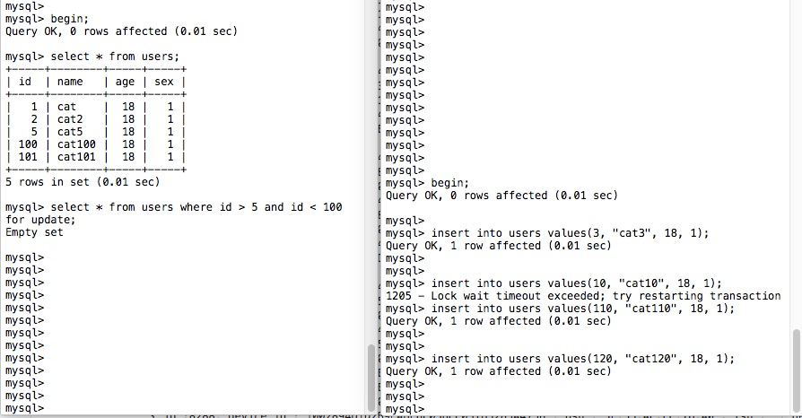

# RR 事务级别下触发幻读的场景及解决方法

> 知识点预读：MVCC、ReadView、快照读/当前读、for update / lock in share mode、间隙锁、行锁、nextKeyLock 以及锁的降级。


### 幻读的定义

在 `同一` 事务中，前后多次 `select` 得到了不同的结果集，称之为 `幻读`。

其实 `R-UC` / `RC` 存在 `幻读`，`SERIALIZE` 防止了 `幻读`，大家没有太大的争议，争论主要集中在 `RR` 到底存不存在 `幻读` 的问题。

`RR` 在 `RV` + `MVCC` 机制的作用下，似乎不会存在 `幻读` 的问题，不然就推翻了 `可重复读` 的特性了。其实并非如此，这里涉及到了 `快照读` 和 `当前读` 的相关概念。

后文将以实例来讲解 `RR` 下 `触发` 及 `解决` `幻读` 的场景。解决 `幻读` 的关键，是从 `RR` 级别开始支持的 `next-key lock` 锁机制，通过 `当前读` 给我们要操作的`数据记录及区间加锁`，防止其他事务对此区间内的数据做`更新、删除、插入`操作，进而避免的`幻读`。


### 快照读 / 当前读


#### `快照读`

`RC` / `RR` 级别下的 `select` 都是 `快照读`。

`RC` 是 `快照(ReadView)`。
任一`事务提交`后，如对数据做了修改则会刷新数据的 `快照版本号`，其他事务做 `select` 快照读时，会对比自身当前持有的 `快照版本号` 与数据的 `快照版本号` 是否一致，若不一致，则 `当前读` 并生成一份新的快照，实现了`读已提交`和`未提交快照读`的机制。

`RR` 是 `快照(ReadView)` + `多版本控制(MVCC)`。
`多版本控制` 使得各事务都维护了一份自己的数据快照，即 `事务A一个数据快照版本`， `事务B一个数据快照版本`，在本事务内使用 `!快照读! select` 是 `可重复读` 的，不会导致 `幻读`。


#### `当前读`

`insert / update / delete`
`select ... for update / lock in share mode`
`R-UC` / `SERIALIZE` 级别下的 `select` 都是当前读。


### 行锁 / 间隙锁 / next-key lock

```
行锁` = `等值锁定的索引`
`间隙锁` = `mysql8.0 后加锁比较容易理解，左开右闭，与where条件的范围一致`
`next-key lock` = `行锁` + `间隙锁
```


### 事务隔离级别


#### READ-UNCOMMITED

`读未提交` 存在 `脏读`、`幻读`。

支持 `行锁` + `表锁`。

这个很容易理解，肯定会有 `幻读` 的问题。`事务A` 执行期间，`其他事务` 有写入操作，因为本级别没有 `快照`，更没有 `MVCC` 机制，其他事务修改数据后即便不做提交，`事务A` 使用 `select` 也会因为直接为 `当前读` 的模式，前后得到不同的结果导致 `幻读`。

同时，其他事务最终可能会执行 `回滚` 操作，导致了 `事务A` 的 `脏读`。


#### READ-COMMITED

`读已提交` 存在 `幻读`。

支持 `行锁` + `表锁`。

这个也很容易理解，只需其他事务在 `事务A` 执行期间，做一次数据插入并 `提交` 事务，`事务A` 就会 `select` 出不同的结果导致 `幻读`。

`脏读` 问题被 `快照（ReadView）` 机制解决。


#### REPEATABLE-READ

`可重复读` 存在 `幻读`，但也可以 `避免` 幻读。

支持 `行锁`+`间隙锁(gap)`+`next-key lock(行锁+间隙锁)`+`表锁`。

正式因为本级别开始支持 `next-key lock` 机制，才有了解决幻读的可能。`行锁` 锁定等值记录，阻塞他事务的 `即时读` 操作，`间隙锁` 根据不同的查询条件，锁住与 `行` 相关的一个 `索引区间`，阻塞他事务对此 `索引区间` 做 `即时读` 操作（比如最直接引发幻读的 `insert` 操作）。

```
RR 下幻读的场景模拟
```

简单说前使用快照读，后使用当前读，导致 `事务A` 没有 `next-key lock` 锁定索引区间，其他事务对 `事务A所覆盖的查询范围中` 元数据做了 `增删改`，而后 `事务A` 又切换为 `当前读` 而非继续使用 `快照读`，导致事务内前后查询到的数据集合不一致，出现了 `幻读`。

```sql
-- 事务A
begin;
-- step1 快照读 不加锁 空结果集
select * from users where id >= 1;
-- step4 快照读 不会导致幻读 空结果集
select * from users where id >= 1;
-- step5 即时读 查询出事务B插入的数据 发生幻读
select * from users where id >= 1 for update;
-- step6
commit;

-- 事务B
begin;
-- step2 直接插入成功
insert into users value(1, "sqrt", 18, 1), (2, "cat", 19, 1);
-- step3
commit;
RR 下杜绝幻读的方法
```

不使用 `快照读`，始终使用 `当前读`，触发 `next-key lock` 锁机制，阻塞其他事务对当前事务查询条件所能覆盖的索引区间的数据 `当前读` 操作。（其实就相当于 `SERIALIZE` 级别了，该级别下没有 `快照读`，会默认的给 `select` 也追加上 `lock in share mode` 的 `读锁`）;


```sql
-- 事务A
begin;
-- step1 加上了间隙锁 [1, +无穷)
select * from users where id >= 1 for update;
-- step3 快照读/即时读 都不会出现幻读
select * from users where id >= 1;
select * from users where id >= 1 for update;
-- step4
commit;

-- 事务B
begin;
-- step2 会因为事务A step1 的间隙锁被阻塞
insert into users value(1, "sqrt", 18, 1), (2, "cat", 19, 1);
-- step5 事务A提交后 锁释放 才会执行插入
commit;
```


#### SERIALIZE

`序列化模式`，解决了 `幻读` 问题。

所有的操作都做了锁机制，对某数据的访存已经转为串行化。该模式下对 `select` 也隐式添加了 `lock in share mode` 的 `读锁`，故也没有 `快照读` 一说了。

支持 `行锁`+`间隙锁（gap）`+`next-key lock(行锁+间隙锁)`+`表锁`。


### 加锁实例

`主键等值查询，数据不存在，会对相邻数据的主键区间加间隙锁`

空表，`主键 100` 的 `数据记录不存在`，则对相邻数据主键的范围区间加锁 `(0, +∞]`，对于空表来讲，就是`表锁`了


非空表，`主键 10` 的 `数据记录不存在`，则对相邻数据主键的范围区间加锁 `(5, 100]`


`主键等值查询，且数据存在，则为行锁，不影响其他事务对其他数据行的操作`


`主键范围查询，锁定范围区间`




### 总结

1、RR 级别下的确存在幻读的可能（执行当前读模式，摒弃了MVCC机制）
2、RR 级别下通过合理的加锁，来启用 next-key Lock，即便是当前读，也是可以防止幻读的。
3、Serialize 级别则是自动对 select 做 lock in share mode 的加锁模式，防止其他事务的当前读来修改数据，杜绝幻读。


转自：https://segmentfault.com/a/1190000042791612