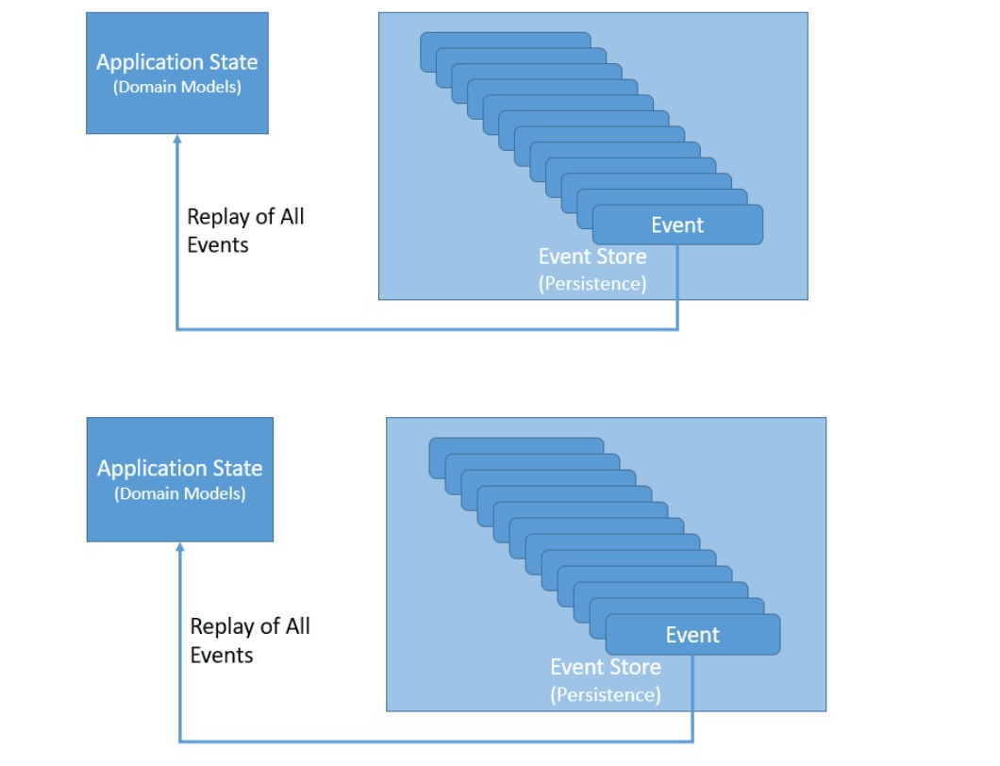
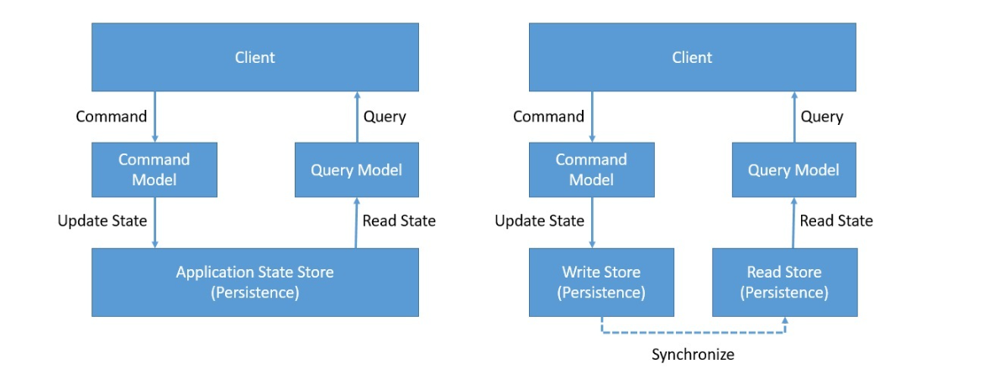
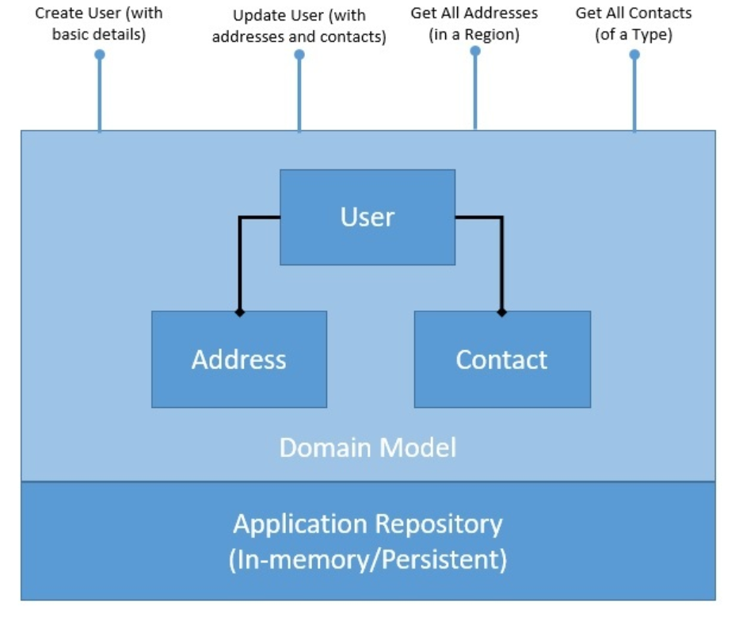
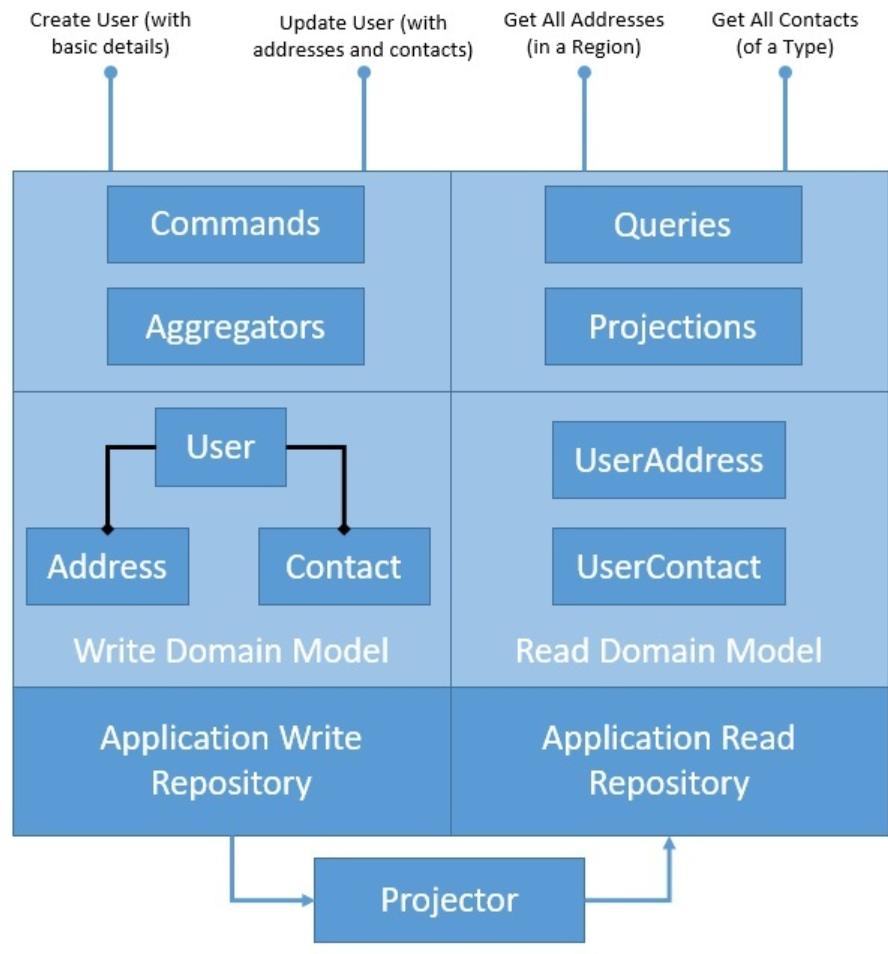
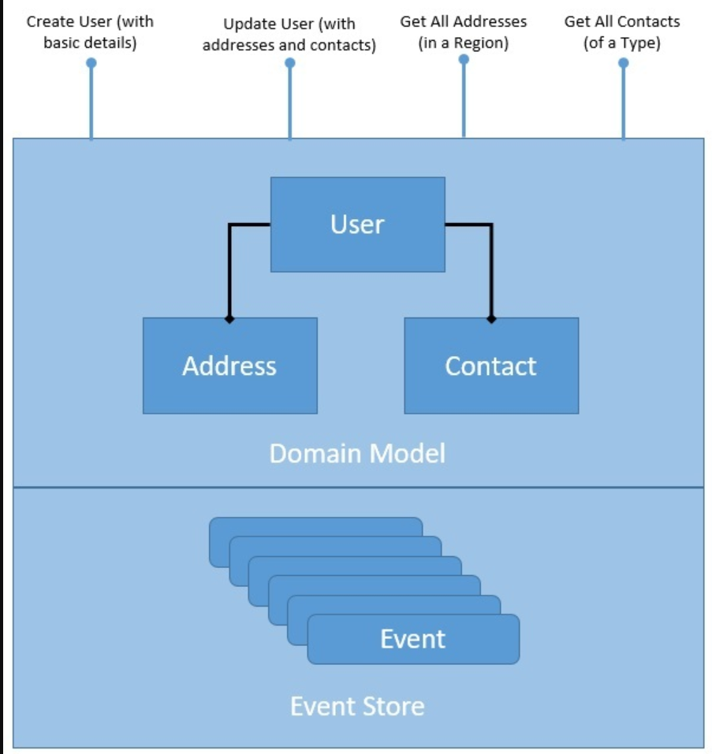
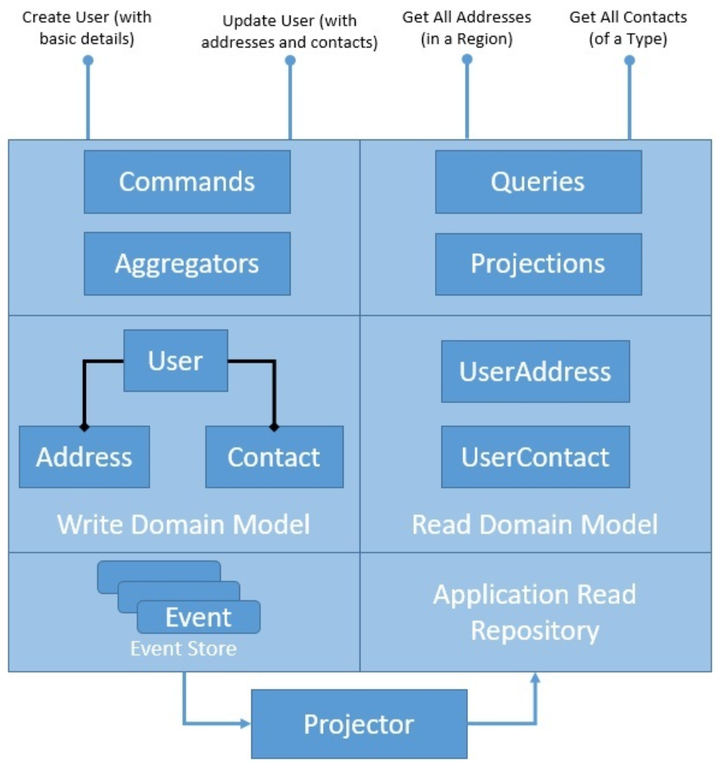

# CQRS and Event Sourcing in Java


## 1. Introduction


In this tutorial, we'll explore the basic concepts of Command Query Responsibility Segregation (CQRS) and Event Sourcing design patterns.

While often cited as complementary patterns, we'll try to understand them separately and finally see how they complement each other. There are several tools and frameworks, such as [Axon](https://www.baeldung.com/axon-cqrs-event-sourcing), to help adopt these patterns, but we'll create a simple application in Java to understand the basics.

## 2. Basic Concepts


We'll first understand these patterns theoretically before we attempt to implement them. Also, as they stand as individual patterns quite well, we'll try to understand without mixing them.

Please note that these patterns are often used together in an enterprise application. In this regard, they also benefit from several other enterprise architecture patterns. We'll discuss some of them as we go along.

### 2.1. Event Sourcing

Event Sourcing **gives us a new way of persisting application state as an ordered sequence of events**. We can selectively query these events and reconstruct the state of the application at any point in time. Of course, to make this work, we need to reimage every change to the state of the application as events:



These events here **are facts that have happened and can not be altered** — in other words, they must be immutable. Recreating the application state is just a matter of replaying all the events.

Note that this also opens up the possibility to replay events selectively, replay some events in reverse, and much more. As a consequence, we can treat the application state itself as a secondary citizen, with the event log as our primary source of truth.


### 2.2. CQRS

Put simply, CQRS is **about segregating the command and query side of the application architecture**. CQRS is based on the Command Query Separation (CQS) principle which was suggested by Bertrand Meyer. CQS suggests that we divide the operations on domain objects into two distinct categories: Queries and Commands:


  **Queries return a result and do not change the observable state** of a system. **Commands change the state of the system but do not necessarily return a value**.

We achieve this by cleanly separating the Command and Query sides of the domain model. We can take a step further, splitting the write and read side of the data store as well, of course, by introducing a mechanism to keep them in sync.


## 3. A Simple Application

We'll begin by describing a simple application in Java that builds a domain model.

The application will [offer CRUD operations on the domain model](https://www.baeldung.com/spring-boot-crud-thymeleaf) and will also feature a persistence for the domain objects. **CRUD stands for Create, Read, Update, and Delete, which are basic operations that we can perform** on a domain object.

We'll use the same application to introduce Event Sourcing and CQRS in later sections.

In the process, we'll leverage some of [the concepts from Domain-Driven Design (DDD)](https://www.baeldung.com/spring-data-ddd) in our example.

**DDD addresses the analysis and design of software that relies on complex domain-specific knowledge**. It builds upon the idea that software systems need to be based on a well-developed model of a domain. DDD was first prescribed by Eric Evans as a catalog of patterns. We'll be using some of these patterns to build our example.


### 3.1. Application Overview

Creating a user profile and managing it is a typical requirement in many applications. We'll define a simple domain model capturing the user profile along with a persistence:


  As we can see, our domain model is normalized and exposes several CRUD operations. These operations are **just for demonstration and can be simple or complex depending upon the requirements**. Moreover, the persistence repository here can be in-memory or use a database instead.


### 3.2. Application Implementation

First, we'll have to create Java classes representing our domain model. This is **a fairly simple domain model and may not even require the complexities of design patterns** like Event Sourcing and CQRS. However, we'll keep this simple to focus on understanding the basics:

```java
public class User {
private String userid;
    private String firstName;
    private String lastName;
    private Set<Contact> contacts;
    private Set<Address> addresses;
    // getters and setters
}

public class Contact {
    private String type;
    private String detail;
    // getters and setters
}

public class Address {
    private String city;
    private String state;
    private String postcode;
    // getters and setters
}
```

Also, we'll define a simple in-memory repository for the persistence of our application state. Of course, this does not add any value but suffices for our demonstration later:

```java
public class UserRepository {
    private Map<String, User> store = new HashMap<>();
}
```

Now, we'll define a service to expose typical CRUD operations on our domain model:

```java
public class UserService {
    private UserRepository repository;
    public UserService(UserRepository repository) {
        this.repository = repository;
    }

    public void createUser(String userId, String firstName, String lastName) {
        User user = new User(userId, firstName, lastName);
        repository.addUser(userId, user);
    }

    public void updateUser(String userId, Set<Contact> contacts, Set<Address> addresses) {
        User user = repository.getUser(userId);
        user.setContacts(contacts);
        user.setAddresses(addresses);
        repository.addUser(userId, user);
    }

    public Set<Contact> getContactByType(String userId, String contactType) {
        User user = repository.getUser(userId);
        Set<Contact> contacts = user.getContacts();
        return contacts.stream()
          .filter(c -> c.getType().equals(contactType))
          .collect(Collectors.toSet());
    }

    public Set<Address> getAddressByRegion(String userId, String state) {
        User user = repository.getUser(userId);
        Set<Address> addresses = user.getAddresses();
        return addresses.stream()
          .filter(a -> a.getState().equals(state))
          .collect(Collectors.toSet());
    }
}
```

That's pretty much what we have to do to set up our simple application. This is **far from being production-ready code, but it exposes some of the important points** that we're going to deliberate on later in this tutorial.

### 3.3. Problems in This Application

Before we proceed any further in our discussion with Event Sourcing and CQRS, it's worthwhile to discuss the problems with the current solution. After all, we'll be addressing the same problems by applying these patterns!

Out of many problems that we may notice here, we'll just like to focus on two of them:

- *Domain Model*: The read and write operations are happening over the same domain model. While this is not a problem for a simple domain model like this, it may worsen as the domain model gets complex. **We may need to optimize our domain model and the underlying storage for them to suit the individual needs of the read and write operations.**
- *Persistence*: The persistence we have for our domain objects stores only the latest state of the domain model. While this is sufficient for most situations, it makes some tasks challenging. **For instance, if we have to perform a historical audit of how the domain object has changed state, it's not possible here**. We have to supplement our solution with some audit logs to achieve this.


## 4. Introducing CQRS

We'll begin addressing the first problem we discussed in the last section by introducing the CQRS pattern in our application. As part of this, **we'll separate the domain model and its persistence to handle write and read operations**. Let's see how CQRS pattern restructures our application:


 

The diagram here explains how we intend to cleanly separate our application architecture to write and read sides. However, we have introduced quite a few new components here that we must understand better. Please note that these are not strictly related to CQRS, but CQRS greatly benefits from them:

- *Aggregate/Aggregator*:

Aggregate is **a pattern described in Domain-Driven Design (DDD) that logically groups different entities by binding entities to an aggregate root**. The aggregate pattern provides transactional consistency between the entities.

CQRS naturally benefits from the aggregate pattern, which groups the write domain model, providing transactional guarantees. Aggregates normally hold a cached state for better performance but can work perfectly without it.

- *Projection/Projector*:

Projection is another important pattern which greatly benefits CQRS. Projection **essentially means representing domain objects in different shapes and structures**.

These projections of original data are read-only and highly optimized to provide an enhanced read experience. We may again decide to cache projections for better performance, but that's not a necessity.


### 4.1. Implementing Write Side of Application

Let's first implement the write side of the application.

We'll begin by defining the required commands. A **command is an intent to mutate the state of the domain model**. Whether it succeeds or not depends on the business rules that we configure.

Let's see our commands:

```java
public class CreateUserCommand {
    private String userId;
    private String firstName;
    private String lastName;
}

public class UpdateUserCommand {
    private String userId;
    private Set<Address> addresses;
    private Set<Contact> contacts;
}
```

These are pretty simple classes that hold the data we intend to mutate.

Next, we define an aggregate that's responsible for taking commands and handling them. Aggregates may accept or reject a command:

```java
public class UserAggregate {
    private UserWriteRepository writeRepository;
    public UserAggregate(UserWriteRepository repository) {
        this.writeRepository = repository;
    }

    public User handleCreateUserCommand(CreateUserCommand command) {
        User user = new User(command.getUserId(), command.getFirstName(), command.getLastName());
        writeRepository.addUser(user.getUserid(), user);
        return user;
    }

    public User handleUpdateUserCommand(UpdateUserCommand command) {
        User user = writeRepository.getUser(command.getUserId());
        user.setAddresses(command.getAddresses());
        user.setContacts(command.getContacts());
        writeRepository.addUser(user.getUserid(), user);
        return user;
    }
}
```

The aggregate uses a repository to retrieve the current state and persist any changes to it. Moreover, it may store the current state locally to avoid the round-trip cost to a repository while processing every command.

Finally, we need a repository to hold the state of the domain model. This will typically be a database or other durable store, but here we'll simply replace them with an in-memory data structure:

```java
public class UserWriteRepository {
    private Map<String, User> store = new HashMap<>();
    // accessors and mutators
}
```

This concludes the write side of our application.


### 4.2. Implementing Read Side of Application

Let's switch over to the read side of the application now. We'll begin by defining the read side of the domain model:

```java
public class UserAddress {
    private Map<String, Set<Address>> addressByRegion = new HashMap<>();
}

public class UserContact {
    private Map<String, Set<Contact>> contactByType = new HashMap<>();
}
```

If we recall our read operations, it's not difficult to see that these classes map perfectly well to handle them. That is the beauty of creating a domain model centered around queries we have.

Next, we'll define the read repository. Again, we'll just use an in-memory data structure, even though this will be a more durable data store in real applications:

```java
public class UserReadRepository {
    private Map<String, UserAddress> userAddress = new HashMap<>();
    private Map<String, UserContact> userContact = new HashMap<>();
    // accessors and mutators
}
```

Now, we'll define the required queries we have to support. A query is an intent to get data — it may not necessarily result in data.

Let's see our queries:

```java
public class ContactByTypeQuery {
    private String userId;
    private String contactType;
}

public class AddressByRegionQuery {
    private String userId;
    private String state;
}
```

Again, these are simple Java classes holding the data to define a query.

What we need now is a projection that can handle these queries:

```java
public class UserProjection {
    private UserReadRepository readRepository;
    public UserProjection(UserReadRepository readRepository) {
        this.readRepository = readRepository;
    }

    public Set<Contact> handle(ContactByTypeQuery query) {
        UserContact userContact = readRepository.getUserContact(query.getUserId());
        return userContact.getContactByType()
          .get(query.getContactType());
    }

    public Set<Address> handle(AddressByRegionQuery query) {
        UserAddress userAddress = readRepository.getUserAddress(query.getUserId());
        return userAddress.getAddressByRegion()
          .get(query.getState());
    }
}
```

The projection here uses the read repository we defined earlier to address the queries we have. This pretty much concludes the read side of our application as well.


### 4.3. Synchronizing Read and Write Data

One piece of this puzzle is still unsolved: there's nothing to **synchronize our write and read repositories**.

This is where we'll need something known as a projector. A **projector has the logic to project the write domain model into the read domain model**.

There are much more sophisticated ways to handle this, but we'll keep it relatively simple:

```java
public class UserProjector {
    UserReadRepository readRepository = new UserReadRepository();
    public UserProjector(UserReadRepository readRepository) {
        this.readRepository = readRepository;
    }

    public void project(User user) {
        UserContact userContact = Optional.ofNullable(
          readRepository.getUserContact(user.getUserid()))
            .orElse(new UserContact());
        Map<String, Set<Contact>> contactByType = new HashMap<>();
        for (Contact contact : user.getContacts()) {
            Set<Contact> contacts = Optional.ofNullable(
              contactByType.get(contact.getType()))
                .orElse(new HashSet<>());
            contacts.add(contact);
            contactByType.put(contact.getType(), contacts);
        }
        userContact.setContactByType(contactByType);
        readRepository.addUserContact(user.getUserid(), userContact);

        UserAddress userAddress = Optional.ofNullable(
          readRepository.getUserAddress(user.getUserid()))
            .orElse(new UserAddress());
        Map<String, Set<Address>> addressByRegion = new HashMap<>();
        for (Address address : user.getAddresses()) {
            Set<Address> addresses = Optional.ofNullable(
              addressByRegion.get(address.getState()))
                .orElse(new HashSet<>());
            addresses.add(address);
            addressByRegion.put(address.getState(), addresses);
        }
        userAddress.setAddressByRegion(addressByRegion);
        readRepository.addUserAddress(user.getUserid(), userAddress);
    }
}
```

This is rather **a very crude way of doing this but gives us enough insight into what is needed** for CQRS to work. Moreover, it's not necessary to have the read and write repositories sitting in different physical stores. A distributed system has its own share of problems!

Please note that it's **not convenient to project the current state of the write domain into different read domain models**. The example we have taken here is fairly simple, hence, we do not see the problem.

However, as the write and read models get more complex, it'll get increasingly difficult to project. **We can address this through event-based projection instead of state-based projection** with Event Sourcing. We'll see how to achieve this later in the tutorial.


### 4.4. Benefits and Drawbacks of CQRS

We discussed the CQRS pattern and learned how to introduce it in a typical application. We've categorically tried to address the issue related to the rigidity of the domain model in handling both read and write.

Let's now discuss some of the other benefits that CQRS brings to an application architecture:

- CQRS provides us **a convenient way to select separate domain models** appropriate for write and read operations; we don't have to create a complex domain model supporting both
- It helps us to **select repositories that are individually suited** for handling the complexities of the read and write operations, like high throughput for writing and low latency for reading
- It naturally **complements event-based programming models** in a distributed architecture by providing a separation of concerns as well as simpler domain models

However, this does not come for free. As is evident from this simple example, CQRS adds considerable complexity to the architecture. It may not be suitable or worth the pain in many scenarios:

- Only **a complex domain model can benefit** from the added complexity of this pattern; a simple domain model can be managed without all this
- Naturally **leads to code duplication** to some extent, which is an acceptable evil compared to the gain it leads us to; however, individual judgment is advised
- Separate repositories **lead to problems of consistency**, and it's difficult to keep the write and read repositories in perfect sync always; we often have to settle for eventual consistency


## 5. Introducing Event Sourcing

Next, we'll address the second problem we discussed in our simple application. If we recall, it was related to our persistence repository.

We'll introduce Event Sourcing to address this problem. Event Sourcing dramatically **changes the way we think of the application state storage**.

Let's see how it changes our repository:




Here, we've structured **our repository to store an ordered list of domain events**. Every change to the domain object is considered an event. How coarse- or fine-grained an event should be is a matter of domain design. The important things to consider here are that **events have a temporal order and are immutable.**

### 5.1. Implementing Events and Event Store

The fundamental objects in event-driven applications are events, and event sourcing is no different. As we've seen earlier, **events represent a specific change in the state of the domain model at a specific point of time**. So, we'll begin by defining the base event for our simple application:

```java
public abstract class Event {
    public final UUID id = UUID.randomUUID();
    public final Date created = new Date();
}
```

This just ensures that every event we generate in our application gets a unique identification and the timestamp of creation. These are necessary to process them further.

Of course, there can be several other attributes that may interest us, like an attribute to establish the provenance of an event.

Next, let's create some domain-specific events inheriting from this base event:

```java
public class UserCreatedEvent extends Event {
    private String userId;
    private String firstName;
    private String lastName;
}

public class UserContactAddedEvent extends Event {
    private String contactType;
    private String contactDetails;
}

public class UserContactRemovedEvent extends Event {
    private String contactType;
    private String contactDetails;
}

public class UserAddressAddedEvent extends Event {
    private String city;
    private String state;
    private String postCode;
}

public class UserAddressRemovedEvent extends Event {
    private String city;
    private String state;
    private String postCode;
}
```

These are simple POJOs in Java containing the details of the domain event. However, the important thing to note here is the granularity of events.

We could've created a single event for user updates, but instead, we decided to create separate events for addition and removal of address and contact. The choice is mapped to what makes it more efficient to work with the domain model.

Now, naturally, we need a repository to hold our domain events:

```java
public class EventStore {
    private Map<String, List<Event>> store = new HashMap<>();
}
```

This is a simple in-memory data structure to hold our domain events. In reality, **there are several solutions specially created to handle event data like Apache Druid**. There are many general-purpose distributed data stores capable of handling event sourcing including [Kafka](https://www.baeldung.com/spring-kafka) and [Cassandra](https://www.baeldung.com/cassandra-with-java).


### 5.2. Generating and Consuming Events

So, now our service that handled all CRUD operations will change. Now, instead of updating a moving domain state, it will append domain events. It will also use the same domain events to respond to queries.

Let's see how we can achieve this:

```java
public class UserService {
    private EventStore repository;
    public UserService(EventStore repository) {
        this.repository = repository;
    }

    public void createUser(String userId, String firstName, String lastName) {
        repository.addEvent(userId, new UserCreatedEvent(userId, firstName, lastName));
    }

    public void updateUser(String userId, Set<Contact> contacts, Set<Address> addresses) {
        User user = UserUtility.recreateUserState(repository, userId);
        user.getContacts().stream()
          .filter(c -> !contacts.contains(c))
          .forEach(c -> repository.addEvent(
            userId, new UserContactRemovedEvent(c.getType(), c.getDetail())));
        contacts.stream()
          .filter(c -> !user.getContacts().contains(c))
          .forEach(c -> repository.addEvent(
            userId, new UserContactAddedEvent(c.getType(), c.getDetail())));
        user.getAddresses().stream()
          .filter(a -> !addresses.contains(a))
          .forEach(a -> repository.addEvent(
            userId, new UserAddressRemovedEvent(a.getCity(), a.getState(), a.getPostcode())));
        addresses.stream()
          .filter(a -> !user.getAddresses().contains(a))
          .forEach(a -> repository.addEvent(
            userId, new UserAddressAddedEvent(a.getCity(), a.getState(), a.getPostcode())));
    }

    public Set<Contact> getContactByType(String userId, String contactType) {
        User user = UserUtility.recreateUserState(repository, userId);
        return user.getContacts().stream()
          .filter(c -> c.getType().equals(contactType))
          .collect(Collectors.toSet());
    }

    public Set<Address> getAddressByRegion(String userId, String state) throws Exception {
        User user = UserUtility.recreateUserState(repository, userId);
        return user.getAddresses().stream()
          .filter(a -> a.getState().equals(state))
          .collect(Collectors.toSet());
    }
}
```

Please note that we're generating several events as part of handling the update user operation here. Also, it's interesting to note how we are **generating the current state of the domain model by replaying all the domain events generated so far**.

Of course, in a real application, this is not a feasible strategy, and we'll have to maintain a local cache to avoid generating the state every time. There are other strategies like snapshots and roll-up in the event repository that can speed up the process.

This concludes our effort to introduce event sourcing in our simple application.


### 5.3. Benefits and Drawbacks of Event Sourcing

Now we've successfully adopted an alternate way of storing domain objects using event sourcing. Event sourcing is a powerful pattern and brings a lot of benefits to an application architecture if used appropriately:

- Makes **write operations much faster** as there is no read, update, and write required; write is merely appending an event to a log
- **Removes the object-relational impedance** and, hence, the need for complex mapping tools; of course, we still need to recreate the objects back
- Happens to **provide an audit log as a by-product**, which is completely reliable; we can debug exactly how the state of a domain model has changed
- It makes it possible to **support temporal queries and achieve time-travel** (the domain state at a point in the past)!
- It's a natural **fit for designing loosely coupled components** in a microservices architecture that communicate asynchronously by exchanging messages

However, as always, even event sourcing is not a silver bullet. It does force us to adopt a dramatically different way to store data. This may not prove to be useful in several cases:

- There's **a learning curve associated and a shift in mindset required** to adopt event sourcing; it's not intuitive, to begin with
- It makes it **rather difficult to handle typical queries** as we need to recreate the state unless we keep the state in the local cache
- Although it can be applied to any domain model, it's **more appropriate for the event-based model** in an event-driven architecture


## 6. CQRS with Event Sourcing

Now that we have seen how to individually introduce Event Sourcing and CQRS to our simple application, it's time to bring them together. It should be **fairly intuitive now that these patterns can greatly benefit from each other**. However, we'll make it more explicit in this section.

Let's first see how the application architecture brings them together:



This should not be any surprise by now. We've replaced the write side of the repository to be an event store, while the read side of the repository continues to be the same.

Please note that this is not the only way to use Event Sourcing and CQRS in the application architecture. We **can be quite innovative and use these patterns together with other patterns** and come up with several architecture options.

What's important here is to ensure that we use them to manage the complexity, not to simply increase the complexities further!


### 6.1. Bringing CQRS and Event Sourcing Together

Having implemented Event Sourcing and CQRS individually, it should not be that difficult to understand how we can bring them together.

We'll **begin with the application where we introduced CQRS and just make relevant changes** to bring event sourcing into the fold. We'll also leverage the same events and event store that we defined in our application where we introduced event sourcing.

There are just a few changes. We'll begin by changing the aggregate to **generate events instead of updating state**:

```java
public class UserAggregate {
    private EventStore writeRepository;
    public UserAggregate(EventStore repository) {
        this.writeRepository = repository;
    }

    public List<Event> handleCreateUserCommand(CreateUserCommand command) {
        UserCreatedEvent event = new UserCreatedEvent(command.getUserId(), 
          command.getFirstName(), command.getLastName());
        writeRepository.addEvent(command.getUserId(), event);
        return Arrays.asList(event);
    }

    public List<Event> handleUpdateUserCommand(UpdateUserCommand command) {
        User user = UserUtility.recreateUserState(writeRepository, command.getUserId());
        List<Event> events = new ArrayList<>();

        List<Contact> contactsToRemove = user.getContacts().stream()
          .filter(c -> !command.getContacts().contains(c))
          .collect(Collectors.toList());
        for (Contact contact : contactsToRemove) {
            UserContactRemovedEvent contactRemovedEvent = new UserContactRemovedEvent(contact.getType(), 
              contact.getDetail());
            events.add(contactRemovedEvent);
            writeRepository.addEvent(command.getUserId(), contactRemovedEvent);
        }
        List<Contact> contactsToAdd = command.getContacts().stream()
          .filter(c -> !user.getContacts().contains(c))
          .collect(Collectors.toList());
        for (Contact contact : contactsToAdd) {
            UserContactAddedEvent contactAddedEvent = new UserContactAddedEvent(contact.getType(), 
              contact.getDetail());
            events.add(contactAddedEvent);
            writeRepository.addEvent(command.getUserId(), contactAddedEvent);
        }

        // similarly process addressesToRemove
        // similarly process addressesToAdd

        return events;
    }
}
```

The only other change required is in the projector, which now needs to **process events instead of domain object states**:

```java
public class UserProjector {
    UserReadRepository readRepository = new UserReadRepository();
    public UserProjector(UserReadRepository readRepository) {
        this.readRepository = readRepository;
    }

    public void project(String userId, List<Event> events) {
        for (Event event : events) {
            if (event instanceof UserAddressAddedEvent)
                apply(userId, (UserAddressAddedEvent) event);
            if (event instanceof UserAddressRemovedEvent)
                apply(userId, (UserAddressRemovedEvent) event);
            if (event instanceof UserContactAddedEvent)
                apply(userId, (UserContactAddedEvent) event);
            if (event instanceof UserContactRemovedEvent)
                apply(userId, (UserContactRemovedEvent) event);
        }
    }

    public void apply(String userId, UserAddressAddedEvent event) {
        Address address = new Address(
          event.getCity(), event.getState(), event.getPostCode());
        UserAddress userAddress = Optional.ofNullable(
          readRepository.getUserAddress(userId))
            .orElse(new UserAddress());
        Set<Address> addresses = Optional.ofNullable(userAddress.getAddressByRegion()
          .get(address.getState()))
          .orElse(new HashSet<>());
        addresses.add(address);
        userAddress.getAddressByRegion()
          .put(address.getState(), addresses);
        readRepository.addUserAddress(userId, userAddress);
    }

    public void apply(String userId, UserAddressRemovedEvent event) {
        Address address = new Address(
          event.getCity(), event.getState(), event.getPostCode());
        UserAddress userAddress = readRepository.getUserAddress(userId);
        if (userAddress != null) {
            Set<Address> addresses = userAddress.getAddressByRegion()
              .get(address.getState());
            if (addresses != null)
                addresses.remove(address);
            readRepository.addUserAddress(userId, userAddress);
        }
    }

    public void apply(String userId, UserContactAddedEvent event) {
        // Similarly handle UserContactAddedEvent event
    }

    public void apply(String userId, UserContactRemovedEvent event) {
        // Similarly handle UserContactRemovedEvent event
    }
}
```

If we recall the problems we discussed while handling state-based projection, this is a potential solution to that.

The **event-based projection is rather convenient and easier to implement**. All we have to do is process all occurring domain events and apply them to all read domain models. Typically, in an event-based application, the projector would listen to domain events it's interested in and would not rely on someone calling it directly.

This is pretty much all we have to do to bring Event Sourcing and CQRS together in our simple application.


## 7. Conclusion

In this tutorial, we discussed the basics of Event Sourcing and CQRS design patterns. We developed a simple application and applied these patterns individually to it.

In the process, we understood the advantages they bring and the drawbacks they present. Finally, we understood why and how to incorporate both of these patterns together in our application.

The simple application we've discussed in this tutorial does not even come close to justifying the need for CQRS and Event Sourcing. Our focus was to understand the basic concepts, hence, the example was trivial. But as mentioned before, the benefit of these patterns can only be realized in applications that have a reasonably complex domain model.

As usual, the source code for this article can be found [over on GitHub](https://github.com/eugenp/tutorials/tree/master/patterns-modules/cqrs-es).


