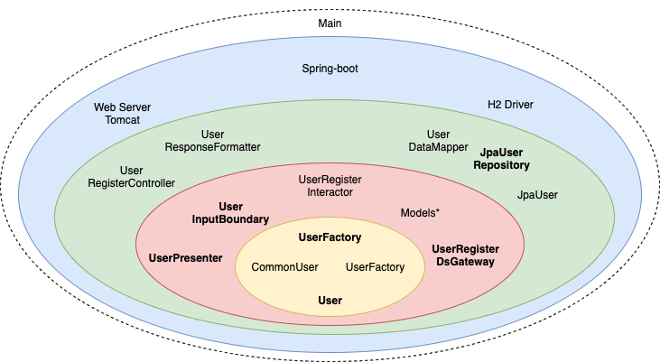

# Clean Architecture with Spring Boot


## 1. Overview


When we're developing long-term systems, we should expect a mutable environment.

In general, our functional requirements, frameworks, I/O devices, and even our code design may all change for various reasons. With this in mind, the **Clean Architecture is a guideline to a high maintainable code, considering all the uncertainties around us**.

In this article, we'll create an example of a user registration API  following [Robert C. Martin's Clean Architecture](https://blog.cleancoder.com/uncle-bob/2012/08/13/the-clean-architecture.html). We'll use his original layers  – entities, use cases, interface adapters, and frameworks/drivers.

## 2. Clean Architecture Overview

The clean architecture compiles many code designs and principles, like [SOLID](https://www.baeldung.com/solid-principles), [stable abstractions](https://wiki.c2.com/?StableAbstractionsPrinciple), and others. But, **the core idea is to** **divide the system into levels based on the business value**. Hence, the highest level has business rules, with each lower one getting closer to the I/O devices.

Also, we can translate the levels into layers. In this case, it is the opposite. The inner layer is equal to the highest level, and so on:


With this in mind, **we can have as many levels as our business requires. But, always considering the** **dependency rule – a higher level must never depend on a lower one**.


## 3. The Rules

Lets's start defining the system rules for our user registration API. First, business rules:

- The user's password must have more than five characters

Second, we have the application rules. They can be in different formats, as use cases or stories. We'll use a storytelling phrase:

- The system receives the user name and password, validates if the user doesn't exist, and saves the new user along with the creation time

**Notice how there is no mention of any database, UI, or similar. Because** **our business doesn't care about these details**, neither should our code.


## 4. The Entity Layer

As the clean architecture suggests, let's start with our business rule:

```java
interface User {
    boolean passwordIsValid();

    String getName();

    String getPassword();
}
```

And, a *UserFactory*:

```java
interface UserFactory {
    User create(String name, String password);
}
```

We created a user [factory method](https://www.baeldung.com/creational-design-patterns#factory-method) because of two reasons. To stock to the [stable abstractions principle](https://wiki.c2.com/?StableAbstractionsPrinciple) and to isolate the user creation.

Next, let's implement both:

```java
class CommonUser implements User {

    String name;
    String password;

    @Override
    public boolean passwordIsValid() {
        return password != null && password.length() > 5;
    }

    // Constructor and getters
}
```

```java
class CommonUserFactory implements UserFactory {
    @Override
    public User create(String name, String password) {
        return new CommonUser(name, password);
    }
}
```

**If we have a complex business, then we should build our domain code as clear as possible**. So, this layer is a great place to apply [design patterns](https://www.baeldung.com/design-patterns-series). Particularly, **the domain-driven design should be taken into account.**


### 4.1. Unit Testing

Now, let's test our *CommonUser*:

```java
@Test
void given123Password_whenPasswordIsNotValid_thenIsFalse() {
    User user = new CommonUser("Baeldung", "123");

    assertThat(user.passwordIsValid()).isFalse();
}
```

As we can see, the unit tests are very clear. After all, **the absence of mocks is a good signal for this layer**.

In general, if we start thinking about mocks here, maybe we're mixing our entities with our use cases.


## 5. The Use Case Layer

**The use cases are the** **rules related to the automatization of our system**. In Clean Architecture, we call them Interactors.

### 5.1. *UserRegisterInteractor*

First, we'll build our *UserRegisterInteractor* so we can see where we're going. Then, we'll create and discuss all used parts:

```java
class UserRegisterInteractor implements UserInputBoundary {

    final UserRegisterDsGateway userDsGateway;
    final UserPresenter userPresenter;
    final UserFactory userFactory;

    // Constructor

    @Override
    public UserResponseModel create(UserRequestModel requestModel) {
        if (userDsGateway.existsByName(requestModel.getName())) {
            return userPresenter.prepareFailView("User already exists.");
        }
        User user = userFactory.create(requestModel.getName(), requestModel.getPassword());
        if (!user.passwordIsValid()) {
            return userPresenter.prepareFailView("User password must have more than 5 characters.");
        }
        LocalDateTime now = LocalDateTime.now();
        UserDsRequestModel userDsModel = new UserDsRequestModel(user.getName(), user.getPassword(), now);

        userDsGateway.save(userDsModel);

        UserResponseModel accountResponseModel = new UserResponseModel(user.getName(), now.toString());
        return userPresenter.prepareSuccessView(accountResponseModel);
    }
}
```

As we can see, we're doing all the use case steps. Also, **this layer is responsible for controlling the entity's dance. Still, we're** **not making any assumptions on how the UI or database works.** But, we're using the *UserDsGateway* and *UserPresenter*. So, how can we not know them? Because, along with the *UserInputBoundary*, these are our input and output boundaries.


### 5.2. Input and Output Boundaries

The boundaries are contracts defining how components can interact. **The** **input boundary exposes our use case to outer layers:**

```java
interface UserInputBoundary {
    UserResponseModel create(UserRequestModel requestModel);
}
```

Next, we have our **output boundaries for making use of the outer layers**. First, let's define the data source gateway:

```java
interface UserRegisterDsGateway {
    boolean existsByName(String name);

    void save(UserDsRequestModel requestModel);
}
```

Second, the view presenter:

```java
interface UserPresenter {
    UserResponseModel prepareSuccessView(UserResponseModel user);

    UserResponseModel prepareFailView(String error);
}

```

Note **we're using the** **dependency inversion principle to make our business free from details such as databases and UIs**.


### 5.3. Decoupling Mode

Before proceeding, **notice how the** **boundaries are contracts defining the natural divisions of the system**. But we must also decide how our application will be delivered:

- Monolithic – likely organized using some package structure
- By using Modules
- By using Services/Microservices

With this in mind, **we can** **reach clean architecture goals with any decoupling mode**. Hence, **we should prepare to change between these strategies depending on our current and future business requirements**. After picking up our decoupling mode, the code division should happen based on our boundaries.


### 5.4. Request and Response Models

So far, we have created the operations across layers using interfaces. Next, let's see how to transfer data across these boundaries.

Notice how all our boundaries are dealing only with *String* or *Model* objects:

```java
class UserRequestModel {

    String login;
    String password;

    // Getters, setters, and constructors
}
```

Basically, **only** **simple data structures can cross boundaries**. Also,  all *Models* have only fields and accessors. Plus, the data object belongs to the inner side. So, we can keep the dependency rule.

But why do we have so many similar objects? When we get repeated code, it can be of two types:

- False or accidental duplication – the code similarity is an accident, as each object has a different reason to change. If we try to remove it, we”ll risk violating the [single responsibility principle](https://www.baeldung.com/java-single-responsibility-principle).
- True duplication – the code changes for the same reasons. Hence, we should remove it

As each Model has a different responsibility, we got all these objects.


### 5.5. Testing the *UserRegisterInteractor*

Now, let's create our unit test:

```java
@Test
void givenBaeldungUserAnd12345Password_whenCreate_thenSaveItAndPrepareSuccessView() {
    given(userDsGateway.existsByIdentifier("identifier"))
        .willReturn(true);

    interactor.create(new UserRequestModel("baeldung", "123"));

    then(userDsGateway).should()
        .save(new UserDsRequestModel("baeldung", "12345", now()));
    then(userPresenter).should()
        .prepareSuccessView(new UserResponseModel("baeldung", now()));
}
```

As we can see, most of the use case test is about controlling the entities and boundaries requests. And, our interfaces allow us to easily mock the details.


## 6. The Interface Adapters

At this point, we finished all our business. Now, let's start plugging in our details.

**Our business should deal only with the most convenient data format for it,** and so should our external agents, as DBs or UIs. **But, this format usually is different**. For this reason, the **interface adapter layer is responsible for converting the data**.


### 6.1. *UserRegisterDsGateway* Using JPA

First, let's use [*JPA*](https://www.baeldung.com/the-persistence-layer-with-spring-and-jpa) to map our *user* table:

```java
@Entity
@Table(name = "user")
class UserDataMapper {

    @Id
    String name;

    String password;

    LocalDateTime creationTime;

    //Getters, setters, and constructors
}
```

As we can see, the *Mapper* goal is to map our object to a database format.

Next, the *JpaRepository* using our [entity](https://www.baeldung.com/jpa-entities):

```java
@Repository
interface JpaUserRepository extends JpaRepository<UserDataMapper, String> {
}
```

Given that we'll be using spring-boot, then this is all it takes to save a user.

Now, it's time to implement our *UserRegisterDsGateway:*

```java
class JpaUser implements UserRegisterDsGateway {

    final JpaUserRepository repository;

    // Constructor

    @Override
    public boolean existsByName(String name) {
        return repository.existsById(name);
    }

    @Override
    public void save(UserDsRequestModel requestModel) {
        UserDataMapper accountDataMapper = new UserDataMapper(requestModel.getName(), requestModel.getPassword(), requestModel.getCreationTime());
        repository.save(accountDataMapper);
    }
}
```

For the most part, the code speaks for itself. Besides our methods, note the *UserRegisterDsGateway's* name. If we chose *UserDsGateway* instead, then other *User* use cases would be tempted to violate the [**interface segregation principle**](https://www.baeldung.com/java-interface-segregation).


### 6.2. *User* Register API

Now, let's create our HTTP adapter:

```java
@RestController
class UserRegisterController {

    final UserInputBoundary userInput;

    // Constructor

    @PostMapping("/user")
    UserResponseModel create(@RequestBody UserRequestModel requestModel) {
        return userInput.create(requestModel);
    }
}
```

As we can see, the **only goal here is to receive the request and send the response** to the client.


### 6.3. Preparing the Response

Before responding back, we should format our response:

```java
class UserResponseFormatter implements UserPresenter {

    @Override
    public UserResponseModel prepareSuccessView(UserResponseModel response) {
        LocalDateTime responseTime = LocalDateTime.parse(response.getCreationTime());
        response.setCreationTime(responseTime.format(DateTimeFormatter.ofPattern("hh:mm:ss")));
        return response;
    }

    @Override
    public UserResponseModel prepareFailView(String error) {
        throw new ResponseStatusException(HttpStatus.CONFLICT, error);
    }
}
```

Our *UserRegisterInteractor* forced us to create a presenter. Still, the presentation rules concerns only within the adapter. Besides, **w****henever something is hard to test, we should divide it into a testable and a humble object.** So, *UserResponseFormatter* easily allows us to verify our presentation rules:

```java
@Test
void givenDateAnd3HourTime_whenPrepareSuccessView_thenReturnOnly3HourTime() {
    UserResponseModel modelResponse = new UserResponseModel("baeldung", "2020-12-20T03:00:00.000");
    UserResponseModel formattedResponse = userResponseFormatter.prepareSuccessView(modelResponse);

    assertThat(formattedResponse.getCreationTime()).isEqualTo("03:00:00");
}
```

As we can see, we tested all our logic before sending it to the view. Hence, **only the humble object is in the less testable part**.


## 7. Drivers and Frameworks

In truth, we usually don't code here. That is because this layer **represents the lowest level of connection to external agents**. For example, the H2 driver to connect to the database or the web framework. In this case, **we're going to use spring-boot as the web and dependency injection framework**.  So, we need its start-up point:

```java
@SpringBootApplication
public class CleanArchitectureApplication {
    public static void main(String[] args) {
      SpringApplication.run(CleanArchitectureApplication.class);
    }
}
```

Until now, **we didn't use any** **spring annotation** **in our business. Except for the spring-specifics adapters**, as our *UserRegisterController*. This is **because** **we should** **treat spring-boot as any other detail**.


## 8. The Terrible Main Class

At last, the final piece!

So far, we followed the [stable abstractions principle](https://wiki.c2.com/?StableAbstractionsPrinciple). Also, we protected our inner layers from the external agents with the [inversion of control](https://www.baeldung.com/inversion-control-and-dependency-injection-in-spring). Lastly, we separated all object creation from its use. At this point, it's up to us to **create our remaining dependencies and inject them into our project**:

```java
@Bean
BeanFactoryPostProcessor beanFactoryPostProcessor(ApplicationContext beanRegistry) {
    return beanFactory -> {
        genericApplicationContext(
          (BeanDefinitionRegistry) ((AnnotationConfigServletWebServerApplicationContext) beanRegistry)
            .getBeanFactory());
    };
}

void genericApplicationContext(BeanDefinitionRegistry beanRegistry) {
    ClassPathBeanDefinitionScanner beanDefinitionScanner = new ClassPathBeanDefinitionScanner(beanRegistry);
    beanDefinitionScanner.addIncludeFilter(removeModelAndEntitiesFilter());
    beanDefinitionScanner.scan("com.baeldung.pattern.cleanarchitecture");
}

static TypeFilter removeModelAndEntitiesFilter() {
    return (MetadataReader mr, MetadataReaderFactory mrf) -> !mr.getClassMetadata()
      .getClassName()
      .endsWith("Model");
}
```

In our case, we're using the spring-boot [dependency injection](https://www.baeldung.com/spring-dependency-injection) to create all our instances. As we're not using [*@Component*](https://www.baeldung.com/spring-bean-annotations#component), we're scanning our root package and ignoring only the *Model* objects.

Although this strategy may look more complex, it decouples our business from the DI framework. On the other hand, **the main class got power over all our system**. That is why clean architecture considers it in a special layer embracing all others:




## 9. Conclusion

In this article, we learned how Uncle Bob's **clean architecture is built on top of many design patterns and principles**. Also, we created a use case applying it using Spring Boot.

Still, we left some principles aside. But, all of them lead in the same direction. We can summarize it by quoting its creator: “A good architect **must maximize the number of decisions not made**.”, and we did it by **protecting our business code from the details using boundaries**.

As usual, the complete code is available [over on GitHub](https://github.com/eugenp/tutorials/tree/master/patterns-modules/clean-architecture).


