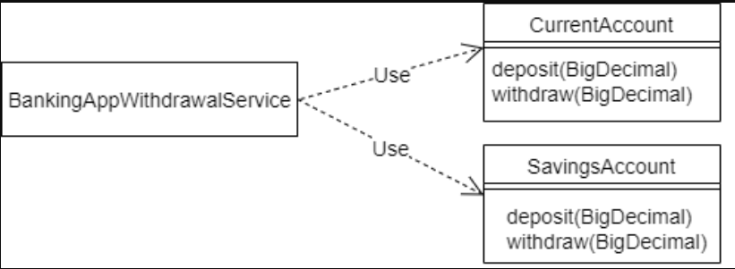
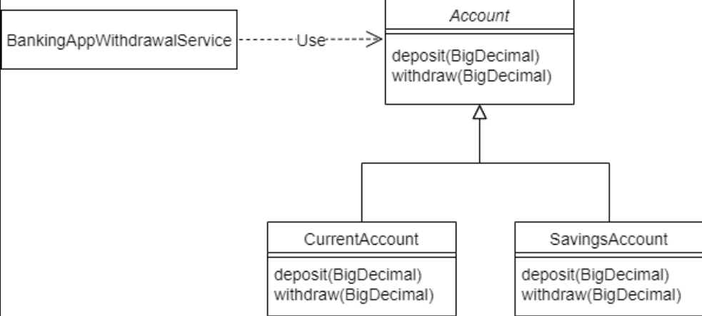
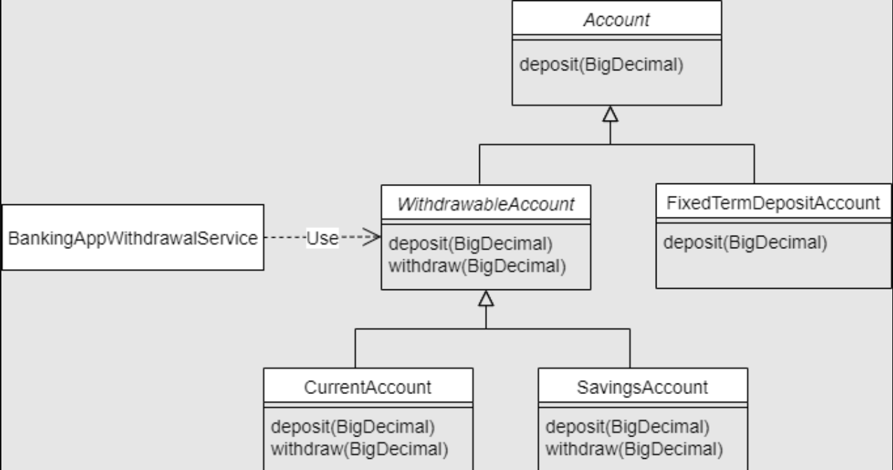

# Liskov Substitution Principle in Java


## 1. Overview

The [SOLID design principles](https://www.baeldung.com/solid-principles) were introduced by Robert C. Martin in his 2000 paper, *Design Principles and Design Patterns*. SOLID design principles help us **create more maintainable, understandable, and flexible software.**

In this article, we'll discuss the Liskov Substitution Principle, which is the “L” in the acronym.


## 2. The Open/Closed Principle

To understand the Liskov Substitution Principle, we must first understand the Open/Closed Principle (the “O” from SOLID).

The goal of the Open/Closed principle encourages us to design our software so we **add new features only by adding new code**. When this is possible, we have loosely coupled, and thus easily maintainable applications.


## 3. An Example Use Case

Let's look at a Banking Application example to understand the Open/Closed Principle some more.


### 3.1. Without the Open/Closed Principle

Our banking application supports two account types – “current” and “savings”. These are represented by the classes *CurrentAccount* and *SavingsAccount* respectively.

The *BankingAppWithdrawalService* serves the withdrawal functionality to its users:



Unfortunately, there is a problem with extending this design. The *BankingAppWithdrawalService* is aware of the two concrete implementations of account*.* Therefore, the *BankingAppWithdrawalService* would need to be changed every time a new account type is introduced.

### 3.2. Using the Open/Closed Principle to Make the Code Extensible

Let's redesign the solution to comply with the Open/Closed principle. We'll close *BankingAppWithdrawalService* from modification when new account types are needed, by using an *Account* base class instead:



Here, we introduced a new abstract *Account* class that *CurrentAccount* and *SavingsAccount* extend.

The *BankingAppWithdrawalService* no longer depends on concrete account classes. Because it now depends only on the abstract class, it need not be changed when a new account type is introduced.

Consequently, the *BankingAppWithdrawalService* is **open for the extension** with new account types, but **closed for modification**, in that the new types don't require it to change in order to integrate.


###   3.3. Java Code

Let's look at this example in Java. To begin with, let's define the *Account* class:

```java
public abstract class Account {
    protected abstract void deposit(BigDecimal amount);

    /**
     * Reduces the balance of the account by the specified amount
     * provided given amount > 0 and account meets minimum available
     * balance criteria.
     *
     * @param amount
     */
    protected abstract void withdraw(BigDecimal amount);
}

```

And, let's define the *BankingAppWithdrawalService*:

```java
public class BankingAppWithdrawalService {
    private Account account;

    public BankingAppWithdrawalService(Account account) {
        this.account = account;
    }

    public void withdraw(BigDecimal amount) {
        account.withdraw(amount);
    }
}
```

Now, let's look at how, in this design, a new account type might violate the Liskov Substitution Principle.


### 3.4. A New Account Type

The bank now wants to offer a high interest-earning fixed-term deposit account to its customers.

To support this, let's introduce a new *FixedTermDepositAccount* class. A fixed-term deposit account in the real world “is a” type of account. This implies inheritance in our object-oriented design.

So, let's make *FixedTermDepositAccount* a subclass of *Account*:

```java
public class FixedTermDepositAccount extends Account {
    // Overridden methods...
}
```

So far, so good. However, the bank doesn't want to allow withdrawals for the fixed-term deposit accounts.

This means that the new *FixedTermDepositAccount* class can't meaningfully provide the *withdraw* method that *Account* defines. One common workaround for this is to make *FixedTermDepositAccount* throw an *UnsupportedOperationException* in the method it cannot fulfill:

```java
public class FixedTermDepositAccount extends Account {
    @Override
    protected void deposit(BigDecimal amount) {
        // Deposit into this account
    }

    @Override
    protected void withdraw(BigDecimal amount) {
        throw new UnsupportedOperationException("Withdrawals are not supported by FixedTermDepositAccount!!");
    }
}
```


### 3.5. Testing Using the New Account Type

While the new class works fine, let's try to use it with the *BankingAppWithdrawalService*:

```java
Account myFixedTermDepositAccount = new FixedTermDepositAccount();
myFixedTermDepositAccount.deposit(new BigDecimal(1000.00));

BankingAppWithdrawalService withdrawalService = new BankingAppWithdrawalService(myFixedTermDepositAccount);
withdrawalService.withdraw(new BigDecimal(100.00));
```

Unsurprisingly, the banking application crashes with the error:

```java
Withdrawals are not supported by FixedTermDepositAccount!!
```

There's clearly something wrong with this design if a valid combination of objects results in an error.


### 3.6. What Went Wrong?

The *BankingAppWithdrawalService* is a client of the *Account* class. It expects that both *Account* and its subtypes guarantee the behavior that the *Account* class has specified for its *withdraw* method:

```java
/**
 * Reduces the account balance by the specified amount
 * provided given amount > 0 and account meets minimum available
 * balance criteria.
 *
 * @param amount
 */
protected abstract void withdraw(BigDecimal amount);
```

However, by not supporting the *withdraw* method, the *FixedTermDepositAccount* violates this method specification*.* Therefore, we cannot reliably substitute *FixedTermDepositAccount* for *Account*.

In other words, the *FixedTermDepositAccount* has violated the Liskov Substitution Principle.

### 3.7. Can't We Handle the Error in *BankingAppWithdrawalService*?

We could amend the design so that the client of *Account*‘s *withdraw* method has to be aware of a possible error in calling it. However, this would mean that clients have to have special knowledge of unexpected subtype behavior. This starts to break the Open/Closed principle.

In other words, for the Open/Closed Principle to work well, all **subtypes must be substitutable for their supertype without ever having to modify the client code**. Adhering to the Liskov Substitution Principle ensures this substitutability.

Let's now look at the Liskov Substitution Principle in detail.


## 4. The Liskov Substitution Principle

### 4.1. Definition

Robert C. Martin summarizes it:

>*Subtypes must be substitutable for their base types.*

Barbara Liskov, defining it in 1988, provided a more mathematical definition:

>*If for each object o1 of type S there is an object o2 of type T such that for all programs P defined in terms of T, the behavior of P is unchanged when o1 is substituted for o2 then S is a subtype of T.*

Let's understand these definitions a bit more.


### 4.2. When Is a Subtype Substitutable for Its Supertype?

A subtype doesn't automatically become substitutable for its supertype. **To be substitutable, the subtype must behave like its supertype**.

An object's behavior is the contract that its clients can rely on. The behavior is specified by the public methods, any constraints placed on their inputs, any state changes that the object goes through, and the side effects from the execution of methods.

Subtyping in Java requires the base class's properties and methods are available in the subclass.

However, [behavioral subtyping](https://en.wikipedia.org/wiki/Behavioral_subtyping) means that not only does a subtype provide all of the methods in the supertype, but it **must adhere to the behavioral specification of the supertype**. This ensures that any assumptions made by the clients about the supertype behavior are met by the subtype.

This is the additional constraint that the Liskov Substitution Principle brings to object-oriented design.

Let's now refactor our banking application to address the problems we encountered earlier.


## 5. Refactoring

To fix the problems we found in the banking example, let's start by understanding the root cause.

### 5.1. The Root Cause

In the example, our *FixedTermDepositAccount* was not a behavioral subtype of *Account*.

The design of *Account* incorrectly assumed that all *Account* types allow withdrawals. Consequently, all subtypes of *Account,* including *FixedTermDepositAccount* which doesn't support withdrawals, inherited the *withdraw* method.

Though we could work around this by extending the contract of *Account*, there are alternative solutions.


### 5.2. Revised Class Diagram

Let's design our account hierarchy differently:



Because all accounts do not support withdrawals, we moved the *withdraw* method from the *Account* class to a new abstract subclass *WithdrawableAccount*. Both *CurrentAccount* and *SavingsAccount* allow withdrawals. So they've now been made subclasses of the new *WithdrawableAccount*.

This means *BankingAppWithdrawalService* can trust the right type of account to provide the *withdraw* function.


### 5.3. Refactored *BankingAppWithdrawalService*

*BankingAppWithdrawalService* now needs to use the *WithdrawableAccount*:

```java
public class BankingAppWithdrawalService {
    private WithdrawableAccount withdrawableAccount;

    public BankingAppWithdrawalService(WithdrawableAccount withdrawableAccount) {
        this.withdrawableAccount = withdrawableAccount;
    }

    public void withdraw(BigDecimal amount) {
        withdrawableAccount.withdraw(amount);
    }
}
```

As for *FixedTermDepositAccount*, we retain *Account* as its parent class. Consequently, it inherits only the *deposit* behavior that it can reliably fulfill and no longer inherits the *withdraw* method that it doesn't want. This new design avoids the issues we saw earlier.


## 6. Rules

Let's now look at some rules/techniques concerning method signatures, invariants, preconditions, and postconditions that we can follow and use to ensure we create well-behaved subtypes.

In their book [*Program Development in Java: Abstraction, Specification, and Object-Oriented Design*](https://www.oreilly.com/library/view/program-development-in/9780768685299/), Barbara Liskov and John Guttag grouped these rules into three categories – the signature rule, the properties rule, and the methods rule.

Some of these practices are already enforced by Java's overriding rules.

We should note some terminology here. A wide type is more general – *Object* for instance could mean ANY Java object and is wider than, say, *CharSequence*, where *String* is very specific and therefore narrower.


### 6.1. Signature Rule – Method Argument Types

This rule states that **the overridden subtype method argument types can be identical or wider than the supertype method argument types**.

Java's method overriding rules support this rule by enforcing that the overridden method argument types match exactly with the supertype method.


### 6.2. Signature Rule – Return Types

**The return type of the overridden subtype method can be narrower than the return type of the supertype method**. This is called [covariance](https://en.wikipedia.org/wiki/Covariance_and_contravariance_(computer_science)#Covariant_method_return_type) of the return types. Covariance indicates when a subtype is accepted in place of a supertype. Java supports the covariance of return types. Let's look at an example:

```java
public abstract class Foo {
    public abstract Number generateNumber();    
    // Other Methods
}

```

The *generateNumber* method in *Foo* has return type as *Number*. Let's now override this method by returning a narrower type of *Integer*:

```java
public class Bar extends Foo {
    @Override
    public Integer generateNumber() {
        return new Integer(10);
    }
    // Other Methods
}
```

Because *Integer* IS-A *Number*, a client code that expects *Number* can replace *Foo* with *Bar* without any problems.

On the other hand, if the overridden method in *Bar* were to return a wider type than *Number*, e.g. *Object*, that might include any subtype of *Object* e.g. a *Truck*. Any client code that relied on the return type of *Number* could not handle a *Truck*!

Fortunately, Java's method overriding rules prevent an override method returning a wider type.


### 6.3. Signature Rule – Exceptions

**The subtype method can throw fewer or narrower (but not any additional or broader) exceptions than the supertype method**.

This is understandable because when the client code substitutes a subtype, it can handle the method throwing fewer exceptions than the supertype method. However, if the subtype's method throws new or broader checked exceptions, it would break the client code.

Java's method overriding rules already enforce this rule for checked exceptions. However, **overriding methods in Java CAN THROW any** **RuntimeException** regardless of whether the overridden method declares the exception.


### 6.4. Properties Rule – Class Invariants

A [class invariant](https://en.wikipedia.org/wiki/Class_invariant) is an assertion concerning object properties that must be true for all valid states of the object.

Let's look at an example:

```java
public abstract class Car {
    protected int limit;

    // invariant: speed < limit;
    protected int speed;

    // postcondition: speed < limit
    protected abstract void accelerate();

    // Other methods...
}
```

The *Car* class specifies a class invariant that *speed* must always be below the *limit*. The invariants rule states that **all subtype methods (inherited and new) must maintain or strengthen the supertype's class invariants**.

Let's define a subclass of *Car* that preserves the class invariant:

```java
public class HybridCar extends Car {
    // invariant: charge >= 0;
    private int charge;

      @Override
    // postcondition: speed < limit
    protected void accelerate() {
        // Accelerate HybridCar ensuring speed < limit
    }

    // Other methods...
}
```

In this example, the invariant in *Car* is preserved by the overridden *accelerate* method in *HybridCar*. The *HybridCar* additionally defines its own class invariant *charge >= 0*, and this is perfectly fine.

Conversely, if the class invariant is not preserved by the subtype, it breaks any client code that relies on the supertype.


### 6.5. Properties Rule – History Constraint

The history constraint states that the **subclass** **methods (inherited or new) shouldn't allow state changes that the base class didn't allow**.

Let's look at an example:

```java
public abstract class Car {

    // Allowed to be set once at the time of creation.
    // Value can only increment thereafter.
    // Value cannot be reset.
    protected int mileage;

    public Car(int mileage) {
        this.mileage = mileage;
    }

    // Other properties and methods...

}
```

The *Car* class specifies a constraint on the *mileage* property. The *mileage* property can be set only once at the time of creation and cannot be reset thereafter.

Let's now define a *ToyCar* that extends *Car:*

```java
public class ToyCar extends Car {
    public void reset() {
        mileage = 0;
    }

    // Other properties and methods
}
```

The *ToyCar* has an extra method *reset* that resets the *mileage* property. In doing so, the *ToyCar* ignored the constraint imposed by its parent on the *mileage* property. This breaks any client code that relies on the constraint. So, *ToyCar* isn't substitutable for *Car*.

Similarly, if the base class has an immutable property, the subclass should not permit this property to be modified. This is why [immutable classes](https://www.baeldung.com/java-immutable-object) should be *final*.


### 6.6. Methods Rule – Preconditions

A [precondition](https://en.wikipedia.org/wiki/Precondition) should be satisfied before a method can be executed. Let's look at an example of a precondition concerning parameter values:

```java
public class Foo {

    // precondition: 0 < num <= 5
    public void doStuff(int num) {
        if (num <= 0 || num > 5) {
            throw new IllegalArgumentException("Input out of range 1-5");
        }
        // some logic here...
    }
}
```

Here, the precondition for the *doStuff* method states that the *num* parameter value must be between 1 and 5. We have enforced this precondition with a range check inside the method. **A subtype can weaken (but not strengthen) the precondition for a method it overrides**. When a subtype weakens the precondition, it relaxes the constraints imposed by the supertype method.

Let's now override the *doStuff* method with a weakened precondition:

```java
public class Bar extends Foo {

    @Override
    // precondition: 0 < num <= 10
    public void doStuff(int num) {
        if (num <= 0 || num > 10) {
            throw new IllegalArgumentException("Input out of range 1-10");
        }
        // some logic here...
    }
}
```

Here, the precondition is weakened in the overridden *doStuff* method to *0 < num <= 10*, allowing a wider range of values for *num*. All values of *num* that are valid for *Foo.doStuff* are valid for *Bar.doStuff* as well. Consequently, a client of *Foo.doStuff* doesn't notice a difference when it replaces *Foo* with *Bar*.

Conversely, when a subtype strengthens the precondition (e.g. *0 < num <= 3* in our example), it applies more stringent restrictions than the supertype. For example, values 4 & 5 for *num* are valid for *Foo.doStuff*, but are no longer valid for *Bar.doStuff*.

This would break the client code that does not expect this new tighter constraint.


### 6.7. Methods Rule – Postconditions

A [postcondition](https://en.wikipedia.org/wiki/Postcondition) is a condition that should be met after a method is executed.

Let's look at an example:

```java
public abstract class Car {

    protected int speed;

    // postcondition: speed must reduce
    protected abstract void brake();

    // Other methods...
}

```

Here, the *brake* method of *Car* specifies a postcondition that the *Car*‘s *speed* must reduce at the end of the method execution.  **The subtype can strengthen (but not weaken) the postcondition for a method it overrides**. When a subtype strengthens the postcondition, it provides more than the supertype method.

Now, let's define a derived class of *Car* that strengthens this precondition:

```java
public class HybridCar extends Car {

   // Some properties and other methods...

    @Override
    // postcondition: speed must reduce
    // postcondition: charge must increase
    protected void brake() {
        // Apply HybridCar brake
    }
}
```

The overridden *brake* method in *HybridCar* strengthens the postcondition by additionally ensuring that the *charge* is increased as well. Consequently, any client code relying on the postcondition of the *brake* method in the *Car* class notices no difference when it substitutes *HybridCar* for *Car*.

Conversely, if *HybridCar* were to weaken the postcondition of the overridden *brake* method, it would no longer guarantee that the *speed* would be reduced. This might break client code given a *HybridCar* as a substitute for *Car*.


## 7. Code Smells

How can we spot a subtype that is not substitutable for its supertype in the real world?

Let's look at some common code smells that are signs of a violation of the Liskov Substitution Principle.


### 7.1. A Subtype Throws an Exception for a Behavior It Can't Fulfill

We have seen an example of this in our banking application example earlier on.

Prior to the refactoring, the *Account* class had an extra method *withdraw* that its subclass *FixedTermDepositAccount* didn't want. The *FixedTermDepositAccount* class worked around this by throwing the *UnsupportedOperationException* for the *withdraw* method. However, this was just a hack to cover up a weakness in the modeling of the inheritance hierarchy.

### 7.2. A Subtype Provides No Implementation for a Behavior It Can't Fulfill

This is a variation of the above code smell. The subtype cannot fulfill a behavior and so it does nothing in the overridden method.

Here's an example. Let's define a *FileSystem* interface:

```java
public interface FileSystem {
    File[] listFiles(String path);

    void deleteFile(String path) throws IOException;
}

```

Let's define a *ReadOnlyFileSystem* that implements *FileSystem:*

```java
public class ReadOnlyFileSystem implements FileSystem {
    public File[] listFiles(String path) {
        // code to list files
        return new File[0];
    }

    public void deleteFile(String path) throws IOException {
        // Do nothing.
        // deleteFile operation is not supported on a read-only file system
    }
}
```

Here, the *ReadOnlyFileSystem* doesn't support the *deleteFile* operation and so doesn't provide an implementation.


### 7.3. The Client Knows About Subtypes

If the client code needs to use *instanceof* or downcasting, then the chances are that both the Open/Closed Principle and the Liskov Substitution Principle have been violated.

Let's illustrate this using a *FilePurgingJob*:

```java
public class FilePurgingJob {
    private FileSystem fileSystem;

    public FilePurgingJob(FileSystem fileSystem) {
        this.fileSystem = fileSystem;
    }

    public void purgeOldestFile(String path) {
        if (!(fileSystem instanceof ReadOnlyFileSystem)) {
            // code to detect oldest file
            fileSystem.deleteFile(path);
        }
    }
}
```

Because the *FileSystem* model is fundamentally incompatible with read-only file systems, the *ReadOnlyFileSystem* inherits a *deleteFile* method it can't support. This example code uses an *instanceof* check to do special work based on a subtype implementation.


### 7.4. A Subtype Method Always Returns the Same Value

This is a far more subtle violation than the others and is harder to spot. In this example, *ToyCar* always returns a fixed value for the *remainingFuel* property:

```java
public class ToyCar extends Car {

    @Override
    protected int getRemainingFuel() {
        return 0;
    }
}

```

It depends on the interface, and what the value means, but generally hardcoding what should be a changeable state value of an object is a sign that the subclass is not fulfilling the whole of its supertype and is not truly substitutable for it.


## 8. Conclusion

In this article, we looked at the Liskov Substitution SOLID design principle.

The Liskov Substitution Principle helps us model good inheritance hierarchies. It helps us prevent model hierarchies that don't conform to the Open/Closed principle.

Any inheritance model that adheres to the Liskov Substitution Principle will implicitly follow the Open/Closed principle.

To begin with, we looked at a use case that attempts to follow the Open/Closed principle but violates the Liskov Substitution Principle. Next, we looked at the definition of the Liskov Substitution Principle, the notion of behavioral subtyping, and the rules that subtypes must follow.

Finally, we looked at some common code smells that can help us detect violations in our existing code.


As always, the example code from this article is available over on [GitHub](https://github.com/eugenp/tutorials/tree/master/patterns-modules/solid).


