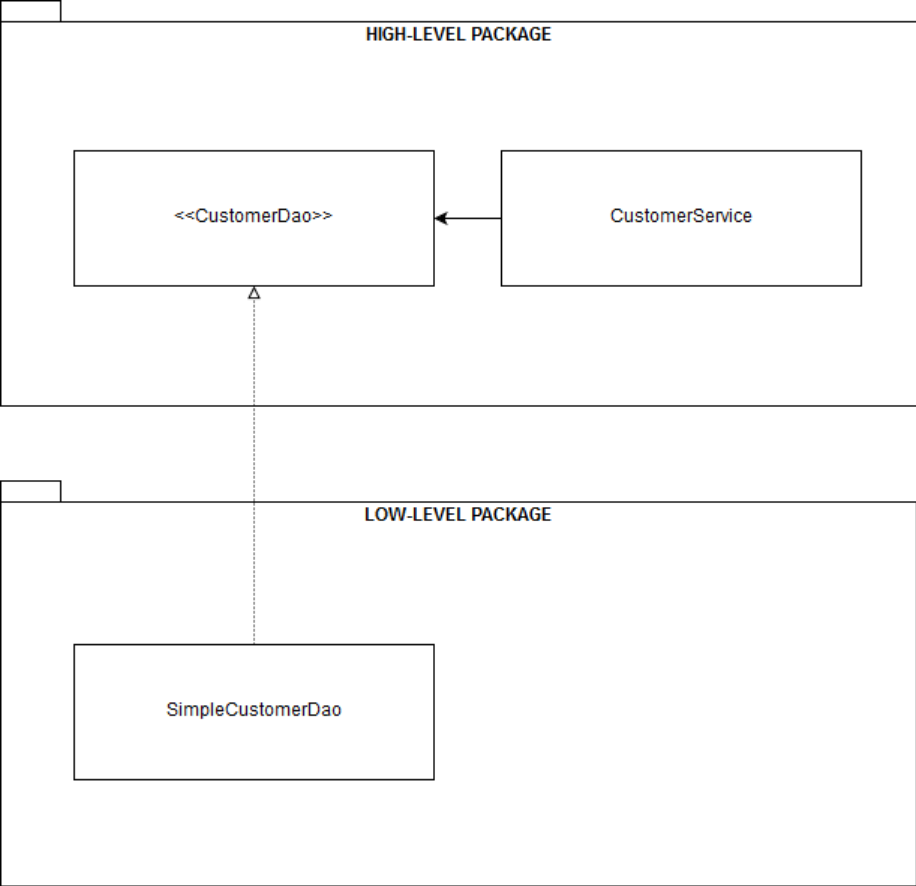
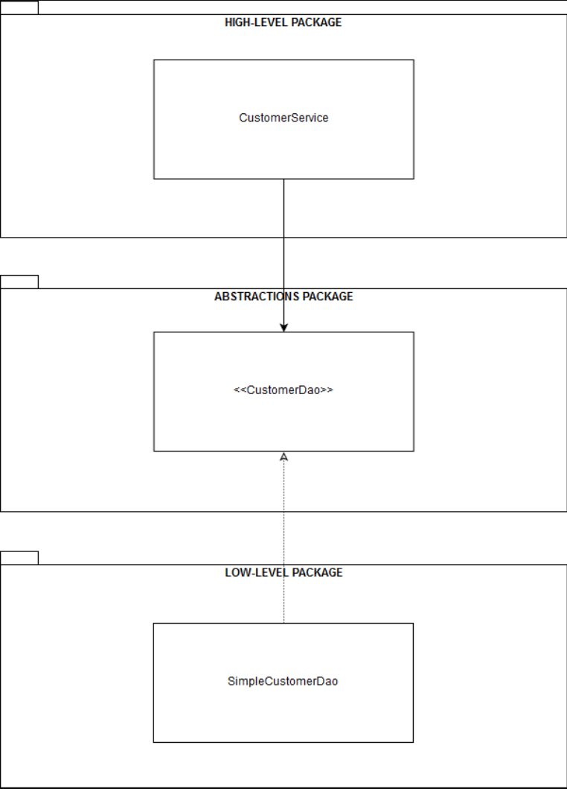
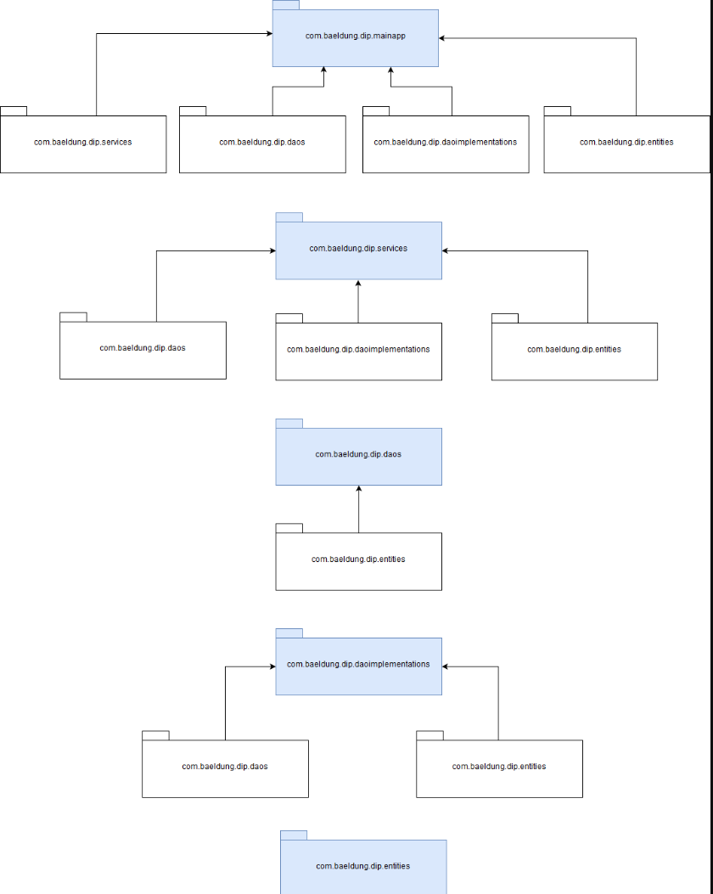

# The Dependency Inversion Principle in Java


## 1. **Overview**

The Dependency Inversion Principle (DIP) forms part of the collection of object-oriented programming principles popularly known as [SOLID](https://www.baeldung.com/solid-principles).

At the bare bones, the DIP is a simple – yet powerful – programming paradigm that we can use **to implement well-structured, highly-decoupled, and reusable software components**.

In this tutorial, **we'll explore different approaches for implementing the DIP — one in Java 8, and one in Java 11** using the [JPMS](https://www.baeldung.com/java-9-modularity) (Java Platform Module System).


## **2. Dependency Injection and Inversion of Control Are Not DIP Implementations**

First and foremost, let's make a fundamental distinction to get the basics right: **the DIP is neither dependency injection (DI) nor inversion of control (IoC)**. Even so, they all work great together.

Simply put, DI is about making software components to explicitly declare their dependencies or collaborators through their APIs, instead of acquiring them by themselves.

Without DI, software components are tightly coupled to each other. Hence, they're hard to reuse, replace, mock and test, which results in rigid designs.

**With DI, the responsibility of providing the component dependencies and wiring object graphs is transferred from the components to the underlying injection framework.** From that perspective, DI is just a way to achieve IoC.

On the other hand, **IoC is a pattern in which the control of the flow of an application is reversed**. With traditional programming methodologies, our custom code has the control of the flow of an application. Conversely, **with IoC, the control is transferred to an external framework or container**.

**The framework is an extendable codebase, which defines hook points for plugging in our own code**.

In turn, the framework calls back our code through one or more specialized subclasses, using interfaces' implementations, and via annotations. [The Spring framework](https://www.baeldung.com/spring-tutorial) is a nice example of this last approach.


## **3. Fundamentals of DIP**

To understand the motivation behind the DIP, let's start with its formal definition, given by Robert C. Martin in his book, [*Agile Software Development: Principles, Patterns, and Practices*](https://www.pearson.com/us/higher-education/program/Martin-Agile-Software-Development-Principles-Patterns-and-Practices/PGM272869.html):

1. High-level modules should not depend on low-level modules. Both should depend on abstractions.
2. Abstractions should not depend on details. Details should depend on abstractions.

So, it's clear that at the core, **the DIP is about inverting the classic dependency between high-level and low-level components by abstracting away the interaction between them**.

In traditional software development, high-level components depend on low-level ones. Thus, it's hard to reuse the high-level components.

### **3.1. Design Choices and the DIP**

Let's consider a simple *StringProcessor* class that gets a *String* value using a *StringReader* component, and writes it somewhere else using a *StringWriter* component:

```java
public class StringProcessor {
    
    private final StringReader stringReader;
    private final StringWriter stringWriter;
    
    public StringProcessor(StringReader stringReader, StringWriter stringWriter) {
        this.stringReader = stringReader;
        this.stringWriter = stringWriter;
    }

    public void printString() {
        stringWriter.write(stringReader.getValue());
    }
}

```

Although the implementation of the *StringProcessor* class is basic, there are several design choices that we can make here.


Let's break each design choice down into separate items, to understand clearly how each can impact the overall design:

1. **StringReader and StringWriter, the low-level components, are concrete classes placed in the same package.** *StringProcessor*, the high-level component is placed in a different package. *StringProcessor* depends on *StringReader* and *StringWriter*. There is no inversion of dependencies, hence *StringProcessor* is not reusable in a different context.
2. **StringReader and StringWriter are interfaces placed in the same package along with the implementations**. *StringProcessor* now depends on abstractions, but the low-level components don't. We have not achieved inversion of dependencies yet.
3. **StringReader and StringWriter are interfaces placed in the same package together with StringProcessor**. Now, *StringProcessor* has the explicit ownership of the abstractions. *StringProcessor,* *StringReader,* and *StringWriter* all depend on abstractions. We have achieved inversion of dependencies from top to bottom by abstracting the interaction between the components*.* *StringProcessor* is now reusable in a different context.
4. **StringReader and StringWriter are interfaces placed in a separate package from StringProcessor**. We achieved inversion of dependencies, and it's also easier to replace *StringReader* and *StringWriter* implementations. *StringProcessor* is also reusable in a different context.

Of all the above scenarios, only items 3 and 4 are valid implementations of the DIP.


### **3.2. Defining the Ownership of the Abstractions**

Item 3 is a direct DIP implementation, **where the high-level component and the abstraction(s) are placed in the same package.** Hence, **the high-level component owns the abstractions**. In this implementation, the high-level component is responsible for defining the abstract protocol through which it interacts with the low-level components.

Likewise, item 4 is a more decoupled DIP implementation. In this variant of the pattern, **neither the high-level component nor the low-level ones have the ownership of the abstractions**.

The abstractions are placed in a separate layer, which facilitates switching the low-level components. At the same time, all the components are isolated from each other, which yields stronger encapsulation.

### **3.3. Choosing the Right Level of Abstraction**

In most cases, choosing the abstractions that the high-level components will use should be fairly straightforward, but with one caveat worth noting: the level of abstraction.

In the example above, we used DI to inject a *StringReader* type into the *StringProcessor* class. This would be effective **as long as the level of abstraction of StringReader is close to the domain of StringProcessor**.

By contrast, we'd be just missing the DIP's intrinsic benefits if *StringReader* is, for instance, a [*File*](https://www.baeldung.com/java-how-to-create-a-file) object that reads a *String* value from a file. In that case, the level of abstraction of *StringReader* would be much lower than the level of the domain of *StringProcessor*

To put it simply, **the level of abstraction that the high-level components will use to interoperate with the low-level ones should be always close to the domain of the former**.


## **4. Java 8 Implementations**

We already looked in depth at the DIP's key concepts, so now we'll explore a few practical implementations of the pattern in Java 8.

### **4.1. Direct DIP Implementation**

Let's create a demo application that fetches some customers from the persistence layer and processes them in some additional way.

The layer's underlying storage is usually a database, but to keep the code simple, here we'll use a plain *Map*.

Let's start by **defining the high-level component**:

```java
public class CustomerService {

    private final CustomerDao customerDao;

    // standard constructor / getter

    public Optional<Customer> findById(int id) {
        return customerDao.findById(id);
    }

    public List<Customer> findAll() {
        return customerDao.findAll();
    }
}
```

As we can see, the *CustomerService* class implements the *findById()* and *findAll()* methods, which fetch customers from the persistence layer using a simple [DAO](https://www.baeldung.com/java-dao-pattern) implementation. Of course, we could've encapsulated more functionality in the class, but let's keep it like this for simplicity's sake.

In this case, **the CustomerDao type is the abstraction** that *CustomerService* uses for consuming the low-level component.

Since this a direct DIP implementation, let's define the abstraction as an interface in the same package of *CustomerService*:

```java
public interface CustomerDao {

    Optional<Customer> findById(int id);

    List<Customer> findAll();

}
```

By placing the abstraction in the same package of the high-level component, we're making the component responsible for owning the abstraction. This implementation detail is **what really inverts the dependency between the high-level component and the low-level one**.

In addition, **the level of abstraction of CustomerDao is close to the one of** ***CustomerService**,* which is also required for a good DIP implementation.

Now, let's create the low-level component in a different package. In this case, it's just a basic *CustomerDao* implementation:

```java
public class SimpleCustomerDao implements CustomerDao {

    // standard constructor / getter

    @Override
    public Optional<Customer> findById(int id) {
        return Optional.ofNullable(customers.get(id));
    }

    @Override
    public List<Customer> findAll() {
        return new ArrayList<>(customers.values());
    }
}
```

Finally, let's create a unit test to check the *CustomerService* class' functionality:

```java
@Before
public void setUpCustomerServiceInstance() {
    var customers = new HashMap<Integer, Customer>();
    customers.put(1, new Customer("John"));
    customers.put(2, new Customer("Susan"));
    customerService = new CustomerService(new SimpleCustomerDao(customers));
}

@Test
public void givenCustomerServiceInstance_whenCalledFindById_thenCorrect() {
    assertThat(customerService.findById(1)).isInstanceOf(Optional.class);
}

@Test
public void givenCustomerServiceInstance_whenCalledFindAll_thenCorrect() {
    assertThat(customerService.findAll()).isInstanceOf(List.class);
}

@Test
public void givenCustomerServiceInstance_whenCalledFindByIdWithNullCustomer_thenCorrect() {
    var customers = new HashMap<Integer, Customer>();
    customers.put(1, null);
    customerService = new CustomerService(new SimpleCustomerDao(customers));
    Customer customer = customerService.findById(1).orElseGet(() -> new Customer("Non-existing customer"));
    assertThat(customer.getName()).isEqualTo("Non-existing customer");
}
```

The unit test exercises the *CustomerService* API. And, it also shows how to manually inject the abstraction into the high-level component. In most cases, we'd use some kind of DI container or framework to accomplish this.

Additionally, the following diagram shows the structure of our demo application, from a high-level to a low-level package perspective:




### **4.2. Alternative DIP Implementation**

As we discussed before, it's possible to use an alternative DIP implementation, where we place the high-level components, the abstractions, and the low-level ones in different packages.

For obvious reasons, this variant is more flexible, yields better encapsulation of the components, and makes it easier to replace the low-level components.

Of course, implementing this variant of the pattern boils down to just placing *CustomerService*, *MapCustomerDao,* and *CustomerDao* in separate packages.

Therefore, a diagram is sufficient for showing how each component is laid out with this implementation:


  

## **5. Java 11 Modular Implementation**

It's fairly easy to refactor our demo application into a modular one.

This is a really nice way to demonstrate how the JPMS enforces best programming practices, including strong encapsulation, abstraction, and component reuse through the DIP.

We don't need to reimplement our sample components from scratch. Hence, **modularizing our sample application is just a matter of placing each component file in a separate module, along with the corresponding module descriptor**.

Here's how the modular project structure will look:

```
project base directory (could be anything, like dipmodular)
|- com.baeldung.dip.services
   module-info.java
     |- com
       |- baeldung
         |- dip
           |- services
             CustomerService.java
|- com.baeldung.dip.daos
   module-info.java
     |- com
       |- baeldung
         |- dip
           |- daos
             CustomerDao.java
|- com.baeldung.dip.daoimplementations 
    module-info.java 
      |- com 
        |- baeldung 
          |- dip 
            |- daoimplementations 
              SimpleCustomerDao.java  
|- com.baeldung.dip.entities
    module-info.java
      |- com
        |- baeldung
          |- dip
            |- entities
              Customer.java
|- com.baeldung.dip.mainapp 
    module-info.java 
      |- com 
        |- baeldung 
          |- dip 
            |- mainapp
              MainApplication.java

```

### 5.1. The High-Level Component Module

Let's start by placing the *CustomerService* class in its own module.

We'll create this module in the root directory *com.baeldung.dip.services,* and add the module descriptor, *module-info.java*:

```
module com.baeldung.dip.services {
    requires com.baeldung.dip.entities;
    requires com.baeldung.dip.daos;
    uses com.baeldung.dip.daos.CustomerDao;
    exports com.baeldung.dip.services;
}
```

For obvious reasons, we won't go into the details on how the JPMS works. Even so, it's clear to see the module dependencies just by looking at the *requires* directives.

The most relevant detail worth noting here is the *uses* directive. It states that **the module is a client module** that consumes an implementation of the *CustomerDao* interface.

Of course, we still need to place the high-level component, the *CustomerService* class, in this module. So, within the root directory *com.baeldung.dip.services*, let's create the following package-like directory structure: *com/baeldung/dip/services.*

Finally, let's place the *CustomerService.java* file in that directory.


### **5.2. The Abstraction Module**

Likewise, we need to place the *CustomerDao* interface in its own module. Therefore, let's create the module in the root directory *com.baeldung.dip.daos*, and add the module descriptor:

```plaintext
module com.baeldung.dip.daos {
    requires com.baeldung.dip.entities;
    exports com.baeldung.dip.daos;
}
```

Now, let's navigate to the *com.baeldung.dip.daos* directory and create the following directory structure: *com/baeldung/dip/daos*. Let's place the *CustomerDao.java* file in that directory.


### **5.3. The Low-Level Component Module**

Logically, we need to put the low-level component, *SimpleCustomerDao*, in a separate module, too. As expected, the process looks very similar to what we just did with the other modules.

Let's create the new module in the root directory *com.baeldung.dip.daoimplementations*, and include the module descriptor:

```
module com.baeldung.dip.daoimplementations {
    requires com.baeldung.dip.entities;
    requires com.baeldung.dip.daos;
    provides com.baeldung.dip.daos.CustomerDao with com.baeldung.dip.daoimplementations.SimpleCustomerDao;
    exports com.baeldung.dip.daoimplementations;
}
```

In a JPMS context, **this is a service provider module**, since it declares the *provides* and *with* directives.

In this case, the module makes the *CustomerDao* service available to one or more consumer modules, through the *SimpleCustomerDao* implementation.

Let's keep in mind that our consumer module, *com.baeldung.dip.services*, consumes this service through the *uses* directive.

This clearly shows **how simple it is to have a direct DIP implementation with the JPMS, by just defining consumers, service providers, and abstractions in different modules**.

Likewise, we need to place the *SimpleCustomerDao.java* file in this new module. Let's navigate to the *com.baeldung.dip.daoimplementations* directory, and create a new package-like directory structure with this name: *com/baeldung/dip/daoimplementations*.

Finally, let's place the *SimpleCustomerDao.java* file in the directory.


### **5.4. The Entity Module**

Additionally, we have to create another module where we can place the *Customer.java* class. As we did before, let's create the root directory *com.baeldung.dip.entities* and include the module descriptor:

```
module com.baeldung.dip.entities {
    exports com.baeldung.dip.entities;
}
```

In the package's root directory, let's create the directory *com/baeldung/dip/entities* and add the following *Customer.java* file:

```java
public class Customer {

    private final String name;

    // standard constructor / getter / toString
    
}
```

### **5.5. The Main Application Module**

Next, we need to create an additional module that allows us to define our demo application's entry point. Therefore, let's create another root directory *com.baeldung.dip.mainapp* and place in it the module descriptor:

```java
module com.baeldung.dip.mainapp {
    requires com.baeldung.dip.entities;
    requires com.baeldung.dip.daos;
    requires com.baeldung.dip.daoimplementations;
    requires com.baeldung.dip.services;
    exports com.baeldung.dip.mainapp;
}
```

Now, let's navigate to the module's root directory, and create the following directory structure: *com/baeldung/dip/mainapp.* In that directory, let's add a *MainApplication.java* file, which simply implements a *main()* method:

```java
public class MainApplication {

    public static void main(String args[]) {
        var customers = new HashMap<Integer, Customer>();
        customers.put(1, new Customer("John"));
        customers.put(2, new Customer("Susan"));
        CustomerService customerService = new CustomerService(new SimpleCustomerDao(customers));
        customerService.findAll().forEach(System.out::println);
    }
}
```

Finally, let's compile and run the demo application — either from within our IDE or from a command console.

As expected, we should see a list of *Customer* objects printed out to the console when the application starts up:

```
Customer{name=John}
Customer{name=Susan}
```

In addition, the following diagram shows the dependencies of each module of the application:



## **6. Conclusion**

In this tutorial, **we took a deep dive into the DIP's key concepts, and we also showed different implementations of the pattern in Java 8 and Java 11**, with the latter using the JPMS.

All the examples for the [Java 8 DIP implementation](https://github.com/eugenp/tutorials/tree/master/patterns-modules/dip) and the [Java 11 implementation](https://github.com/eugenp/tutorials/tree/master/patterns-modules/dipmodular) are available over on GitHub.