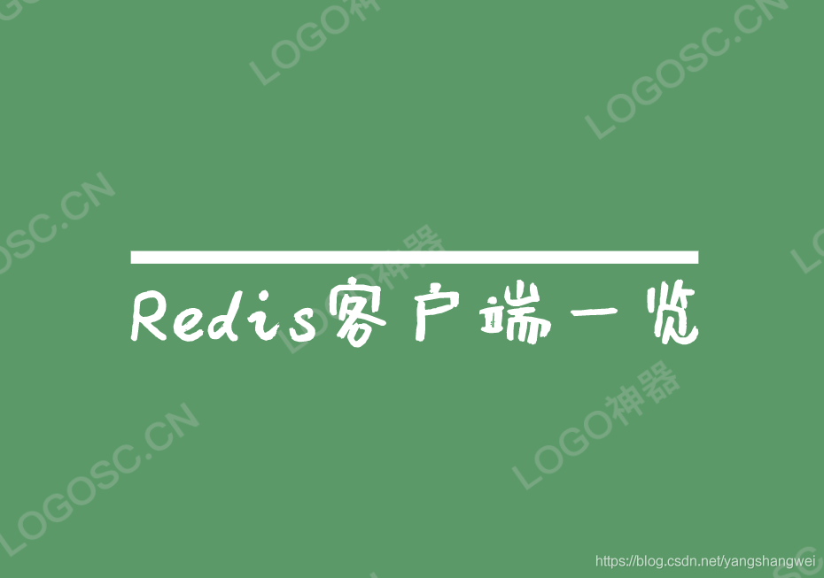
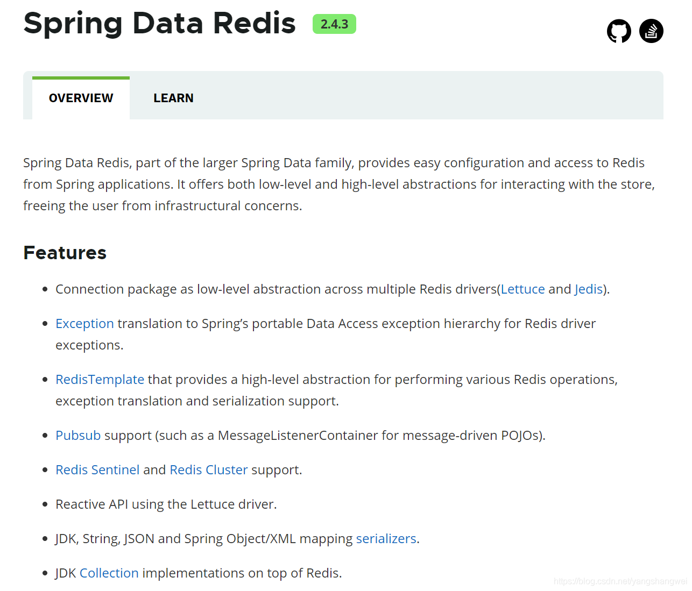
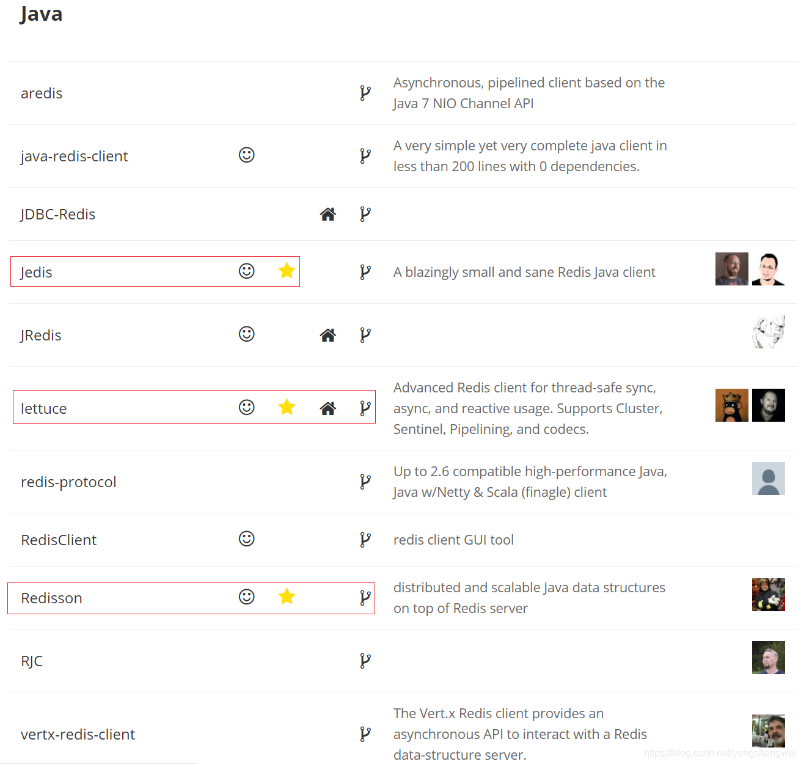
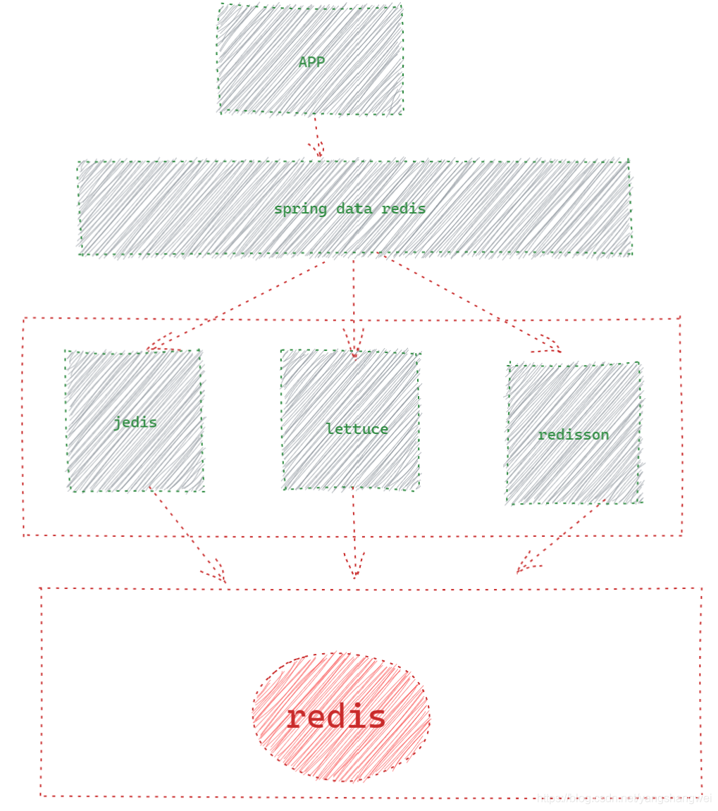
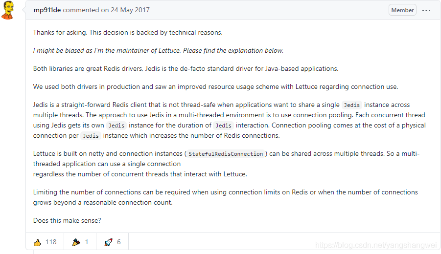
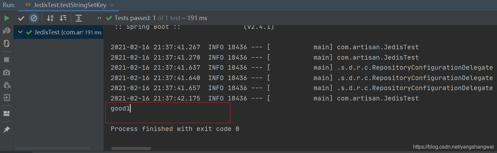
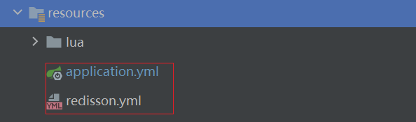
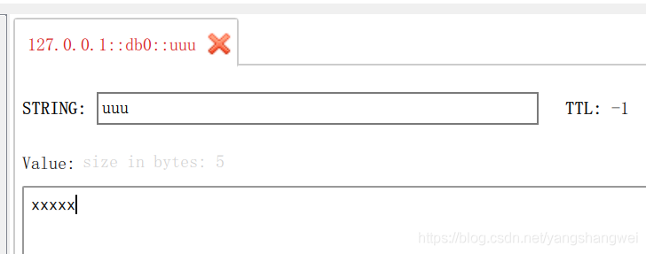

# Redis - Spring Data Redis 操作 Jedis 、Lettuce 、 Redisson





## 官网

<https://spring.io/projects/spring-data-redis>



我们知道常用的Redis客户端 <https://redis.io/clients#java>




怎么还有 Spring Data Redis ?

莫慌，小兄弟， 来看个关系图 帮你捋一捋




## Jedis VS Lettuce

在 spring-boot-starter-data-redis 项目 2.X 版本中 ，默认使用 Lettuce 作为 Java Redis 工具库 ， 为啥不用jedis 了？

[Why is Lettuce the default Redis client used in Spring Session Redis? #789](https://github.com/spring-projects/spring-session/issues/789)



也有可能跟jedis 有一段时间不更新了有关系~


## Jedis Code

### POM依赖

```java
  >

        <!-- 实现对 Spring Data Redis 的自动化配置 -->
        
            org.springframework.boot
            spring-boot-starter-data-redis
            
                
                
                    io.lettuce
                    lettuce-core
                
            
        

        <!--  Jedis -->
        
            redis.clients
            jedis
        

        <!-- 单元测试 -->
        
            org.springframework.boot
            spring-boot-starter-test
            test
        

        <!-- 使用 fastjson 作为 JSON 序列化的工具 -->
        
            com.alibaba
            fastjson
            1.2.61
        

        <!-- Spring Data Redis 默认使用 Jackson 作为 JSON 序列化的工具 -->
        
            com.fasterxml.jackson.core
            jackson-databind
        
 
    >
```

### 配置文件

```java
spring:
  # 对应 RedisProperties 类
  redis:
    host: 127.0.0.1
    port: 6379
    password: # Redis 服务器密码，默认为空。生产中，一定要设置 Redis 密码！
    database: 0 # Redis 数据库号，默认为 0 。
    timeout: 0 # Redis 连接超时时间，单位：毫秒。
    # 对应 RedisProperties.Jedis 内部类
    jedis:
      pool:
        max-active: 8 # 连接池最大连接数，默认为 8 。使用负数表示没有限制。
        max-idle: 8 # 默认连接数最小空闲的连接数，默认为 8 。使用负数表示没有限制。
        min-idle: 0 # 默认连接池最小空闲的连接数，默认为 0 。允许设置 0 和 正数。
        max-wait: -1 # 连接池最大阻塞等待时间，单位：毫秒。默认为 -1 ，表示不限制。
```

### 配置类

```java
package com.artisan.config;

import org.springframework.beans.factory.annotation.Autowired;
import org.springframework.context.annotation.Configuration;
import org.springframework.data.redis.connection.RedisConnectionFactory;
import org.springframework.data.redis.core.RedisTemplate;
import org.springframework.data.redis.serializer.RedisSerializer;

/**
 * @author 小工匠
 * @version 1.0
 * @description: TODO
 * @date 2021/2/16 21:07
 * @mark: show me the code , change the world
 */


@Configuration
public class RedisConfiguration {

    @Autowired
    private RedisConnectionFactory connectionFactory;


    public RedisTemplate<String, Object> redisTemplate() {
 
	  		RedisTemplate<String,Object> template = new RedisTemplate();
	        template.setConnectionFactory(connectionFactory);
	        // 序列化工具
	        Jackson2JsonRedisSerializer<Object> jackson2JsonRedisSerializer = new Jackson2JsonRedisSerializer<Object>(Object.class);
	        ObjectMapper om = new ObjectMapper();
	        om.setVisibility(PropertyAccessor.ALL, JsonAutoDetect.Visibility.ANY);
	        om.enableDefaultTyping(ObjectMapper.DefaultTyping.NON_FINAL);
	        jackson2JsonRedisSerializer.setObjectMapper(om);
	
	        StringRedisSerializer stringRedisSerializer = new StringRedisSerializer();
	        template.setKeySerializer(stringRedisSerializer);
	        template.setValueSerializer(jackson2JsonRedisSerializer);
	
	        template.setHashKeySerializer(jackson2JsonRedisSerializer);
	        template.setHashValueSerializer(jackson2JsonRedisSerializer);
	
	        template.afterPropertiesSet();

        return template;
    }
}
```


### 单元测试

```java
 package com.artisan;


import org.junit.Test;
import org.junit.runner.RunWith;

import org.springframework.beans.factory.annotation.Autowired;
import org.springframework.boot.test.context.SpringBootTest;
import org.springframework.data.redis.core.StringRedisTemplate;
import org.springframework.test.context.junit4.SpringRunner;

/**
 * @author 小工匠
 * @version 1.0
 * @description: TODO
 * @date 2021/2/16 20:56
 * @mark: show me the code , change the world
 */
@RunWith(SpringRunner.class)
@SpringBootTest
public class JedisTest {

    @Autowired
    private StringRedisTemplate stringRedisTemplate;

    @Test
    public void testStringSetKey() {
        // set
        stringRedisTemplate.opsForValue().set("artisan", "good1");
        // get
        String artisan = stringRedisTemplate.opsForValue().get("artisan");
        System.out.println(artisan);
    }


}
```




## Lettuce Code

2.x 以上默认 使用的客户端为Lettuce , 参考 [Spring Session - 使用Spring Session从零到一构建分布式session](https://artisan.blog.csdn.net/article/details/113820856)

这里就不赘述了。


## Redisson Code


### POM依赖

```java
	<dependencies>

        <!--  Redisson  -->
        <dependency>
            <groupId>org.redisson</groupId>
            <artifactId>redisson-spring-boot-starter</artifactId>
            <version>3.11.3</version>
        </dependency>


        <dependency>
            <groupId>org.springframework.boot</groupId>
            <artifactId>spring-boot-starter-test</artifactId>
            <scope>test</scope>
        </dependency>

        <dependency>
            <groupId>com.alibaba</groupId>
            <artifactId>fastjson</artifactId>
            <version>1.2.61</version>
        </dependency>

        <dependency>
            <groupId>com.fasterxml.jackson.core</groupId>
            <artifactId>jackson-databind</artifactId>
        </dependency>


    </dependencies>
```

### 配置文件




【application.yml】

```java
spring:
  # 对应 RedisProperties 类
  redis:
    host: 127.0.0.1
    port: 6379
#    password: # Redis 服务器密码，默认为空。生产中，一定要设置 Redis 密码！
    database: 0 # Redis 数据库号，默认为 0 。
    timeout: 0 # Redis 连接超时时间，单位：毫秒。
    # 对应 RedissonProperties 类  如果为空 需要注释掉
#    redisson:
#      config: classpath:redisson.yml # 具体的每个配置项，见 org.redisson.config.Config 类。
```


使用 Spring Boot 整合 Redisson 时候，通过该配置项，引入一个外部的 Redisson 相关的配置文件 ，引入了 classpath:redisson.yaml 配置文件

引入的 redisson.config 对应的配置文件，对应的类是 org.redisson.config.Config 类。因为示例中，我们使用的比较简单，所以就没有做任何 Redisson 相关的自定义配置。 如果没有配置任何内容，需要在 application.yml 里注释掉 redisson.config 。

具体配置信息可参考 [Spring Boot2.x 整合lettuce redis 和 redisson](https://blog.csdn.net/zl_momomo/article/details/82788294)


### 配置类

```java
package com.artisan.config;

import org.springframework.beans.factory.annotation.Autowired;
import org.springframework.context.annotation.Configuration;
import org.springframework.data.redis.connection.RedisConnectionFactory;
import org.springframework.data.redis.core.RedisTemplate;
import org.springframework.data.redis.serializer.RedisSerializer;

/**
 * @author 小工匠
 * @version 1.0
 * @description: TODO
 * @date 2021/2/16 21:07
 * @mark: show me the code , change the world
 */


@Configuration
public class RedisConfiguration {

    @Autowired
    private RedisConnectionFactory connectionFactory;


    public RedisTemplate<String, Object> redisTemplate() {
 
	  		RedisTemplate<String,Object> template = new RedisTemplate();
	        template.setConnectionFactory(connectionFactory);
	        // 序列化工具
	        Jackson2JsonRedisSerializer<Object> jackson2JsonRedisSerializer = new Jackson2JsonRedisSerializer<Object>(Object.class);
	        ObjectMapper om = new ObjectMapper();
	        om.setVisibility(PropertyAccessor.ALL, JsonAutoDetect.Visibility.ANY);
	        om.enableDefaultTyping(ObjectMapper.DefaultTyping.NON_FINAL);
	        jackson2JsonRedisSerializer.setObjectMapper(om);
	
	        StringRedisSerializer stringRedisSerializer = new StringRedisSerializer();
	        template.setKeySerializer(stringRedisSerializer);
	        template.setValueSerializer(jackson2JsonRedisSerializer);
	
	        template.setHashKeySerializer(jackson2JsonRedisSerializer);
	        template.setHashValueSerializer(jackson2JsonRedisSerializer);
	
	        template.afterPropertiesSet();

        return template;
    }
}
```


### 单元测试

```java
   @Test
    public void test() {
        stringRedisTemplate.opsForValue().set("uuu", "xxxxx");
    }
```

