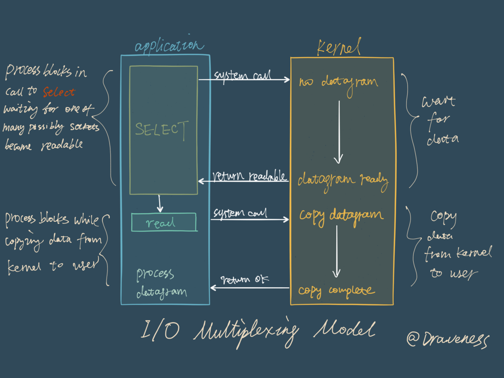
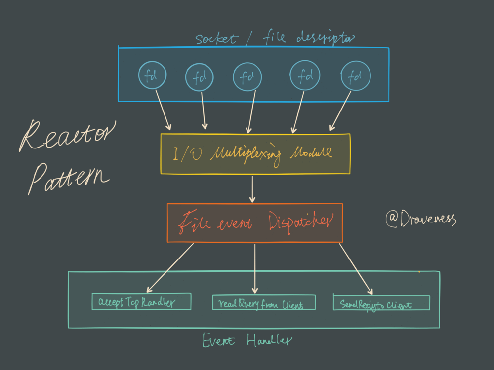

# Redis 和 I/O 多路复用

### I/O 多路复用

> 虽然还有很多其它的 I/O 模型，但是在这里都不会具体介绍。

阻塞式的 I/O 模型并不能满足这里的需求，我们需要一种效率更高的 I/O 模型来支撑 Redis 的多个客户（redis-cli），这里涉及的就是 I/O 多路复用模型了：

在 I/O 多路复用模型中，最重要的函数调用就是 `select`，该方法的能够同时监控多个文件描述符的可读可写情况，当其中的某些文件描述符可读或者可写时，`select` 方法就会返回可读以及可写的文件描述符个数。

>关于 `select` 的具体使用方法，在网络上资料很多，这里就不过多展开介绍了；
>
>与此同时也有其它的 I/O 多路复用函数 `epoll/kqueue/evport`，它们相比 `select` 性能更优秀，同时也能支撑更多的服务。

## Reactor 设计模式

Redis 服务采用 Reactor 的方式来实现文件事件处理器（每一个网络连接其实都对应一个文件描述符）

文件事件处理器使用 I/O 多路复用模块同时监听多个 FD，当 `accept`、`read`、`write` 和 `close` 文件事件产生时，文件事件处理器就会回调 FD 绑定的事件处理器。

虽然整个文件事件处理器是在单线程上运行的，但是通过 I/O 多路复用模块的引入，实现了同时对多个 FD 读写的监控，提高了网络通信模型的性能，同时也可以保证整个 Redis 服务实现的简单。