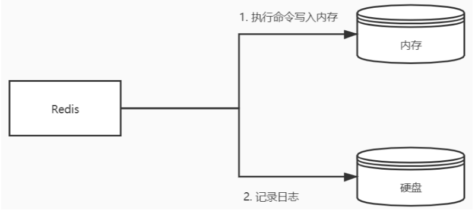
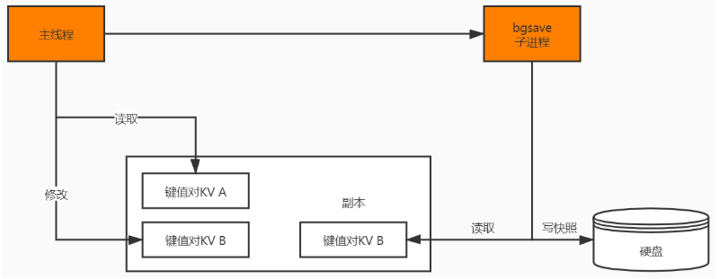
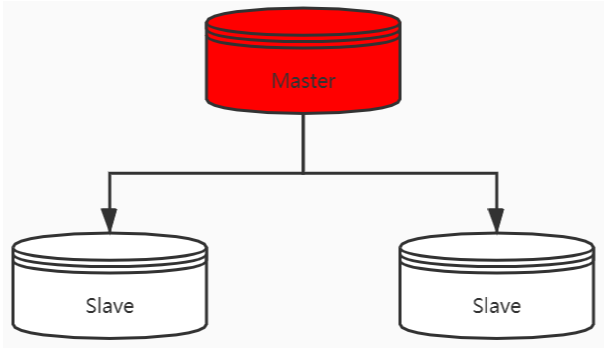
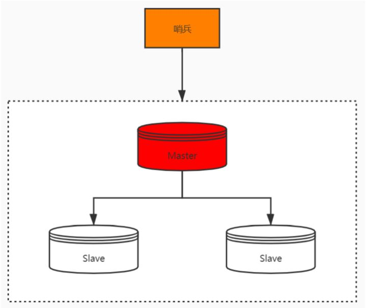
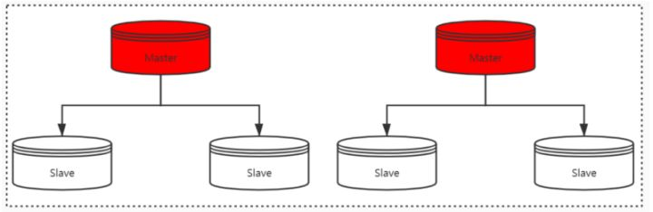
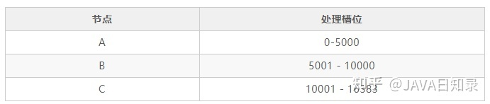
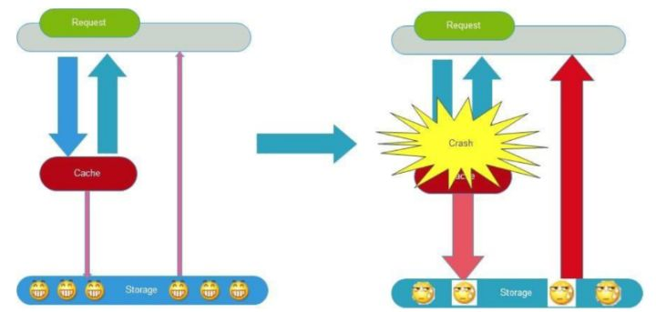

## Redis原理

### **Redis是单线程还是多线程呢？**

redis 不同版本之间采用的线程模型是不一样的，在Redis4.0版本之前使用的是单线程模型，在4.0版本之后增加了多线程的支持。

在4.0之前虽然我们说Redis是单线程，也只是说它的网络I/O线程以及Set 和 Get操作是由一个线程完成的。但是Redis的持久化、集群同步还是使用其他线程来完成。

4.0之后添加了多线程的支持，主要是体现在大数据的异步删除功能上，例如 `unlink key`、`flushdb async`、`flushall async` 等

### **那为什么Redis在4.0之前会选择使用单线程？而且使用单线程还那么快？**

选择单线程个人觉得主要是使用简单，不存在锁竞争，可以在无锁的情况下完成所有操作，不存在死锁和线程切换带来的性能和时间上的开销，但同时单线程也不能完全发挥出多核CPU的性能。

至于为什么单线程那么快我觉得主要有以下几个原因：

1. Redis 的大部分操作都在内存中完成，内存中的执行效率本身就很快，并且采用了高效的数据结构，比如哈希表和跳表。
2. 使用单线程避免了多线程的竞争，省去了多线程切换带来的时间和性能开销，并且不会出现死锁。
3. 采用 I/O 多路复用机制处理大量客户端的Socket请求，因为这是基于非阻塞的 I/O 模型，这就让Redis可以高效地进行网络通信，I/O的读写流程也不再阻塞。

### **那Redis是如何实现数据不丢失的呢？**

Redis数据是存储在内存中的，为了保证Redis数据不丢失，那就要把数据从内存存储到磁盘上，以便在服务器重启后还能够从磁盘中恢复原有数据，这就是Redis的数据持久化。Redis数据持久化有三种方式。

- AOF 日志（Append Only File，文件追加方式）：记录所有的操作命令，并以文本的形式追加到文件中。
- RDB 快照（Redis DataBase）：将某一个时刻的内存数据，以二进制的方式写入磁盘。
- 混合持久化方式：Redis 4.0 新增了混合持久化的方式，集成了 RDB 和 AOF 的优点。

### **AOF和 RDB的实现原理**

AOF采用的是写后日志的方式，Redis先执行命令把数据写入内存，然后再记录日志到文件中。AOF日志记录的是操作命令，不是实际的数据，如果采用AOF方法做故障恢复时需要将全量日志都执行一遍。

RDB采用的是内存快照的方式，它记录的是某一时刻的数据，而不是操作，所以采用RDB方法做故障恢复时只需要直接把RDB文件读入内存即可，实现快速恢复。

你刚提到了AOF采用的是 “写后日志” 的方式，我们平时用的MySQL则采用的是 “写前日志”，那 **Redis为什么要先执行命令，再把数据写入日志呢？**

额，这个主要是由于Redis在写入日志之前，不对命令进行语法检查，所以只记录执行成功的命令，避免出现记录错误命令的情况，而且在命令执行后再写日志不会阻塞当前的写操作。

### **后写日志又有什么风险呢？**

后写日志主要有两个风险可能会发生：

- 数据可能会丢失：如果 Redis 刚执行完命令，此时发生故障宕机，会导致这条命令存在丢失的风险。
- 可能阻塞其他操作：AOF 日志其实也是在主线程中执行，所以当 Redis 把日志文件写入磁盘的时候，还是会阻塞后续的操作无法执行。

###  **RDB做快照时会阻塞线程吗？**

Redis 提供了两个命令来生成 RDB 快照文件，分别是 `save` 和 `bgsave`。`save` 命令在主线程中执行，会导致阻塞。而 `bgsave` 命令则会创建一个子进程，用于写入 RDB 文件的操作，避免了对主线程的阻塞，这也是 Redis RDB 的默认配置。

### **RDB 做快照的时候数据能修改吗？**

save是同步的会阻塞客户端命令，bgsave的时候是可以修改的。

### **那Redis是怎么解决在bgsave做快照的时候允许数据修改呢？**

这里主要是利用 `bgsave`的子线程实现的，具体操作如下：

- 如果主线程执行读操作，则主线程和 `bgsave` 子进程互相不影响；
- 如果主线程执行写操作，则被修改的数据会复制一份副本，然后 `bgsave`子进程会把该副本数据写入 RDB 文件，在这个过程中，主线程仍然可以直接修改原来的数据。

要注意，Redis 对 RDB 的执行频率非常重要，因为这会影响快照数据的完整性以及 Redis 的稳定性，所以在 Redis 4.0 后，**增加了 AOF 和 RDB 混合的数据持久化机制：** 把数据以 RDB 的方式写入文件，再将后续的操作命令以 AOF 的格式存入文件，既保证了 Redis 重启速度，又降低数据丢失风险。

### **那你再跟我说说Redis如何实现高可用吧？**

Redis实现高可用主要有三种方式：主从复制、哨兵模式，以及 Redis 集群。

#### **主从复制**

将从前的一台 Redis 服务器，同步数据到多台从 Redis 服务器上，即一主多从的模式，这个跟MySQL主从复制的原理一样。

#### **哨兵模式**

使用 Redis 主从服务的时候，会有一个问题，就是当 Redis 的主从服务器出现故障宕机时，需要手动进行恢复，为了解决这个问题，Redis 增加了哨兵模式（因为哨兵模式做到了可以监控主从服务器，并且提供自动容灾恢复的功能）。

#### **Redis Cluster（集群）**

Redis Cluster 是一种分布式去中心化的运行模式，是在 Redis 3.0 版本中推出的 Redis 集群方案，它将数据分布在不同的服务器上，以此来降低系统对单主节点的依赖，从而提高 Redis 服务的读写性能。

### 使用哨兵模式在数据上有副本数据做保证，在可用性上又有哨兵监控，一旦master宕机会选举salve节点为master节点，这种已经满足了我们的生产环境需要，**那为什么还需要使用集群模式呢？**

哨兵模式归根节点还是主从模式，在主从模式下我们可以通过增加slave节点来扩展读并发能力，但是没办法扩展写能力和存储能力，存储能力只能是master节点能够承载的上限。所以为了扩展写能力和存储能力，我们就需要引入集群模式。

### **集群中那么多Master节点，redis cluster在存储的时候如何确定选择哪个节点呢？**

这应该是使用了某种hash算法，但是我不太清楚。。。

Redis Cluster采用的是**类一致性哈希算法实现节点选择的**，至于什么是一致性哈希算法你自己回去看看。

Redis Cluster将自己分成了16384个**Slot**（槽位），哈希槽类似于数据分区，每个键值对都会根据它的 key，被映射到一个哈希槽中，具体执行过程分为两大步。

- 根据键值对的 key，按照 CRC16 算法计算一个 16 bit 的值。
- 再用 16bit 值对 16384 取模，得到 `0~16383` 范围内的模数，每个模数代表一个相应编号的哈希槽。

每个Redis节点负责处理一部分槽位，假如你有三个master节点 ABC，每个节点负责的槽位如下：

这样就实现了cluster节点的选择。

### Redis缓存血崩

redis的话我们主要是用来存储一些常用的配置类数据还有一些热点数据；还有存储一些到期失效的数据，比如登录用户颁发的token等。

既然你们用来存储热点数据。那么我来问你个实际场景，**「查询热点数据的时候会先从缓存加载，如果缓存没有命中则会检索数据库获取数据。往往我们还会给热点缓存数据设置一个过期时间。那么我的问题是，假设在某一时间点热点缓存全部过期失效了，这样所有的请求都会直接进入数据库，一瞬间就会把数据库压垮，如果是你会怎么解决这个问题？」**

因为缓存同一时间大面积的失效，或者缓存服务暂时不能提供服务等，从而导致所有请求都去查数据库，导致数据库CPU和内存负载过高，甚至宕机。这一现象被称之为 **「缓存雪崩」**。

#### 缓存预热

数据加热的含义就是在正式部署之前，先把可能的数据先预先访问一遍，这样部分可能大量访问的数据就会加载到缓存中。在即将发生大并发访问前手动触发加载缓存不同的key。

#### 加上互斥锁

可以在第一个查询数据的请求上使用一个互斥锁来锁住它，其他的线程走到这一步拿不到锁就等着，等第一个线程查询到了数据，然后将数据放到redis缓存起来。后面的线程进来发现已经有缓存了，就直接走缓存。

#### 过期时间均匀分布

给缓存的时效时间加上随机因子，即给缓存设置不同的过期时间，让缓存失效的时间点尽量均匀。

#### 构建高可用的缓存系统

把Redis设计成高可用的，即使个别节点、个别机器、甚至是机房宕掉，依然可以提供服务，例如 Redis Sentinel 和 Redis Cluster 都实现了高可用。

