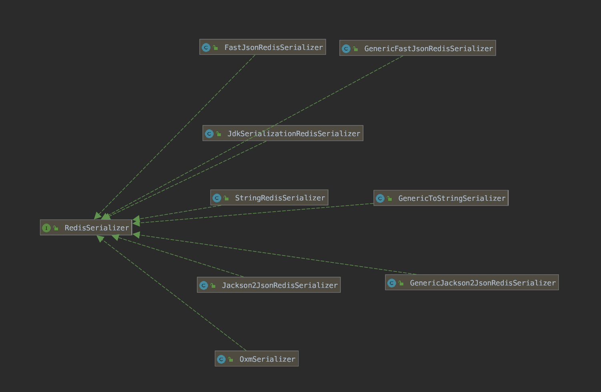

## 3. 序列化

### 3.1 RedisSerializer

**org.springframework.data.redis.serializer.RedisSerializer**接口，**Redis** 序列化接口，用于 Redis KEY 和 VALUE 的序列化。简化代码如下

```java
// RedisSerializer.java
public interface RedisSerializer<T> {

	@Nullable
	byte[] serialize(@Nullable T t) throws SerializationException;

	@Nullable
	T deserialize(@Nullable byte[] bytes) throws SerializationException;

}
```

- 定义了对象 `<T>` 和二进制数组的转换。
- 啊，可能有胖友会有疑惑了：我们在 `redis-cli` 终端，看到的不都是字符串么，怎么这里是序列化成二进制数组呢？实际上，Redis Client 传递给 Redis Server 是传递的 KEY 和 VALUE 都是二进制值数组。好奇的胖友，可以打开 Jedis Connection#sendCommand(final Command cmd, final byte[\]... args)方法，传入的参数就是二进制数组，而 `cmd` 命令也会被序列化成二进制数组。



主要分成四类：

- JDK 序列化方式
- String 序列化方式
- JSON 序列化方式
- XML 序列化方式

#### 3.1.1 JDK 序列化方式

**org.springframework.data.redis.serializer.JdkSerializationRedisSerializer**，默认情况下，RedisTemplate 使用该数据列化方式。具体的，可以看看 **RedisTemplate#afterPropertiesSet()** 方法，在 RedisTemplate 未设置序列化的情况下，使用 **JdkSerializationRedisSerializer** 作为序列化实现。在 Spring Boot 自动化配置 RedisTemplate Bean 对象时，就未设置。

绝大多数情况下，可能 99.9999% ，我们不会使用 JdkSerializationRedisSerializer 进行序列化。为什么呢？我们来看一个示例，代码如下：

```java
// Test01.java
@RunWith(SpringRunner.class)
@SpringBootTest
public class Test01 {

    @Autowired
    private RedisTemplate redisTemplate;

    @Test
    public void testStringSetKey02() {
        redisTemplate.opsForValue().set("yunai", "shuai");
    }
}
```

我们先来执行下 `#testStringSetKey02()` 方法这个测试方法。注意，此处我们使用的是 RedisTemplate 而不是 StringRedisTemplate 。执行完成后，我们在控制台查询，看看是否真的执行成功了。

```tex
# 在 `redis-cli` 终端中

127.0.0.1:6379> scan 0
1) "0"
2) 1) "\xac\xed\x00\x05t\x00\x05yunai"

127.0.0.1:6379> get "\xac\xed\x00\x05t\x00\x05yunai"
"\xac\xed\x00\x05t\x00\x05shuai"
```

通过 Redis [SCAN](http://redis.cn/commands/scan.html) 命令，我们扫描出了一个奇怪的 `"yunai"` KEY ，前面带着奇怪的 16 进制字符。而后，我们使用这个奇怪的 KEY 去获取对应的 VALUE ，结果前面也是一串奇怪的 16 进制字符。

> 具体为什么是这样一串奇怪的 16 进制，胖友可以看看 [`ObjectOutputStream#writeString(String str, boolean unshared)`](https://github.com/JetBrains/jdk8u_jdk/blob/master/src/share/classes/java/io/ObjectOutputStream.java#L1301-L1311) 的代码，实际就是标志位 + 字符串长度 + 字符串内容。

对于 KEY 被序列化成这样，我们线上通过 KEY 去查询对应的 VALUE 势必会非常不方便，所以 KEY 肯定是不能被这样序列化的。

**对于 VALUE 被序列化成这样，除了阅读可能困难一点，不支持跨语言外，实际上也没啥问题。不过，实际线上场景，还是使用 JSON 序列化居多。**

#### 3.1.2 String 序列化方式

① **org.springframework.data.redis.serializer.StringRedisSerializer** ，字符串和二进制数组的直接转换。代码如下：

```java
// StringRedisSerializer.java

private final Charset charset;

@Override
public String deserialize(@Nullable byte[] bytes) {
	return (bytes == null ? null : new String(bytes, charset));
}

@Override
public byte[] serialize(@Nullable String string) {
	return (string == null ? null : string.getBytes(charset));
}
```

- 是不是很直接简单。

**绝大多数情况下，我们 KEY 和 VALUE 都会使用这种序列化方案**。而 VALUE 的序列化和反序列化，自己在逻辑调用 JSON 方法去序列化。为什么呢？继续往下看。

② **org.springframework.data.redis.serializer.GenericToStringSerializer<T>** ，使用 Spring ConversionService 实现 <T> 对象和 String 的转换，从而 String 和二进制数组的转换。

例如说，序列化的过程，首先 <T> 对象通过 ConversionService 转换成 String ，然后 String 再序列化成二进制数组。反序列化的过程，胖友自己结合源码思考下 🤔 。

当然，GenericToStringSerializer 貌似基本不会去使用，所以不用去了解也问题不大，哈哈哈。


#### 3.1.3 JSON 序列化方式

① org.springframework.data.redis.serializer.GenericJackson2JsonRedisSerializer ，使用 Jackson 实现 JSON 的序列化方式，并且从 Generic 单词可以看出，是支持所有类。怎么体现呢？参见构造方法的代码：

```java
// GenericJackson2JsonRedisSerializer.java

public GenericJackson2JsonRedisSerializer(@Nullable String classPropertyTypeName) {

	this(new ObjectMapper());

	// simply setting {@code mapper.disable(SerializationFeature.FAIL_ON_EMPTY_BEANS)} does not help here since we need
	// the type hint embedded for deserialization using the default typing feature.
	mapper.registerModule(new SimpleModule().addSerializer(new NullValueSerializer(classPropertyTypeName)));

	// <1>
	if (StringUtils.hasText(classPropertyTypeName)) {
		mapper.enableDefaultTypingAsProperty(DefaultTyping.NON_FINAL, classPropertyTypeName);
	// <2>
	} else {
		mapper.enableDefaultTyping(DefaultTyping.NON_FINAL, As.PROPERTY);
	}
}
```


> <1> 处，如果传入了 classPropertyTypeName 属性，就是使用使用传入对象的 classPropertyTypeName 属性对应的值，作为默认类型（Default Typing）。
> <2> 处，如果未传入 classPropertyTypeName 属性，则使用传入对象的类全名，作为默认类型（Default Typing）。


那么，胖友可能会问题，**什么是默认类型（Default Typing）呢？**我们来思考下，在将一个对象序列化成一个字符串，怎么保证字符串反序列化成对象的类型呢？**Jackson 通过 Default Typing** ，**会在字符串多冗余一个类型****，**这样反序列化就知道具体的类型了。来举个例子，使用我们等会示例会用到的 UserCacheObject 类。**

> 标准序列化的结果，如下：

```java
{
    "id": 1,
    "name": "芋道源码",
    "gender": 1
}
```

>使用 Jackson Default Typing 机制序列化的结果，如下：

```java
{
       "@class": "cn.iocoder.springboot.labs.lab10.springdatarediswithjedis.cacheobject.UserCacheObject",
       "id": 1,
       "name": "芋道源码",
       "gender": 1
}
```

- 看 `@class` 属性，反序列化的对象的类型不就有了么？

下面我们来看一个 **GenericJackson2JsonRedisSerializer** 的示例。在看之前，胖友先跳到 「3.2 配置序列化方式」 小节，来看看如何配置 **GenericJackson2JsonRedisSerializer** 作为 VALUE 的序列化方式。然后，马上调回到此处。

示例代码如下：

```java
// Test01.java

@Autowired
private RedisTemplate redisTemplate;

@Test
public void testStringSetKeyUserCache() {
    UserCacheObject object = new UserCacheObject()
            .setId(1)
            .setName("芋道源码")
            .setGender(1); // 男
    String key = String.format("user:%d", object.getId());
    redisTemplate.opsForValue().set(key, object);
}

@Test
public void testStringGetKeyUserCache() {
    String key = String.format("user:%d", 1);
    Object value = redisTemplate.opsForValue().get(key);
    System.out.println(value);
}
```


