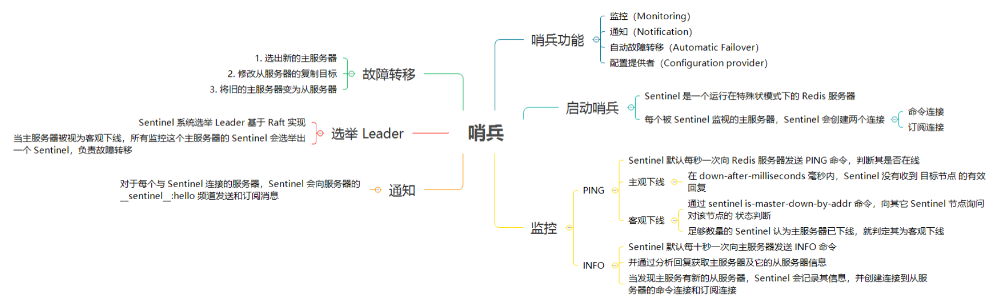
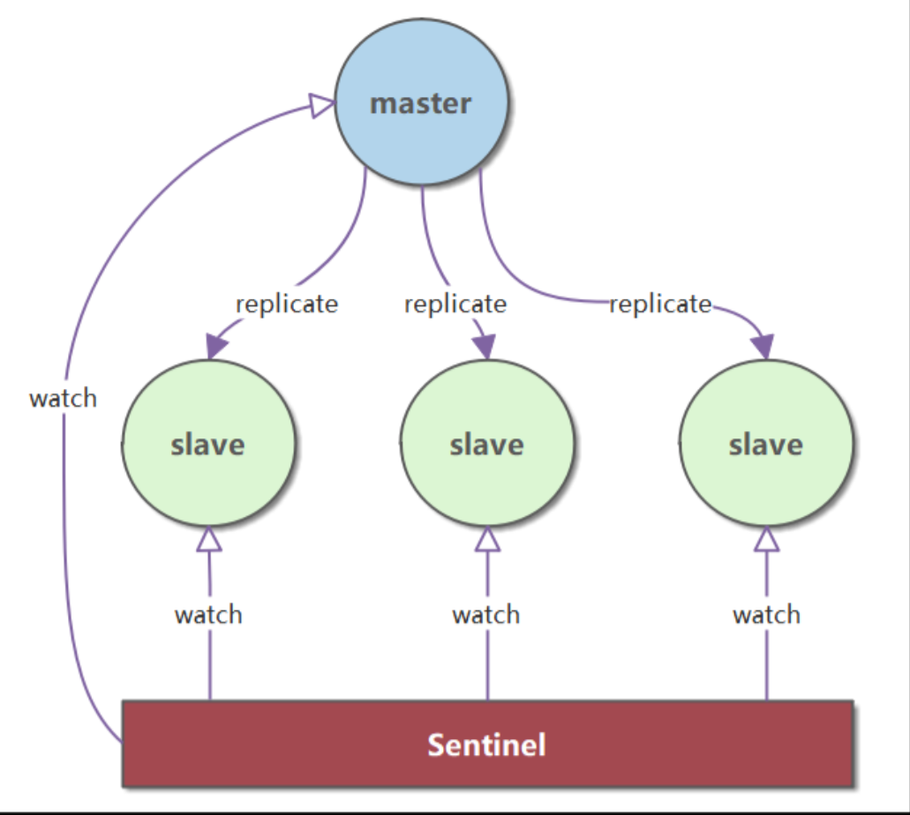
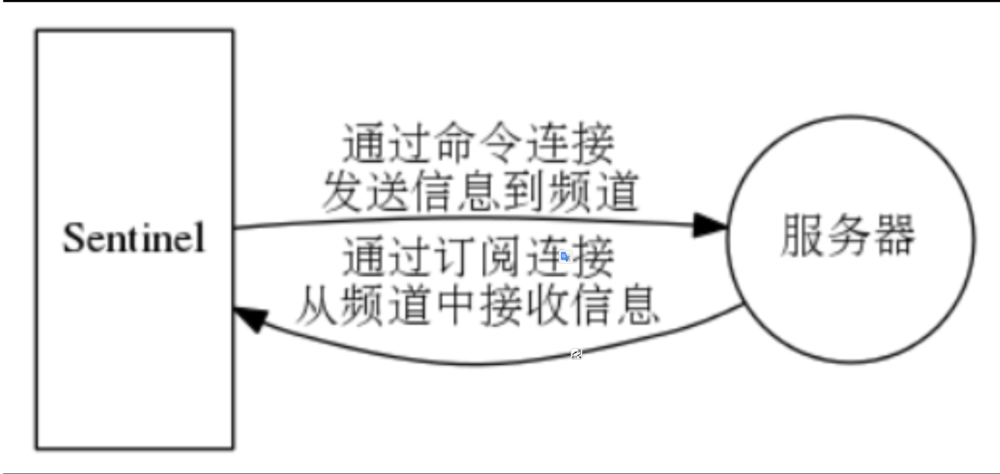

# Redis 哨兵


>Redis 哨兵（Sentinel）是 Redis 的**高可用性**（Hight Availability）解决方案。




>Redis 哨兵是 [Raft 算法 (opens new window)](https://github.com/dunwu/blog/blob/master/source/_posts/theory/raft.md)的具体实现。


## 一、哨兵简介

Redis 哨兵（Sentinel）是 Redis 的**高可用性**（Hight Availability）解决方案：由一个或多个 Sentinel 实例组成的 Sentinel 系统可以监视任意多个主服务器，以及这些主服务器的所有从服务器，并在被监视的主服务器进入下线状态时，自动将下线主服务器的某个从服务器升级为新的主服务器，然后由新的主服务器代替已下线的主服务器继续处理命令请求。 



Sentinel 的主要功能如下：

- **监控（Monitoring）** - Sentinel 不断检查主从服务器是否正常在工作。
- **通知（Notification）** - Sentinel 可以通过一个 api 来通知系统管理员或者另外的应用程序，被监控的 Redis 实例有一些问题。
- **自动故障转移（Automatic Failover****）** - 如果一个主服务器下线，Sentinel 会开始自动故障转移：把一个从节点提升为主节点，并重新配置其他的从节点使用新的主节点，使用 Redis 服务的应用程序在连接的时候也被通知新的地址。
- **配置提供者（Configuration provider****）** - Sentinel 给客户端的服务发现提供来源：对于一个给定的服务，客户端连接到 Sentinels 来寻找当前主节点的地址。当故障转移发生的时候，Sentinel 将报告新的地址。


## 二、启动哨兵

启动一个 Sentinel 可以使用下面任意一条命令，两条命令效果完全相同。

```
redis-sentinel /path/to/sentinel.conf
redis-server /path/to/sentinel.conf --sentinel
```

当一个 Sentinel 启动时，它需要执行以下步骤：

1. 初始化服务器。
2. 使用 Sentinel 专用代码。
3. 初始化 Sentinel 状态。
4. 初始化 Sentinel 的主服务器列表。
5. 创建连向被监视的主服务器的网络连接。

**Sentinel 本质上是一个运行在特殊状模式下的 Redis 服务器**。

Sentinel 模式下 Redis 服务器只支持 PING、SENTINEL、INFO、SUBSCRIBE、UNSUBSCRIBE、PSUBSCRIBE、PUNSUBSCRIBE七个命令。

创建连向被监视的主服务器的网络连接，Sentinel 将成为主服务器的客户端，它可以向主服务器发送命令，并从命令回复中获取相关的信息。对于每个被 Sentinel 监视的主服务器，Sentinel 会创建两个连向主服务器的异步网络：

- 命令连接：专门用于向主服务器发送命令，并接受命令回复。
- 订阅连接：专门用于订阅主服务器的 __sentinel__:hello 频道。


## 三、监控

### 检测服务器状态

>**Sentinel 向 Redis 服务器发送** **PING** **命令，检查其状态**。
>默认情况下，**每个** Sentinel 节点会以 **每秒一次** 的频率对 Redis 节点和 **其它**的 Sentinel 节点发送 PING 命令，并通过节点的 **回复** 来判断节点是否在线。

- **主观下线**：**主观下线** 适用于所有 **主节点** 和 **从节点**。如果在 down-after-milliseconds 毫秒内，Sentinel 没有收到 **目标节点** 的有效回复，则会判定 **该节点** 为 **主观下线**。
- **主观下线**：**主观下线** 适用于所有 **主节点** 和 **从节点**。如果在 down-after-milliseconds 毫秒内，Sentinel 没有收到 **目标节点** 的有效回复，则会判定 **该节点** 为 **主观下线**。
- Sentinel 节点通过 sentinel is-master-down-by-addr 命令，向其它 Sentinel 节点询问对该节点的 **状态判断**。


### 获取服务器信息

>**Sentinel 向主服务器发送** **INFO** **命令，获取主服务器及它的从服务器信息**。 

- **获取主服务器信息** - Sentinel **默认**会以**每十秒一次**的频率，通过命令连接**向被监视的主服务器发送** **INFO** **命令，并通过分析** **INFO** **命令的回复来获取主服务器的当前信息**。
  - 主服务自身信息：包括 run_id 域记录的服务器运行 ID，以及 role 域记录的服务器角色
  - 主服务的从服务器信息：包括 IP 地址和端口号
- **获取从服务器信息** - 当 Sentinel 发现主服务器有新的从服务器出现时，Sentinel 除了会为这个新的从服务器创建相应的实例结构之外，Sentinel 还会创建连接到从服务器的命令连接和订阅连接。


## 四、通知

 对于每个与 Sentinel 连接的服务器，Sentinel 既会向服务器的 __sentinel__:hello 频道发送消息，也会订阅服务器的 __sentinel__:hello频道的消息。




### 向服务器发送消息

在默认情况下，Sentinel 会以每两秒一次的频率，通过命令向所有被监视的主服务器和从服务器发送以下格式的命令。

```
PUBLISH __sentinel__:hello "<s_ip>,<s_port>,<s_runid>,<s_epoch>,<m_name>,<m_ip>,<m_port>,<m_epoch>"
```

这条命令向服务器的 __sentinel__:hello 频道发送一条消息。


### 接收服务器的消息

当 Sentinel 与一个主服务器或从服务器建立起订阅连接后，Sentinel 就会通过订阅连接，向服务器发送以下命令：SUBSCRIBE __sentinel__:hello。

Sentinel 对 __sentinel__:hello 频道的订阅会一直持续到 Sentinel 与服务器断开连接为止。


## 五、选举 Leader

Redis Sentinel 系统选举 Leader 的算法是 [Raft (opens new window)](https://ramcloud.atlassian.net/wiki/download/attachments/6586375/raft.pdf)的实现。

Raft 是一种共识性算法，想了解其原理，可以参考 [深入剖析共识性算法 Raft(opens new window)](https://github.com/dunwu/blog/blob/master/source/_posts/theory/raft.md)。
**当一个主服务器被判断为客观下线时，监视这个下线主服务器的各个 Sentinel 会进行协商，选举出一个领头的 Sentinel，并由领头 Sentinel 对下线主服务器执行故障转移操作**。

所有在线 Sentinel 都有资格被选为 Leader。
每个 Sentinel 节点都需要 **定期执行** 以下任务：

（1）每个 Sentinel 以 **每秒钟** 一次的频率，向它所知的 **主服务器**、**从服务器** 以及其他 Sentinel **实例** 发送一个 PING 命令。
（2）如果一个 **实例**（instance）距离 **最后一次** 有效回复 PING 命令的时间超过 down-after-milliseconds 所指定的值，那么这个实例会被 Sentinel 标记为 **主观下线**。

（3）如果一个 **主服务器** 被标记为 **主观下线**，那么正在 **监视** 这个 **主服务器** 的所有 Sentinel 节点，要以 **每秒一次** 的频率确认 **主服务器** 的确进入了 **主观下线** 状态。
（4）如果一个 **主服务器** 被标记为 **主观下线**，并且有 **足够数量** 的 Sentinel（至少要达到 **配置文件** 指定的数量）在指定的 **时间范围** 内同意这一判断，那么这个 **主服务器** 被标记为 **客观下线**。
（5）在一般情况下， 每个 Sentinel 会以每 10 秒一次的频率，向它已知的所有 **主服务器** 和 **从服务器** 发送 INFO 命令。当一个 **主服务器** 被 Sentinel 标记为 **客观下线** 时，Sentinel 向 **下线主服务器** 的所有 **从服务器** 发送 INFO 命令的频率，会从 10 秒一次改为 **每秒一次**。

（6）Sentinel 和其他 Sentinel 协商 **主节点** 的状态，如果 **主节点** 处于 SDOWN 状态，则投票自动选出新的 **主节点**。将剩余的 **从节点** 指向 **新的主节点** 进行 **数据复制**。
（7）当没有足够数量的 Sentinel 同意 **主服务器** 下线时， **主服务器** 的 **客观下线状态** 就会被移除。当 **主服务器** 重新向 Sentinel 的 PING 命令返回 **有效回复**时，**主服务器** 的 **主观下线状态** 就会被移除。

注意：一个有效的 PING 回复可以是：+PONG、-LOADING 或者 -MASTERDOWN。如果 **服务器** 返回除以上三种回复之外的其他回复，又或者在 **指定时间** 内没有回复 PING 命令， 那么 Sentinel 认为服务器返回的回复 **无效**（non-valid）。


## 六、故障转移

在选举产生出 Sentinel Leader 后，Sentinel Leader 将对已下线的主服务器执行故障转移操作。操作含以下三个步骤：

（一）**选出新的主服务器**

故障转移第一步，是 Sentinel Leader 在已下线主服务属下的所有从服务器中，挑选一个状态良好、数据完整的从服务器。然后，向这个从服务器发送 SLAVEOF no one 命令，将其转换为主服务器。 

Sentinel Leader 如何选出新的主服务器：

- 删除列表中所有处于下线或断线状态的从服务器。 
- 删除列表中所有最近五秒没有回复过 Sentinel Leader 的 INFO 命令的从服务器。
- 删除所有与已下线主服务器连接断开超过 down-after-milliseconds * 10 毫秒的从服务器（down-after-milliseconds 指定了判断主服务器下线所需的时间）。 
- 之后， Sentinel Leader 先选出优先级最高的从服务器；如果优先级一样高，再选择复制偏移量最大的从服务器；如果结果还不唯一，则选出运行 ID 最小的从服务器。


（二）**修改从服务器的复制目标**

选出新的主服务器后，Sentinel Leader 会向所有从服务器发送 SLAVEOF 命令，让它们去复制新的主服务器。

（三）**将旧的主服务器变为从服务器**

Sentinel Leader 将旧的主服务器标记为从服务器。当旧的主服务器重新上线，Sentinel 会向它发送 SLAVEOF 命令，让其成为从服务器。