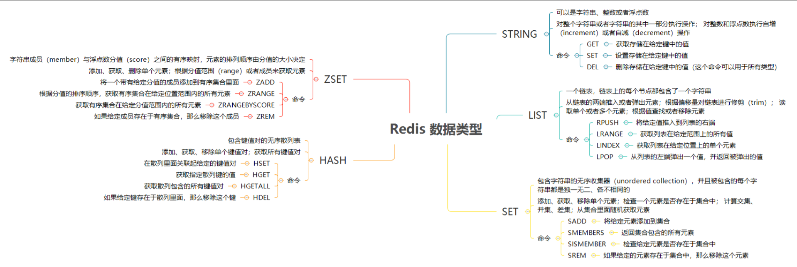
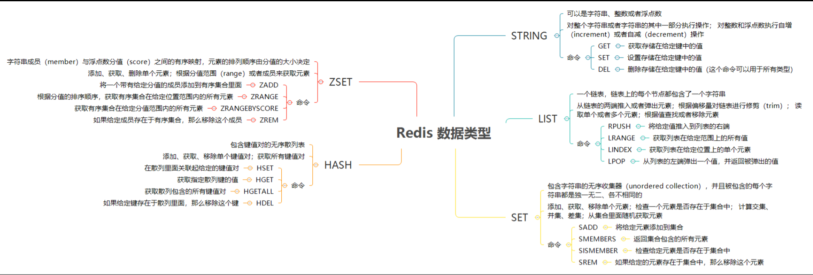

# Redis 数据类型



> 关键词：STRING、HASH、LIST、SET、ZSET、BitMap、HyperLogLog、Geo

## **Redis 数据类型**

> Redis 提供了多种数据类型，每种数据类型有丰富的命令支持。
>
> 使用 Redis ，不仅要了解其数据类型的特性，还需要根据业务场景，灵活的、高效的使用其数据类型来建模。 


### 一、Redis 基本数据类型





#### 1.STRING

**适用场景：缓存、计数器、共享 Session**


#### 2.HASH

**适用场景：存储结构化数据**，如一个对象：用户信息、产品信息等。


#### 3.LIST

**适用场景：用于存储列表型数据**。如：粉丝列表、商品列表等


#### 4.SET 

**适用场景：用于存储去重的列表型数据**。


#### 5.ZSET

适用场景：由于可以设置 score，且不重复。**适合用于存储各种排行数据**，如：按评分排序的有序商品集合、按时间排序的有序文章集合。


###   二、Redis 高级数据类型


#### 1.BitMap

BitMap 即位图。BitMap 不是一个真实的数据结构。而是 STRING 类型上的一组面向 bit 操作的集合。由于 STRING 是二进制安全的 blob，并且它们的最大长度是 512m，所以 BitMap 能最大设置 232 个不同的 bit。 

Bitmaps 的最大优点就是存储信息时可以节省大量的空间。例如在一个系统中，不同的用户被一个增长的用户 ID 表示。40 亿（232 = 410241024∗1024 ≈ 40 亿）用户只需要 512M 内存就能记住某种信息，例如用户是否登录过。

**BitMap 命令**

- [SETBIT (opens new window)](http://redisdoc.com/bitmap/setbit.html)- 对 key 所储存的字符串值，设置或清除指定偏移量上的位(bit)。
- [GETBIT (opens new window)](http://redisdoc.com/bitmap/getbit.html)- 对 key 所储存的字符串值，获取指定偏移量上的位(bit)。
- [BITCOUNT (opens new window)](http://redisdoc.com/bitmap/bitcount.html)- 计算给定字符串中，被设置为 1 的比特位的数量。
- BITPOS(opens new window)
- BITOP(opens new window)
- [BITFIELD(opens new window)](http://redisdoc.com/bitmap/bitfield.html)

**BitMap 示例**

```
# 对不存在的 key 或者不存在的 offset 进行 GETBIT， 返回 0

redis> EXISTS bit
(integer) 0

redis> GETBIT bit 10086
(integer) 0


# 对已存在的 offset 进行 GETBIT

redis> SETBIT bit 10086 1
(integer) 0

redis> GETBIT bit 10086
(integer) 1

redis> BITCOUNT bit
(integer) 1
```

**BitMap 应用** 

Bitmap 对于一些特定类型的计算非常有效。例如：使用 bitmap 实现用户上线次数统计。

假设现在我们希望记录自己网站上的用户的上线频率，比如说，计算用户 A 上线了多少天，用户 B 上线了多少天，诸如此类，以此作为数据，从而决定让哪些用户参加 beta 测试等活动 —— 这个模式可以使用 [SETBIT key offset value (opens new window)](http://redisdoc.com/bitmap/setbit.html#setbit)和 [BITCOUNT key [start\] [end] (opens new window)](http://redisdoc.com/bitmap/bitcount.html#bitcount)来实现。

比如说，每当用户在某一天上线的时候，我们就使用 [SETBIT key offset value (opens new window)](http://redisdoc.com/bitmap/setbit.html#setbit)，以用户名作为 key，将那天所代表的网站的上线日作为 offset 参数，并将这个 offset 上的为设置为 1 。

> 更详细的实现可以参考：
>
> 一看就懂系列之 详解 redis 的 bitmap 在亿级项目中的应用(opens new window)
>
> [
> Fast, easy, realtime metrics using Redis bitmaps(opens new window)](http://blog.getspool.com/2011/11/29/fast-easy-realtime-metrics-using-redis-bitmaps/) 


#### 2.HyperLogLog  

HyperLogLog 是用于计算唯一事物的概率数据结构（从技术上讲，这被称为估计集合的基数）。如果统计唯一项，项目越多，需要的内存就越多。因为需要记住过去已经看过的项，从而避免多次统计这些项。


**HyperLogLog 命令**

- [PFADD (opens new window)](http://redisdoc.com/hyperloglog/pfadd.html)- 将任意数量的元素添加到指定的 HyperLogLog 里面。
- [PFCOUNT (opens new window)](http://redisdoc.com/hyperloglog/pfcount.html)- 返回 HyperLogLog 包含的唯一元素的近似数量。
- [PFMERGE (opens new window)](http://redisdoc.com/hyperloglog/pfmerge.html)- 将多个 HyperLogLog 合并（merge）为一个 HyperLogLog ， 合并后的 HyperLogLog 的基数接近于所有输入 HyperLogLog 的可见集合（observed set）的并集。合并得出的 HyperLogLog 会被储存在 destkey 键里面， 如果该键并不存在， 那么命令在执行之前， 会先为该键创建一个空的 HyperLogLog 。

示例：

```
redis> PFADD  databases  "Redis"  "MongoDB"  "MySQL"
(integer) 1

redis> PFCOUNT  databases
(integer) 3

redis> PFADD  databases  "Redis"    # Redis 已经存在，不必对估计数量进行更新
(integer) 0

redis> PFCOUNT  databases    # 元素估计数量没有变化
(integer) 3

redis> PFADD  databases  "PostgreSQL"    # 添加一个不存在的元素
(integer) 1

redis> PFCOUNT  databases    # 估计数量增一
4
```


#### 3.GEO

这个功能可以将用户给定的地理位置（经度和纬度）信息储存起来，并对这些信息进行操作。

**GEO 命令GEO 命令**

- [GEOADD (opens new window)](http://redisdoc.com/geo/geoadd.html)- 将指定的地理空间位置（纬度、经度、名称）添加到指定的 key 中。

- [GEOPOS (opens new window)](http://redisdoc.com/geo/geopos.html)- 从 key 里返回所有给定位置元素的位置（经度和纬度）。

- [GEODIST (opens new window)](http://redisdoc.com/geo/geodist.html)- 返回两个给定位置之间的距离。 

- [GEOHASH (opens new window)](http://redisdoc.com/geo/geohash.html)- 回一个或多个位置元素的标准 Geohash 值，它可以在http://geohash.org/使用。

-  GEORADIUS(opens new window)

- [GEORADIUSBYMEMBER(opens new window)](http://redisdoc.com/geo/georadiusbymember.html)

  

## 三、Redis 数据类型应用